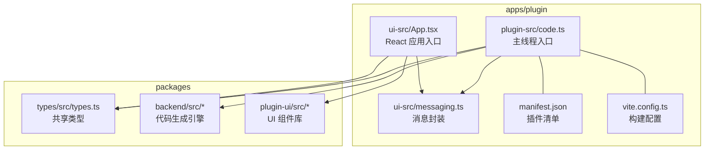
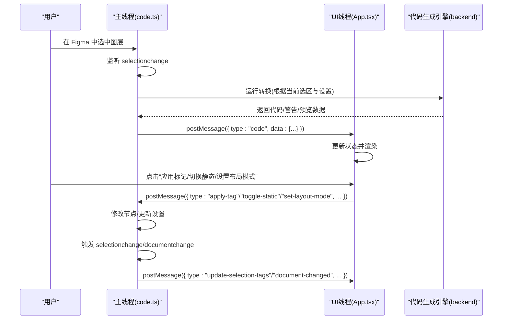
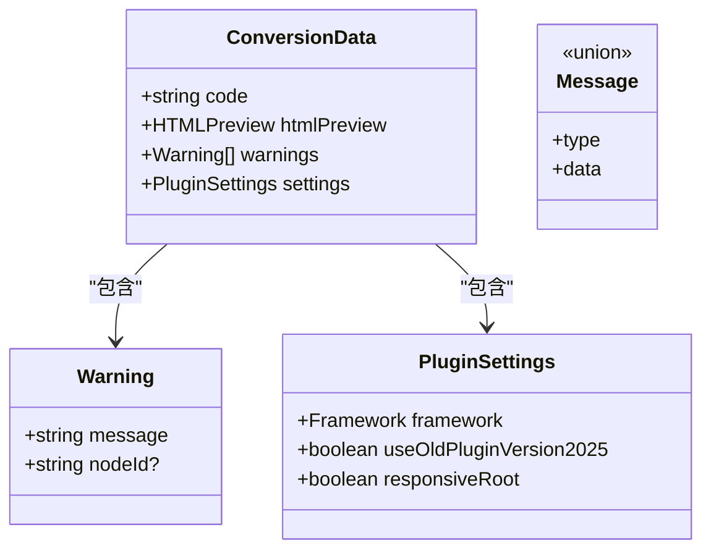
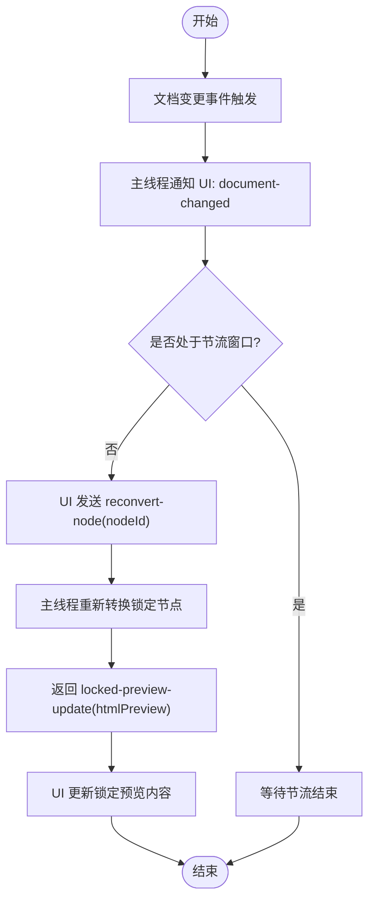
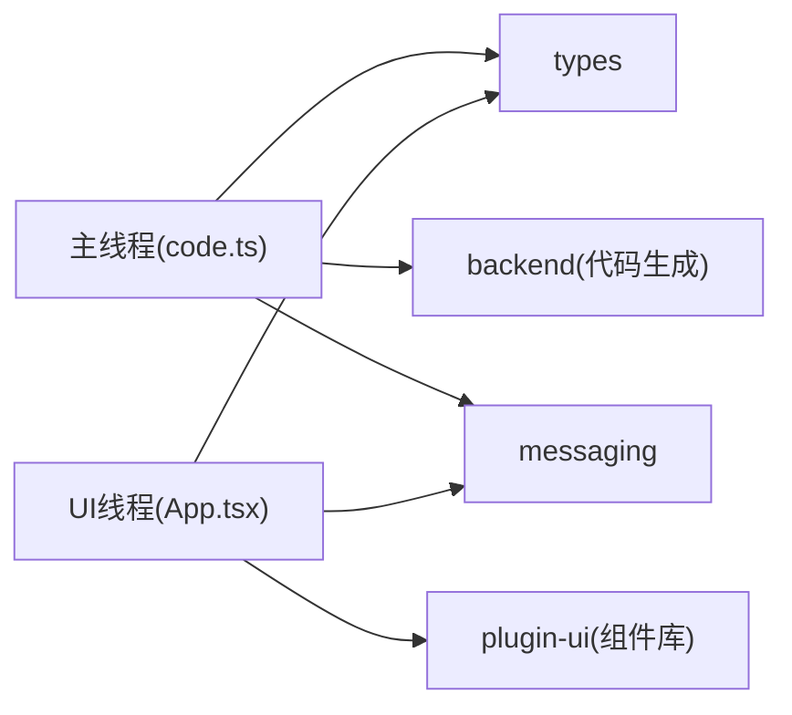

# 插件架构设计

<cite>
**本文引用的文件**   
- [Figma插件架构.md](file://docs/项目文档/figma插件/技术/Figma插件架构.md)
- [INDEX.md](file://docs/项目文档/figma插件/INDEX.md)
</cite>

## 目录
1. [简介](#简介)
2. [项目结构](#项目结构)
3. [核心组件](#核心组件)
4. [架构总览](#架构总览)
5. [详细组件分析](#详细组件分析)
6. [依赖关系分析](#依赖关系分析)
7. [性能考量](#性能考量)
8. [故障排查指南](#故障排查指南)
9. [结论](#结论)
10. [附录](#附录)

## 简介
本文件面向 Figma 插件的双线程架构，系统性阐述主线程与 UI 线程的职责分离、通信机制与消息类型定义；覆盖主线程的初始化流程、事件监听与代码生成触发逻辑；描述 UI 线程的 React 应用结构与状态管理、用户交互处理；并提供完整的消息传递协议规范（包含 ConversionData、Warning、PluginSettings 等核心数据结构）以及构建配置、开发环境搭建与调试技巧。

## 项目结构
插件采用“双工程 + 共享包”的组织方式：
- apps/plugin：插件本体，包含主线程与 UI 线程源码、清单与构建配置
- packages/types：跨端共享的类型定义
- packages/backend：代码生成引擎（HTML/Tailwind 等）
- packages/plugin-ui：UI 组件库（被 UI 线程引用）

图表来源
- [Figma插件架构.md:269-320](file://docs/项目文档/figma插件/技术/Figma插件架构.md#L269-L320)

章节来源
- [Figma插件架构.md:269-320](file://docs/项目文档/figma插件/技术/Figma插件架构.md#L269-L320)
- [INDEX.md:17-34](file://docs/项目文档/figma插件/INDEX.md#L17-L34)

## 核心组件
- 主线程（Main Thread）
  - 负责初始化设置、监听 Figma 选区变化、调用代码生成引擎、与 UI 线程通信
  - 生命周期包括读取用户设置、显示 UI、注册事件监听与消息处理
- UI 线程（UI Thread）
  - 基于 React 渲染界面，处理用户交互，向主线程发送指令，展示代码生成结果
  - 通过 window.onmessage 接收来自主线程的消息并更新状态

章节来源
- [Figma插件架构.md:41-98](file://docs/项目文档/figma插件/技术/Figma插件架构.md#L41-L98)

## 架构总览
双线程通过 postMessage/onmessage 进行通信，主线程持有 Figma API 访问能力，UI 线程专注交互与预览。

图表来源
- [Figma插件架构.md:199-266](file://docs/项目文档/figma插件/技术/Figma插件架构.md#L199-L266)

## 详细组件分析

### 主线程（Main Thread）
- 职责
  - 初始化：从 clientStorage 读取用户设置
  - 显示 UI：showUI()
  - 事件监听：selectionchange、currentpagechange、documentchange
  - 消息处理：响应 UI 指令（应用标签、切换静态、设置布局模式、检查图层、选择图层、重转换节点、更新设置）
  - 代码生成：调用后端引擎，产出代码、HTML 预览与警告
- 关键流程
  - 选区变化 → 生成代码 → 推送 code 消息
  - 文档变更 → 通知 UI → UI 节流后请求 reconvert-node → 返回 locked-preview-update
- 错误处理
  - 异常时向 UI 推送 error 消息，便于前端提示

章节来源
- [Figma插件架构.md:41-98](file://docs/项目文档/figma插件/技术/Figma插件架构.md#L41-L98)
- [Figma插件架构.md:199-266](file://docs/项目文档/figma插件/技术/Figma插件架构.md#L199-L266)

### UI 线程（UI Thread）
- 职责
  - 渲染 React 应用（App.tsx），维护本地状态
  - 监听 message 事件，分发到对应处理器
  - 用户交互：应用标签、切换静态、设置布局模式、AI 指令编辑、检查图层、按 ID/警告定位图层、锁定预览与重转换
  - 展示代码、HTML 预览与警告列表
- 启动流程
  - main.tsx 创建 React Root → 渲染 App → 注册 message 监听 → 初始化状态 → 渲染 PluginUI

章节来源
- [Figma插件架构.md:70-98](file://docs/项目文档/figma插件/技术/Figma插件架构.md#L70-L98)

### 消息传递协议
- 主线程 → UI 线程
  - code：携带 ConversionData（code、htmlPreview、warnings、settings）
  - empty：清空状态
  - error：携带错误信息字符串
  - update-selection-tags：更新当前选区标签与上下文信息
  - check-layers-result：返回图层检查结果（warnings）
  - document-changed：文档变更通知
  - locked-preview-update：锁定预览更新（htmlPreview）
- UI 线程 → 主线程
  - apply-tag：应用标签
  - toggle-static：切换静态模式
  - set-layout-mode：设置布局模式
  - update-ai-instruction：更新 AI 指令文本
  - check-layers：请求检查图层
  - select-layer-by-id / select-layer-by-warning：定位图层
  - reconvert-node：对指定节点重新转换
  - update-settings：更新插件设置（key/value）

图表来源
- [Figma插件架构.md:101-197](file://docs/项目文档/figma插件/技术/Figma插件架构.md#L101-L197)

章节来源
- [Figma插件架构.md:101-197](file://docs/项目文档/figma插件/技术/Figma插件架构.md#L101-L197)

### 复杂逻辑流程图（文档变更与锁定预览）

图表来源
- [Figma插件架构.md:240-266](file://docs/项目文档/figma插件/技术/Figma插件架构.md#L240-L266)

## 依赖关系分析
- 模块耦合
  - 主线程依赖 types（共享类型）、backend（代码生成）、messaging（消息封装）
  - UI 线程依赖 types、plugin-ui（组件库）、messaging
- 外部集成点
  - Figma 运行时 API（选区、页面、文档事件）
  - 浏览器消息通道（postMessage/onmessage）

图表来源
- [Figma插件架构.md:269-320](file://docs/项目文档/figma插件/技术/Figma插件架构.md#L269-L320)

章节来源
- [Figma插件架构.md:269-320](file://docs/项目文档/figma插件/技术/Figma插件架构.md#L269-L320)

## 性能考量
- 节流与去抖：文档变更频繁时，UI 侧对 reconvert-node 请求进行节流，避免重复计算
- 局部重算：仅对锁定节点或受影响的子树进行重转换，减少全量生成开销
- 预览增量更新：使用 locked-preview-update 精准替换预览片段，降低 DOM 重排成本
- 资源与缓存：利用 clientStorage 持久化设置，减少重复读取与网络往返

[本节为通用指导，不直接分析具体文件]

## 故障排查指南
- 主线程调试
  - 使用 console.log 输出关键变量
  - 使用 figma.notify 弹出原生提示
- UI 线程调试
  - 使用浏览器 DevTools（右键插件 → Inspect Plugin）
  - 在 messaging 层统一打印出入站消息
- 常见问题
  - 消息未到达：确认 postMessage 目标与 onmessage 监听是否匹配
  - 状态不同步：检查 document-changed 与 reconvert-node 的节流策略
  - 类型不一致：确保 shared types 版本一致

章节来源
- [Figma插件架构.md:392-418](file://docs/项目文档/figma插件/技术/Figma插件架构.md#L392-L418)

## 结论
该插件以清晰的双线程边界与强类型的消息协议实现高内聚低耦合：主线程聚焦 Figma API 与代码生成，UI 线程专注交互与预览。通过完善的消息类型与事件流，既保证了可维护性，也为后续扩展（多框架、更多校验规则）预留了空间。

[本节为总结性内容，不直接分析具体文件]

## 附录

### 构建与部署
- 开发模式
  - 进入插件目录，启动 UI 开发服务器
  - 在 Figma 中添加开发插件，指向 manifest.json
- 生产构建
  - 执行构建脚本，产物输出至 dist（包含 code.js、index.html）
- 发布流程
  - 构建生产版本
  - 在 Figma 开发者面板创建新版本
  - 上传 dist 目录内容
  - 提交审核或内部分发

章节来源
- [Figma插件架构.md:359-389](file://docs/项目文档/figma插件/技术/Figma插件架构.md#L359-L389)

### 类型系统与共享约定
- 共享类型位于 packages/types/src/types.ts
- 通过 TypeScript Project References 在各子项目中复用
- 核心类型包括 Framework、PluginSettings、AssetUploadSettings 等

章节来源
- [Figma插件架构.md:324-355](file://docs/项目文档/figma插件/技术/Figma插件架构.md#L324-L355)