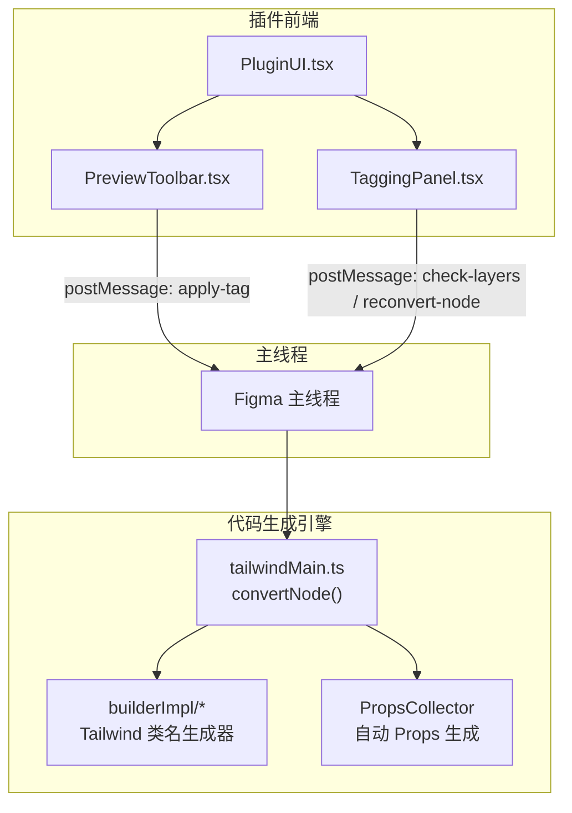
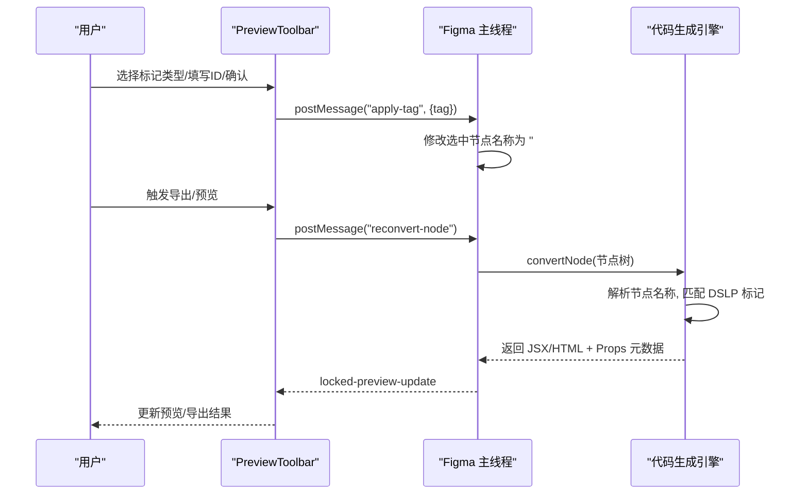
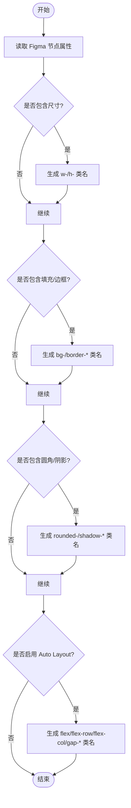
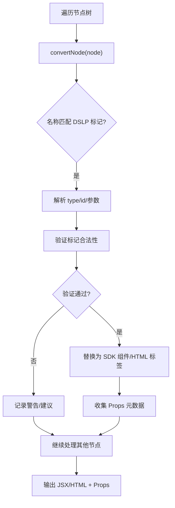
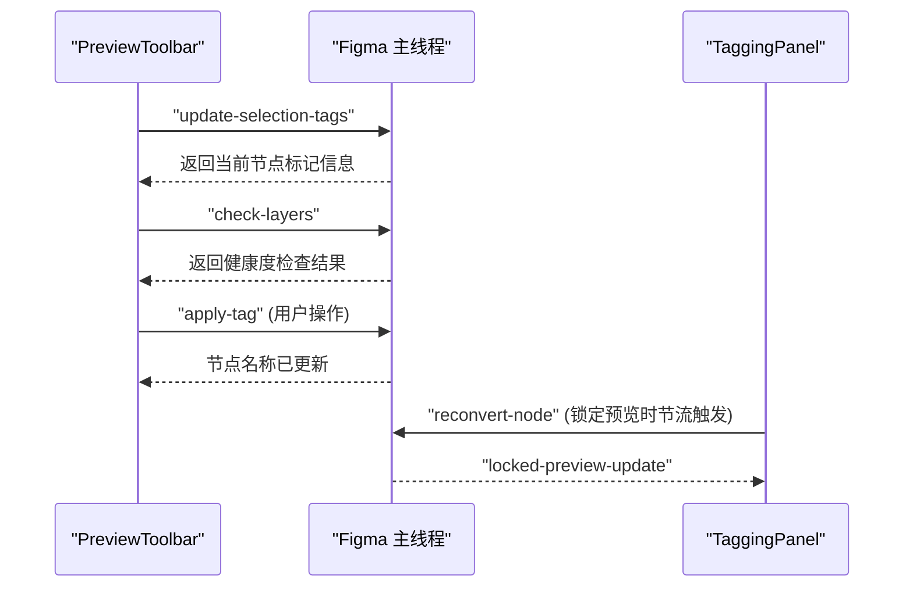
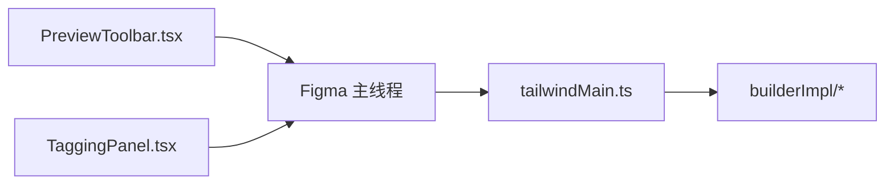

# 标记系统

<cite>
**本文引用的文件**
- [Figma插件.md](file://docs/项目文档/figma插件/Figma插件.md)
- [标记系统.md](file://docs/项目文档/figma插件/技术/标记系统.md)
- [代码生成引擎.md](file://docs/项目文档/figma插件/技术/代码生成引擎.md)
- [UI组件与交互.md](file://docs/项目文档/figma插件/技术/UI组件与交互.md)
- [Figma插件架构.md](file://docs/项目文档/figma插件/技术/Figma插件架构.md)
</cite>

## 目录
1. [简介](#简介)
2. [项目结构](#项目结构)
3. [核心组件](#核心组件)
4. [架构总览](#架构总览)
5. [详细组件分析](#详细组件分析)
6. [依赖关系分析](#依赖关系分析)
7. [性能考虑](#性能考虑)
8. [故障排查指南](#故障排查指南)
9. [结论](#结论)
10. [附录](#附录)

## 简介
本文件面向 Figma 插件的“标记系统”，系统性阐述节点命名规范、DSL 标记语法（如 #slot、#img、#button 等内置标记）、自定义标记扩展机制、属性映射规则（样式到 CSS/Tailwind 类名转换）、解析引擎实现原理（AST 构建、标记提取与验证流程）、优先级与冲突解决策略，并提供复杂组件的实战案例与最佳实践。目标是帮助设计师与开发者在 Figma 中通过“命名即标记”的方式，驱动高质量的前端代码生成与配置面板自动生成。

## 项目结构
标记系统由“插件 UI 层”和“代码生成引擎”两部分协同工作：
- 插件 UI 层负责提供交互式标记应用界面、状态管理与消息通信；
- 代码生成引擎负责解析节点名称中的 DSLP 标记，构建 AST，执行标记拦截与替换，并输出目标代码（React/HTML）及 Props 元数据。

图表来源
- [UI组件与交互.md:1-139](file://docs/项目文档/figma插件/技术/UI组件与交互.md#L1-L139)
- [标记系统.md:1-40](file://docs/项目文档/figma插件/技术/标记系统.md#L1-L40)
- [代码生成引擎.md:100-122](file://docs/项目文档/figma插件/技术/代码生成引擎.md#L100-L122)

章节来源
- [UI组件与交互.md:1-139](file://docs/项目文档/figma插件/技术/UI组件与交互.md#L1-L139)
- [标记系统.md:1-40](file://docs/项目文档/figma插件/技术/标记系统.md#L1-L40)

## 核心组件
- 预览工具栏（PreviewToolbar）：承载标记操作入口（切图、配置项、动态布局、提示词、导出），维护当前选中节点的标记类型与 ID、AI 指令、静态图片开关、Auto Layout 模式等状态。
- 更多面板（TaggingPanel）：展示优化建议与高级设置（代码格式切换、Tailwind 相关选项）。
- 代码生成引擎（tailwindMain.ts 等）：在 convertNode 阶段识别 DSLP 标记，进行 AST 构建、标记拦截与替换，并输出 React/HTML 代码与 Props 元数据。

章节来源
- [标记系统.md:16-37](file://docs/项目文档/figma插件/技术/标记系统.md#L16-L37)
- [UI组件与交互.md:121-139](file://docs/项目文档/figma插件/技术/UI组件与交互.md#L121-L139)
- [代码生成引擎.md:100-122](file://docs/项目文档/figma插件/技术/代码生成引擎.md#L100-L122)

## 架构总览
标记系统的整体流程如下：用户在 UI 中选择标记类型并输入 ID，UI 通过 postMessage 将操作下发至主线程；主线程修改选中节点名称为 DSLP 标记字符串；代码生成引擎在转换过程中解析节点名称，识别标记并执行相应替换逻辑，最终输出目标代码与 Props。

图表来源
- [Figma插件架构.md:224-227](file://docs/项目文档/figma插件/技术/Figma插件架构.md#L224-L227)
- [代码生成引擎.md:219-222](file://docs/项目文档/figma插件/技术/代码生成引擎.md#L219-L222)
- [UI组件与交互.md:180-189](file://docs/项目文档/figma插件/技术/UI组件与交互.md#L180-L189)

## 详细组件分析

### 节点命名规范与 DSLP 标记语法
- 命名约定：标记信息以“#前缀”形式嵌入节点名称，例如：
  - #slot:type:id：内容插槽（图片、文本、视频、Lottie、Svga、Unity、色值等）
  - #list:id：列表容器，递归渲染子节点
  - #static：静态图片，导出为 
  - #prompt：AI 指令，转换为 JSX 注释
  - #ignore：跳过该节点
- 示例映射（节选）：
  - #slot:img:avatar → <SdkImage id="avatar" />
  - #slot:text:title → <SdkText id="title">...</SdkText>
  - #slot:video:trailer → <SdkVideo id="trailer" />
  - #slot:lottie:loading → <SdkLottie id="loading" />
- 自定义标记扩展：
  - 在代码生成引擎的 convertNode 中添加新的拦截器；
  - 实现对应 SDK 组件渲染逻辑；
  - 在 TaggingPanel 或 PreviewToolbar 中补充 UI 支持。

章节来源
- [Figma插件.md:42-68](file://docs/项目文档/figma插件/Figma插件.md#L42-L68)
- [标记系统.md:48-60](file://docs/项目文档/figma插件/技术/标记系统.md#L48-L60)
- [代码生成引擎.md:110-122](file://docs/项目文档/figma插件/技术/代码生成引擎.md#L110-L122)
- [代码生成引擎.md:216-222](file://docs/项目文档/figma插件/技术/代码生成引擎.md#L216-L222)

### 属性映射规则（样式到 CSS/Tailwind 类名）
- 尺寸与位置：width/height → Tailwind w-/h-；x/y → absolute/relative 定位
- 填充与边框：fills → bg-color/background-image；strokes → border-color/border-width
- 圆角与阴影：radius → rounded-*；effects → shadow-*
- 布局与间距：layoutMode → flex/flex-row/flex-col；itemSpacing → gap-x/gap-y；padding → pl/pr/pt/pb
- 自动布局（Auto Layout）到 Flexbox 的映射详见下表。

图表来源
- [代码生成引擎.md:171-199](file://docs/项目文档/figma插件/技术/代码生成引擎.md#L171-L199)

章节来源
- [代码生成引擎.md:171-199](file://docs/项目文档/figma插件/技术/代码生成引擎.md#L171-L199)

### 标记解析引擎实现原理（AST 构建、标记提取与验证）
- AST 构建：遍历 Figma 节点树，构建抽象语法树；
- 标记提取：在 convertNode 阶段对节点名称进行正则匹配（如 /#slot:(.*)/），识别 DSLP 标记；
- 标记验证：校验标记语法合法性（type、id 必填、唯一性等），并生成警告与建议；
- 替换与输出：根据标记类型替换为对应 SDK 组件或 HTML 标签，同时收集 Props 元数据用于自动生成 interface Props。

图表来源
- [Figma插件.md:68-68](file://docs/项目文档/figma插件/Figma插件.md#L68-L68)
- [代码生成引擎.md:110-122](file://docs/项目文档/figma插件/技术/代码生成引擎.md#L110-L122)
- [代码生成引擎.md:135-151](file://docs/项目文档/figma插件/技术/代码生成引擎.md#L135-L151)

章节来源
- [Figma插件.md:68-68](file://docs/项目文档/figma插件/Figma插件.md#L68-L68)
- [代码生成引擎.md:110-151](file://docs/项目文档/figma插件/技术/代码生成引擎.md#L110-L151)

### 标记优先级与冲突解决策略
- 优先级顺序（从高到低）：
  1) #ignore：直接跳过节点，不参与后续处理；
  2) #prompt：转换为 JSX 注释，不影响 DOM 结构；
  3) #slot:type:id：替换为具体 SDK 组件；
  4) #list:id：作为容器递归渲染子节点；
  5) #static：导出为图片并以  渲染。
- 冲突解决：
  - 同一节点仅允许一个“行为型”标记生效（#ignore/#prompt/#slot/#list/#static 互斥）；
  - 若出现多个标记，按上述优先级取最高者；
  - 对于 #slot 与 #list 的组合，优先将父节点视为 #list 容器，子节点再按各自标记处理；
  - 重复 id 检测：在同一作用域内，相同 id 会触发警告，建议重命名以避免运行时冲突。

章节来源
- [代码生成引擎.md:110-122](file://docs/项目文档/figma插件/技术/代码生成引擎.md#L110-L122)

### 交互流程与状态管理
- 检测当前选中节点：
  - 发送 "update-selection-tags" 消息；
  - 解析节点名称，提取标记信息；
  - 更新 UI 状态并触发图层健康度检查（"check-layers"）。
- 应用标记：
  - 用户点击 [配置项] → 选择类型 → 输入 ID → 确定；
  - 发送 "apply-tag" 消息到主线程；
  - 修改选中节点名称为 "#slot:img:avatar"；
  - 触发代码重新生成。
- 自动布局模式切换：
  - NONE：绝对定位（Canvas）；
  - HORIZONTAL：水平排列（List）；
  - VERTICAL：垂直排列（List）。
- 状态管理：
  - PreviewToolbar 管理标记类型、ID、AI 指令、静态图片开关、当前标记类型、Auto Layout 模式等；
  - TaggingPanel 管理检查警告与高级设置展开状态。

图表来源
- [标记系统.md:88-137](file://docs/项目文档/figma插件/技术/标记系统.md#L88-L137)
- [UI组件与交互.md:140-189](file://docs/项目文档/figma插件/技术/UI组件与交互.md#L140-L189)

章节来源
- [标记系统.md:88-137](file://docs/项目文档/figma插件/技术/标记系统.md#L88-L137)
- [UI组件与交互.md:140-189](file://docs/项目文档/figma插件/技术/UI组件与交互.md#L140-L189)

### Props 自动生成与元数据
- 设计目标：
  - 在生成 JSX 的同时自动生成 interface Props；
  - 每个字段附带元数据注释（@title/@format/@widget/@group/@order）；
  - AI 工作台可直接编译配置面板，减少对 AI 二次补全的依赖。
- 字段映射示例（节选）：
  - #slot:img:hero_banner → heroBanner: string（@format uri @widget image-upload）
  - #slot:text:title → title: string（@format string @widget input）
  - #slot:video:hero_video → heroVideo: string（@format uri @widget video-upload）
- 手动覆盖：
  - 支持语法 #slot:img:banner[Banner区域]（#list 同样支持）。

章节来源
- [代码生成引擎.md:124-151](file://docs/项目文档/figma插件/技术/代码生成引擎.md#L124-L151)

### 实际案例与最佳实践
- 复杂组件方案：
  - 使用 #list:id 作为外层容器，内部子节点分别使用 #slot:type:id 定义可替换内容；
  - 对需要忽略的装饰性节点添加 #ignore；
  - 对需要注入说明的节点添加 #prompt，便于 AI 理解意图。
- 最佳实践：
  - 统一命名规范：type 使用小写英文，id 使用语义化命名；
  - 避免重复 id：确保同一作用域内 id 唯一；
  - 合理使用 Auto Layout：结合 HORIZONTAL/VERTICAL 提升布局一致性；
  - 利用 Props 元数据：为配置面板提供清晰的字段标题与控件类型。

章节来源
- [Figma插件.md:42-68](file://docs/项目文档/figma插件/Figma插件.md#L42-L68)
- [代码生成引擎.md:110-151](file://docs/项目文档/figma插件/技术/代码生成引擎.md#L110-L151)

## 依赖关系分析
- 组件耦合与内聚：
  - PreviewToolbar 与 TaggingPanel 均依赖 PluginUI 的状态与消息通道；
  - 代码生成引擎独立于 UI，通过主线程调用，保持高内聚低耦合。
- 外部依赖与集成点：
  - 与 Figma 主线程通过 postMessage 通信；
  - 与 Tailwind 类名生成器（builderImpl/*）协作完成样式转换。

图表来源
- [UI组件与交互.md:121-139](file://docs/项目文档/figma插件/技术/UI组件与交互.md#L121-L139)
- [代码生成引擎.md:100-108](file://docs/项目文档/figma插件/技术/代码生成引擎.md#L100-L108)

章节来源
- [UI组件与交互.md:121-139](file://docs/项目文档/figma插件/技术/UI组件与交互.md#L121-L139)
- [代码生成引擎.md:100-108](file://docs/项目文档/figma插件/技术/代码生成引擎.md#L100-L108)

## 性能考虑
- 缓存机制：
  - 执行缓存：previousExecutionCache 存储已处理的样式，避免重复计算；
  - 资源缓存：上传后的图片资源通过 hash 缓存，避免重复上传。
- 并发控制：
  - 资源上传使用队列 + 并发限制（默认 5 个并发），防止大量图片同时导出导致内存溢出。

章节来源
- [代码生成引擎.md:202-213](file://docs/项目文档/figma插件/技术/代码生成引擎.md#L202-L213)

## 故障排查指南
- 常见问题与修复建议：
  - 未识别标记：检查图层命名是否为 #slot/#list 语法，而非普通文本名称；
  - 图片未正确导出：为图片添加 #static 标记或 #slot:img:xxx 标记；
  - 警告过多：根据优化建议调整结构（如将 Group 改为 Frame）；
  - 预览不更新：在锁定状态下，等待 500ms 节流后再触发 reconvert-node。
- 诊断步骤：
  - 打开“更多面板”，查看“优化建议”与“高级设置”；
  - 检查节点名称是否符合 DSLP 标记语法；
  - 确认主线程是否正确接收 apply-tag 与 reconvert-node 消息。

章节来源
- [Figma插件.md:55-68](file://docs/项目文档/figma插件/Figma插件.md#L55-L68)
- [UI组件与交互.md:180-189](file://docs/项目文档/figma插件/技术/UI组件与交互.md#L180-L189)

## 结论
标记系统通过“命名即标记”的设计，将 Figma 节点名称与前端代码生成紧密耦合，既保证了标记信息的持久化与可视化，又提升了代码生成的准确性与可维护性。配合 Props 自动生成与优化建议系统，显著降低了从设计到实现的沟通成本与返工率。未来可通过扩展 DSLP 标记与增强验证规则，进一步提升系统的灵活性与健壮性。

## 附录
- 术语表：
  - DSLP：Design-to-Source Language Prefix，设计到源码的语言前缀标记；
  - AST：Abstract Syntax Tree，抽象语法树；
  - Props：组件属性接口，用于驱动配置面板与运行时数据绑定。