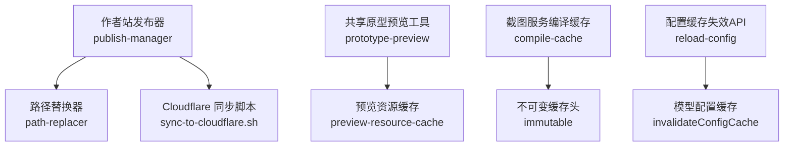
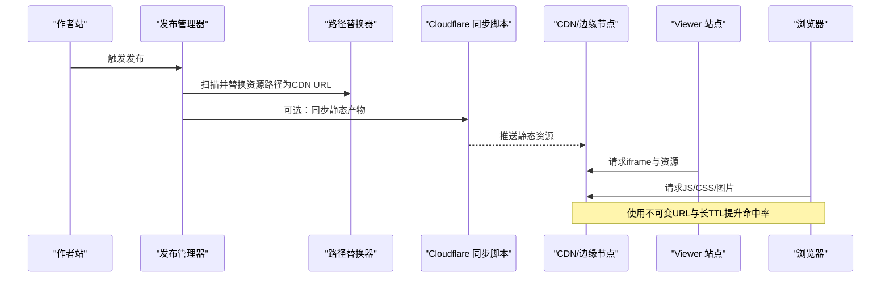
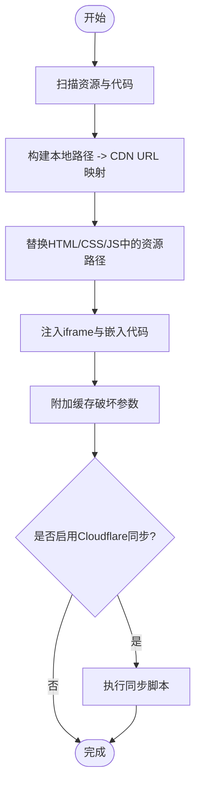
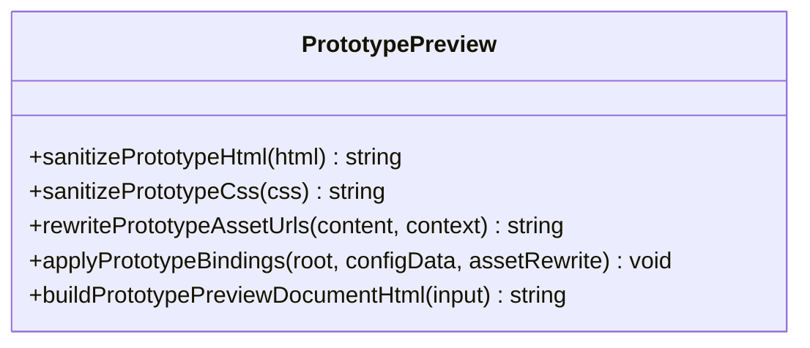
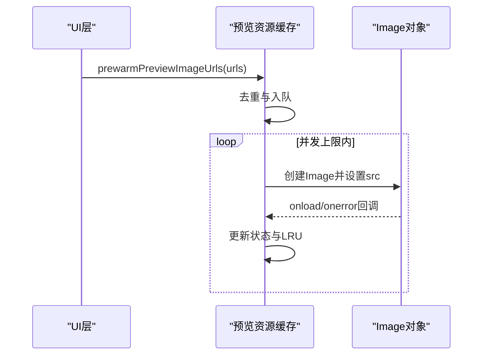
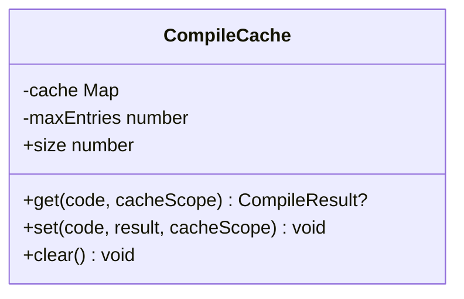
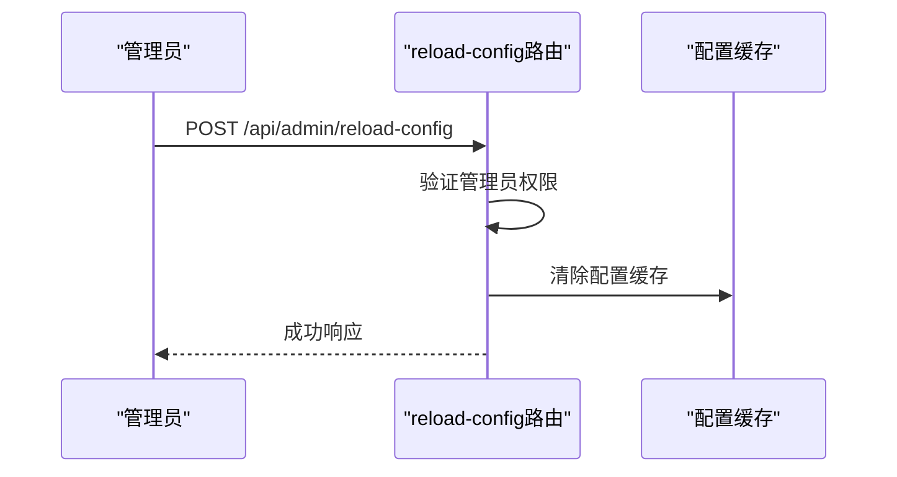
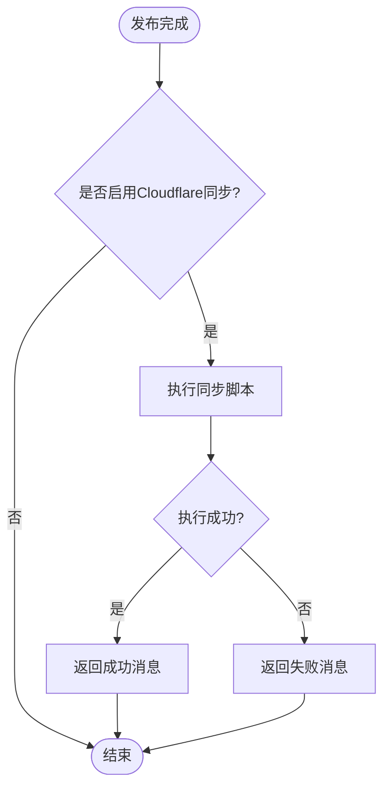
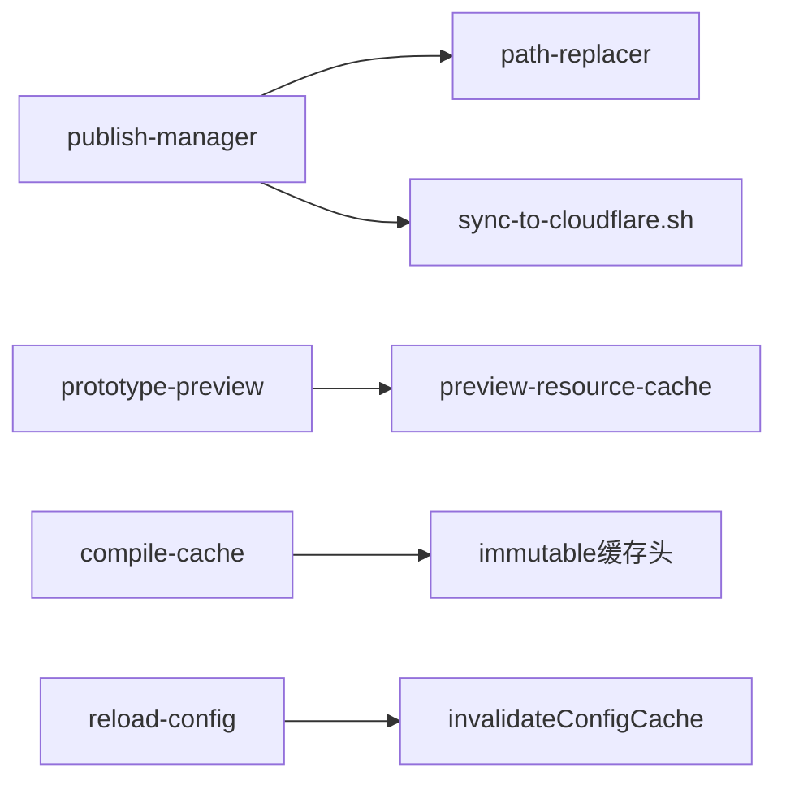

# CDN 集成策略

<cite>
**本文引用的文件**   
- [packages/author-site/src/lib/publish-manager.ts](file://packages/author-site/src/lib/publish-manager.ts)
- [packages/author-site/src/lib/publish/path-replacer.ts](file://packages/author-site/src/lib/publish/path-replacer.ts)
- [packages/shared/src/demo/prototype-preview.ts](file://packages/shared/src/demo/prototype-preview.ts)
- [packages/demo-ui/src/preview-resource-cache.ts](file://packages/demo-ui/src/preview-resource-cache.ts)
- [packages/screenshot-service/src/utils/compile-cache.ts](file://packages/screenshot-service/src/utils/compile-cache.ts)
- [packages/author-site/src/app/api/admin/reload-config/route.ts](file://packages/author-site/src/app/api/admin/reload-config/route.ts)
- [scripts/sync-to-cloudflare.sh](file://scripts/sync-to-cloudflare.sh)
- [docs/项目文档/figma插件/技术/资源处理与上传.md](file://docs/项目文档/figma插件/技术/资源处理与上传.md)
</cite>

## 目录
1. [简介](#简介)
2. [项目结构](#项目结构)
3. [核心组件](#核心组件)
4. [架构总览](#架构总览)
5. [详细组件分析](#详细组件分析)
6. [依赖关系分析](#依赖关系分析)
7. [性能考虑](#性能考虑)
8. [故障排查指南](#故障排查指南)
9. [结论](#结论)
10. [附录](#附录)

## 简介
本文件面向“CDN 集成策略”的技术文档，围绕以下目标展开：
- CDN URL 生成规则：域名配置、路径规范与版本管理
- 缓存策略设计：缓存头设置、TTL 配置与失效机制
- 资源引用替换逻辑：代码中资源路径自动更新与依赖维护
- 性能优化建议：预加载、压缩传输与边缘缓存策略
- 监控与故障转移：可观测性与降级方案

## 项目结构
本项目在多个模块中实现了与 CDN 相关的功能：
- 发布流程与产物构建：将本地资源映射为 CDN URL，并注入到产物中
- 预览与原型渲染：运行时对相对路径进行重写，指向工作区 API 或 CDN
- 前端资源预热：基于 LRU 的并发图片预热与缓存
- 服务端编译缓存：基于哈希的 LRU 编译结果缓存
- 配置缓存失效：提供管理接口强制刷新配置缓存
- Cloudflare Pages 同步：发布后触发静态站点同步至 CDN

**图表来源**
- [packages/author-site/src/lib/publish-manager.ts:260-658](file://packages/author-site/src/lib/publish-manager.ts#L260-L658)
- [packages/author-site/src/lib/publish/path-replacer.ts:1-77](file://packages/author-site/src/lib/publish/path-replacer.ts#L1-L77)
- [packages/shared/src/demo/prototype-preview.ts:100-158](file://packages/shared/src/demo/prototype-preview.ts#L100-L158)
- [packages/demo-ui/src/preview-resource-cache.ts:198-279](file://packages/demo-ui/src/preview-resource-cache.ts#L198-L279)
- [packages/screenshot-service/src/utils/compile-cache.ts:1-70](file://packages/screenshot-service/src/utils/compile-cache.ts#L1-L70)
- [packages/author-site/src/app/api/admin/reload-config/route.ts:1-45](file://packages/author-site/src/app/api/admin/reload-config/route.ts#L1-L45)
- [scripts/sync-to-cloudflare.sh](file://scripts/sync-to-cloudflare.sh)

**章节来源**
- [packages/author-site/src/lib/publish-manager.ts:260-658](file://packages/author-site/src/lib/publish-manager.ts#L260-L658)
- [packages/author-site/src/lib/publish/path-replacer.ts:1-77](file://packages/author-site/src/lib/publish/path-replacer.ts#L1-L77)
- [packages/shared/src/demo/prototype-preview.ts:100-158](file://packages/shared/src/demo/prototype-preview.ts#L100-L158)
- [packages/demo-ui/src/preview-resource-cache.ts:198-279](file://packages/demo-ui/src/preview-resource-cache.ts#L198-L279)
- [packages/screenshot-service/src/utils/compile-cache.ts:1-70](file://packages/screenshot-service/src/utils/compile-cache.ts#L1-L70)
- [packages/author-site/src/app/api/admin/reload-config/route.ts:1-45](file://packages/author-site/src/app/api/admin/reload-config/route.ts#L1-L45)
- [scripts/sync-to-cloudflare.sh](file://scripts/sync-to-cloudflare.sh)

## 核心组件
- 发布管理器（publish-manager）
  - 负责读取项目元数据、编译页面、处理图片资源、生成 iframe 与嵌入代码，并在可选环境下同步到 Cloudflare Pages。
  - 关键行为：
    - 使用时间戳参数作为资产缓存破坏参数，确保新版本资源不被旧缓存命中。
    - 根据环境变量选择预览运行时的来源（本地或 CDN）。
    - 调用路径替换器将本地相对路径替换为已上传资源的 CDN URL。
- 路径替换器（path-replacer）
  - 针对 HTML/CSS/JS 中的 img src、CSS url()、import 语句进行正则匹配与替换。
  - 仅替换存在于映射表中的路径，避免误改外部链接。
- 原型预览工具（prototype-preview）
  - 在浏览器端将相对资源路径重写为工作区 API 地址，支持 data-bind-* 动态绑定。
- 预览资源缓存（preview-resource-cache）
  - 提取页面与配置中的图片 URL，按 LRU 限制大小，并发预加载图片以提升首屏体验。
- 编译缓存（compile-cache）
  - 在服务端以代码哈希为键缓存编译结果，LRU 淘汰，减少重复编译开销。
- 配置缓存失效 API（reload-config）
  - 提供受保护的 POST 接口，清除配置缓存，使新配置立即生效。
- Cloudflare 同步脚本（sync-to-cloudflare.sh）
  - 由发布流程触发，将静态产物同步到 Cloudflare Pages 站点。

**章节来源**
- [packages/author-site/src/lib/publish-manager.ts:260-658](file://packages/author-site/src/lib/publish-manager.ts#L260-L658)
- [packages/author-site/src/lib/publish/path-replacer.ts:1-77](file://packages/author-site/src/lib/publish/path-replacer.ts#L1-L77)
- [packages/shared/src/demo/prototype-preview.ts:100-158](file://packages/shared/src/demo/prototype-preview.ts#L100-L158)
- [packages/demo-ui/src/preview-resource-cache.ts:198-279](file://packages/demo-ui/src/preview-resource-cache.ts#L198-L279)
- [packages/screenshot-service/src/utils/compile-cache.ts:1-70](file://packages/screenshot-service/src/utils/compile-cache.ts#L1-L70)
- [packages/author-site/src/app/api/admin/reload-config/route.ts:1-45](file://packages/author-site/src/app/api/admin/reload-config/route.ts#L1-L45)
- [scripts/sync-to-cloudflare.sh](file://scripts/sync-to-cloudflare.sh)

## 架构总览
下图展示了从发布到 CDN 分发的整体流程，以及运行时资源访问与缓存策略。

**图表来源**
- [packages/author-site/src/lib/publish-manager.ts:260-658](file://packages/author-site/src/lib/publish-manager.ts#L260-L658)
- [packages/author-site/src/lib/publish/path-replacer.ts:1-77](file://packages/author-site/src/lib/publish/path-replacer.ts#L1-L77)
- [scripts/sync-to-cloudflare.sh](file://scripts/sync-to-cloudflare.sh)

## 详细组件分析

### 组件A：发布与路径替换（publish-manager + path-replacer）
- 职责
  - 收集资源、编译代码、生成产物、替换资源路径、写入项目元数据、可选同步到 Cloudflare。
- 关键点
  - 资源路径替换：通过 Map 映射本地相对路径到最终 CDN URL；仅在映射存在时替换，避免误改外部链接。
  - 版本管理：为 JS/CSS/HTML 添加时间戳查询参数，实现缓存破坏。
  - 运行时来源：根据环境变量决定预览运行时是否来自 CDN。
- 流程图

**图表来源**
- [packages/author-site/src/lib/publish-manager.ts:260-658](file://packages/author-site/src/lib/publish-manager.ts#L260-L658)
- [packages/author-site/src/lib/publish/path-replacer.ts:1-77](file://packages/author-site/src/lib/publish/path-replacer.ts#L1-L77)

**章节来源**
- [packages/author-site/src/lib/publish-manager.ts:260-658](file://packages/author-site/src/lib/publish-manager.ts#L260-L658)
- [packages/author-site/src/lib/publish/path-replacer.ts:1-77](file://packages/author-site/src/lib/publish/path-replacer.ts#L1-L77)

### 组件B：运行时资源路径重写（prototype-preview）
- 职责
  - 在浏览器端将相对资源路径重写为工作区 API 地址，支持 data-bind-* 动态绑定。
- 关键点
  - 仅对相对路径且为图片扩展名的值进行重写。
  - 支持 origin 前缀拼接，便于跨域场景。
- 类图

**图表来源**
- [packages/shared/src/demo/prototype-preview.ts:100-158](file://packages/shared/src/demo/prototype-preview.ts#L100-L158)
- [packages/shared/src/demo/prototype-preview.ts:193-270](file://packages/shared/src/demo/prototype-preview.ts#L193-L270)

**章节来源**
- [packages/shared/src/demo/prototype-preview.ts:100-158](file://packages/shared/src/demo/prototype-preview.ts#L100-L158)
- [packages/shared/src/demo/prototype-preview.ts:193-270](file://packages/shared/src/demo/prototype-preview.ts#L193-L270)

### 组件C：预览资源预热与缓存（preview-resource-cache）
- 职责
  - 提取页面与配置中的图片 URL，去重并按 LRU 限制缓存体积，并发预加载图片。
- 关键点
  - 并发控制：最大并发数限制，避免过多请求影响主线程。
  - LRU 清理：超过阈值时按最后使用时间淘汰非 loading 项。
  - 失败容忍：单个图片预热失败不影响其他任务。
- 序列图

**图表来源**
- [packages/demo-ui/src/preview-resource-cache.ts:198-279](file://packages/demo-ui/src/preview-resource-cache.ts#L198-L279)

**章节来源**
- [packages/demo-ui/src/preview-resource-cache.ts:198-279](file://packages/demo-ui/src/preview-resource-cache.ts#L198-L279)

### 组件D：服务端编译缓存（compile-cache）
- 职责
  - 以代码哈希为键缓存编译结果，LRU 淘汰，降低重复编译成本。
- 关键点
  - 哈希范围：包含作用域与代码内容，保证不同上下文不冲突。
  - 容量控制：达到上限时删除最旧的条目。
- 类图

**图表来源**
- [packages/screenshot-service/src/utils/compile-cache.ts:1-70](file://packages/screenshot-service/src/utils/compile-cache.ts#L1-L70)

**章节来源**
- [packages/screenshot-service/src/utils/compile-cache.ts:1-70](file://packages/screenshot-service/src/utils/compile-cache.ts#L1-L70)

### 组件E：配置缓存失效（reload-config）
- 职责
  - 提供受保护的 POST 接口，清除配置缓存，使新配置立即生效。
- 关键点
  - 权限校验：未授权返回 401。
  - 错误处理：异常时返回 500 并记录日志。
- 序列图

**图表来源**
- [packages/author-site/src/app/api/admin/reload-config/route.ts:1-45](file://packages/author-site/src/app/api/admin/reload-config/route.ts#L1-L45)

**章节来源**
- [packages/author-site/src/app/api/admin/reload-config/route.ts:1-45](file://packages/author-site/src/app/api/admin/reload-config/route.ts#L1-L45)

### 组件F：Cloudflare 同步（sync-to-cloudflare.sh）
- 职责
  - 由发布流程触发，将静态产物同步到 Cloudflare Pages 站点。
- 关键点
  - 超时保护：设置合理超时，避免长时间阻塞。
  - 环境变量：传递站点名称等必要参数。
- 流程图

**图表来源**
- [packages/author-site/src/lib/publish-manager.ts:737-776](file://packages/author-site/src/lib/publish-manager.ts#L737-L776)
- [scripts/sync-to-cloudflare.sh](file://scripts/sync-to-cloudflare.sh)

**章节来源**
- [packages/author-site/src/lib/publish-manager.ts:737-776](file://packages/author-site/src/lib/publish-manager.ts#L737-L776)
- [scripts/sync-to-cloudflare.sh](file://scripts/sync-to-cloudflare.sh)

## 依赖关系分析
- 发布管理器依赖路径替换器与 Cloudflare 同步脚本。
- 原型预览工具在浏览器端重写资源路径，与预览资源缓存协同提升性能。
- 截图服务的编译缓存独立于发布流程，但同样受益于不可变 URL 与长 TTL。
- 配置缓存失效 API 与模型配置缓存交互，确保配置变更即时生效。

**图表来源**
- [packages/author-site/src/lib/publish-manager.ts:260-658](file://packages/author-site/src/lib/publish-manager.ts#L260-L658)
- [packages/author-site/src/lib/publish/path-replacer.ts:1-77](file://packages/author-site/src/lib/publish/path-replacer.ts#L1-L77)
- [packages/shared/src/demo/prototype-preview.ts:100-158](file://packages/shared/src/demo/prototype-preview.ts#L100-L158)
- [packages/demo-ui/src/preview-resource-cache.ts:198-279](file://packages/demo-ui/src/preview-resource-cache.ts#L198-L279)
- [packages/screenshot-service/src/utils/compile-cache.ts:1-70](file://packages/screenshot-service/src/utils/compile-cache.ts#L1-L70)
- [packages/author-site/src/app/api/admin/reload-config/route.ts:1-45](file://packages/author-site/src/app/api/admin/reload-config/route.ts#L1-L45)

**章节来源**
- [packages/author-site/src/lib/publish-manager.ts:260-658](file://packages/author-site/src/lib/publish-manager.ts#L260-L658)
- [packages/author-site/src/lib/publish/path-replacer.ts:1-77](file://packages/author-site/src/lib/publish/path-replacer.ts#L1-L77)
- [packages/shared/src/demo/prototype-preview.ts:100-158](file://packages/shared/src/demo/prototype-preview.ts#L100-L158)
- [packages/demo-ui/src/preview-resource-cache.ts:198-279](file://packages/demo-ui/src/preview-resource-cache.ts#L198-L279)
- [packages/screenshot-service/src/utils/compile-cache.ts:1-70](file://packages/screenshot-service/src/utils/compile-cache.ts#L1-L70)
- [packages/author-site/src/app/api/admin/reload-config/route.ts:1-45](file://packages/author-site/src/app/api/admin/reload-config/route.ts#L1-L45)

## 性能考虑
- 预加载与并发控制
  - 使用并发队列限制同时加载的图片数量，避免阻塞主线程。
  - 利用 decode API 加速解码，提高首屏渲染速度。
- 不可变缓存与长 TTL
  - 对带哈希或时间戳的资源设置 long max-age 与 immutable，提升边缘缓存命中率。
- 压缩传输
  - 建议在 CDN 层开启 gzip/br 压缩，减少传输体积。
- 边缘缓存策略
  - 对静态资源启用强缓存，对动态 API 使用短 TTL 或协商缓存。
- 资源指纹与版本管理
  - 文件名或查询参数中包含版本信息，确保更新后立即生效。

[本节为通用指导，无需具体文件来源]

## 故障排查指南
- CDN 资源加载失败
  - 在 iframe 内捕获 error 事件，回传失败依赖名称，采用降级策略继续渲染或提示用户。
- React 渲染错误
  - 使用 Error Boundary 捕获错误，通过 postMessage 回传详情，父窗口显示友好提示，不清空上一个成功渲染结果。
- 配置缓存未刷新
  - 调用配置缓存失效 API，确认权限校验通过并检查服务端日志。
- 编译缓存未命中
  - 检查哈希作用域与代码内容是否一致，确认 LRU 淘汰策略未误删热点条目。

**章节来源**
- [docs/复盘文档/预览引擎/iframe沙箱与动态CDN编译策略.md:172-179](file://docs/复盘文档/预览引擎/iframe沙箱与动态CDN编译策略.md#L172-L179)
- [packages/author-site/src/app/api/admin/reload-config/route.ts:1-45](file://packages/author-site/src/app/api/admin/reload-config/route.ts#L1-L45)
- [packages/screenshot-service/src/utils/compile-cache.ts:1-70](file://packages/screenshot-service/src/utils/compile-cache.ts#L1-L70)

## 结论
本仓库在多模块协作下实现了完整的 CDN 集成策略：
- 发布阶段将本地资源映射为 CDN URL，并通过路径替换器精准更新引用。
- 运行时在浏览器端对相对路径进行重写，结合资源预热与不可变缓存提升性能。
- 服务端编译缓存与配置缓存失效机制保障系统稳定性与可维护性。
- 可选的 Cloudflare 同步脚本简化了部署流程，实现一键分发。

[本节为总结，无需具体文件来源]

## 附录
- 上传配置与 Worker 端点
  - 通过 AssetUploadSettings 接口配置上传行为，包括缓存有效期、最大并发数与位图/矢量图策略。
  - R2 Asset Worker 接收上传并写入 R2 对象存储，返回包含 URL、Hash 与大小的 JSON。
- 使用场景
  - #static 标记：识别复杂装饰图层，导出 PNG 并上传至 R2 获取 CDN URL，生成  代码。

**章节来源**
- [docs/项目文档/figma插件/技术/资源处理与上传.md:103-175](file://docs/项目文档/figma插件/技术/资源处理与上传.md#L103-L175)