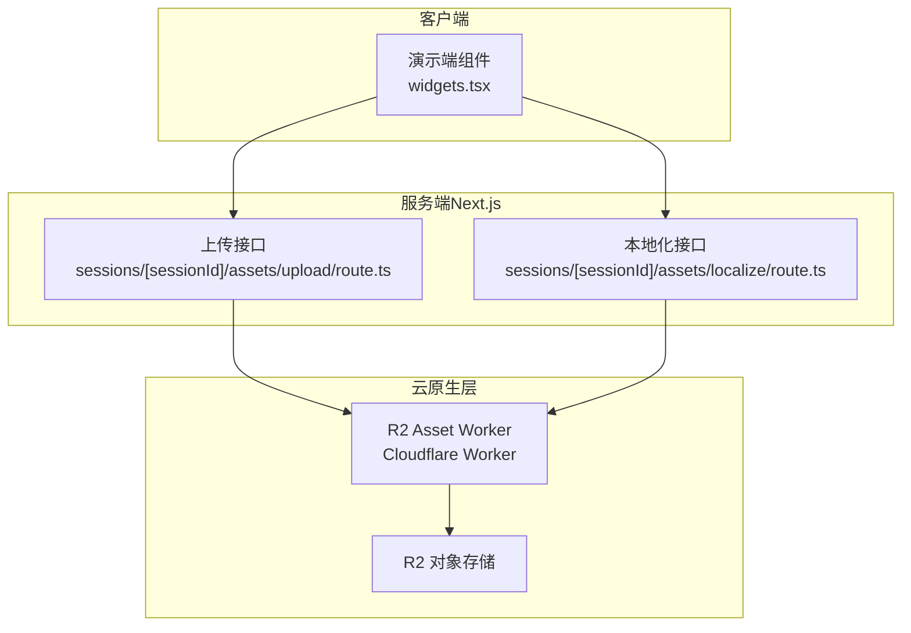
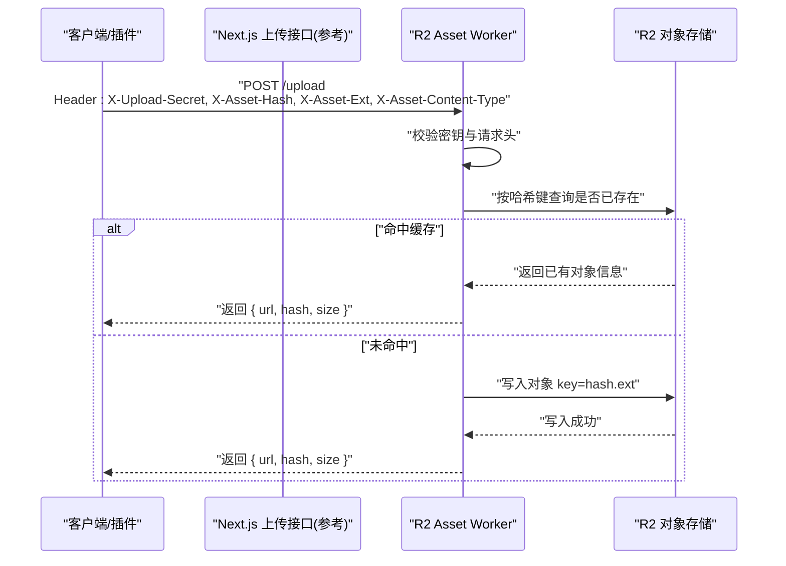
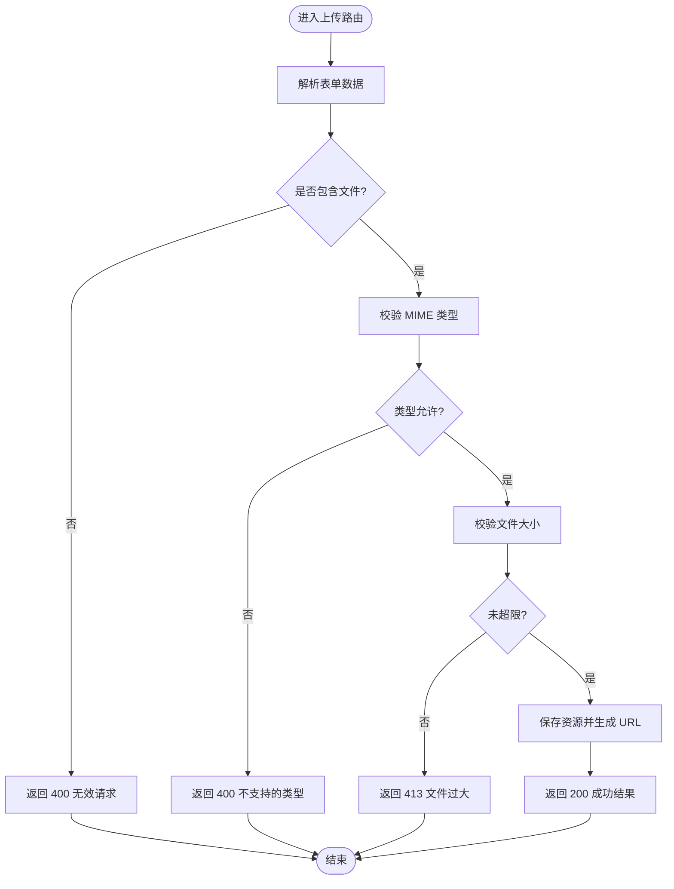
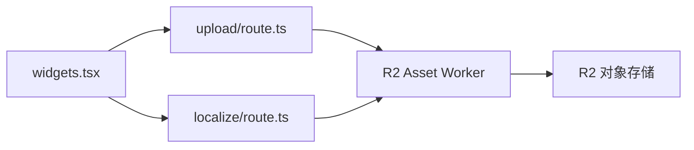

# R2 Worker 服务

<cite>
**本文引用的文件**   
- [资源处理与上传.md](file://docs/项目文档/figma插件/技术/资源处理与上传.md)
- [route.ts（会话资产上传）](file://packages/author-site/src/app/api/sessions/[sessionId]/assets/upload/route.ts)
- [route.ts（会话资产本地化）](file://packages/author-site/src/app/api/sessions/[sessionId]/assets/localize/route.ts)
- [widgets.tsx（演示端上传调用）](file://packages/demo-ui/src/widgets.tsx)
</cite>

## 目录
1. [简介](#简介)
2. [项目结构](#项目结构)
3. [核心组件](#核心组件)
4. [架构总览](#架构总览)
5. [详细组件分析](#详细组件分析)
6. [依赖关系分析](#依赖关系分析)
7. [性能考量](#性能考量)
8. [故障排查指南](#故障排查指南)
9. [结论](#结论)
10. [附录](#附录)

## 简介
本文件面向 R2 Worker 服务，系统性说明 Cloudflare Worker 的架构设计与请求处理流程，重点覆盖：
- 文件上传接口的实现要点：请求头校验、内容类型检查、文件大小限制
- R2 对象存储集成方案：桶配置、路径组织、元数据管理
- 安全校验机制：密钥验证、访问控制、防滥用策略
- 性能优化与错误处理的完整实现方案

## 项目结构
仓库中与“R2 Worker + 资源上传”相关的代码与文档主要分布在以下位置：
- 设计文档：描述插件端与 Worker 端的整体架构、上传流程与安全策略
- Next.js API 路由：提供会话级资源上传与本地化能力（作为参考实现）
- 演示端组件：展示前端如何发起上传请求

图表来源
- [widgets.tsx（演示端上传调用）:163-199](file://packages/demo-ui/src/widgets.tsx#L163-L199)
- [route.ts（会话资产上传）:65-126](file://packages/author-site/src/app/api/sessions/[sessionId]/assets/upload/route.ts#L65-L126)
- [route.ts（会话资产本地化）:313-340](file://packages/author-site/src/app/api/sessions/[sessionId]/assets/localize/route.ts#L313-L340)
- [资源处理与上传.md:13-38](file://docs/项目文档/figma插件/技术/资源处理与上传.md#L13-L38)

章节来源
- [资源处理与上传.md:13-38](file://docs/项目文档/figma插件/技术/资源处理与上传.md#L13-L38)
- [route.ts（会话资产上传）:65-126](file://packages/author-site/src/app/api/sessions/[sessionId]/assets/upload/route.ts#L65-L126)
- [route.ts（会话资产本地化）:313-340](file://packages/author-site/src/app/api/sessions/[sessionId]/assets/localize/route.ts#L313-L340)
- [widgets.tsx（演示端上传调用）:163-199](file://packages/demo-ui/src/widgets.tsx#L163-L199)

## 核心组件
- 插件端（Figma 插件）：负责图片导出、并发控制、缓存与 Hash 计算，并通过 HTTP 将二进制或 Base64 数据发送至 Worker。
- R2 Asset Worker（Cloudflare Worker）：接收上传请求，进行鉴权与参数校验，写入 R2 并返回 CDN URL。
- Next.js 上传接口（参考实现）：提供表单上传、MIME 校验、大小限制、错误码映射等通用能力，可作为 Worker 侧实现的对照。
- 演示端组件：封装上传逻辑，向服务端发起 POST 请求并处理响应。

章节来源
- [资源处理与上传.md:42-118](file://docs/项目文档/figma插件/技术/资源处理与上传.md#L42-L118)
- [资源处理与上传.md:120-163](file://docs/项目文档/figma插件/技术/资源处理与上传.md#L120-L163)
- [route.ts（会话资产上传）:65-126](file://packages/author-site/src/app/api/sessions/[sessionId]/assets/upload/route.ts#L65-L126)
- [widgets.tsx（演示端上传调用）:163-199](file://packages/demo-ui/src/widgets.tsx#L163-L199)

## 架构总览
下图展示了从客户端到 R2 的端到端请求链路，包括鉴权、校验、去重与落盘流程。

图表来源
- [资源处理与上传.md:126-163](file://docs/项目文档/figma插件/技术/资源处理与上传.md#L126-L163)

章节来源
- [资源处理与上传.md:126-163](file://docs/项目文档/figma插件/技术/资源处理与上传.md#L126-L163)

## 详细组件分析

### 上传接口与请求处理（Next.js 参考实现）
- 表单解析与字段校验：解析 multipart/form-data，校验 file 字段是否存在。
- 类型与大小限制：基于允许的文件类型集合与默认大小上限进行拦截。
- 错误码映射：根据错误场景返回合适的 HTTP 状态码（如 400、413、500）。
- 成功响应：返回包含 URL、文件名、大小与 MIME 类型的结构化结果。

图表来源
- [route.ts（会话资产上传）:65-126](file://packages/author-site/src/app/api/sessions/[sessionId]/assets/upload/route.ts#L65-L126)

章节来源
- [route.ts（会话资产上传）:65-126](file://packages/author-site/src/app/api/sessions/[sessionId]/assets/upload/route.ts#L65-L126)

### 本地化处理（Next.js 参考实现）
- 支持从浏览器 Blob 或远程 URL 获取图像数据。
- 对读取失败、远程下载失败、以及“文件过大”等异常进行区分处理，并返回相应状态码。

章节来源
- [route.ts（会话资产本地化）:313-340](file://packages/author-site/src/app/api/sessions/[sessionId]/assets/localize/route.ts#L313-L340)

### 前端上传调用（演示端）
- 使用 FormData 构造文件字段，POST 至服务端上传接口。
- 根据响应 success 字段判断成功与否，并在需要时清理旧文件。

章节来源
- [widgets.tsx（演示端上传调用）:163-199](file://packages/demo-ui/src/widgets.tsx#L163-L199)

### R2 Asset Worker（Cloudflare Worker）
- 鉴权与校验：通过自定义请求头进行密钥校验与基础参数校验。
- 去重与落盘：以内容哈希为键在 R2 中查找，若不存在则写入；返回 CDN URL。
- 返回格式：统一 JSON 结构，包含 url、hash、size 等关键信息。

章节来源
- [资源处理与上传.md:126-163](file://docs/项目文档/figma插件/技术/资源处理与上传.md#L126-L163)

### 插件端（Figma 插件）
- 图片导出：支持多种导出方式（字节数组、Base64、SVG）。
- 并发控制：队列 + 信号量模式限制最大并发，避免内存溢出。
- 缓存机制：内存缓存记录 hash -> url，减少重复上传。
- Hash 算法：优先 SHA-256，降级 FNV-1a。

章节来源
- [资源处理与上传.md:42-118](file://docs/项目文档/figma插件/技术/资源处理与上传.md#L42-L118)

## 依赖关系分析
- 前端组件依赖服务端上传接口，服务端可进一步委托给 R2 Worker。
- R2 Worker 依赖 R2 对象存储进行持久化，并通过 CDN 对外提供服务。
- 插件端与服务端/Worker 之间通过 HTTP 协议交互，遵循约定的请求头与响应格式。

图表来源
- [widgets.tsx（演示端上传调用）:163-199](file://packages/demo-ui/src/widgets.tsx#L163-L199)
- [route.ts（会话资产上传）:65-126](file://packages/author-site/src/app/api/sessions/[sessionId]/assets/upload/route.ts#L65-L126)
- [route.ts（会话资产本地化）:313-340](file://packages/author-site/src/app/api/sessions/[sessionId]/assets/localize/route.ts#L313-L340)
- [资源处理与上传.md:126-163](file://docs/项目文档/figma插件/技术/资源处理与上传.md#L126-L163)

章节来源
- [widgets.tsx（演示端上传调用）:163-199](file://packages/demo-ui/src/widgets.tsx#L163-L199)
- [route.ts（会话资产上传）:65-126](file://packages/author-site/src/app/api/sessions/[sessionId]/assets/upload/route.ts#L65-L126)
- [route.ts（会话资产本地化）:313-340](file://packages/author-site/src/app/api/sessions/[sessionId]/assets/localize/route.ts#L313-L340)
- [资源处理与上传.md:126-163](file://docs/项目文档/figma插件/技术/资源处理与上传.md#L126-L163)

## 性能考量
- 并发控制：插件端采用队列与信号量限制最大并发，避免内存峰值过高。
- 去重缓存：基于内容哈希在 Worker 与插件端均做缓存，显著降低重复上传。
- 流式处理：Worker 直接处理二进制流，减少中间序列化开销。
- CDN 加速：通过 R2 + CDN 提供低延迟读取，提升前端加载体验。

章节来源
- [资源处理与上传.md:78-118](file://docs/项目文档/figma插件/技术/资源处理与上传.md#L78-L118)
- [资源处理与上传.md:126-163](file://docs/项目文档/figma插件/技术/资源处理与上传.md#L126-L163)

## 故障排查指南
- 上传超时：插件端应降级为 Base64 内嵌，确保用户体验不中断。
- Worker 不可用：回退到占位图并给出警告提示，便于后续重试。
- Hash 冲突：信任缓存，直接使用已有 URL，避免重复写入。
- 内存不足：降低并发数，分批处理任务，防止 OOM。
- 类型/大小校验失败：检查服务端或 Worker 的限制策略，确认 MIME 白名单与大小阈值。

章节来源
- [资源处理与上传.md:279-296](file://docs/项目文档/figma插件/技术/资源处理与上传.md#L279-L296)
- [route.ts（会话资产上传）:65-126](file://packages/author-site/src/app/api/sessions/[sessionId]/assets/upload/route.ts#L65-L126)

## 结论
本方案通过“插件端 + Worker 端”分离架构，结合 R2 对象存储与 CDN，实现了高效、安全的资源上传与分发。插件端负责导出、并发控制与缓存，Worker 端负责鉴权、校验与落盘，形成稳定可靠的端到端链路。配合完善的错误处理与性能优化策略，可在高并发与大规模资源场景下保持良好稳定性与用户体验。

## 附录

### 上传接口规范（参考）
- 请求方法：POST
- 请求体：multipart/form-data，字段名为 file
- 响应体：JSON，包含 url、filename、size、mimeType 等字段
- 错误码：400（无效请求）、413（文件过大）、500（服务器错误）

章节来源
- [route.ts（会话资产上传）:65-126](file://packages/author-site/src/app/api/sessions/[sessionId]/assets/upload/route.ts#L65-L126)

### Worker 端点与请求头约定
- 端点：/upload
- 必要请求头：X-Upload-Secret、X-Asset-Hash、X-Asset-Ext、X-Asset-Content-Type
- 响应格式：{ success, url, hash, size }

章节来源
- [资源处理与上传.md:126-163](file://docs/项目文档/figma插件/技术/资源处理与上传.md#L126-L163)