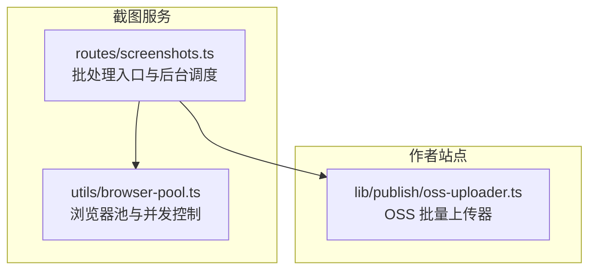
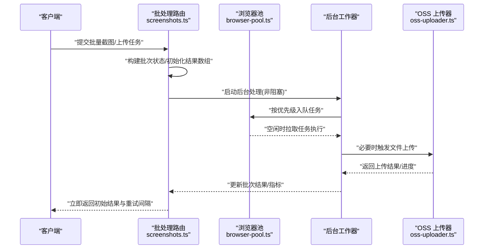
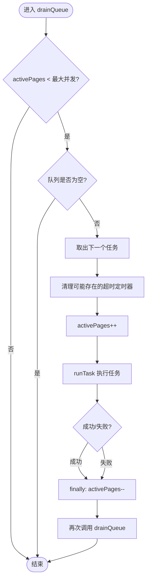
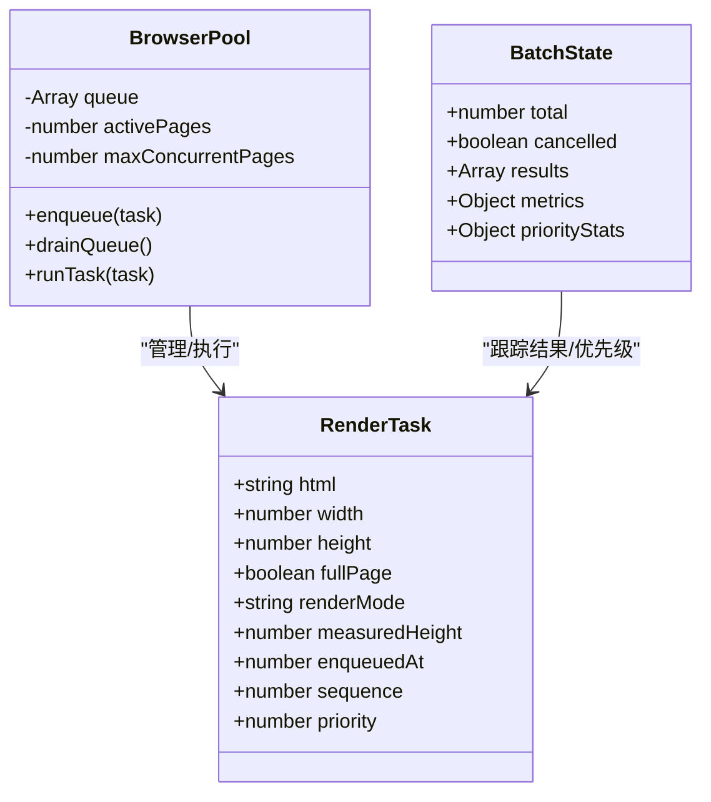
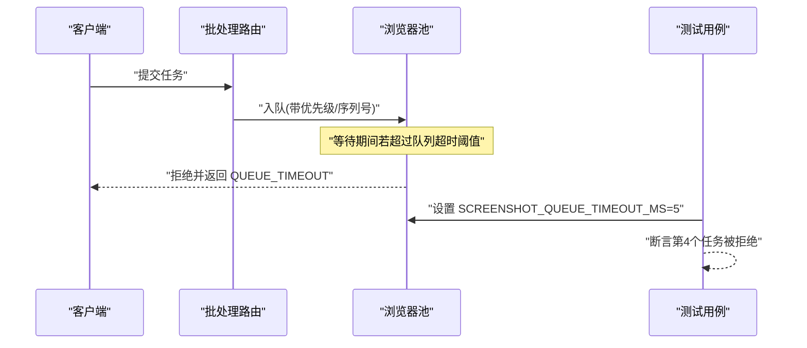
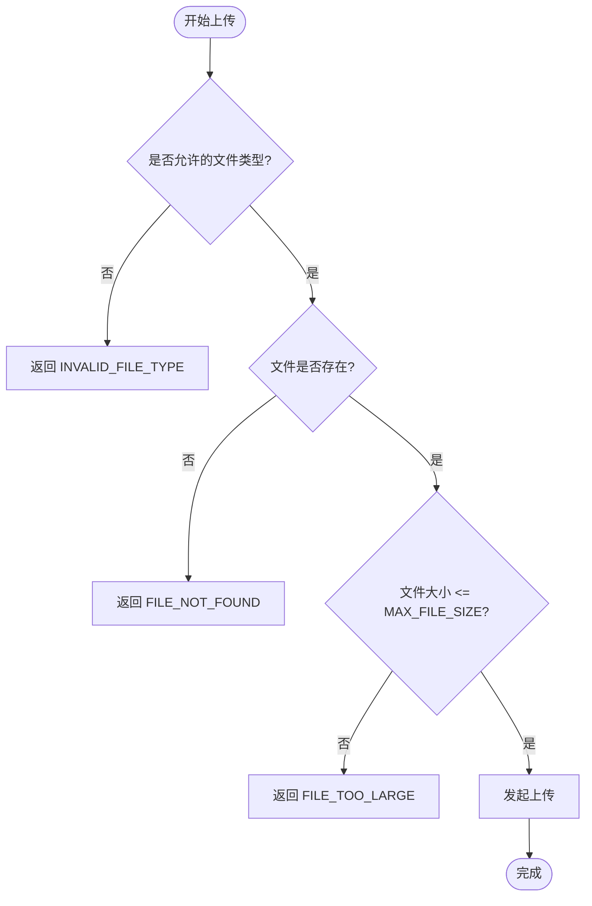
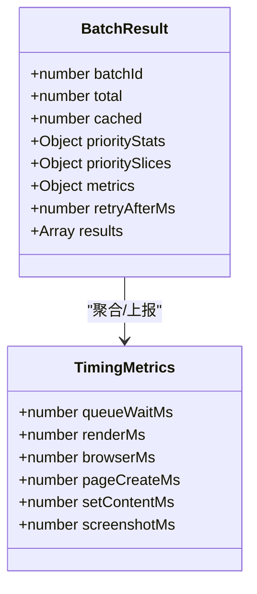
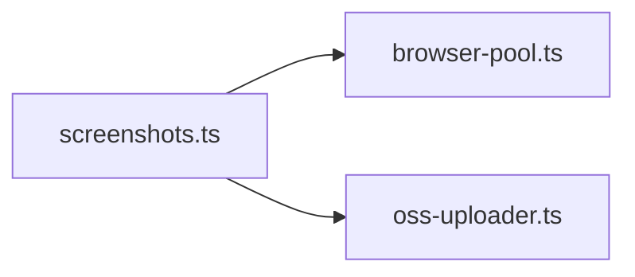

# 上传队列管理

<cite>
**本文引用的文件**   
- [browser-pool.ts](file://packages/screenshot-service/src/utils/browser-pool.ts)
- [screenshots.ts](file://packages/screenshot-service/src/routes/screenshots.ts)
- [oss-uploader.ts](file://packages/author-site/src/lib/publish/oss-uploader.ts)
- [browser-pool.test.ts](file://packages/screenshot-service/tests/browser-pool.test.ts)
</cite>

## 目录
1. [简介](#简介)
2. [项目结构](#项目结构)
3. [核心组件](#核心组件)
4. [架构总览](#架构总览)
5. [详细组件分析](#详细组件分析)
6. [依赖分析](#依赖分析)
7. [性能考虑](#性能考虑)
8. [故障排查指南](#故障排查指南)
9. [结论](#结论)
10. [附录](#附录)

## 简介
本技术文档围绕“上传队列管理系统”的并发控制、任务调度、失败重试与超时处理、监控指标以及配置调优进行系统化说明。系统由以下关键能力组成：
- 基于信号量模式的并发上限控制，避免资源过载
- 优先级队列与先进先出（FIFO）混合调度，保障高优先任务及时执行
- 批量任务编排与后台处理，支持快速返回与状态追踪
- 失败重试与超时保护，提升整体稳定性
- 可观测性指标采集，便于定位瓶颈与容量规划
- 可扩展的持久化与恢复机制设计建议

## 项目结构
与上传队列相关的核心代码分布在截图服务与作者站点两个包中：
- 截图服务负责页面渲染与并发控制，提供浏览器池与批处理路由
- 作者站点提供对象存储上传器，实现分片并发上传与进度回调

**图表来源**
- [screenshots.ts:1006-1050](file://packages/screenshot-service/src/routes/screenshots.ts#L1006-L1050)
- [browser-pool.ts:263-313](file://packages/screenshot-service/src/utils/browser-pool.ts#L263-L313)
- [oss-uploader.ts:31-59](file://packages/author-site/src/lib/publish/oss-uploader.ts#L31-L59)

**章节来源**
- [screenshots.ts:1006-1050](file://packages/screenshot-service/src/routes/screenshots.ts#L1006-L1050)
- [browser-pool.ts:263-313](file://packages/screenshot-service/src/utils/browser-pool.ts#L263-L313)
- [oss-uploader.ts:31-59](file://packages/author-site/src/lib/publish/oss-uploader.ts#L31-L59)

## 核心组件
- 批处理路由处理器：接收批量请求，构建批次状态，启动后台工作器，按优先级与并发限制调度任务
- 浏览器池：维护活跃页面数上限，对入队任务按优先级排序并依次执行，记录等待与渲染耗时
- OSS 上传器：将本地图片去重后分批并发上传至对象存储，支持进度回调与错误分类

**章节来源**
- [screenshots.ts:1006-1050](file://packages/screenshot-service/src/routes/screenshots.ts#L1006-L1050)
- [browser-pool.ts:263-313](file://packages/screenshot-service/src/utils/browser-pool.ts#L263-L313)
- [oss-uploader.ts:31-59](file://packages/author-site/src/lib/publish/oss-uploader.ts#L31-L59)

## 架构总览
下图展示了从请求进入到后台处理的端到端流程，包括优先级调度、并发控制与结果回写。

**图表来源**
- [screenshots.ts:1006-1050](file://packages/screenshot-service/src/routes/screenshots.ts#L1006-L1050)
- [browser-pool.ts:263-313](file://packages/screenshot-service/src/utils/browser-pool.ts#L263-L313)
- [oss-uploader.ts:31-59](file://packages/author-site/src/lib/publish/oss-uploader.ts#L31-L59)

## 详细组件分析

### 并发控制与信号量模式
- 通过维护 activePages 计数作为信号量，确保同时运行的页面不超过 maxConcurrentPages
- drainQueue 在有空闲槽位时持续从队列取出任务执行，形成稳定的吞吐
- 每个任务完成后递减活跃计数并再次尝试排程，保证无饥饿

**图表来源**
- [browser-pool.ts:273-295](file://packages/screenshot-service/src/utils/browser-pool.ts#L273-L295)

**章节来源**
- [browser-pool.ts:263-313](file://packages/screenshot-service/src/utils/browser-pool.ts#L263-L313)

### 任务队列管理与优先级调度
- 入队时对任务按优先级权重排序，同优先级按入队顺序稳定排序
- 批处理路由根据 normalizePriority 归一化优先级，并在后台循环中按序消费
- 任务包含 pageId、priority、status 等字段，便于追踪与统计

**图表来源**
- [browser-pool.ts:263-313](file://packages/screenshot-service/src/utils/browser-pool.ts#L263-L313)
- [screenshots.ts:1006-1050](file://packages/screenshot-service/src/routes/screenshots.ts#L1006-L1050)

**章节来源**
- [browser-pool.ts:263-313](file://packages/screenshot-service/src/utils/browser-pool.ts#L263-L313)
- [screenshots.ts:1006-1050](file://packages/screenshot-service/src/routes/screenshots.ts#L1006-L1050)

### 失败重试与超时处理
- 队列级超时：当任务在队列中等待超过阈值时，直接返回 QUEUE_TIMEOUT 错误码
- 任务级超时：在执行前清理可能的旧超时定时器，避免重复触发
- 批处理支持取消标志，防止长时间占用资源

**图表来源**
- [browser-pool.test.ts:85-108](file://packages/screenshot-service/tests/browser-pool.test.ts#L85-L108)
- [browser-pool.ts:273-295](file://packages/screenshot-service/src/utils/browser-pool.ts#L273-L295)

**章节来源**
- [browser-pool.test.ts:85-108](file://packages/screenshot-service/tests/browser-pool.test.ts#L85-L108)
- [browser-pool.ts:273-295](file://packages/screenshot-service/src/utils/browser-pool.ts#L273-L295)

### 内存限制策略
- 单文件大小限制：上传器内置 MAX_FILE_SIZE 校验，超出则返回 FILE_TOO_LARGE
- 允许的文件类型白名单：仅接受常见图片扩展名，减少无效负载
- 并发上传分块：uploadBatch 以 concurrency 为窗口分批 Promise.all，避免一次性创建过多连接

**图表来源**
- [oss-uploader.ts:1-95](file://packages/author-site/src/lib/publish/oss-uploader.ts#L1-L95)

**章节来源**
- [oss-uploader.ts:1-95](file://packages/author-site/src/lib/publish/oss-uploader.ts#L1-L95)

### 队列状态监控与性能指标收集
- 批处理响应中包含 priorityStats、metrics、retryAfterMs 等字段，便于前端展示与后端监控
- 浏览器池在 runTask 中计算 queueWaitMs 与 renderMs，可用于评估排队延迟与渲染耗时
- 上传器支持 onProgress 回调，便于统计已完成数量与总体进度

**图表来源**
- [screenshots.ts:1006-1050](file://packages/screenshot-service/src/routes/screenshots.ts#L1006-L1050)
- [browser-pool.ts:297-313](file://packages/screenshot-service/src/utils/browser-pool.ts#L297-L313)
- [browser-pool.test.ts:76-82](file://packages/screenshot-service/tests/browser-pool.test.ts#L76-L82)

**章节来源**
- [screenshots.ts:1006-1050](file://packages/screenshot-service/src/routes/screenshots.ts#L1006-L1050)
- [browser-pool.ts:297-313](file://packages/screenshot-service/src/utils/browser-pool.ts#L297-L313)
- [browser-pool.test.ts:76-82](file://packages/screenshot-service/tests/browser-pool.test.ts#L76-L82)

### 队列配置选项与调优指南
- 最大并发数：maxConcurrentPages 控制浏览器池并发上限，需结合 CPU/内存/IO 能力调整
- 队列超时：SCREENSHOT_QUEUE_TIMEOUT_MS 控制任务在队列中的最长等待时间，避免长尾
- 上传并发：uploadBatch 的 concurrency 参数控制每批并发度，默认值适合大多数场景
- 文件大小限制：MAX_FILE_SIZE 用于拦截过大文件，降低网络与存储压力

调优建议：
- 在高并发场景下，适当提高 maxConcurrentPages，但需监控内存峰值与页面崩溃率
- 对于交互敏感型任务，缩短队列超时阈值以提升用户体验
- 上传任务可按业务重要性拆分不同队列，分别设置不同的 concurrency 与重试策略

**章节来源**
- [browser-pool.ts:263-313](file://packages/screenshot-service/src/utils/browser-pool.ts#L263-L313)
- [browser-pool.test.ts:85-108](file://packages/screenshot-service/tests/browser-pool.test.ts#L85-L108)
- [oss-uploader.ts:31-59](file://packages/author-site/src/lib/publish/oss-uploader.ts#L31-L59)

### 队列持久化与恢复机制（设计方案）
当前仓库未提供显式的持久化实现，以下为可扩展的设计建议：
- 任务元数据持久化：将 BatchState 与任务列表写入可靠存储（如数据库或消息队列），包含 pageId、priority、status、enqueuedAt、retryCount 等字段
- 状态机：定义 queued、rendering、uploaded、failed、cancelled 等状态，配合幂等键避免重复处理
- 恢复策略：服务重启后扫描未完成批次，重建队列并按优先级重新调度；对失败任务按指数退避重试
- 检查点：在关键阶段（如渲染完成、上传完成）落盘检查点，支持断点续传
- 监控与告警：对长期处于 queued 的任务发出告警，辅助人工干预

[本节为概念性设计，不直接分析具体文件]

## 依赖分析
- 批处理路由依赖浏览器池进行任务调度与执行
- 浏览器池内部维护队列与活跃计数，驱动任务执行
- 上传器独立于截图服务，可在需要时由批处理流程调用

**图表来源**
- [screenshots.ts:1006-1050](file://packages/screenshot-service/src/routes/screenshots.ts#L1006-L1050)
- [browser-pool.ts:263-313](file://packages/screenshot-service/src/utils/browser-pool.ts#L263-L313)
- [oss-uploader.ts:31-59](file://packages/author-site/src/lib/publish/oss-uploader.ts#L31-L59)

**章节来源**
- [screenshots.ts:1006-1050](file://packages/screenshot-service/src/routes/screenshots.ts#L1006-L1050)
- [browser-pool.ts:263-313](file://packages/screenshot-service/src/utils/browser-pool.ts#L263-L313)
- [oss-uploader.ts:31-59](file://packages/author-site/src/lib/publish/oss-uploader.ts#L31-L59)

## 性能考虑
- 并发上限与吞吐：合理设置 maxConcurrentPages 与 uploadBatch 的 concurrency，平衡吞吐与资源占用
- 优先级与公平性：高优先级任务优先执行，但应避免低优先级任务饥饿，可通过加权轮询或时间片补偿
- 超时与降级：队列超时与任务级超时共同作用，必要时返回部分结果与重试间隔，提升可用性
- 指标采集：利用 queueWaitMs、renderMs 等指标识别瓶颈，指导扩容与优化

[本节为通用性能讨论，不直接分析具体文件]

## 故障排查指南
- 队列超时问题：检查 SCREENSHOT_QUEUE_TIMEOUT_MS 配置与任务积压情况，确认是否有高优先级任务阻塞
- 并发超限：观察 activePages 与 maxConcurrentPages 的关系，必要时调整并发上限
- 上传失败：根据错误码（INVALID_FILE_TYPE、FILE_NOT_FOUND、FILE_TOO_LARGE）定位原因
- 指标异常：对比 queueWaitMs 与 renderMs，判断是排队还是渲染阶段的问题

**章节来源**
- [browser-pool.test.ts:85-108](file://packages/screenshot-service/tests/browser-pool.test.ts#L85-L108)
- [oss-uploader.ts:61-95](file://packages/author-site/src/lib/publish/oss-uploader.ts#L61-L95)

## 结论
本系统通过信号量模式与优先级队列实现了可控的并发与公平的调度，结合超时与错误分类提升了鲁棒性。通过丰富的指标与可配置的参数，运维人员可以灵活调优以满足不同业务需求。未来可引入持久化与恢复机制，进一步增强系统的可靠性与可观测性。

[本节为总结，不直接分析具体文件]

## 附录
- 相关测试用例验证了并发上限与队列超时的行为，可作为回归基准
- 上传器的分块并发与进度回调为上层提供了良好的扩展点

**章节来源**
- [browser-pool.test.ts:53-83](file://packages/screenshot-service/tests/browser-pool.test.ts#L53-L83)
- [oss-uploader.ts:31-59](file://packages/author-site/src/lib/publish/oss-uploader.ts#L31-L59)