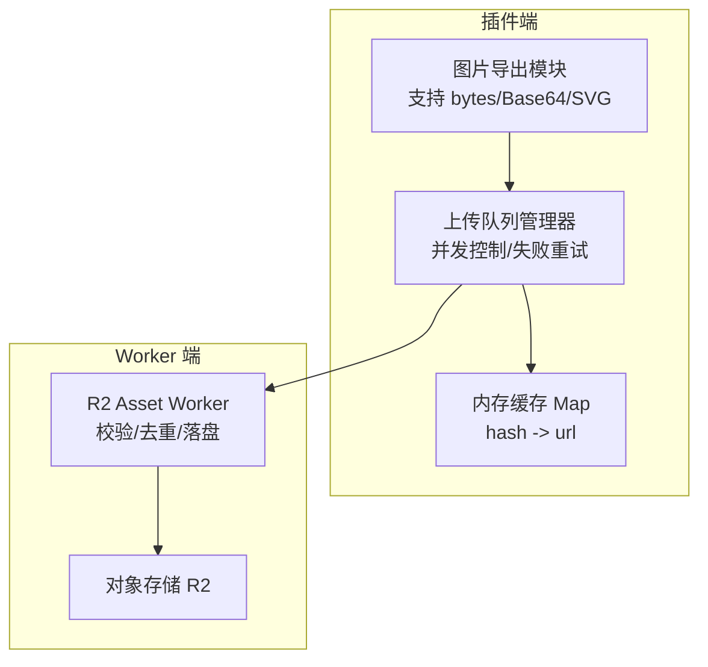
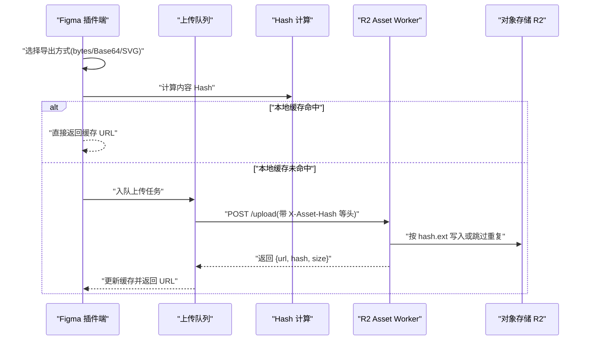
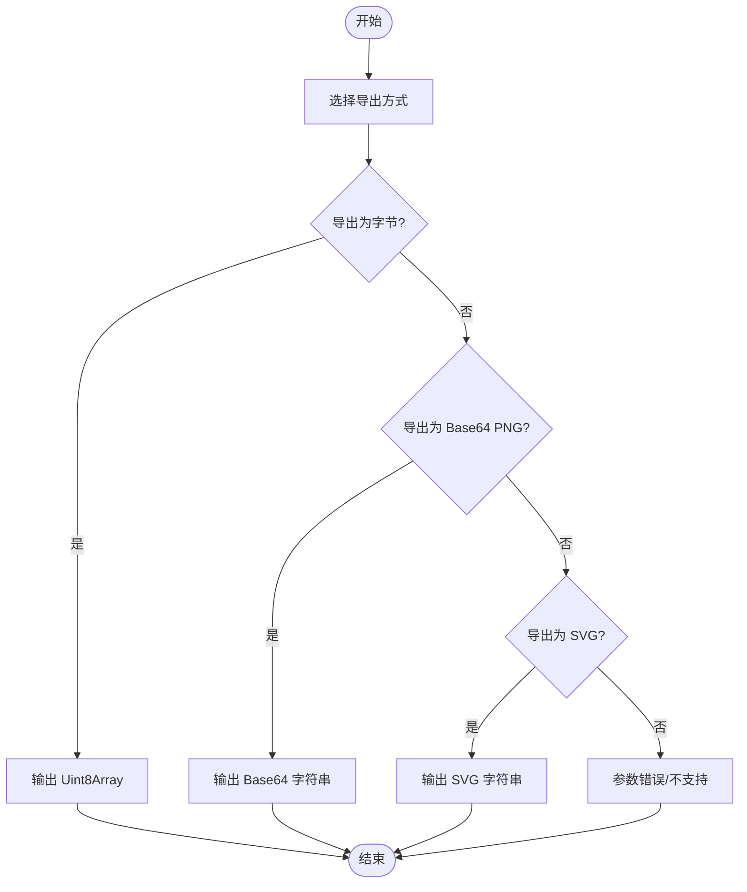
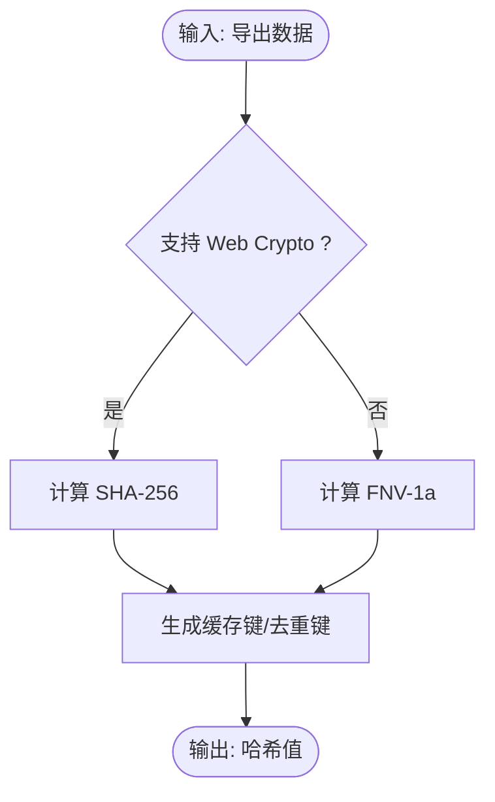
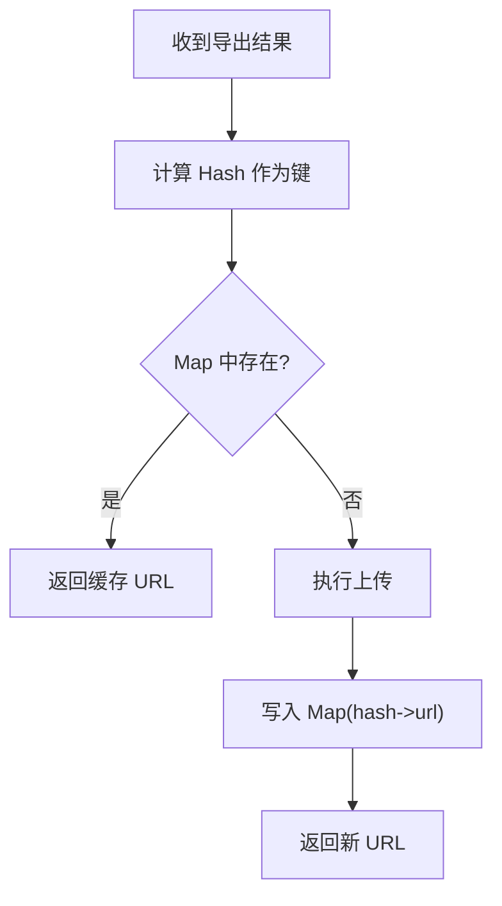
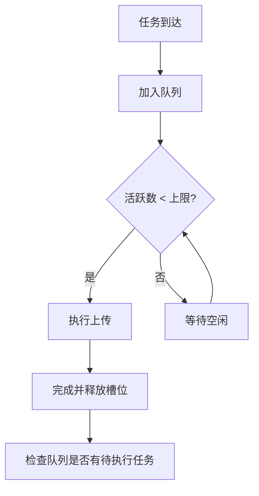
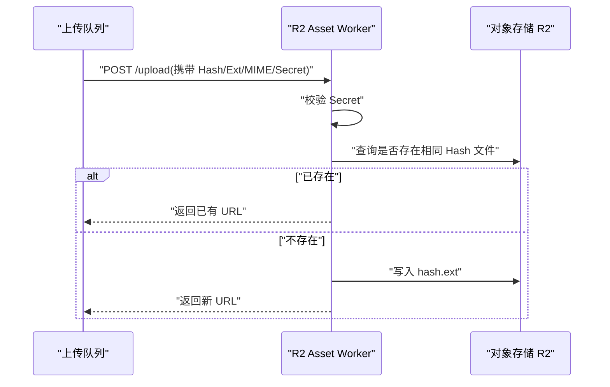
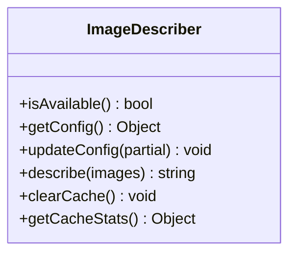
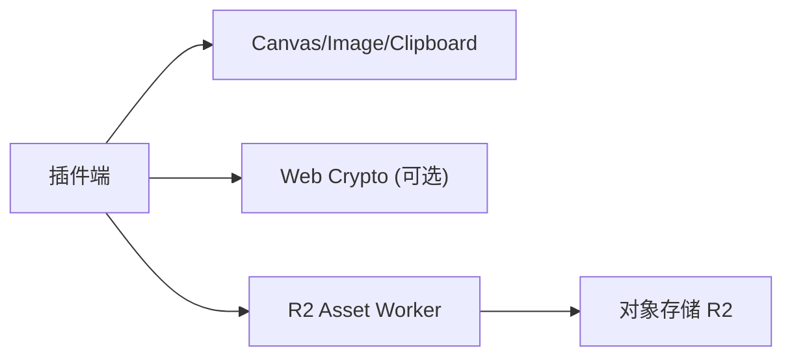

# 图片导出与处理

<cite>
**本文引用的文件**   
- [资源处理与上传.md](file://docs/项目文档/figma插件/技术/资源处理与上传.md)
- [index.tsx](file://packages/sketch-react/src/index.tsx)
- [image-describer.ts](file://packages/agent-service/src/services/image-describer.ts)
</cite>

## 目录
1. [简介](#简介)
2. [项目结构](#项目结构)
3. [核心组件](#核心组件)
4. [架构总览](#架构总览)
5. [详细组件分析](#详细组件分析)
6. [依赖分析](#依赖分析)
7. [性能考虑](#性能考虑)
8. [故障排查指南](#故障排查指南)
9. [结论](#结论)
10. [附录](#附录)

## 简介
本技术文档聚焦于“图片导出与处理”模块，围绕 Figma 节点图片导出的三种方式（exportNodeAsBytes、exportNodeAsBase64PNG、exportNodeAsSVG）、Hash 计算机制（SHA-256 与 FNV-1a 的选择策略与实现细节）、内存缓存系统（键生成、过期策略、内存管理）、图片格式转换与质量优化方案，以及完整的错误处理与降级策略进行系统化说明。文档同时给出架构图、流程图与时序图，帮助读者快速理解端到端的数据流与关键决策点。

## 项目结构
该模块采用“插件端 + Worker 端”的分离架构：
- 插件端负责从 Figma 节点导出图像数据（字节、Base64、SVG），并进行本地去重与并发控制。
- Worker 端接收上传请求，基于内容 Hash 做服务端去重，写入对象存储并返回 CDN URL。
- 辅助能力包括截图渲染（Canvas 转 PNG）、图片描述服务（含缓存统计）等。

图示来源
- [资源处理与上传.md:13-38](file://docs/项目文档/figma插件/技术/资源处理与上传.md#L13-L38)

章节来源
- [资源处理与上传.md:13-38](file://docs/项目文档/figma插件/技术/资源处理与上传.md#L13-L38)

## 核心组件
- 图片导出器
  - exportNodeAsBytes：输出 Uint8Array，适用于通用上传或二次编码。
  - exportNodeAsBase64PNG：输出 Base64 字符串，适合内嵌到代码中作为 data URI。
  - exportNodeAsSVG：输出 SVG 字符串，适合矢量图形直接内嵌或上传。
- 上传队列与并发控制
  - 使用队列 + 信号量模式限制最大并发数，避免内存溢出。
- 内存缓存
  - 以内容 Hash 为键，CDN URL 为值，命中则直接复用，未命中则触发上传并回填。
- Hash 计算
  - 首选 SHA-256（Web Crypto API），降级 FNV-1a（纯 JS 实现）。
- Worker 端
  - 校验请求头、检查是否已存在相同 Hash 的文件、写入 R2 并返回 CDN URL。

章节来源
- [资源处理与上传.md:44-116](file://docs/项目文档/figma插件/技术/资源处理与上传.md#L44-L116)
- [资源处理与上传.md:120-162](file://docs/项目文档/figma插件/技术/资源处理与上传.md#L120-L162)

## 架构总览
下图展示了从 Figma 节点到最终 CDN URL 的完整流程，包含导出、哈希、缓存、上传与回退路径。

图示来源
- [资源处理与上传.md:126-162](file://docs/项目文档/figma插件/技术/资源处理与上传.md#L126-L162)

## 详细组件分析

### 组件一：图片导出器（bytes/Base64/SVG）
- 适用场景
  - exportNodeAsBytes：通用二进制导出，便于后续压缩、转码或直接上传。
  - exportNodeAsBase64PNG：内嵌到代码中，零依赖、离线可用，但体积较大。
  - exportNodeAsSVG：矢量图形，可内嵌 JSX 或上传至 CDN。
- 输出格式
  - Uint8Array、Base64 字符串、SVG 字符串。
- 与 UI 的联动
  - 在预览/导出工具中，可将 SVG 渲染为 PNG 并通过 Canvas 下载或复制到剪贴板。

章节来源
- [资源处理与上传.md:44-55](file://docs/项目文档/figma插件/技术/资源处理与上传.md#L44-L55)
- [index.tsx:2585-2617](file://packages/sketch-react/src/index.tsx#L2585-L2617)
- [index.tsx:2619-2641](file://packages/sketch-react/src/index.tsx#L2619-L2641)
- [index.tsx:4766-4792](file://packages/sketch-react/src/index.tsx#L4766-L4792)

### 组件二：Hash 计算机制（SHA-256 与 FNV-1a）
- 算法选择策略
  - 首选 SHA-256：碰撞概率极低，安全性高，适合用于唯一标识与去重。
  - 降级 FNV-1a：纯 JavaScript 实现，兼容性好，用于不支持 Web Crypto 的环境。
- 实现要点
  - 对导出后的原始数据进行哈希，得到固定长度摘要；将摘要作为缓存键与服务端去重依据。
  - 若环境不支持 Web Crypto，自动回退到 FNV-1a。

章节来源
- [资源处理与上传.md:94-101](file://docs/项目文档/figma插件/技术/资源处理与上传.md#L94-L101)

### 组件三：内存缓存系统（键生成、过期策略、内存管理）
- 缓存键生成
  - 以内容 Hash 作为键，值为对应 CDN URL。
- 命中流程
  - 先查本地 Map，命中则直接返回 URL；未命中则执行上传并回填。
- 过期策略
  - 设计文档定义了 cacheTTLHours 字段，用于配置缓存有效期；当前仓库未提供具体实现细节。
- 内存管理
  - 通过 Map 维护键值对；结合并发控制与分批处理，降低峰值内存占用。

章节来源
- [资源处理与上传.md:56-76](file://docs/项目文档/figma插件/技术/资源处理与上传.md#L56-L76)
- [资源处理与上传.md:104-116](file://docs/项目文档/figma插件/技术/资源处理与上传.md#L104-L116)

### 组件四：上传队列与并发控制
- 并发上限
  - 默认最大并发数为 5，可通过配置调整。
- 队列模型
  - 新任务入队；当活跃上传数小于上限时，取出任务执行；完成后检查队列继续调度。
- 失败重试
  - 上传失败时可触发重试或降级策略（如回退到 Base64 内嵌）。

章节来源
- [资源处理与上传.md:78-93](file://docs/项目文档/figma插件/技术/资源处理与上传.md#L78-L93)

### 组件五：Worker 端（R2 上传与去重）
- 请求头
  - X-Upload-Secret：上传密钥，防止滥用。
  - X-Asset-Hash：内容 Hash，用于去重。
  - X-Asset-Ext：扩展名（png/svg）。
  - X-Asset-Content-Type：MIME 类型。
- 处理流程
  - 校验密钥 → 读取请求体 → 检查 R2 是否存在相同 Hash 文件 → 不存在则写入 → 返回 JSON（url/hash/size）。

图示来源
- [资源处理与上传.md:126-162](file://docs/项目文档/figma插件/技术/资源处理与上传.md#L126-L162)

章节来源
- [资源处理与上传.md:120-162](file://docs/项目文档/figma插件/技术/资源处理与上传.md#L120-L162)

### 组件六：图片描述服务（缓存与统计）
- 功能概述
  - 根据配置启用图片描述能力，支持批量描述与缓存清理。
- 缓存统计
  - 暴露缓存大小、命中率、未命中率等指标，便于监控与调优。

图示来源
- [image-describer.ts:112-170](file://packages/agent-service/src/services/image-describer.ts#L112-L170)

章节来源
- [image-describer.ts:112-170](file://packages/agent-service/src/services/image-describer.ts#L112-L170)

## 依赖分析
- 插件端依赖
  - 浏览器 API：Canvas、Image、ClipboardItem（可选）。
  - Web Crypto API（可选）：用于 SHA-256。
- Worker 端依赖
  - Cloudflare Workers 运行时与 R2 对象存储。
- 外部集成
  - 上传接口需安全校验（X-Upload-Secret），仅接受 png/svg 类型。

章节来源
- [资源处理与上传.md:120-162](file://docs/项目文档/figma插件/技术/资源处理与上传.md#L120-L162)
- [index.tsx:2585-2617](file://packages/sketch-react/src/index.tsx#L2585-L2617)

## 性能考虑
- 并发控制
  - 合理设置最大并发数，避免大量图片同时上传导致内存抖动。
- 去重优先
  - 利用本地与远端双重去重，减少不必要的网络传输与存储写入。
- 渲染优化
  - 使用 Canvas 按需缩放与背景填充，避免无谓的重绘。
- 缓存命中率
  - 关注图片描述服务的缓存统计，适时清理或扩容以提升命中率。

[本节为通用指导，不直接分析具体文件]

## 故障排查指南
- 上传超时
  - 现象：长时间无响应或失败。
  - 处理：回退到 Base64 内嵌，记录日志并提示用户。
- Worker 不可用
  - 现象：上传失败且无法获取 CDN URL。
  - 处理：使用占位图 + 警告提示，确保页面可正常展示。
- Hash 冲突
  - 现象：不同内容产生相同 Hash。
  - 处理：信任缓存，使用已有 URL；必要时升级哈希算法或增加前缀区分。
- 内存不足
  - 现象：大量图片导出导致 OOM。
  - 处理：限制并发数，分批处理，逐步释放中间对象。

章节来源
- [资源处理与上传.md:279-287](file://docs/项目文档/figma插件/技术/资源处理与上传.md#L279-L287)

## 结论
本模块通过“导出—哈希—缓存—上传—回退”的闭环设计，在保证稳定性的前提下实现了高效的图片资源处理。SHA-256 与 FNV-1a 的双算法策略兼顾了安全性与兼容性；内存缓存与并发控制有效降低了资源消耗；完善的错误处理与降级策略确保了用户体验的连续性。建议后续进一步完善缓存过期策略与 vectorStrategy 配置，提升整体灵活性与可观测性。

[本节为总结性内容，不直接分析具体文件]

## 附录
- 已知问题与建议
  - embedVectors=true 时跳过上传逻辑，建议优先尝试上传，失败再内嵌。
  - #static 标记目前仅支持 PNG，可扩展支持 SVG 导出与上传。
- 相关参考
  - 截图渲染与下载：Canvas 转 PNG、剪贴板复制与文件下载。
  - 图片描述服务：缓存统计与配置动态更新。

章节来源
- [资源处理与上传.md:261-276](file://docs/项目文档/figma插件/技术/资源处理与上传.md#L261-L276)
- [index.tsx:2585-2641](file://packages/sketch-react/src/index.tsx#L2585-L2641)
- [image-describer.ts:112-170](file://packages/agent-service/src/services/image-describer.ts#L112-L170)