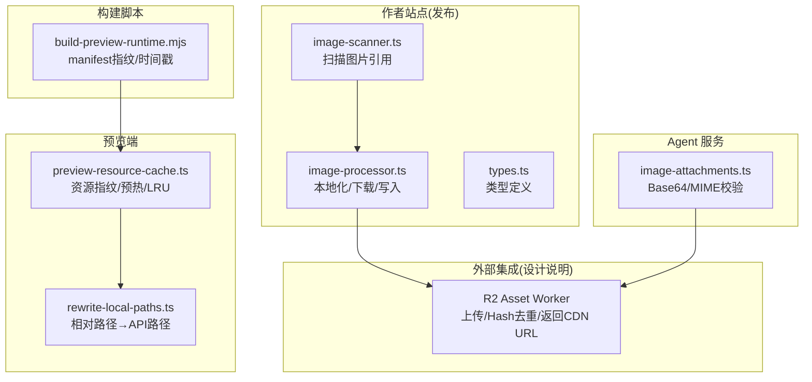
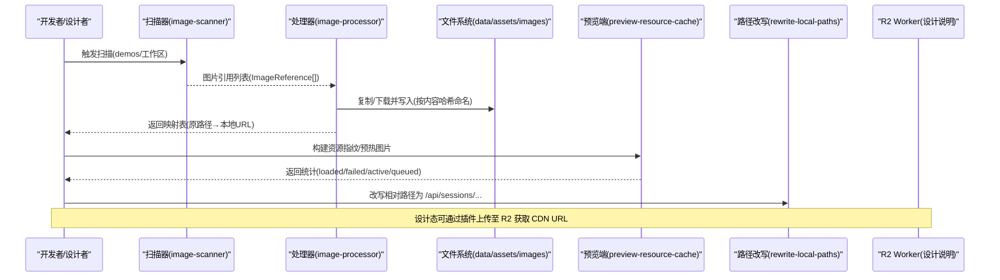
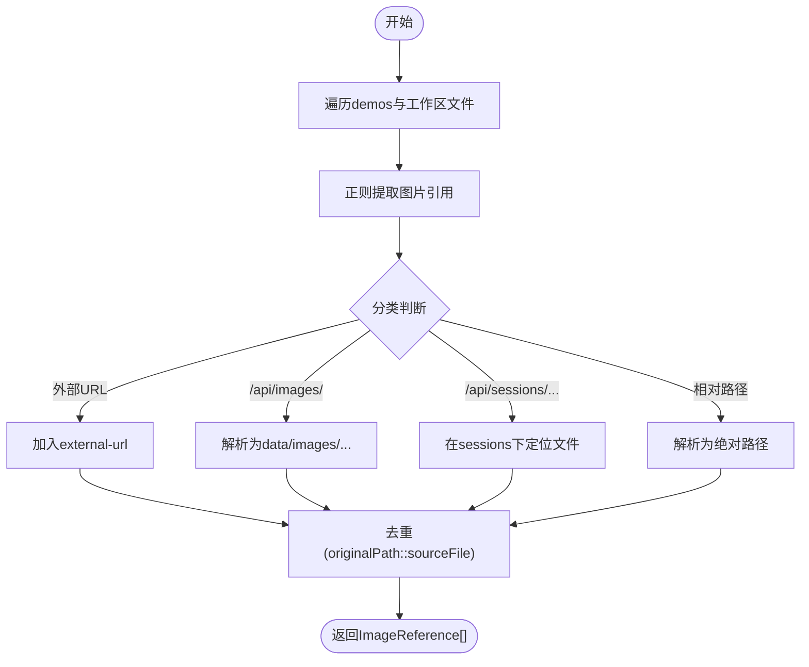
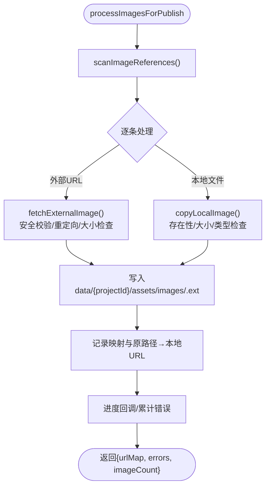
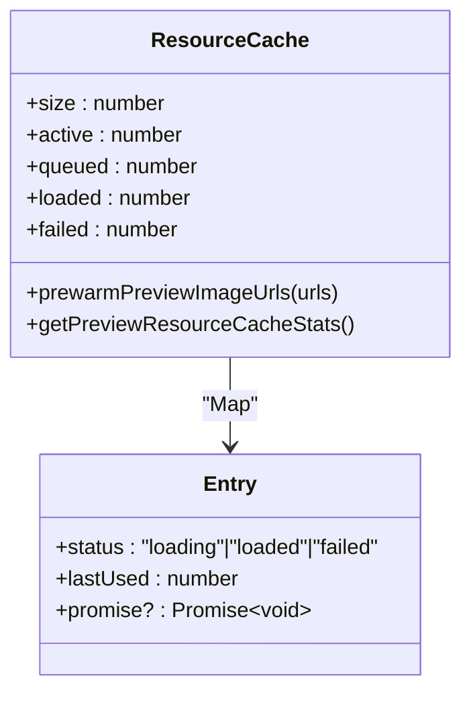
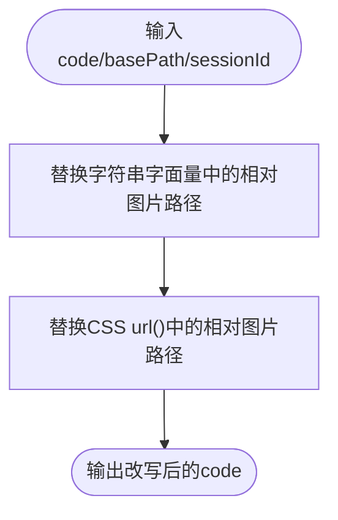
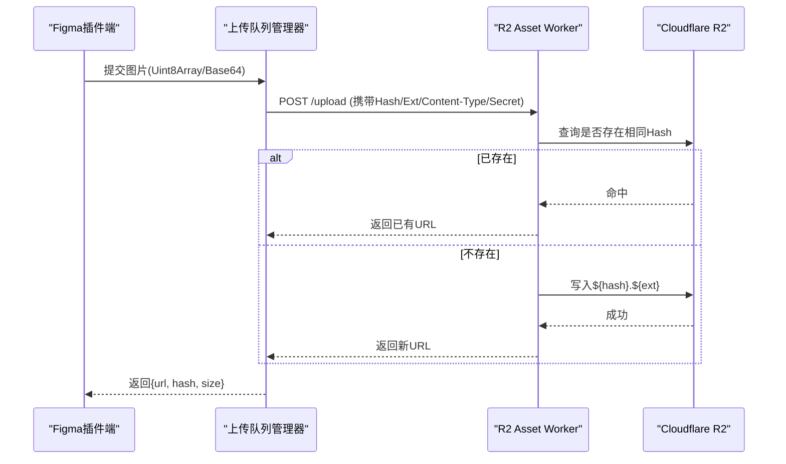
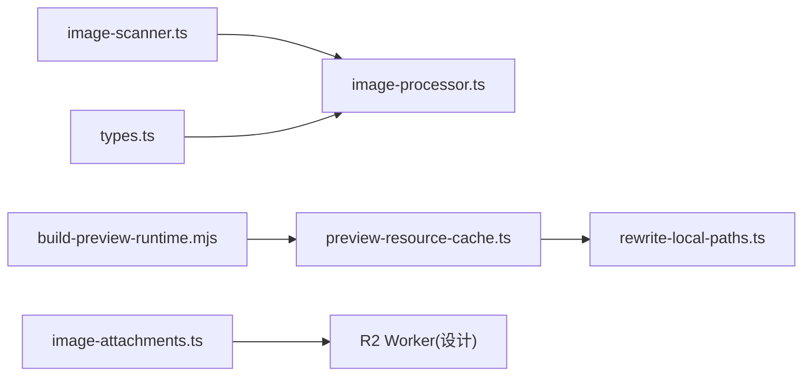

# 资源处理与上传

<cite>
**本文引用的文件**
- [packages/author-site/src/lib/publish/image-scanner.ts](file://packages/author-site/src/lib/publish/image-scanner.ts)
- [packages/author-site/src/lib/publish/image-processor.ts](file://packages/author-site/src/lib/publish/image-processor.ts)
- [packages/author-site/src/lib/publish/types.ts](file://packages/author-site/src/lib/publish/types.ts)
- [packages/author-site/src/lib/rewrite-local-paths.ts](file://packages/author-site/src/lib/rewrite-local-paths.ts)
- [packages/demo-ui/src/preview-resource-cache.ts](file://packages/demo-ui/src/preview-resource-cache.ts)
- [packages/agent-service/src/utils/image-attachments.ts](file://packages/agent-service/src/utils/image-attachments.ts)
- [scripts/build-preview-runtime.mjs](file://scripts/build-preview-runtime.mjs)
- [docs/项目文档/figma插件/技术/资源处理与上传.md](file://docs/项目文档/figma插件/技术/资源处理与上传.md)
</cite>

## 目录
1. [简介](#简介)
2. [项目结构](#项目结构)
3. [核心组件](#核心组件)
4. [架构总览](#架构总览)
5. [详细组件分析](#详细组件分析)
6. [依赖关系分析](#依赖关系分析)
7. [性能考虑](#性能考虑)
8. [故障排查指南](#故障排查指南)
9. [结论](#结论)
10. [附录](#附录)

## 简介
本技术文档围绕“资源处理与上传系统”展开，聚焦图片资源的扫描、本地化、CDN 集成、预览预热与路径改写等关键环节。文档覆盖：
- 图片资源扫描与引用识别（HTML/CSS/JS/TSX/JSON）
- 本地化与去重策略（基于内容哈希）
- Cloudflare R2 集成方案（上传队列、并发控制、错误重试）
- CDN 集成策略（URL 生成、缓存策略、版本管理）
- 资源引用替换逻辑（代码中资源路径自动更新与依赖维护）
- 配置选项与性能调优建议

## 项目结构
仓库中与资源处理与上传相关的核心模块分布如下：
- 发布侧资源扫描与本地化：packages/author-site/src/lib/publish/*
- 预览端资源指纹与预热：packages/demo-ui/src/preview-resource-cache.ts
- 构建期产物指纹与版本：scripts/build-preview-runtime.mjs
- 资源路径改写（预览环境）：packages/author-site/src/lib/rewrite-local-paths.ts
- Agent 服务图片附件规范化：packages/agent-service/src/utils/image-attachments.ts
- Figma 插件与 R2 Worker 设计说明：docs/项目文档/figma插件/技术/资源处理与上传.md

图示来源
- [packages/author-site/src/lib/publish/image-scanner.ts:1-268](file://packages/author-site/src/lib/publish/image-scanner.ts#L1-L268)
- [packages/author-site/src/lib/publish/image-processor.ts:1-277](file://packages/author-site/src/lib/publish/image-processor.ts#L1-L277)
- [packages/author-site/src/lib/publish/types.ts:1-23](file://packages/author-site/src/lib/publish/types.ts#L1-L23)
- [packages/demo-ui/src/preview-resource-cache.ts:1-300](file://packages/demo-ui/src/preview-resource-cache.ts#L1-L300)
- [packages/author-site/src/lib/rewrite-local-paths.ts:1-48](file://packages/author-site/src/lib/rewrite-local-paths.ts#L1-L48)
- [packages/agent-service/src/utils/image-attachments.ts:1-48](file://packages/agent-service/src/utils/image-attachments.ts#L1-L48)
- [scripts/build-preview-runtime.mjs:60-96](file://scripts/build-preview-runtime.mjs#L60-L96)
- [docs/项目文档/figma插件/技术/资源处理与上传.md:13-163](file://docs/项目文档/figma插件/技术/资源处理与上传.md#L13-L163)

章节来源
- [packages/author-site/src/lib/publish/image-scanner.ts:1-268](file://packages/author-site/src/lib/publish/image-scanner.ts#L1-L268)
- [packages/author-site/src/lib/publish/image-processor.ts:1-277](file://packages/author-site/src/lib/publish/image-processor.ts#L1-L277)
- [packages/author-site/src/lib/publish/types.ts:1-23](file://packages/author-site/src/lib/publish/types.ts#L1-L23)
- [packages/demo-ui/src/preview-resource-cache.ts:1-300](file://packages/demo-ui/src/preview-resource-cache.ts#L1-L300)
- [packages/author-site/src/lib/rewrite-local-paths.ts:1-48](file://packages/author-site/src/lib/rewrite-local-paths.ts#L1-L48)
- [packages/agent-service/src/utils/image-attachments.ts:1-48](file://packages/agent-service/src/utils/image-attachments.ts#L1-L48)
- [scripts/build-preview-runtime.mjs:60-96](file://scripts/build-preview-runtime.mjs#L60-L96)
- [docs/项目文档/figma插件/技术/资源处理与上传.md:13-163](file://docs/项目文档/figma插件/技术/资源处理与上传.md#L13-L163)

## 核心组件
- 图片引用扫描器
  - 职责：遍历工作区源码与配置，提取所有可能的图片引用（img src、CSS url()、import、字符串字面量、API 路径、会话资产路径），并归一化为绝对路径或外部 URL。
  - 关键点：支持 .png/.jpg/.gif/.webp/.svg；过滤占位图与 API 前缀；解析 /api/sessions/{id}/assets 路径到实际文件。
- 图片处理器（发布阶段）
  - 职责：对扫描到的引用进行本地化处理——复制本地文件、拉取外部图片、按内容哈希命名并落盘，输出映射表用于后续替换。
  - 关键点：安全校验（仅公网 HTTP/HTTPS、防内网访问）、大小限制、MIME 类型白名单、重复内容去重。
- 预览资源缓存与预热
  - 职责：从页面代码与配置中提取图片 URL，计算资源指纹，预加载图片并维护 LRU 缓存，控制并发。
  - 关键点：指纹包含 pageId、代码摘要、预览尺寸、图片 URL 列表；并发上限与失败容错。
- 资源路径改写（预览环境）
  - 职责：将相对路径的图片引用改写为 /api/sessions/{sessionId}/workspace/... 的代理路径，便于预览时直接读取工作区资源。
- Agent 图片附件规范化
  - 职责：校验 Base64 数据与 MIME 类型，兼容 data URL 格式，确保传入下游服务的图片附件合法。
- 构建期产物指纹
  - 职责：在构建产物 manifest 中注入稳定时间戳与内容指纹，辅助缓存失效与版本管理。

章节来源
- [packages/author-site/src/lib/publish/image-scanner.ts:1-268](file://packages/author-site/src/lib/publish/image-scanner.ts#L1-L268)
- [packages/author-site/src/lib/publish/image-processor.ts:1-277](file://packages/author-site/src/lib/publish/image-processor.ts#L1-L277)
- [packages/author-site/src/lib/publish/types.ts:1-23](file://packages/author-site/src/lib/publish/types.ts#L1-L23)
- [packages/demo-ui/src/preview-resource-cache.ts:1-300](file://packages/demo-ui/src/preview-resource-cache.ts#L1-L300)
- [packages/author-site/src/lib/rewrite-local-paths.ts:1-48](file://packages/author-site/src/lib/rewrite-local-paths.ts#L1-L48)
- [packages/agent-service/src/utils/image-attachments.ts:1-48](file://packages/agent-service/src/utils/image-attachments.ts#L1-L48)
- [scripts/build-preview-runtime.mjs:60-96](file://scripts/build-preview-runtime.mjs#L60-L96)

## 架构总览
整体流程分为“发布侧本地化 + 预览侧路径改写与预热 + 外部 R2 上传（设计态）”。

图示来源
- [packages/author-site/src/lib/publish/image-scanner.ts:1-268](file://packages/author-site/src/lib/publish/image-scanner.ts#L1-L268)
- [packages/author-site/src/lib/publish/image-processor.ts:1-277](file://packages/author-site/src/lib/publish/image-processor.ts#L1-L277)
- [packages/demo-ui/src/preview-resource-cache.ts:1-300](file://packages/demo-ui/src/preview-resource-cache.ts#L1-L300)
- [packages/author-site/src/lib/rewrite-local-paths.ts:1-48](file://packages/author-site/src/lib/rewrite-local-paths.ts#L1-L48)
- [docs/项目文档/figma插件/技术/资源处理与上传.md:13-163](file://docs/项目文档/figma插件/技术/资源处理与上传.md#L13-L163)

## 详细组件分析

### 图片引用扫描器（image-scanner.ts）
- 功能要点
  - 递归扫描 demos 目录下的 tsx/jsx/css/html 文件，以及工作区根级 index.tsx、schema/values 文件。
  - 匹配规则：
    - 
    - CSS url("...")
    - import ... from "....(png|jpe?g|gif|webp|svg)"
    - 字符串字面量中的 http(s) URL
    - 字符串字面量中的图片路径（含相对路径、/api/images/、/api/sessions/{id}/assets/...）
  - 路径解析：
    - 相对路径 → 基于源文件目录解析为绝对路径
    - /api/images/xxx → 映射到 data/images/xxx
    - /api/sessions/{id}/assets/xxx → 在 data/sessions 下查找对应文件
  - 去重：以 originalPath + sourceFile 作为键去重。
- 复杂度与边界
  - 时间复杂度 O(N) 扫描 N 个文件，正则匹配线性扫描。
  - 边界：忽略占位图域名、API 前缀、非图片扩展名。

图示来源
- [packages/author-site/src/lib/publish/image-scanner.ts:1-268](file://packages/author-site/src/lib/publish/image-scanner.ts#L1-L268)

章节来源
- [packages/author-site/src/lib/publish/image-scanner.ts:1-268](file://packages/author-site/src/lib/publish/image-scanner.ts#L1-L268)

### 图片处理器（image-processor.ts）
- 功能要点
  - 对可发布的引用进行分类处理：
    - 本地文件：校验存在性、大小、类型，复制到 data/{projectId}/assets/images/，文件名使用内容 SHA256 前缀 + 原扩展名。
    - 外部 URL：强制公网 HTTP/HTTPS，禁止内网地址与 localhost，最多允许 3 次重定向，校验 Content-Length 与最终缓冲大小，按 MIME 推断扩展名后落盘。
  - 结果聚合：成功项记录映射表，失败项收集错误信息，提供进度回调。
- 安全与健壮性
  - DNS 解析与私有 IP 检测，拒绝内网访问。
  - 严格 MIME 白名单与大小限制。
  - 对外部请求的错误统一包装为错误码字符串。

图示来源
- [packages/author-site/src/lib/publish/image-processor.ts:1-277](file://packages/author-site/src/lib/publish/image-processor.ts#L1-L277)

章节来源
- [packages/author-site/src/lib/publish/image-processor.ts:1-277](file://packages/author-site/src/lib/publish/image-processor.ts#L1-L277)
- [packages/author-site/src/lib/publish/types.ts:1-23](file://packages/author-site/src/lib/publish/types.ts#L1-L23)

### 预览资源缓存与预热（preview-resource-cache.ts）
- 功能要点
  - 资源指纹：由 pageId、代码摘要、预览尺寸、图片 URL 列表拼接而成，用于区分不同资源组合。
  - URL 提取：从配置对象与代码字符串中提取图片 URL，支持 data:image、/api/sessions/、https/http 及带扩展名的相对路径。
  - 预热队列：并发上限 PREWARM_CONCURRENCY，LRU 淘汰（MAX_RESOURCE_CACHE_SIZE），失败不抛异常，状态标记 loaded/failed/loading。
  - 统计接口：返回 size/active/queued/loaded/failed。
- 性能特性
  - 使用 Image.decode 加速解码（若可用）。
  - 失败任务仍计入缓存，避免重复网络请求。

图示来源
- [packages/demo-ui/src/preview-resource-cache.ts:1-300](file://packages/demo-ui/src/preview-resource-cache.ts#L1-L300)

章节来源
- [packages/demo-ui/src/preview-resource-cache.ts:1-300](file://packages/demo-ui/src/preview-resource-cache.ts#L1-L300)

### 资源路径改写（rewrite-local-paths.ts）
- 功能要点
  - 将相对路径的图片引用改写为 /api/sessions/{sessionId}/workspace/{resolved}，支持单双引号与模板字符串。
  - 同时处理 CSS url() 引用，仅对图片扩展名生效。
- 适用场景
  - 预览环境中，无需真实部署即可通过 API 代理访问工作区资源。

图示来源
- [packages/author-site/src/lib/rewrite-local-paths.ts:1-48](file://packages/author-site/src/lib/rewrite-local-paths.ts#L1-L48)

章节来源
- [packages/author-site/src/lib/rewrite-local-paths.ts:1-48](file://packages/author-site/src/lib/rewrite-local-paths.ts#L1-L48)

### Agent 图片附件规范化（image-attachments.ts）
- 功能要点
  - 支持 data URL 与纯 Base64，去除空白字符，校验 MIME 类型必须以 image/ 开头。
  - 批量规范化，任一非法则抛出错误。
- 适用场景
  - 上游服务向 Agent 发送图片附件时的前置校验与标准化。

章节来源
- [packages/agent-service/src/utils/image-attachments.ts:1-48](file://packages/agent-service/src/utils/image-attachments.ts#L1-L48)

### 构建期产物指纹（build-preview-runtime.mjs）
- 功能要点
  - 计算内容摘要，比较当前与下一个 manifest 内容一致性，保留首次构建的时间戳以避免不必要的缓存失效。
  - 读取包版本，参与产物标识。
- 适用场景
  - 构建产物版本管理与缓存策略配合。

章节来源
- [scripts/build-preview-runtime.mjs:60-96](file://scripts/build-preview-runtime.mjs#L60-L96)

### Cloudflare R2 集成方案（设计说明）
- 上传流程（来自设计文档）
  - 插件端导出图片（PNG/SVG），计算内容 Hash，POST 到 Worker 端点。
  - Worker 校验密钥与头信息，检查 R2 是否已有相同 Hash 的文件，存在则直接返回已有 URL，不存在则写入 R2 并返回新 URL。
- 并发与重试
  - 插件端具备上传队列管理器，支持并发控制、失败重试与缓存管理。
- 安全与限制
  - 仅接受 png/svg，限制文件大小，密钥仅存于 Worker 环境变量。

图示来源
- [docs/项目文档/figma插件/技术/资源处理与上传.md:13-163](file://docs/项目文档/figma插件/技术/资源处理与上传.md#L13-L163)

章节来源
- [docs/项目文档/figma插件/技术/资源处理与上传.md:13-163](file://docs/项目文档/figma插件/技术/资源处理与上传.md#L13-L163)

## 依赖关系分析
- 模块耦合
  - image-scanner 被 image-processor 消费，二者共同构成发布侧资源本地化管线。
  - preview-resource-cache 独立运行于浏览器端，负责预热与统计，与 rewrite-local-paths 协同实现预览路径代理。
  - agent-service 的 image-attachments 与 R2 Worker 在设计上形成“规范化→上传”的链路。
- 外部依赖
  - 文件系统（Node.js fs/dns/net/crypto/path）
  - 浏览器 Image API（decode/onload/onerror）
  - Cloudflare R2（通过 Worker 暴露的上传接口）

图示来源
- [packages/author-site/src/lib/publish/image-scanner.ts:1-268](file://packages/author-site/src/lib/publish/image-scanner.ts#L1-L268)
- [packages/author-site/src/lib/publish/image-processor.ts:1-277](file://packages/author-site/src/lib/publish/image-processor.ts#L1-L277)
- [packages/author-site/src/lib/publish/types.ts:1-23](file://packages/author-site/src/lib/publish/types.ts#L1-L23)
- [packages/demo-ui/src/preview-resource-cache.ts:1-300](file://packages/demo-ui/src/preview-resource-cache.ts#L1-L300)
- [packages/author-site/src/lib/rewrite-local-paths.ts:1-48](file://packages/author-site/src/lib/rewrite-local-paths.ts#L1-L48)
- [packages/agent-service/src/utils/image-attachments.ts:1-48](file://packages/agent-service/src/utils/image-attachments.ts#L1-L48)
- [scripts/build-preview-runtime.mjs:60-96](file://scripts/build-preview-runtime.mjs#L60-L96)

## 性能考虑
- 扫描与本地化
  - 扫描阶段采用正则一次性匹配，避免多次 I/O；去重减少重复处理。
  - 本地化阶段按内容哈希去重，避免重复写入；外部图片先做 Content-Length 与缓冲大小双重校验，防止内存溢出。
- 预览预热
  - 并发上限控制（默认 4），LRU 淘汰（默认 80），失败任务快速失败且不阻塞其他任务。
  - 使用 Image.decode 提升解码效率，onload/onerror 兜底保证兼容性。
- 构建产物
  - 通过 manifest 内容指纹与时间戳，降低无效重建与缓存穿透风险。

[本节为通用性能建议，不直接分析具体文件]

## 故障排查指南
- 外部图片本地化失败
  - 现象：日志提示外部图片本地化失败，发布产物保留原 URL。
  - 可能原因：不支持协议、内网地址、重定向过多、HTTP 错误、过大文件、MIME 不在白名单。
  - 定位：查看 image-processor 的错误码（如 UNSUPPORTED_URL_PROTOCOL、PRIVATE_NETWORK_BLOCKED、TOO_MANY_REDIRECTS、FILE_TOO_LARGE、INVALID_CONTENT_TYPE）。
- 预览预热失败
  - 现象：部分图片预热失败但不抛异常，统计中 failed 计数增加。
  - 可能原因：跨域、资源不可达、图片损坏。
  - 定位：使用 getPreviewResourceCacheStats 观察 active/queued/loaded/failed 分布。
- 路径改写未生效
  - 现象：相对路径未被改写为 /api/sessions/...。
  - 可能原因：非图片扩展名、绝对路径、http(s) URL、模板字符串不含纯图片路径。
  - 定位：确认 rewrite-local-paths 的匹配规则与调用参数（basePath、sessionId）。
- Agent 图片附件异常
  - 现象：传入 Base64 或 data URL 时报错。
  - 可能原因：MIME 不以 image/ 开头、Base64 格式非法、包含空白字符。
  - 定位：检查 normalizeImageAttachments 的校验逻辑。

章节来源
- [packages/author-site/src/lib/publish/image-processor.ts:1-277](file://packages/author-site/src/lib/publish/image-processor.ts#L1-L277)
- [packages/demo-ui/src/preview-resource-cache.ts:1-300](file://packages/demo-ui/src/preview-resource-cache.ts#L1-L300)
- [packages/author-site/src/lib/rewrite-local-paths.ts:1-48](file://packages/author-site/src/lib/rewrite-local-paths.ts#L1-L48)
- [packages/agent-service/src/utils/image-attachments.ts:1-48](file://packages/agent-service/src/utils/image-attachments.ts#L1-L48)

## 结论
本系统通过“扫描—本地化—预热—路径改写—（可选）R2 上传”的完整链路，实现了从开发到预览再到发布的资源处理闭环。其关键优势在于：
- 严格的资源识别与安全校验
- 基于内容哈希的去重与稳定命名
- 预览端的并发可控预热与 LRU 缓存
- 清晰的路径改写机制，使预览体验接近生产
- 面向未来的 R2 集成设计，支持大规模 CDN 分发

[本节为总结性内容，不直接分析具体文件]

## 附录

### 配置选项速览
- 预览资源预热
  - MAX_RESOURCE_CACHE_SIZE：最大缓存条目数（默认 80）
  - PREWARM_CONCURRENCY：预热并发上限（默认 4）
- 发布侧本地化
  - MAX_IMAGE_SIZE：最大图片大小（默认 10MB）
  - MAX_REDIRECTS：外部图片最大重定向次数（默认 3）
  - ALLOWED_CONTENT_TYPES：允许的 MIME 类型集合（png/jpeg/gif/webp/svg）
- 构建期
  - manifest 指纹与 generatedAt 时间戳策略（见构建脚本）

章节来源
- [packages/demo-ui/src/preview-resource-cache.ts:1-300](file://packages/demo-ui/src/preview-resource-cache.ts#L1-L300)
- [packages/author-site/src/lib/publish/image-processor.ts:1-277](file://packages/author-site/src/lib/publish/image-processor.ts#L1-L277)
- [scripts/build-preview-runtime.mjs:60-96](file://scripts/build-preview-runtime.mjs#L60-L96)