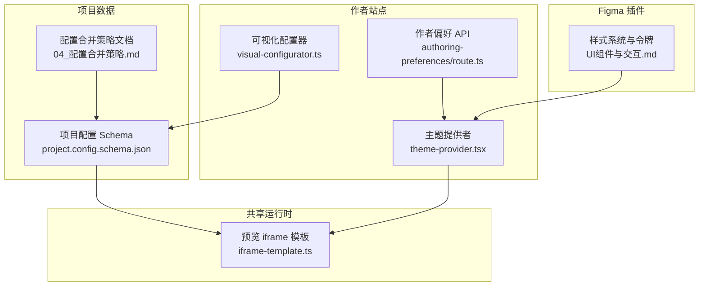
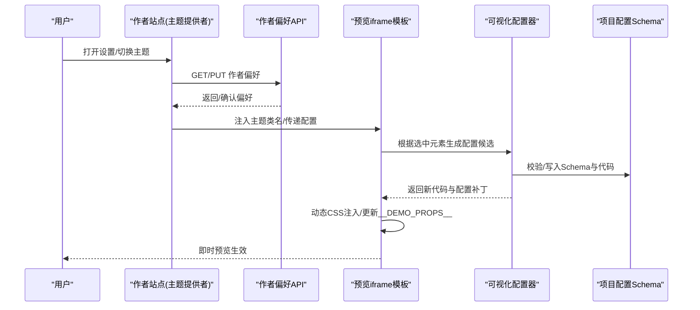
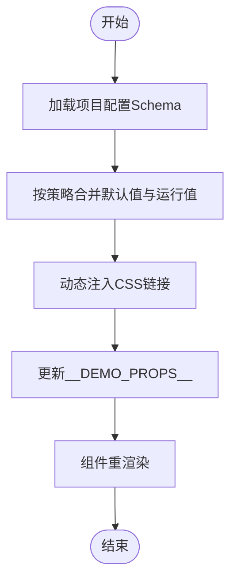
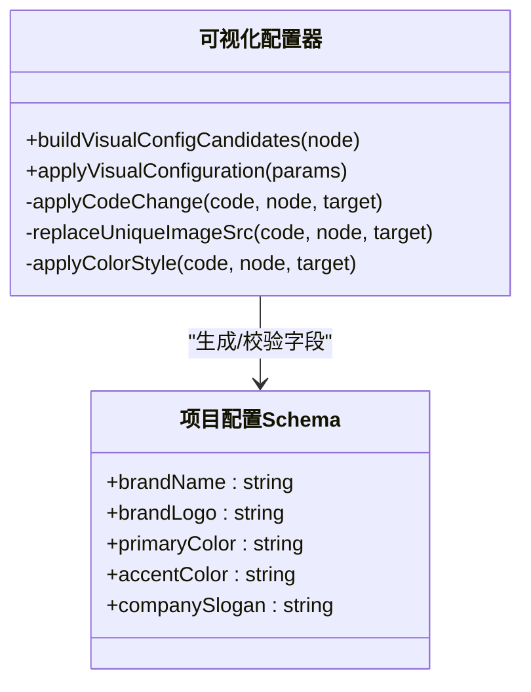
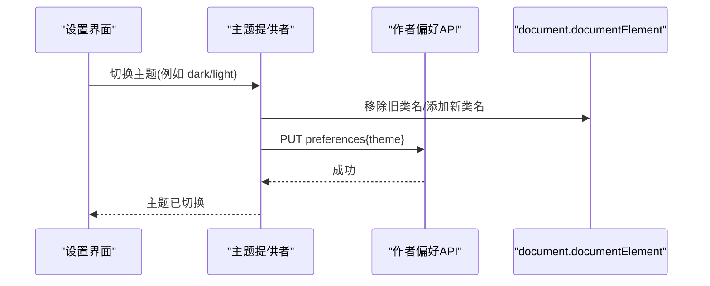
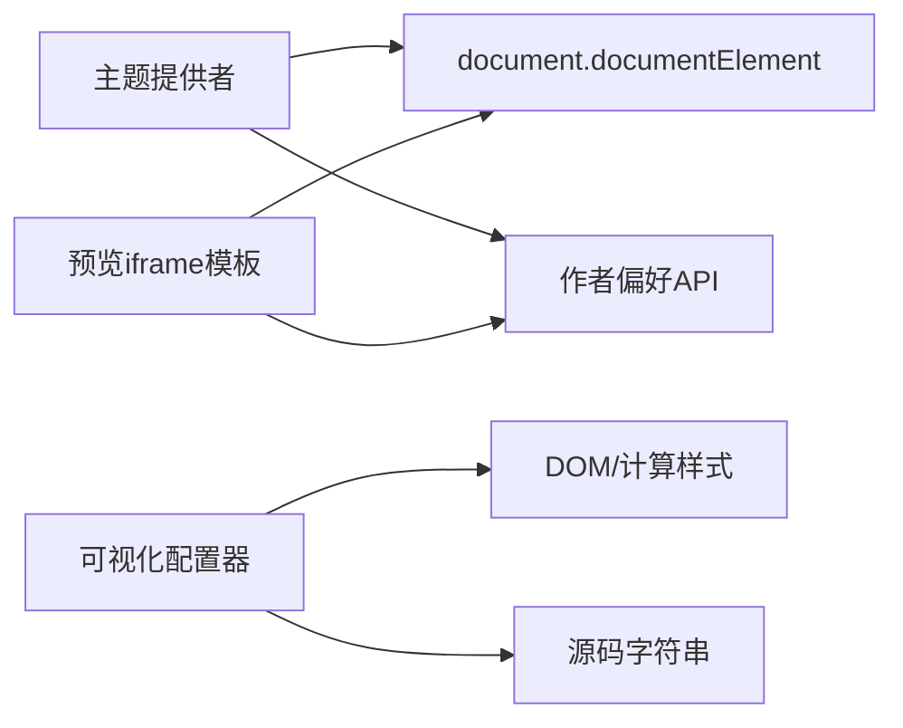

# 主题定制

<cite>
**本文引用的文件**
- [theme-provider.tsx](file://packages/author-site/src/components/providers/theme-provider.tsx)
- [project.config.schema.json](file://data/projects/proj_1783334663364_30hsrv/workspace/project.config.schema.json)
- [iframe-template.ts](file://packages/shared/src/demo/iframe-template.ts)
- [visual-configurator.ts](file://packages/author-site/src/lib/visual-configurator.ts)
- [route.ts](file://packages/author-site/src/app/api/user/authoring-preferences/route.ts)
- [技术/04_配置合并策略.md](file://docs/项目文档/创作端/04-配置与预览/技术/04_配置合并策略.md)
- [UI组件与交互.md](file://docs/项目文档/figma插件/技术/UI组件与交互.md)
</cite>

## 目录
1. [简介](#简介)
2. [项目结构](#项目结构)
3. [核心组件](#核心组件)
4. [架构总览](#架构总览)
5. [详细组件分析](#详细组件分析)
6. [依赖关系分析](#依赖关系分析)
7. [性能考虑](#性能考虑)
8. [故障排查指南](#故障排查指南)
9. [结论](#结论)
10. [附录](#附录)

## 简介
本指南面向“主题定制系统”的开发者与维护者，系统化阐述样式覆盖机制、品牌化配置方案、动态主题切换原理、响应式适配策略，以及主题开发与测试、性能优化和浏览器兼容性最佳实践。内容基于仓库中现有实现与文档进行提炼与整合，确保可落地、可追溯。

## 项目结构
围绕主题定制相关的关键位置：
- 运行时主题上下文与深色模式注入：作者站点主题提供者
- 项目级品牌与颜色配置定义（Schema）：项目工作区配置 Schema
- 预览 iframe 模板与动态 CSS 注入：共享演示模板
- 可视化配置器（将 UI 选择映射为代码与 Schema 变更）：可视化配置工具
- 用户偏好持久化 API：作者偏好设置路由
- 配置合并策略说明：配置默认值与运行值分离与合并策略
- Figma 插件样式系统与令牌：设计令牌与深色模式适配

图表来源
- [theme-provider.tsx:1-36](file://packages/author-site/src/components/providers/theme-provider.tsx#L1-L36)
- [visual-configurator.ts:1-492](file://packages/author-site/src/lib/visual-configurator.ts#L1-L492)
- [iframe-template.ts:1-800](file://packages/shared/src/demo/iframe-template.ts#L1-L800)
- [project.config.schema.json:1-35](file://data/projects/proj_1783334663364_30hsrv/workspace/project.config.schema.json#L1-L35)
- [技术/04_配置合并策略.md:168-170](file://docs/项目文档/创作端/04-配置与预览/技术/04_配置合并策略.md#L168-L170)
- [UI组件与交互.md:191-206](file://docs/项目文档/figma插件/技术/UI组件与交互.md#L191-L206)

章节来源
- [theme-provider.tsx:1-36](file://packages/author-site/src/components/providers/theme-provider.tsx#L1-L36)
- [project.config.schema.json:1-35](file://data/projects/proj_1783334663364_30hsrv/workspace/project.config.schema.json#L1-L35)
- [iframe-template.ts:1-800](file://packages/shared/src/demo/iframe-template.ts#L1-L800)
- [visual-configurator.ts:1-492](file://packages/author-site/src/lib/visual-configurator.ts#L1-L492)
- [route.ts:40-99](file://packages/author-site/src/app/api/user/authoring-preferences/route.ts#L40-L99)
- [技术/04_配置合并策略.md:168-170](file://docs/项目文档/创作端/04-配置与预览/技术/04_配置合并策略.md#L168-L170)
- [UI组件与交互.md:191-206](file://docs/项目文档/figma插件/技术/UI组件与交互.md#L191-L206)

## 核心组件
- 主题提供者（Theme Provider）
  - 负责在根节点注入 dark/light 类名，提供统一的主题上下文。当前实现固定为深色模式，便于后续扩展多主题。
- 项目配置 Schema（品牌与颜色）
  - 通过 JSON Schema 声明品牌名称、Logo、主色、强调色等字段，作为配置面板与预览渲染的数据契约。
- 预览 iframe 模板（动态 CSS 注入）
  - 支持动态插入外部 CSS 链接，并在运行时更新配置数据，驱动组件重渲染。
- 可视化配置器（Visual Configurator）
  - 将用户在预览中的选择（文本、图片、颜色）转换为对源码与 Schema 的安全修改，并生成配置补丁。
- 作者偏好 API（持久化）
  - 提供读取与保存用户创作偏好的接口，用于持久化主题与布局偏好。

章节来源
- [theme-provider.tsx:1-36](file://packages/author-site/src/components/providers/theme-provider.tsx#L1-L36)
- [project.config.schema.json:1-35](file://data/projects/proj_1783334663364_30hsrv/workspace/project.config.schema.json#L1-L35)
- [iframe-template.ts:1-800](file://packages/shared/src/demo/iframe-template.ts#L1-L800)
- [visual-configurator.ts:1-492](file://packages/author-site/src/lib/visual-configurator.ts#L1-L492)
- [route.ts:40-99](file://packages/author-site/src/app/api/user/authoring-preferences/route.ts#L40-L99)

## 架构总览
主题定制涉及三层：
- 应用层：主题提供者与用户偏好 API，管理全局主题状态与持久化
- 配置层：项目配置 Schema 与合并策略，定义品牌与颜色字段及默认值
- 预览层：iframe 模板负责动态 CSS 注入与配置传递，驱动组件实时渲染

图表来源
- [theme-provider.tsx:1-36](file://packages/author-site/src/components/providers/theme-provider.tsx#L1-L36)
- [route.ts:40-99](file://packages/author-site/src/app/api/user/authoring-preferences/route.ts#L40-L99)
- [iframe-template.ts:1-800](file://packages/shared/src/demo/iframe-template.ts#L1-L800)
- [visual-configurator.ts:1-492](file://packages/author-site/src/lib/visual-configurator.ts#L1-L492)
- [project.config.schema.json:1-35](file://data/projects/proj_1783334663364_30hsrv/workspace/project.config.schema.json#L1-L35)

## 详细组件分析

### 样式覆盖机制
- CSS 变量与令牌
  - 设计侧使用 Tailwind 语义化令牌（如主背景、主文字、边框等），并通过深色模式自动适配。
  - 建议将品牌色与强调色映射到 CSS 变量或 Tailwind 自定义令牌，以便集中管理与覆盖。
- 主题配置文件
  - 使用 JSON Schema 描述字段类型、默认值与约束；运行值与定义分离，避免误写回默认值。
- 动态样式注入
  - 预览 iframe 模板支持动态插入外部 CSS 链接，并在运行时更新配置数据，触发组件重渲染。

图表来源
- [UI组件与交互.md:191-206](file://docs/项目文档/figma插件/技术/UI组件与交互.md#L191-L206)
- [技术/04_配置合并策略.md:168-170](file://docs/项目文档/创作端/04-配置与预览/技术/04_配置合并策略.md#L168-L170)
- [iframe-template.ts:1-800](file://packages/shared/src/demo/iframe-template.ts#L1-L800)

章节来源
- [UI组件与交互.md:191-206](file://docs/项目文档/figma插件/技术/UI组件与交互.md#L191-L206)
- [技术/04_配置合并策略.md:168-170](file://docs/项目文档/创作端/04-配置与预览/技术/04_配置合并策略.md#L168-L170)
- [iframe-template.ts:1-800](file://packages/shared/src/demo/iframe-template.ts#L1-L800)

### 品牌化配置方案
- Logo 替换
  - 通过 Schema 的 image 类型字段承载 Logo 地址；可视化配置器可将图片 src 绑定到配置字段。
- 颜色主题
  - 使用 primaryColor/accentColor 等字段定义主色与强调色；可视化配置器可将 color/backgroundColor/borderColor 绑定到配置字段。
- 字体配置
  - 可在预览样式编辑面板中选择常用字体族，或通过外部 CSS 引入自定义字体。
- 布局定制
  - 结合项目配置与页面级默认值，通过合并策略生成每页 props，实现布局差异化。

图表来源
- [project.config.schema.json:1-35](file://data/projects/proj_1783334663364_30hsrv/workspace/project.config.schema.json#L1-L35)
- [visual-configurator.ts:1-492](file://packages/author-site/src/lib/visual-configurator.ts#L1-L492)

章节来源
- [project.config.schema.json:1-35](file://data/projects/proj_1783334663364_30hsrv/workspace/project.config.schema.json#L1-L35)
- [visual-configurator.ts:1-492](file://packages/author-site/src/lib/visual-configurator.ts#L1-L492)

### 动态主题切换的实现原理
- 运行时主题更新
  - 主题提供者初始化时向根节点添加 dark 类名，配合 Tailwind 的 .dark 选择器实现样式覆盖。
- 持久化存储与用户偏好
  - 作者偏好 API 提供读取与保存接口，支持清空偏好；前端可在切换主题后调用保存，下次启动恢复。
- 用户偏好设置
  - 建议在偏好对象中记录 theme、colorScheme、fontFamily、breakpoints 等键，供主题提供者消费。

图表来源
- [theme-provider.tsx:1-36](file://packages/author-site/src/components/providers/theme-provider.tsx#L1-L36)
- [route.ts:40-99](file://packages/author-site/src/app/api/user/authoring-preferences/route.ts#L40-L99)

章节来源
- [theme-provider.tsx:1-36](file://packages/author-site/src/components/providers/theme-provider.tsx#L1-L36)
- [route.ts:40-99](file://packages/author-site/src/app/api/user/authoring-preferences/route.ts#L40-L99)

### 响应式设计适配
- 断点配置
  - 建议在用户偏好或项目配置中维护断点数组，主题提供者或样式层据此注入媒体查询规则。
- 移动端优化
  - 利用 iframe 模板的动态 CSS 能力，按需加载移动端专用样式；同时控制字体大小、间距与触控区域。
- 跨设备兼容性
  - 使用系统默认字体栈与通用单位，减少字体加载失败风险；对颜色对比度与可访问性进行基线检查。

[本节为概念性说明，不直接分析具体文件]

### 主题开发示例（步骤指引）
- 自定义组件样式
  - 在预览中选中目标元素，使用可视化配置器将其文本/图片/颜色绑定到配置字段，自动生成 Schema 与代码变更。
- 动画效果
  - 通过动态 CSS 注入动画样式，或在组件中使用动画库（如 framer-motion）并通过配置开关启用。
- 交互反馈
  - 在主题提供者中暴露主题状态，组件根据状态显示不同交互态（如高亮、禁用）。

章节来源
- [visual-configurator.ts:1-492](file://packages/author-site/src/lib/visual-configurator.ts#L1-L492)
- [iframe-template.ts:1-800](file://packages/shared/src/demo/iframe-template.ts#L1-L800)

## 依赖关系分析
- 主题提供者依赖 document 类名操作与 React Context
- 可视化配置器依赖 DOM 信息（节点、计算样式、属性）与源码字符串解析
- 预览 iframe 模板依赖消息通信与动态 CSS 注入
- 作者偏好 API 依赖文件系统读写与错误封装

图表来源
- [theme-provider.tsx:1-36](file://packages/author-site/src/components/providers/theme-provider.tsx#L1-L36)
- [visual-configurator.ts:1-492](file://packages/author-site/src/lib/visual-configurator.ts#L1-L492)
- [iframe-template.ts:1-800](file://packages/shared/src/demo/iframe-template.ts#L1-L800)
- [route.ts:40-99](file://packages/author-site/src/app/api/user/authoring-preferences/route.ts#L40-L99)

章节来源
- [theme-provider.tsx:1-36](file://packages/author-site/src/components/providers/theme-provider.tsx#L1-L36)
- [visual-configurator.ts:1-492](file://packages/author-site/src/lib/visual-configurator.ts#L1-L492)
- [iframe-template.ts:1-800](file://packages/shared/src/demo/iframe-template.ts#L1-L800)
- [route.ts:40-99](file://packages/author-site/src/app/api/user/authoring-preferences/route.ts#L40-L99)

## 性能考虑
- 最小化样式重排
  - 批量更新 documentElement 类名，避免频繁切换导致重排。
- 动态 CSS 注入
  - 仅注入必要样式，去重与缓存已加载的 CSS 链接，防止重复请求。
- 配置合并
  - 遵循“定义与运行值分离”的策略，增量合并默认值与用户值，减少不必要的重新渲染。
- 预览刷新
  - 使用版本标记避免竞态条件，确保最新代码与配置生效。

[本节为通用指导，不直接分析具体文件]

## 故障排查指南
- 无法定位选中元素
  - 检查可视化配置器的锚点匹配逻辑，确保唯一性与 JSX 标签边界正确。
- 复杂 style 表达式冲突
  - 当元素已有复杂 style 表达式时，安全合并会拒绝写入，需手动重构或使用更明确的锚点。
- 配置字段冲突
  - 若字段 key 已存在，需调整命名或清理旧配置后再试。
- 作者偏好保存失败
  - 检查 API 返回的错误码与消息，确认权限与参数合法性。

章节来源
- [visual-configurator.ts:1-492](file://packages/author-site/src/lib/visual-configurator.ts#L1-L492)
- [route.ts:40-99](file://packages/author-site/src/app/api/user/authoring-preferences/route.ts#L40-L99)

## 结论
本指南从样式覆盖、品牌化配置、动态主题切换、响应式适配到开发与测试流程，提供了完整的主题定制方案。依托 JSON Schema 与可视化配置器，团队可以以低门槛方式完成品牌与视觉的统一管理；通过主题提供者与作者偏好 API，实现跨会话的主题持久化与快速切换。

## 附录
- 术语
  - 主题：包括颜色、字体、布局与交互态的整体视觉风格
  - 令牌：可复用的设计变量（如主色、强调色、圆角等）
  - 运行值：用户实际选择的配置值，区别于 Schema 中的默认值
- 参考路径
  - 主题提供者：packages/author-site/src/components/providers/theme-provider.tsx
  - 项目配置 Schema：data/projects/*/workspace/project.config.schema.json
  - 预览 iframe 模板：packages/shared/src/demo/iframe-template.ts
  - 可视化配置器：packages/author-site/src/lib/visual-configurator.ts
  - 作者偏好 API：packages/author-site/src/app/api/user/authoring-preferences/route.ts
  - 配置合并策略：docs/项目文档/创作端/04-配置与预览/技术/04_配置合并策略.md
  - Figma 插件样式系统：docs/项目文档/figma插件/技术/UI组件与交互.md