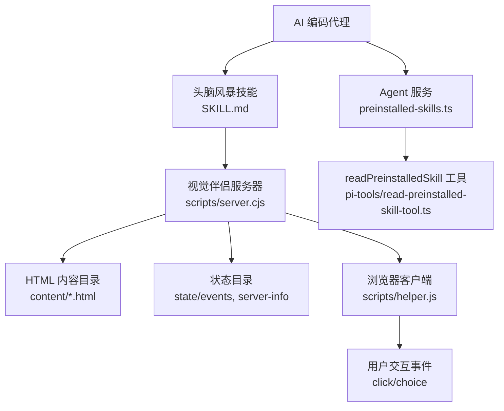
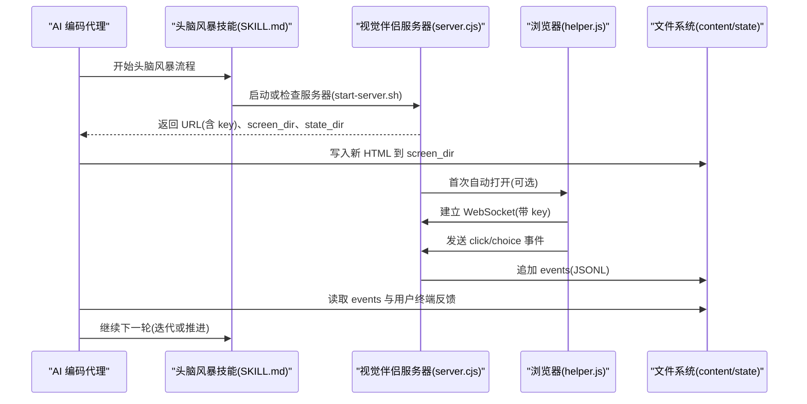
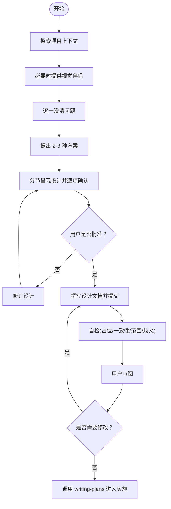
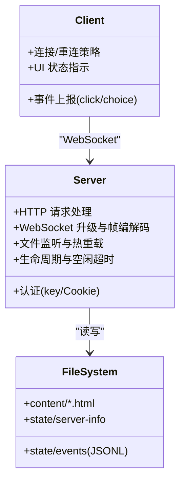
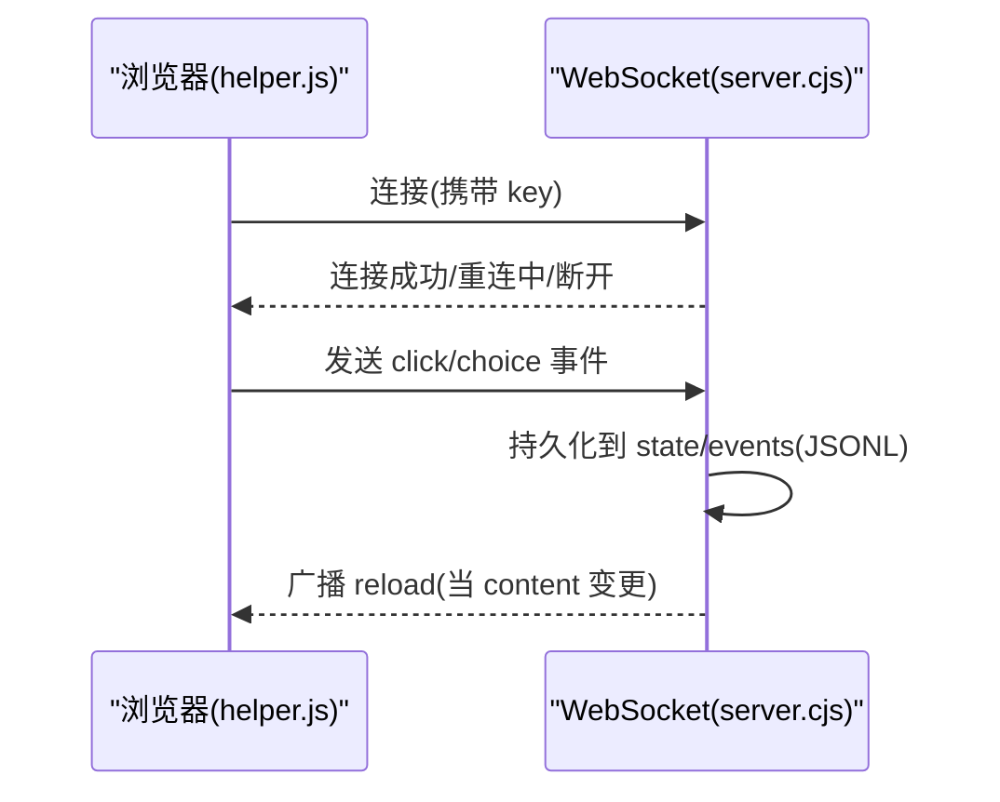
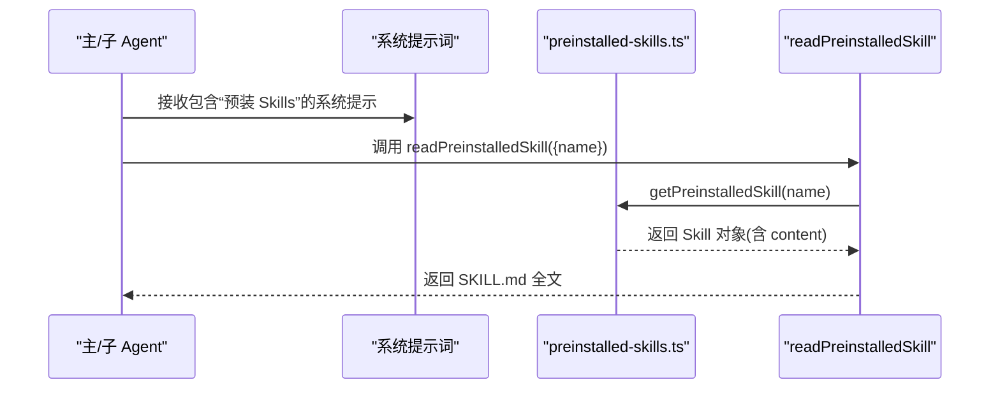
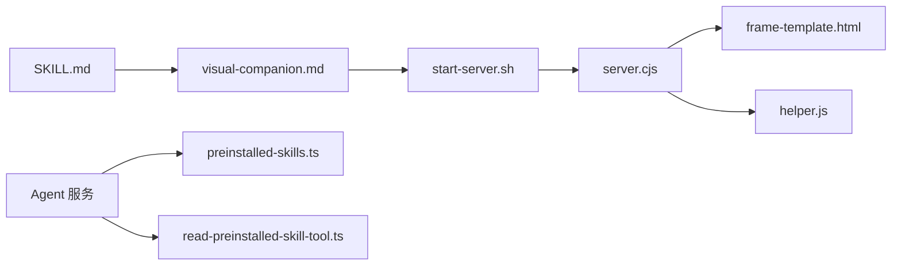

# 头脑风暴技能

<cite>
**本文引用的文件**   
- [SKILL.md](file://.agents/skills/头脑风暴/SKILL.md)
- [visual-companion.md](file://.agents/skills/头脑风暴/visual-companion.md)
- [server.cjs](file://.agents/skills/头脑风暴/scripts/server.cjs)
- [helper.js](file://.agents/skills/头脑风暴/scripts/helper.js)
- [start-server.sh](file://.agents/skills/头脑风暴/scripts/start-server.sh)
- [frame-template.html](file://.agents/skills/头脑风暴/scripts/frame-template.html)
- [preinstalled-skills.ts](file://packages/agent-service/src/backends/preinstalled-skills.ts)
- [read-preinstalled-skill-tool.ts](file://packages/agent-service/src/backends/pi-tools/read-preinstalled-skill-tool.ts)
- [03_AI行为约束机制.md](file://docs/项目文档/创作端/05-AI对话/技术/03_AI行为约束机制.md)
</cite>

## 目录
1. [简介](#简介)
2. [项目结构](#项目结构)
3. [核心组件](#核心组件)
4. [架构总览](#架构总览)
5. [详细组件分析](#详细组件分析)
6. [依赖关系分析](#依赖关系分析)
7. [性能与可用性考虑](#性能与可用性考虑)
8. [故障排查指南](#故障排查指南)
9. [结论](#结论)

## 简介
“头脑风暴技能”是一套面向 AI 编码代理的协作式设计流程规范，配合一个轻量浏览器端“视觉伴侣”，帮助将模糊想法逐步收敛为可评审的设计与规格说明。其关键要点：
- 强制在实现前先进行需求澄清、方案对比、分节设计与用户确认，最终产出设计文档并转入实施计划。
- 提供可选的可视化辅助工具（本地 HTTP + WebSocket），用于展示线框图、布局对比、架构图等，并在浏览器中收集用户的点击选择事件。
- 通过 Agent 服务中的“预装 Skill”机制，使该技能可在运行时被读取与应用。

## 项目结构
头脑风暴技能由两部分组成：
- 技能规范与使用指南：位于 .agents/skills/头脑风暴 下，包含 SKILL.md、visual-companion.md 以及脚本资源。
- 运行期集成：Agent 服务通过“预装 Skill”机制暴露 readPreinstalledSkill 工具，供主/子 Agent 按需读取技能内容。

图表来源
- [SKILL.md:1-160](file://.agents/skills/头脑风暴/SKILL.md#L1-L160)
- [server.cjs:1-724](file://.agents/skills/头脑风暴/scripts/server.cjs#L1-L724)
- [helper.js:1-168](file://.agents/skills/头脑风暴/scripts/helper.js#L1-L168)
- [preinstalled-skills.ts:1-125](file://packages/agent-service/src/backends/preinstalled-skills.ts#L1-L125)
- [read-preinstalled-skill-tool.ts:1-34](file://packages/agent-service/src/backends/pi-tools/read-preinstalled-skill-tool.ts#L1-L34)

章节来源
- [SKILL.md:1-160](file://.agents/skills/头脑风暴/SKILL.md#L1-L160)
- [visual-companion.md:1-292](file://.agents/skills/头脑风暴/visual-companion.md#L1-L292)

## 核心组件
- 技能规范（SKILL.md）：定义端到端流程、硬性门禁（先设计后实现）、自检清单、输出位置与后续衔接（调用 writing-plans）。
- 视觉伴侣（server.cjs + helper.js + frame-template.html）：本地 HTTP 服务 + 自定义 WebSocket 协议，监听 content 目录变化，向浏览器推送最新页面；记录用户选择到 state/events。
- 启动脚本（start-server.sh）：跨平台启动器，负责会话目录、端口复用、自动打开浏览器、前台/后台模式、空闲超时等。
- 预装 Skill 集成（preinstalled-skills.ts + read-preinstalled-skill-tool.ts）：Agent 服务在系统提示词中注入可用 skill 列表，并提供工具读取具体 skill 的完整内容。

章节来源
- [SKILL.md:1-160](file://.agents/skills/头脑风暴/SKILL.md#L1-L160)
- [server.cjs:1-724](file://.agents/skills/头脑风暴/scripts/server.cjs#L1-L724)
- [helper.js:1-168](file://.agents/skills/头脑风暴/scripts/helper.js#L1-L168)
- [start-server.sh:1-210](file://.agents/skills/头脑风暴/scripts/start-server.sh#L1-L210)
- [preinstalled-skills.ts:1-125](file://packages/agent-service/src/backends/preinstalled-skills.ts#L1-L125)
- [read-preinstalled-skill-tool.ts:1-34](file://packages/agent-service/src/backends/pi-tools/read-preinstalled-skill-tool.ts#L1-L34)

## 架构总览
头脑风暴技能的工作流分为两条主线：
- 文本驱动的流程控制：遵循 SKILL.md 的步骤，逐步推进理解、方案、设计、评审与落地。
- 可视化驱动的交互：通过视觉伴侣在浏览器中呈现选项，用户点击后事件落盘，AI 在下一次回合读取并结合终端反馈继续推进。

图表来源
- [SKILL.md:34-61](file://.agents/skills/头脑风暴/SKILL.md#L34-L61)
- [start-server.sh:1-210](file://.agents/skills/头脑风暴/scripts/start-server.sh#L1-L210)
- [server.cjs:576-714](file://.agents/skills/头脑风暴/scripts/server.cjs#L576-L714)
- [helper.js:77-118](file://.agents/skills/头脑风暴/scripts/helper.js#L77-L118)

## 详细组件分析

### 技能流程与门禁（SKILL.md）
- 强制门禁：在任何实现动作之前必须先完成设计与用户批准。
- 标准步骤：探索上下文 → 适时提供视觉伴侣 → 逐问澄清 → 提出 2-3 种方案 → 分节呈现设计并逐项确认 → 编写设计文档并提交 → 自检与用户审阅 → 调用 writing-plans 进入实施。
- 输出约定：设计文档默认保存在 docs/superpowers/specs/YYYY-MM-DD-<topic>-design.md。

图表来源
- [SKILL.md:20-61](file://.agents/skills/头脑风暴/SKILL.md#L20-L61)

章节来源
- [SKILL.md:1-160](file://.agents/skills/头脑风暴/SKILL.md#L1-L160)

### 视觉伴侣服务器（server.cjs）
- 功能要点
  - 基于 Node http 模块实现 HTTP 路由与静态内容分发。
  - 自行实现 RFC 6455 的 WebSocket 握手与帧编解码，避免额外依赖。
  - 认证机制：URL 查询参数 ?key= 与 HttpOnly Cookie 双重校验，防止跨站访问与 DNS Rebinding。
  - 内容热更新：fs.watch 监听 content 目录，新增或更新 HTML 时广播 reload 事件，浏览器自动刷新。
  - 生命周期管理：支持空闲超时退出、父进程存活检测、端口冲突回退、自动打开浏览器（仅本地回环且用户同意）。
- 安全与健壮性
  - 严格限制 /files/* 访问路径，拒绝符号链接与非普通文件。
  - 设置严格的响应头（X-Frame-Options、CSP、Cross-Origin-Resource-Policy）。
  - 对大帧载荷进行上限校验，防止内存滥用。

图表来源
- [server.cjs:1-724](file://.agents/skills/头脑风暴/scripts/server.cjs#L1-L724)

章节来源
- [server.cjs:1-724](file://.agents/skills/头脑风暴/scripts/server.cjs#L1-L724)

### 浏览器客户端（helper.js）
- 连接与重连：指数退避重连，断线超过阈值显示“暂停”遮罩，恢复后自动刷新并通过带 key 的引导页重建 Cookie。
- 事件采集：自动捕获带有 data-choice 的元素点击，封装为 click/choice 事件并附带时间戳。
- 全局 API：暴露 window.brainstorm.send 与 choice，便于在内容片段中主动上报事件。

图表来源
- [helper.js:77-118](file://.agents/skills/头脑风暴/scripts/helper.js#L77-L118)
- [server.cjs:503-517](file://.agents/skills/头脑风暴/scripts/server.cjs#L503-L517)

章节来源
- [helper.js:1-168](file://.agents/skills/头脑风暴/scripts/helper.js#L1-L168)

### 启动脚本（start-server.sh）
- 能力概览
  - 解析参数：project-dir、host/url-host、idle-timeout-minutes、open、foreground/background。
  - 会话隔离：生成唯一 session 目录，区分 content 与 state。
  - 端口与令牌复用：通过 last-port/last-token 文件实现重启后同端口与同 key，保证已打开标签页可无缝重连。
  - 跨平台兼容：Windows/Git Bash 自动切换前台模式；Codex CI 环境自动前台运行。
  - 健康检查：等待 server-started 日志并验证进程存活，失败给出重试建议。
- 典型用法
  - 本地开发：start-server.sh --project-dir <项目根> --open
  - 远程/容器：start-server.sh --project-dir <项目根> --host 0.0.0.0 --url-host localhost

章节来源
- [start-server.sh:1-210](file://.agents/skills/头脑风暴/scripts/start-server.sh#L1-L210)

### 前端模板与样式（frame-template.html）
- 提供统一的框架：顶部品牌栏、连接状态指示灯、滚动内容区。
- 内置 CSS 类：options、cards、mockup、split、pros-cons、placeholder 等，便于快速构建可视化选项与对比。
- 主题适配：跟随系统明暗主题，变量集中管理。

章节来源
- [frame-template.html:1-214](file://.agents/skills/头脑风暴/scripts/frame-template.html#L1-L214)

### 预装 Skill 与 Agent 集成
- 预装 Skill 发现：按环境变量与多候选路径扫描，解析 Frontmatter 元数据，缓存结果。
- 系统提示词注入：在 L2 提示词后附加“预装 Skills”列表，要求匹配任务时先调用 readPreinstalledSkill 读取完整 SKILL.md。
- 工具实现：readPreinstalledSkill 工具根据 name 定位并返回指定 skill 的内容，支持行号范围截取。

图表来源
- [preinstalled-skills.ts:67-125](file://packages/agent-service/src/backends/preinstalled-skills.ts#L67-L125)
- [read-preinstalled-skill-tool.ts:25-34](file://packages/agent-service/src/backends/pi-tools/read-preinstalled-skill-tool.ts#L25-L34)

章节来源
- [preinstalled-skills.ts:1-125](file://packages/agent-service/src/backends/preinstalled-skills.ts#L1-L125)
- [read-preinstalled-skill-tool.ts:1-34](file://packages/agent-service/src/backends/pi-tools/read-preinstalled-skill-tool.ts#L1-L34)
- [03_AI行为约束机制.md:324-339](file://docs/项目文档/创作端/05-AI对话/技术/03_AI行为约束机制.md#L324-L339)

## 依赖关系分析
- 外部依赖
  - Node.js 运行时（http、fs、crypto、child_process、os 等）。
  - 浏览器 WebSocket 与 DOM API。
- 内部依赖
  - Agent 服务通过 preinstalled-skills.ts 与 pi-tools/read-preinstalled-skill-tool.ts 暴露技能读取能力。
  - 技能规范与脚本资源独立于业务代码，便于维护与替换。

图表来源
- [SKILL.md:1-160](file://.agents/skills/头脑风暴/SKILL.md#L1-L160)
- [visual-companion.md:1-292](file://.agents/skills/头脑风暴/visual-companion.md#L1-L292)
- [start-server.sh:1-210](file://.agents/skills/头脑风暴/scripts/start-server.sh#L1-L210)
- [server.cjs:1-724](file://.agents/skills/头脑风暴/scripts/server.cjs#L1-L724)
- [frame-template.html:1-214](file://.agents/skills/头脑风暴/scripts/frame-template.html#L1-L214)
- [helper.js:1-168](file://.agents/skills/头脑风暴/scripts/helper.js#L1-L168)
- [preinstalled-skills.ts:1-125](file://packages/agent-service/src/backends/preinstalled-skills.ts#L1-L125)
- [read-preinstalled-skill-tool.ts:1-34](file://packages/agent-service/src/backends/pi-tools/read-preinstalled-skill-tool.ts#L1-L34)

## 性能与可用性考虑
- 服务端
  - 文件监听采用防抖合并，减少频繁 reload 带来的抖动。
  - 空闲超时与父进程守护确保资源及时回收，避免僵尸进程。
  - 端口冲突自动回退，提升启动成功率。
- 客户端
  - 指数退避重连，避免雪崩式重连。
  - 断线遮罩提示，改善用户体验。
- 安全性
  - 强校验 key 与 Cookie，限制同源与 Origin。
  - 严格的路径白名单与安全响应头，降低 XSS/点击劫持风险。

[本节为通用指导，不直接分析具体文件]

## 故障排查指南
- 无法打开浏览器或 URL 不可达
  - 检查 start-server.sh 输出中的 url 字段是否包含 ?key=。
  - 远程/容器场景需设置 --host 0.0.0.0 与合适的 --url-host。
- 页面不刷新或无交互
  - 确认浏览器控制台是否有 WebSocket 连接错误。
  - 检查 state/events 是否存在，若为空表示未发生交互。
- 服务器意外退出
  - 查看 state/server-stopped 与 server.log，关注 idle timeout 或 owner process exited。
  - 若端口冲突，脚本会尝试回退随机端口，请重新获取 server-info。
- 权限与安全问题
  - 确认浏览器访问的 URL 包含 key；否则会被 403 拒绝。
  - 确认 /files/* 访问的文件确实在 content 目录下且为普通文件。

章节来源
- [server.cjs:386-438](file://.agents/skills/头脑风暴/scripts/server.cjs#L386-L438)
- [server.cjs:576-714](file://.agents/skills/头脑风暴/scripts/server.cjs#L576-L714)
- [start-server.sh:185-210](file://.agents/skills/头脑风暴/scripts/start-server.sh#L185-L210)

## 结论
“头脑风暴技能”以严谨的流程门禁与灵活的可视化辅助相结合，既保证了设计质量与可追溯性，又提升了人机协作效率。通过预装 Skill 机制，该技能可以无缝融入 Agent 工作流；而视觉伴侣则以最小依赖实现高可用的本地演示与交互闭环。建议在团队内推广该实践，并将相关规范与脚本纳入工程基线，持续优化体验与稳定性。