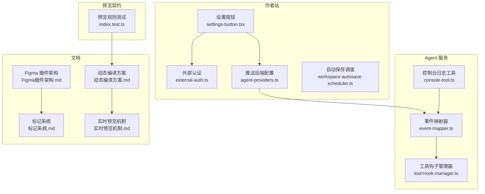
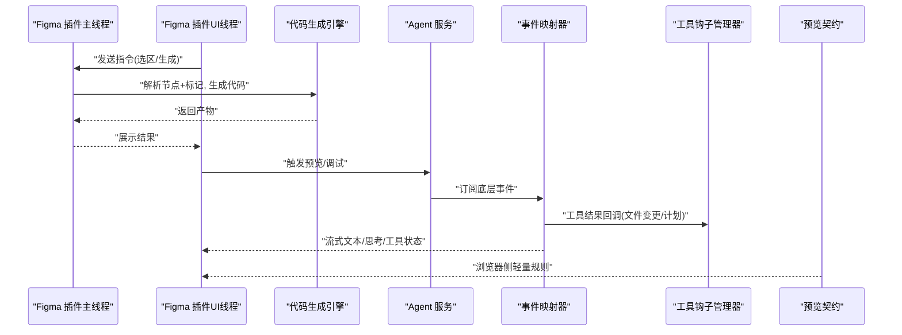
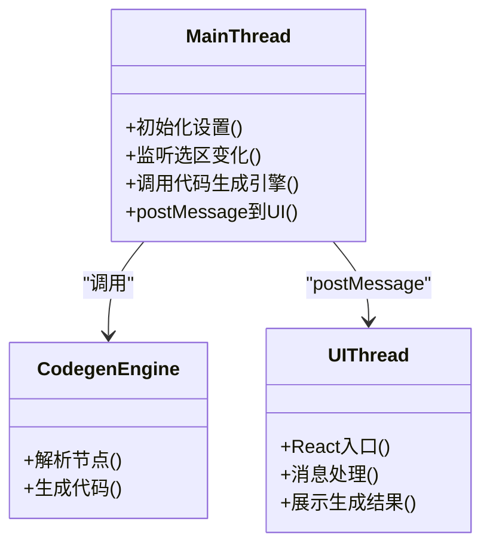
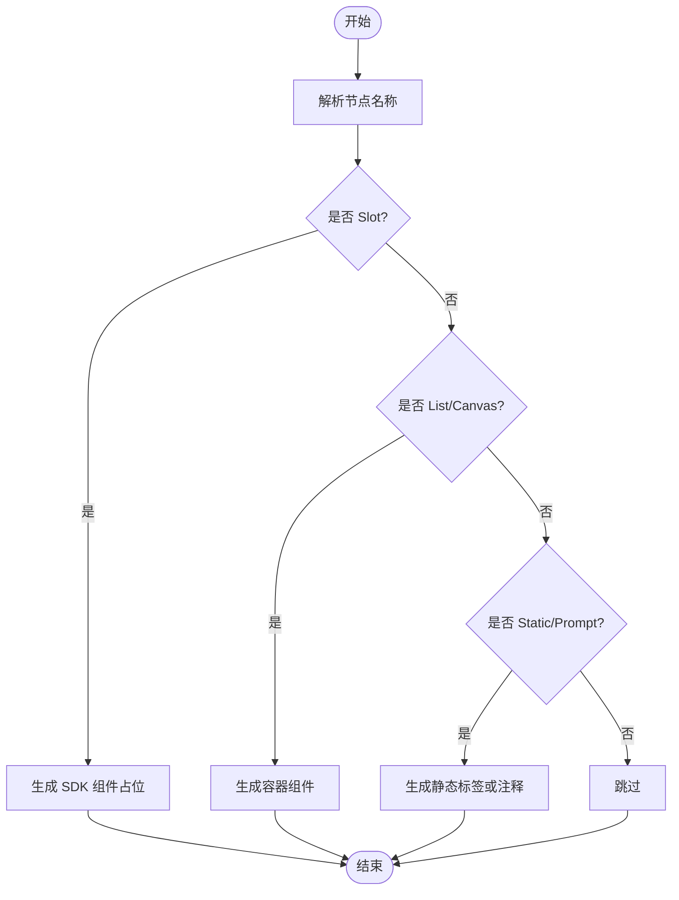
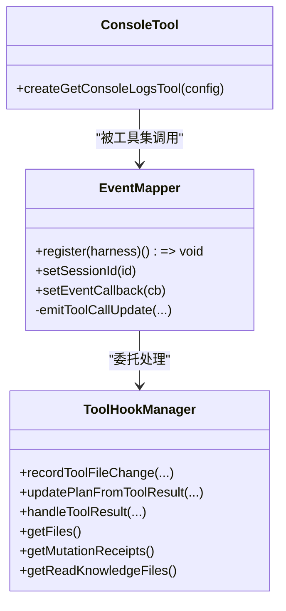
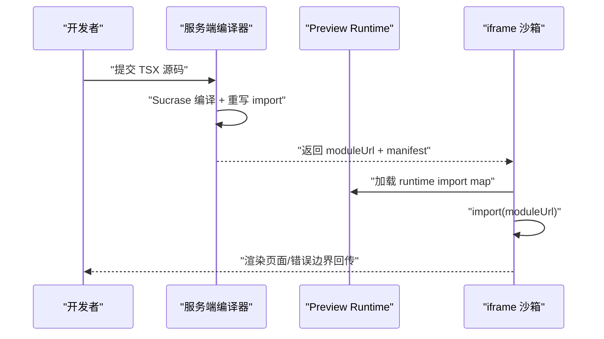
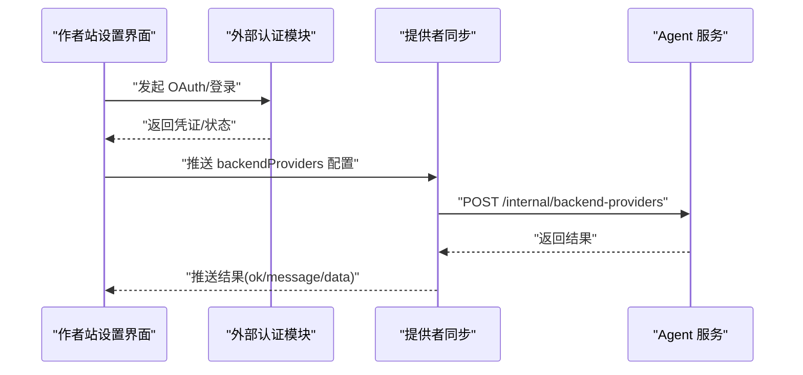
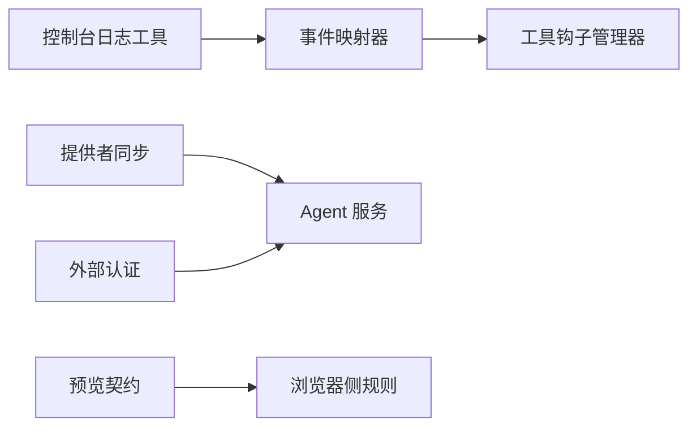

# 扩展定制

<cite>
**本文引用的文件**   
- [Figma插件架构.md](file://docs/项目文档/figma插件/技术/Figma插件架构.md)
- [标记系统.md](file://docs/项目文档/figma插件/技术/标记系统.md)
- [动态编译方案.md](file://docs/项目文档/创作端/04-配置与预览/技术/01_动态编译方案.md)
- [实时预览机制.md](file://docs/项目文档/创作端/04-配置与预览/技术/02_实时预览机制.md)
- [event-mapper.ts](file://packages/agent-service/src/backends/managers/event-mapper.ts)
- [tool-hook-manager.ts](file://packages/agent-service/src/backends/managers/tool-hook-manager.ts)
- [console-tool.ts](file://packages/agent-service/src/backends/pi-tools/console-tool.ts)
- [pi-agent.test.ts](file://packages/agent-service/tests/unit/pi-agent.test.ts)
- [external-auth.ts](file://packages/author-site/src/lib/external-auth.ts)
- [agent-providers.ts](file://packages/author-site/src/lib/agent-providers.ts)
- [settings-button.tsx](file://packages/author-site/src/components/settings/settings-button.tsx)
- [workspace-autosave-scheduler.ts](file://packages/author-site/src/lib/workspace-autosave-scheduler.ts)
- [index.test.ts](file://packages/preview-contract/src/index.test.ts)
</cite>

## 目录
1. [简介](#简介)
2. [项目结构](#项目结构)
3. [核心组件](#核心组件)
4. [架构总览](#架构总览)
5. [详细组件分析](#详细组件分析)
6. [依赖分析](#依赖分析)
7. [性能考虑](#性能考虑)
8. [故障排查指南](#故障排查指南)
9. [结论](#结论)
10. [附录](#附录)

## 简介
本文件面向 Workbench 平台的扩展开发者，系统性阐述以下能力：
- 插件开发框架：Agent 后端插件、工具插件、预览引擎扩展
- Figma 插件的架构设计与集成方案：双线程通信、标记系统、代码生成引擎、资源处理
- 第三方系统集成：GitHub（预留）、云服务对接、自定义存储适配
- 主题定制：样式覆盖、品牌化配置、动态主题切换
- 扩展点识别：钩子函数、事件监听器、配置扩展
- 实战示例、最佳实践与发布流程

## 项目结构
Workbench 采用多包工作区组织，关键扩展相关模块分布如下：
- packages/agent-service：Agent 运行时与工具集、事件映射、权限与变更追踪
- packages/author-site：作者站前端，提供外部认证、设置面板、自动保存调度等
- packages/preview-contract：预览契约与规则导出，用于浏览器侧轻量规则读取
- docs/项目文档：Figma 插件架构与标记系统、创作端动态编译与实时预览等技术文档

图表来源
- [settings-button.tsx:638-664](file://packages/author-site/src/components/settings/settings-button.tsx#L638-L664)
- [external-auth.ts:91-281](file://packages/author-site/src/lib/external-auth.ts#L91-L281)
- [agent-providers.ts:1-57](file://packages/author-site/src/lib/agent-providers.ts#L1-L57)
- [event-mapper.ts:1-167](file://packages/agent-service/src/backends/managers/event-mapper.ts#L1-L167)
- [tool-hook-manager.ts:1-280](file://packages/agent-service/src/backends/managers/tool-hook-manager.ts#L1-L280)
- [console-tool.ts:25-61](file://packages/agent-service/src/backends/pi-tools/console-tool.ts#L25-L61)
- [index.test.ts:182-193](file://packages/preview-contract/src/index.test.ts#L182-L193)
- [Figma插件架构.md:16-419](file://docs/项目文档/figma插件/技术/Figma插件架构.md#L16-L419)
- [标记系统.md:41-215](file://docs/项目文档/figma插件/技术/标记系统.md#L41-L215)
- [动态编译方案.md:31-61](file://docs/项目文档/创作端/04-配置与预览/技术/01_动态编译方案.md#L31-L61)
- [实时预览机制.md:153-161](file://docs/项目文档/创作端/04-配置与预览/技术/02_实时预览机制.md#L153-L161)

章节来源
- [Figma插件架构.md:16-419](file://docs/项目文档/figma插件/技术/Figma插件架构.md#L16-L419)
- [标记系统.md:41-215](file://docs/项目文档/figma插件/技术/标记系统.md#L41-L215)
- [动态编译方案.md:31-61](file://docs/项目文档/创作端/04-配置与预览/技术/01_动态编译方案.md#L31-L61)
- [实时预览机制.md:153-161](file://docs/项目文档/创作端/04-配置与预览/技术/02_实时预览机制.md#L153-L161)

## 核心组件
- Agent 事件映射器：将底层 Agent 事件统一为应用层事件，并委托工具钩子管理器进行文件变更与计划更新。
- 工具钩子管理器：拦截工具调用、校验路径权限、捕获文件变更摘要、记录工作区变更回执、追踪知识库读取。
- 控制台日志工具：从 iframe 预览沙箱中获取最近 console 输出，辅助调试。
- 外部认证与提供者同步：在作者站完成第三方授权后，将后端提供者配置推送到 Agent 服务。
- 预览契约与规则：通过轻量规则导出供浏览器侧使用，避免把服务端编译器依赖带入客户端。

章节来源
- [event-mapper.ts:1-167](file://packages/agent-service/src/backends/managers/event-mapper.ts#L1-L167)
- [tool-hook-manager.ts:1-280](file://packages/agent-service/src/backends/managers/tool-hook-manager.ts#L1-L280)
- [console-tool.ts:25-61](file://packages/agent-service/src/backends/pi-tools/console-tool.ts#L25-L61)
- [agent-providers.ts:1-57](file://packages/author-site/src/lib/agent-providers.ts#L1-L57)
- [index.test.ts:182-193](file://packages/preview-contract/src/index.test.ts#L182-L193)

## 架构总览
Workbench 扩展体系围绕“插件—Agent—预览”三要素展开：
- Figma 插件：主线程与 UI 线程双线程通信，解析标记系统，驱动代码生成引擎。
- Agent 服务：以事件为中心，暴露工具集，支持工具钩子、变更回执、计划更新。
- 预览引擎：服务端编译 TSX→ESM，同源 runtime + iframe 沙箱执行；浏览器仅加载轻量规则。

图表来源
- [Figma插件架构.md:16-419](file://docs/项目文档/figma插件/技术/Figma插件架构.md#L16-L419)
- [event-mapper.ts:1-167](file://packages/agent-service/src/backends/managers/event-mapper.ts#L1-L167)
- [tool-hook-manager.ts:1-280](file://packages/agent-service/src/backends/managers/tool-hook-manager.ts#L1-L280)
- [index.test.ts:182-193](file://packages/preview-contract/src/index.test.ts#L182-L193)

## 详细组件分析

### Figma 插件架构与集成
- 双线程模型：主线程负责 Figma API 访问与代码生成，UI 线程负责交互与渲染，二者通过 postMessage 通信。
- 构建与部署：Vite 构建 UI，产出 dist 目录，按 Figma 插件规范发布。
- 类型系统：共享类型定义位于 packages/types，跨包引用。

图表来源
- [Figma插件架构.md:16-419](file://docs/项目文档/figma插件/技术/Figma插件架构.md#L16-L419)

章节来源
- [Figma插件架构.md:16-419](file://docs/项目文档/figma插件/技术/Figma插件架构.md#L16-L419)

### 标记系统与代码生成联动
- 标记类型：资源标记（Slot、Static、AI Prompt）、交互标记（List、Canvas）。
- 互斥规则：配置项标记与动态布局标记互斥，切换时自动清除已有标记。
- 命名约定：通过节点名称前缀识别标记，持久化于 Figma 文件，便于迁移与可视化。

图表来源
- [标记系统.md:41-215](file://docs/项目文档/figma插件/技术/标记系统.md#L41-L215)

章节来源
- [标记系统.md:41-215](file://docs/项目文档/figma插件/技术/标记系统.md#L41-L215)

### Agent 后端插件与工具插件
- 事件映射器：注册 harness.subscribe，将 message_update、agent_end、tool_execution_start/end、tool_call、tool_result、session_compact、save_point 等事件转换为统一 AgentEvent。
- 工具钩子管理器：
  - 工具调用拦截：路径权限校验、知识库写保护（委托权限管理）
  - 工具结果处理：文件变更摘要捕获、计划更新、知识库读取追踪
  - 工作区变更回执：基于 receipt 作为权威来源，确保 live Workspace 变更可追溯
- 控制台日志工具：从 iframe 预览沙箱拉取最近 console 输出，支持过滤与分页。

图表来源
- [event-mapper.ts:1-167](file://packages/agent-service/src/backends/managers/event-mapper.ts#L1-L167)
- [tool-hook-manager.ts:1-280](file://packages/agent-service/src/backends/managers/tool-hook-manager.ts#L1-L280)
- [console-tool.ts:25-61](file://packages/agent-service/src/backends/pi-tools/console-tool.ts#L25-L61)

章节来源
- [event-mapper.ts:1-167](file://packages/agent-service/src/backends/managers/event-mapper.ts#L1-L167)
- [tool-hook-manager.ts:1-280](file://packages/agent-service/src/backends/managers/tool-hook-manager.ts#L1-L280)
- [console-tool.ts:25-61](file://packages/agent-service/src/backends/pi-tools/console-tool.ts#L25-L61)
- [pi-agent.test.ts:1027-1100](file://packages/agent-service/tests/unit/pi-agent.test.ts#L1027-L1100)

### 预览引擎扩展与动态编译
- 架构：服务端编译 TSX→ESM，提取 npm 依赖并重写到同源 runtime URL，生成 moduleHash 与只读 moduleUrl；iframe 沙箱通过 UPDATE_MODULE 导入模块，兼容旧路径。
- 浏览器安全：仅允许从 @workbench/preview-contract/rules 读取轻量规则，禁止引入 TypeScript/Sucrase 等服务端依赖。
- 画布素材节点：除 Demo 页面卡片外，承载文档与图片两类素材节点，不再支持外部网页插入。

图表来源
- [动态编译方案.md:31-61](file://docs/项目文档/创作端/04-配置与预览/技术/01_动态编译方案.md#L31-L61)
- [实时预览机制.md:153-161](file://docs/项目文档/创作端/04-配置与预览/技术/02_实时预览机制.md#L153-L161)

章节来源
- [动态编译方案.md:31-61](file://docs/项目文档/创作端/04-配置与预览/技术/01_动态编译方案.md#L31-L61)
- [实时预览机制.md:153-161](file://docs/项目文档/创作端/04-配置与预览/技术/02_实时预览机制.md#L153-L161)
- [index.test.ts:182-193](file://packages/preview-contract/src/index.test.ts#L182-L193)

### 第三方系统集成
- 外部认证：作者站维护用户的外部认证配置（加密存储），支持刷新令牌、过期检测与安全状态转换。
- 提供者同步：修改 backendProviders 后，通过内部 API 推送至 agent-service，失败不抛异常，返回结果对象供上层决策。
- 设置面板：展示各提供商连接状态与操作入口（如 Figma、钉钉）。

图表来源
- [external-auth.ts:91-281](file://packages/author-site/src/lib/external-auth.ts#L91-L281)
- [agent-providers.ts:1-57](file://packages/author-site/src/lib/agent-providers.ts#L1-L57)
- [settings-button.tsx:638-664](file://packages/author-site/src/components/settings/settings-button.tsx#L638-L664)

章节来源
- [external-auth.ts:91-281](file://packages/author-site/src/lib/external-auth.ts#L91-L281)
- [agent-providers.ts:1-57](file://packages/author-site/src/lib/agent-providers.ts#L1-L57)
- [settings-button.tsx:638-664](file://packages/author-site/src/components/settings/settings-button.tsx#L638-L664)

### 主题定制方案
- 样式覆盖机制：通过 CSS 变量与 Tailwind 类名组合实现主题覆盖，建议在站点级样式表中集中声明覆盖规则。
- 品牌化配置：在作者站设置面板中维护品牌信息（Logo、主色、字体等），并通过运行时注入到全局样式。
- 动态主题切换：利用运行时配置与 CSS 变量，在用户选择主题后即时切换，无需重新构建。

说明：本节为通用指导，不涉及具体文件分析。

### 扩展点识别指南
- 钩子函数
  - 工具钩子：ToolHookManager 提供工具调用拦截与结果处理，适合做权限校验、审计、变更摘要收集。
  - 事件映射：EventMapper.register 可订阅底层事件，适合接入自定义日志、遥测或业务通知。
- 事件监听器
  - Agent 事件：message_update、agent_end、tool_execution_start/end、tool_call、tool_result、session_compact、save_point。
  - 预览事件：iframe 沙箱可通过 ErrorBoundary 回传运行时错误，结合 getConsoleLogs 工具进行诊断。
- 配置扩展
  - backendProviders：作者站修改后推送至 Agent 服务，支持多后端模型与环境变量合并。
  - preview-contract/rules：浏览器侧仅读取轻量规则，避免引入服务端依赖。

章节来源
- [event-mapper.ts:1-167](file://packages/agent-service/src/backends/managers/event-mapper.ts#L1-L167)
- [tool-hook-manager.ts:1-280](file://packages/agent-service/src/backends/managers/tool-hook-manager.ts#L1-L280)
- [agent-providers.ts:1-57](file://packages/author-site/src/lib/agent-providers.ts#L1-L57)
- [index.test.ts:182-193](file://packages/preview-contract/src/index.test.ts#L182-L193)

### 实际扩展开发示例与最佳实践
- 新增工具插件
  - 在工具集中注册新工具，遵循参数 Schema 与返回值约定；如需访问预览沙箱日志，参考控制台日志工具的实现模式。
  - 最佳实践：对敏感路径进行权限校验；对大体积输出进行分页与过滤；记录 durationMs 以便性能分析。
- 扩展 Agent 事件链路
  - 在 EventMapper 中增加新的事件分支，保持向后兼容；必要时在 ToolHookManager 中补充变更摘要逻辑。
  - 最佳实践：避免在事件回调中进行阻塞 IO；使用异步批处理聚合变更。
- 预览引擎扩展
  - 在服务端编译器中添加新的 import 重写规则，确保运行时可用；在 preview-contract/rules 中声明浏览器侧规则。
  - 最佳实践：严格区分服务端与浏览器侧入口，防止误引入 Node 依赖。
- 第三方集成
  - 新增外部提供方时，在外部认证模块中实现凭证加解密、刷新与过期检测；在设置面板中提供连接状态与操作入口。
  - 最佳实践：失败不抛异常，返回结构化结果；对敏感信息进行最小化暴露。

章节来源
- [console-tool.ts:25-61](file://packages/agent-service/src/backends/pi-tools/console-tool.ts#L25-L61)
- [event-mapper.ts:1-167](file://packages/agent-service/src/backends/managers/event-mapper.ts#L1-L167)
- [tool-hook-manager.ts:1-280](file://packages/agent-service/src/backends/managers/tool-hook-manager.ts#L1-L280)
- [dynamic-compilation.md:31-61](file://docs/项目文档/创作端/04-配置与预览/技术/01_动态编译方案.md#L31-L61)
- [external-auth.ts:91-281](file://packages/author-site/src/lib/external-auth.ts#L91-L281)

### 发布流程
- Figma 插件
  - 构建生产版本，上传 dist 目录内容，在 Figma 开发者面板创建新版本并提交审核或内部分发。
- Agent 服务与作者站
  - 通过内部 API 推送配置变更；确保 INTERNAL_API_TOKEN 正确配置；失败时返回结果对象供上层处理。
- 预览产物
  - 每次发布附带批次参数，避免浏览器缓存旧产物；moduleUrl 只读且带哈希，保证一致性。

章节来源
- [Figma插件架构.md:359-419](file://docs/项目文档/figma插件/技术/Figma插件架构.md#L359-L419)
- [agent-providers.ts:1-57](file://packages/author-site/src/lib/agent-providers.ts#L1-L57)
- [动态编译方案.md:31-61](file://docs/项目文档/创作端/04-配置与预览/技术/01_动态编译方案.md#L31-L61)

## 依赖分析
- 组件耦合与内聚
  - EventMapper 与 ToolHookManager 高内聚，职责清晰；前者专注事件转换，后者专注工具结果处理与变更追踪。
  - ConsoleTool 独立，通过工具集被调用，降低耦合。
- 直接/间接依赖
  - 作者站通过 internal API 与 Agent 服务交互；预览契约在浏览器侧仅暴露轻量规则。
- 外部依赖与集成点
  - Figma 插件依赖 Figma 原生 API；预览引擎依赖 Sucrase 与服务端编译管线；外部认证依赖 OAuth 提供方。

图表来源
- [event-mapper.ts:1-167](file://packages/agent-service/src/backends/managers/event-mapper.ts#L1-L167)
- [tool-hook-manager.ts:1-280](file://packages/agent-service/src/backends/managers/tool-hook-manager.ts#L1-L280)
- [console-tool.ts:25-61](file://packages/agent-service/src/backends/pi-tools/console-tool.ts#L25-L61)
- [agent-providers.ts:1-57](file://packages/author-site/src/lib/agent-providers.ts#L1-L57)
- [external-auth.ts:91-281](file://packages/author-site/src/lib/external-auth.ts#L91-L281)
- [index.test.ts:182-193](file://packages/preview-contract/src/index.test.ts#L182-L193)

章节来源
- [event-mapper.ts:1-167](file://packages/agent-service/src/backends/managers/event-mapper.ts#L1-L167)
- [tool-hook-manager.ts:1-280](file://packages/agent-service/src/backends/managers/tool-hook-manager.ts#L1-L280)
- [console-tool.ts:25-61](file://packages/agent-service/src/backends/pi-tools/console-tool.ts#L25-L61)
- [agent-providers.ts:1-57](file://packages/author-site/src/lib/agent-providers.ts#L1-L57)
- [external-auth.ts:91-281](file://packages/author-site/src/lib/external-auth.ts#L91-L281)
- [index.test.ts:182-193](file://packages/preview-contract/src/index.test.ts#L182-L193)

## 性能考虑
- 事件处理非阻塞：在事件回调中避免阻塞 IO，使用异步批处理聚合变更。
- 预览产物缓存：moduleUrl 带哈希，配合浏览器缓存策略提升加载速度。
- 自动保存节流：使用 debounce/max-wait 策略减少频繁写入，关键动作前强制 flush。

章节来源
- [workspace-autosave-scheduler.ts:71-121](file://packages/author-site/src/lib/workspace-autosave-scheduler.ts#L71-L121)
- [动态编译方案.md:31-61](file://docs/项目文档/创作端/04-配置与预览/技术/01_动态编译方案.md#L31-L61)

## 故障排查指南
- 预览无日志
  - 使用 getConsoleLogs 工具查询最近输出；确认用户已打开预览页面。
- 工具执行失败
  - 检查 tool_result 中的 error 字段与 details.durationMs；关注 ToolHookManager 记录的变更回执。
- 外部认证过期
  - 检查 toSafeStatus 的状态转换与 expiresAt；必要时触发重新授权流程。
- 自动保存未生效
  - 检查 markDirty 与 flush 调用时机；确认 in-flight 期间 pendingNextBatch 合入逻辑。

章节来源
- [console-tool.ts:25-61](file://packages/agent-service/src/backends/pi-tools/console-tool.ts#L25-L61)
- [event-mapper.ts:1-167](file://packages/agent-service/src/backends/managers/event-mapper.ts#L1-L167)
- [tool-hook-manager.ts:1-280](file://packages/agent-service/src/backends/managers/tool-hook-manager.ts#L1-L280)
- [external-auth.ts:91-281](file://packages/author-site/src/lib/external-auth.ts#L91-L281)
- [workspace-autosave-scheduler.ts:71-121](file://packages/author-site/src/lib/workspace-autosave-scheduler.ts#L71-L121)

## 结论
Workbench 的扩展体系以事件与工具为核心，结合 Figma 插件的标记系统与预览引擎的动态编译，形成从设计到代码、从本地到云端的一体化扩展生态。通过清晰的扩展点与严格的浏览器/服务端边界，开发者可以安全、高效地扩展平台能力。

## 附录
- GitHub 集成：当前仓库未见显式 GitHub 集成实现，建议通过外部认证与 Provider 同步机制扩展，复用现有推送与鉴权模式。
- 自定义存储适配：可在 ToolHookManager 的变更回执基础上，扩展持久化策略，将变更摘要写入自定义存储。

[本节为概念性内容，不涉及具体文件分析]