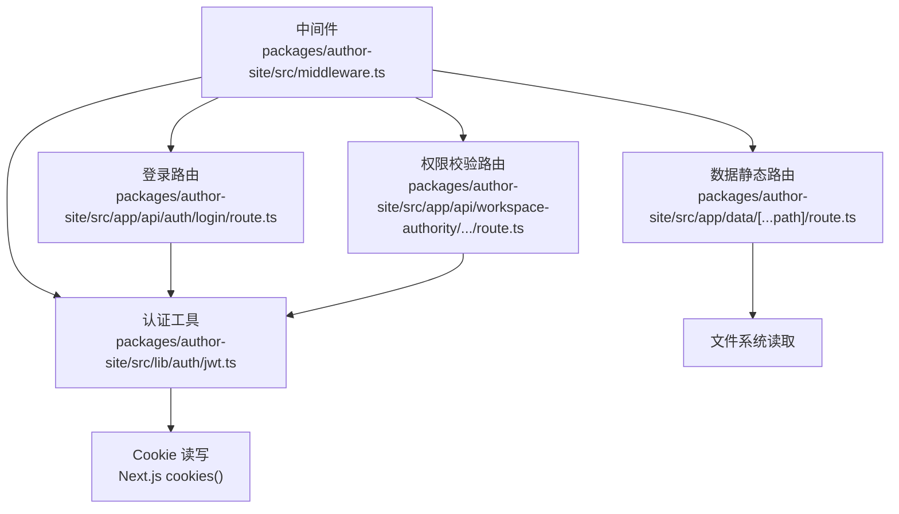
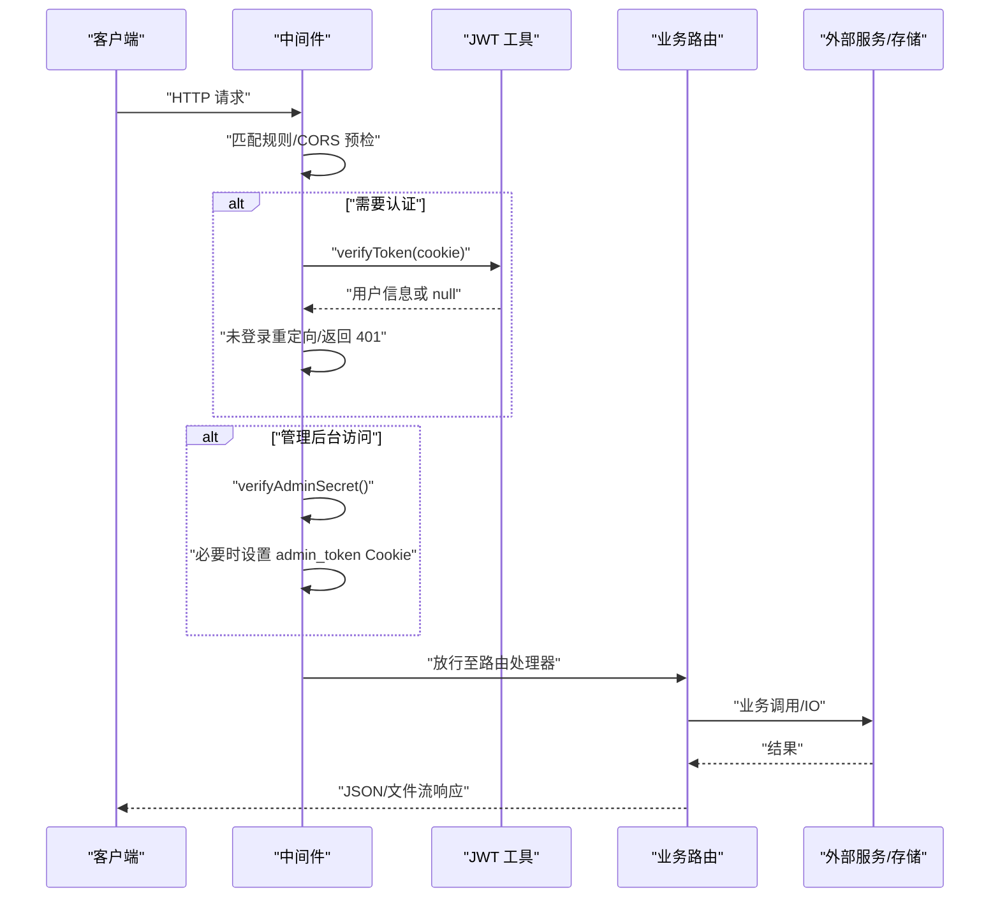
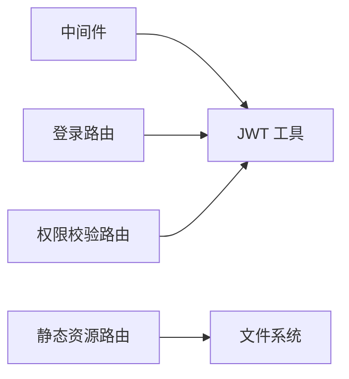

# 中间件架构

<cite>
**本文引用的文件**   
- [middleware.ts](file://packages/author-site/src/middleware.ts)
- [route.ts（登录）](file://packages/author-site/src/app/api/auth/login/route.ts)
- [jwt.ts](file://packages/author-site/src/lib/auth/jwt.ts)
- [error-utils.ts（Agent 服务错误工具）](file://packages/agent-service/src/utils/error-utils.ts)
- [workspace-authority route.ts](file://packages/author-site/src/app/api/workspace-authority/[projectId]/[workspaceId]/[...segments]/route.ts)
- [data 静态资源路由](file://packages/author-site/src/app/data/[...path]/route.ts)
</cite>

## 目录
1. [引言](#引言)
2. [项目结构](#项目结构)
3. [核心组件](#核心组件)
4. [架构总览](#架构总览)
5. [详细组件分析](#详细组件分析)
6. [依赖关系分析](#依赖关系分析)
7. [性能考量](#性能考量)
8. [故障排查指南](#故障排查指南)
9. [结论](#结论)
10. [附录](#附录)

## 引言
本指南面向希望基于现有代码库扩展与开发中间件的工程师，围绕请求拦截、响应处理、错误统一处理、中间件链执行顺序等主题展开。文档以 Next.js App Router 的 middleware 为核心，结合认证、CORS、管理后台鉴权、API 参数解析与错误包装等实践，提供可操作的实现思路与最佳实践。

## 项目结构
本项目采用 Next.js App Router 组织 API 路由与页面逻辑，中间件位于应用根级，负责全局的请求拦截与响应增强。认证相关能力集中在 JWT 工具模块中，错误序列化与日志友好化在 Agent 服务侧提供通用工具。

图表来源
- [middleware.ts:45-148](file://packages/author-site/src/middleware.ts#L45-L148)
- [jwt.ts:16-56](file://packages/author-site/src/lib/auth/jwt.ts#L16-L56)
- [route.ts（登录）:6-47](file://packages/author-site/src/app/api/auth/login/route.ts#L6-L47)
- [workspace-authority route.ts:28-47](file://packages/author-site/src/app/api/workspace-authority/[projectId]/[workspaceId]/[...segments]/route.ts#L28-L47)
- [data 静态资源路由:54-86](file://packages/author-site/src/app/data/[...path]/route.ts#L54-L86)

章节来源
- [middleware.ts:1-153](file://packages/author-site/src/middleware.ts#L1-L153)
- [jwt.ts:1-71](file://packages/author-site/src/lib/auth/jwt.ts#L1-L71)
- [route.ts（登录）:1-48](file://packages/author-site/src/app/api/auth/login/route.ts#L1-L48)
- [workspace-authority route.ts:28-47](file://packages/author-site/src/app/api/workspace-authority/[projectId]/[workspaceId]/[...segments]/route.ts#L28-L47)
- [data 静态资源路由:54-86](file://packages/author-site/src/app/data/[...path]/route.ts#L54-L86)

## 核心组件
- 全局中间件：负责匹配规则、CORS 预检、用户态判断、受保护路由重定向、管理后台鉴权与 Cookie 设置、响应头注入。
- 认证工具：JWT 签发、验证、Cookie 设置与获取、登出清理。
- 错误工具（Agent 服务）：安全字段白名单、错误消息提取、错误对象序列化（用于日志）。
- 典型路由示例：登录流程、权限校验、静态资源返回。

章节来源
- [middleware.ts:45-148](file://packages/author-site/src/middleware.ts#L45-L148)
- [jwt.ts:16-56](file://packages/author-site/src/lib/auth/jwt.ts#L16-L56)
- [error-utils.ts:1-134](file://packages/agent-service/src/utils/error-utils.ts#L1-L134)
- [route.ts（登录）:6-47](file://packages/author-site/src/app/api/auth/login/route.ts#L6-L47)
- [workspace-authority route.ts:28-47](file://packages/author-site/src/app/api/workspace-authority/[projectId]/[workspaceId]/[...segments]/route.ts#L28-L47)
- [data 静态资源路由:54-86](file://packages/author-site/src/app/data/[...path]/route.ts#L54-L86)

## 架构总览
下图展示了从请求进入中间件到最终响应的关键路径，包括 CORS 预检、认证检查、管理后台鉴权以及后续路由处理。

图表来源
- [middleware.ts:45-148](file://packages/author-site/src/middleware.ts#L45-L148)
- [jwt.ts:27-34](file://packages/author-site/src/lib/auth/jwt.ts#L27-L34)
- [route.ts（登录）:6-47](file://packages/author-site/src/app/api/auth/login/route.ts#L6-L47)

## 详细组件分析

### 请求拦截机制
- 路由匹配与短路
  - 通过 matcher 排除静态资源后，对 /preview-runtime/*、/api/*、/embed/*、/viewer/*、/data/* 进行差异化处理。
  - 对 OPTIONS 预检请求直接返回 204，避免进入业务逻辑。
- 认证与授权
  - 从 Cookie 读取 auth_token，调用 verifyToken 解析用户；若为受保护页面且未登录则重定向到登录页并携带 redirect 参数；若为受保护 API 则返回 401 JSON。
  - 管理后台路由需额外校验管理员密钥，支持通过 URL 参数 secret 一次性登录并设置 admin_token Cookie。
- CORS 策略
  - 根据 origin 与允许列表动态设置 Access-Control-Allow-* 头；公共预览模块使用宽松策略。

章节来源
- [middleware.ts:18-73](file://packages/author-site/src/middleware.ts#L18-L73)
- [middleware.ts:75-135](file://packages/author-site/src/middleware.ts#L75-L135)
- [middleware.ts:137-148](file://packages/author-site/src/middleware.ts#L137-L148)

### 参数解析与上下文传递
- 登录接口
  - 从请求体解析 JSON，规范化用户名（去除首尾空白），校验必填项，失败返回 400/401。
  - 成功时签发 JWT 并写入 httpOnly Cookie，返回统一成功格式。
- 权限校验接口
  - 解析路径段与查询参数中的 sessionId，优先使用 body 中的 sessionId，再回退到 query；无效或缺失返回 401。
  - 对 POST 请求按 content-type 解析 JSON，异常时返回 400。
- 静态资源接口
  - 根据扩展名设置 Content-Type 与 Cache-Control，支持跨域头注入，返回二进制流。

章节来源
- [route.ts（登录）:6-47](file://packages/author-site/src/app/api/auth/login/route.ts#L6-L47)
- [workspace-authority route.ts:28-47](file://packages/author-site/src/app/api/workspace-authority/[projectId]/[workspaceId]/[...segments]/route.ts#L28-L47)
- [data 静态资源路由:54-86](file://packages/author-site/src/app/data/[...path]/route.ts#L54-L86)

### 响应处理流程
- 数据格式化
  - 登录与用户信息查询均返回统一的成功/错误结构，便于前端一致处理。
- 错误包装
  - 登录失败、参数校验失败、会话缺失等场景返回明确的 code 与 message。
- 性能监控
  - 可在中间件前后记录耗时，或在路由层埋点上报（例如在 NextResponse 前/后插入计时逻辑）。

章节来源
- [route.ts（登录）:6-47](file://packages/author-site/src/app/api/auth/login/route.ts#L6-L47)
- [jwt.ts:44-56](file://packages/author-site/src/lib/auth/jwt.ts#L44-L56)

### 错误统一处理策略
- 异常分类
  - 客户端错误：参数校验失败、未登录、未授权、资源不存在等。
  - 服务端错误：未知异常、下游服务不可用等。
- 错误码定义
  - 建议集中维护错误码枚举与对应提示文案，确保前后端一致。
- 用户友好提示
  - 对外仅暴露必要字段（如 code、message），内部堆栈与敏感信息不泄露。
- 日志序列化
  - 使用安全字段白名单与长度截断，递归序列化 cause 与 response 摘要，便于排障。

章节来源
- [error-utils.ts:1-134](file://packages/agent-service/src/utils/error-utils.ts#L1-L134)

### 中间件链的执行顺序
- 串行执行
  - 当前仓库为单一中间件入口，所有逻辑在同一函数内串行完成：CORS 预检 → 认证检查 → 管理后台鉴权 → 放行。
- 并行处理
  - 对于无依赖的独立操作（如同时计算 CORS 与解析用户），可考虑并行化以提升吞吐。
- 短路逻辑
  - 预检、重定向、401/403 等快速返回路径应尽早短路，减少后续开销。

章节来源
- [middleware.ts:45-148](file://packages/author-site/src/middleware.ts#L45-L148)

### 中间件开发示例（概念性说明）
以下为三类常见中间件的概念性实现要点，供参考与扩展：
- 认证中间件
  - 从 Cookie/Header 提取凭证，校验签名与有效期，将用户上下文挂载到请求对象或响应头，未通过则短路返回 401。
- 日志中间件
  - 在请求进入与离开时记录时间戳、方法、路径、状态码、耗时；对敏感字段脱敏；异步落盘或上报。
- 缓存中间件
  - 对 GET 请求构建缓存键（路径+查询+必要头），命中则直接返回；未命中则执行业务逻辑并回填缓存，设置合理过期与失效策略。

注意：以上为通用设计模式说明，非仓库现有实现。

## 依赖关系分析
- 中间件依赖认证工具进行 Token 验证与 Cookie 操作。
- 登录路由依赖认证工具生成 Token 并写入 Cookie。
- 权限校验路由依赖会话标识解析与内容类型判断。
- 静态资源路由依赖文件系统读取与 MIME 映射。

图表来源
- [middleware.ts:45-148](file://packages/author-site/src/middleware.ts#L45-L148)
- [jwt.ts:16-56](file://packages/author-site/src/lib/auth/jwt.ts#L16-L56)
- [route.ts（登录）:6-47](file://packages/author-site/src/app/api/auth/login/route.ts#L6-L47)
- [workspace-authority route.ts:28-47](file://packages/author-site/src/app/api/workspace-authority/[projectId]/[workspaceId]/[...segments]/route.ts#L28-L47)
- [data 静态资源路由:54-86](file://packages/author-site/src/app/data/[...path]/route.ts#L54-L86)

章节来源
- [middleware.ts:1-153](file://packages/author-site/src/middleware.ts#L1-L153)
- [jwt.ts:1-71](file://packages/author-site/src/lib/auth/jwt.ts#L1-L71)
- [route.ts（登录）:1-48](file://packages/author-site/src/app/api/auth/login/route.ts#L1-L48)
- [workspace-authority route.ts:28-47](file://packages/author-site/src/app/api/workspace-authority/[projectId]/[workspaceId]/[...segments]/route.ts#L28-L47)
- [data 静态资源路由:54-86](file://packages/author-site/src/app/data/[...path]/route.ts#L54-L86)

## 性能考量
- 中间件尽量保持轻量，避免阻塞 I/O；将耗时操作下沉到路由或服务层。
- 对频繁读写的 Cookie 与 Token 校验进行缓存（如内存缓存最近验证结果，注意并发与过期）。
- 静态资源路由已设置合理的 Cache-Control，有助于浏览器缓存与 CDN 加速。
- 日志与监控采样应采用异步与限流策略，避免影响主链路。

## 故障排查指南
- 登录失败
  - 检查用户名是否被规范化、密码是否正确、JWT 密钥配置是否一致。
- 未登录/未授权
  - 确认 Cookie 是否设置成功（httpOnly、secure、sameSite）、域名与端口是否匹配。
- 管理后台无法访问
  - 检查管理员密钥配置与 URL 参数 secret 的使用方式，确认 admin_token 是否写入。
- 错误日志定位
  - 使用错误序列化工具输出结构化日志，关注 name、message、stack、cause 与 response 摘要。

章节来源
- [route.ts（登录）:6-47](file://packages/author-site/src/app/api/auth/login/route.ts#L6-L47)
- [jwt.ts:44-56](file://packages/author-site/src/lib/auth/jwt.ts#L44-L56)
- [middleware.ts:100-135](file://packages/author-site/src/middleware.ts#L100-L135)
- [error-utils.ts:87-134](file://packages/agent-service/src/utils/error-utils.ts#L87-L134)

## 结论
本仓库的中间件以“最小可用”的方式实现了认证、CORS、管理后台鉴权与基础的路由短路策略。在此基础上，可按需扩展日志、限流、缓存、审计等横切能力。建议在统一错误模型、性能埋点与可观测性方面持续完善，以满足生产环境的稳定性与可维护性要求。

## 附录
- 术语
  - 中间件：在请求到达业务路由之前执行的横切逻辑。
  - 预检：CORS 的 OPTIONS 请求，用于协商跨域策略。
  - 短路：提前返回响应，不再继续后续处理。
- 最佳实践清单
  - 明确匹配规则，避免误拦截静态资源。
  - 认证失败区分页面与 API 的不同返回策略。
  - 管理后台鉴权与用户态分离，降低耦合。
  - 错误码与提示文案集中管理，保证一致性。
  - 日志脱敏与长度限制，防止信息泄露与体积膨胀。