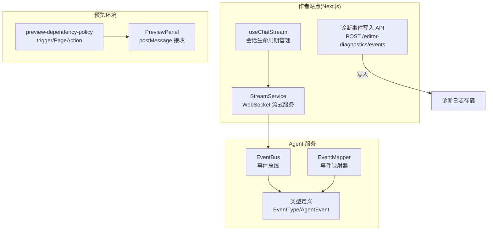
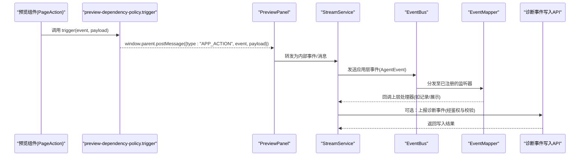
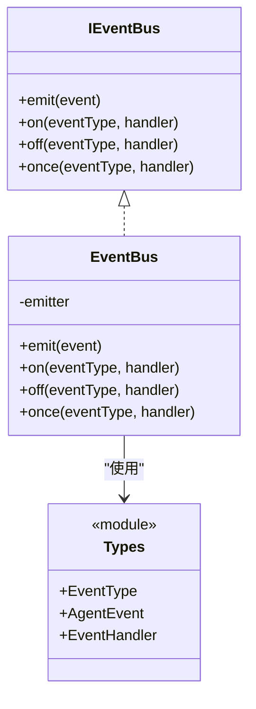
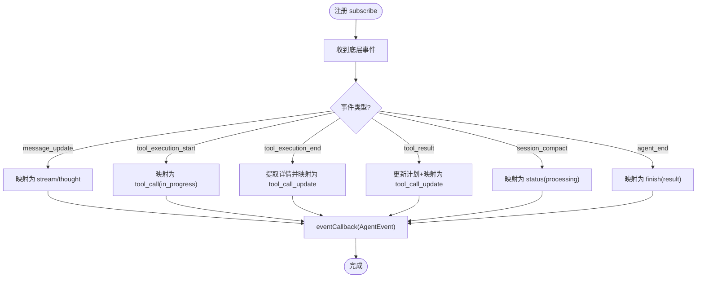
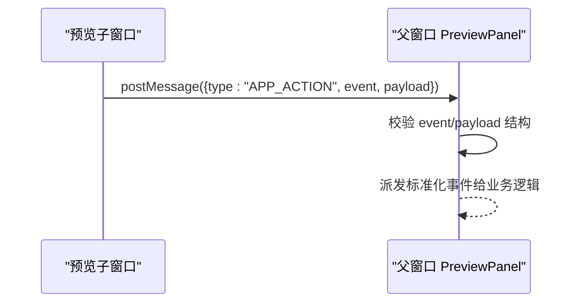
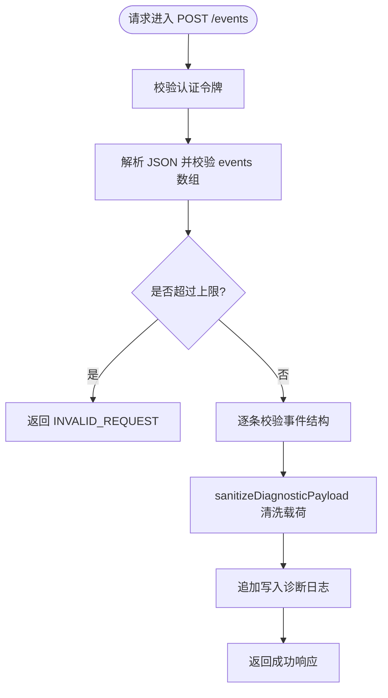
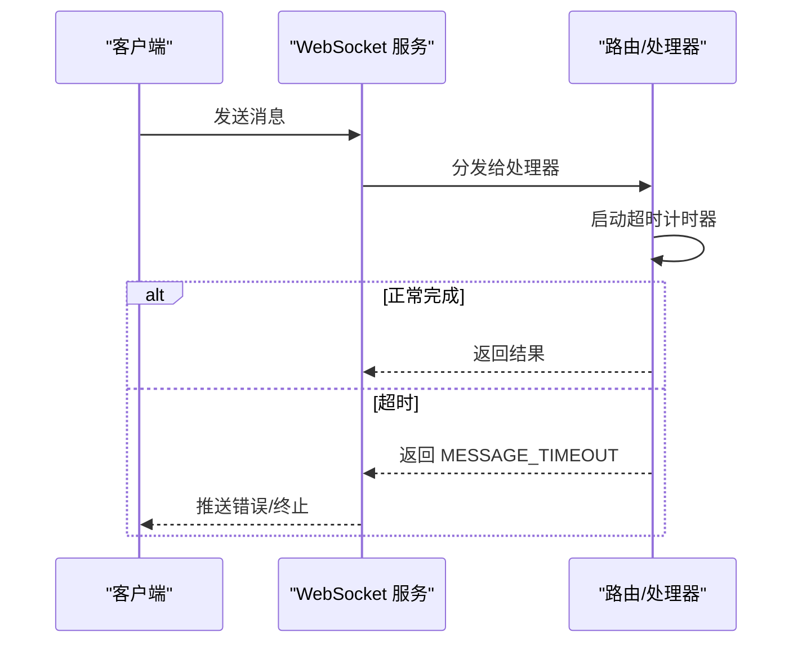
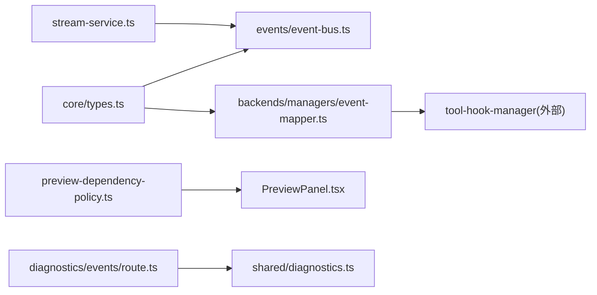

# 事件监听器

<cite>
**本文引用的文件**   
- [packages/agent-service/src/events/event-bus.ts](file://packages/agent-service/src/events/event-bus.ts)
- [packages/agent-service/src/core/types.ts](file://packages/agent-service/src/core/types.ts)
- [packages/agent-service/src/backends/managers/event-mapper.ts](file://packages/agent-service/src/backends/managers/event-mapper.ts)
- [packages/author-site/src/app/api/editor-diagnostics/events/route.ts](file://packages/author-site/src/app/api/editor-diagnostics/events/route.ts)
- [packages/shared/src/diagnostics.ts](file://packages/shared/src/diagnostics.ts)
- [packages/author-site/src/lib/preview-dependency-policy.ts](file://packages/author-site/src/lib/preview-dependency-policy.ts)
- [packages/demo-ui/src/PreviewPanel.tsx](file://packages/demo-ui/src/PreviewPanel.tsx)
- [packages/agent-service/tests/unit/backend-agent-inactivity-timeout.test.ts](file://packages/agent-service/tests/unit/backend-agent-inactivity-timeout.test.ts)
- [packages/agent-service/src/routes/websocket.ts](file://packages/agent-service/src/routes/websocket.ts)
- [packages/author-site/src/components/ai-elements/chat/services/stream-service.ts](file://packages/author-site/src/components/ai-elements/chat/services/stream-service.ts)
- [packages/author-site/src/components/ai-elements/chat/hooks/use-chat-stream.ts](file://packages/author-site/src/components/ai-elements/chat/hooks/use-chat-stream.ts)
</cite>

## 目录
1. [简介](#简介)
2. [项目结构](#项目结构)
3. [核心组件](#核心组件)
4. [架构总览](#架构总览)
5. [详细组件分析](#详细组件分析)
6. [依赖关系分析](#依赖关系分析)
7. [性能与可扩展性](#性能与可扩展性)
8. [故障排查指南](#故障排查指南)
9. [结论](#结论)
10. [附录：最佳实践与规范](#附录最佳实践与规范)

## 简介
本指南围绕仓库中的事件监听器系统，系统化阐述以下主题：
- 事件注册机制：包括订阅/取消订阅、一次性订阅、作用域隔离与内存泄漏防护。
- 自定义事件定义规范：命名约定、载荷校验与版本兼容策略。
- 事件传播机制：冒泡、捕获与阻止默认行为的实现思路与边界条件。
- 异步事件处理模式：错误边界、重试机制与超时控制。
- 事件驱动架构示例：发布订阅、事件溯源与审计日志集成。

## 项目结构
事件相关代码主要分布在以下模块：
- Agent 服务内部事件总线与类型定义
- 底层事件到应用层事件的映射器
- 前端预览侧跨窗口事件桥接（postMessage）
- 诊断事件写入 API 与载荷清洗
- 流式对话的 WebSocket 通道与超时保护

图表来源
- [packages/agent-service/src/events/event-bus.ts:1-38](file://packages/agent-service/src/events/event-bus.ts#L1-L38)
- [packages/agent-service/src/core/types.ts:167-325](file://packages/agent-service/src/core/types.ts#L167-L325)
- [packages/agent-service/src/backends/managers/event-mapper.ts:1-167](file://packages/agent-service/src/backends/managers/event-mapper.ts#L1-L167)
- [packages/author-site/src/app/api/editor-diagnostics/events/route.ts:1-73](file://packages/author-site/src/app/api/editor-diagnostics/events/route.ts#L1-L73)
- [packages/author-site/src/components/ai-elements/chat/services/stream-service.ts:341-394](file://packages/author-site/src/components/ai-elements/chat/services/stream-service.ts#L341-L394)
- [packages/author-site/src/components/ai-elements/chat/hooks/use-chat-stream.ts:460-484](file://packages/author-site/src/components/ai-elements/chat/hooks/use-chat-stream.ts#L460-L484)
- [packages/author-site/src/lib/preview-dependency-policy.ts:168-196](file://packages/author-site/src/lib/preview-dependency-policy.ts#L168-L196)
- [packages/demo-ui/src/PreviewPanel.tsx:1010-1043](file://packages/demo-ui/src/PreviewPanel.tsx#L1010-L1043)

章节来源
- [packages/agent-service/src/events/event-bus.ts:1-38](file://packages/agent-service/src/events/event-bus.ts#L1-L38)
- [packages/agent-service/src/core/types.ts:167-325](file://packages/agent-service/src/core/types.ts#L167-L325)
- [packages/agent-service/src/backends/managers/event-mapper.ts:1-167](file://packages/agent-service/src/backends/managers/event-mapper.ts#L1-L167)
- [packages/author-site/src/app/api/editor-diagnostics/events/route.ts:1-73](file://packages/author-site/src/app/api/editor-diagnostics/events/route.ts#L1-L73)
- [packages/author-site/src/components/ai-elements/chat/services/stream-service.ts:341-394](file://packages/author-site/src/components/ai-elements/chat/services/stream-service.ts#L341-L394)
- [packages/author-site/src/components/ai-elements/chat/hooks/use-chat-stream.ts:460-484](file://packages/author-site/src/components/ai-elements/chat/hooks/use-chat-stream.ts#L460-L484)
- [packages/author-site/src/lib/preview-dependency-policy.ts:168-196](file://packages/author-site/src/lib/preview-dependency-policy.ts#L168-L196)
- [packages/demo-ui/src/PreviewPanel.tsx:1010-1043](file://packages/demo-ui/src/PreviewPanel.tsx#L1010-L1043)

## 核心组件
- 事件总线 EventBus：封装 Node EventEmitter，提供 emit/on/off/once 能力，并通过全局单例 getEventBus 暴露。
- 事件类型 EventType/AgentEvent：集中定义所有事件名与事件载荷结构，作为跨模块契约。
- 事件映射器 EventMapper：将底层 harness 事件转换为应用层 AgentEvent，并委托工具钩子管理器更新计划与文件变更。
- 预览侧事件桥接：通过 postMessage 在 iframe 与父页面之间传递 APP_ACTION 事件，并在 PreviewPanel 中解析与分发。
- 诊断事件写入 API：对上传的诊断事件进行鉴权、限流与格式校验后落盘。

章节来源
- [packages/agent-service/src/events/event-bus.ts:1-38](file://packages/agent-service/src/events/event-bus.ts#L1-L38)
- [packages/agent-service/src/core/types.ts:167-325](file://packages/agent-service/src/core/types.ts#L167-L325)
- [packages/agent-service/src/backends/managers/event-mapper.ts:1-167](file://packages/agent-service/src/backends/managers/event-mapper.ts#L1-L167)
- [packages/author-site/src/lib/preview-dependency-policy.ts:168-196](file://packages/author-site/src/lib/preview-dependency-policy.ts#L168-L196)
- [packages/demo-ui/src/PreviewPanel.tsx:1010-1043](file://packages/demo-ui/src/PreviewPanel.tsx#L1010-L1043)
- [packages/author-site/src/app/api/editor-diagnostics/events/route.ts:1-73](file://packages/author-site/src/app/api/editor-diagnostics/events/route.ts#L1-L73)

## 架构总览
下图展示了从“预览触发”到“服务端处理与持久化”的端到端流程，以及 Agent 内部的事件流转。

图表来源
- [packages/author-site/src/lib/preview-dependency-policy.ts:168-196](file://packages/author-site/src/lib/preview-dependency-policy.ts#L168-L196)
- [packages/demo-ui/src/PreviewPanel.tsx:1010-1043](file://packages/demo-ui/src/PreviewPanel.tsx#L1010-L1043)
- [packages/author-site/src/components/ai-elements/chat/services/stream-service.ts:341-394](file://packages/author-site/src/components/ai-elements/chat/services/stream-service.ts#L341-L394)
- [packages/agent-service/src/events/event-bus.ts:1-38](file://packages/agent-service/src/events/event-bus.ts#L1-L38)
- [packages/agent-service/src/backends/managers/event-mapper.ts:1-167](file://packages/agent-service/src/backends/managers/event-mapper.ts#L1-L167)
- [packages/author-site/src/app/api/editor-diagnostics/events/route.ts:1-73](file://packages/author-site/src/app/api/editor-diagnostics/events/route.ts#L1-L73)

## 详细组件分析

### 事件总线与类型契约
- 事件总线
  - 基于 Node EventEmitter 封装，统一对外暴露 on/off/once/emit。
  - 提供全局单例访问入口，便于跨模块共享。
- 事件类型
  - EventType 枚举了所有事件名；AgentEvent 是联合类型，约束每个事件的载荷字段。
  - 新增事件需同时扩展 EventType 与对应事件接口，确保类型安全。

图表来源
- [packages/agent-service/src/events/event-bus.ts:1-38](file://packages/agent-service/src/events/event-bus.ts#L1-L38)
- [packages/agent-service/src/core/types.ts:167-325](file://packages/agent-service/src/core/types.ts#L167-L325)

章节来源
- [packages/agent-service/src/events/event-bus.ts:1-38](file://packages/agent-service/src/events/event-bus.ts#L1-L38)
- [packages/agent-service/src/core/types.ts:167-325](file://packages/agent-service/src/core/types.ts#L167-L325)

### 事件映射器：从底层到应用层
- 职责
  - 订阅底层 harness 事件，将其映射为应用层 AgentEvent。
  - 将工具执行开始/结束/结果等事件转换为 tool_call/tool_call_update 等标准事件。
  - 委托 ToolHookManager 更新计划与文件变更摘要。
- 关键点
  - register(harness) 返回取消函数，用于清理订阅，避免内存泄漏。
  - 对 tool_execution_end 与 tool_result 的差异有明确注释说明，保证文件变更一致性。

图表来源
- [packages/agent-service/src/backends/managers/event-mapper.ts:1-167](file://packages/agent-service/src/backends/managers/event-mapper.ts#L1-L167)

章节来源
- [packages/agent-service/src/backends/managers/event-mapper.ts:1-167](file://packages/agent-service/src/backends/managers/event-mapper.ts#L1-L167)

### 预览侧事件桥接与拦截
- 触发方式
  - 预览环境通过 preview-dependency-policy.trigger 向父窗口 postMessage(APP_ACTION)。
  - PageAction 组件支持 onClick 拦截 defaultPrevented，避免重复触发。
- 接收与分发
  - PreviewPanel 监听 message，校验 event.data.event 与 payload 结构后，再向上抛出标准化事件。

图表来源
- [packages/author-site/src/lib/preview-dependency-policy.ts:168-196](file://packages/author-site/src/lib/preview-dependency-policy.ts#L168-L196)
- [packages/demo-ui/src/PreviewPanel.tsx:1010-1043](file://packages/demo-ui/src/PreviewPanel.tsx#L1010-L1043)

章节来源
- [packages/author-site/src/lib/preview-dependency-policy.ts:168-196](file://packages/author-site/src/lib/preview-dependency-policy.ts#L168-L196)
- [packages/demo-ui/src/PreviewPanel.tsx:1010-1043](file://packages/demo-ui/src/PreviewPanel.tsx#L1010-L1043)

### 诊断事件写入与载荷清洗
- 鉴权与限流
  - 校验登录态与 JWT，限制单次最多写入条数，并对事件结构做白名单校验。
- 载荷清洗
  - 使用 sanitizeDiagnosticPayload 对敏感键与深度进行裁剪，保障日志安全与体积可控。

图表来源
- [packages/author-site/src/app/api/editor-diagnostics/events/route.ts:1-73](file://packages/author-site/src/app/api/editor-diagnostics/events/route.ts#L1-L73)
- [packages/shared/src/diagnostics.ts:418-459](file://packages/shared/src/diagnostics.ts#L418-L459)

章节来源
- [packages/author-site/src/app/api/editor-diagnostics/events/route.ts:1-73](file://packages/author-site/src/app/api/editor-diagnostics/events/route.ts#L1-L73)
- [packages/shared/src/diagnostics.ts:418-459](file://packages/shared/src/diagnostics.ts#L418-L459)

### 异步事件处理：超时、保活与错误边界
- 超时控制
  - 服务端对消息处理设置显式超时，超时后自动取消并返回 MESSAGE_TIMEOUT。
  - 测试覆盖无进展超时后的 busy 状态恢复与错误码。
- 连接保活
  - 客户端周期性 ping，防止长连接空闲断开。
- 错误边界
  - 预览渲染包裹 ErrorBoundary，捕获运行时异常并降级展示。

图表来源
- [packages/agent-service/src/routes/websocket.ts:402-423](file://packages/agent-service/src/routes/websocket.ts#L402-L423)
- [packages/agent-service/tests/unit/backend-agent-inactivity-timeout.test.ts:41-88](file://packages/agent-service/tests/unit/backend-agent-inactivity-timeout.test.ts#L41-L88)
- [packages/author-site/src/components/ai-elements/chat/services/stream-service.ts:341-394](file://packages/author-site/src/components/ai-elements/chat/services/stream-service.ts#L341-L394)

章节来源
- [packages/agent-service/src/routes/websocket.ts:402-423](file://packages/agent-service/src/routes/websocket.ts#L402-L423)
- [packages/agent-service/tests/unit/backend-agent-inactivity-timeout.test.ts:41-88](file://packages/agent-service/tests/unit/backend-agent-inactivity-timeout.test.ts#L41-L88)
- [packages/author-site/src/components/ai-elements/chat/services/stream-service.ts:341-394](file://packages/author-site/src/components/ai-elements/chat/services/stream-service.ts#L341-L394)

## 依赖关系分析
- 低耦合
  - EventBus 仅依赖 Node EventEmitter 与类型定义，职责单一。
  - EventMapper 依赖类型与工具钩子管理器，屏蔽底层差异。
- 潜在循环
  - 类型集中在 core/types.ts，避免循环引用风险。
- 外部依赖
  - 预览侧依赖浏览器 postMessage 与 React 组件生态。
  - 诊断 API 依赖 Next.js 路由与文件系统。

图表来源
- [packages/agent-service/src/core/types.ts:167-325](file://packages/agent-service/src/core/types.ts#L167-L325)
- [packages/agent-service/src/events/event-bus.ts:1-38](file://packages/agent-service/src/events/event-bus.ts#L1-L38)
- [packages/agent-service/src/backends/managers/event-mapper.ts:1-167](file://packages/agent-service/src/backends/managers/event-mapper.ts#L1-L167)
- [packages/author-site/src/lib/preview-dependency-policy.ts:168-196](file://packages/author-site/src/lib/preview-dependency-policy.ts#L168-L196)
- [packages/demo-ui/src/PreviewPanel.tsx:1010-1043](file://packages/demo-ui/src/PreviewPanel.tsx#L1010-L1043)
- [packages/author-site/src/components/ai-elements/chat/services/stream-service.ts:341-394](file://packages/author-site/src/components/ai-elements/chat/services/stream-service.ts#L341-L394)
- [packages/author-site/src/app/api/editor-diagnostics/events/route.ts:1-73](file://packages/author-site/src/app/api/editor-diagnostics/events/route.ts#L1-L73)
- [packages/shared/src/diagnostics.ts:418-459](file://packages/shared/src/diagnostics.ts#L418-L459)

章节来源
- [packages/agent-service/src/core/types.ts:167-325](file://packages/agent-service/src/core/types.ts#L167-L325)
- [packages/agent-service/src/events/event-bus.ts:1-38](file://packages/agent-service/src/events/event-bus.ts#L1-L38)
- [packages/agent-service/src/backends/managers/event-mapper.ts:1-167](file://packages/agent-service/src/backends/managers/event-mapper.ts#L1-L167)
- [packages/author-site/src/lib/preview-dependency-policy.ts:168-196](file://packages/author-site/src/lib/preview-dependency-policy.ts#L168-L196)
- [packages/demo-ui/src/PreviewPanel.tsx:1010-1043](file://packages/demo-ui/src/PreviewPanel.tsx#L1010-L1043)
- [packages/author-site/src/components/ai-elements/chat/services/stream-service.ts:341-394](file://packages/author-site/src/components/ai-elements/chat/services/stream-service.ts#L341-L394)
- [packages/author-site/src/app/api/editor-diagnostics/events/route.ts:1-73](file://packages/author-site/src/app/api/editor-diagnostics/events/route.ts#L1-L73)
- [packages/shared/src/diagnostics.ts:418-459](file://packages/shared/src/diagnostics.ts#L418-L459)

## 性能与可扩展性
- 事件分发
  - 使用单例 EventBus 减少实例开销；按需使用 once 避免长期持有引用。
- 载荷大小
  - 诊断事件写入前进行深度与长度裁剪，降低 IO 压力。
- 连接稳定性
  - 客户端定时 ping 保持连接活跃，服务端超时保护避免资源占用。
- 可扩展点
  - 新增事件只需扩展类型与映射逻辑，不影响既有消费者。
  - 可引入优先级队列或分区总线以支撑高吞吐场景。

[本节为通用指导，不直接分析具体文件]

## 故障排查指南
- 事件未触发
  - 检查是否在正确作用域内注册监听器，并确保在组件卸载时调用取消函数。
  - 参考 register 返回的取消函数用法。
- 诊断事件未落盘
  - 确认鉴权通过且 events 数组非空、结构合法、数量不超过上限。
  - 查看服务端日志与返回的错误码。
- 预览事件丢失
  - 确认父窗口是否正确监听 message 并校验 event.data.event 与 payload。
- 长时间无响应
  - 检查客户端 keepalive 与服务端超时配置，关注 MESSAGE_TIMEOUT 错误码。

章节来源
- [packages/agent-service/src/backends/managers/event-mapper.ts:33-136](file://packages/agent-service/src/backends/managers/event-mapper.ts#L33-L136)
- [packages/author-site/src/app/api/editor-diagnostics/events/route.ts:27-71](file://packages/author-site/src/app/api/editor-diagnostics/events/route.ts#L27-L71)
- [packages/demo-ui/src/PreviewPanel.tsx:1010-1043](file://packages/demo-ui/src/PreviewPanel.tsx#L1010-L1043)
- [packages/agent-service/src/routes/websocket.ts:402-423](file://packages/agent-service/src/routes/websocket.ts#L402-L423)
- [packages/author-site/src/components/ai-elements/chat/services/stream-service.ts:362-376](file://packages/author-site/src/components/ai-elements/chat/services/stream-service.ts#L362-L376)

## 结论
本事件系统通过类型化的事件契约、统一的总线抽象与严格的载荷校验，实现了跨进程、跨模块的可观测与可扩展通信。结合超时保护、保活机制与错误边界，系统在可靠性与可维护性方面具备良好基础。后续可在优先级调度、批量投递与幂等消费等方面进一步增强。

[本节为总结性内容，不直接分析具体文件]

## 附录：最佳实践与规范

- 事件命名约定
  - 使用小写驼峰或短横线分隔的语义化名称，避免歧义。
  - 在 EventType 中集中声明，禁止硬编码字符串。
- 载荷结构与验证
  - 为每种事件定义明确的接口，包含必要字段与可选字段。
  - 在边界处（如 API 入口、postMessage 接收处）进行严格校验与清洗。
- 版本兼容性
  - 事件载荷采用向后兼容设计：新增字段为可选，删除字段需废弃期过渡。
  - 在映射层根据版本分支处理不同载荷形态。
- 作用域与内存泄漏防护
  - 为每个作用域（会话、页面、组件）维护独立的订阅集合。
  - 在销毁路径上调用取消函数，避免悬挂引用。
- 传播模型
  - 冒泡/捕获：可在中间件链中按顺序执行，支持短路。
  - 阻止默认行为：在事件对象上提供标志位，由下游决定是否继续传播。
- 异步处理模式
  - 错误边界：在关键节点捕获异常，避免级联失败。
  - 重试机制：对可重试错误实施指数退避与最大重试次数限制。
  - 超时控制：为每条消息设置超时，并在超时后清理资源与状态。
- 事件驱动架构示例
  - 发布订阅：通过 EventBus 解耦生产者与消费者。
  - 事件溯源：将关键状态变更序列化为不可变事件，支持回放与重建。
  - 审计日志集成：在关键操作后产出审计事件，统一写入审计存储。

[本节为通用指导，不直接分析具体文件]