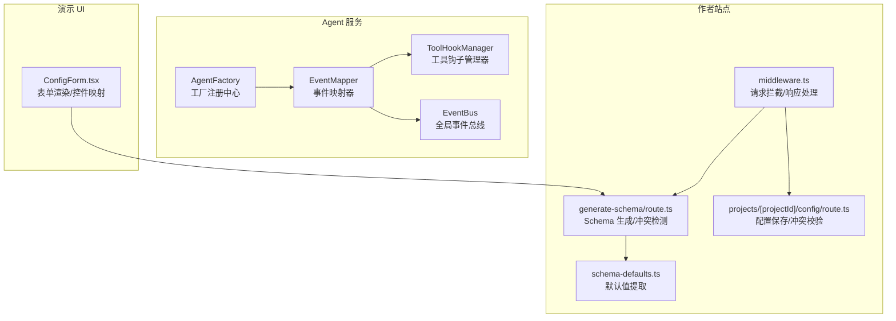
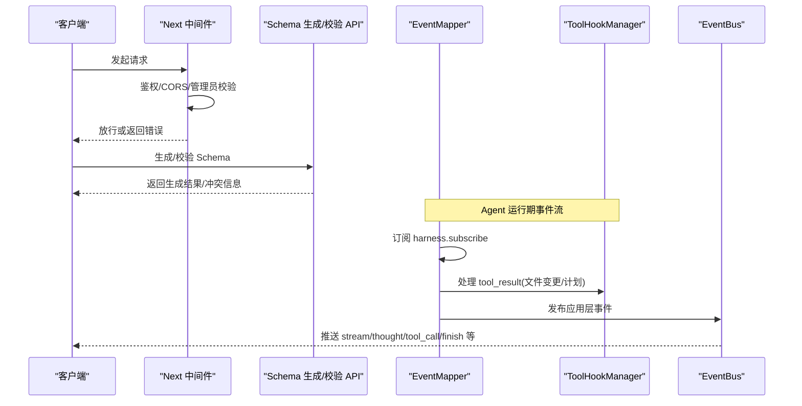
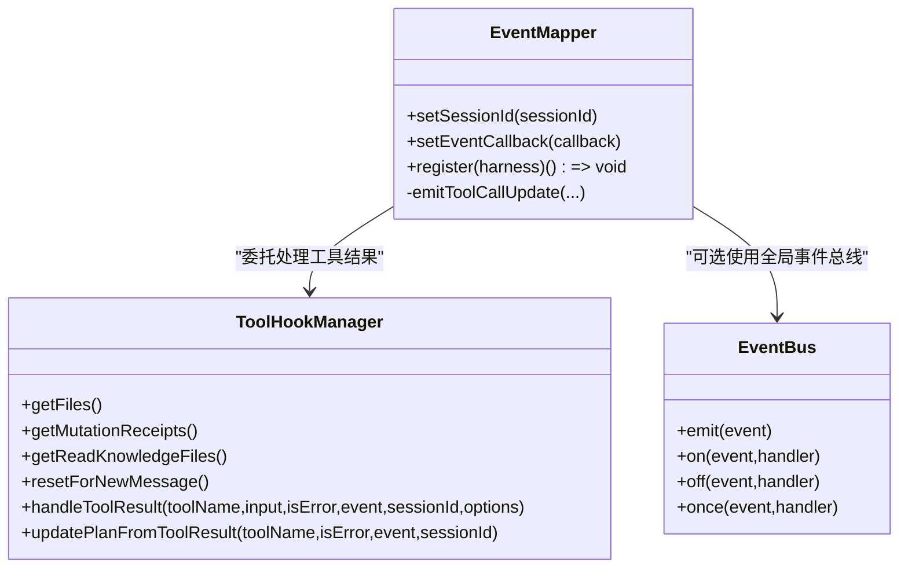
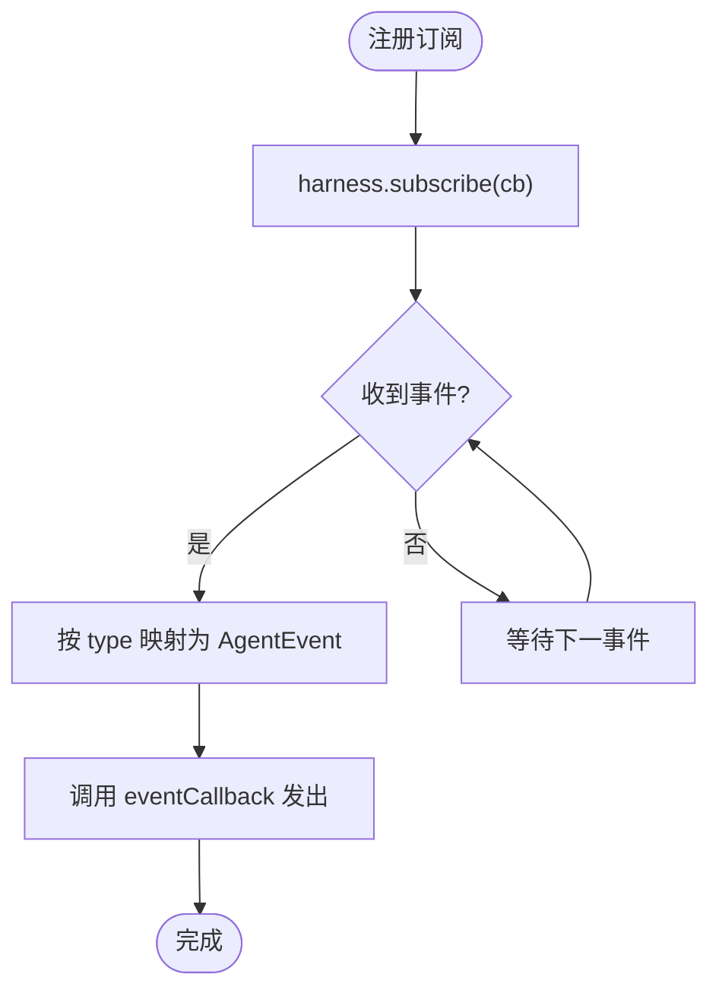
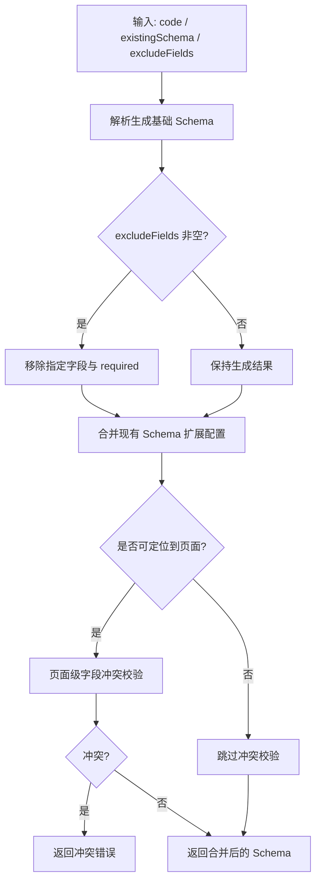
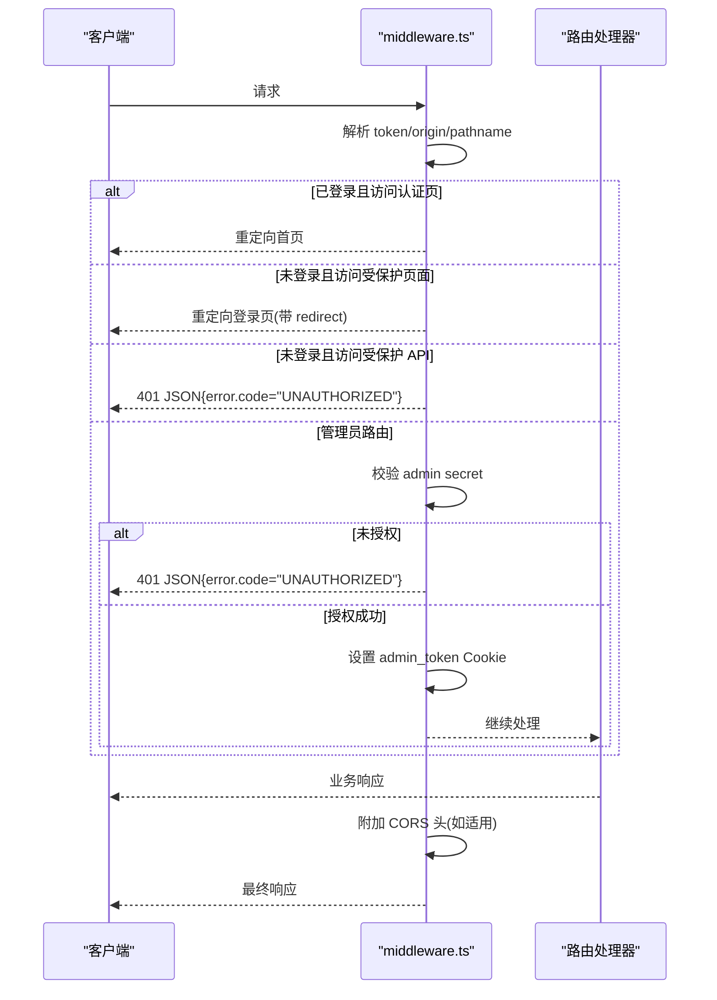
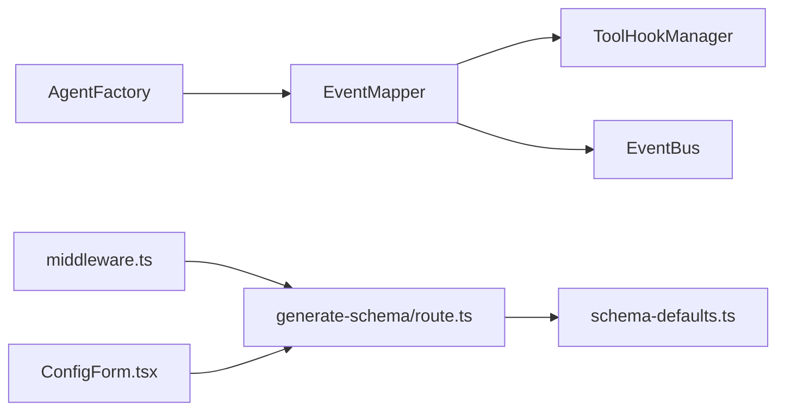

# 扩展点识别

<cite>
**本文引用的文件**   
- [packages/agent-service/src/backends/managers/event-mapper.ts](file://packages/agent-service/src/backends/managers/event-mapper.ts)
- [packages/agent-service/src/backends/managers/tool-hook-manager.ts](file://packages/agent-service/src/backends/managers/tool-hook-manager.ts)
- [packages/agent-service/src/events/event-bus.ts](file://packages/agent-service/src/events/event-bus.ts)
- [packages/agent-service/src/core/agent-factory.ts](file://packages/agent-service/src/core/agent-factory.ts)
- [packages/author-site/src/middleware.ts](file://packages/author-site/src/middleware.ts)
- [packages/author-site/src/app/api/generate-schema/route.ts](file://packages/author-site/src/app/api/generate-schema/route.ts)
- [packages/author-site/src/lib/schema-defaults.ts](file://packages/author-site/src/lib/schema-defaults.ts)
- [packages/author-site/src/app/api/projects/[projectId]/config/route.ts](file://packages/author-site/src/app/api/projects/[projectId]/config/route.ts)
- [packages/demo-ui/src/ConfigForm.tsx](file://packages/demo-ui/src/ConfigForm.tsx)
- [docs/项目文档/创作端/04-配置与预览/技术/03_表单生成器.md](file://docs/项目文档/创作端/04-配置与预览/技术/03_表单生成器.md)
- [docs/项目文档/创作端/04-配置与预览/配置系统_需求文档.md](file://docs/项目文档/创作端/04-配置与预览/配置系统_需求文档.md)
- [packages/agent-service/tests/unit/event-mapper.test.ts](file://packages/agent-service/tests/unit/event-mapper.test.ts)
</cite>

## 目录
1. [引言](#引言)
2. [项目结构](#项目结构)
3. [核心组件](#核心组件)
4. [架构总览](#架构总览)
5. [详细组件分析](#详细组件分析)
6. [依赖关系分析](#依赖关系分析)
7. [性能考量](#性能考量)
8. [故障排查指南](#故障排查指南)
9. [结论](#结论)
10. [附录](#附录)

## 引言
本指南面向“扩展点识别系统”的开发者，围绕钩子函数体系、事件监听机制、配置扩展点（Schema 扩展、控件注册、验证注入）、中间件架构以及版本管理与兼容性评估展开。目标是帮助你在现有工程基础上，快速理解并安全地扩展系统能力，同时保证向后兼容与性能可控。

## 项目结构
本项目采用多包工作区组织，扩展点相关的关键代码分布在以下位置：
- 事件与钩子系统：位于 agent-service 的 managers 与 events 目录
- 中间件与鉴权：位于 author-site 的 middleware
- Schema 生成与校验：位于 author-site 的 API 路由与工具库
- 表单渲染与控件映射：位于 demo-ui 与文档说明

图表来源
- [packages/agent-service/src/backends/managers/event-mapper.ts:1-167](file://packages/agent-service/src/backends/managers/event-mapper.ts#L1-L167)
- [packages/agent-service/src/backends/managers/tool-hook-manager.ts:1-280](file://packages/agent-service/src/backends/managers/tool-hook-manager.ts#L1-L280)
- [packages/agent-service/src/events/event-bus.ts:1-38](file://packages/agent-service/src/events/event-bus.ts#L1-L38)
- [packages/agent-service/src/core/agent-factory.ts:1-50](file://packages/agent-service/src/core/agent-factory.ts#L1-L50)
- [packages/author-site/src/middleware.ts:1-153](file://packages/author-site/src/middleware.ts#L1-L153)
- [packages/author-site/src/app/api/generate-schema/route.ts:94-121](file://packages/author-site/src/app/api/generate-schema/route.ts#L94-L121)
- [packages/author-site/src/lib/schema-defaults.ts:1-22](file://packages/author-site/src/lib/schema-defaults.ts#L1-L22)
- [packages/author-site/src/app/api/projects/[projectId]/config/route.ts:219-255](file://packages/author-site/src/app/api/projects/[projectId]/config/route.ts#L219-L255)
- [packages/demo-ui/src/ConfigForm.tsx:70-169](file://packages/demo-ui/src/ConfigForm.tsx#L70-L169)

章节来源
- [packages/agent-service/src/backends/managers/event-mapper.ts:1-167](file://packages/agent-service/src/backends/managers/event-mapper.ts#L1-L167)
- [packages/agent-service/src/backends/managers/tool-hook-manager.ts:1-280](file://packages/agent-service/src/backends/managers/tool-hook-manager.ts#L1-L280)
- [packages/agent-service/src/events/event-bus.ts:1-38](file://packages/agent-service/src/events/event-bus.ts#L1-L38)
- [packages/agent-service/src/core/agent-factory.ts:1-50](file://packages/agent-service/src/core/agent-factory.ts#L1-L50)
- [packages/author-site/src/middleware.ts:1-153](file://packages/author-site/src/middleware.ts#L1-L153)
- [packages/author-site/src/app/api/generate-schema/route.ts:94-121](file://packages/author-site/src/app/api/generate-schema/route.ts#L94-L121)
- [packages/author-site/src/lib/schema-defaults.ts:1-22](file://packages/author-site/src/lib/schema-defaults.ts#L1-L22)
- [packages/author-site/src/app/api/projects/[projectId]/config/route.ts:219-255](file://packages/author-site/src/app/api/projects/[projectId]/config/route.ts#L219-L255)
- [packages/demo-ui/src/ConfigForm.tsx:70-169](file://packages/demo-ui/src/ConfigForm.tsx#L70-L169)

## 核心组件
- 事件映射器（EventMapper）：将底层 AgentHarness 的事件统一映射为应用层 AgentEvent，负责流式文本、思考片段、工具调用开始/结束、计划更新等。
- 工具钩子管理器（ToolHookManager）：在工具结果阶段捕获文件变更摘要、记录工作区变更回执、追踪知识库读取，并基于 updatePlan 更新计划状态。
- 事件总线（EventBus）：封装 Node EventEmitter，提供 emit/on/off/once 的统一接口，支持全局单例访问。
- 工厂注册中心（AgentFactory）：以类型为中心注册 Agent 创建器，集中管理实例化策略。
- 中间件（middleware.ts）：统一处理 CORS、登录态校验、管理员权限、公共模块跨域等横切逻辑。
- Schema 生成与校验：从代码解析 Props 生成 Schema，合并已有扩展配置，并进行字段冲突校验；同时支持从 Schema 提取默认值。
- 表单渲染与控件映射：依据 ui:widget、format、type 三层优先级选择控件，支持可见性条件、枚举、数值范围等。

章节来源
- [packages/agent-service/src/backends/managers/event-mapper.ts:1-167](file://packages/agent-service/src/backends/managers/event-mapper.ts#L1-L167)
- [packages/agent-service/src/backends/managers/tool-hook-manager.ts:1-280](file://packages/agent-service/src/backends/managers/tool-hook-manager.ts#L1-L280)
- [packages/agent-service/src/events/event-bus.ts:1-38](file://packages/agent-service/src/events/event-bus.ts#L1-L38)
- [packages/agent-service/src/core/agent-factory.ts:1-50](file://packages/agent-service/src/core/agent-factory.ts#L1-L50)
- [packages/author-site/src/middleware.ts:1-153](file://packages/author-site/src/middleware.ts#L1-L153)
- [packages/author-site/src/app/api/generate-schema/route.ts:94-121](file://packages/author-site/src/app/api/generate-schema/route.ts#L94-L121)
- [packages/author-site/src/lib/schema-defaults.ts:1-22](file://packages/author-site/src/lib/schema-defaults.ts#L1-L22)
- [packages/author-site/src/app/api/projects/[projectId]/config/route.ts:219-255](file://packages/author-site/src/app/api/projects/[projectId]/config/route.ts#L219-L255)
- [packages/demo-ui/src/ConfigForm.tsx:70-169](file://packages/demo-ui/src/ConfigForm.tsx#L70-L169)

## 架构总览
下图展示了扩展点识别系统的整体交互：客户端通过 Next.js 中间件进入 API，API 触发 Schema 生成与校验；Agent 侧通过 EventMapper 将底层事件映射为上层事件，并由 ToolHookManager 收集变更与计划信息；EventBus 提供全局事件分发；AgentFactory 管理 Agent 生命周期。

图表来源
- [packages/author-site/src/middleware.ts:1-153](file://packages/author-site/src/middleware.ts#L1-L153)
- [packages/author-site/src/app/api/generate-schema/route.ts:94-121](file://packages/author-site/src/app/api/generate-schema/route.ts#L94-L121)
- [packages/agent-service/src/backends/managers/event-mapper.ts:1-167](file://packages/agent-service/src/backends/managers/event-mapper.ts#L1-L167)
- [packages/agent-service/src/backends/managers/tool-hook-manager.ts:1-280](file://packages/agent-service/src/backends/managers/tool-hook-manager.ts#L1-L280)
- [packages/agent-service/src/events/event-bus.ts:1-38](file://packages/agent-service/src/events/event-bus.ts#L1-L38)

## 详细组件分析

### 钩子函数体系与生命周期
- 生命周期钩子
  - 工具执行开始/结束：由 EventMapper 将 tool_execution_start/end 映射为 tool_call/tool_call_update，供上层展示与审计。
  - 会话结束：agent_end 触发 finish 事件，携带最终结果与文件变更摘要。
- 事件钩子
  - 流式消息：message_update 中的 text_delta/thinking_delta 分别映射为 stream/thought 事件。
  - 上下文压缩：session_compact 触发 status=processing 提示。
- 数据钩子
  - 工具结果：tool_result 中由 ToolHookManager 抽取文件变更与工作区回执，并更新计划项。

图表来源
- [packages/agent-service/src/backends/managers/event-mapper.ts:1-167](file://packages/agent-service/src/backends/managers/event-mapper.ts#L1-L167)
- [packages/agent-service/src/backends/managers/tool-hook-manager.ts:1-280](file://packages/agent-service/src/backends/managers/tool-hook-manager.ts#L1-L280)
- [packages/agent-service/src/events/event-bus.ts:1-38](file://packages/agent-service/src/events/event-bus.ts#L1-L38)

章节来源
- [packages/agent-service/src/backends/managers/event-mapper.ts:1-167](file://packages/agent-service/src/backends/managers/event-mapper.ts#L1-L167)
- [packages/agent-service/src/backends/managers/tool-hook-manager.ts:1-280](file://packages/agent-service/src/backends/managers/tool-hook-manager.ts#L1-L280)

### 事件监听器的注册与处理
- 注册方式
  - EventMapper.register(harness) 会调用 harness.subscribe 进行订阅，并返回取消函数，便于资源清理。
- 事件传播
  - 内部根据 event.type 分派到不同分支，统一转换为应用层 AgentEvent 并通过回调发出。
- 异步处理
  - 工具结果处理可能涉及持久化回执与计划更新，建议在上层消费时做异步批处理与去重。

图表来源
- [packages/agent-service/src/backends/managers/event-mapper.ts:33-136](file://packages/agent-service/src/backends/managers/event-mapper.ts#L33-L136)
- [packages/agent-service/tests/unit/event-mapper.test.ts:1-44](file://packages/agent-service/tests/unit/event-mapper.test.ts#L1-L44)

章节来源
- [packages/agent-service/src/backends/managers/event-mapper.ts:33-136](file://packages/agent-service/src/backends/managers/event-mapper.ts#L33-L136)
- [packages/agent-service/tests/unit/event-mapper.test.ts:1-44](file://packages/agent-service/tests/unit/event-mapper.test.ts#L1-L44)

### 配置扩展点实现（Schema 扩展、控件注册、验证规则注入）
- Schema 生成与合并
  - 从代码解析 Props 生成基础 Schema，若存在 excludeFields 则过滤项目级字段；随后与现有 Schema 合并保留扩展配置。
  - 当可定位到具体页面时，进行字段冲突校验，避免与项目级或其他页面重复。
- 默认值提取
  - 从 Schema 的 properties 中提取 default 值，用于表单初始化。
- 控件注册与映射
  - 遵循三层映射：ui:widget 显式覆盖 > format 语义映射 > type 回退；demo-ui 中实现了多种控件分支与可见性条件。
- 验证规则注入
  - 在 API 层对 Schema 进行冲突校验与合法性检查，失败时返回结构化错误码与冲突详情。

图表来源
- [packages/author-site/src/app/api/generate-schema/route.ts:94-121](file://packages/author-site/src/app/api/generate-schema/route.ts#L94-L121)
- [packages/author-site/src/lib/schema-defaults.ts:1-22](file://packages/author-site/src/lib/schema-defaults.ts#L1-L22)
- [packages/author-site/src/app/api/projects/[projectId]/config/route.ts:219-255](file://packages/author-site/src/app/api/projects/[projectId]/config/route.ts#L219-L255)
- [packages/demo-ui/src/ConfigForm.tsx:70-169](file://packages/demo-ui/src/ConfigForm.tsx#L70-L169)
- [docs/项目文档/创作端/04-配置与预览/技术/03_表单生成器.md:156-187](file://docs/项目文档/创作端/04-配置与预览/技术/03_表单生成器.md#L156-L187)

章节来源
- [packages/author-site/src/app/api/generate-schema/route.ts:94-121](file://packages/author-site/src/app/api/generate-schema/route.ts#L94-L121)
- [packages/author-site/src/lib/schema-defaults.ts:1-22](file://packages/author-site/src/lib/schema-defaults.ts#L1-L22)
- [packages/author-site/src/app/api/projects/[projectId]/config/route.ts:219-255](file://packages/author-site/src/app/api/projects/[projectId]/config/route.ts#L219-L255)
- [packages/demo-ui/src/ConfigForm.tsx:70-169](file://packages/demo-ui/src/ConfigForm.tsx#L70-L169)
- [docs/项目文档/创作端/04-配置与预览/技术/03_表单生成器.md:156-187](file://docs/项目文档/创作端/04-配置与预览/技术/03_表单生成器.md#L156-L187)

### 中间件架构设计（请求拦截、响应处理、错误统一处理）
- 请求拦截
  - 鉴权：校验 auth_token，未登录时对受保护页面重定向，对受保护 API 返回 401 JSON。
  - 管理员：校验 admin secret，支持 URL 参数设置 Cookie，有效期与安全属性控制。
- 响应处理
  - CORS：根据 origin 动态设置允许源与方法头；公共模块路由使用宽松策略。
- 错误统一处理
  - 所有鉴权失败路径返回统一的 success=false 结构与错误码，便于前端一致处理。

图表来源
- [packages/author-site/src/middleware.ts:1-153](file://packages/author-site/src/middleware.ts#L1-L153)

章节来源
- [packages/author-site/src/middleware.ts:1-153](file://packages/author-site/src/middleware.ts#L1-L153)

### 完整扩展点开发示例（类型定义、测试用例、文档生成）
- 类型定义
  - 参考 EventMapper 与 ToolHookManager 的类型约定，定义你的扩展事件与工具结果结构，确保 sessionId、toolCallId、status、content/result 等字段稳定。
- 测试用例
  - 参考 event-mapper.test.ts 的断言模式：注册订阅、事件无回调时的安全忽略、setSessionId 后事件携带新 ID 等。
- 文档生成
  - 结合 generate-schema/route.ts 的流程，为你的扩展字段补充 ui:widget/format/type 说明，并在 docs 中维护控件映射表与示例。

章节来源
- [packages/agent-service/tests/unit/event-mapper.test.ts:1-44](file://packages/agent-service/tests/unit/event-mapper.test.ts#L1-L44)
- [packages/agent-service/src/backends/managers/event-mapper.ts:1-167](file://packages/agent-service/src/backends/managers/event-mapper.ts#L1-L167)
- [packages/agent-service/src/backends/managers/tool-hook-manager.ts:1-280](file://packages/agent-service/src/backends/managers/tool-hook-manager.ts#L1-L280)
- [packages/author-site/src/app/api/generate-schema/route.ts:94-121](file://packages/author-site/src/app/api/generate-schema/route.ts#L94-L121)

## 依赖关系分析
- 组件耦合
  - EventMapper 强依赖 ToolHookManager 的工具结果处理能力；弱依赖 EventBus（可通过回调解耦）。
  - AgentFactory 独立于事件系统，仅负责 Agent 实例化，降低耦合。
- 外部集成点
  - Next.js 中间件与路由：作为入口统一处理横切关注点。
  - Schema 生成与冲突校验：前后端协作，确保字段唯一性与可扩展性。
- 潜在循环依赖
  - 当前未见循环引用；建议在新增扩展时保持单向依赖（UI→API→Service）。

图表来源
- [packages/agent-service/src/backends/managers/event-mapper.ts:1-167](file://packages/agent-service/src/backends/managers/event-mapper.ts#L1-L167)
- [packages/agent-service/src/backends/managers/tool-hook-manager.ts:1-280](file://packages/agent-service/src/backends/managers/tool-hook-manager.ts#L1-L280)
- [packages/agent-service/src/events/event-bus.ts:1-38](file://packages/agent-service/src/events/event-bus.ts#L1-L38)
- [packages/agent-service/src/core/agent-factory.ts:1-50](file://packages/agent-service/src/core/agent-factory.ts#L1-L50)
- [packages/author-site/src/middleware.ts:1-153](file://packages/author-site/src/middleware.ts#L1-L153)
- [packages/author-site/src/app/api/generate-schema/route.ts:94-121](file://packages/author-site/src/app/api/generate-schema/route.ts#L94-L121)
- [packages/author-site/src/lib/schema-defaults.ts:1-22](file://packages/author-site/src/lib/schema-defaults.ts#L1-L22)
- [packages/demo-ui/src/ConfigForm.tsx:70-169](file://packages/demo-ui/src/ConfigForm.tsx#L70-L169)

章节来源
- [packages/agent-service/src/backends/managers/event-mapper.ts:1-167](file://packages/agent-service/src/backends/managers/event-mapper.ts#L1-L167)
- [packages/agent-service/src/backends/managers/tool-hook-manager.ts:1-280](file://packages/agent-service/src/backends/managers/tool-hook-manager.ts#L1-L280)
- [packages/agent-service/src/events/event-bus.ts:1-38](file://packages/agent-service/src/events/event-bus.ts#L1-L38)
- [packages/agent-service/src/core/agent-factory.ts:1-50](file://packages/agent-service/src/core/agent-factory.ts#L1-L50)
- [packages/author-site/src/middleware.ts:1-153](file://packages/author-site/src/middleware.ts#L1-L153)
- [packages/author-site/src/app/api/generate-schema/route.ts:94-121](file://packages/author-site/src/app/api/generate-schema/route.ts#L94-L121)
- [packages/author-site/src/lib/schema-defaults.ts:1-22](file://packages/author-site/src/lib/schema-defaults.ts#L1-L22)
- [packages/demo-ui/src/ConfigForm.tsx:70-169](file://packages/demo-ui/src/ConfigForm.tsx#L70-L169)

## 性能考量
- 事件处理
  - 流式事件高频到达，建议在消费端做节流与批量聚合，避免频繁 DOM 更新。
- 工具结果处理
  - ToolHookManager 对文件变更进行去重与回执归一化，减少冗余写入与内存膨胀。
- Schema 生成与冲突校验
  - 仅在必要时进行页面级冲突检测；合并现有 Schema 时注意浅/深拷贝边界，避免不必要的对象重建。
- 中间件开销
  - CORS 与鉴权计算应缓存结果（如 origin 白名单），避免每次请求重复解析。

[本节为通用指导，不直接分析具体文件]

## 故障排查指南
- 事件丢失或未触发
  - 确认 EventMapper.register 已调用且返回的取消函数未被提前释放；检查 eventCallback 是否为 undefined。
- 工具结果缺失文件变更
  - 核查 ToolHookManager.handleToolResult 是否被正确调用；确认 receipt 是否包含 committed=true 与 resources 数组。
- 管理员无法访问
  - 检查 admin secret 校验逻辑与 Cookie 设置路径；确认 NODE_ENV 与 USE_SECURE_COOKIE 影响 secure 标志。
- Schema 冲突报错
  - 查看冲突详情字段，确认页面级与项目级字段命名是否重复；必要时调整 excludeFields 或合并策略。

章节来源
- [packages/agent-service/src/backends/managers/event-mapper.ts:33-136](file://packages/agent-service/src/backends/managers/event-mapper.ts#L33-L136)
- [packages/agent-service/src/backends/managers/tool-hook-manager.ts:181-274](file://packages/agent-service/src/backends/managers/tool-hook-manager.ts#L181-L274)
- [packages/author-site/src/middleware.ts:100-135](file://packages/author-site/src/middleware.ts#L100-L135)
- [packages/author-site/src/app/api/projects/[projectId]/config/route.ts:219-255](file://packages/author-site/src/app/api/projects/[projectId]/config/route.ts#L219-L255)

## 结论
本指南梳理了扩展点识别系统在事件、钩子、配置与中间件方面的关键实现与扩展方法。通过明确的生命周期钩子、稳定的事件契约、灵活的 Schema 扩展与严格的冲突校验，以及统一的中间件横切逻辑，你可以在保证向后兼容的前提下，高效地扩展系统能力。建议在新增扩展时遵循现有类型约定与测试范式，并结合性能与兼容性评估流程，确保质量与稳定性。

[本节为总结，不直接分析具体文件]

## 附录
- 控件映射规范与示例参见文档：
  - [docs/项目文档/创作端/04-配置与预览/技术/03_表单生成器.md](file://docs/项目文档/创作端/04-配置与预览/技术/03_表单生成器.md)
  - [docs/项目文档/创作端/04-配置与预览/配置系统_需求文档.md](file://docs/项目文档/创作端/04-配置与预览/配置系统_需求文档.md)

章节来源
- [docs/项目文档/创作端/04-配置与预览/技术/03_表单生成器.md:156-187](file://docs/项目文档/创作端/04-配置与预览/技术/03_表单生成器.md#L156-L187)
- [docs/项目文档/创作端/04-配置与预览/配置系统_需求文档.md:243-263](file://docs/项目文档/创作端/04-配置与预览/配置系统_需求文档.md#L243-L263)