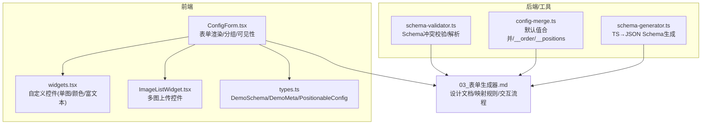
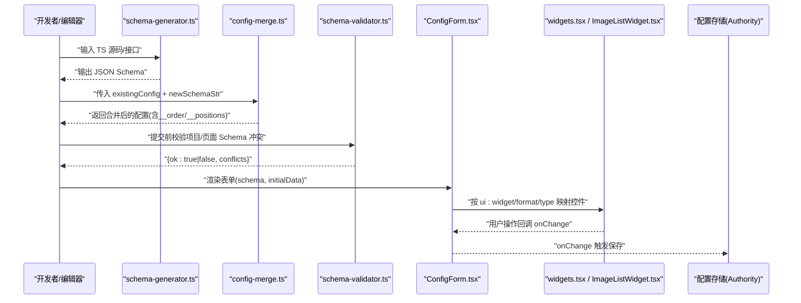
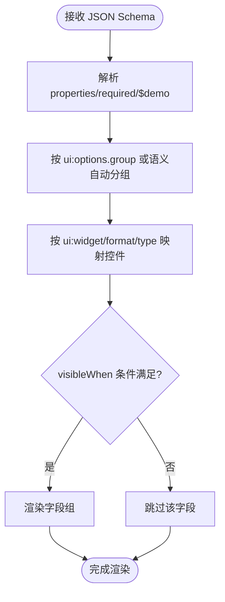
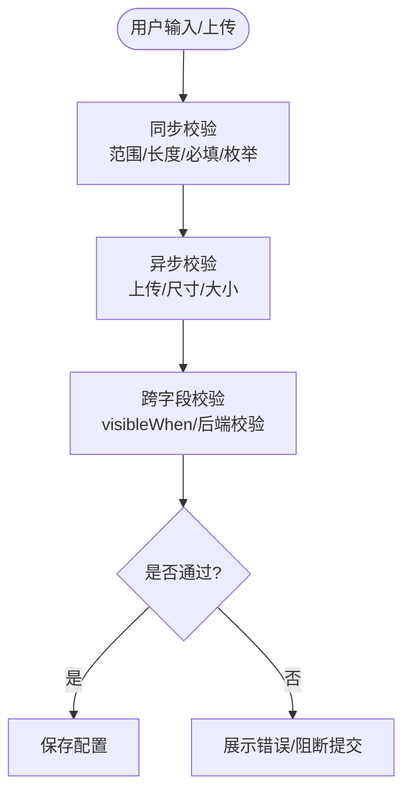
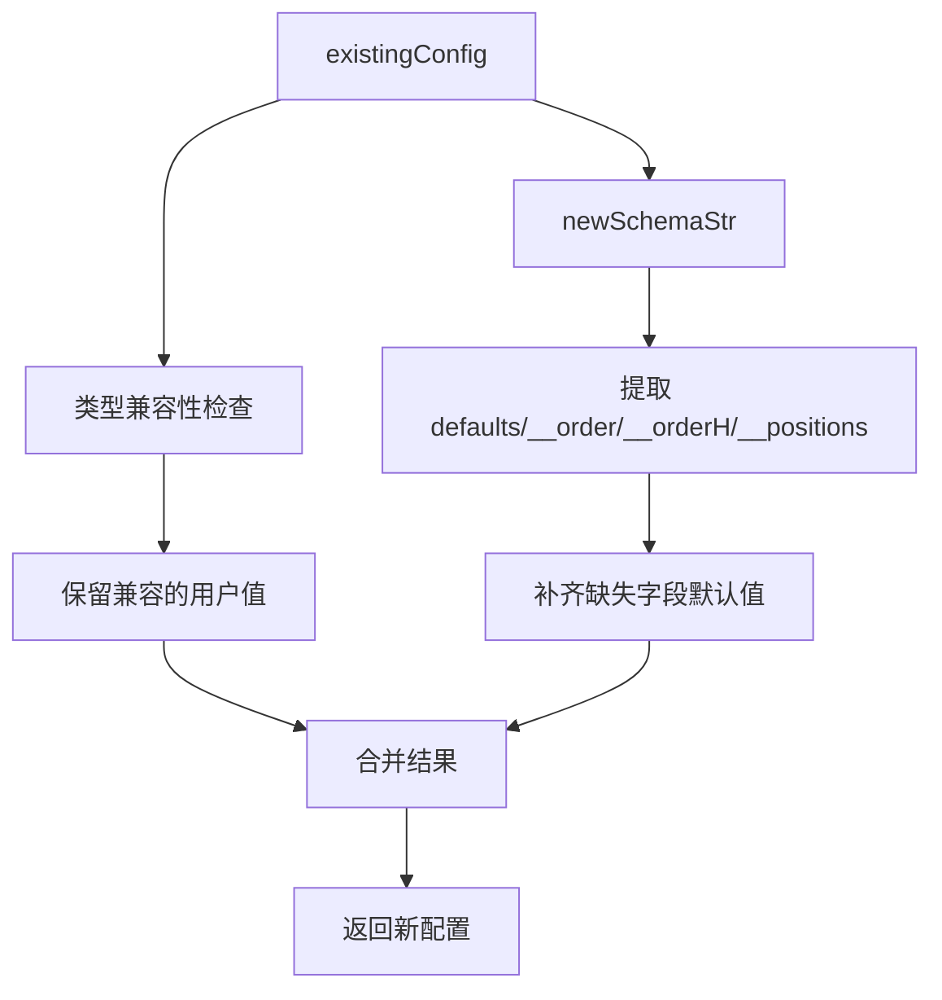
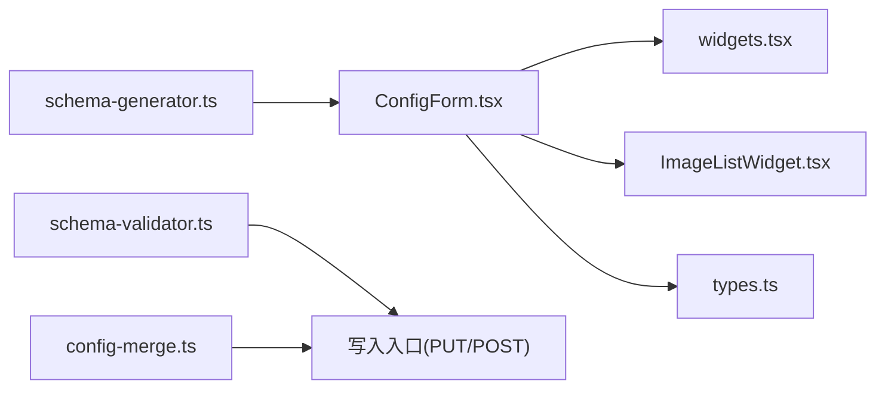

# 配置扩展点

<cite>
**本文引用的文件**   
- [ConfigForm.tsx](file://packages/demo-ui/src/ConfigForm.tsx)
- [widgets.tsx](file://packages/demo-ui/src/widgets.tsx)
- [ImageListWidget.tsx](file://packages/demo-ui/src/ImageListWidget.tsx)
- [types.ts](file://packages/demo-ui/src/types.ts)
- [schema-validator.ts](file://packages/author-site/src/lib/schema-validator.ts)
- [config-merge.ts](file://packages/author-site/src/lib/config-merge.ts)
- [schema-generator.ts](file://packages/author-site/src/lib/schema-generator.ts)
- [03_表单生成器.md](file://docs/项目文档/创作端/04-配置与预览/技术/03_表单生成器.md)
</cite>

## 目录
1. [引言](#引言)
2. [项目结构](#项目结构)
3. [核心组件](#核心组件)
4. [架构总览](#架构总览)
5. [详细组件分析](#详细组件分析)
6. [依赖关系分析](#依赖关系分析)
7. [性能考量](#性能考量)
8. [故障排查指南](#故障排查指南)
9. [结论](#结论)
10. [附录](#附录)

## 引言
本指南面向需要在系统中扩展“配置能力”的开发者，围绕以下目标展开：
- Schema 扩展机制：JSON Schema 继承、字段验证规则、动态表单生成
- 表单控件注册系统：自定义控件开发、属性面板集成、样式定制方案
- 验证规则注入机制：同步验证、异步验证、跨字段验证
- 配置迁移策略：版本升级、数据转换、回滚支持
- 完整开发示例：类型安全保证、测试用例编写、文档自动生成

本仓库已实现一套以 JSON Schema 为驱动的表单生成器与可视化配置面板，并内置了图片上传、颜色选择、富文本等常用控件，以及排序、定位、备注、分类筛选等高级能力。

## 项目结构
本项目采用多包（monorepo）组织方式，配置扩展点相关代码主要分布在如下位置：
- 前端表单与控件：packages/demo-ui/src
- 服务端校验与合并：packages/author-site/src/lib
- 文档与设计说明：docs/项目文档/创作端/04-配置与预览/技术



图表来源
- [ConfigForm.tsx:1-800](file://packages/demo-ui/src/ConfigForm.tsx#L1-L800)
- [widgets.tsx:1-388](file://packages/demo-ui/src/widgets.tsx#L1-L388)
- [ImageListWidget.tsx:1-360](file://packages/demo-ui/src/ImageListWidget.tsx#L1-L360)
- [types.ts:1-420](file://packages/demo-ui/src/types.ts#L1-L420)
- [schema-validator.ts:1-111](file://packages/author-site/src/lib/schema-validator.ts#L1-L111)
- [config-merge.ts:1-133](file://packages/author-site/src/lib/config-merge.ts#L1-L133)
- [schema-generator.ts:1-316](file://packages/author-site/src/lib/schema-generator.ts#L1-L316)
- [03_表单生成器.md:1-800](file://docs/项目文档/创作端/04-配置与预览/技术/03_表单生成器.md#L1-L800)

章节来源
- [03_表单生成器.md:1-800](file://docs/项目文档/创作端/04-配置与预览/技术/03_表单生成器.md#L1-L800)

## 核心组件
- ConfigForm：基于 JSON Schema 动态渲染表单，支持字段分组、条件显示、排序、定位、备注、分类筛选等。
- widgets.tsx：提供 ColorPickerWidget、FileUploadWidget、RichTextWidget 等可复用控件。
- ImageListWidget：多图上传与预览、尺寸校验、数量限制。
- types.ts：定义 DemoSchema、DemoMeta、PositionableConfig 等关键类型，支撑 $demo 扩展元信息。
- schema-validator.ts：项目级与页面级 Schema 字段冲突校验、字符串解析封装。
- config-merge.ts：将新 Schema 的默认值与现有配置合并，维护 __order/__orderH/__positions 等元数据。
- schema-generator.ts：从 TypeScript 接口/解构参数生成 JSON Schema，并与已有 Schema 合并保留扩展字段。

章节来源
- [ConfigForm.tsx:1-800](file://packages/demo-ui/src/ConfigForm.tsx#L1-L800)
- [widgets.tsx:1-388](file://packages/demo-ui/src/widgets.tsx#L1-L388)
- [ImageListWidget.tsx:1-360](file://packages/demo-ui/src/ImageListWidget.tsx#L1-L360)
- [types.ts:1-420](file://packages/demo-ui/src/types.ts#L1-L420)
- [schema-validator.ts:1-111](file://packages/author-site/src/lib/schema-validator.ts#L1-L111)
- [config-merge.ts:1-133](file://packages/author-site/src/lib/config-merge.ts#L1-L133)
- [schema-generator.ts:1-316](file://packages/author-site/src/lib/schema-generator.ts#L1-L316)

## 架构总览
下图展示了“Schema → 表单 → 控件 → 数据持久化”的整体链路，以及 Schema 生成、冲突校验、默认值合并等辅助能力。



图表来源
- [schema-generator.ts:1-316](file://packages/author-site/src/lib/schema-generator.ts#L1-L316)
- [config-merge.ts:1-133](file://packages/author-site/src/lib/config-merge.ts#L1-L133)
- [schema-validator.ts:1-111](file://packages/author-site/src/lib/schema-validator.ts#L1-L111)
- [ConfigForm.tsx:1-800](file://packages/demo-ui/src/ConfigForm.tsx#L1-L800)
- [widgets.tsx:1-388](file://packages/demo-ui/src/widgets.tsx#L1-L388)
- [ImageListWidget.tsx:1-360](file://packages/demo-ui/src/ImageListWidget.tsx#L1-L360)

## 详细组件分析

### Schema 扩展机制（继承、验证、动态表单）
- 继承与扩展
  - 通过 $demo 元信息声明排序、水平排序、定位、预览尺寸等能力；由 types.ts 中的 DemoMeta/PositionableConfig 提供类型约束。
  - schema-generator.ts 可从 TS 接口或函数解构参数生成基础 Schema，并与已有 Schema 合并，保留 ui:widget、enumNames、format、default 等扩展字段。
- 字段验证规则
  - 前端：ConfigForm 根据 type/format/ui:widget 进行控件映射与基础校验（如 number 范围、maxLength、必填）。
  - 后端：schema-validator.ts 提供项目级与页面级 Schema 字段冲突校验，防止重名字段导致运行时歧义。
- 动态表单生成
  - ConfigForm 解析 Schema 为 FieldGroup[]，支持自动分组、visibleWhen 条件显示、ui:options.category 分类筛选。
  - 当 Schema 变更时，通过 key={schema} 强制重建表单实例，确保默认值与初始数据一致。



图表来源
- [ConfigForm.tsx:183-231](file://packages/demo-ui/src/ConfigForm.tsx#L183-L231)
- [ConfigForm.tsx:126-147](file://packages/demo-ui/src/ConfigForm.tsx#L126-L147)
- [types.ts:72-87](file://packages/demo-ui/src/types.ts#L72-L87)
- [schema-generator.ts:284-316](file://packages/author-site/src/lib/schema-generator.ts#L284-L316)
- [schema-validator.ts:47-77](file://packages/author-site/src/lib/schema-validator.ts#L47-L77)

章节来源
- [ConfigForm.tsx:126-147](file://packages/demo-ui/src/ConfigForm.tsx#L126-L147)
- [ConfigForm.tsx:183-231](file://packages/demo-ui/src/ConfigForm.tsx#L183-L231)
- [types.ts:72-87](file://packages/demo-ui/src/types.ts#L72-L87)
- [schema-generator.ts:284-316](file://packages/author-site/src/lib/schema-generator.ts#L284-L316)
- [schema-validator.ts:47-77](file://packages/author-site/src/lib/schema-validator.ts#L47-L77)

### 表单控件注册系统（自定义控件、属性面板集成、样式定制）
- 三层映射原则
  - Layer 1：ui:widget 显式覆盖（最优先）
  - Layer 2：format 语义映射（推荐的标准写法）
  - Layer 3：type 数据类型回退
- 内置控件
  - FileUploadWidget：单图/文件上传，支持拖拽、尺寸校验、大小限制、会话资源 URL 管理。
  - ColorPickerWidget：颜色选择器，支持十六进制/RGB 输入。
  - RichTextWidget：富文本编辑（textarea 形态）。
  - ImageListWidget：多图上传、网格展示、数量限制、尺寸校验、放大预览。
- 控件注册与集成
  - 在表单渲染逻辑中按 ui:widget/format/type 分支渲染对应控件；也可通过外部 widgets 映射表注入自定义控件。
  - 样式定制可通过组件内 className 与 Tailwind 类名组合实现，保持与整体主题一致。

```mermaid
classDiagram
class ConfigForm {
+renderField(field, value, onChange)
+parseSchemaToFields(schema)
+isFieldVisible(field, formData)
}
class Widgets {
+ColorPickerWidget(props)
+FileUploadWidget(props)
+RichTextWidget(props)
}
class ImageListWidget {
+value : ImageItem[]
+onChange(value)
+maxItems? : number
+options?
}
ConfigForm --> Widgets : "按 ui : widget/format/type 调用"
ConfigForm --> ImageListWidget : "array/imageList 场景"
```

图表来源
- [ConfigForm.tsx:311-600](file://packages/demo-ui/src/ConfigForm.tsx#L311-L600)
- [widgets.tsx:70-97](file://packages/demo-ui/src/widgets.tsx#L70-L97)
- [widgets.tsx:121-361](file://packages/demo-ui/src/widgets.tsx#L121-L361)
- [ImageListWidget.tsx:91-357](file://packages/demo-ui/src/ImageListWidget.tsx#L91-L357)

章节来源
- [03_表单生成器.md:156-221](file://docs/项目文档/创作端/04-配置与预览/技术/03_表单生成器.md#L156-L221)
- [widgets.tsx:70-97](file://packages/demo-ui/src/widgets.tsx#L70-L97)
- [widgets.tsx:121-361](file://packages/demo-ui/src/widgets.tsx#L121-L361)
- [ImageListWidget.tsx:91-357](file://packages/demo-ui/src/ImageListWidget.tsx#L91-L357)

### 验证规则注入机制（同步、异步、跨字段）
- 同步验证
  - 前端：number 范围、maxLength、必填、枚举选择等由表单渲染层直接处理。
  - 后端：schema-validator.ts 在项目/页面 Schema 写入前执行冲突校验，发现重名字段拒绝写入。
- 异步验证
  - 图片上传：文件大小、尺寸校验在前端进行；上传失败/网络异常时提示错误。
  - 如需服务端校验（如内容合规），可在上传接口返回错误消息后由前端展示。
- 跨字段验证
  - visibleWhen 用于控制字段可见性，属于轻量联动；复杂跨字段校验建议在后端或统一校验服务中实现。



图表来源
- [ConfigForm.tsx:478-544](file://packages/demo-ui/src/ConfigForm.tsx#L478-L544)
- [widgets.tsx:156-218](file://packages/demo-ui/src/widgets.tsx#L156-L218)
- [ImageListWidget.tsx:134-193](file://packages/demo-ui/src/ImageListWidget.tsx#L134-L193)
- [schema-validator.ts:47-77](file://packages/author-site/src/lib/schema-validator.ts#L47-L77)

章节来源
- [ConfigForm.tsx:478-544](file://packages/demo-ui/src/ConfigForm.tsx#L478-L544)
- [widgets.tsx:156-218](file://packages/demo-ui/src/widgets.tsx#L156-L218)
- [ImageListWidget.tsx:134-193](file://packages/demo-ui/src/ImageListWidget.tsx#L134-L193)
- [schema-validator.ts:47-77](file://packages/author-site/src/lib/schema-validator.ts#L47-L77)

### 配置迁移策略（版本升级、数据转换、回滚支持）
- 版本升级与默认值合并
  - 使用 config-merge.ts 的 mergeSchemaDefaults：新增字段取 schema default；删除字段从配置移除；类型不兼容则用新 default；始终从当前 Schema 初始化 __order/__orderH/__positions。
- 数据转换
  - 对旧配置中不兼容的类型进行回退到默认值，避免运行时错误。
- 回滚支持
  - 若 Schema 变更导致配置不可用，可将配置重置为空对象，再重新合并新 Schema 默认值；必要时结合 key={schema} 强制重建表单实例。



图表来源
- [config-merge.ts:39-103](file://packages/author-site/src/lib/config-merge.ts#L39-L103)
- [config-merge.ts:108-133](file://packages/author-site/src/lib/config-merge.ts#L108-L133)

章节来源
- [config-merge.ts:39-103](file://packages/author-site/src/lib/config-merge.ts#L39-L103)
- [config-merge.ts:108-133](file://packages/author-site/src/lib/config-merge.ts#L108-L133)

### 完整开发示例（类型安全、测试、文档自动生成）
- 类型安全保证
  - 使用 types.ts 中的 DemoSchema/DemoMeta/PositionableConfig 约束 $demo 扩展字段，确保前后端一致。
- 测试用例编写
  - 针对控件行为（上传、尺寸校验、数量限制）、表单渲染（分组、可见性）、合并策略（默认值、__order/__positions）编写单元测试。
- 文档自动生成
  - 利用 schema-generator.ts 从 TS 接口/解构参数生成 JSON Schema，并与已有 Schema 合并，减少手工维护成本。

章节来源
- [types.ts:72-87](file://packages/demo-ui/src/types.ts#L72-L87)
- [schema-generator.ts:207-245](file://packages/author-site/src/lib/schema-generator.ts#L207-L245)
- [schema-generator.ts:284-316](file://packages/author-site/src/lib/schema-generator.ts#L284-L316)

## 依赖关系分析
- 组件耦合与内聚
  - ConfigForm 与 widgets.tsx、ImageListWidget.tsx 高内聚，职责清晰；通过 ui:widget/format/type 松耦合映射。
  - schema-validator.ts 与 config-merge.ts 作为独立工具模块，被上层写入/合并流程调用。
- 外部依赖与集成点
  - 上传接口：/api/sessions/{sessionId}/assets/upload 与 /api/sessions/{sessionId}/assets/{filename}（删除）。
  - Authority 受管资源：项目级与页面级 Schema 与运行值通过 mutation 写入。



图表来源
- [ConfigForm.tsx:1-800](file://packages/demo-ui/src/ConfigForm.tsx#L1-L800)
- [widgets.tsx:1-388](file://packages/demo-ui/src/widgets.tsx#L1-L388)
- [ImageListWidget.tsx:1-360](file://packages/demo-ui/src/ImageListWidget.tsx#L1-L360)
- [types.ts:1-420](file://packages/demo-ui/src/types.ts#L1-L420)
- [schema-validator.ts:1-111](file://packages/author-site/src/lib/schema-validator.ts#L1-L111)
- [config-merge.ts:1-133](file://packages/author-site/src/lib/config-merge.ts#L1-L133)
- [schema-generator.ts:1-316](file://packages/author-site/src/lib/schema-generator.ts#L1-L316)

章节来源
- [ConfigForm.tsx:1-800](file://packages/demo-ui/src/ConfigForm.tsx#L1-L800)
- [schema-validator.ts:1-111](file://packages/author-site/src/lib/schema-validator.ts#L1-L111)
- [config-merge.ts:1-133](file://packages/author-site/src/lib/config-merge.ts#L1-L133)

## 性能考量
- 表单渲染优化
  - 使用 useMemo 缓存解析结果与可见字段集合，避免重复计算。
  - 等价对象比较（areConfigRecordsEqual）避免无意义的状态更新与重渲染。
- 控件交互优化
  - 图片上传前本地校验尺寸与大小，减少无效请求。
  - 列表控件（ImageListWidget）限制最大项数，避免 DOM 过大。
- 合并策略优化
  - 仅对类型兼容的用户值进行保留，减少不必要的默认值覆盖。

[本节为通用指导，无需具体文件引用]

## 故障排查指南
- 表单未随 Schema 更新
  - 确认父组件是否设置 key={schema}，以确保 Schema 变化时强制重建表单实例。
- 图片上传失败
  - 检查 sessionId 是否存在、文件大小与尺寸是否符合 ui:options 限制、网络与后端接口是否正常。
- 配置合并异常
  - 检查新 Schema 的 properties 与 required 是否正确；确认 mergeSchemaDefaults 的默认值与类型兼容。
- Schema 冲突
  - 使用 validateNoSchemaConflict 在项目/页面 Schema 写入前进行校验，避免字段重名。

章节来源
- [03_表单生成器.md:78-153](file://docs/项目文档/创作端/04-配置与预览/技术/03_表单生成器.md#L78-L153)
- [widgets.tsx:156-218](file://packages/demo-ui/src/widgets.tsx#L156-L218)
- [config-merge.ts:39-103](file://packages/author-site/src/lib/config-merge.ts#L39-L103)
- [schema-validator.ts:47-77](file://packages/author-site/src/lib/schema-validator.ts#L47-L77)

## 结论
本配置扩展点体系以 JSON Schema 为核心，结合 $demo 扩展元信息与三层控件映射，实现了高度可配置的动态表单与可视化编辑体验。通过 schema-generator、config-merge、schema-validator 等工具链，提供了从类型安全、默认值合并到冲突校验的完整闭环。建议在扩展过程中遵循标准 format 语义、谨慎使用 ui:widget 覆盖，并在后端增加必要的异步与跨字段校验，以保证系统的健壮性与可维护性。

[本节为总结，无需具体文件引用]

## 附录
- 最佳实践
  - 优先使用 format 语义声明，仅在需要偏离默认控件时使用 ui:widget。
  - 为复杂字段补充 $demo.note 备注，提升可维护性。
  - 在 Schema 变更时配合 key={schema} 与配置合并策略，确保 UI 与数据一致性。
- 参考文档
  - 表单生成器设计与实现详见：03_表单生成器.md

[本节为附加信息，无需具体文件引用]