# 钩子系统

<cite>
**本文引用的文件**   
- [packages/author-site/src/app/demo/[id]/edit/hooks/useVisualEditState.ts](file://packages/author-site/src/app/demo/[id]/edit/hooks/useVisualEditState.ts)
- [packages/author-site/src/components/ai-elements/chat/hooks/use-chat-messages.ts](file://packages/author-site/src/components/ai-elements/chat/hooks/use-chat-messages.ts)
- [packages/agent-service/src/backends/managers/tool-hook-manager.ts](file://packages/agent-service/src/backends/managers/tool-hook-manager.ts)
- [packages/agent-service/src/events/event-bus.ts](file://packages/agent-service/src/events/event-bus.ts)
- [packages/agent-client/src/client.ts](file://packages/agent-client/src/client.ts)
- [packages/author-site/src/hooks/useCollabDocument.ts](file://packages/author-site/src/hooks/useCollabDocument.ts)
- [packages/demo-ui/src/compile-cache.ts](file://packages/demo-ui/src/compile-cache.ts)
- [packages/screenshot-service/src/utils/compile-cache.ts](file://packages/screenshot-service/src/utils/compile-cache.ts)
</cite>

## 目录
1. [引言](#引言)
2. [项目结构](#项目结构)
3. [核心组件](#核心组件)
4. [架构总览](#架构总览)
5. [详细组件分析](#详细组件分析)
6. [依赖分析](#依赖分析)
7. [性能考虑](#性能考虑)
8. [故障排查指南](#故障排查指南)
9. [结论](#结论)
10. [附录](#附录)

## 引言
本指南面向需要基于仓库现有实现进行“钩子系统”开发与集成的工程师，围绕以下目标展开：
- 生命周期钩子：组件挂载、更新与卸载的执行顺序与最佳实践
- 事件钩子：自定义事件的定义、监听器绑定与传播机制
- 数据钩子：响应式更新的原理（依赖追踪、缓存策略与性能优化）
- 开发示例：类型定义、错误处理与调试工具使用
- 组合模式：条件执行与异步处理的实践建议

本仓库中并未提供统一的“钩子框架”，但存在多处可抽象为“钩子”的通用能力：React Hook（如 useChatMessages、useCollabDocument）、服务端工具调用拦截与结果处理（ToolHookManager）、全局事件总线（EventBus）以及客户端事件分发（AgentClient）。下文将结合源码对这些能力进行系统化梳理，并给出可复用的设计与实践。

## 项目结构
从钩子相关能力出发，代码分布在多个包中，职责清晰：
- 前端 React Hook
  - 聊天消息状态管理：useChatMessages
  - 协同文档与用户感知：useCollabDocument、useCollabPresence
  - 可视化编辑状态编排：useVisualEditState
- 服务端工具钩子
  - 工具调用拦截与结果处理：ToolHookManager
  - 事件总线：EventBus
- 客户端事件分发
  - AgentClient 的事件 on/off/emit 模型
- 编译缓存
  - 演示端与服务端的编译缓存实现（用于减少重复计算）

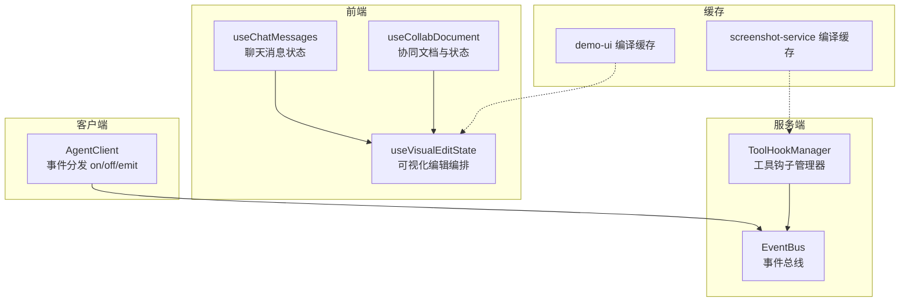

图表来源
- [packages/author-site/src/components/ai-elements/chat/hooks/use-chat-messages.ts:1-179](file://packages/author-site/src/components/ai-elements/chat/hooks/use-chat-messages.ts#L1-L179)
- [packages/author-site/src/hooks/useCollabDocument.ts:1-346](file://packages/author-site/src/hooks/useCollabDocument.ts#L1-L346)
- [packages/author-site/src/app/demo/[id]/edit/hooks/useVisualEditState.ts:1-800](file://packages/author-site/src/app/demo/[id]/edit/hooks/useVisualEditState.ts#L1-L800)
- [packages/agent-service/src/backends/managers/tool-hook-manager.ts:1-294](file://packages/agent-service/src/backends/managers/tool-hook-manager.ts#L1-L294)
- [packages/agent-service/src/events/event-bus.ts:1-39](file://packages/agent-service/src/events/event-bus.ts#L1-L39)
- [packages/agent-client/src/client.ts:380-408](file://packages/agent-client/src/client.ts#L380-L408)
- [packages/demo-ui/src/compile-cache.ts:1-86](file://packages/demo-ui/src/compile-cache.ts#L1-L86)
- [packages/screenshot-service/src/utils/compile-cache.ts:1-69](file://packages/screenshot-service/src/utils/compile-cache.ts#L1-L69)

章节来源
- [packages/author-site/src/components/ai-elements/chat/hooks/use-chat-messages.ts:1-179](file://packages/author-site/src/components/ai-elements/chat/hooks/use-chat-messages.ts#L1-L179)
- [packages/author-site/src/hooks/useCollabDocument.ts:1-346](file://packages/author-site/src/hooks/useCollabDocument.ts#L1-L346)
- [packages/author-site/src/app/demo/[id]/edit/hooks/useVisualEditState.ts:1-800](file://packages/author-site/src/app/demo/[id]/edit/hooks/useVisualEditState.ts#L1-L800)
- [packages/agent-service/src/backends/managers/tool-hook-manager.ts:1-294](file://packages/agent-service/src/backends/managers/tool-hook-manager.ts#L1-L294)
- [packages/agent-service/src/events/event-bus.ts:1-39](file://packages/agent-service/src/events/event-bus.ts#L1-L39)
- [packages/agent-client/src/client.ts:380-408](file://packages/agent-client/src/client.ts#L380-L408)
- [packages/demo-ui/src/compile-cache.ts:1-86](file://packages/demo-ui/src/compile-cache.ts#L1-L86)
- [packages/screenshot-service/src/utils/compile-cache.ts:1-69](file://packages/screenshot-service/src/utils/compile-cache.ts#L1-L69)

## 核心组件
本节聚焦于“钩子”在系统中的关键角色与职责边界：
- 生命周期钩子（React Hook）
  - useEffect/useMemo/useCallback 的组合用于挂载、更新、卸载的生命周期控制
  - 通过 ref 同步最新值，避免高频事件下的状态跳闪
- 事件钩子（EventEmitter/自定义事件）
  - 服务端 EventBus 封装 Node.js EventEmitter
  - 客户端 AgentClient 维护事件处理器集合，支持 on/off/close
- 数据钩子（响应式与缓存）
  - Yjs + WebsocketProvider 驱动的数据变更观察与状态同步
  - 编译缓存（LRU/TTL）降低重复计算成本

章节来源
- [packages/author-site/src/components/ai-elements/chat/hooks/use-chat-messages.ts:1-179](file://packages/author-site/src/components/ai-elements/chat/hooks/use-chat-messages.ts#L1-L179)
- [packages/author-site/src/hooks/useCollabDocument.ts:1-346](file://packages/author-site/src/hooks/useCollabDocument.ts#L1-L346)
- [packages/agent-service/src/events/event-bus.ts:1-39](file://packages/agent-service/src/events/event-bus.ts#L1-L39)
- [packages/agent-client/src/client.ts:380-408](file://packages/agent-client/src/client.ts#L380-L408)
- [packages/demo-ui/src/compile-cache.ts:1-86](file://packages/demo-ui/src/compile-cache.ts#L1-L86)
- [packages/screenshot-service/src/utils/compile-cache.ts:1-69](file://packages/screenshot-service/src/utils/compile-cache.ts#L1-L69)

## 架构总览
下图展示了“钩子系统”在前端与服务端之间的交互关系，包括事件流、数据流与缓存层。

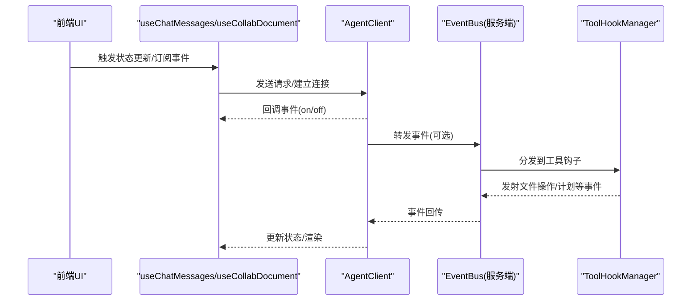

图表来源
- [packages/author-site/src/components/ai-elements/chat/hooks/use-chat-messages.ts:1-179](file://packages/author-site/src/components/ai-elements/chat/hooks/use-chat-messages.ts#L1-L179)
- [packages/author-site/src/hooks/useCollabDocument.ts:1-346](file://packages/author-site/src/hooks/useCollabDocument.ts#L1-L346)
- [packages/agent-client/src/client.ts:380-408](file://packages/agent-client/src/client.ts#L380-L408)
- [packages/agent-service/src/events/event-bus.ts:1-39](file://packages/agent-service/src/events/event-bus.ts#L1-L39)
- [packages/agent-service/src/backends/managers/tool-hook-manager.ts:1-294](file://packages/agent-service/src/backends/managers/tool-hook-manager.ts#L1-L294)

## 详细组件分析

### 组件A：useChatMessages（聊天消息状态钩子）
该钩子统一了受控与非受控两种模式的消息状态管理，并通过 ref 同步最新值，解决 WebSocket 密集事件下的状态跳闪问题。

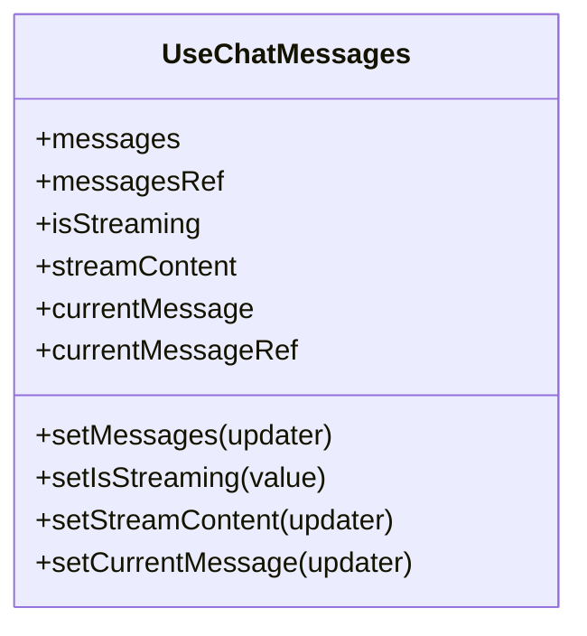

图表来源
- [packages/author-site/src/components/ai-elements/chat/hooks/use-chat-messages.ts:1-179](file://packages/author-site/src/components/ai-elements/chat/hooks/use-chat-messages.ts#L1-L179)

章节来源
- [packages/author-site/src/components/ai-elements/chat/hooks/use-chat-messages.ts:1-179](file://packages/author-site/src/components/ai-elements/chat/hooks/use-chat-messages.ts#L1-L179)

#### 生命周期钩子执行顺序（挂载/更新/卸载）
- 挂载阶段
  - useState 初始化内部状态
  - useRef 创建引用
  - useEffect 同步 ref 到最新值
- 更新阶段
  - setMessages/setIsStreaming/setStreamContent/setCurrentMessage 根据受控/非受控分支更新
  - areChatValuesEqual 比较新旧值，避免不必要的重渲染
- 卸载阶段
  - 由上层组件负责清理外部资源（例如 WebSocket），本钩子不持有长连接

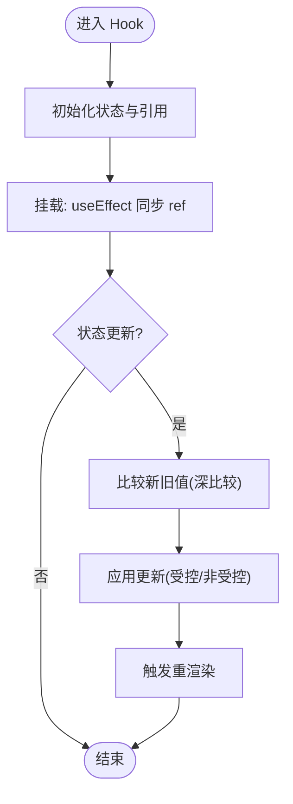

[此图为概念流程，无需图表来源]

### 组件B：useCollabDocument（协同文档与用户感知钩子）
该钩子封装了 Yjs + WebsocketProvider 的连接、状态同步、用户感知与错误处理，并提供 flush 落盘能力。

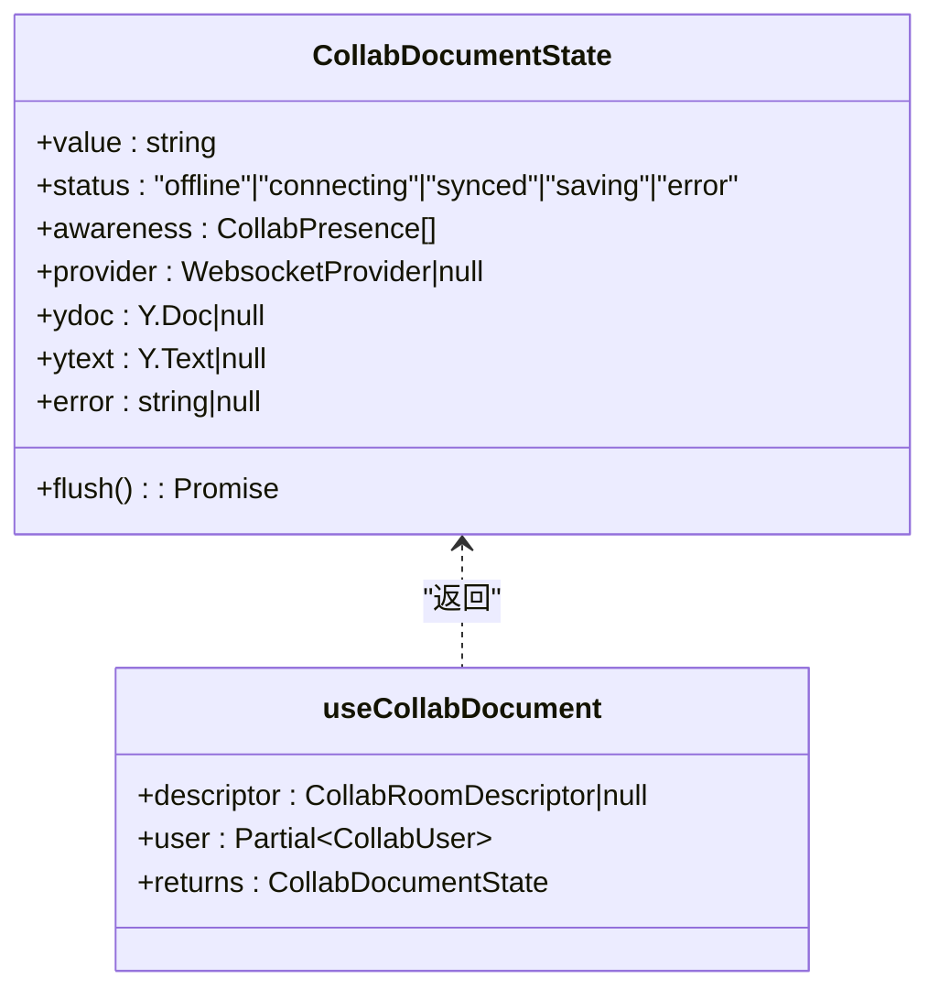

图表来源
- [packages/author-site/src/hooks/useCollabDocument.ts:1-346](file://packages/author-site/src/hooks/useCollabDocument.ts#L1-L346)

章节来源
- [packages/author-site/src/hooks/useCollabDocument.ts:1-346](file://packages/author-site/src/hooks/useCollabDocument.ts#L1-L346)

#### 生命周期钩子执行顺序（挂载/更新/卸载）
- 挂载阶段
  - 构建稳定 descriptor（useMemo）
  - 创建 Y.Doc/Y.Text/WebsocketProvider
  - 注册 text.observe、awareness.on、provider.on(status/sync/connection-error)
- 更新阶段
  - 当 descriptor 变化时，销毁旧实例并重建新实例
  - 文本变更时更新 value 与 presence
- 卸载阶段
  - 清理定时器、移除观察者、destroy provider/doc

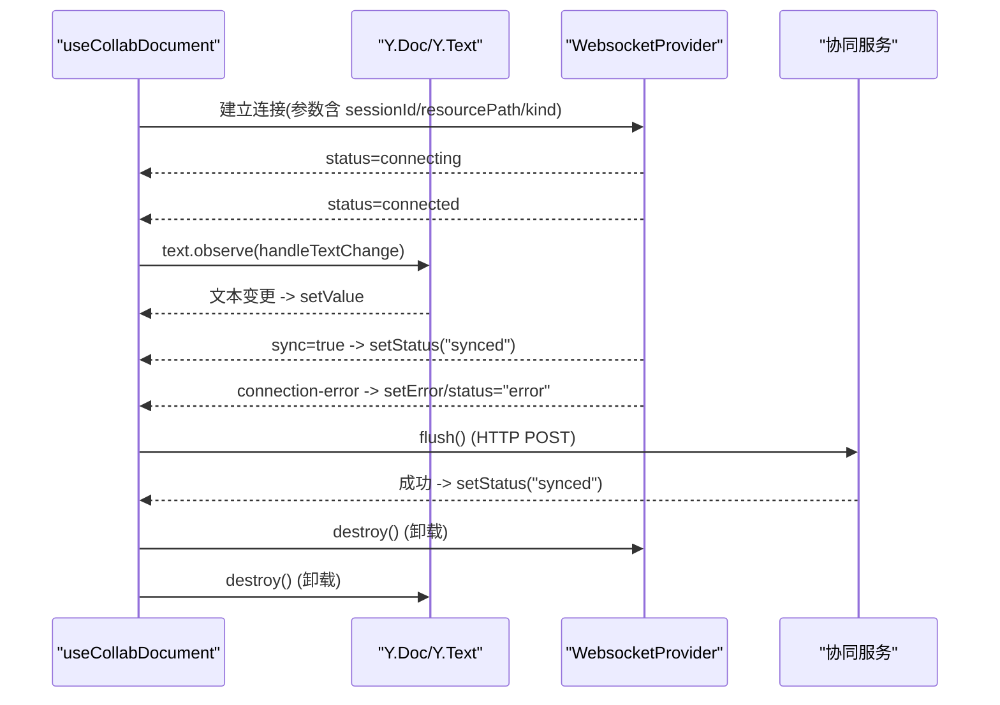

图表来源
- [packages/author-site/src/hooks/useCollabDocument.ts:1-346](file://packages/author-site/src/hooks/useCollabDocument.ts#L1-L346)

### 组件C：ToolHookManager（工具钩子管理器）
该管理器负责工具调用的拦截与结果处理，包括：
- 记录文件变更（writeFile/editFile/patchSketchScene/deletePage 等）
- 发射文件操作事件（fs/write_text_file、fs/edit_text_file、fs/delete_path）
- 更新计划项（updatePlan）
- 追踪知识库读取（readFile/readFileWithLines）

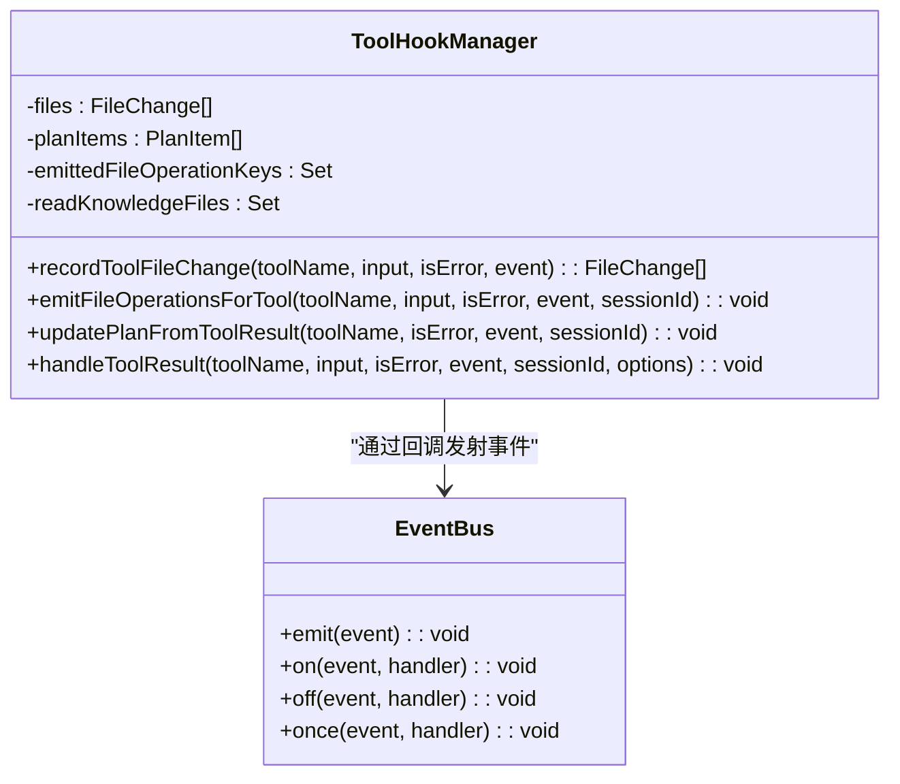

图表来源
- [packages/agent-service/src/backends/managers/tool-hook-manager.ts:1-294](file://packages/agent-service/src/backends/managers/tool-hook-manager.ts#L1-L294)
- [packages/agent-service/src/events/event-bus.ts:1-39](file://packages/agent-service/src/events/event-bus.ts#L1-L39)

章节来源
- [packages/agent-service/src/backends/managers/tool-hook-manager.ts:1-294](file://packages/agent-service/src/backends/managers/tool-hook-manager.ts#L1-L294)
- [packages/agent-service/src/events/event-bus.ts:1-39](file://packages/agent-service/src/events/event-bus.ts#L1-L39)

#### 事件钩子的注册与处理流程
- 注册
  - 通过 getEventBus().on(type, handler) 订阅事件
- 处理
  - ToolHookManager.handleToolResult 解析工具输入/输出，生成文件变更与操作
  - emitFileOperationsForTool 去重后通过 eventCallback 发射 file_operation 事件
- 传播
  - 上层可通过 EventBus 或回调链将事件传递至客户端（AgentClient）

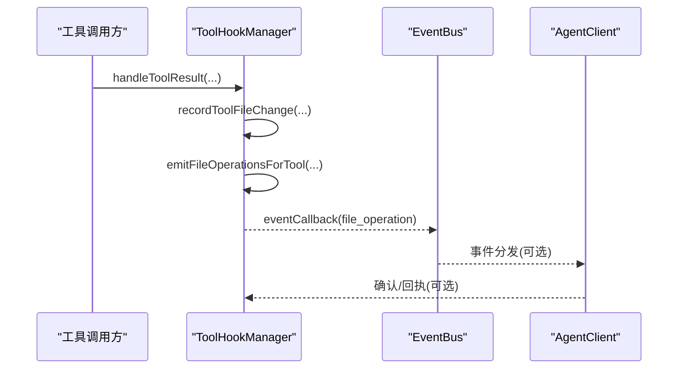

图表来源
- [packages/agent-service/src/backends/managers/tool-hook-manager.ts:1-294](file://packages/agent-service/src/backends/managers/tool-hook-manager.ts#L1-L294)
- [packages/agent-service/src/events/event-bus.ts:1-39](file://packages/agent-service/src/events/event-bus.ts#L1-L39)
- [packages/agent-client/src/client.ts:380-408](file://packages/agent-client/src/client.ts#L380-L408)

### 组件D：AgentClient（客户端事件分发）
客户端维护事件处理器集合，支持 on/off/close，并在收到服务端事件时遍历调用对应处理器。

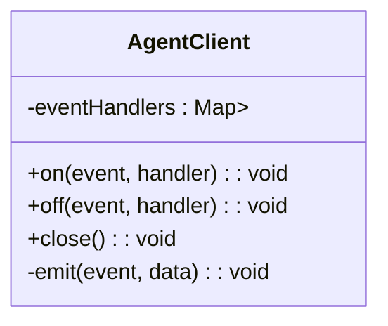

图表来源
- [packages/agent-client/src/client.ts:380-408](file://packages/agent-client/src/client.ts#L380-L408)

章节来源
- [packages/agent-client/src/client.ts:380-408](file://packages/agent-client/src/client.ts#L380-L408)

### 组件E：useVisualEditState（可视化编辑编排钩子）
该钩子聚合了属性变更、配置标记、AI 指令与提交状态，协调原型页直接写回与 AI 辅助修改路径。其内部包含大量状态管理与合并逻辑，适合用作复杂业务场景的“编排钩子”。

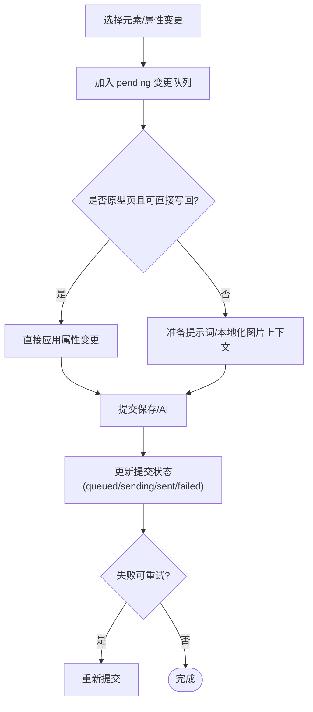

图表来源
- [packages/author-site/src/app/demo/[id]/edit/hooks/useVisualEditState.ts:1-800](file://packages/author-site/src/app/demo/[id]/edit/hooks/useVisualEditState.ts#L1-L800)

章节来源
- [packages/author-site/src/app/demo/[id]/edit/hooks/useVisualEditState.ts:1-800](file://packages/author-site/src/app/demo/[id]/edit/hooks/useVisualEditState.ts#L1-L800)

## 依赖分析
- 组件耦合与内聚
  - useChatMessages 与 useCollabDocument 相对独立，分别关注消息与协同文档
  - useVisualEditState 依赖前者提供的状态管理能力，形成编排关系
  - ToolHookManager 与 EventBus 强耦合，负责服务端事件生产
  - AgentClient 与 EventBus 弱耦合，通过回调或事件通道消费
- 外部依赖与集成点
  - Yjs/WebsocketProvider 提供实时协作能力
  - Node.js EventEmitter 作为事件总线基础
  - 编译缓存（Map+TTL/LRU）用于减少重复计算

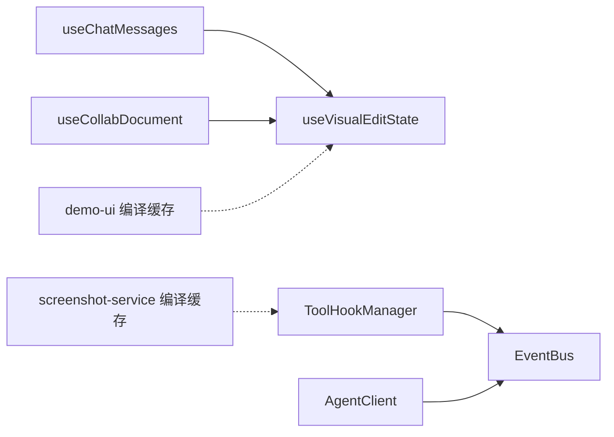

图表来源
- [packages/author-site/src/components/ai-elements/chat/hooks/use-chat-messages.ts:1-179](file://packages/author-site/src/components/ai-elements/chat/hooks/use-chat-messages.ts#L1-L179)
- [packages/author-site/src/hooks/useCollabDocument.ts:1-346](file://packages/author-site/src/hooks/useCollabDocument.ts#L1-L346)
- [packages/author-site/src/app/demo/[id]/edit/hooks/useVisualEditState.ts:1-800](file://packages/author-site/src/app/demo/[id]/edit/hooks/useVisualEditState.ts#L1-L800)
- [packages/agent-service/src/backends/managers/tool-hook-manager.ts:1-294](file://packages/agent-service/src/backends/managers/tool-hook-manager.ts#L1-L294)
- [packages/agent-service/src/events/event-bus.ts:1-39](file://packages/agent-service/src/events/event-bus.ts#L1-L39)
- [packages/agent-client/src/client.ts:380-408](file://packages/agent-client/src/client.ts#L380-L408)
- [packages/demo-ui/src/compile-cache.ts:1-86](file://packages/demo-ui/src/compile-cache.ts#L1-L86)
- [packages/screenshot-service/src/utils/compile-cache.ts:1-69](file://packages/screenshot-service/src/utils/compile-cache.ts#L1-L69)

章节来源
- [packages/author-site/src/components/ai-elements/chat/hooks/use-chat-messages.ts:1-179](file://packages/author-site/src/components/ai-elements/chat/hooks/use-chat-messages.ts#L1-L179)
- [packages/author-site/src/hooks/useCollabDocument.ts:1-346](file://packages/author-site/src/hooks/useCollabDocument.ts#L1-L346)
- [packages/author-site/src/app/demo/[id]/edit/hooks/useVisualEditState.ts:1-800](file://packages/author-site/src/app/demo/[id]/edit/hooks/useVisualEditState.ts#L1-L800)
- [packages/agent-service/src/backends/managers/tool-hook-manager.ts:1-294](file://packages/agent-service/src/backends/managers/tool-hook-manager.ts#L1-L294)
- [packages/agent-service/src/events/event-bus.ts:1-39](file://packages/agent-service/src/events/event-bus.ts#L1-L39)
- [packages/agent-client/src/client.ts:380-408](file://packages/agent-client/src/client.ts#L380-L408)
- [packages/demo-ui/src/compile-cache.ts:1-86](file://packages/demo-ui/src/compile-cache.ts#L1-L86)
- [packages/screenshot-service/src/utils/compile-cache.ts:1-69](file://packages/screenshot-service/src/utils/compile-cache.ts#L1-L69)

## 性能考虑
- 依赖追踪与最小化重渲染
  - useChatMessages 使用 JSON.stringify 对比新旧值，避免无意义更新
  - useCollabDocument 对 presence 列表签名比较，防止频繁重渲染
- 缓存策略
  - demo-ui 编译缓存：按会话+页面+代码指纹构建键，设置 TTL 与最大条目数，过期自动清理
  - screenshot-service 编译缓存：SHA256 哈希键，LRU 淘汰策略
- 事件批处理与去重
  - ToolHookManager 对已发射的文件操作 key 去重，避免重复事件
  - AgentClient 使用 Set 存储处理器，避免重复绑定

章节来源
- [packages/author-site/src/components/ai-elements/chat/hooks/use-chat-messages.ts:1-179](file://packages/author-site/src/components/ai-elements/chat/hooks/use-chat-messages.ts#L1-L179)
- [packages/author-site/src/hooks/useCollabDocument.ts:1-346](file://packages/author-site/src/hooks/useCollabDocument.ts#L1-L346)
- [packages/demo-ui/src/compile-cache.ts:1-86](file://packages/demo-ui/src/compile-cache.ts#L1-L86)
- [packages/screenshot-service/src/utils/compile-cache.ts:1-69](file://packages/screenshot-service/src/utils/compile-cache.ts#L1-L69)
- [packages/agent-service/src/backends/managers/tool-hook-manager.ts:1-294](file://packages/agent-service/src/backends/managers/tool-hook-manager.ts#L1-L294)
- [packages/agent-client/src/client.ts:380-408](file://packages/agent-client/src/client.ts#L380-L408)

## 故障排查指南
- 协同连接失败
  - 现象：useCollabDocument 上报 error 与 status="error"
  - 排查：检查网络连通性、代理配置、服务端地址；确认 flush 接口可达
- 事件未触发
  - 现象：AgentClient.on 注册的处理器未被调用
  - 排查：确认 on/off 是否正确配对；检查服务端是否通过 eventCallback 正确发射事件
- 工具钩子未记录变更
  - 现象：ToolHookManager.recordToolFileChange 未产生变更
  - 排查：确认 toolName 与 input 是否符合预期；dryRun 或 noop 场景会跳过记录
- 编译缓存命中异常
  - 现象：缓存未命中或过期
  - 排查：核对键生成逻辑（会话+页面+代码指纹）；检查 TTL 与最大条目数配置

章节来源
- [packages/author-site/src/hooks/useCollabDocument.ts:1-346](file://packages/author-site/src/hooks/useCollabDocument.ts#L1-L346)
- [packages/agent-client/src/client.ts:380-408](file://packages/agent-client/src/client.ts#L380-L408)
- [packages/agent-service/src/backends/managers/tool-hook-manager.ts:1-294](file://packages/agent-service/src/backends/managers/tool-hook-manager.ts#L1-L294)
- [packages/demo-ui/src/compile-cache.ts:1-86](file://packages/demo-ui/src/compile-cache.ts#L1-L86)
- [packages/screenshot-service/src/utils/compile-cache.ts:1-69](file://packages/screenshot-service/src/utils/compile-cache.ts#L1-L69)

## 结论
本仓库虽未提供统一的“钩子框架”，但通过 React Hook、事件总线与工具钩子管理器的组合，形成了完整的“生命周期—事件—数据”钩子体系。开发者可在此基础上：
- 复用 useChatMessages 的模式实现受控/非受控状态管理
- 参考 useCollabDocument 的生命周期与清理策略
- 在服务端使用 ToolHookManager 与 EventBus 扩展工具钩子能力
- 借助编译缓存提升整体性能

## 附录
- 类型定义与接口
  - useChatMessages 选项与返回值
  - CollabDocumentState/CollabPresenceState
  - ToolHookManager 方法签名
  - EventBus 接口 IEventBus
- 调试建议
  - 在 useChatMessages 中打印 messagesRef/current 以验证最新值
  - 在 useCollabDocument 中打印 provider.status 与 awareness 列表
  - 在 ToolHookManager 中记录 emittedFileOperationKeys 去重情况
  - 在 AgentClient 中打印 eventHandlers 映射表

章节来源
- [packages/author-site/src/components/ai-elements/chat/hooks/use-chat-messages.ts:1-179](file://packages/author-site/src/components/ai-elements/chat/hooks/use-chat-messages.ts#L1-L179)
- [packages/author-site/src/hooks/useCollabDocument.ts:1-346](file://packages/author-site/src/hooks/useCollabDocument.ts#L1-L346)
- [packages/agent-service/src/backends/managers/tool-hook-manager.ts:1-294](file://packages/agent-service/src/backends/managers/tool-hook-manager.ts#L1-L294)
- [packages/agent-service/src/events/event-bus.ts:1-39](file://packages/agent-service/src/events/event-bus.ts#L1-L39)
- [packages/agent-client/src/client.ts:380-408](file://packages/agent-client/src/client.ts#L380-L408)