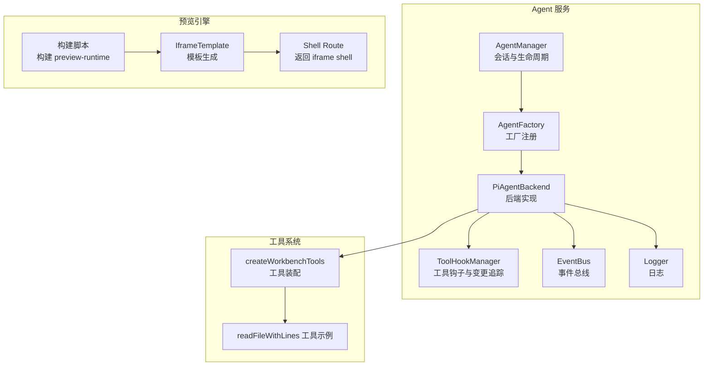
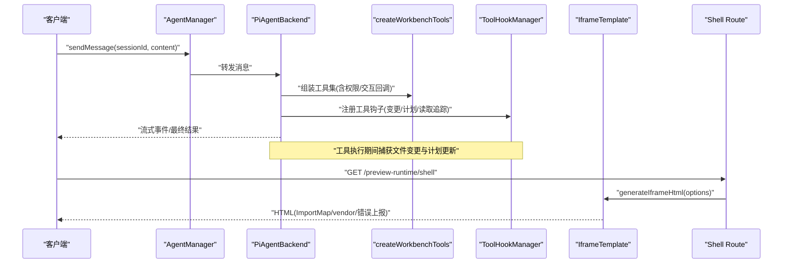
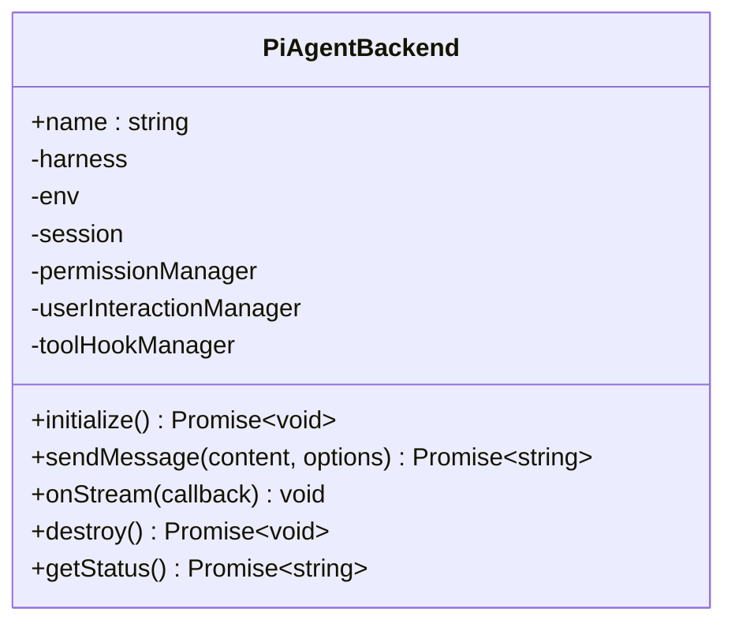
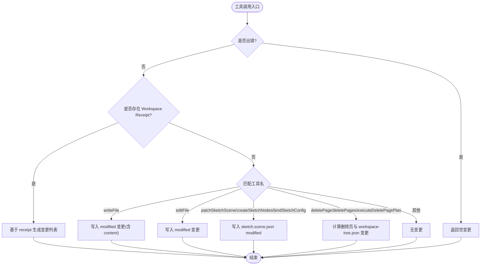
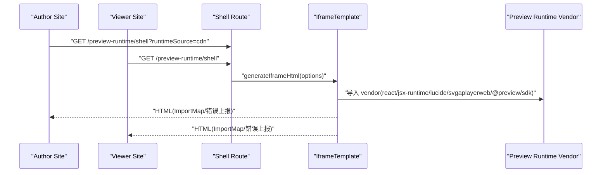
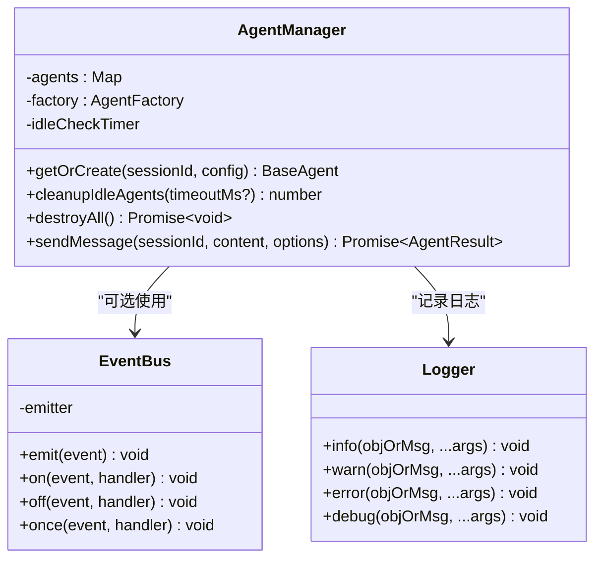
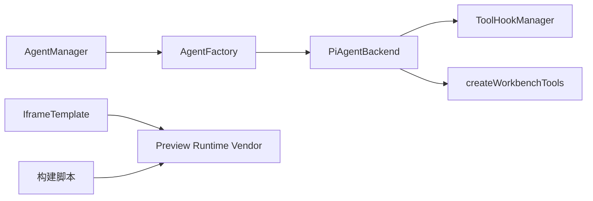

# 插件开发框架

<cite>
**本文引用的文件**   
- [agent-manager.ts](file://packages/agent-service/src/core/agent-manager.ts)
- [agent-factory.ts](file://packages/agent-service/src/core/agent-factory.ts)
- [pi-agent.ts](file://packages/agent-service/src/backends/pi-agent.ts)
- [tool-hook-manager.ts](file://packages/agent-service/src/backends/managers/tool-hook-manager.ts)
- [read-file-lines-tool.ts](file://packages/agent-service/src/backends/pi-tools/read-file-lines-tool.ts)
- [iframe-template.ts](file://packages/demo-ui/src/iframe-template.ts)
- [iframe-template.ts](file://packages/shared/src/demo/iframe-template.ts)
- [route.ts](file://packages/viewer-site/src/app/api/preview-runtime/shell/route.ts)
- [route.ts](file://packages/author-site/src/app/api/preview-runtime/shell/route.ts)
- [build-preview-runtime.mjs](file://scripts/build-preview-runtime.mjs)
- [01_动态编译方案.md](file://docs/项目文档/创作端/04-配置与预览/技术/01_动态编译方案.md)
- [websocket-timeout.test.ts](file://packages/agent-service/tests/unit/websocket-timeout.test.ts)
- [event-bus.ts](file://packages/agent-service/src/events/event-bus.ts)
- [logger.ts](file://packages/agent-service/src/utils/logger.ts)
</cite>

## 目录
1. [简介](#简介)
2. [项目结构](#项目结构)
3. [核心组件](#核心组件)
4. [架构总览](#架构总览)
5. [详细组件分析](#详细组件分析)
6. [依赖关系分析](#依赖关系分析)
7. [性能考量](#性能考量)
8. [故障排查指南](#故障排查指南)
9. [结论](#结论)
10. [附录](#附录)

## 简介
本文件面向在 Workbench 平台进行插件开发的工程师，系统性阐述 Agent 后端插件、工具插件与预览引擎扩展的完整开发模式。内容覆盖：
- Agent 后端插件接口定义、生命周期管理、消息传递机制与错误处理策略
- 工具插件扩展点（代码操作、文件处理、自定义命令）的实现方法
- 预览引擎扩展架构（渲染器注册、配置注入、运行时沙箱）
- 完整的插件开发示例（TypeScript 类型、构建配置、调试技巧）
- 插件发布流程、版本管理与依赖处理最佳实践

## 项目结构
Workbench 的插件体系围绕“Agent 服务 + 工具系统 + 预览引擎”三层展开：
- Agent 服务层：负责会话管理、工具编排、权限控制、事件分发与错误处理
- 工具系统：以统一工具契约暴露能力，支持文件读写、页面编辑、子任务委派等
- 预览引擎：通过同源 runtime 与 iframe 沙箱隔离执行用户代码，提供稳定的依赖与运行环境

图表来源
- [agent-manager.ts:1-232](file://packages/agent-service/src/core/agent-manager.ts#L1-L232)
- [agent-factory.ts:1-50](file://packages/agent-service/src/core/agent-factory.ts#L1-L50)
- [pi-agent.ts:112-200](file://packages/agent-service/src/backends/pi-agent.ts#L112-L200)
- [tool-hook-manager.ts:1-280](file://packages/agent-service/src/backends/managers/tool-hook-manager.ts#L1-L280)
- [iframe-template.ts:1-1298](file://packages/demo-ui/src/iframe-template.ts#L1-L1298)
- [build-preview-runtime.mjs:98-153](file://scripts/build-preview-runtime.mjs#L98-L153)
- [route.ts:1-27](file://packages/viewer-site/src/app/api/preview-runtime/shell/route.ts#L1-L27)

章节来源
- [agent-manager.ts:1-232](file://packages/agent-service/src/core/agent-manager.ts#L1-L232)
- [agent-factory.ts:1-50](file://packages/agent-service/src/core/agent-factory.ts#L1-L50)
- [pi-agent.ts:112-200](file://packages/agent-service/src/backends/pi-agent.ts#L112-L200)
- [tool-hook-manager.ts:1-280](file://packages/agent-service/src/backends/managers/tool-hook-manager.ts#L1-L280)
- [iframe-template.ts:1-1298](file://packages/demo-ui/src/iframe-template.ts#L1-L1298)
- [build-preview-runtime.mjs:98-153](file://scripts/build-preview-runtime.mjs#L98-L153)
- [route.ts:1-27](file://packages/viewer-site/src/app/api/preview-runtime/shell/route.ts#L1-L27)

## 核心组件
- AgentManager：维护会话级 Agent 实例的生命周期、空闲回收、并发限制与状态查询
- AgentFactory：按类型创建 Agent 实例，支持扩展新的后端类型
- PiAgentBackend：具体后端实现，负责初始化执行环境、会话、工具集、权限与交互管理器，并驱动消息发送与结果汇总
- ToolHookManager：拦截工具调用与结果，收集文件变更摘要、计划更新与知识库读取记录
- IframeTemplate：生成 iframe 沙箱 HTML，注入 Import Map、运行时 vendor 与错误上报逻辑
- 构建脚本：将 React、jsx-runtime、lucide-react、svgaplayerweb 等打包为同源 vendor，确保依赖一致性

章节来源
- [agent-manager.ts:1-232](file://packages/agent-service/src/core/agent-manager.ts#L1-L232)
- [agent-factory.ts:1-50](file://packages/agent-service/src/core/agent-factory.ts#L1-L50)
- [pi-agent.ts:112-200](file://packages/agent-service/src/backends/pi-agent.ts#L112-L200)
- [tool-hook-manager.ts:1-280](file://packages/agent-service/src/backends/managers/tool-hook-manager.ts#L1-L280)
- [iframe-template.ts:1-1298](file://packages/demo-ui/src/iframe-template.ts#L1-L1298)
- [build-preview-runtime.mjs:98-153](file://scripts/build-preview-runtime.mjs#L98-L153)

## 架构总览
下图展示从请求进入、Agent 调度、工具执行到预览渲染的整体流程。

图表来源
- [agent-manager.ts:164-183](file://packages/agent-service/src/core/agent-manager.ts#L164-L183)
- [pi-agent.ts:173-200](file://packages/agent-service/src/backends/pi-agent.ts#L173-L200)
- [tool-hook-manager.ts:234-274](file://packages/agent-service/src/backends/managers/tool-hook-manager.ts#L234-L274)
- [iframe-template.ts:1278-1298](file://packages/demo-ui/src/iframe-template.ts#L1278-L1298)
- [route.ts:1-27](file://packages/viewer-site/src/app/api/preview-runtime/shell/route.ts#L1-L27)

## 详细组件分析

### Agent 后端插件（PiAgentBackend）
- 职责
  - 初始化执行环境与会话仓库
  - 装配工作区工具集，注入权限确认、用户交互与子代理运行器
  - 驱动消息发送、结果解析、运行摘要与错误处理
  - 清理资源、取消订阅、重置工具钩子与待决权限/选择
- 关键流程
  - initialize：加载依赖、创建执行环境、会话、工具集与图像描述器
  - sendMessage：预处理附件与图片、构造提示词、调用 harness.prompt、提取文本或错误信息
  - destroy：中止子代理、清理执行环境、重置工具钩子与状态

图表来源
- [pi-agent.ts:112-200](file://packages/agent-service/src/backends/pi-agent.ts#L112-L200)
- [pi-agent.ts:664-805](file://packages/agent-service/src/backends/pi-agent.ts#L664-L805)

章节来源
- [pi-agent.ts:112-200](file://packages/agent-service/src/backends/pi-agent.ts#L112-L200)
- [pi-agent.ts:664-805](file://packages/agent-service/src/backends/pi-agent.ts#L664-L805)

### 工具系统与扩展点
- 工具契约
  - 每个工具需具备 name、label、description、parameters 与 execute 方法
  - 工具能力清单由 createWorkbenchTools 装配，支持按模式与环境开关能力
- 文件类工具
  - readFile、readFileWithLines、writeFile、editFile、listFiles 等
  - 路径权限校验、工作区白名单与知识库写保护
- 页面与画布工具
  - patchSketchScene、createSketchNodes、bindSketchConfig、deletePage(s) 等
  - 通过 receipt 与变更摘要保证持久化与可观测性
- 自定义命令
  - 通过新增工具实现，遵循统一契约；可在 createWorkbenchTools 中按需注册
- 工具钩子
  - ToolHookManager 对工具输入/输出进行拦截，收集文件变更、计划更新与知识库读取记录

图表来源
- [tool-hook-manager.ts:100-179](file://packages/agent-service/src/backends/managers/tool-hook-manager.ts#L100-L179)
- [tool-hook-manager.ts:181-192](file://packages/agent-service/src/backends/managers/tool-hook-manager.ts#L181-L192)
- [tool-hook-manager.ts:234-274](file://packages/agent-service/src/backends/managers/tool-hook-manager.ts#L234-L274)

章节来源
- [read-file-lines-tool.ts:18-36](file://packages/agent-service/src/backends/pi-tools/read-file-lines-tool.ts#L18-L36)
- [tool-hook-manager.ts:1-280](file://packages/agent-service/src/backends/managers/tool-hook-manager.ts#L1-L280)

### 预览引擎扩展架构
- 渲染器注册
  - 通过 generateIframeHtml 生成 iframe shell，注入 Import Map 指向同源 vendor
  - viewer 与 author 站点均通过各自 route 返回 shell，支持 CDN 回退与 base origin 绑定
- 配置注入
  - 支持传入 cssImports、compiledCode/Url、configData、runtimeBaseUrl、useCdnRuntime 等选项
  - 构建脚本产出 vendor 与 manifest，确保 react/jsx-runtime、lucide-react、framer-motion、svgaplayerweb、@preview/sdk 一致
- 运行时沙箱
  - iframe 独立 DOM/CSS/JS 上下文，sandbox 限制导航与弹窗
  - 错误边界捕获运行时异常并通过 postMessage 上报父窗口
  - 锁定依赖版本，避免多实例 React 冲突

图表来源
- [iframe-template.ts:1-1298](file://packages/demo-ui/src/iframe-template.ts#L1-L1298)
- [iframe-template.ts:1-997](file://packages/shared/src/demo/iframe-template.ts#L1-L997)
- [route.ts:1-27](file://packages/viewer-site/src/app/api/preview-runtime/shell/route.ts#L1-L27)
- [route.ts:1-24](file://packages/author-site/src/app/api/preview-runtime/shell/route.ts#L1-L24)
- [build-preview-runtime.mjs:98-153](file://scripts/build-preview-runtime.mjs#L98-L153)

章节来源
- [iframe-template.ts:1-1298](file://packages/demo-ui/src/iframe-template.ts#L1-L1298)
- [iframe-template.ts:1-997](file://packages/shared/src/demo/iframe-template.ts#L1-L997)
- [route.ts:1-27](file://packages/viewer-site/src/app/api/preview-runtime/shell/route.ts#L1-L27)
- [route.ts:1-24](file://packages/author-site/src/app/api/preview-runtime/shell/route.ts#L1-L24)
- [build-preview-runtime.mjs:98-153](file://scripts/build-preview-runtime.mjs#L98-L153)
- [01_动态编译方案.md:180-214](file://docs/项目文档/创作端/04-配置与预览/技术/01_动态编译方案.md#L180-L214)

### 生命周期与消息传递
- 生命周期
  - getOrCreate：根据 toolVersion/toolMode 决定是否重建 Agent
  - cleanupIdleAgents：定时清理空闲且非处理中的 Agent
  - destroyAll：停止定时器并销毁所有 Agent
- 消息传递
  - sendMessage：若 Agent 忙则返回 AGENT_BUSY；否则启动后转发消息
  - WebSocket 显式超时：仅当调用方显式提供时生效，并对不安全值进行钳制
- 事件与日志
  - EventBus：全局单例的事件总线，用于跨模块事件分发
  - Logger：结构化日志，支持错误序列化与 pretty 输出

图表来源
- [agent-manager.ts:1-232](file://packages/agent-service/src/core/agent-manager.ts#L1-L232)
- [event-bus.ts:1-38](file://packages/agent-service/src/events/event-bus.ts#L1-L38)
- [logger.ts:1-41](file://packages/agent-service/src/utils/logger.ts#L1-L41)
- [websocket-timeout.test.ts:1-53](file://packages/agent-service/tests/unit/websocket-timeout.test.ts#L1-L53)

章节来源
- [agent-manager.ts:1-232](file://packages/agent-service/src/core/agent-manager.ts#L1-L232)
- [event-bus.ts:1-38](file://packages/agent-service/src/events/event-bus.ts#L1-L38)
- [logger.ts:1-41](file://packages/agent-service/src/utils/logger.ts#L1-L41)
- [websocket-timeout.test.ts:1-53](file://packages/agent-service/tests/unit/websocket-timeout.test.ts#L1-L53)

## 依赖关系分析
- 组件耦合
  - AgentManager 依赖 AgentFactory 创建后端实例，内部持有 Agent 集合与空闲回收定时器
  - PiAgentBackend 组合多个管理器（权限、交互、工具钩子、事件映射），并装配工具集
  - ToolHookManager 与工具执行紧密耦合，作为变更与计划的权威来源
  - IframeTemplate 与构建脚本共同保障运行时依赖一致性与安全隔离
- 外部依赖
  - 预览 vendor 依赖 React、jsx-runtime、lucide-react、framer-motion、svgaplayerweb、@preview/sdk
  - 日志与事件基础设施来自 Node.js 标准库与第三方库

图表来源
- [agent-manager.ts:1-232](file://packages/agent-service/src/core/agent-manager.ts#L1-L232)
- [agent-factory.ts:1-50](file://packages/agent-service/src/core/agent-factory.ts#L1-L50)
- [pi-agent.ts:112-200](file://packages/agent-service/src/backends/pi-agent.ts#L112-L200)
- [tool-hook-manager.ts:1-280](file://packages/agent-service/src/backends/managers/tool-hook-manager.ts#L1-L280)
- [iframe-template.ts:1-1298](file://packages/demo-ui/src/iframe-template.ts#L1-L1298)
- [build-preview-runtime.mjs:98-153](file://scripts/build-preview-runtime.mjs#L98-L153)

章节来源
- [agent-manager.ts:1-232](file://packages/agent-service/src/core/agent-manager.ts#L1-L232)
- [agent-factory.ts:1-50](file://packages/agent-service/src/core/agent-factory.ts#L1-L50)
- [pi-agent.ts:112-200](file://packages/agent-service/src/backends/pi-agent.ts#L112-L200)
- [tool-hook-manager.ts:1-280](file://packages/agent-service/src/backends/managers/tool-hook-manager.ts#L1-L280)
- [iframe-template.ts:1-1298](file://packages/demo-ui/src/iframe-template.ts#L1-L1298)
- [build-preview-runtime.mjs:98-153](file://scripts/build-preview-runtime.mjs#L98-L153)

## 性能考量
- Agent 空闲回收：默认两小时空闲阈值，周期性扫描并异步销毁空闲实例，降低内存占用
- 并发与忙碌检测：同一会话内并行请求返回 AGENT_BUSY，避免重入导致的资源竞争
- 预览依赖一致性：同源 vendor 与 Import Map 兜底，减少重复加载与版本冲突
- 日志级别与传输：pino 结构化日志配合 pretty 传输，便于定位问题同时兼顾可读性

[本节为通用指导，不直接分析具体文件]

## 故障排查指南
- 工具执行失败
  - 检查 ToolHookManager 是否在错误分支返回空变更，避免误报文件修改
  - 核对路径权限与工作区白名单，确认 read/write 操作被允许
- 预览加载卡住
  - 确认 react/jsx-runtime 与 react/jsx-dev-runtime 的 named exports 已正确导出
  - 验证构建产物 vendor 与 Import Map 路径一致，必要时启用 CDN 回退
- 消息超时与忙碌
  - 显式超时仅在调用方提供时生效，注意上限钳制
  - 出现 AGENT_BUSY 时客户端应重试或等待上一轮完成
- 运行时错误上报
  - 检查 iframe 错误边界是否触发 postMessage，父窗口是否正确监听并展示错误详情

章节来源
- [tool-hook-manager.ts:100-179](file://packages/agent-service/src/backends/managers/tool-hook-manager.ts#L100-L179)
- [01_动态编译方案.md:258-271](file://docs/项目文档/创作端/04-配置与预览/技术/01_动态编译方案.md#L258-L271)
- [websocket-timeout.test.ts:1-53](file://packages/agent-service/tests/unit/websocket-timeout.test.ts#L1-L53)
- [iframe-template.ts:961-997](file://packages/shared/src/demo/iframe-template.ts#L961-L997)

## 结论
Workbench 的插件体系以清晰的接口与分层设计实现了高可扩展性与强安全性：
- Agent 后端插件通过统一适配器与工厂机制接入，生命周期与资源管理完善
- 工具系统以契约化方式暴露能力，结合钩子机制实现变更追踪与计划同步
- 预览引擎通过同源 vendor 与 iframe 沙箱确保依赖一致与执行隔离
建议在新增插件时严格遵循现有契约与最佳实践，并在构建与部署阶段保持依赖锁定与版本对齐。

[本节为总结性内容，不直接分析具体文件]

## 附录

### TypeScript 类型与接口要点
- Agent 相关类型
  - AgentConfig、AgentResult、SendMessageOptions、AgentInfo 等定义于 core/types
  - IAgentManager 与 AgentManager 提供会话级 API
- 工具类型
  - 工具对象包含 name、label、description、parameters、execute
  - 工具能力清单可通过 getWorkbenchToolCapabilities 获取
- 预览类型
  - IframeTemplateOptions 定义模板注入参数
  - 构建产物与 vendor 路径由构建脚本与 manifest 管理

章节来源
- [agent-manager.ts:1-232](file://packages/agent-service/src/core/agent-manager.ts#L1-L232)
- [iframe-template.ts:1-1298](file://packages/demo-ui/src/iframe-template.ts#L1-L1298)
- [build-preview-runtime.mjs:98-153](file://scripts/build-preview-runtime.mjs#L98-L153)

### 构建与发布流程
- 构建 preview-runtime
  - 使用构建脚本打包 vendor 与 manifest，确保 react/jsx-runtime 等 named exports 可用
  - 产物放置于 public/preview-runtime/vendor，供 iframe 通过 Import Map 加载
- 发布与版本管理
  - 发布时将 preview-runtime 复制到项目包，并在 project.json 记录版本与 source/basePath
  - 嵌入/查看阶段使用同一 runtime base，避免版本漂移
- 依赖处理
  - 优先使用同源 runtime manifest 中的 URL，CDN 回退仅在显式开启时生效
  - 常用媒体播放能力（如 SVGA）建议使用 @preview/sdk 暴露的组件

章节来源
- [build-preview-runtime.mjs:98-153](file://scripts/build-preview-runtime.mjs#L98-L153)
- [01_动态编译方案.md:383-396](file://docs/项目文档/创作端/04-配置与预览/技术/01_动态编译方案.md#L383-L396)

### 调试技巧
- 日志
  - 使用 getLogger 获取全局 logger，关注 warn/error 级别输出
- 事件
  - 通过 getEventBus 订阅事件，辅助定位工具调用与结果链路
- 预览
  - 在 iframe 中观察 data-preview-runtime-error 属性与 postMessage 事件
  - 切换 runtimeSource=cdn 验证 CDN 回退路径

章节来源
- [logger.ts:1-41](file://packages/agent-service/src/utils/logger.ts#L1-L41)
- [event-bus.ts:1-38](file://packages/agent-service/src/events/event-bus.ts#L1-L38)
- [iframe-template.ts:961-997](file://packages/shared/src/demo/iframe-template.ts#L961-L997)