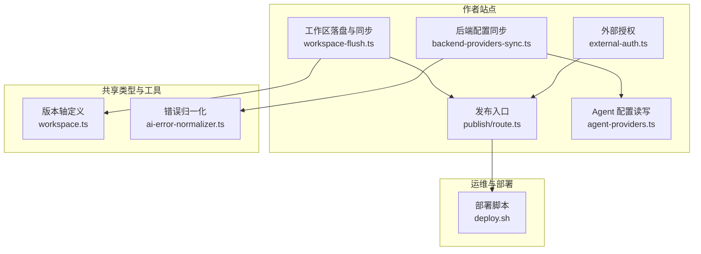
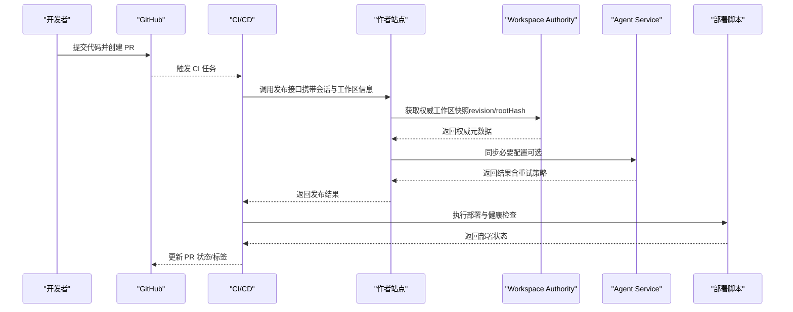
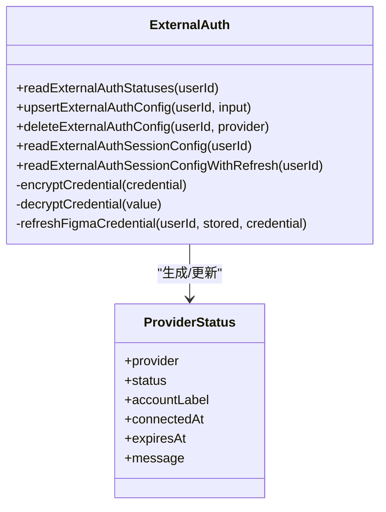
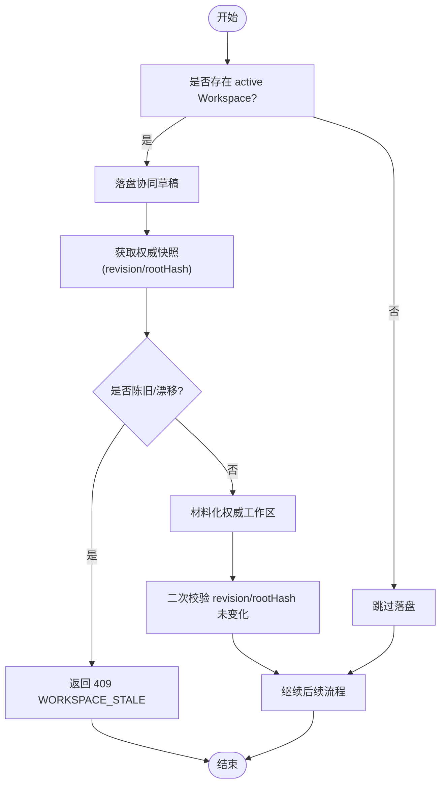
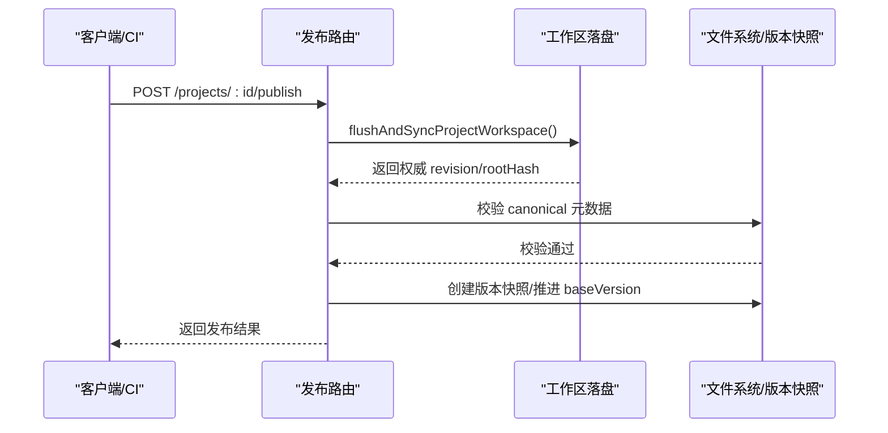
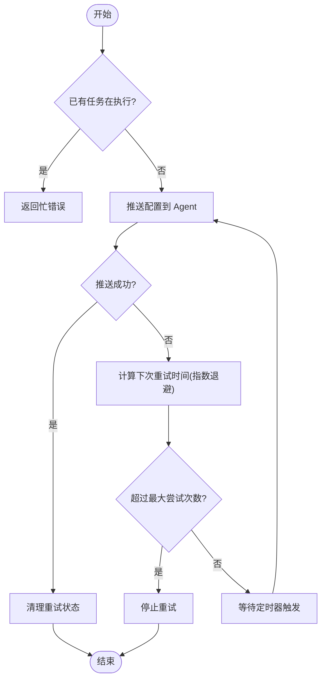
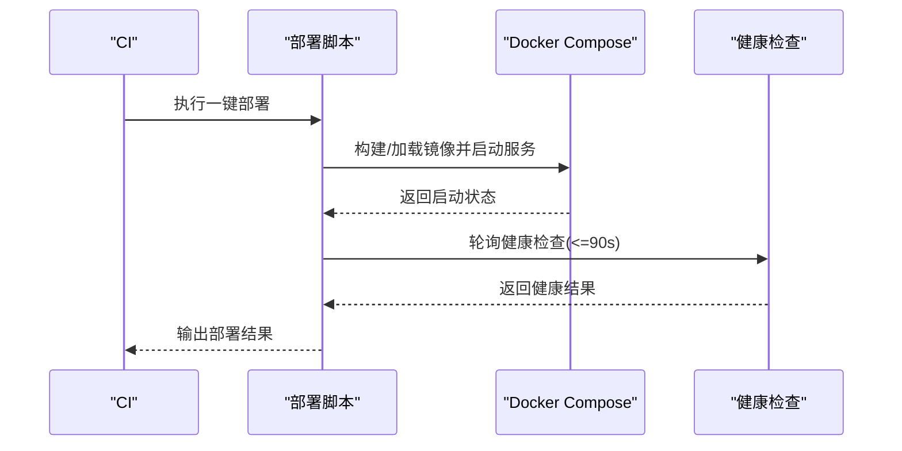
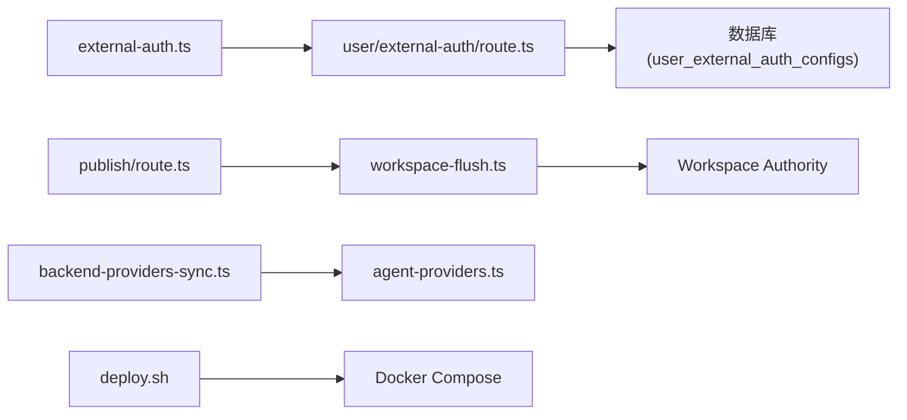

# GitHub 集成

<cite>
**本文引用的文件**   
- [external-auth.ts](file://packages/author-site/src/lib/external-auth.ts)
- [route.ts（外部授权状态）](file://packages/author-site/src/app/api/user/external-auth/route.ts)
- [workspace-flush.ts](file://packages/author-site/src/lib/workspace-flush.ts)
- [fs-utils.ts](file://packages/author-site/src/lib/fs-utils.ts)
- [publish/route.ts](file://packages/author-site/src/app/api/projects/[projectId]/publish/route.ts)
- [backend-providers-sync.ts](file://packages/author-site/src/lib/backend-providers-sync.ts)
- [agent-providers.ts](file://packages/author-site/src/lib/agent-providers.ts)
- [deploy.sh](file://scripts/deploy.sh)
- [03_项目工作区_v2.md](file://docs/项目文档/创作端/03-项目管理/技术/03_项目工作区_v2.md)
- [workspace.ts](file://packages/shared/src/workspace.ts)
- [error-utils.ts](file://packages/agent-service/src/utils/error-utils.ts)
- [ai-error-normalizer.ts](file://packages/shared/src/ai-error-normalizer.ts)
</cite>

## 目录
1. [简介](#简介)
2. [项目结构](#项目结构)
3. [核心组件](#核心组件)
4. [架构总览](#架构总览)
5. [详细组件分析](#详细组件分析)
6. [依赖关系分析](#依赖关系分析)
7. [性能与可靠性](#性能与可靠性)
8. [故障排查指南](#故障排查指南)
9. [结论](#结论)
10. [附录：集成示例与最佳实践](#附录集成示例与最佳实践)

## 简介
本指南面向需要在系统中对接 GitHub 的工程师，围绕仓库同步、分支与版本控制策略、PR 自动化流程、Webhook 事件处理、认证授权方案、实际集成示例以及错误处理与监控告警等主题，提供可落地的实现建议。需要特别说明的是：当前代码库未包含直接的 GitHub API 调用或 Webhook 接收器实现；但系统已具备完善的“外部服务认证”、“工作区同步与版本锚定”、“部署流水线”和“错误归一化/重试机制”等基础能力，可作为构建 GitHub 集成的坚实基础。

## 项目结构
与 GitHub 集成相关的现有能力主要分布在以下模块：
- 外部认证与令牌管理：用于安全存储第三方凭据（如 OAuth Token），并支持刷新与过期检测。
- 工作区同步与版本锚定：确保发布、快照等操作基于权威的工作区版本（canonical revision/rootHash）。
- 部署脚本与流水线：负责镜像构建、远程同步、健康检查与内部接口校验。
- 错误归一化与重试：对下游服务的失败进行统一分类与指数退避重试。

图表来源
- [external-auth.ts:1-362](file://packages/author-site/src/lib/external-auth.ts#L1-L362)
- [workspace-flush.ts:1-200](file://packages/author-site/src/lib/workspace-flush.ts#L1-L200)
- [publish/route.ts:1-54](file://packages/author-site/src/app/api/projects/[projectId]/publish/route.ts#L1-L54)
- [backend-providers-sync.ts:158-217](file://packages/author-site/src/lib/backend-providers-sync.ts#L158-L217)
- [agent-providers.ts:51-99](file://packages/author-site/src/lib/agent-providers.ts#L51-L99)
- [workspace.ts:506-525](file://packages/shared/src/workspace.ts#L506-L525)
- [ai-error-normalizer.ts:89-114](file://packages/shared/src/ai-error-normalizer.ts#L89-L114)
- [deploy.sh:1-200](file://scripts/deploy.sh#L1-L200)

章节来源
- [external-auth.ts:1-362](file://packages/author-site/src/lib/external-auth.ts#L1-L362)
- [workspace-flush.ts:1-200](file://packages/author-site/src/lib/workspace-flush.ts#L1-L200)
- [publish/route.ts:1-54](file://packages/author-site/src/app/api/projects/[projectId]/publish/route.ts#L1-L54)
- [backend-providers-sync.ts:158-217](file://packages/author-site/src/lib/backend-providers-sync.ts#L158-L217)
- [agent-providers.ts:51-99](file://packages/author-site/src/lib/agent-providers.ts#L51-L99)
- [workspace.ts:506-525](file://packages/shared/src/workspace.ts#L506-L525)
- [ai-error-normalizer.ts:89-114](file://packages/shared/src/ai-error-normalizer.ts#L89-L114)
- [deploy.sh:1-200](file://scripts/deploy.sh#L1-L200)

## 核心组件
- 外部认证与凭据加密：提供第三方凭据的加密存储、读取、会话注入与自动刷新（以 Figma 为例，GitHub 可复用相同模式）。
- 工作区同步与权威版本锚定：在关键动作前将工作区落盘，并确保 canonical revision/rootHash 一致，避免并发冲突与数据漂移。
- 发布流程前置校验：要求存在 canonical 元数据且指向 active Workspace，否则拒绝发布。
- 配置同步与重试：向 agent-service 推送配置，失败时按指数退避重试，成功则清理重试状态。
- 部署与健康检查：本地构建镜像、远端加载并启动服务，执行健康检查与内部接口验证。

章节来源
- [external-auth.ts:1-362](file://packages/author-site/src/lib/external-auth.ts#L1-L362)
- [workspace-flush.ts:1-200](file://packages/author-site/src/lib/workspace-flush.ts#L1-L200)
- [publish/route.ts:1-54](file://packages/author-site/src/app/api/projects/[projectId]/publish/route.ts#L1-L54)
- [backend-providers-sync.ts:158-217](file://packages/author-site/src/lib/backend-providers-sync.ts#L158-L217)
- [deploy.sh:1-200](file://scripts/deploy.sh#L1-L200)

## 架构总览
下图展示了从“外部认证”到“工作区同步”再到“发布与部署”的整体链路，可作为 GitHub 集成的参考骨架：GitHub 侧的 PR 合并后触发 CI，CI 通过内部 API 调用作者站点的发布入口，发布前完成工作区落盘与权威版本校验，随后进入制品打包与部署阶段。

图表来源
- [publish/route.ts:1-54](file://packages/author-site/src/app/api/projects/[projectId]/publish/route.ts#L1-L54)
- [workspace-flush.ts:114-184](file://packages/author-site/src/lib/workspace-flush.ts#L114-L184)
- [backend-providers-sync.ts:158-217](file://packages/author-site/src/lib/backend-providers-sync.ts#L158-L217)
- [deploy.sh:671-711](file://scripts/deploy.sh#L671-L711)

## 详细组件分析

### 外部认证与令牌管理（适配 GitHub OAuth）
- 功能要点
  - 凭据加密存储：使用 AES-256-GCM 对第三方凭据进行加密，持久化至数据库。
  - 会话注入：根据用户会话动态解密并注入有效凭据。
  - 自动刷新：当接近过期窗口时，调用提供方刷新接口更新令牌与过期时间。
  - 状态展示：对外暴露连接状态、账户标签、过期时间与提示信息。
- 适配建议
  - 新增 provider="github"，复用相同的加密/解密、存储与刷新逻辑。
  - 在刷新失败或无 refresh_token 时，标记为 needs_reauth 并提示重新授权。
  - 结合权限范围（scope）控制访问限制，最小权限原则。

图表来源
- [external-auth.ts:1-362](file://packages/author-site/src/lib/external-auth.ts#L1-L362)

章节来源
- [external-auth.ts:1-362](file://packages/author-site/src/lib/external-auth.ts#L1-L362)
- [route.ts（外部授权状态）:87-112](file://packages/author-site/src/app/api/user/external-auth/route.ts#L87-L112)

### 工作区同步与版本控制策略
- 权威版本锚定
  - 在关键操作前，通过 Workspace Authority 获取权威快照（revision/rootHash），并在后续材料化过程中保证不变。
  - 若检测到外部漂移或资源冲突，统一归一化为 WORKSPACE_STALE，并以 409 返回，提示客户端重试或拉取最新。
- 版本轴与基线
  - 项目基准版本、工作区修订号、权威同步修订号三者严格区分，禁止混用。
  - 仅当 active Workspace 绑定 canonical 元数据时，才允许推进 baseVersion 或创建版本快照。
- 冲突处理
  - 事务提交时比较 baseVersion 与项目当前版本，冲突则拒绝整体覆盖并要求重新基于最新版本开启事务。

图表来源
- [workspace-flush.ts:114-184](file://packages/author-site/src/lib/workspace-flush.ts#L114-L184)
- [03_项目工作区_v2.md:146-160](file://docs/项目文档/创作端/03-项目管理/技术/03_项目工作区_v2.md#L146-L160)
- [workspace.ts:506-525](file://packages/shared/src/workspace.ts#L506-L525)

章节来源
- [workspace-flush.ts:1-200](file://packages/author-site/src/lib/workspace-flush.ts#L1-200)
- [03_项目工作区_v2.md:146-160](file://docs/项目文档/创作端/03-项目管理/技术/03_项目工作区_v2.md#L146-L160)
- [workspace.ts:506-525](file://packages/shared/src/workspace.ts#L506-L525)

### 发布流程与合并策略
- 发布前置条件
  - 必须存在 canonicalSyncedRevision 与 canonicalSyncedRootHash，且指向当前 active Workspace。
  - 缺少权威元数据的旧时间戳同步状态不能作为发布输入。
- 版本创建与推进
  - 只有具备 canonical 元数据的 active Workspace 才允许随版本创建推进自身 baseVersion。
  - 导出包、CLI pull、保存模板均消费项目基准工作区，需满足上述约束。
- 冲突与回滚
  - 冲突时拒绝整体覆盖，要求重新基于最新项目工作区开启事务。
  - 发布回滚需存在上一版本，且更新 publishedVersion/publishedAt。

图表来源
- [publish/route.ts:1-54](file://packages/author-site/src/app/api/projects/[projectId]/publish/route.ts#L1-L54)
- [workspace-flush.ts:229-287](file://packages/author-site/src/lib/workspace-flush.ts#L229-L287)
- [fs-utils.ts:1473-1500](file://packages/author-site/src/lib/fs-utils.ts#L1473-L1500)
- [03_项目工作区_v2.md:146-160](file://docs/项目文档/创作端/03-项目管理/技术/03_项目工作区_v2.md#L146-L160)

章节来源
- [publish/route.ts:1-54](file://packages/author-site/src/app/api/projects/[projectId]/publish/route.ts#L1-L54)
- [workspace-flush.ts:229-287](file://packages/author-site/src/lib/workspace-flush.ts#L229-L287)
- [fs-utils.ts:1473-1500](file://packages/author-site/src/lib/fs-utils.ts#L1473-L1500)
- [03_项目工作区_v2.md:146-160](file://docs/项目文档/创作端/03-项目管理/技术/03_项目工作区_v2.md#L146-L160)

### 配置同步与重试机制（适用于 GitHub 配置下发）
- 行为特征
  - 首次推送失败时记录 nextRetryAt，并按指数退避自动重试。
  - 成功则清理重试状态；达到最大尝试次数不再重试。
  - 缺失配置时直接返回失败且不安排重试。
- 适用场景
  - 将 GitHub 仓库地址、分支策略、PR 模板、标签规则等配置推送到 Agent 服务，供后续流水线使用。

图表来源
- [backend-providers-sync.ts:158-217](file://packages/author-site/src/lib/backend-providers-sync.ts#L158-L217)

章节来源
- [backend-providers-sync.ts:158-217](file://packages/author-site/src/lib/backend-providers-sync.ts#L158-L217)
- [agent-providers.ts:51-99](file://packages/author-site/src/lib/agent-providers.ts#L51-L99)

### 部署与健康检查（CI/CD 集成点）
- 部署流程
  - 从 .env.docker 生成部署环境文件，校验 INTERNAL_API_TOKEN。
  - 本地构建镜像并上传，远端 docker load 并启动服务。
  - 健康检查等待最多 90 秒，超时则输出各容器健康详情并退出。
- 集成建议
  - 在 CI 中，将 GitHub 仓库的 commit/branch 作为构建信息注入。
  - 部署成功后，调用内部接口验证模型配置同步链路可用。

图表来源
- [deploy.sh:1-200](file://scripts/deploy.sh#L1-L200)
- [deploy.sh:671-711](file://scripts/deploy.sh#L671-L711)

章节来源
- [deploy.sh:1-200](file://scripts/deploy.sh#L1-L200)
- [deploy.sh:671-711](file://scripts/deploy.sh#L671-L711)

## 依赖关系分析
- 组件耦合
  - 外部认证模块被发布入口与外部授权状态接口使用，形成“凭据→会话→业务”的依赖链。
  - 工作区同步模块被发布入口与持久化接口调用，构成“落盘→权威校验→材料化”的关键路径。
  - 配置同步模块与 Agent 服务交互，失败重试独立于主流程，降低耦合度。
- 外部依赖
  - 数据库（SQLite）用于存储外部授权配置。
  - Agent 服务用于配置读取/写入与内部鉴权（INTERNAL_API_TOKEN）。
  - Docker 与 Compose 用于镜像构建与服务编排。

图表来源
- [external-auth.ts:1-362](file://packages/author-site/src/lib/external-auth.ts#L1-L362)
- [route.ts（外部授权状态）:87-112](file://packages/author-site/src/app/api/user/external-auth/route.ts#L87-L112)
- [publish/route.ts:1-54](file://packages/author-site/src/app/api/projects/[projectId]/publish/route.ts#L1-L54)
- [workspace-flush.ts:1-200](file://packages/author-site/src/lib/workspace-flush.ts#L1-L200)
- [backend-providers-sync.ts:158-217](file://packages/author-site/src/lib/backend-providers-sync.ts#L158-L217)
- [agent-providers.ts:51-99](file://packages/author-site/src/lib/agent-providers.ts#L51-L99)
- [deploy.sh:1-200](file://scripts/deploy.sh#L1-L200)

章节来源
- [external-auth.ts:1-362](file://packages/author-site/src/lib/external-auth.ts#L1-L362)
- [route.ts（外部授权状态）:87-112](file://packages/author-site/src/app/api/user/external-auth/route.ts#L87-L112)
- [publish/route.ts:1-54](file://packages/author-site/src/app/api/projects/[projectId]/publish/route.ts#L1-L54)
- [workspace-flush.ts:1-200](file://packages/author-site/src/lib/workspace-flush.ts#L1-L200)
- [backend-providers-sync.ts:158-217](file://packages/author-site/src/lib/backend-providers-sync.ts#L158-L217)
- [agent-providers.ts:51-99](file://packages/author-site/src/lib/agent-providers.ts#L51-L99)
- [deploy.sh:1-200](file://scripts/deploy.sh#L1-L200)

## 性能与可靠性
- 幂等与去重
  - 发布前强制权威版本校验，避免重复落盘与无效材料化。
- 重试与退避
  - 配置同步采用指数退避，避免雪崩；成功即清理重试状态。
- 健康检查与快速失败
  - 部署脚本内置健康检查与超时保护，失败立即输出诊断信息。
- 错误归一化
  - 将不同来源的错误码映射为标准错误类型，便于前端与监控统一处理。

[本节为通用指导，不直接分析具体文件]

## 故障排查指南
- 常见问题定位
  - 外部授权状态异常：检查数据库表 user_external_auth_configs 中的 provider、status、expiresAt 字段。
  - 工作区陈旧：关注 409 WORKSPACE_STALE，确认是否有外部修改或并发写入。
  - 发布失败：确认 canonicalSyncedRevision 与 canonicalSyncedRootHash 是否存在且匹配 active Workspace。
  - 配置同步失败：查看 nextRetryAt 与 attemptCount，确认是否达到最大重试次数。
  - 部署健康检查超时：检查容器日志与端口占用，确认镜像平台与依赖安装情况。
- 错误归一化参考
  - 认证类错误（401/403）、配额/限流（429/insufficient）、服务端错误（5xx）将被归类，便于告警与重试策略选择。

章节来源
- [external-auth.ts:1-362](file://packages/author-site/src/lib/external-auth.ts#L1-L362)
- [workspace-flush.ts:1-200](file://packages/author-site/src/lib/workspace-flush.ts#L1-200)
- [publish/route.ts:1-54](file://packages/author-site/src/app/api/projects/[projectId]/publish/route.ts#L1-L54)
- [backend-providers-sync.ts:158-217](file://packages/author-site/src/lib/backend-providers-sync.ts#L158-L217)
- [deploy.sh:671-711](file://scripts/deploy.sh#L671-L711)
- [ai-error-normalizer.ts:89-114](file://packages/shared/src/ai-error-normalizer.ts#L89-L114)
- [error-utils.ts:1-60](file://packages/agent-service/src/utils/error-utils.ts#L1-60)

## 结论
尽管当前仓库未直接实现 GitHub API 与 Webhook 处理器，但其外部认证、工作区权威版本锚定、配置同步与重试、部署与健康检查等能力，为构建稳定可靠的 GitHub 集成提供了坚实基础。建议在 CI 中引入“发布入口调用”，在应用层扩展“GitHub 外部认证 provider”，并通过统一的错误归一化与重试机制提升鲁棒性。

[本节为总结性内容，不直接分析具体文件]

## 附录：集成示例与最佳实践

- 仓库初始化
  - 在 CI 中，使用内部令牌调用作者站点发布接口，传入 sessionId 与 workspaceId，触发工作区落盘与权威版本校验。
  - 若返回 409，提示拉取最新工作区并重试。
- 自动部署
  - 发布成功后，由 CI 执行部署脚本，指定 DEPLOY_SERVICES 与构建模式，等待健康检查通过后完成上线。
- 通知系统
  - 在发布与部署各阶段，向团队通道发送状态消息（成功/失败/重试），附带 commit、branch、版本号与错误码。
- 认证授权方案
  - 新增 provider="github"，复用 external-auth.ts 的加密存储与刷新逻辑；在 scope 中仅申请必要权限。
- 错误处理与监控
  - 对 401/403/429/5xx 进行分类告警；对重试失败的配置同步设置高优先级告警。
  - 记录 nextRetryAt、attemptCount、lastFailureAt 等指标，便于追踪与复盘。

[本节为概念性指导，不直接分析具体文件]