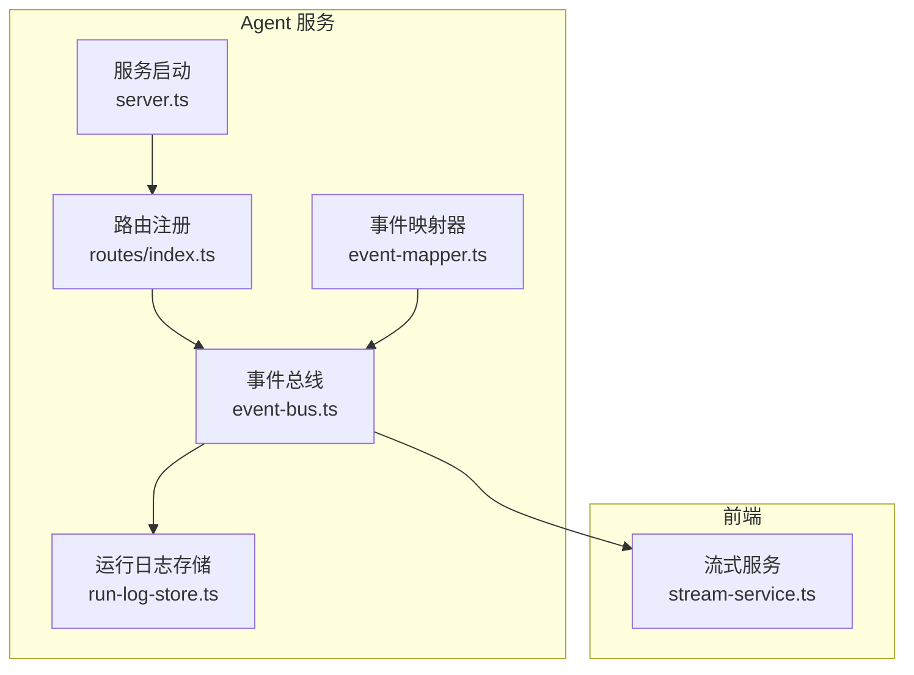
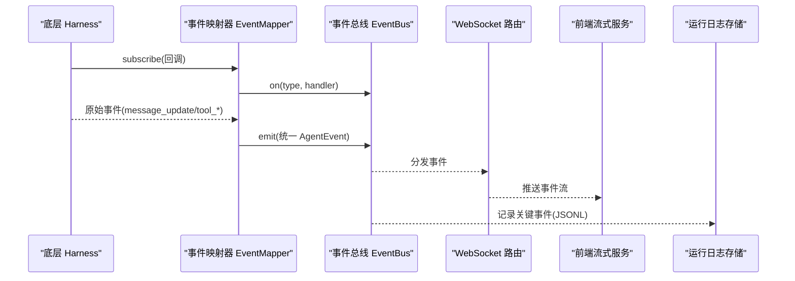
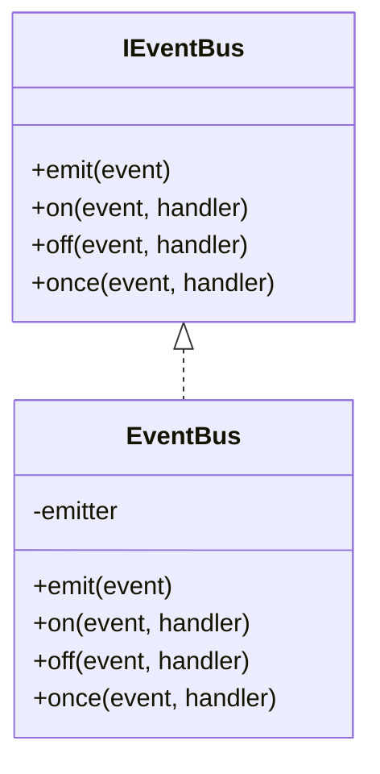
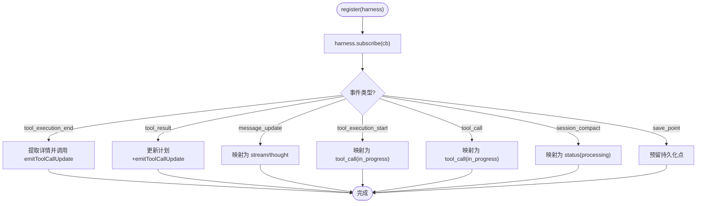
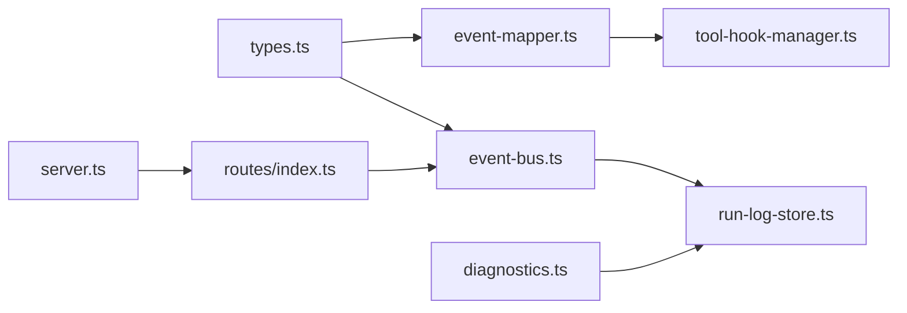

# Webhook 事件系统

<cite>
**本文引用的文件**   
- [packages/agent-service/src/events/event-bus.ts](file://packages/agent-service/src/events/event-bus.ts)
- [packages/agent-service/src/backends/managers/event-mapper.ts](file://packages/agent-service/src/backends/managers/event-mapper.ts)
- [packages/agent-service/src/core/types.ts](file://packages/agent-service/src/core/types.ts)
- [packages/agent-service/tests/unit/event-mapper.test.ts](file://packages/agent-service/tests/unit/event-mapper.test.ts)
- [packages/agent-service/src/routes/index.ts](file://packages/agent-service/src/routes/index.ts)
- [packages/agent-service/src/server.ts](file://packages/agent-service/src/server.ts)
- [packages/agent-service/src/session/run-log-store.ts](file://packages/agent-service/src/session/run-log-store.ts)
- [scripts/check-contracts.mjs](file://scripts/check-contracts.mjs)
- [packages/shared/src/diagnostics.ts](file://packages/shared/src/diagnostics.ts)
- [packages/author-site/src/components/ai-elements/chat/services/stream-service.ts](file://packages/author-site/src/components/ai-elements/chat/services/stream-service.ts)
</cite>

## 目录
1. [简介](#简介)
2. [项目结构](#项目结构)
3. [核心组件](#核心组件)
4. [架构总览](#架构总览)
5. [详细组件分析](#详细组件分析)
6. [依赖关系分析](#依赖关系分析)
7. [性能与可靠性](#性能与可靠性)
8. [Webhook 注册与管理指南](#webhook-注册与管理指南)
9. [事件驱动架构模式](#事件驱动架构模式)
10. [监控、调试与故障排查](#监控调试与故障排查)
11. [结论](#结论)
12. [附录：事件类型与载荷规范](#附录事件类型与载荷规范)

## 简介
本指南围绕仓库中已有的事件总线与事件映射能力，结合 WebSocket 流式通道与运行日志记录，形成一套可用于扩展为“Webhook 事件系统”的开发指南。重点覆盖：
- 事件总线架构（发布订阅）
- 事件定义与版本兼容策略
- Webhook 端点注册、签名校验与重试策略
- 异步处理、事务补偿与幂等性保证
- 实际事件处理示例（业务事件、系统事件、第三方回调）
- 监控、调试与故障排查

说明：当前代码库未提供现成的 Webhook 持久化队列与外部回调实现，本文在现有事件基础设施之上给出可落地的设计与集成建议，并标注哪些能力已具备、哪些需要新增。

## 项目结构
与事件系统相关的核心位置如下：
- 事件总线：进程内发布订阅抽象
- 事件映射器：将底层 AgentHarness 事件转换为应用层统一事件
- 事件类型契约：统一的 EventType 与事件载荷定义
- WebSocket 路由与服务启动：用于实时推送事件到客户端
- 运行日志存储：将关键事件写入 JSONL 便于审计与排障
- 前端流式服务：建立 WebSocket 连接并消费事件

图表来源
- [packages/agent-service/src/events/event-bus.ts:1-39](file://packages/agent-service/src/events/event-bus.ts#L1-L39)
- [packages/agent-service/src/backends/managers/event-mapper.ts:1-167](file://packages/agent-service/src/backends/managers/event-mapper.ts#L1-L167)
- [packages/agent-service/src/routes/index.ts:1-22](file://packages/agent-service/src/routes/index.ts#L1-L22)
- [packages/agent-service/src/server.ts:30-68](file://packages/agent-service/src/server.ts#L30-L68)
- [packages/agent-service/src/session/run-log-store.ts:183-237](file://packages/agent-service/src/session/run-log-store.ts#L183-L237)
- [packages/author-site/src/components/ai-elements/chat/services/stream-service.ts:177-228](file://packages/author-site/src/components/ai-elements/chat/services/stream-service.ts#L177-L228)

章节来源
- [packages/agent-service/src/events/event-bus.ts:1-39](file://packages/agent-service/src/events/event-bus.ts#L1-L39)
- [packages/agent-service/src/backends/managers/event-mapper.ts:1-167](file://packages/agent-service/src/backends/managers/event-mapper.ts#L1-L167)
- [packages/agent-service/src/routes/index.ts:1-22](file://packages/agent-service/src/routes/index.ts#L1-L22)
- [packages/agent-service/src/server.ts:30-68](file://packages/agent-service/src/server.ts#L30-L68)
- [packages/agent-service/src/session/run-log-store.ts:183-237](file://packages/agent-service/src/session/run-log-store.ts#L183-L237)
- [packages/author-site/src/components/ai-elements/chat/services/stream-service.ts:177-228](file://packages/author-site/src/components/ai-elements/chat/services/stream-service.ts#L177-L228)

## 核心组件
- 事件总线（EventBus）
  - 基于 Node.js EventEmitter 的轻量封装，提供 emit/on/off/once 方法，并通过全局单例 getEventBus() 暴露。
  - 适用于进程内解耦与多消费者监听。
- 事件映射器（EventMapper）
  - 订阅底层 harness.subscribe，将 message_update/tool_execution_start/end/tool_result/session_compact/save_point 等原始事件映射为统一的应用层 AgentEvent（如 stream/thought/tool_call/tool_call_update/finish/status）。
  - 委托 ToolHookManager 更新计划与文件变更摘要，确保工具结果中的文件变更被正确捕获。
- 事件类型契约（core/types.ts）
  - 集中定义所有 EventType 与对应事件载荷结构，作为前后端与子系统间的稳定契约。
- 运行日志存储（run-log-store.ts）
  - 对 tool_call/tool_call_update/permission_request 等关键事件进行结构化落盘，便于审计与回溯。
- 路由与服务启动（routes/index.ts, server.ts）
  - 注册 WebSocket 路由，启用 CORS、限流等中间件，为事件实时推送提供传输通道。
- 前端流式服务（stream-service.ts）
  - 建立 WebSocket 连接，等待 connected 状态后开始接收事件流。

章节来源
- [packages/agent-service/src/events/event-bus.ts:1-39](file://packages/agent-service/src/events/event-bus.ts#L1-L39)
- [packages/agent-service/src/backends/managers/event-mapper.ts:1-167](file://packages/agent-service/src/backends/managers/event-mapper.ts#L1-L167)
- [packages/agent-service/src/core/types.ts:167-325](file://packages/agent-service/src/core/types.ts#L167-L325)
- [packages/agent-service/src/session/run-log-store.ts:183-237](file://packages/agent-service/src/session/run-log-store.ts#L183-L237)
- [packages/agent-service/src/routes/index.ts:1-22](file://packages/agent-service/src/routes/index.ts#L1-L22)
- [packages/agent-service/src/server.ts:30-68](file://packages/agent-service/src/server.ts#L30-L68)
- [packages/author-site/src/components/ai-elements/chat/services/stream-service.ts:177-228](file://packages/author-site/src/components/ai-elements/chat/services/stream-service.ts#L177-L228)

## 架构总览
下图展示了从事件产生到多路分发的整体流程，包括进程内事件总线、WebSocket 推送以及运行日志落盘。

图表来源
- [packages/agent-service/src/backends/managers/event-mapper.ts:33-136](file://packages/agent-service/src/backends/managers/event-mapper.ts#L33-L136)
- [packages/agent-service/src/events/event-bus.ts:11-29](file://packages/agent-service/src/events/event-bus.ts#L11-L29)
- [packages/agent-service/src/session/run-log-store.ts:183-237](file://packages/agent-service/src/session/run-log-store.ts#L183-L237)
- [packages/author-site/src/components/ai-elements/chat/services/stream-service.ts:185-202](file://packages/author-site/src/components/ai-elements/chat/services/stream-service.ts#L185-L202)

## 详细组件分析

### 事件总线（EventBus）
- 职责
  - 提供进程内发布订阅能力，屏蔽 EventEmitter 细节。
  - 通过全局单例 getEventBus() 简化跨模块使用。
- 关键点
  - emit/on/off/once 与 Node.js EventEmitter 一一对应。
  - 适合短生命周期、同进程内的解耦通信；如需跨进程或持久化，需扩展为消息队列。

图表来源
- [packages/agent-service/src/events/event-bus.ts:4-29](file://packages/agent-service/src/events/event-bus.ts#L4-L29)

章节来源
- [packages/agent-service/src/events/event-bus.ts:1-39](file://packages/agent-service/src/events/event-bus.ts#L1-L39)

### 事件映射器（EventMapper）
- 职责
  - 订阅底层 harness.subscribe，将多种原始事件映射为统一 AgentEvent。
  - 将工具执行开始/结束/结果等事件转换为 tool_call/tool_call_update，并注入 sessionId、durationMs、error 等上下文。
  - 委托 ToolHookManager 更新计划与文件变更摘要，避免旧快照覆盖磁盘文件。
- 关键路径
  - register(harness): 返回取消订阅函数，支持安全注销。
  - setSessionId/setEventCallback: 动态更新会话上下文与回调目标。
  - emitToolCallUpdate: 统一构造 tool_call_update 事件，包含 content/result/details/error 等字段。

图表来源
- [packages/agent-service/src/backends/managers/event-mapper.ts:33-167](file://packages/agent-service/src/backends/managers/event-mapper.ts#L33-L167)

章节来源
- [packages/agent-service/src/backends/managers/event-mapper.ts:1-167](file://packages/agent-service/src/backends/managers/event-mapper.ts#L1-L167)
- [packages/agent-service/tests/unit/event-mapper.test.ts:1-44](file://packages/agent-service/tests/unit/event-mapper.test.ts#L1-L44)

### 事件类型契约（EventType 与载荷）
- 统一事件类型集合
  - stream、thought、tool_call、tool_call_update、plan、error、finish、status、permission_request、user_choice_request 等。
- 载荷结构
  - 每个事件类型均有明确的结构定义，包含 sessionId、错误码、重试标记、工具调用元数据等。
- 契约校验
  - 脚本 check-contracts.mjs 对事件 type 白名单与 error/permission_request/models 等子结构进行断言，保障前后端一致性。

章节来源
- [packages/agent-service/src/core/types.ts:167-325](file://packages/agent-service/src/core/types.ts#L167-L325)
- [scripts/check-contracts.mjs:66-106](file://scripts/check-contracts.mjs#L66-L106)

### WebSocket 与实时推送
- 服务端
  - server.ts 初始化 Fastify、CORS、限流与 websocket 插件，并注册路由。
  - routes/index.ts 聚合各模块路由，包含 WebSocket 路由。
- 客户端
  - author-site 的 stream-service.ts 负责建立连接、等待 connected 状态并开始消费事件。

章节来源
- [packages/agent-service/src/server.ts:30-68](file://packages/agent-service/src/server.ts#L30-L68)
- [packages/agent-service/src/routes/index.ts:1-22](file://packages/agent-service/src/routes/index.ts#L1-L22)
- [packages/author-site/src/components/ai-elements/chat/services/stream-service.ts:177-228](file://packages/author-site/src/components/ai-elements/chat/services/stream-service.ts#L177-L228)

## 依赖关系分析
- 耦合与内聚
  - EventBus 低耦合，仅依赖 EventEmitter 与类型定义。
  - EventMapper 与 ToolHookManager 协作紧密，负责工具结果与文件变更的一致性。
- 外部依赖
  - Fastify、websocket 插件用于 HTTP/WebSocket 服务。
  - 诊断与日志：run-log-store.ts 将事件写入 JSONL；diagnostics.ts 提供敏感信息脱敏与键白名单。

图表来源
- [packages/agent-service/src/core/types.ts:167-325](file://packages/agent-service/src/core/types.ts#L167-L325)
- [packages/agent-service/src/events/event-bus.ts:1-39](file://packages/agent-service/src/events/event-bus.ts#L1-L39)
- [packages/agent-service/src/backends/managers/event-mapper.ts:1-167](file://packages/agent-service/src/backends/managers/event-mapper.ts#L1-L167)
- [packages/agent-service/src/server.ts:30-68](file://packages/agent-service/src/server.ts#L30-L68)
- [packages/agent-service/src/routes/index.ts:1-22](file://packages/agent-service/src/routes/index.ts#L1-L22)
- [packages/agent-service/src/session/run-log-store.ts:183-237](file://packages/agent-service/src/session/run-log-store.ts#L183-L237)
- [packages/shared/src/diagnostics.ts:94-170](file://packages/shared/src/diagnostics.ts#L94-L170)

章节来源
- [packages/agent-service/src/core/types.ts:167-325](file://packages/agent-service/src/core/types.ts#L167-L325)
- [packages/agent-service/src/events/event-bus.ts:1-39](file://packages/agent-service/src/events/event-bus.ts#L1-L39)
- [packages/agent-service/src/backends/managers/event-mapper.ts:1-167](file://packages/agent-service/src/backends/managers/event-mapper.ts#L1-L167)
- [packages/agent-service/src/server.ts:30-68](file://packages/agent-service/src/server.ts#L30-L68)
- [packages/agent-service/src/routes/index.ts:1-22](file://packages/agent-service/src/routes/index.ts#L1-L22)
- [packages/agent-service/src/session/run-log-store.ts:183-237](file://packages/agent-service/src/session/run-log-store.ts#L183-L237)
- [packages/shared/src/diagnostics.ts:94-170](file://packages/shared/src/diagnostics.ts#L94-L170)

## 性能与可靠性
- 进程内事件总线
  - 优点：零拷贝、极低延迟；缺点：无法跨进程/节点共享。
- 可扩展方向
  - 引入消息队列（如 Redis Streams/Kafka/RabbitMQ）以支撑分布式事件处理与持久化。
  - 增加背压与限流：在 EventBus 上层包装节流/批处理逻辑，避免下游过载。
- 超时与忙态
  - 已有测试覆盖显式超时与 AGENT_BUSY 场景，提示客户端重试或等待。

章节来源
- [packages/agent-service/tests/unit/websocket-timeout.test.ts:1-53](file://packages/agent-service/tests/unit/websocket-timeout.test.ts#L1-L53)

## Webhook 注册与管理指南
说明：当前仓库未提供现成的 Webhook 持久化与外部回调实现。以下是在现有事件基础设施上的落地方案建议。

- 端点配置
  - 新增内部 API 用于注册/更新/删除 Webhook 订阅（URL、事件类型白名单、签名密钥等）。
  - 将订阅信息持久化至数据库或 KV 存储，并提供查询接口。
- 事件分发
  - 在 EventBus 的分发链路中增加“Webhook 投递器”，按订阅匹配事件类型并异步发送 HTTP 请求。
  - 使用独立工作线程或任务队列执行网络 IO，避免阻塞主事件循环。
- 签名验证
  - 生产者侧：对每条事件生成 HMAC 签名（时间戳+nonce+payload），放入请求头。
  - 消费者侧：使用共享密钥验证签名，拒绝过期或重放请求。
- 重试策略
  - 指数退避 + 抖动，最大重试次数与死信队列兜底。
  - 区分可重试与不可重试错误（参考 ErrorCode 与 retryable 标记）。
- 幂等性
  - 要求 Webhook 提供方返回唯一 ID（如 messageId），服务端去重投递。
  - 消费者侧基于 idempotency-key 保证重复投递不造成副作用。

[本节为设计建议，不直接分析具体源码文件]

## 事件驱动架构模式
- 异步处理
  - 使用 EventBus 将耗时操作（如文件写入、外部调用）异步化，提升吞吐。
- 事务补偿
  - 对于跨系统操作，采用 Saga/补偿事件模式：成功事件触发后续步骤，失败事件触发补偿。
- 幂等性保证
  - 所有对外回调携带幂等键；消费者侧基于幂等键去重。
- 事件溯源与审计
  - 借助 run-log-store.ts 的 JSONL 记录，构建事件回放与审计能力。

[本节为概念性内容，不直接分析具体源码文件]

## 监控、调试与故障排查
- 运行日志
  - tool_call/tool_call_update/permission_request 等关键事件会被记录到 JSONL，便于定位问题。
- 诊断脱敏
  - diagnostics.ts 提供键白名单与敏感值脱敏，避免泄露隐私。
- 常见问题
  - 连接超时：检查 WebSocket 握手与 CORS 配置。
  - 事件丢失：确认 EventBus 订阅是否被提前移除；检查 Webhook 投递器的重试与死信队列。
  - 签名失败：核对时间戳窗口、nonce 与密钥一致性。

章节来源
- [packages/agent-service/src/session/run-log-store.ts:183-237](file://packages/agent-service/src/session/run-log-store.ts#L183-L237)
- [packages/shared/src/diagnostics.ts:418-459](file://packages/shared/src/diagnostics.ts#L418-L459)

## 结论
本项目已具备稳定的进程内事件总线与统一事件契约，配合 WebSocket 实时推送与 JSONL 运行日志，形成了良好的事件驱动基础。若需演进为完整的 Webhook 事件系统，可在现有 EventBus 之上扩展持久化订阅、消息队列、签名校验与重试机制，并结合幂等性与补偿事件模式，构建高可靠的外部事件分发体系。

[本节为总结性内容，不直接分析具体源码文件]

## 附录：事件类型与载荷规范
- 事件类型白名单
  - stream、thought、tool_call、tool_call_update、plan、error、finish、status、permission_request、user_choice_request 等。
- 通用字段
  - sessionId：会话标识
  - type：事件类型
  - error.code/message/retryable：错误码、消息与是否可重试
- 工具调用相关
  - tool_call：包含 toolCallId、title、kind、parameters
  - tool_call_update：包含 toolCallId、status、content、result、details、durationMs、error
- 权限与用户选择
  - permission_request：包含 permissionRequest.toolCall 与 options
  - user_choice_request：包含 question/options/allowCustom

章节来源
- [packages/agent-service/src/core/types.ts:167-325](file://packages/agent-service/src/core/types.ts#L167-L325)
- [scripts/check-contracts.mjs:66-106](file://scripts/check-contracts.mjs#L66-L106)