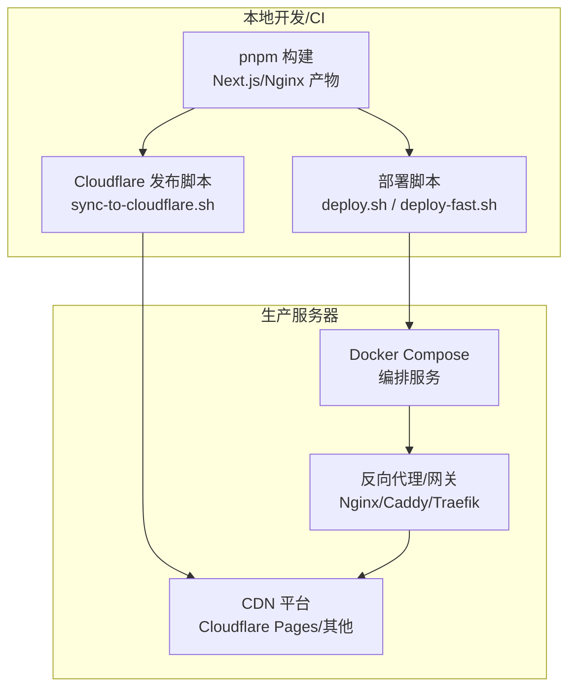
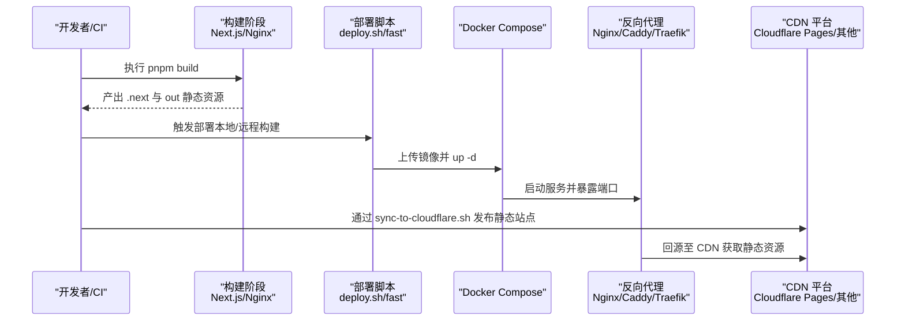
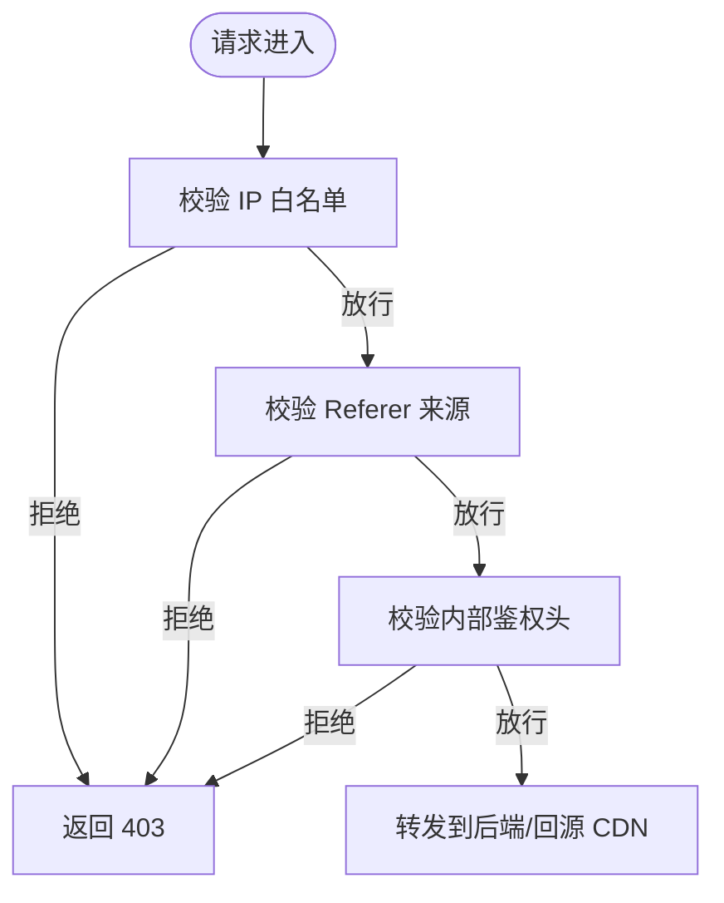
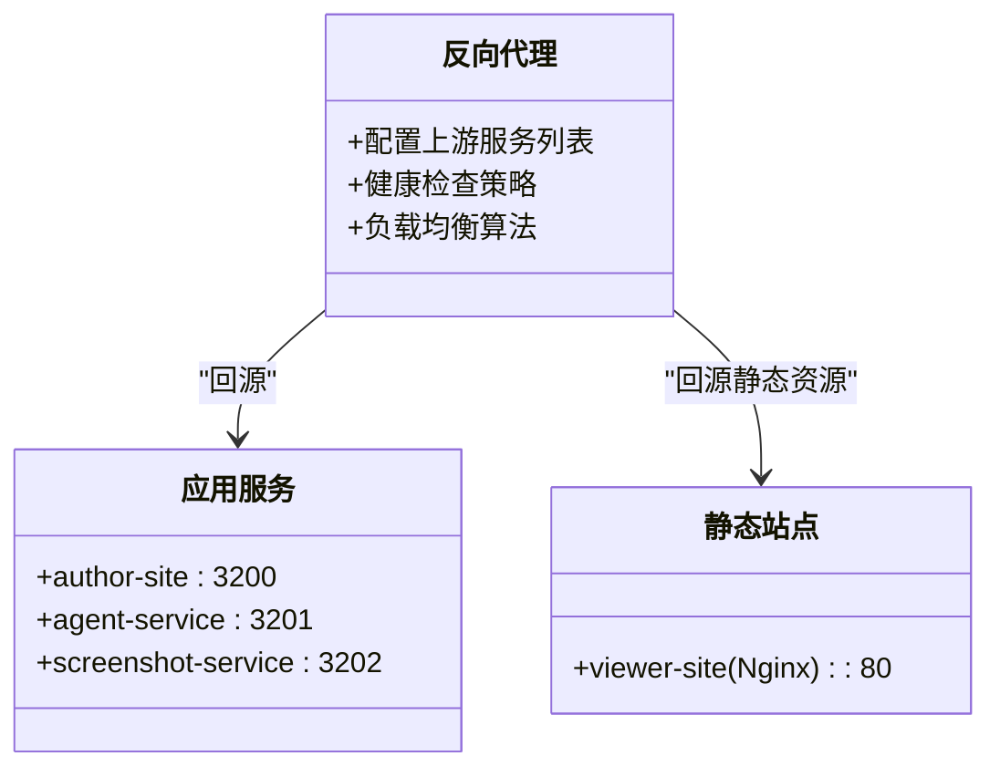
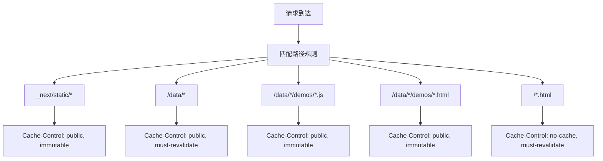
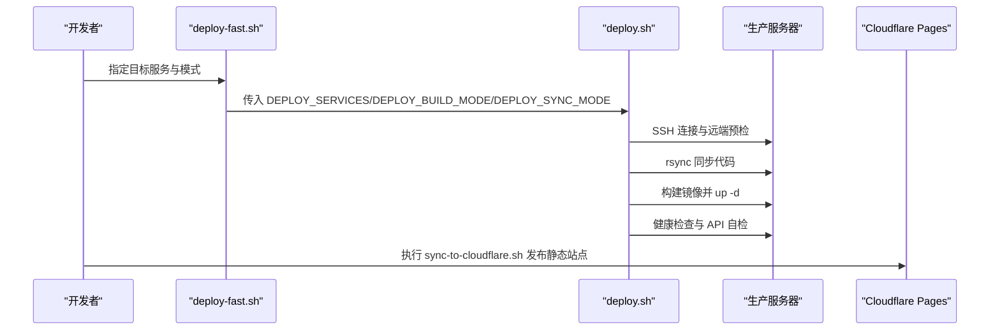
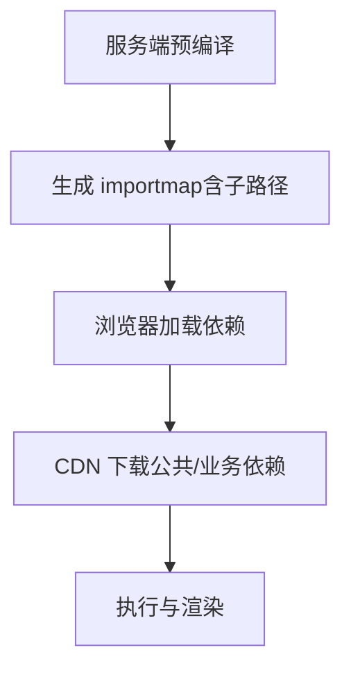
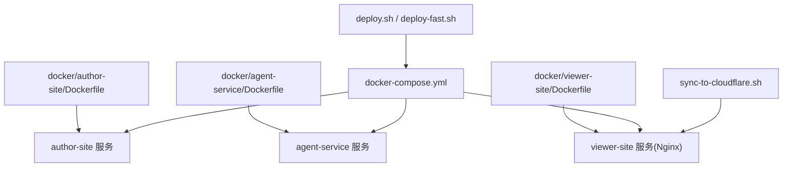

# CDN 配置管理

<cite>
**本文引用的文件**   
- [docker-compose.yml](file://docker-compose.yml)
- [deploy.sh](file://scripts/deploy.sh)
- [deploy-fast.sh](file://scripts/deploy-fast.sh)
- [sync-to-cloudflare.sh](file://scripts/sync-to-cloudflare.sh)
- [03_Docker部署方案.md](file://docs/项目文档/创作端/06-基础设施/技术/03_Docker部署方案.md)
- [01_部署与CORS配置.md](file://docs/项目文档/使用端/03-部署与嵌入/技术/01_部署与CORS配置.md)
- [iframe沙箱与动态CDN编译策略.md](file://docs/复盘文档/预览引擎/iframe沙箱与动态CDN编译策略.md)
- [Dockerfile (author-site)](file://docker/author-site/Dockerfile)
- [Dockerfile (viewer-site)](file://docker/viewer-site/Dockerfile)
- [Dockerfile (agent-service)](file://docker/agent-service/Dockerfile)
</cite>

## 目录
1. [引言](#引言)
2. [项目结构](#项目结构)
3. [核心组件](#核心组件)
4. [架构总览](#架构总览)
5. [详细组件分析](#详细组件分析)
6. [依赖关系分析](#依赖关系分析)
7. [性能优化建议](#性能优化建议)
8. [故障排查指南](#故障排查指南)
9. [结论](#结论)
10. [附录](#附录)

## 引言
本技术文档围绕 CDN 配置管理，聚焦以下目标：
- 域名绑定与 SSL 证书配置（多环境域名、自动续期）
- 访问权限控制（IP 白名单、Referer 防盗链、自定义鉴权头）
- 回源服务器配置（源站地址、负载均衡、健康检查）
- 缓存规则配置（路径匹配、过期时间、优先级）
- 部署脚本集成（环境变量、自动化流程）
- 性能优化（HTTP/2、Gzip、带宽限制）

说明：仓库未包含直接面向云厂商 CDN 的 SDK 或控制台集成代码。本文基于现有部署脚本、容器编排与静态站点构建产物，给出在反向代理层（如 Nginx/Caddy/Traefik）或 Cloudflare Pages 等平台上实现上述能力的落地方案，并给出与仓库中脚本和配置的衔接点。

## 项目结构
与 CDN 相关的关键位置：
- 容器编排与环境变量：docker-compose.yml
- 部署与镜像构建：scripts/deploy.sh、scripts/deploy-fast.sh
- 静态站点构建与发布：docker/viewer-site/Dockerfile、scripts/sync-to-cloudflare.sh
- 运行期 CORS 与安全：docs/项目文档/创作端/06-基础设施/技术/03_Docker部署方案.md、docs/项目文档/使用端/03-部署与嵌入/技术/01_部署与CORS配置.md
- 预览资源与 CDN 下载策略：docs/复盘文档/预览引擎/iframe沙箱与动态CDN编译策略.md

图表来源
- [docker-compose.yml:1-140](file://docker-compose.yml#L1-L140)
- [deploy.sh:1-800](file://scripts/deploy.sh#L1-L800)
- [deploy-fast.sh:1-140](file://scripts/deploy-fast.sh#L1-L140)
- [sync-to-cloudflare.sh:1-59](file://scripts/sync-to-cloudflare.sh#L1-L59)

章节来源
- [docker-compose.yml:1-140](file://docker-compose.yml#L1-L140)
- [deploy.sh:1-800](file://scripts/deploy.sh#L1-L800)
- [deploy-fast.sh:1-140](file://scripts/deploy-fast.sh#L1-L140)
- [sync-to-cloudflare.sh:1-59](file://scripts/sync-to-cloudflare.sh#L1-L59)

## 核心组件
- 容器编排与环境变量
  - 通过 docker-compose.yml 暴露端口、注入环境变量、定义健康检查与资源限制，为后续接入反向代理与 CDN 提供基础。
- 部署流水线
  - deploy.sh 负责远端同步、镜像构建（本地或远程）、加载镜像、重启服务与自检；deploy-fast.sh 作为快捷入口封装常用参数。
- 静态站点与 CDN 发布
  - viewer-site 使用 Nginx 容器承载静态产物；sync-to-cloudflare.sh 将构建产物与数据目录打包后通过 wrangler 发布到 Cloudflare Pages。
- 运行期安全与跨域
  - 文档明确 NEXT_PUBLIC_* 与 CORS_ORIGINS 的配置要点，以及 USE_SECURE_COOKIE 与 HTTPS 的关系。
- 预览资源与 CDN 下载
  - 复盘文档描述了服务端预编译 + 浏览器直下 CDN 资源的策略，以及 importmap 映射与缓存策略。

章节来源
- [docker-compose.yml:1-140](file://docker-compose.yml#L1-L140)
- [deploy.sh:1-800](file://scripts/deploy.sh#L1-L800)
- [deploy-fast.sh:1-140](file://scripts/deploy-fast.sh#L1-L140)
- [sync-to-cloudflare.sh:1-59](file://scripts/sync-to-cloudflare.sh#L1-L59)
- [03_Docker部署方案.md:171-180](file://docs/项目文档/创作端/06-基础设施/技术/03_Docker部署方案.md#L171-L180)
- [01_部署与CORS配置.md:25-45](file://docs/项目文档/使用端/03-部署与嵌入/技术/01_部署与CORS配置.md#L25-L45)
- [iframe沙箱与动态CDN编译策略.md:86-170](file://docs/复盘文档/预览引擎/iframe沙箱与动态CDN编译策略.md#L86-L170)

## 架构总览
下图展示从构建到 CDN 分发的整体链路，以及反向代理在其中的角色。

图表来源
- [docker-compose.yml:1-140](file://docker-compose.yml#L1-L140)
- [deploy.sh:1-800](file://scripts/deploy.sh#L1-L800)
- [deploy-fast.sh:1-140](file://scripts/deploy-fast.sh#L1-L140)
- [sync-to-cloudflare.sh:1-59](file://scripts/sync-to-cloudflare.sh#L1-L59)

## 详细组件分析

### 域名绑定与 SSL 证书配置（多环境与自动续期）
- 多环境域名
  - 通过反向代理根据 Host 路由到不同后端服务或同一服务的不同实例，结合 docker-compose 的环境变量区分不同环境的 NEXT_PUBLIC_* 与 API 地址。
  - 参考文档对 NEXT_PUBLIC_* 必须使用真实可访问地址的要求，确保浏览器侧能正确解析。
- SSL 证书
  - 推荐在反向代理层统一终止 TLS，并使用自动续期工具（如 certbot/caddy）管理证书。
  - 若采用 Cloudflare Pages，启用托管证书与强制 HTTPS。
- 自动续期
  - 在反向代理侧配置证书自动续期任务；或在 Cloudflare 控制台开启“Always Use HTTPS”与“Automatic HTTPS Rewrites”。

章节来源
- [03_Docker部署方案.md:171-180](file://docs/项目文档/创作端/06-基础设施/技术/03_Docker部署方案.md#L171-L180)
- [docker-compose.yml:1-140](file://docker-compose.yml#L1-L140)

### 访问权限控制（IP 白名单、Referer 防盗链、自定义鉴权头）
- IP 白名单
  - 在反向代理层按客户端 IP 段放行或拒绝，仅允许内网或特定公网段访问敏感接口。
- Referer 防盗链
  - 在反向代理层校验请求头 Referer，阻止非预期来源直接访问静态资源。
- 自定义鉴权头
  - 通过内部令牌头进行服务间鉴权，避免外部直接调用。部署脚本已对内部接口进行鉴权验证。

图表来源
- [deploy.sh:744-763](file://scripts/deploy.sh#L744-L763)

章节来源
- [deploy.sh:744-763](file://scripts/deploy.sh#L744-L763)

### 回源服务器配置（源站地址、负载均衡、健康检查）
- 源站地址
  - 反向代理将 CDN 回源指向应用服务（如 author-site、agent-service），或通过 viewer-site 的 Nginx 提供静态资源。
- 负载均衡
  - 在反向代理层配置多后端节点，按权重或轮询分发流量。
- 健康检查
  - 容器编排中已定义健康检查端点；部署脚本在启动后进行健康检查与 API 可用性验证。

图表来源
- [docker-compose.yml:1-140](file://docker-compose.yml#L1-L140)
- [deploy.sh:593-794](file://scripts/deploy.sh#L593-L794)

章节来源
- [docker-compose.yml:1-140](file://docker-compose.yml#L1-L140)
- [deploy.sh:593-794](file://scripts/deploy.sh#L593-L794)

### 缓存规则配置（路径匹配、过期时间、优先级）
- 路径匹配
  - 针对静态资源（如 _next/static、data/*、demos/*.js/html）设置不同的 Cache-Control。
- 过期时间
  - 对不可变资源设置 immutable，对 HTML 页面设置 no-cache/must-revalidate。
- 优先级
  - 更具体的路径规则优先于通用规则，确保关键资源命中最优缓存策略。

图表来源
- [sync-to-cloudflare.sh:30-48](file://scripts/sync-to-cloudflare.sh#L30-L48)

章节来源
- [sync-to-cloudflare.sh:30-48](file://scripts/sync-to-cloudflare.sh#L30-L48)

### 部署脚本集成（环境变量、自动化流程）
- 环境变量
  - 通过 .env.docker 生成 .deploy.env，并在部署时注入到容器；关键变量包括 INTERNAL_API_TOKEN、USE_SECURE_COOKIE、NEXT_PUBLIC_*、CORS_ORIGINS 等。
- 自动化流程
  - deploy.sh 完成 SSH 连接、远端预检、rsync 同步、镜像构建（本地/远程）、镜像加载与服务重启、健康检查与 API 自检。
  - deploy-fast.sh 提供快捷参数与默认行为（targeted sync、local build）。
  - sync-to-cloudflare.sh 将 viewer-site 构建产物与 data/published 合并后发布到 Cloudflare Pages。

图表来源
- [deploy-fast.sh:1-140](file://scripts/deploy-fast.sh#L1-L140)
- [deploy.sh:1-800](file://scripts/deploy.sh#L1-L800)
- [sync-to-cloudflare.sh:1-59](file://scripts/sync-to-cloudflare.sh#L1-L59)

章节来源
- [deploy-fast.sh:1-140](file://scripts/deploy-fast.sh#L1-L140)
- [deploy.sh:1-800](file://scripts/deploy.sh#L1-L800)
- [sync-to-cloudflare.sh:1-59](file://scripts/sync-to-cloudflare.sh#L1-L59)

### 预览资源与 CDN 下载策略（importmap 与缓存）
- 服务端预编译 + 浏览器直下 CDN 资源，减少首次冷启动耗时。
- importmap 需支持子路径精确映射，避免深路径导入失败。
- 列表页缩略图在保存时生成，降低实时渲染压力。

图表来源
- [iframe沙箱与动态CDN编译策略.md:86-170](file://docs/复盘文档/预览引擎/iframe沙箱与动态CDN编译策略.md#L86-L170)

章节来源
- [iframe沙箱与动态CDN编译策略.md:86-170](file://docs/复盘文档/预览引擎/iframe沙箱与动态CDN编译策略.md#L86-L170)

## 依赖关系分析
- 容器镜像与构建
  - author-site、agent-service、viewer-site 各自拥有独立 Dockerfile，分别负责 Next.js 应用与 Nginx 静态站点构建。
- 运行时依赖
  - 服务间通过环境变量与网络名互相访问（如 AGENT_SERVICE_URL、SCREENSHOT_SERVICE_URL）。
- 部署与发布
  - deploy.sh 与 deploy-fast.sh 共同构成部署主流程；sync-to-cloudflare.sh 负责静态站点发布。

图表来源
- [docker/author-site/Dockerfile:1-94](file://docker/author-site/Dockerfile#L1-L94)
- [docker/agent-service/Dockerfile:1-43](file://docker/agent-service/Dockerfile#L1-L43)
- [docker/viewer-site/Dockerfile:1-46](file://docker/viewer-site/Dockerfile#L1-L46)
- [docker-compose.yml:1-140](file://docker-compose.yml#L1-L140)
- [deploy.sh:1-800](file://scripts/deploy.sh#L1-L800)
- [deploy-fast.sh:1-140](file://scripts/deploy-fast.sh#L1-L140)
- [sync-to-cloudflare.sh:1-59](file://scripts/sync-to-cloudflare.sh#L1-L59)

章节来源
- [docker/author-site/Dockerfile:1-94](file://docker/author-site/Dockerfile#L1-L94)
- [docker/agent-service/Dockerfile:1-43](file://docker/agent-service/Dockerfile#L1-L43)
- [docker/viewer-site/Dockerfile:1-46](file://docker/viewer-site/Dockerfile#L1-L46)
- [docker-compose.yml:1-140](file://docker-compose.yml#L1-L140)
- [deploy.sh:1-800](file://scripts/deploy.sh#L1-L800)
- [deploy-fast.sh:1-140](file://scripts/deploy-fast.sh#L1-L140)
- [sync-to-cloudflare.sh:1-59](file://scripts/sync-to-cloudflare.sh#L1-L59)

## 性能优化建议
- HTTP/2
  - 在反向代理层启用 HTTP/2，提升多路复用能力与头部压缩效果。
- Gzip/Brotli 压缩
  - 在反向代理层启用文本类资源压缩，减小传输体积。
- 带宽限制
  - 在反向代理层对异常流量或特定路径实施速率限制，保护后端与 CDN 回源。
- 缓存预热与版本化
  - 对静态资源使用内容哈希文件名，配合 immutable 缓存策略；对 HTML 页面保持短缓存或无缓存以保障更新及时。
- 预览资源优化
  - 遵循复盘文档的策略：服务端预编译、importmap 子路径映射、列表页缩略图按需生成。

[本节为通用指导，不直接分析具体文件]

## 故障排查指南
- 健康检查与 API 自检
  - 部署脚本在服务启动后执行健康检查与 API 可用性验证，若失败会输出日志并中止流程。
- 常见错误定位
  - 检查容器状态与健康检查结果；查看对应服务的日志输出；确认 INTERNAL_API_TOKEN 是否一致且非空。
- 反向代理与 CDN
  - 确认域名与证书配置是否正确；检查 CDN 缓存命中与回源状态；核对静态资源路径与缓存规则。

章节来源
- [deploy.sh:593-794](file://scripts/deploy.sh#L593-L794)

## 结论
通过将容器编排、部署脚本与反向代理/CDN 平台协同，可实现完整的 CDN 配置管理能力：多环境域名与证书自动续期、细粒度访问控制、稳定的回源与负载均衡、精细的缓存策略，以及高效的部署流水线。结合预览资源的 CDN 下载策略与缓存优化，可显著提升首屏加载与交互响应性能。

[本节为总结性内容，不直接分析具体文件]

## 附录
- 关键环境变量清单（示例）
  - NEXT_PUBLIC_AGENT_SERVICE_URL、NEXT_PUBLIC_SCREENSHOT_SERVICE_URL、CORS_ORIGINS、USE_SECURE_COOKIE、INTERNAL_API_TOKEN、NEXT_PUBLIC_DATA_BASE 等。
- 健康检查端点
  - author-site 根路径、agent-service /health、screenshot-service /health。
- 静态资源缓存规则
  - _next/static/*、/data/*、/data/*/demos/*.js/.html、/*.html 的 Cache-Control 策略。

章节来源
- [docker-compose.yml:1-140](file://docker-compose.yml#L1-L140)
- [sync-to-cloudflare.sh:30-48](file://scripts/sync-to-cloudflare.sh#L30-L48)
- [deploy.sh:593-794](file://scripts/deploy.sh#L593-L794)