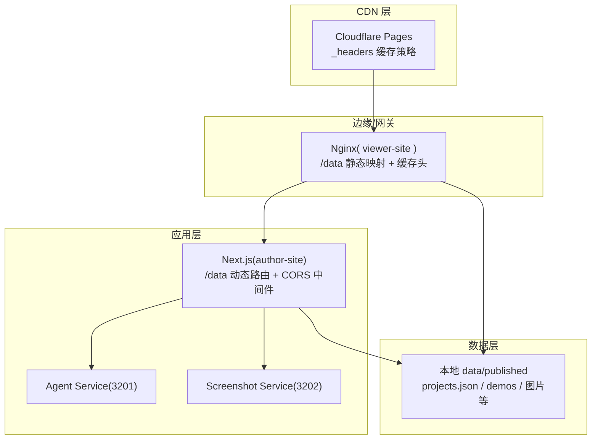
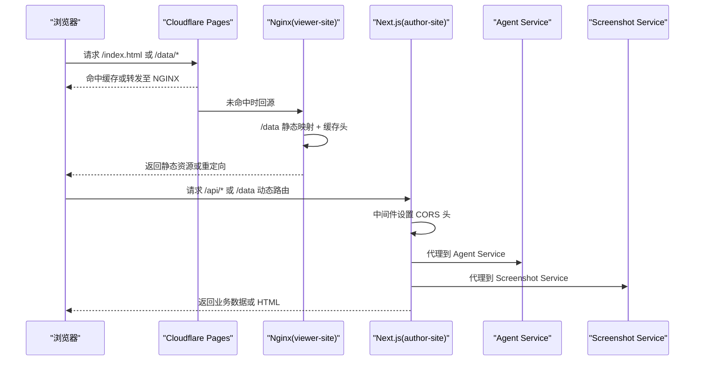
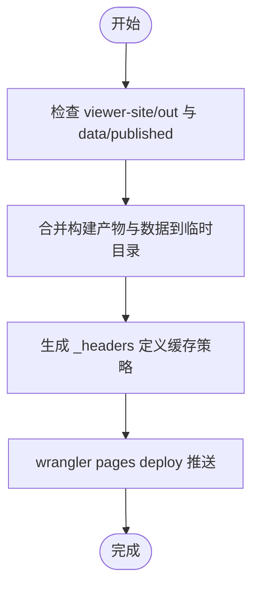
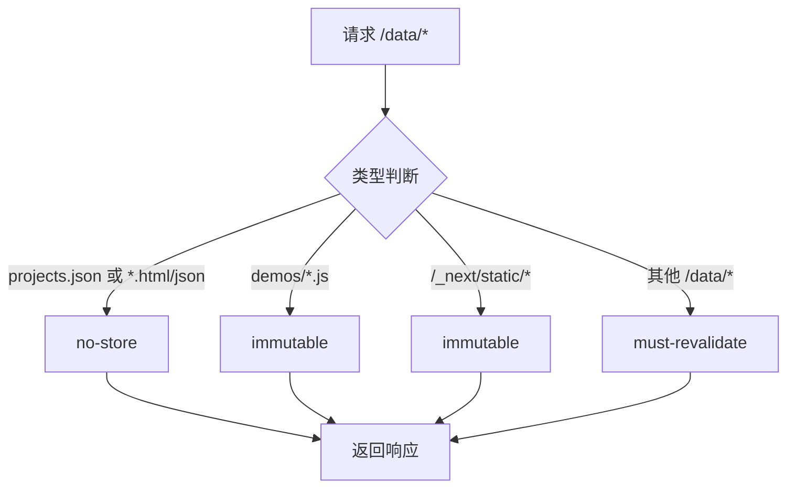
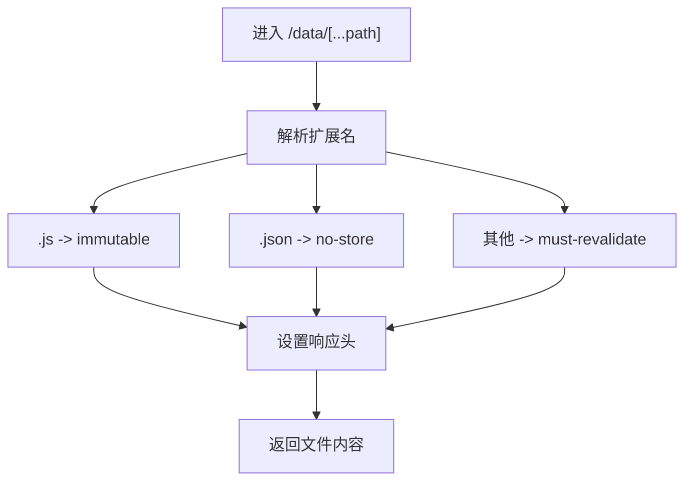
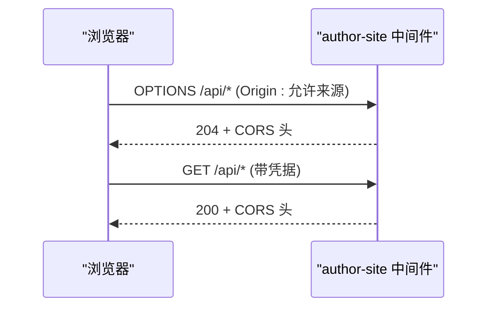
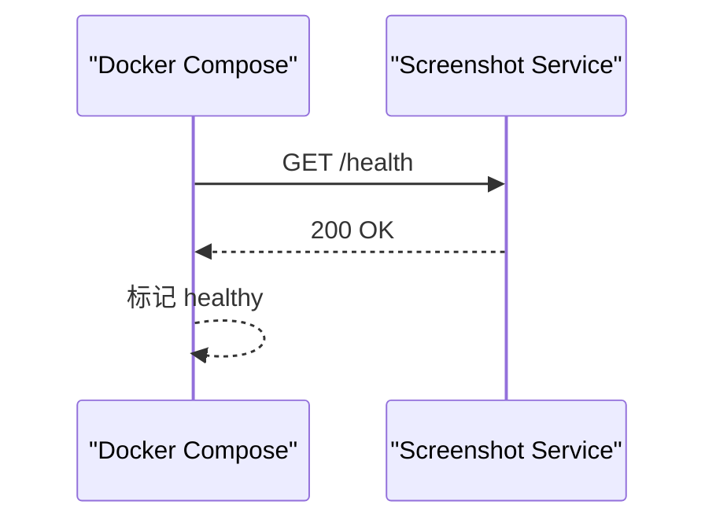
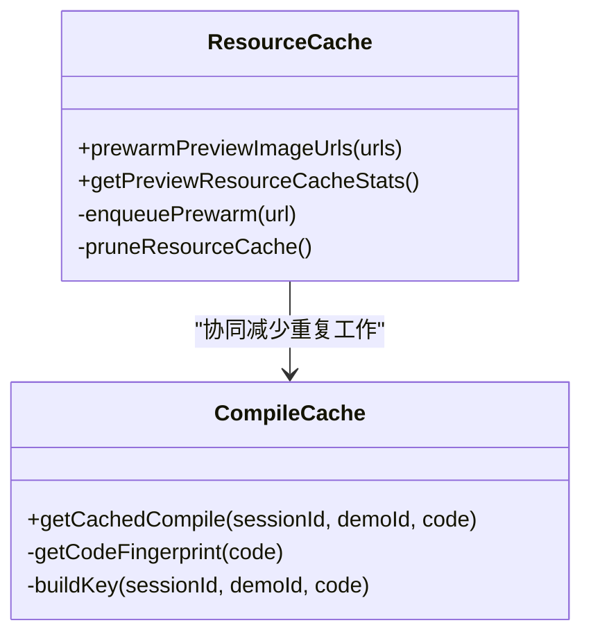
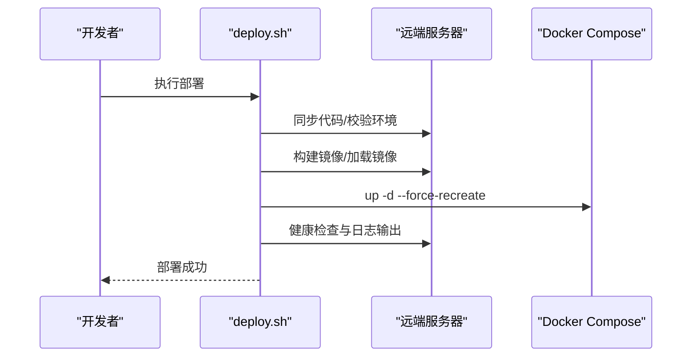
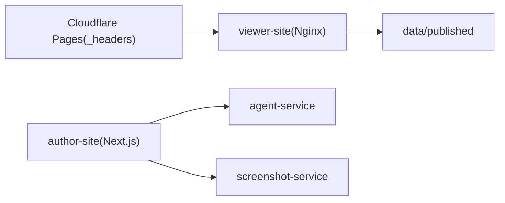

# CDN 集成与缓存策略

<cite>
**本文引用的文件**   
- [docker/viewer-site/nginx.conf](file://docker/viewer-site/nginx.conf)
- [scripts/sync-to-cloudflare.sh](file://scripts/sync-to-cloudflare.sh)
- [docker-compose.yml](file://docker-compose.yml)
- [packages/author-site/src/app/data/[...path]/route.ts](file://packages/author-site/src/app/data/[...path]/route.ts)
- [packages/author-site/src/middleware.ts](file://packages/author-site/src/middleware.ts)
- [packages/demo-ui/src/preview-resource-cache.ts](file://packages/demo-ui/src/preview-resource-cache.ts)
- [packages/demo-ui/src/compile-cache.ts](file://packages/demo-ui/src/compile-cache.ts)
- [packages/screenshot-service/tests/screenshots-routes.test.ts](file://packages/screenshot-service/tests/screenshots-routes.test.ts)
- [docker/screenshot-service/Dockerfile](file://docker/screenshot-service/Dockerfile)
- [scripts/deploy.sh](file://scripts/deploy.sh)
- [docs/项目文档/使用端/03-部署与嵌入/技术/01_部署与CORS配置.md](file://docs/项目文档/使用端/03-部署与嵌入/技术/01_部署与CORS配置.md)
- [docs/用户指南/正式环境部署指南.md](file://docs/用户指南/正式环境部署指南.md)
- [OPS/CLI/src/commands/health.ts](file://OPS/CLI/src/commands/health.ts)
- [OPS/CLI/src/commands/logs.ts](file://OPS/CLI/src/commands/logs.ts)
</cite>

## 目录
1. [简介](#简介)
2. [项目结构](#项目结构)
3. [核心组件](#核心组件)
4. [架构总览](#架构总览)
5. [详细组件分析](#详细组件分析)
6. [依赖关系分析](#依赖关系分析)
7. [性能优化建议](#性能优化建议)
8. [故障排查指南](#故障排查指南)
9. [结论](#结论)
10. [附录](#附录)

## 简介
本文件面向将本项目接入 CDN 的工程师与运维人员，系统化说明以下主题：
- CDN 配置与管理：域名绑定、SSL 证书、访问控制（CORS）
- 缓存策略设计：规则、过期时间、预热机制
- 回源机制：源站配置、负载均衡与健康检查
- 版本管理：文件名版本化、查询参数版本、缓存失效
- 部署脚本集成：自动化发布、缓存清理、状态监控
- 性能优化：压缩、带宽控制、请求优化
- 监控与告警：访问统计、错误追踪、性能分析

## 项目结构
与 CDN 和缓存相关的关键位置如下：
- 静态站点与数据映射：viewer-site 通过 Nginx 提供静态资源与 /data 路径映射，并设置不同 Cache-Control
- Cloudflare Pages 部署：通过 wrangler 上传构建产物与 _headers，实现 CDN 侧缓存头注入
- 创作端 Next.js 路由：/data 动态路由按扩展名返回不同缓存策略
- 中间件 CORS：在 author-site 中统一处理跨域预检与响应头
- 截图服务健康检查：Dockerfile 内置 healthcheck，便于编排层探测
- 前端资源预热：demo-ui 提供图片预热与 LRU 限制
- 编译缓存：demo-ui 提供编译结果 LRU 缓存
- 部署脚本：一键同步、构建、重启与自检；Cloudflare Pages 专用脚本生成 _headers 并部署

图表来源
- [docker/viewer-site/nginx.conf:1-44](file://docker/viewer-site/nginx.conf#L1-L44)
- [scripts/sync-to-cloudflare.sh:30-48](file://scripts/sync-to-cloudflare.sh#L30-L48)
- [packages/author-site/src/app/data/[...path]/route.ts](file://packages/author-site/src/app/data/[...path]/route.ts#L54-L86)
- [packages/author-site/src/middleware.ts:118-152](file://packages/author-site/src/middleware.ts#L118-L152)
- [docker-compose.yml:1-140](file://docker-compose.yml#L1-L140)

章节来源
- [docker/viewer-site/nginx.conf:1-44](file://docker/viewer-site/nginx.conf#L1-L44)
- [scripts/sync-to-cloudflare.sh:30-48](file://scripts/sync-to-cloudflare.sh#L30-L48)
- [packages/author-site/src/app/data/[...path]/route.ts:54-86](file://packages/author-site/src/app/data/[...path]/route.ts#L54-L86)
- [packages/author-site/src/middleware.ts:118-152](file://packages/author-site/src/middleware.ts#L118-L152)
- [docker-compose.yml:1-140](file://docker-compose.yml#L1-L140)

## 核心组件
- 静态站点与数据映射（Nginx）
  - /data 通用路径默认 must-revalidate，demos/*.js 与 Next 静态资源 immutable，HTML/JSON 关键路径 no-store
- Cloudflare Pages 部署与 _headers
  - 通过 _headers 为 /data/*、/data/*/demos/*、/_next/static/* 注入缓存头
- Next.js 动态路由（/data）
  - 根据扩展名返回不同缓存策略：.js immutable，.json no-store，其他 public, must-revalidate
- CORS 中间件
  - 对允许来源返回 Access-Control-Allow-Origin 等头，OPTIONS 预检快速返回
- 截图服务健康检查
  - Dockerfile 内 healthcheck 调用 /health，编排层可据此判定存活
- 前端资源预热
  - demo-ui 提供图片预热队列与 LRU 限制，失败不阻断主流程
- 编译缓存
  - demo-ui 提供基于 session+demo+code 指纹的 LRU 编译缓存

章节来源
- [docker/viewer-site/nginx.conf:12-44](file://docker/viewer-site/nginx.conf#L12-L44)
- [scripts/sync-to-cloudflare.sh:30-48](file://scripts/sync-to-cloudflare.sh#L30-L48)
- [packages/author-site/src/app/data/[...path]/route.ts:67-86](file://packages/author-site/src/app/data/[...path]/route.ts#L67-L86)
- [packages/author-site/src/middleware.ts:143-147](file://packages/author-site/src/middleware.ts#L143-L147)
- [docker/screenshot-service/Dockerfile:50-51](file://docker/screenshot-service/Dockerfile#L50-51)
- [packages/demo-ui/src/preview-resource-cache.ts:198-299](file://packages/demo-ui/src/preview-resource-cache.ts#L198-L299)
- [packages/demo-ui/src/compile-cache.ts:1-45](file://packages/demo-ui/src/compile-cache.ts#L1-L45)

## 架构总览
下图展示从浏览器到 CDN、Nginx、Next.js 以及后端服务的整体链路，标注了缓存头与回源行为。

图表来源
- [scripts/sync-to-cloudflare.sh:52-54](file://scripts/sync-to-cloudflare.sh#L52-L54)
- [docker/viewer-site/nginx.conf:12-44](file://docker/viewer-site/nginx.conf#L12-L44)
- [packages/author-site/src/middleware.ts:143-147](file://packages/author-site/src/middleware.ts#L143-L147)
- [docker-compose.yml:26-34](file://docker-compose.yml#L26-34)

## 详细组件分析

### 组件A：Cloudflare Pages 部署与缓存头
- 功能要点
  - 将 viewer-site 构建产物与 data/published 合并到临时目录
  - 生成 _headers 为 /data/*、/data/*/demos/*、/_next/static/* 设置缓存策略
  - 通过 wrangler pages deploy 推送至 Cloudflare Pages
- 缓存策略
  - /data/*: public, must-revalidate
  - /data/*/demos/*.js 与 *.html: public, immutable
  - /_next/static/*: public, immutable
  - 根 HTML: no-cache, must-revalidate
- 注意事项
  - projects-index.json 会被重命名为 projects.json 以适配 viewer 读取约定
  - 如需变更缓存策略，修改 _headers 块后重新部署

图表来源
- [scripts/sync-to-cloudflare.sh:1-59](file://scripts/sync-to-cloudflare.sh#L1-L59)

章节来源
- [scripts/sync-to-cloudflare.sh:1-59](file://scripts/sync-to-cloudflare.sh#L1-L59)

### 组件B：Nginx 静态映射与缓存头
- 功能要点
  - 将宿主 data/published 只读挂载到容器 /data
  - /data/projects.json 与 /data/**/*.html/json 返回 no-store，确保发布后立即生效
  - /data/** 通用路径返回 must-revalidate
  - /data/**/demos/*.js 与 /_next/static/* 返回 immutable
- 注意事项
  - 正则 location 必须正确捕获路径以配合 alias，避免 500 错误
  - 生产环境应结合 CDN 层 _headers 进行二次强化

图表来源
- [docker/viewer-site/nginx.conf:12-44](file://docker/viewer-site/nginx.conf#L12-L44)

章节来源
- [docker/viewer-site/nginx.conf:12-44](file://docker/viewer-site/nginx.conf#L12-L44)

### 组件C：Next.js 动态路由与缓存策略
- 功能要点
  - /data/[...path] 动态路由按扩展名设置不同缓存头
  - .js: public, immutable, max-age=2592000
  - .json: no-store
  - 其他: public, must-revalidate, max-age=3600
  - 同时设置 CORS 头支持跨域
- 注意事项
  - 与 Nginx 静态映射互补，适用于非静态或需要服务端鉴权的场景

图表来源
- [packages/author-site/src/app/data/[...path]/route.ts:67-86](file://packages/author-site/src/app/data/[...path]/route.ts#L67-L86)

章节来源
- [packages/author-site/src/app/data/[...path]/route.ts:54-86](file://packages/author-site/src/app/data/[...path]/route.ts#L54-L86)

### 组件D：CORS 中间件与访问控制
- 功能要点
  - 针对预览运行时模块与允许的来源设置 CORS 头
  - OPTIONS 预检在认证之前返回 204，降低预检开销
  - 生产环境需包含 viewer-site 实际访问域名
- 注意事项
  - 若新增外部域名，需在环境变量中更新 CORS_ORIGINS 并重新部署

图表来源
- [packages/author-site/src/middleware.ts:143-147](file://packages/author-site/src/middleware.ts#L143-L147)
- [docs/项目文档/使用端/03-部署与嵌入/技术/01_部署与CORS配置.md:70-101](file://docs/项目文档/使用端/03-部署与嵌入/技术/01_部署与CORS配置.md#L70-L101)

章节来源
- [packages/author-site/src/middleware.ts:118-152](file://packages/author-site/src/middleware.ts#L118-L152)
- [docs/项目文档/使用端/03-部署与嵌入/技术/01_部署与CORS配置.md:70-101](file://docs/项目文档/使用端/03-部署与嵌入/技术/01_部署与CORS配置.md#L70-L101)

### 组件E：截图服务健康检查与回源
- 功能要点
  - Dockerfile 内置 healthcheck 调用 /health
  - 编排层（docker-compose）可据此判定服务健康
  - 作者站点通过环境变量定位截图服务地址
- 注意事项
  - 深度健康检查可用于验证 Chromium 可用性
  - 超时与重试策略由编排层与脚本共同保障

图表来源
- [docker/screenshot-service/Dockerfile:50-51](file://docker/screenshot-service/Dockerfile#L50-51)
- [docker-compose.yml:116-120](file://docker-compose.yml#L116-120)

章节来源
- [docker/screenshot-service/Dockerfile:50-51](file://docker/screenshot-service/Dockerfile#L50-51)
- [docker-compose.yml:88-120](file://docker-compose.yml#L88-120)

### 组件F：前端资源预热与编译缓存
- 资源预热
  - 并发队列 + LRU 限制，失败不阻断主流程
  - 适合在页面加载前批量预热图片 URL
- 编译缓存
  - 基于 sessionId:demoId:codeFingerprint 的键空间
  - TTL 与最大容量控制内存占用

图表来源
- [packages/demo-ui/src/preview-resource-cache.ts:198-299](file://packages/demo-ui/src/preview-resource-cache.ts#L198-L299)
- [packages/demo-ui/src/compile-cache.ts:1-45](file://packages/demo-ui/src/compile-cache.ts#L1-L45)

章节来源
- [packages/demo-ui/src/preview-resource-cache.ts:198-299](file://packages/demo-ui/src/preview-resource-cache.ts#L198-L299)
- [packages/demo-ui/src/compile-cache.ts:1-45](file://packages/demo-ui/src/compile-cache.ts#L1-L45)

### 组件G：版本管理与缓存失效
- 文件名版本化
  - Next 静态资源与 demos/*.js 使用 immutable，文件名含哈希，天然具备版本化能力
- 查询参数版本
  - 发布 iframe 中的 compiled.js 可通过 ?v=publishBatch 绕过浏览器缓存
- 缓存失效处理
  - HTML/JSON 关键路径使用 no-store 或 must-revalidate，确保发布后尽快刷新
  - Cloudflare _headers 与 Nginx 双重策略保证边缘与源站一致性

章节来源
- [docker/viewer-site/nginx.conf:26-44](file://docker/viewer-site/nginx.conf#L26-L44)
- [scripts/sync-to-cloudflare.sh:30-48](file://scripts/sync-to-cloudflare.sh#L30-L48)
- [docs/项目文档/使用端/03-部署与嵌入/技术/01_部署与CORS配置.md:124-134](file://docs/项目文档/使用端/03-部署与嵌入/技术/01_部署与CORS配置.md#L124-L134)

### 组件H：回源机制与负载均衡
- 源站配置
  - viewer-site 通过 Nginx 暴露静态资源与 /data 映射
  - author-site 作为 API 与动态路由入口，代理到 agent-service 与 screenshot-service
- 负载均衡
  - 当前仓库未实现多实例均衡，建议在编排层或反向代理层引入多副本与健康检查
- 健康检查
  - 截图服务内置 healthcheck；部署脚本会轮询各服务端口与 /health 接口

章节来源
- [docker-compose.yml:1-140](file://docker-compose.yml#L1-L140)
- [scripts/deploy.sh:596-794](file://scripts/deploy.sh#L596-L794)

### 组件I：部署脚本集成（自动化发布、缓存清理、状态监控）
- 一键部署
  - scripts/deploy.sh 负责 SSH 连接、代码同步、镜像构建/加载、服务重启与自检
  - 支持 targeted sync 加速与远程构建兜底
- Cloudflare Pages 部署
  - scripts/sync-to-cloudflare.sh 生成 _headers 并推送，适合静态站点与数据直出
- 状态监控
  - 部署脚本内置健康检查与日志输出
  - OPS CLI 提供健康检查与日志聚合命令

图表来源
- [scripts/deploy.sh:37-104](file://scripts/deploy.sh#L37-L104)
- [scripts/deploy.sh:440-591](file://scripts/deploy.sh#L440-L591)
- [scripts/deploy.sh:596-794](file://scripts/deploy.sh#L596-L794)
- [scripts/sync-to-cloudflare.sh:52-54](file://scripts/sync-to-cloudflare.sh#L52-L54)
- [OPS/CLI/src/commands/health.ts:11-54](file://OPS/CLI/src/commands/health.ts#L11-L54)
- [OPS/CLI/src/commands/logs.ts:138-160](file://OPS/CLI/src/commands/logs.ts#L138-L160)

章节来源
- [scripts/deploy.sh:37-104](file://scripts/deploy.sh#L37-L104)
- [scripts/deploy.sh:440-591](file://scripts/deploy.sh#L440-L591)
- [scripts/deploy.sh:596-794](file://scripts/deploy.sh#L596-L794)
- [scripts/sync-to-cloudflare.sh:52-54](file://scripts/sync-to-cloudflare.sh#L52-L54)
- [OPS/CLI/src/commands/health.ts:11-54](file://OPS/CLI/src/commands/health.ts#L11-L54)
- [OPS/CLI/src/commands/logs.ts:138-160](file://OPS/CLI/src/commands/logs.ts#L138-L160)

## 依赖关系分析
- 组件耦合
  - viewer-site 与 data/published 强耦合（静态映射）
  - author-site 与 agent-service、screenshot-service 通过环境变量解耦
  - Cloudflare Pages 与 _headers 强耦合（缓存策略集中管理）
- 外部依赖
  - wrangler（Cloudflare CLI）用于 Pages 部署
  - Docker 与 docker compose 用于服务编排与健康检查
- 潜在循环依赖
  - 无直接循环；注意环境变量与网络可达性

图表来源
- [docker-compose.yml:1-140](file://docker-compose.yml#L1-L140)
- [scripts/sync-to-cloudflare.sh:30-48](file://scripts/sync-to-cloudflare.sh#L30-L48)

章节来源
- [docker-compose.yml:1-140](file://docker-compose.yml#L1-L140)
- [scripts/sync-to-cloudflare.sh:30-48](file://scripts/sync-to-cloudflare.sh#L30-L48)

## 性能优化建议
- 压缩配置
  - 在 CDN/Nginx 层启用 gzip/brotli，对 HTML/CSS/JS 进行压缩
- 带宽控制
  - 在 CDN 层设置带宽上限与速率限制，防止突发流量冲击源站
- 请求优化
  - 合理使用 immutable 与 must-revalidate，减少不必要回源
  - 利用资源预热提升首屏体验
  - 对大文件启用分片下载与断点续传（视业务需求）

[本节为通用指导，无需源码引用]

## 故障排查指南
- 常见问题
  - 部署后项目列表为空：检查 APP_DATA_DIR 是否指向空目录
  - 加速部署提示缺少包：使用完整同步或更新 targeted package 列表
  - SSH 连接失败：确认私钥与连通性
  - 截图服务不可用：查看健康检查与深度健康检查
- 健康检查与日志
  - 使用部署脚本自检与 OPS CLI 健康检查命令
  - 查看容器日志与 /health 响应体

章节来源
- [docs/用户指南/正式环境部署指南.md:215-237](file://docs/用户指南/正式环境部署指南.md#L215-L237)
- [scripts/deploy.sh:596-794](file://scripts/deploy.sh#L596-L794)
- [OPS/CLI/src/commands/health.ts:11-54](file://OPS/CLI/src/commands/health.ts#L11-L54)
- [OPS/CLI/src/commands/logs.ts:138-160](file://OPS/CLI/src/commands/logs.ts#L138-L160)

## 结论
通过将 Cloudflare Pages 的 _headers 与 Nginx 的静态映射相结合，并在 Next.js 动态路由中精细化设置缓存头，本项目实现了稳定可控的 CDN 缓存策略。配合完善的部署脚本与健康检查，能够在保证一致性的前提下提升性能与可观测性。后续可在编排层引入多实例与更细粒度的限流策略，进一步提升高可用与弹性。

[本节为总结，无需源码引用]

## 附录
- 环境变量参考
  - CORS_ORIGINS、NEXT_PUBLIC_AGENT_SERVICE_URL、SCREENSHOT_SERVICE_URL、USE_SECURE_COOKIE、INTERNAL_API_TOKEN 等
- 常用命令
  - 一键部署、仅预览、覆盖 data、拉取正式 data 到本地

章节来源
- [docs/项目文档/创作端/06-基础设施/技术/03_Docker部署方案.md:151-169](file://docs/项目文档/创作端/06-基础设施/技术/03_Docker部署方案.md#L151-L169)
- [docs/用户指南/正式环境部署指南.md:215-237](file://docs/用户指南/正式环境部署指南.md#L215-L237)