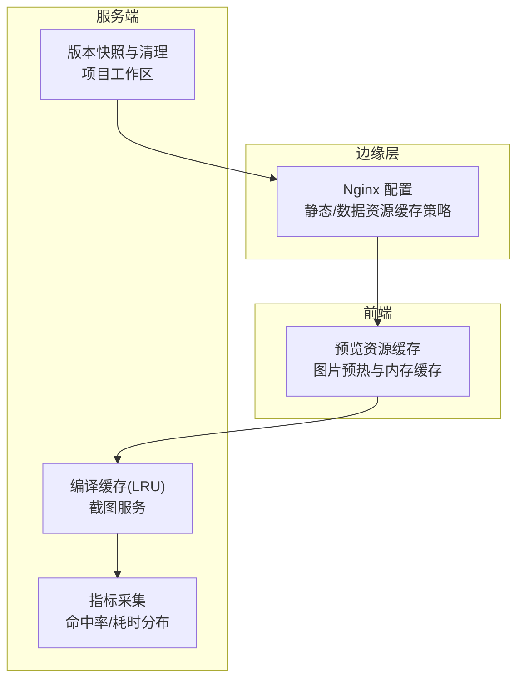
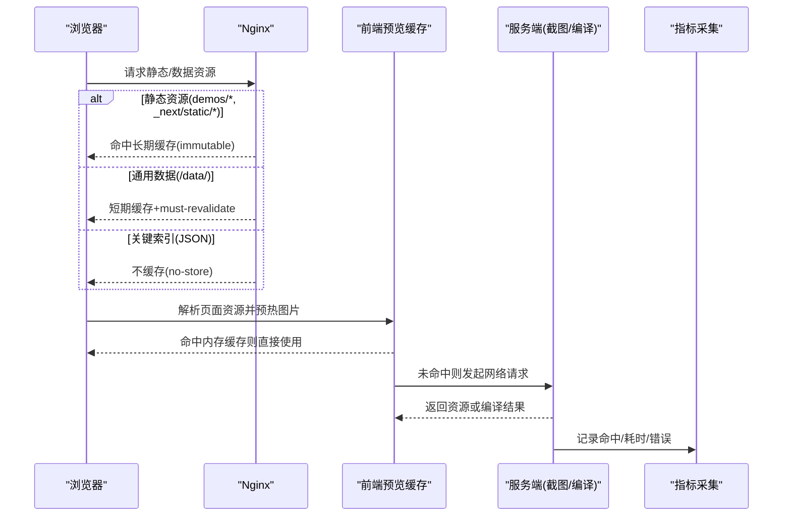
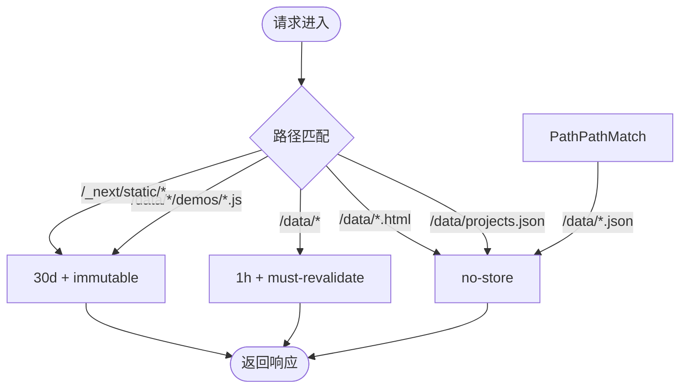
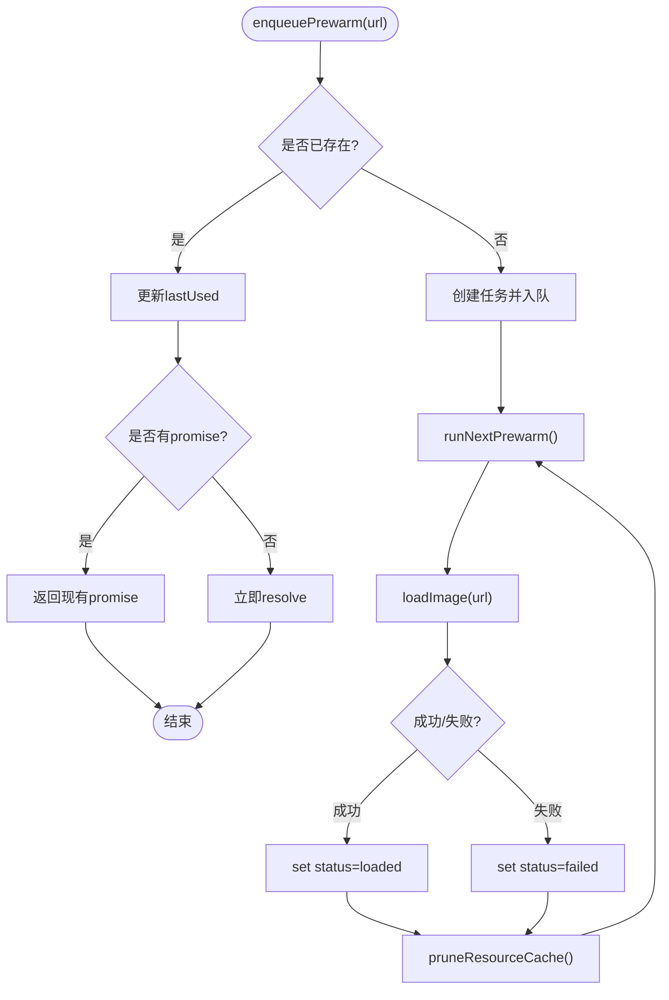
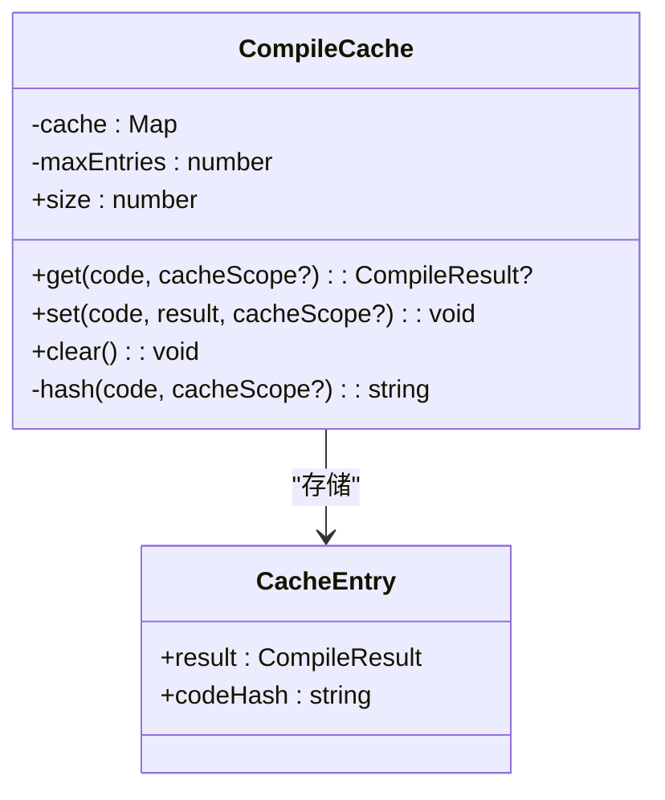
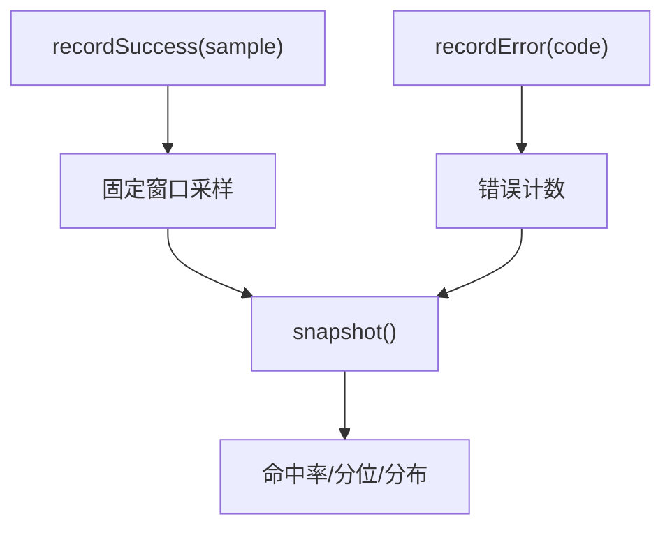
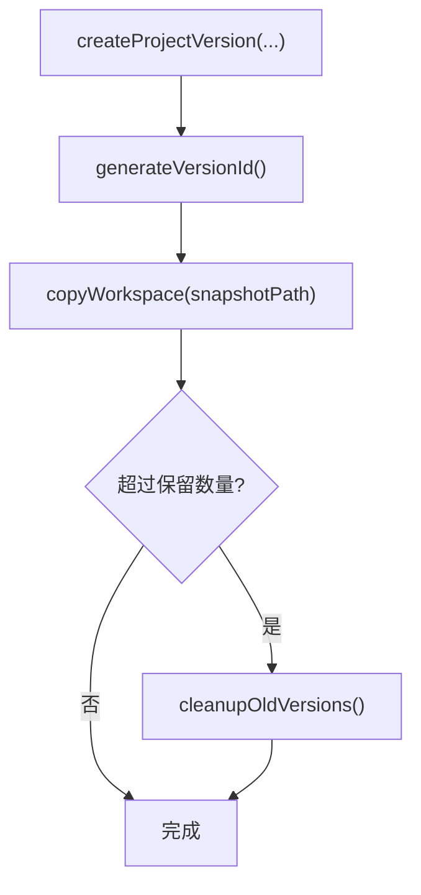

# 缓存策略设计

<cite>
**本文引用的文件**   
- [docker/viewer-site/nginx.conf](file://docker/viewer-site/nginx.conf)
- [packages/demo-ui/src/preview-resource-cache.ts](file://packages/demo-ui/src/preview-resource-cache.ts)
- [packages/screenshot-service/src/utils/compile-cache.ts](file://packages/screenshot-service/src/utils/compile-cache.ts)
- [packages/screenshot-service/src/utils/screenshot-metrics.ts](file://packages/screenshot-service/src/utils/screenshot-metrics.ts)
- [packages/project-core/src/service.ts](file://packages/project-core/src/service.ts)
- [packages/author-site/src/lib/fs-utils.ts](file://packages/author-site/src/lib/fs-utils.ts)
</cite>

## 目录
1. [引言](#引言)
2. [项目结构](#项目结构)
3. [核心组件](#核心组件)
4. [架构总览](#架构总览)
5. [详细组件分析](#详细组件分析)
6. [依赖分析](#依赖分析)
7. [性能考虑](#性能考虑)
8. [故障排查指南](#故障排查指南)
9. [结论](#结论)
10. [附录](#附录)

## 引言
本技术文档围绕“缓存策略设计”展开，结合仓库中已实现的缓存与版本管理相关代码，系统化阐述：
- 静态资源、动态内容与 API 响应缓存策略
- 版本管理机制（文件名版本化、查询参数版本控制、缓存失效）
- 缓存预热机制（预加载、批量预热、智能预热算法）
- 缓存一致性保证（分布式同步、更新通知、冲突解决）
- 缓存监控方案（命中率、大小、性能指标）
- 优化最佳实践（分层、键设计、清理策略）

## 项目结构
本项目在多个层级实现了缓存能力：
- 边缘层（Nginx）：对静态资源与数据文件设置不同 Cache-Control 策略，实现浏览器/CDN 级缓存。
- 前端预览层：图片资源预热与内存缓存，减少首屏与交互延迟。
- 服务端编译缓存：截图服务中的编译结果 LRU 缓存，降低重复编译开销。
- 版本管理与快照：项目工作空间版本快照与清理，支撑发布物与回滚。
- 指标采集：截图服务内置采样统计，提供命中率与耗时分布等指标。

图表来源
- [docker/viewer-site/nginx.conf:1-45](file://docker/viewer-site/nginx.conf#L1-L45)
- [packages/demo-ui/src/preview-resource-cache.ts:1-300](file://packages/demo-ui/src/preview-resource-cache.ts#L1-L300)
- [packages/screenshot-service/src/utils/compile-cache.ts:1-70](file://packages/screenshot-service/src/utils/compile-cache.ts#L1-L70)
- [packages/screenshot-service/src/utils/screenshot-metrics.ts:1-159](file://packages/screenshot-service/src/utils/screenshot-metrics.ts#L1-L159)
- [packages/project-core/src/service.ts:5673-5732](file://packages/project-core/src/service.ts#L5673-L5732)
- [packages/author-site/src/lib/fs-utils.ts:1429-1471](file://packages/author-site/src/lib/fs-utils.ts#L1429-L1471)

章节来源
- [docker/viewer-site/nginx.conf:1-45](file://docker/viewer-site/nginx.conf#L1-L45)
- [packages/demo-ui/src/preview-resource-cache.ts:1-300](file://packages/demo-ui/src/preview-resource-cache.ts#L1-L300)
- [packages/screenshot-service/src/utils/compile-cache.ts:1-70](file://packages/screenshot-service/src/utils/compile-cache.ts#L1-L70)
- [packages/screenshot-service/src/utils/screenshot-metrics.ts:1-159](file://packages/screenshot-service/src/utils/screenshot-metrics.ts#L1-L159)
- [packages/project-core/src/service.ts:5673-5732](file://packages/project-core/src/service.ts#L5673-L5732)
- [packages/author-site/src/lib/fs-utils.ts:1429-1471](file://packages/author-site/src/lib/fs-utils.ts#L1429-L1471)

## 核心组件
- 边缘缓存（Nginx）
  - 静态资源（/_next/static/）：长期缓存且不可变，适合构建产物。
  - 演示脚本（demos/*.js）：长期缓存且不可变，配合文件名版本化。
  - 通用数据（/data/）：短期缓存并强制校验，平衡新鲜度与带宽。
  - 关键索引与 JSON：不缓存，确保最新列表与元数据。
- 前端预览资源缓存
  - 基于 URL 的内存缓存，记录状态（加载中/成功/失败）、最后使用时间。
  - 并发可控的图片预热队列，避免阻塞主线程。
  - 自动裁剪与淘汰策略，限制最大条目数。
- 服务端编译缓存
  - 基于代码哈希的 LRU 缓存，命中后直接返回编译结果。
  - 容量上限触发时驱逐最久未使用项。
- 指标采集
  - 固定窗口内采样，计算命中率、分位耗时、错误分布等。
- 版本管理与快照
  - 版本号生成、快照创建、历史查询与旧版本清理。

章节来源
- [docker/viewer-site/nginx.conf:12-44](file://docker/viewer-site/nginx.conf#L12-L44)
- [packages/demo-ui/src/preview-resource-cache.ts:198-299](file://packages/demo-ui/src/preview-resource-cache.ts#L198-L299)
- [packages/screenshot-service/src/utils/compile-cache.ts:10-60](file://packages/screenshot-service/src/utils/compile-cache.ts#L10-L60)
- [packages/screenshot-service/src/utils/screenshot-metrics.ts:84-158](file://packages/screenshot-service/src/utils/screenshot-metrics.ts#L84-L158)
- [packages/project-core/src/service.ts:5673-5732](file://packages/project-core/src/service.ts#L5673-L5732)
- [packages/author-site/src/lib/fs-utils.ts:1429-1471](file://packages/author-site/src/lib/fs-utils.ts#L1429-L1471)

## 架构总览
从请求到响应的缓存路径如下：
- 浏览器/Nginx 根据路径匹配选择缓存策略（不可变/短期/不缓存）。
- 前端在渲染前进行图片资源预热，命中内存缓存则跳过网络请求。
- 服务端对可复用的编译结果进行 LRU 缓存，提升吞吐。
- 版本快照与清理保障发布物一致性与磁盘占用可控。
- 指标模块持续收集命中率与耗时，辅助调优。

图表来源
- [docker/viewer-site/nginx.conf:12-44](file://docker/viewer-site/nginx.conf#L12-L44)
- [packages/demo-ui/src/preview-resource-cache.ts:239-279](file://packages/demo-ui/src/preview-resource-cache.ts#L239-L279)
- [packages/screenshot-service/src/utils/compile-cache.ts:27-51](file://packages/screenshot-service/src/utils/compile-cache.ts#L27-L51)
- [packages/screenshot-service/src/utils/screenshot-metrics.ts:88-151](file://packages/screenshot-service/src/utils/screenshot-metrics.ts#L88-L151)

## 详细组件分析

### 边缘缓存（Nginx）策略
- 静态资源
  - /_next/static/ 与 demos/*.js：30 天 + immutable，适用于带内容哈希的构建产物。
- 通用数据
  - /data/：1 小时 + must-revalidate，兼顾新鲜度与复用。
- 关键索引与 JSON
  - projects.json 与 /data/*.json：no-store，确保实时性。
- 跨域
  - 为 /data/* 添加 Access-Control-Allow-Origin: *，便于跨域读取。

图表来源
- [docker/viewer-site/nginx.conf:12-44](file://docker/viewer-site/nginx.conf#L12-L44)

章节来源
- [docker/viewer-site/nginx.conf:12-44](file://docker/viewer-site/nginx.conf#L12-L44)

### 前端预览资源缓存与预热
- 功能要点
  - 提取页面配置与代码中的图片 URL，去重后批量预热。
  - 内存 Map 维护每个 URL 的状态、最后使用时间、并发 Promise。
  - 并发队列控制（默认 4），避免过多并发影响主线程。
  - 超过阈值（默认 80）按 lastUsed 淘汰非 loading 项。
- 关键流程
  - 入队：若已有相同 URL 且处于 loading，复用其 Promise；否则入队并启动加载。
  - 完成：无论成功或失败，均写入状态并触发下一次任务执行与修剪。
  - 统计：暴露 size、active、queued、loaded、failed 等指标。

图表来源
- [packages/demo-ui/src/preview-resource-cache.ts:239-279](file://packages/demo-ui/src/preview-resource-cache.ts#L239-L279)
- [packages/demo-ui/src/preview-resource-cache.ts:198-219](file://packages/demo-ui/src/preview-resource-cache.ts#L198-L219)
- [packages/demo-ui/src/preview-resource-cache.ts:221-237](file://packages/demo-ui/src/preview-resource-cache.ts#L221-L237)

章节来源
- [packages/demo-ui/src/preview-resource-cache.ts:198-299](file://packages/demo-ui/src/preview-resource-cache.ts#L198-L299)

### 服务端编译缓存（LRU）
- 设计要点
  - 以“作用域:代码”的 SHA256 前缀作为键，避免碰撞。
  - get 命中时将条目移至末尾（LRU）。
  - set 时若达到容量上限且为新键，删除最老键。
  - 提供 clear 与 size 接口用于运维与测试。
- 复杂度
  - get/set 平均 O(1)，淘汰操作 O(1)。
  - 哈希计算 O(n)（n 为代码长度）。

图表来源
- [packages/screenshot-service/src/utils/compile-cache.ts:10-60](file://packages/screenshot-service/src/utils/compile-cache.ts#L10-L60)

章节来源
- [packages/screenshot-service/src/utils/compile-cache.ts:10-60](file://packages/screenshot-service/src/utils/compile-cache.ts#L10-L60)

### 指标采集与监控
- 采集维度
  - 总体：样本窗口大小、样本数量、命中率、缓存命中计数。
  - 分类：按优先级、变体、全页/非全页、尺寸分布。
  - 阶段耗时：浏览器、页面创建、视口设置、内容注入、等待网络空闲、动画帧、运行时检查、测量、视口调整、截图等。
  - 错误：按错误码聚合计数。
- 输出
  - snapshot() 返回汇总统计，便于上报与告警。

图表来源
- [packages/screenshot-service/src/utils/screenshot-metrics.ts:84-151](file://packages/screenshot-service/src/utils/screenshot-metrics.ts#L84-L151)

章节来源
- [packages/screenshot-service/src/utils/screenshot-metrics.ts:84-151](file://packages/screenshot-service/src/utils/screenshot-metrics.ts#L84-L151)

### 版本管理与快照
- 版本生成
  - 基于现有最大版本号递增，格式 vN。
- 快照创建
  - 复制工作空间至快照目录，记录作者、时间、会话、文件数、工作区标识与根哈希等。
- 历史查询与清理
  - 保留固定数量（如 50），优先移除自动检查点，再回退到全部版本。
- 适用场景
  - 发布物稳定、可回滚；配合边缘缓存的 immutable 策略，通过文件名版本化实现强缓存与快速失效。

图表来源
- [packages/project-core/src/service.ts:5673-5732](file://packages/project-core/src/service.ts#L5673-L5732)
- [packages/author-site/src/lib/fs-utils.ts:1429-1471](file://packages/author-site/src/lib/fs-utils.ts#L1429-L1471)

章节来源
- [packages/project-core/src/service.ts:5673-5732](file://packages/project-core/src/service.ts#L5673-L5732)
- [packages/author-site/src/lib/fs-utils.ts:1429-1471](file://packages/author-site/src/lib/fs-utils.ts#L1429-L1471)

## 依赖分析
- 组件耦合
  - 前端预览缓存与服务端无直接耦合，通过 HTTP 资源访问；指标由服务端独立采集。
  - 版本管理与边缘缓存通过“文件名版本化”间接协同：新版本发布后，浏览器仍命中旧名缓存，但应用侧引用新名即可生效。
- 外部依赖
  - Nginx 的 expires 与 Cache-Control 指令决定浏览器/CDN 行为。
  - 浏览器 Image API 与 decode 能力影响预热成功率与兼容性。
- 潜在循环依赖
  - 当前各模块职责清晰，未见循环导入或调用。

图表来源
- [docker/viewer-site/nginx.conf:12-44](file://docker/viewer-site/nginx.conf#L12-L44)
- [packages/demo-ui/src/preview-resource-cache.ts:239-279](file://packages/demo-ui/src/preview-resource-cache.ts#L239-L279)
- [packages/screenshot-service/src/utils/compile-cache.ts:27-51](file://packages/screenshot-service/src/utils/compile-cache.ts#L27-L51)
- [packages/screenshot-service/src/utils/screenshot-metrics.ts:88-151](file://packages/screenshot-service/src/utils/screenshot-metrics.ts#L88-L151)
- [packages/project-core/src/service.ts:5673-5732](file://packages/project-core/src/service.ts#L5673-L5732)

章节来源
- [docker/viewer-site/nginx.conf:12-44](file://docker/viewer-site/nginx.conf#L12-L44)
- [packages/demo-ui/src/preview-resource-cache.ts:239-279](file://packages/demo-ui/src/preview-resource-cache.ts#L239-L279)
- [packages/screenshot-service/src/utils/compile-cache.ts:27-51](file://packages/screenshot-service/src/utils/compile-cache.ts#L27-L51)
- [packages/screenshot-service/src/utils/screenshot-metrics.ts:88-151](file://packages/screenshot-service/src/utils/screenshot-metrics.ts#L88-L151)
- [packages/project-core/src/service.ts:5673-5732](file://packages/project-core/src/service.ts#L5673-L5732)

## 性能考虑
- 命中率与延迟
  - 通过 screenshot-metrics 的 cacheHitRate 与分位耗时评估整体效果。
  - 前端预热可降低首屏与交互时的图片加载抖动。
- 容量与淘汰
  - 编译缓存与预览缓存均采用容量上限与淘汰策略，防止内存膨胀。
- 并发控制
  - 预热并发受控，避免抢占主线程与网络资源。
- 建议
  - 针对热点资源提高预热优先级；对冷资源放宽 TTL 或缩短窗口。
  - 将长尾高延迟阶段（如 waitForNetworkIdle）纳入优化目标。

[本节为通用指导，无需特定文件来源]

## 故障排查指南
- 常见问题定位
  - 命中率偏低：检查 Nginx 的 Cache-Control 是否与资源类型匹配；确认前端是否正确预热。
  - 预热失败：关注 preview-resource-cache 的 failed 计数与错误信息；检查图片 URL 合法性与跨域。
  - 编译缓存未命中：核对代码哈希作用域与输入一致性；确认容量上限是否过小。
  - 版本不一致：确认发布后文件名是否变更；检查索引 JSON 是否 no-store 导致频繁刷新。
- 观测手段
  - 使用 getScreenshotMetrics().snapshot() 获取命中率与耗时分布。
  - 使用 getPreviewResourceCacheStats() 观察预热队列与状态分布。
  - 结合 Nginx 日志与浏览器开发者工具验证缓存头。

章节来源
- [packages/screenshot-service/src/utils/screenshot-metrics.ts:131-151](file://packages/screenshot-service/src/utils/screenshot-metrics.ts#L131-L151)
- [packages/demo-ui/src/preview-resource-cache.ts:281-293](file://packages/demo-ui/src/preview-resource-cache.ts#L281-L293)
- [docker/viewer-site/nginx.conf:12-44](file://docker/viewer-site/nginx.conf#L12-L44)

## 结论
本仓库在多层面实现了有效的缓存体系：边缘层通过差异化 Cache-Control 策略提升静态与数据资源命中率；前端通过图片预热与内存缓存改善用户体验；服务端以 LRU 编译缓存降低重复计算成本；版本快照与清理保障发布稳定性与资源占用可控；指标采集为持续优化提供依据。建议在后续迭代中完善分布式一致性、统一键设计与更细粒度的预热策略，以进一步提升系统整体性能与可观测性。

[本节为总结，无需特定文件来源]

## 附录

### 缓存规则设计清单
- 静态资源
  - 构建产物与演示脚本：30 天 + immutable。
  - 样式与字体：同构建产物策略。
- 动态内容
  - 通用数据：1 小时 + must-revalidate。
  - 关键索引与元数据：no-store。
- API 响应
  - 列表类：短 TTL + ETag/If-None-Match。
  - 详情类：按需开启缓存，结合业务幂等与一致性要求。

章节来源
- [docker/viewer-site/nginx.conf:12-44](file://docker/viewer-site/nginx.conf#L12-L44)

### 版本管理机制
- 文件名版本化
  - 构建产物包含内容哈希，浏览器可长期缓存。
- 查询参数版本控制
  - 对需即时更新的资源，可通过查询参数区分版本（例如 ?v=...）。
- 缓存失效处理
  - 发布新版本后，前端引用新文件名；索引 JSON 不缓存以确保发现最新版本。

章节来源
- [packages/project-core/src/service.ts:5673-5732](file://packages/project-core/src/service.ts#L5673-L5732)
- [docker/viewer-site/nginx.conf:12-24](file://docker/viewer-site/nginx.conf#L12-L24)

### 缓存预热机制
- 预加载策略
  - 页面初始化时扫描配置与代码中的图片 URL，去重后批量预热。
- 批量预热
  - 并发队列控制，避免过载；支持 Promise 合并，避免重复请求。
- 智能预热算法
  - 基于 lastUsed 淘汰冷资源；可按业务权重扩展优先级队列。

章节来源
- [packages/demo-ui/src/preview-resource-cache.ts:158-177](file://packages/demo-ui/src/preview-resource-cache.ts#L158-L177)
- [packages/demo-ui/src/preview-resource-cache.ts:239-279](file://packages/demo-ui/src/preview-resource-cache.ts#L239-L279)
- [packages/demo-ui/src/preview-resource-cache.ts:198-209](file://packages/demo-ui/src/preview-resource-cache.ts#L198-L209)

### 缓存一致性保证
- 分布式缓存同步
  - 当前实现以进程内缓存为主；如需多实例共享，可扩展为 Redis/Memcached 等。
- 缓存更新通知
  - 发布事件驱动失效：当版本快照创建成功后，广播对应资源的失效消息。
- 冲突解决策略
  - 采用版本号与内容哈希双重校验；客户端携带 If-None-Match/Etag 协商。

[本节为概念性说明，无需特定文件来源]

### 缓存监控方案
- 命中率统计
  - 截图服务提供 cacheHitRate 与 cachedCount。
- 缓存大小监控
  - 编译缓存提供 size；预览缓存提供 size、active、queued。
- 性能指标收集
  - 分位耗时（p50/p90/p99）、阶段耗时、错误分布。

章节来源
- [packages/screenshot-service/src/utils/screenshot-metrics.ts:131-151](file://packages/screenshot-service/src/utils/screenshot-metrics.ts#L131-L151)
- [packages/screenshot-service/src/utils/compile-cache.ts:57-59](file://packages/screenshot-service/src/utils/compile-cache.ts#L57-L59)
- [packages/demo-ui/src/preview-resource-cache.ts:281-293](file://packages/demo-ui/src/preview-resource-cache.ts#L281-L293)

### 缓存优化最佳实践
- 缓存分层
  - 浏览器/CDN → 前端内存 → 服务端 LRU → 持久化快照。
- 缓存键设计
  - 基于作用域与内容哈希，避免污染与误命中。
- 缓存清理策略
  - 固定窗口采样与容量上限；优先淘汰冷数据与自动检查点。

章节来源
- [packages/screenshot-service/src/utils/compile-cache.ts:27-51](file://packages/screenshot-service/src/utils/compile-cache.ts#L27-L51)
- [packages/author-site/src/lib/fs-utils.ts:1429-1471](file://packages/author-site/src/lib/fs-utils.ts#L1429-L1471)