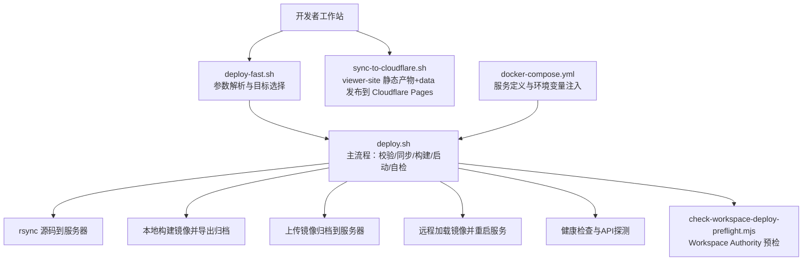
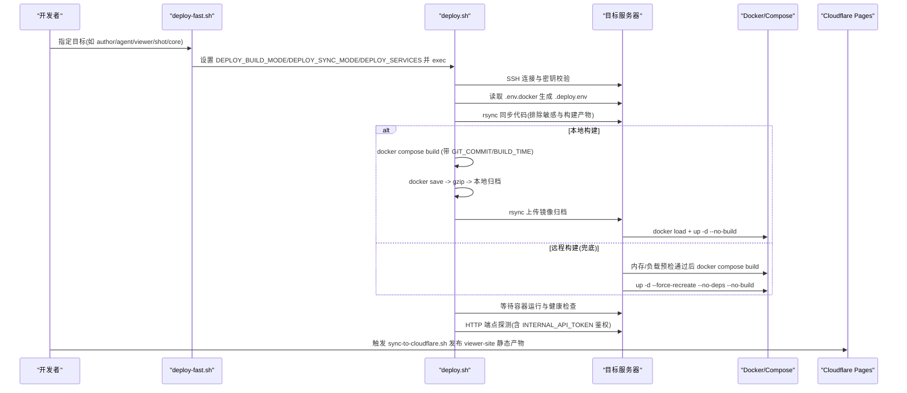
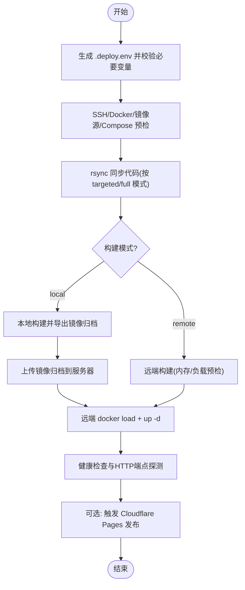
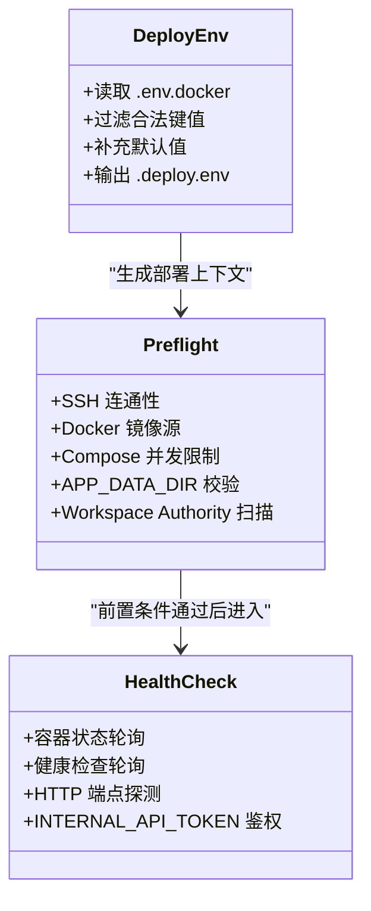
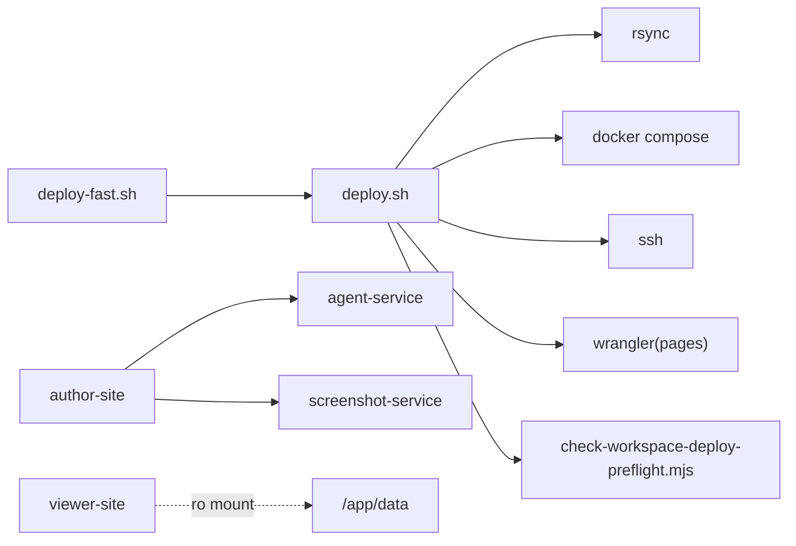

# 部署集成方案

<cite>
**本文引用的文件**   
- [scripts/deploy.sh](file://scripts/deploy.sh)
- [scripts/deploy-fast.sh](file://scripts/deploy-fast.sh)
- [scripts/deploy-author-with-data.sh](file://scripts/deploy-author-with-data.sh)
- [scripts/sync-to-cloudflare.sh](file://scripts/sync-to-cloudflare.sh)
- [scripts/check-workspace-deploy-preflight.mjs](file://scripts/check-workspace-deploy-preflight.mjs)
- [docker-compose.yml](file://docker-compose.yml)
- [packages/author-site/next.config.js](file://packages/author-site/next.config.js)
- [packages/agent-service/src/config/backend-providers.ts](file://packages/agent-service/src/config/backend-providers.ts)
- [packages/author-site/src/lib/model-config.ts](file://packages/author-site/src/lib/model-config.ts)
- [docs/项目文档/创作端/06-基础设施/技术/03_Docker部署方案.md](file://docs/项目文档/创作端/06-基础设施/技术/03_Docker部署方案.md)
</cite>

## 目录
1. [引言](#引言)
2. [项目结构](#项目结构)
3. [核心组件](#核心组件)
4. [架构总览](#架构总览)
5. [详细组件分析](#详细组件分析)
6. [依赖关系分析](#依赖关系分析)
7. [性能与容量规划](#性能与容量规划)
8. [故障恢复与回滚](#故障恢复与回滚)
9. [监控告警与可观测性](#监控告警与可观测性)
10. [结论](#结论)
11. [附录：环境变量与配置清单](#附录环境变量与配置清单)

## 引言
本方案面向生产级部署，围绕自动化发布、镜像构建与上传、CDN 静态站点发布、版本回滚、多环境差异化配置、灰度发布、监控告警以及故障恢复等关键能力进行系统化设计。脚本层以本地优先构建为主，远端兜底；数据层提供受保护的覆盖与备份流程；前端静态产物通过 Cloudflare Pages 发布并附带缓存策略；服务编排由 Docker Compose 管理，配合健康检查与端口自检保障上线质量。

## 项目结构
仓库中与部署相关的核心位置如下：
- 部署脚本：scripts/deploy.sh、scripts/deploy-fast.sh、scripts/deploy-author-with-data.sh、scripts/sync-production-data-to-local.sh、scripts/sync-to-cloudflare.sh
- 容器编排：docker-compose.yml
- 预检工具：scripts/check-workspace-deploy-preflight.mjs
- 运行时配置注入：packages/author-site/next.config.js、packages/agent-service/src/config/backend-providers.ts、packages/author-site/src/lib/model-config.ts
- 官方部署说明：docs/项目文档/创作端/06-基础设施/技术/03_Docker部署方案.md

图表来源
- [scripts/deploy.sh:1-800](file://scripts/deploy.sh#L1-L800)
- [scripts/deploy-fast.sh:1-140](file://scripts/deploy-fast.sh#L1-L140)
- [scripts/sync-to-cloudflare.sh:1-59](file://scripts/sync-to-cloudflare.sh#L1-L59)
- [scripts/check-workspace-deploy-preflight.mjs:1-270](file://scripts/check-workspace-deploy-preflight.mjs#L1-L270)
- [docker-compose.yml:1-140](file://docker-compose.yml#L1-L140)

章节来源
- [scripts/deploy.sh:1-800](file://scripts/deploy.sh#L1-L800)
- [scripts/deploy-fast.sh:1-140](file://scripts/deploy-fast.sh#L1-L140)
- [scripts/sync-to-cloudflare.sh:1-59](file://scripts/sync-to-cloudflare.sh#L1-L59)
- [scripts/check-workspace-deploy-preflight.mjs:1-270](file://scripts/check-workspace-deploy-preflight.mjs#L1-L270)
- [docker-compose.yml:1-140](file://docker-compose.yml#L1-L140)
- [docs/项目文档/创作端/06-基础设施/技术/03_Docker部署方案.md:305-443](file://docs/项目文档/创作端/06-基础设施/技术/03_Docker部署方案.md#L305-L443)

## 核心组件
- 快速入口：scripts/deploy-fast.sh
  - 支持 author/agent/viewer/shot/core 快捷目标，默认 targeted sync + local build，最终转调 deploy.sh。
- 主部署流程：scripts/deploy.sh
  - 生成 .deploy.env（从 .env.docker 过滤合法键值并补充默认值）
  - 获取 Git 版本信息并生成 DEPLOY_RUN_ID
  - 校验 SSH、Docker 镜像源、Compose 并发限制、同步/构建模式等
  - rsync 同步代码（排除 data、node_modules、构建产物等）
  - 本地或远程构建镜像，本地模式会导出 tar.gz 并上传后 load
  - 启动服务并执行健康检查与 API 探测（含 INTERNAL_API_TOKEN 鉴权）
- 数据覆盖与验证：scripts/deploy-author-with-data.sh
  - 支持 --backup-only、--overwrite-data（需显式确认）、--verify 等动作
  - 远端 staging 上传、停止共享 data 的服务、rsync 覆盖、重启与验证
- 静态站点发布：scripts/sync-to-cloudflare.sh
  - 合并 viewer-site/out 与 data/published，生成 _headers 缓存策略，调用 wrangler pages deploy
- 预检门禁：scripts/check-workspace-deploy-preflight.mjs
  - 扫描 live Workspace、Authority state、leases、prepared/reconcile-prepared、committed backups、orphan state 等
  - 校验 Compose 中 DATA_DIR 挂载与单实例策略
- 服务编排：docker-compose.yml
  - 定义 agent-service、author-site、screenshot-service、viewer-site 的端口、环境变量、卷挂载、资源限制与健康检查

章节来源
- [scripts/deploy-fast.sh:1-140](file://scripts/deploy-fast.sh#L1-L140)
- [scripts/deploy.sh:1-800](file://scripts/deploy.sh#L1-L800)
- [scripts/deploy-author-with-data.sh:1-469](file://scripts/deploy-author-with-data.sh#L1-L469)
- [scripts/sync-to-cloudflare.sh:1-59](file://scripts/sync-to-cloudflare.sh#L1-L59)
- [scripts/check-workspace-deploy-preflight.mjs:1-270](file://scripts/check-workspace-deploy-preflight.mjs#L1-L270)
- [docker-compose.yml:1-140](file://docker-compose.yml#L1-L140)

## 架构总览
下图展示一次标准发布的端到端流程，包括本地构建、镜像上传、远端加载、服务重启与自检，以及静态站点发布。

图表来源
- [scripts/deploy-fast.sh:1-140](file://scripts/deploy-fast.sh#L1-L140)
- [scripts/deploy.sh:1-800](file://scripts/deploy.sh#L1-L800)
- [scripts/sync-to-cloudflare.sh:1-59](file://scripts/sync-to-cloudflare.sh#L1-L59)

## 详细组件分析

### 自动化发布流程（构建产物上传、CDN 缓存刷新、版本回滚）
- 构建产物上传
  - 本地构建模式：在本地使用 docker compose build，并通过 docker save 导出为 tar.gz，再经 rsync 上传至服务器临时目录，远端 docker load 后直接 up。
  - 远程构建模式：仅在显式开启时启用，且先检查可用内存与系统负载，不满足阈值则拒绝构建。
- CDN 缓存刷新
  - 静态站点通过 scripts/sync-to-cloudflare.sh 将 viewer-site/out 与 data/published 合并，生成 _headers 控制缓存策略，然后调用 wrangler pages deploy 完成发布与刷新。
- 版本回滚机制
  - 应用层：基于 Compose 的 --no-build 与镜像归档命名（包含 DEPLOY_RUN_ID），可通过重新加载历史归档并重启对应服务实现快速回滚。
  - 数据层：通过 scripts/deploy-author-with-data.sh 的 --backup-only 与 --overwrite-data 组合，结合远端 staging 目录与可选保留策略，实现安全的数据回退。

图表来源
- [scripts/deploy.sh:1-800](file://scripts/deploy.sh#L1-L800)
- [scripts/sync-to-cloudflare.sh:1-59](file://scripts/sync-to-cloudflare.sh#L1-L59)

章节来源
- [scripts/deploy.sh:1-800](file://scripts/deploy.sh#L1-L800)
- [scripts/sync-to-cloudflare.sh:1-59](file://scripts/sync-to-cloudflare.sh#L1-L59)
- [scripts/deploy-author-with-data.sh:1-469](file://scripts/deploy-author-with-data.sh#L1-L469)

### 部署脚本集成（环境变量注入、依赖检查、部署状态验证）
- 环境变量注入
  - deploy.sh 从 .env.docker 提取合法 KEY=VALUE 写入 .deploy.env，并补充默认值（如 USE_SECURE_COOKIE=false）。
  - Next.js 侧在 packages/author-site/next.config.js 中加载根 .env，使 INTERNAL_API_TOKEN 等变量对构建期可用。
  - agent-service 启动时若未提供 PI_AGENT_PROVIDERS，则等待 author-site 推送后端模型配置。
- 依赖检查
  - 预检阶段检查 SSH 私钥、远程 Docker 镜像源有效性、Compose 并发限制、同步/构建模式合法性、APP_DATA_DIR 绝对路径与安全字符。
  - 通过 check-workspace-deploy-preflight.mjs 扫描 live Workspace 与 Authority 状态，确保无未注册、外部漂移、活跃租约、未完成事务或缺失备份等问题。
- 部署状态验证
  - 等待容器进入 running 与 healthy 状态，轮询健康检查与 HTTP 端点（author-site、agent-service、screenshot-service、viewer-site）。
  - 当部署范围包含 author-site 或 agent-service 时，使用 INTERNAL_API_TOKEN 调用内部接口，确认模型配置同步链路可用。

图表来源
- [scripts/deploy.sh:1-800](file://scripts/deploy.sh#L1-L800)
- [scripts/check-workspace-deploy-preflight.mjs:1-270](file://scripts/check-workspace-deploy-preflight.mjs#L1-L270)
- [packages/author-site/next.config.js:1-24](file://packages/author-site/next.config.js#L1-L24)
- [packages/agent-service/src/config/backend-providers.ts:34-63](file://packages/agent-service/src/config/backend-providers.ts#L34-L63)

章节来源
- [scripts/deploy.sh:1-800](file://scripts/deploy.sh#L1-L800)
- [scripts/check-workspace-deploy-preflight.mjs:1-270](file://scripts/check-workspace-deploy-preflight.mjs#L1-L270)
- [packages/author-site/next.config.js:1-24](file://packages/author-site/next.config.js#L1-L24)
- [packages/agent-service/src/config/backend-providers.ts:34-63](file://packages/agent-service/src/config/backend-providers.ts#L34-L63)

### 多环境部署策略（开发、测试、生产差异化配置）
- 差异点主要来源于 .env.docker 中的环境变量与 Compose 的环境注入，例如：
  - NEXT_PUBLIC_* 前缀变量用于前端构建期注入（如模型白名单、默认模型ID、服务URL等）
  - CORS_ORIGINS、USE_SECURE_COOKIE、JWT_SECRET、INTERNAL_API_TOKEN 等影响跨域、Cookie 安全与鉴权
  - APP_DATA_DIR 指向宿主机持久化目录，不同环境可映射不同路径
- 通过不同的 .env.docker 与 Compose 参数即可实现开发/测试/生产的差异化，无需修改代码。

章节来源
- [docker-compose.yml:1-140](file://docker-compose.yml#L1-L140)
- [docs/项目文档/创作端/06-基础设施/技术/03_Docker部署方案.md:151-169](file://docs/项目文档/创作端/06-基础设施/技术/03_Docker部署方案.md#L151-L169)

### 灰度发布支持（流量切换、A/B 测试、渐进式发布）
- 当前仓库未内置灰度网关或流量切分逻辑。建议采用以下通用实践：
  - 双版本并行：在同一台机器或集群上同时运行 vN 与 vN+1，通过反向代理（如 Nginx/Caddy）按权重分流。
  - 蓝绿发布：维护两套相同环境，通过切换入口流量实现零停机发布。
  - 渐进式放量：逐步提升新版本的权重，并结合健康检查与错误率阈值自动回滚。
- 注意：上述灰度策略属于概念性建议，不在当前仓库代码中实现。

[本节为概念性内容，不涉及具体文件分析]

### 监控告警配置（部署成功率、错误率追踪、性能基准对比）
- 部署成功率
  - 利用 deploy.sh 的退出码与日志输出，结合 CI/CD 平台记录每次部署结果。
- 错误率追踪
  - 通过健康检查失败与 HTTP 端点探测失败作为部署失败的信号；可在 CI 中聚合失败原因（容器状态、健康检查、API 鉴权）。
- 性能基准对比
  - 参考作者端性能采样器提供的 SLO 报告能力，可在发布前后采集关键指标（如 remote-update-latency、commit-latency 等 p95），并与基线对比。

章节来源
- [scripts/deploy.sh:593-794](file://scripts/deploy.sh#L593-L794)
- [packages/author-site/src/lib/workspace-performance-sampling.ts:245-279](file://packages/author-site/src/lib/workspace-performance-sampling.ts#L245-L279)

### 故障恢复方案（自动重试、熔断降级、数据备份恢复）
- 自动重试
  - 建议在 CI/CD 层对部署步骤增加有限次数的重试（如网络抖动导致的 rsync/ssh 失败），但避免对长耗时构建步骤无限重试。
- 熔断降级
  - 当健康检查连续失败超过阈值时，立即终止后续步骤并触发回滚（加载上一版镜像归档）。
- 数据备份恢复
  - 使用 scripts/deploy-author-with-data.sh 的 --backup-only 生成时间戳化的备份包；
  - 使用 --overwrite-data 配合 --confirm-overwrite-production-data 将 staging 数据覆盖正式 data，必要时保留 staging 以便二次验证。

章节来源
- [scripts/deploy-author-with-data.sh:172-326](file://scripts/deploy-author-with-data.sh#L172-L326)

## 依赖关系分析
- 脚本间依赖
  - deploy-fast.sh 仅做参数解析与目标去重，最终 exec 调用 deploy.sh。
  - deploy.sh 依赖 ssh/rsync/docker/docker compose/wrangler（静态发布）等外部工具。
  - deploy-author-with-data.sh 依赖 ssh/rsync/docker compose 与 tar/sha256sum。
- 服务间依赖
  - author-site 依赖 agent-service 与 screenshot-service；
  - viewer-site 只读挂载 /app/data；
  - screenshot-service 依赖 author-site（示例中 depends_on）。
- 配置注入依赖
  - next.config.js 加载根 .env 使构建期可见 INTERNAL_API_TOKEN 等变量；
  - agent-service 启动时从环境变量加载 PI_AGENT_PROVIDERS，否则等待 author-site 推送。

图表来源
- [scripts/deploy-fast.sh:1-140](file://scripts/deploy-fast.sh#L1-L140)
- [scripts/deploy.sh:1-800](file://scripts/deploy.sh#L1-L800)
- [docker-compose.yml:1-140](file://docker-compose.yml#L1-L140)

章节来源
- [scripts/deploy-fast.sh:1-140](file://scripts/deploy-fast.sh#L1-L140)
- [scripts/deploy.sh:1-800](file://scripts/deploy.sh#L1-L800)
- [docker-compose.yml:1-140](file://docker-compose.yml#L1-L140)

## 性能与容量规划
- 构建资源保护
  - 默认本地构建，避免在正式机承担重型构建；
  - 远程构建模式具备内存与负载阈值保护，不足时拒绝构建。
- 并发控制
  - COMPOSE_PARALLEL_LIMIT 限制本地或兜底远程构建并发，防止资源争用。
- 资源限制
  - Compose 中对各服务设置了 CPU、内存、pids_limit 等资源上限，避免单服务占用过多资源。

章节来源
- [scripts/deploy.sh:556-574](file://scripts/deploy.sh#L556-L574)
- [docker-compose.yml:1-140](file://docker-compose.yml#L1-L140)

## 故障恢复与回滚
- 应用回滚
  - 通过加载历史镜像归档（包含 DEPLOY_RUN_ID）并重启对应服务，实现快速回滚。
- 数据回滚
  - 使用 --backup-only 生成的时间戳备份包进行恢复；
  - 使用 --overwrite-data 将 staging 数据覆盖正式 data，必要时保留 staging 目录便于二次验证。
- 前置门禁
  - 通过 check-workspace-deploy-preflight.mjs 阻断存在未注册 live Workspace、外部漂移、活跃租约、未完成事务或缺失备份等问题的部署。

章节来源
- [scripts/deploy.sh:1-800](file://scripts/deploy.sh#L1-L800)
- [scripts/deploy-author-with-data.sh:172-326](file://scripts/deploy-author-with-data.sh#L172-L326)
- [scripts/check-workspace-deploy-preflight.mjs:84-188](file://scripts/check-workspace-deploy-preflight.mjs#L84-L188)

## 监控告警与可观测性
- 部署成功率监控
  - 在 CI/CD 中收集 deploy.sh 的退出码与关键日志，统计成功/失败比率。
- 错误率追踪
  - 健康检查失败、HTTP 端点探测失败、INTERNAL_API_TOKEN 鉴权失败均作为失败信号。
- 性能基准对比
  - 结合作者端性能采样器的 SLO 报告，在发布前后采集关键指标并与基线对比，评估回归风险。

章节来源
- [scripts/deploy.sh:593-794](file://scripts/deploy.sh#L593-L794)
- [packages/author-site/src/lib/workspace-performance-sampling.ts:245-279](file://packages/author-site/src/lib/workspace-performance-sampling.ts#L245-L279)

## 结论
本方案以“本地优先构建、远端兜底”为核心原则，结合严格的预检门禁、完善的健康检查与 API 探测、受保护的数据覆盖与备份流程，以及静态站点的 CDN 发布能力，形成一套稳健的部署集成体系。在此基础上，可按需扩展灰度发布与更细粒度的监控告警，进一步提升发布的安全性与可观测性。

## 附录：环境变量与配置清单
- 关键环境变量（节选）
  - NEXT_PUBLIC_ALLOWED_MODEL_PREFIXES、NEXT_PUBLIC_DEFAULT_MODEL_IDS、NEXT_PUBLIC_MODEL_BLACKLIST、NEXT_PUBLIC_MODEL_NAME_FILTERS
  - NEXT_PUBLIC_AGENT_SERVICE_URL、NEXT_PUBLIC_SCREENSHOT_SERVICE_URL、NEXT_PUBLIC_WEB_URL、NEXT_PUBLIC_DATA_BASE
  - CORS_ORIGINS、USE_SECURE_COOKIE、JWT_SECRET、INTERNAL_API_TOKEN
  - APP_DATA_DIR、PREVIEW_RUNTIME_SOURCE
  - FIGMA_OAUTH_CLIENT_ID、FIGMA_OAUTH_CLIENT_SECRET、FIGMA_OAUTH_REDIRECT_URI、FIGMA_OAUTH_SCOPES
- 配置来源
  - docker-compose.yml 中 services 的 environment 与 args 字段
  - docs/项目文档/创作端/06-基础设施/技术/03_Docker部署方案.md 中的 .env.docker 变量表

章节来源
- [docker-compose.yml:1-140](file://docker-compose.yml#L1-L140)
- [docs/项目文档/创作端/06-基础设施/技术/03_Docker部署方案.md:151-169](file://docs/项目文档/创作端/06-基础设施/技术/03_Docker部署方案.md#L151-L169)