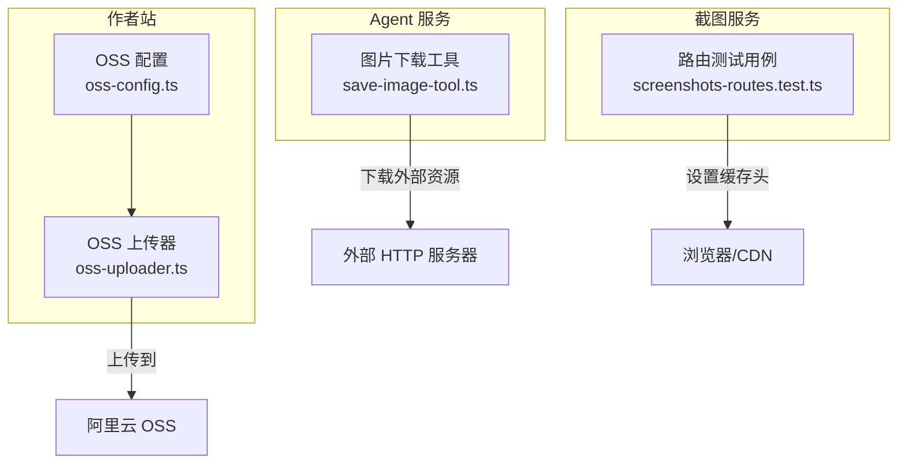
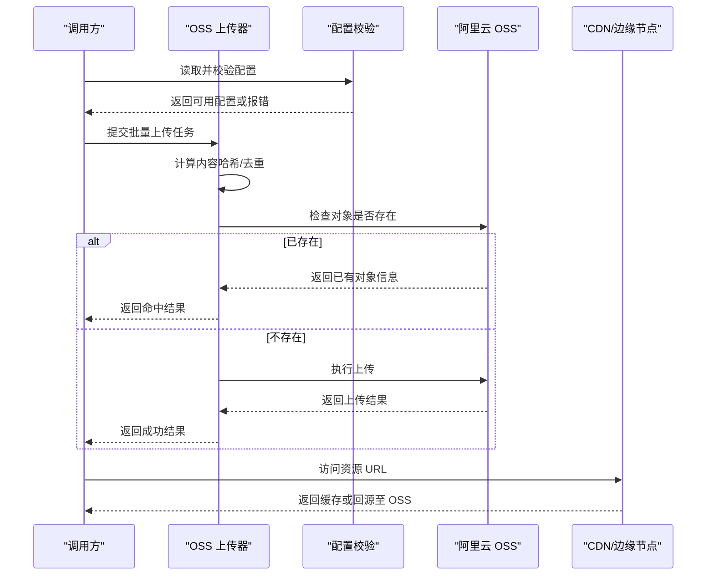
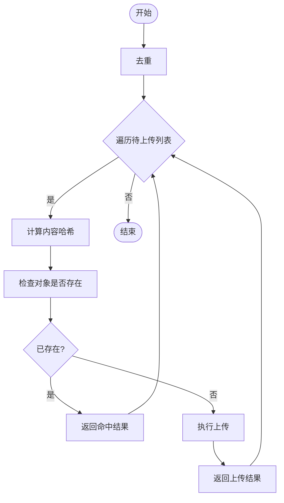
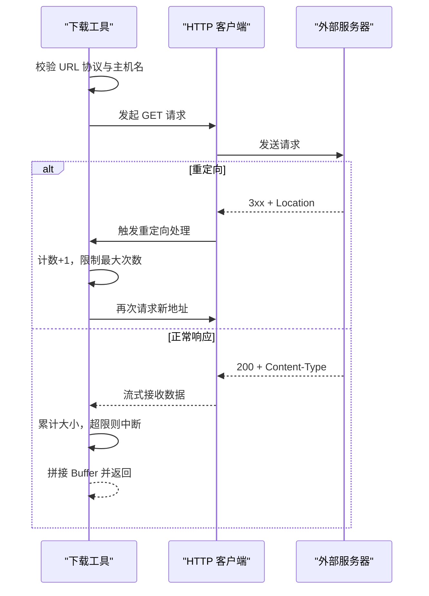
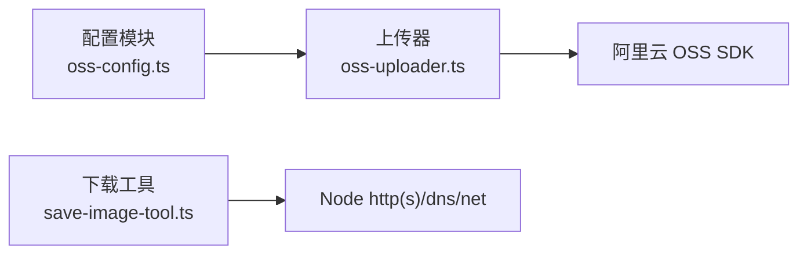

# 云服务存储适配器

<cite>
**本文引用的文件**   
- [packages/author-site/src/lib/publish/oss-uploader.ts](file://packages/author-site/src/lib/publish/oss-uploader.ts)
- [packages/author-site/src/lib/publish/oss-config.ts](file://packages/author-site/src/lib/publish/oss-config.ts)
- [packages/author-site/src/lib/publish/__tests__/oss-config.test.ts](file://packages/author-site/src/lib/publish/__tests__/oss-config.test.ts)
- [packages/agent-service/src/backends/pi-tools/save-image-tool.ts](file://packages/agent-service/src/backends/pi-tools/save-image-tool.ts)
- [packages/screenshot-service/tests/screenshots-routes.test.ts](file://packages/screenshot-service/tests/screenshots-routes.test.ts)
</cite>

## 目录
1. [简介](#简介)
2. [项目结构](#项目结构)
3. [核心组件](#核心组件)
4. [架构总览](#架构总览)
5. [详细组件分析](#详细组件分析)
6. [依赖分析](#依赖分析)
7. [性能考虑](#性能考虑)
8. [故障排查指南](#故障排查指南)
9. [结论](#结论)
10. [附录](#附录)

## 简介
本指南面向需要扩展或定制云存储能力的开发者，聚焦于“存储抽象层设计、现有云服务商适配实现、自定义适配器开发、缓存与 CDN 集成、并发与批量操作、错误恢复、安全与成本优化、监控指标”等主题。仓库中已包含阿里云 OSS 的上传适配与配置校验逻辑，以及图片下载工具的安全校验与回源策略；同时提供截图服务中对不可变缓存的使用示例。基于这些素材，本文给出可落地的设计与实践建议，帮助你在不侵入上层业务的前提下，平滑接入新的对象存储服务并提升整体稳定性与性能。

## 项目结构
围绕存储相关能力，仓库中与本次主题直接相关的代码主要分布在以下位置：
- 作者站发布模块：阿里云 OSS 上传器与配置校验
- Agent 服务：图片下载工具（含 URL 安全校验、重定向限制、大小限制）
- 截图服务测试：展示不可变缓存头的使用方式

图表来源
- [packages/author-site/src/lib/publish/oss-config.ts](file://packages/author-site/src/lib/publish/oss-config.ts)
- [packages/author-site/src/lib/publish/oss-uploader.ts](file://packages/author-site/src/lib/publish/oss-uploader.ts)
- [packages/agent-service/src/backends/pi-tools/save-image-tool.ts](file://packages/agent-service/src/backends/pi-tools/save-image-tool.ts)
- [packages/screenshot-service/tests/screenshots-routes.test.ts](file://packages/screenshot-service/tests/screenshots-routes.test.ts)

章节来源
- [packages/author-site/src/lib/publish/oss-config.ts](file://packages/author-site/src/lib/publish/oss-config.ts)
- [packages/author-site/src/lib/publish/oss-uploader.ts](file://packages/author-site/src/lib/publish/oss-uploader.ts)
- [packages/agent-service/src/backends/pi-tools/save-image-tool.ts](file://packages/agent-service/src/backends/pi-tools/save-image-tool.ts)
- [packages/screenshot-service/tests/screenshots-routes.test.ts](file://packages/screenshot-service/tests/screenshots-routes.test.ts)

## 核心组件
- 阿里云 OSS 配置与校验
  - 从环境变量读取 region、accessKeyId、accessKeySecret、bucket、endpoint、pathPrefix 等参数，并在缺失必填项时抛出明确错误码，便于快速定位配置问题。
  - 提供 isOSSConfigured 便捷方法用于运行时能力探测。
- 阿里云 OSS 上传器
  - 支持批量上传、去重、进度回调、内容哈希命名、存在性检查与失败结果聚合。
  - 使用 MD5 作为内容指纹生成稳定 Key，避免重复上传，降低存储与网络开销。
- 图片下载工具（Agent 服务）
  - 对目标 URL 进行协议白名单、域名解析与私有地址拦截，防止 SSRF。
  - 限制最大重定向次数、响应体大小与超时时间，保障健壮性与资源可控。
- 截图服务不可变缓存
  - 通过设置 cache-control: public, max-age=31536000, immutable，配合内容哈希路径实现强缓存与版本化分发。

章节来源
- [packages/author-site/src/lib/publish/oss-config.ts](file://packages/author-site/src/lib/publish/oss-config.ts)
- [packages/author-site/src/lib/publish/__tests__/oss-config.test.ts](file://packages/author-site/src/lib/publish/__tests__/oss-config.test.ts)
- [packages/author-site/src/lib/publish/oss-uploader.ts](file://packages/author-site/src/lib/publish/oss-uploader.ts)
- [packages/agent-service/src/backends/pi-tools/save-image-tool.ts](file://packages/agent-service/src/backends/pi-tools/save-image-tool.ts)
- [packages/screenshot-service/tests/screenshots-routes.test.ts](file://packages/screenshot-service/tests/screenshots-routes.test.ts)

## 架构总览
下图展示了“上传—去重—存储—分发”的整体流程，以及“下载—安全校验—回源”的链路。

图表来源
- [packages/author-site/src/lib/publish/oss-config.ts](file://packages/author-site/src/lib/publish/oss-config.ts)
- [packages/author-site/src/lib/publish/oss-uploader.ts](file://packages/author-site/src/lib/publish/oss-uploader.ts)

## 详细组件分析

### 组件一：阿里云 OSS 配置与校验
- 职责
  - 集中管理 OSS 连接参数，提供运行时可用性检测。
- 关键行为
  - 必填字段校验：region、accessKeyId、accessKeySecret、bucket。
  - 可选字段：endpoint、pathPrefix。
  - 错误码：未配置时抛出统一错误码，便于上层捕获与降级。
- 建议
  - 在进程启动阶段完成配置校验，尽早暴露问题。
  - 将敏感信息通过环境变量注入，避免硬编码。

章节来源
- [packages/author-site/src/lib/publish/oss-config.ts](file://packages/author-site/src/lib/publish/oss-config.ts)
- [packages/author-site/src/lib/publish/__tests__/oss-config.test.ts](file://packages/author-site/src/lib/publish/__tests__/oss-config.test.ts)

### 组件二：阿里云 OSS 上传器
- 职责
  - 封装批量上传、去重、进度上报、失败聚合等能力。
- 关键行为
  - 内容哈希命名：以 MD5 作为文件名主体，保证幂等与去重。
  - 存在性检查：先查后传，减少冗余写入。
  - 并发控制：支持 concurrency 参数控制并发度。
  - 进度回调：onProgress(current, total) 反馈上传进度。
  - 结果聚合：返回每个文件的本地路径、云端 URL、Key、大小与成功状态。
- 数据流
  - 输入：ImageReference[] + 上传选项
  - 处理：去重 → 计算哈希 → 存在性检查 → 上传（必要时）
  - 输出：UploadResult[]
- 复杂度
  - 时间：O(N) 次哈希与存在性检查，加上 N 次上传（去重后）。
  - 空间：O(N) 保存结果集与去重集合。
- 建议
  - 大文件场景可改用分片上传与断点续传。
  - 结合 CDN 开启压缩与缓存，降低回源压力。

图表来源
- [packages/author-site/src/lib/publish/oss-uploader.ts](file://packages/author-site/src/lib/publish/oss-uploader.ts)

章节来源
- [packages/author-site/src/lib/publish/oss-uploader.ts](file://packages/author-site/src/lib/publish/oss-uploader.ts)

### 组件三：图片下载工具（安全与回源）
- 职责
  - 安全地拉取外部图片资源，并进行严格的入参与网络校验。
- 关键行为
  - URL 校验：仅允许 http/https 协议，禁止 localhost 与内网地址。
  - DNS 解析校验：解析后拒绝私有 IP。
  - 重定向限制：最多 3 次重定向，防止循环跳转。
  - 大小限制：超过阈值立即中断，避免内存溢出。
  - 类型校验：Content-Type 必须为 image/*。
  - 超时保护：请求超时即终止。
- 建议
  - 增加重试与退避策略，提高弱网环境成功率。
  - 记录详细的错误码与上下文，便于排障。

图表来源
- [packages/agent-service/src/backends/pi-tools/save-image-tool.ts](file://packages/agent-service/src/backends/pi-tools/save-image-tool.ts)

章节来源
- [packages/agent-service/src/backends/pi-tools/save-image-tool.ts](file://packages/agent-service/src/backends/pi-tools/save-image-tool.ts)

### 组件四：不可变缓存与版本化分发
- 职责
  - 通过强缓存与内容哈希路径，确保资源版本一致性与高命中率。
- 关键行为
  - 设置 cache-control: public, max-age=31536000, immutable。
  - 使用 hash 作为路径的一部分，变更内容即变更 URL，天然版本化。
- 建议
  - 与 CDN 联动，开启边缘缓存与预热。
  - 对热资源启用预取与预加载。

章节来源
- [packages/screenshot-service/tests/screenshots-routes.test.ts](file://packages/screenshot-service/tests/screenshots-routes.test.ts)

## 依赖分析
- 内部依赖
  - 上传器依赖配置模块进行参数校验与初始化。
  - 下载工具独立运行，但可与上传器组合形成“拉取—清洗—上传”流水线。
- 外部依赖
  - 阿里云 OSS SDK：负责与 OSS 交互。
  - Node.js 标准库：fs、crypto、http(s)、dns、net 等。
- 耦合与内聚
  - 配置与上传解耦，便于替换不同后端。
  - 下载工具具备较强内聚性，适合复用为通用资源拉取组件。

图表来源
- [packages/author-site/src/lib/publish/oss-config.ts](file://packages/author-site/src/lib/publish/oss-config.ts)
- [packages/author-site/src/lib/publish/oss-uploader.ts](file://packages/author-site/src/lib/publish/oss-uploader.ts)
- [packages/agent-service/src/backends/pi-tools/save-image-tool.ts](file://packages/agent-service/src/backends/pi-tools/save-image-tool.ts)

章节来源
- [packages/author-site/src/lib/publish/oss-config.ts](file://packages/author-site/src/lib/publish/oss-config.ts)
- [packages/author-site/src/lib/publish/oss-uploader.ts](file://packages/author-site/src/lib/publish/oss-uploader.ts)
- [packages/agent-service/src/backends/pi-tools/save-image-tool.ts](file://packages/agent-service/src/backends/pi-tools/save-image-tool.ts)

## 性能考虑
- 上传侧
  - 并发控制：根据 CPU 与网络带宽调整 concurrency。
  - 去重与存在性检查：显著降低重复上传与写放大。
  - 大文件：采用分片上传与断点续传，提升可靠性与吞吐。
- 下载侧
  - 流式处理：避免一次性加载大文件到内存。
  - 超时与大小限制：防止资源耗尽。
  - 重试与退避：在网络抖动时提升成功率。
- 缓存与 CDN
  - 不可变缓存：结合内容哈希实现长期缓存。
  - 预热与预取：对热点资源提前下发至边缘。
  - 压缩与格式优化：优先使用 WebP/AVIF，减小体积。

[本节为通用指导，无需源码引用]

## 故障排查指南
- 配置缺失
  - 现象：启动时报错提示未配置。
  - 排查：检查环境变量是否完整，确认必填项齐全。
- 上传失败
  - 现象：部分文件上传失败，返回错误码。
  - 排查：查看失败结果中的 error 字段，检查网络、权限与 Bucket 策略。
- 下载异常
  - 现象：下载失败或超时。
  - 排查：确认 URL 合法、非私有地址、Content-Type 正确、未超过大小限制与重定向次数。
- 缓存未命中
  - 现象：资源频繁回源。
  - 排查：确认 cache-control 与 URL 版本化是否正确设置。

章节来源
- [packages/author-site/src/lib/publish/__tests__/oss-config.test.ts](file://packages/author-site/src/lib/publish/__tests__/oss-config.test.ts)
- [packages/author-site/src/lib/publish/oss-uploader.ts](file://packages/author-site/src/lib/publish/oss-uploader.ts)
- [packages/agent-service/src/backends/pi-tools/save-image-tool.ts](file://packages/agent-service/src/backends/pi-tools/save-image-tool.ts)
- [packages/screenshot-service/tests/screenshots-routes.test.ts](file://packages/screenshot-service/tests/screenshots-routes.test.ts)

## 结论
通过统一的配置校验与上传器封装，系统已具备可扩展的云存储能力基础。结合下载工具的安全校验与截图服务的不可变缓存实践，可在不改动上层业务的情况下，平滑接入更多云服务商，并通过 CDN 与缓存策略显著提升性能与稳定性。建议在后续迭代中完善接口抽象、增加重试与监控埋点，并引入分片上传与更细粒度的错误分类，以支撑更大规模与更高可用的生产场景。

[本节为总结性内容，无需源码引用]

## 附录

### 自定义存储适配器开发清单
- 接口定义
  - 统一上传接口：支持单文件与批量、进度回调、失败聚合。
  - 统一下载接口：支持流式下载、大小限制、超时控制。
  - 元数据接口：获取对象大小、类型、最后修改时间等。
- 配置管理
  - 集中读取环境变量，提供 isConfigured 能力探测。
  - 支持 endpoint、region、bucket、密钥等差异化配置。
- 并发与批量
  - 并发度可调，支持任务队列与背压。
  - 失败重试与指数退避。
- 错误恢复
  - 区分可重试与不可重试错误。
  - 记录结构化日志与错误码。
- 缓存与 CDN
  - 内容哈希命名，配合不可变缓存。
  - 预热与预取策略。
- 安全与合规
  - URL 白名单、私有地址拦截、SSRF 防护。
  - 最小权限原则与密钥轮换。
- 监控指标
  - 上传/下载成功率、耗时分布、失败原因分布。
  - 缓存命中率、回源率、带宽与 IOPS。
  - 配额与用量告警。

[本节为通用指导，无需源码引用]