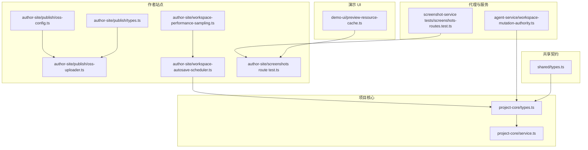
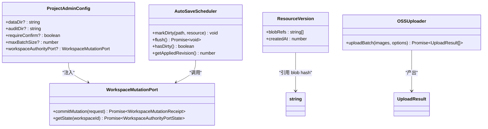
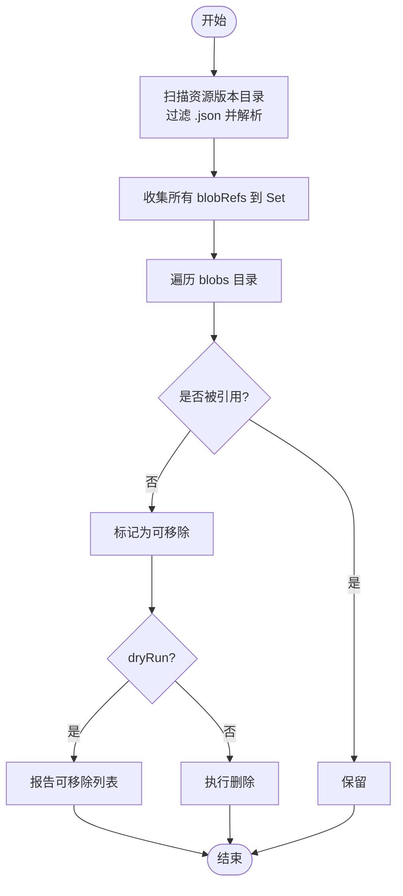
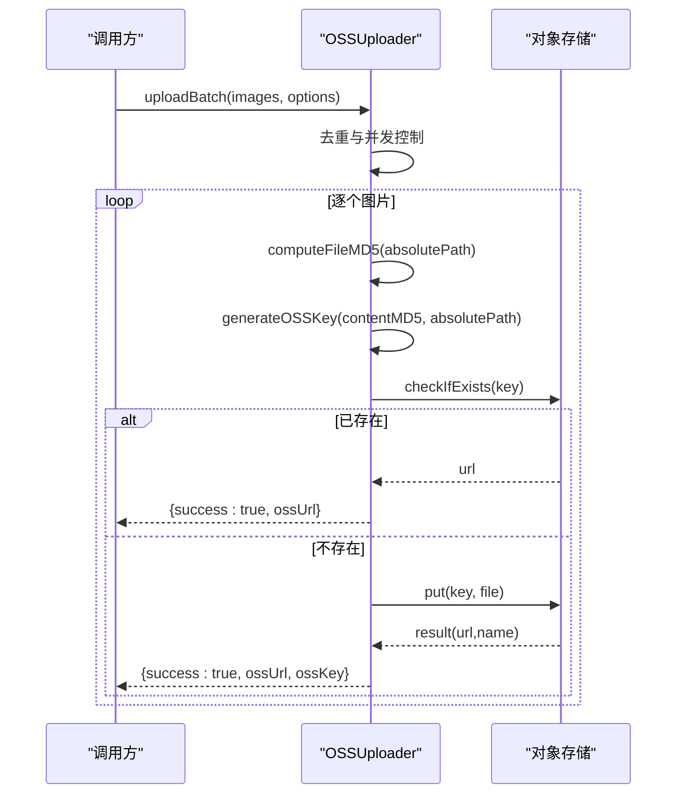
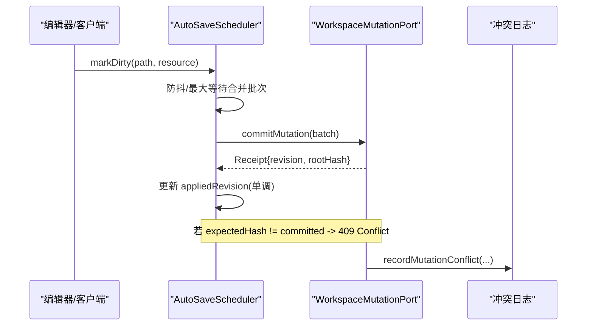
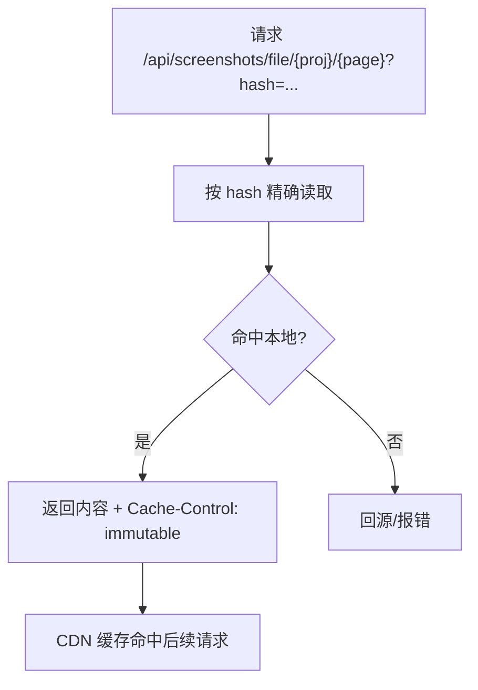
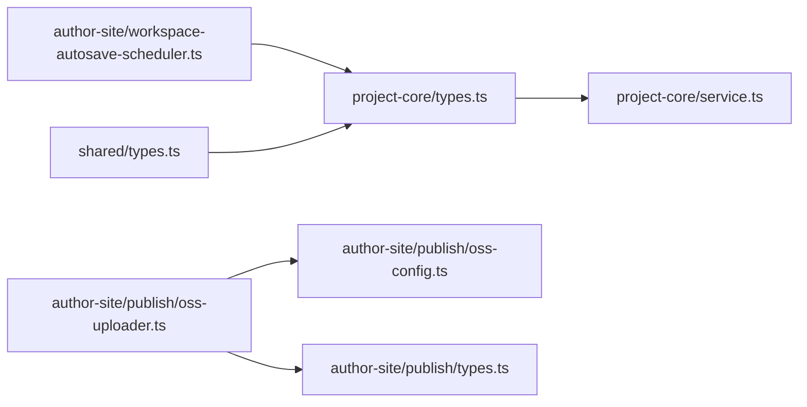

# 存储抽象层设计

<cite>
**本文引用的文件**   
- [packages/project-core/src/types.ts](file://packages/project-core/src/types.ts)
- [packages/project-core/src/service.ts](file://packages/project-core/src/service.ts)
- [packages/shared/src/types.ts](file://packages/shared/src/types.ts)
- [packages/author-site/src/lib/publish/oss-config.ts](file://packages/author-site/src/lib/publish/oss-config.ts)
- [packages/author-site/src/lib/publish/oss-uploader.ts](file://packages/author-site/src/lib/publish/oss-uploader.ts)
- [packages/author-site/src/lib/publish/types.ts](file://packages/author-site/src/lib/publish/types.ts)
- [packages/agent-service/src/workspace/workspace-mutation-authority.ts](file://packages/agent-service/src/workspace/workspace-mutation-authority.ts)
- [packages/author-site/src/lib/workspace-autosave-scheduler.ts](file://packages/author-site/src/lib/workspace-autosave-scheduler.ts)
- [packages/author-site/src/lib/workspace-performance-sampling.ts](file://packages/author-site/src/lib/workspace-performance-sampling.ts)
- [packages/screenshot-service/tests/screenshots-routes.test.ts](file://packages/screenshot-service/tests/screenshots-routes.test.ts)
- [packages/author-site/src/app/api/screenshots/file/[projectId]/[pageId]/route.test.ts](file://packages/author-site/src/app/api/screenshots/file/[projectId]/[pageId]/route.test.ts)
- [packages/demo-ui/src/preview-resource-cache.ts](file://packages/demo-ui/src/preview-resource-cache.ts)
- [test/创作端E2E回归测试/workspace-mutation-authority.spec.ts](file://test/创作端E2E回归测试/workspace-mutation-authority.spec.ts)
</cite>

## 目录
1. [引言](#引言)
2. [项目结构](#项目结构)
3. [核心组件](#核心组件)
4. [架构总览](#架构总览)
5. [详细组件分析](#详细组件分析)
6. [依赖关系分析](#依赖关系分析)
7. [性能考虑](#性能考虑)
8. [故障排查指南](#故障排查指南)
9. [结论](#结论)
10. [附录](#附录)

## 引言
本技术文档围绕“存储抽象层”的设计与实现进行系统化阐述，覆盖以下关键主题：
- 文件系统接口定义：统一的文件操作 API、路径管理与元数据处理
- 对象存储协议抽象：上传、下载、删除、列表的标准化接口
- 数据一致性保证：事务处理、冲突解决与版本控制
- 缓存策略：本地缓存、分布式缓存与 CDN 集成
- 适配器注册表：动态加载、配置管理与错误处理
- 性能优化：连接池管理、批量操作与并发控制

该抽象层的目标是屏蔽底层存储差异（本地磁盘、对象存储等），向上提供一致、可组合、可扩展的存储能力，同时保障高可用、强一致或最终一致的语义选择。

## 项目结构
从仓库中可见，存储相关能力分布在多个包中：
- project-core：项目内容、资源版本、Blob 去重与垃圾回收、工作区权限与提交回执等核心逻辑
- author-site：发布流程中的对象存储适配（OSS）、截图服务按哈希精确读取与不可变缓存、自动保存调度器
- agent-service：工作区写入冲突记录、回执延迟度量等
- demo-ui：预览资源预热与 LRU 缓存
- shared：统一错误码与响应类型

图表来源
- [packages/project-core/src/types.ts:125-153](file://packages/project-core/src/types.ts#L125-L153)
- [packages/project-core/src/service.ts:2185-2225](file://packages/project-core/src/service.ts#L2185-L2225)
- [packages/author-site/src/lib/publish/oss-config.ts:1-34](file://packages/author-site/src/lib/publish/oss-config.ts#L1-L34)
- [packages/author-site/src/lib/publish/oss-uploader.ts:1-141](file://packages/author-site/src/lib/publish/oss-uploader.ts#L1-L141)
- [packages/author-site/src/lib/publish/types.ts:1-23](file://packages/author-site/src/lib/publish/types.ts#L1-L23)
- [packages/author-site/src/lib/workspace-autosave-scheduler.ts:120-250](file://packages/author-site/src/lib/workspace-autosave-scheduler.ts#L120-L250)
- [packages/author-site/src/lib/workspace-performance-sampling.ts:201-248](file://packages/author-site/src/lib/workspace-performance-sampling.ts#L201-L248)
- [packages/agent-service/src/workspace/workspace-mutation-authority.ts:675-708](file://packages/agent-service/src/workspace/workspace-mutation-authority.ts#L675-L708)
- [packages/screenshot-service/tests/screenshots-routes.test.ts:617-652](file://packages/screenshot-service/tests/screenshots-routes.test.ts#L617-L652)
- [packages/author-site/src/app/api/screenshots/file/[projectId]/[pageId]/route.test.ts:89-130](file://packages/author-site/src/app/api/screenshots/file/[projectId]/[pageId]/route.test.ts#L89-L130)
- [packages/demo-ui/src/preview-resource-cache.ts:198-245](file://packages/demo-ui/src/preview-resource-cache.ts#L198-L245)
- [packages/shared/src/types.ts:48-86](file://packages/shared/src/types.ts#L48-L86)

章节来源
- [packages/project-core/src/types.ts:125-153](file://packages/project-core/src/types.ts#L125-L153)
- [packages/project-core/src/service.ts:2185-2225](file://packages/project-core/src/service.ts#L2185-L2225)
- [packages/author-site/src/lib/publish/oss-config.ts:1-34](file://packages/author-site/src/lib/publish/oss-config.ts#L1-L34)
- [packages/author-site/src/lib/publish/oss-uploader.ts:1-141](file://packages/author-site/src/lib/publish/oss-uploader.ts#L1-L141)
- [packages/author-site/src/lib/publish/types.ts:1-23](file://packages/author-site/src/lib/publish/types.ts#L1-L23)
- [packages/author-site/src/lib/workspace-autosave-scheduler.ts:120-250](file://packages/author-site/src/lib/workspace-autosave-scheduler.ts#L120-L250)
- [packages/author-site/src/lib/workspace-performance-sampling.ts:201-248](file://packages/author-site/src/lib/workspace-performance-sampling.ts#L201-L248)
- [packages/agent-service/src/workspace/workspace-mutation-authority.ts:675-708](file://packages/agent-service/src/workspace/workspace-mutation-authority.ts#L675-L708)
- [packages/screenshot-service/tests/screenshots-routes.test.ts:617-652](file://packages/screenshot-service/tests/screenshots-routes.test.ts#L617-L652)
- [packages/author-site/src/app/api/screenshots/file/[projectId]/[pageId]/route.test.ts:89-130](file://packages/author-site/src/app/api/screenshots/file/[projectId]/[pageId]/route.test.ts#L89-L130)
- [packages/demo-ui/src/preview-resource-cache.ts:198-245](file://packages/demo-ui/src/preview-resource-cache.ts#L198-L245)
- [packages/shared/src/types.ts:48-86](file://packages/shared/src/types.ts#L48-L86)

## 核心组件
- 工作区写入端口与回执
  - WorkspaceMutationPort：对外暴露 commitMutation 与 getState，用于将工作区变更以幂等方式持久化并获取权威状态
  - WorkspaceAuthorityPortState：包含 revision、rootHash、resourceHashes 等一致性快照信息
- 资源版本与 Blob 去重
  - 资源版本目录扫描、排序与读取
  - 基于内容哈希的 Blob 写入与读取，避免重复存储
  - 内容垃圾回收：统计引用集合，识别可移除 Blob
- 对象存储适配（OSS）
  - 配置校验与环境变量注入
  - 批量上传、去重（按内容 MD5）、并发控制与进度回调
- 自动保存调度器
  - 防抖与最大等待时间合并批次
  - 单调递增的已应用 revision 维护
  - in-flight 期间脏数据的下一批迁移
- 截图服务与不可变缓存
  - 按 hash 精确读取，返回不可变缓存头
- 预览资源缓存
  - LRU 淘汰、预取并发限制、失败不抛错

章节来源
- [packages/project-core/src/types.ts:125-153](file://packages/project-core/src/types.ts#L125-L153)
- [packages/project-core/src/service.ts:4928-4963](file://packages/project-core/src/service.ts#L4928-L4963)
- [packages/project-core/src/service.ts:2185-2225](file://packages/project-core/src/service.ts#L2185-L2225)
- [packages/author-site/src/lib/publish/oss-config.ts:1-34](file://packages/author-site/src/lib/publish/oss-config.ts#L1-L34)
- [packages/author-site/src/lib/publish/oss-uploader.ts:1-141](file://packages/author-site/src/lib/publish/oss-uploader.ts#L1-L141)
- [packages/author-site/src/lib/workspace-autosave-scheduler.ts:120-250](file://packages/author-site/src/lib/workspace-autosave-scheduler.ts#L120-L250)
- [packages/screenshot-service/tests/screenshots-routes.test.ts:617-652](file://packages/screenshot-service/tests/screenshots-routes.test.ts#L617-L652)
- [packages/author-site/src/app/api/screenshots/file/[projectId]/[pageId]/route.test.ts:89-130](file://packages/author-site/src/app/api/screenshots/file/[projectId]/[pageId]/route.test.ts#L89-L130)
- [packages/demo-ui/src/preview-resource-cache.ts:198-245](file://packages/demo-ui/src/preview-resource-cache.ts#L198-L245)

## 架构总览
存储抽象层由“统一接口 + 多后端适配 + 一致性协调 + 缓存层”构成：
- 统一接口：通过 ProjectAdminConfig 注入 WorkspaceMutationPort，上层无需感知具体存储
- 后端适配：本地磁盘（Blob 去重、版本目录）、对象存储（OSS 批量上传）
- 一致性协调：revision 单调递增、冲突回执、草稿 barrier
- 缓存层：截图不可变缓存、预览资源 LRU 预热

图表来源
- [packages/project-core/src/types.ts:125-153](file://packages/project-core/src/types.ts#L125-L153)
- [packages/author-site/src/lib/publish/oss-uploader.ts:1-141](file://packages/author-site/src/lib/publish/oss-uploader.ts#L1-L141)
- [packages/author-site/src/lib/workspace-autosave-scheduler.ts:120-250](file://packages/author-site/src/lib/workspace-autosave-scheduler.ts#L120-L250)

## 详细组件分析

### 文件系统接口与路径管理
- 统一入口
  - ProjectAdminConfig.workspaceAuthorityPort 提供 commitMutation/getState，使上层对存储细节无感
- 路径与元数据
  - 资源版本目录按 kind/resourceId 组织，每个版本为 JSON 元数据，包含 blobRefs 与 createdAt
  - Blob 目录按内容哈希命名，支持去重与垃圾回收
- 典型流程
  - 列出资源版本：扫描目录、过滤 .json、反序列化为 ResourceVersion、按创建时间倒序
  - 写入 Blob：计算内容哈希，若不存在则落盘，返回哈希供版本元数据引用
  - 垃圾回收：遍历所有资源版本收集被引用的哈希，对比 blobs 目录找出可移除项

图表来源
- [packages/project-core/src/service.ts:4928-4963](file://packages/project-core/src/service.ts#L4928-L4963)
- [packages/project-core/src/service.ts:2185-2225](file://packages/project-core/src/service.ts#L2185-L2225)

章节来源
- [packages/project-core/src/service.ts:4928-4963](file://packages/project-core/src/service.ts#L4928-L4963)
- [packages/project-core/src/service.ts:2185-2225](file://packages/project-core/src/service.ts#L2185-L2225)

### 对象存储协议抽象（OSS）
- 配置管理
  - 从环境变量读取 region、accessKeyId、accessKeySecret、bucket、endpoint、pathPrefix
  - 缺失必填项时抛出明确错误码，便于上层快速诊断
- 上传流程
  - 去重：按本地文件 MD5 生成唯一 key，先检查是否存在，存在则直接复用 URL
  - 并发：支持 concurrency 参数控制并行度
  - 进度：onProgress 回调上报完成数与总数
- 结果模型
  - UploadResult 包含本地路径、OSS URL、key、大小、成功标志与错误信息

图表来源
- [packages/author-site/src/lib/publish/oss-config.ts:1-34](file://packages/author-site/src/lib/publish/oss-config.ts#L1-L34)
- [packages/author-site/src/lib/publish/oss-uploader.ts:1-141](file://packages/author-site/src/lib/publish/oss-uploader.ts#L1-L141)
- [packages/author-site/src/lib/publish/types.ts:1-23](file://packages/author-site/src/lib/publish/types.ts#L1-L23)

章节来源
- [packages/author-site/src/lib/publish/oss-config.ts:1-34](file://packages/author-site/src/lib/publish/oss-config.ts#L1-L34)
- [packages/author-site/src/lib/publish/oss-uploader.ts:1-141](file://packages/author-site/src/lib/publish/oss-uploader.ts#L1-L141)
- [packages/author-site/src/lib/publish/types.ts:1-23](file://packages/author-site/src/lib/publish/types.ts#L1-L23)

### 数据一致性保证机制
- 事务与回执
  - 通过 WorkspaceMutationPort.commitMutation 提交变更，返回 WorkspaceMutationReceipt
  - 自动保存调度器维护 appliedRevision，仅接受 >= 当前已应用的回执，确保单调性
- 冲突检测与处理
  - 当 expectedHash 与 committed hash 不一致时，返回 409 冲突；客户端需重新读取后重试
  - 协同房间 dirty 时，外部修改前需 flush 草稿，失败则拒绝继续写
- 冲突日志与健康计数
  - 记录 conflicted 事件，包含 mutationId、baseRevision、actor 等上下文
  - 回执延迟度量用于监控投影 ack 表现

图表来源
- [packages/author-site/src/lib/workspace-autosave-scheduler.ts:120-250](file://packages/author-site/src/lib/workspace-autosave-scheduler.ts#L120-L250)
- [packages/agent-service/src/workspace/workspace-mutation-authority.ts:675-708](file://packages/agent-service/src/workspace/workspace-mutation-authority.ts#L675-L708)
- [test/创作端E2E回归测试/workspace-mutation-authority.spec.ts:437-479](file://test/创作端E2E回归测试/workspace-mutation-authority.spec.ts#L437-L479)

章节来源
- [packages/author-site/src/lib/workspace-autosave-scheduler.ts:120-250](file://packages/author-site/src/lib/workspace-autosave-scheduler.ts#L120-L250)
- [packages/agent-service/src/workspace/workspace-mutation-authority.ts:675-708](file://packages/agent-service/src/workspace/workspace-mutation-authority.ts#L675-L708)
- [test/创作端E2E回归测试/workspace-mutation-authority.spec.ts:437-479](file://test/创作端E2E回归测试/workspace-mutation-authority.spec.ts#L437-L479)

### 缓存策略设计
- 本地缓存（截图）
  - 按 hash 精确读取，返回不可变缓存头，适合长期分发与 CDN 缓存
- 分布式缓存与 CDN
  - 对象存储 URL 天然具备 CDN 友好特性；结合 pathPrefix 与内容哈希 key，可实现稳定命中
- 浏览器侧预热与 LRU
  - 预览资源预热队列受并发限制，LRU 淘汰超出阈值的条目，失败不抛错

图表来源
- [packages/screenshot-service/tests/screenshots-routes.test.ts:617-652](file://packages/screenshot-service/tests/screenshots-routes.test.ts#L617-L652)
- [packages/author-site/src/app/api/screenshots/file/[projectId]/[pageId]/route.test.ts:89-130](file://packages/author-site/src/app/api/screenshots/file/[projectId]/[pageId]/route.test.ts#L89-L130)
- [packages/demo-ui/src/preview-resource-cache.ts:198-245](file://packages/demo-ui/src/preview-resource-cache.ts#L198-L245)

章节来源
- [packages/screenshot-service/tests/screenshots-routes.test.ts:617-652](file://packages/screenshot-service/tests/screenshots-routes.test.ts#L617-L652)
- [packages/author-site/src/app/api/screenshots/file/[projectId]/[pageId]/route.test.ts:89-130](file://packages/author-site/src/app/api/screenshots/file/[projectId]/[pageId]/route.test.ts#L89-L130)
- [packages/demo-ui/src/preview-resource-cache.ts:198-245](file://packages/demo-ui/src/preview-resource-cache.ts#L198-L245)

### 适配器注册表实现（建议方案）
说明：当前仓库未提供显式的“适配器注册表”模块，但可通过如下模式在现有基础上扩展：
- 动态加载
  - 使用工厂函数根据配置（如 provider 字段）返回对应适配器实例（本地磁盘、OSS、S3 兼容等）
- 配置管理
  - 集中式配置对象（类似 OSSConfig），各适配器按需读取环境变量或远程配置中心
- 错误处理
  - 统一错误映射至 shared 的错误码体系，便于上层一致处理
- 示例接口（概念性）
  - StorageAdapter：提供 upload/download/delete/list/metadata 等方法
  - AdapterRegistry：register(provider, factory)、get(provider)、create(config)

本节为概念性设计，不对应具体源码文件，故不附“章节来源”。

## 依赖关系分析
- 耦合与内聚
  - project-core 内部自包含资源版本与 Blob 管理，内聚度高
  - author-site 的 OSS 上传与自动保存调度器分别依赖 types 与 port 接口，解耦良好
- 外部依赖
  - OSS 客户端库、文件系统 API、HTTP 路由与测试框架
- 潜在循环依赖
  - 通过接口（WorkspaceMutationPort）与类型（types.ts）隔离，避免循环引用

图表来源
- [packages/project-core/src/types.ts:125-153](file://packages/project-core/src/types.ts#L125-L153)
- [packages/author-site/src/lib/workspace-autosave-scheduler.ts:120-250](file://packages/author-site/src/lib/workspace-autosave-scheduler.ts#L120-L250)
- [packages/author-site/src/lib/publish/oss-uploader.ts:1-141](file://packages/author-site/src/lib/publish/oss-uploader.ts#L1-L141)
- [packages/author-site/src/lib/publish/oss-config.ts:1-34](file://packages/author-site/src/lib/publish/oss-config.ts#L1-L34)
- [packages/author-site/src/lib/publish/types.ts:1-23](file://packages/author-site/src/lib/publish/types.ts#L1-L23)
- [packages/shared/src/types.ts:48-86](file://packages/shared/src/types.ts#L48-L86)

章节来源
- [packages/project-core/src/types.ts:125-153](file://packages/project-core/src/types.ts#L125-L153)
- [packages/author-site/src/lib/workspace-autosave-scheduler.ts:120-250](file://packages/author-site/src/lib/workspace-autosave-scheduler.ts#L120-L250)
- [packages/author-site/src/lib/publish/oss-uploader.ts:1-141](file://packages/author-site/src/lib/publish/oss-uploader.ts#L1-L141)
- [packages/author-site/src/lib/publish/oss-config.ts:1-34](file://packages/author-site/src/lib/publish/oss-config.ts#L1-L34)
- [packages/author-site/src/lib/publish/types.ts:1-23](file://packages/author-site/src/lib/publish/types.ts#L1-L23)
- [packages/shared/src/types.ts:48-86](file://packages/shared/src/types.ts#L48-L86)

## 性能考虑
- 连接池管理
  - 对象存储 SDK 通常内置连接池；建议根据吞吐与超时配置合理设置并发度
- 批量操作
  - 自动保存调度器将多次变更合并为一批提交，减少网络与 I/O 开销
  - OSS 上传支持并发与进度回调，提升大体积资源上传效率
- 并发控制
  - 预览资源预热限制并发，避免阻塞主线程
  - 截图渲染任务按优先级与并发上限调度
- 指标与 SLO
  - 记录队列等待、提交延迟、远程更新延迟、投影延迟等指标，形成 SLO 报告

章节来源
- [packages/author-site/src/lib/workspace-autosave-scheduler.ts:120-250](file://packages/author-site/src/lib/workspace-autosave-scheduler.ts#L120-L250)
- [packages/author-site/src/lib/workspace-performance-sampling.ts:201-248](file://packages/author-site/src/lib/workspace-performance-sampling.ts#L201-L248)
- [packages/author-site/src/lib/publish/oss-uploader.ts:1-141](file://packages/author-site/src/lib/publish/oss-uploader.ts#L1-L141)
- [packages/screenshot-service/tests/screenshots-routes.test.ts:617-652](file://packages/screenshot-service/tests/screenshots-routes.test.ts#L617-L652)

## 故障排查指南
- 常见错误码
  - FILE_READ_ERROR、FILE_WRITE_ERROR、WORKSPACE_STALE、UNAUTHORIZED、FORBIDDEN、INTERNAL_ERROR、UPLOAD_FAILED 等
- 定位步骤
  - 确认配置完整性（如 OSS 必填项）
  - 检查冲突回执与日志（conflicted 事件、receipt 延迟）
  - 验证缓存命中与不可变缓存头是否正确设置
  - 查看自动保存调度器的 hasDirty/inFlight/appliedRevision 状态
- 恢复建议
  - 遇到 WORKSPACE_STALE：刷新项目后重试
  - 遇到 UPLOAD_FAILED：检查网络与凭据，必要时降级到本地暂存
  - 遇到冲突：客户端重新拉取最新资源后重试提交

章节来源
- [packages/shared/src/types.ts:48-86](file://packages/shared/src/types.ts#L48-L86)
- [packages/agent-service/src/workspace/workspace-mutation-authority.ts:675-708](file://packages/agent-service/src/workspace/workspace-mutation-authority.ts#L675-L708)
- [packages/author-site/src/lib/publish/oss-config.ts:1-34](file://packages/author-site/src/lib/publish/oss-config.ts#L1-L34)
- [packages/author-site/src/lib/workspace-autosave-scheduler.ts:120-250](file://packages/author-site/src/lib/workspace-autosave-scheduler.ts#L120-L250)

## 结论
本存储抽象层通过统一接口、版本与去重、对象存储适配、一致性协调与多层缓存，实现了跨后端的一致体验与高性能。建议在后续演进中引入适配器注册表，进一步降低新增后端的接入成本，并通过更完善的指标与告警体系持续优化稳定性与可用性。

## 附录
- 术语
  - Blob：按内容哈希命名的不可变数据块
  - Revision：工作区版本的单调递增编号
  - RootHash：工作区根哈希，代表整体一致性快照
  - Dirty：待提交的变更集合
- 最佳实践
  - 始终通过 WorkspaceMutationPort 提交变更，避免绕过一致性检查
  - 使用内容哈希作为对象存储 key，最大化缓存命中率
  - 为关键路径增加指标采集与 SLO 报告