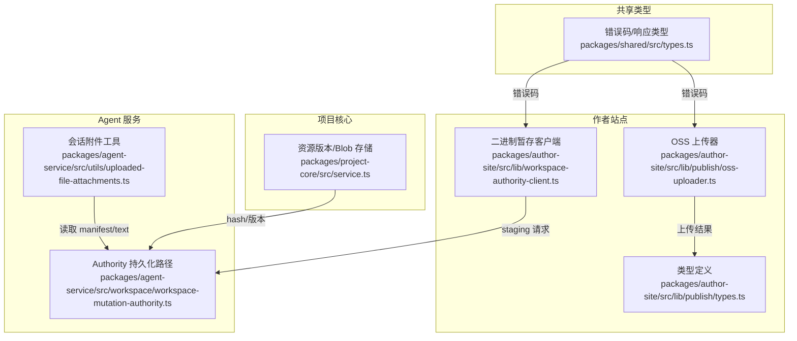
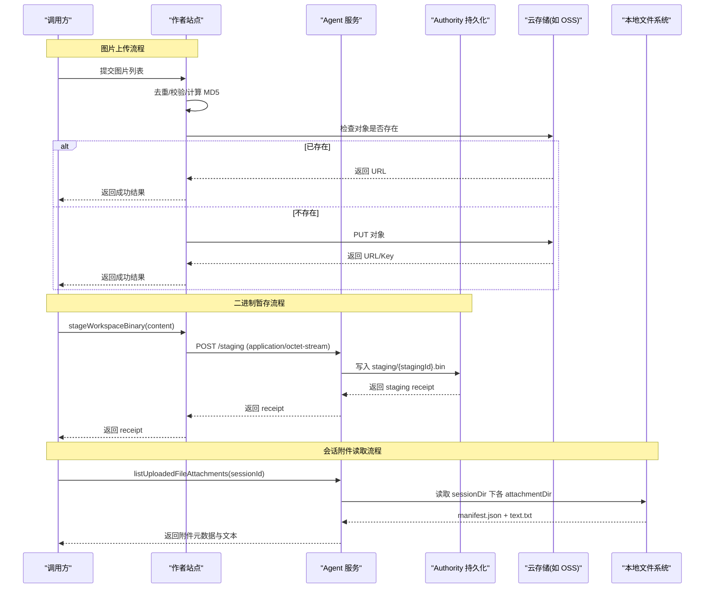
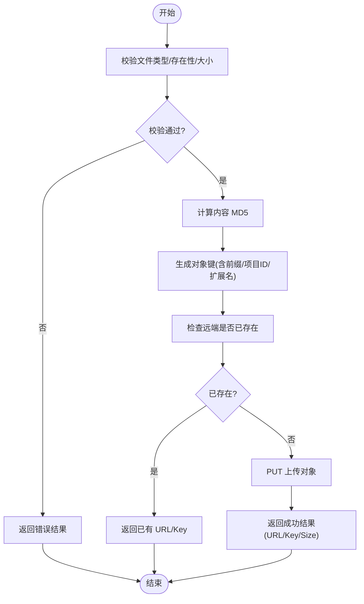
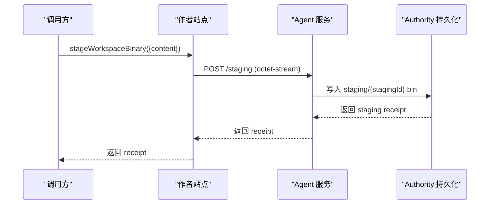
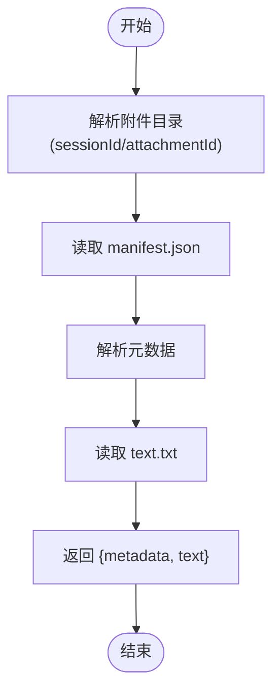
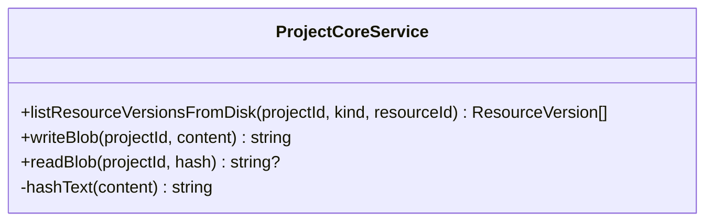
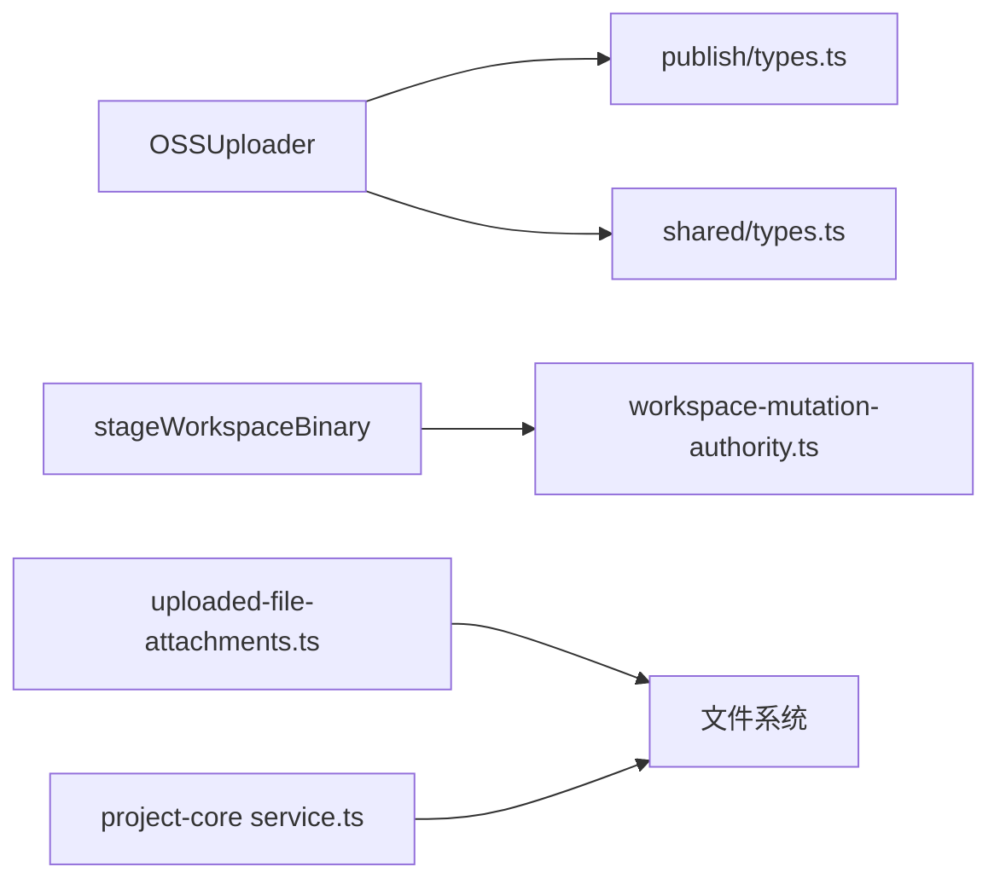

# 对象存储协议抽象

<cite>
**本文引用的文件**   
- [packages/author-site/src/lib/publish/oss-uploader.ts](file://packages/author-site/src/lib/publish/oss-uploader.ts)
- [packages/author-site/src/lib/publish/types.ts](file://packages/author-site/src/lib/publish/types.ts)
- [packages/author-site/src/lib/workspace-authority-client.ts](file://packages/author-site/src/lib/workspace-authority-client.ts)
- [packages/agent-service/src/workspace/workspace-mutation-authority.ts](file://packages/agent-service/src/workspace/workspace-mutation-authority.ts)
- [packages/agent-service/src/utils/uploaded-file-attachments.ts](file://packages/agent-service/src/utils/uploaded-file-attachments.ts)
- [packages/project-core/src/service.ts](file://packages/project-core/src/service.ts)
- [packages/shared/src/types.ts](file://packages/shared/src/types.ts)
</cite>

## 目录
1. [简介](#简介)
2. [项目结构](#项目结构)
3. [核心组件](#核心组件)
4. [架构总览](#架构总览)
5. [详细组件分析](#详细组件分析)
6. [依赖分析](#依赖分析)
7. [性能考虑](#性能考虑)
8. [故障排查指南](#故障排查指南)
9. [结论](#结论)
10. [附录](#附录)

## 简介
本技术文档围绕“对象存储协议抽象”展开，聚焦于上传、下载、删除与列表操作的标准化接口设计，并基于仓库中现有实现梳理适配层（本地文件系统、云存储服务）与数据分片/大文件处理策略。同时说明存储桶管理与命名空间隔离机制，给出适配器开发指南与最佳实践，并提供连接池管理、批量操作与缓存策略等性能优化建议。

## 项目结构
与对象存储协议抽象直接相关的代码主要分布在以下模块：
- 发布与图片上传：author-site 的 OSS 上传器与类型定义
- 工作区二进制暂存：author-site 到 agent-service 的二进制 staging 客户端
- 工作区 Authority 持久化路径：agent-service 内部 state/receipt/staging/backups 等目录布局
- 会话附件读取：agent-service 对已上传文件的清单与文本读取
- 资源版本与 Blob 存储：project-core 的资源版本列举与内容哈希/落盘
- 通用错误码与响应类型：shared 的错误码与统一响应结构

图表来源
- [packages/author-site/src/lib/publish/oss-uploader.ts:1-141](file://packages/author-site/src/lib/publish/oss-uploader.ts#L1-L141)
- [packages/author-site/src/lib/workspace-authority-client.ts:246-277](file://packages/author-site/src/lib/workspace-authority-client.ts#L246-L277)
- [packages/agent-service/src/workspace/workspace-mutation-authority.ts:946-954](file://packages/agent-service/src/workspace/workspace-mutation-authority.ts#L946-L954)
- [packages/agent-service/src/utils/uploaded-file-attachments.ts:40-107](file://packages/agent-service/src/utils/uploaded-file-attachments.ts#L40-L107)
- [packages/project-core/src/service.ts:4928-4963](file://packages/project-core/src/service.ts#L4928-L4963)
- [packages/shared/src/types.ts:1-86](file://packages/shared/src/types.ts#L1-L86)

章节来源
- [packages/author-site/src/lib/publish/oss-uploader.ts:1-141](file://packages/author-site/src/lib/publish/oss-uploader.ts#L1-L141)
- [packages/author-site/src/lib/workspace-authority-client.ts:246-277](file://packages/author-site/src/lib/workspace-authority-client.ts#L246-L277)
- [packages/agent-service/src/workspace/workspace-mutation-authority.ts:946-954](file://packages/agent-service/src/workspace/workspace-mutation-authority.ts#L946-L954)
- [packages/agent-service/src/utils/uploaded-file-attachments.ts:40-107](file://packages/agent-service/src/utils/uploaded-file-attachments.ts#L40-L107)
- [packages/project-core/src/service.ts:4928-4963](file://packages/project-core/src/service.ts#L4928-L4963)
- [packages/shared/src/types.ts:1-86](file://packages/shared/src/types.ts#L1-L86)

## 核心组件
- 对象存储上传器（OSSUploader）
  - 职责：按项目与内容去重生成对象键，校验类型/大小，检查远端是否已存在相同内容，避免重复上传；支持并发批次上传与进度回调。
  - 关键能力：MD5 内容指纹、唯一 Key 生成、存在性探测、批量并发控制、错误分类返回。
- 二进制暂存客户端（stageWorkspaceBinary）
  - 职责：将原始字节写入 Authority 内部的 staging 区域，后续 mutation 仅引用 receipt，不在 JSON 中嵌入二进制。
  - 关键能力：流式二进制上传、幂等 receipt、错误映射为统一错误码。
- Authority 持久化路径
  - 职责：维护 workspace-authority 下的 state、receipts、prepared、staging、backups、reconcile-prepared/receipts 等目录，确保事务可恢复与一致性。
- 会话附件工具
  - 职责：列出与读取会话级上传的文件附件（manifest.json + text.txt），用于 AI 工具只读访问。
- 资源版本与 Blob 存储
  - 职责：列举资源版本、计算内容哈希、以哈希为键进行去重落盘与读取。
- 共享错误码与响应类型
  - 职责：提供统一的错误码集合与消息映射，贯穿上传、暂存、读写等操作。

章节来源
- [packages/author-site/src/lib/publish/oss-uploader.ts:1-141](file://packages/author-site/src/lib/publish/oss-uploader.ts#L1-L141)
- [packages/author-site/src/lib/workspace-authority-client.ts:246-277](file://packages/author-site/src/lib/workspace-authority-client.ts#L246-L277)
- [packages/agent-service/src/workspace/workspace-mutation-authority.ts:946-954](file://packages/agent-service/src/workspace/workspace-mutation-authority.ts#L946-L954)
- [packages/agent-service/src/utils/uploaded-file-attachments.ts:40-107](file://packages/agent-service/src/utils/uploaded-file-attachments.ts#L40-L107)
- [packages/project-core/src/service.ts:4928-4963](file://packages/project-core/src/service.ts#L4928-L4963)
- [packages/shared/src/types.ts:1-86](file://packages/shared/src/types.ts#L1-L86)

## 架构总览
下图展示从前端到后端再到存储后端的典型数据流：上传流程（图片）、二进制暂存流程（任意二进制）、以及本地附件读取流程。

图表来源
- [packages/author-site/src/lib/publish/oss-uploader.ts:1-141](file://packages/author-site/src/lib/publish/oss-uploader.ts#L1-L141)
- [packages/author-site/src/lib/workspace-authority-client.ts:246-277](file://packages/author-site/src/lib/workspace-authority-client.ts#L246-L277)
- [packages/agent-service/src/workspace/workspace-mutation-authority.ts:946-954](file://packages/agent-service/src/workspace/workspace-mutation-authority.ts#L946-L954)
- [packages/agent-service/src/utils/uploaded-file-attachments.ts:40-107](file://packages/agent-service/src/utils/uploaded-file-attachments.ts#L40-L107)

## 详细组件分析

### 组件一：对象存储上传器（OSSUploader）
- 标准化接口设计
  - 上传：uploadBatch(images, options) 支持并发与进度回调；uploadSingle(image) 负责单文件上传逻辑。
  - 下载：通过返回的 ossUrl 获取对象内容（由云存储直链或服务端代理）。
  - 删除：当前实现未暴露删除方法，可在上层封装调用云存储 SDK 的 delete 接口。
  - 列表：当前实现未暴露列表方法，可在上层封装调用云存储 SDK 的 list 接口。
- 数据分片与大文件处理
  - 当前实现限制文件大小上限（例如 10MB），超出则返回错误；未实现断点续传与分片上传。
  - 完整性校验：使用 MD5 作为内容指纹，结合对象存在性探测避免重复上传。
- 错误处理
  - 错误分类：无效类型、文件不存在、过大、上传失败等，均返回结构化结果。
- 命名空间与隔离
  - 对象键前缀包含 pathPrefix、projectId、images 等层级，形成项目级命名空间隔离。
- 性能优化
  - 并发控制：按 concurrency 分批并行上传，减少整体耗时。
  - 去重：基于内容 MD5 去重，降低网络与存储开销。

图表来源
- [packages/author-site/src/lib/publish/oss-uploader.ts:1-141](file://packages/author-site/src/lib/publish/oss-uploader.ts#L1-L141)

章节来源
- [packages/author-site/src/lib/publish/oss-uploader.ts:1-141](file://packages/author-site/src/lib/publish/oss-uploader.ts#L1-L141)
- [packages/author-site/src/lib/publish/types.ts:1-23](file://packages/author-site/src/lib/publish/types.ts#L1-L23)
- [packages/shared/src/types.ts:48-86](file://packages/shared/src/types.ts#L48-L86)

### 组件二：二进制暂存客户端（stageWorkspaceBinary）
- 标准化接口设计
  - 上传：POST 二进制到 Authority 的 staging 目录，返回 staging receipt。
  - 下载：暂存阶段不暴露下载接口；后续 mutation 引用 receipt 完成应用。
  - 删除：staging 文件在提交成功后清理，异常时保留以便恢复。
  - 列表：未暴露列表接口，可通过 Authority health/status 诊断辅助定位。
- 数据分片与大文件处理
  - 当前实现以整块 Buffer 上传，未实现分片与断点续传；适合中小体积二进制。
- 错误处理
  - 网络或服务不可用映射为 WORKSPACE_AUTHORITY_NOT_READY；其他错误映射为 WORKSPACE_MUTATION_FAILED。
- 命名空间与隔离
  - staging 路径按 workspaceId 隔离，避免跨工作区污染。

图表来源
- [packages/author-site/src/lib/workspace-authority-client.ts:246-277](file://packages/author-site/src/lib/workspace-authority-client.ts#L246-L277)
- [packages/agent-service/src/workspace/workspace-mutation-authority.ts:946-954](file://packages/agent-service/src/workspace/workspace-mutation-authority.ts#L946-L954)

章节来源
- [packages/author-site/src/lib/workspace-authority-client.ts:246-277](file://packages/author-site/src/lib/workspace-authority-client.ts#L246-L277)
- [packages/agent-service/src/workspace/workspace-mutation-authority.ts:946-954](file://packages/agent-service/src/workspace/workspace-mutation-authority.ts#L946-L954)
- [packages/shared/src/types.ts:48-86](file://packages/shared/src/types.ts#L48-L86)

### 组件三：会话附件工具（listUploadedFileAttachments/readUploadedFileAttachment）
- 标准化接口设计
  - 列表：按 sessionId 扫描附件目录，解析 manifest.json 返回元数据列表。
  - 读取：按 attachmentId 读取 manifest.json 与 text.txt，返回元数据与文本。
  - 删除：当前未暴露删除接口；可在上层封装删除目录与清单。
  - 更新：当前未暴露更新接口；可在上层封装替换 text.txt 与更新清单。
- 数据分片与大文件处理
  - 当前实现以文本形式读取，未涉及分片；适合小文本附件。
- 错误处理
  - 目录不存在返回空列表；manifest 解析失败跳过该条目。
- 命名空间与隔离
  - 按 sessionId 与 attachmentId 两级目录隔离，防止越权访问。

图表来源
- [packages/agent-service/src/utils/uploaded-file-attachments.ts:40-107](file://packages/agent-service/src/utils/uploaded-file-attachments.ts#L40-L107)

章节来源
- [packages/agent-service/src/utils/uploaded-file-attachments.ts:40-107](file://packages/agent-service/src/utils/uploaded-file-attachments.ts#L40-L107)

### 组件四：资源版本与 Blob 存储（project-core）
- 标准化接口设计
  - 列表：按 projectId 与 kind/resourceId 列举资源版本（JSON 文件）。
  - 读取：按 hash 读取 blob 内容。
  - 写入：按内容哈希去重写入 blob，返回 hash。
  - 删除：当前未暴露删除接口；可在上层封装删除对应目录与清单。
- 数据分片与大文件处理
  - 当前实现以字符串内容写入，未涉及分片；适合文本类资源。
- 错误处理
  - 目录不存在返回空列表；读取缺失返回 undefined。
- 命名空间与隔离
  - 按 projectId 隔离资源版本与 blob 存储。

图表来源
- [packages/project-core/src/service.ts:4928-4963](file://packages/project-core/src/service.ts#L4928-L4963)

章节来源
- [packages/project-core/src/service.ts:4928-4963](file://packages/project-core/src/service.ts#L4928-L4963)

## 依赖分析
- 组件耦合
  - OSSUploader 依赖云存储 SDK 与文件系统；返回结果受 shared 错误码约束。
  - stageWorkspaceBinary 依赖 author-site 到 agent-service 的网络通信与 Authority 持久化。
  - uploaded-file-attachments 依赖文件系统与 JSON 解析。
  - project-core 依赖文件系统与哈希算法。
- 外部依赖
  - 云存储 SDK（如 ali-oss）
  - Node.js 文件系统 API
  - 网络请求 fetch
- 潜在循环依赖
  - 当前未见循环依赖；各组件职责清晰，依赖方向自上而下。

图表来源
- [packages/author-site/src/lib/publish/oss-uploader.ts:1-141](file://packages/author-site/src/lib/publish/oss-uploader.ts#L1-L141)
- [packages/author-site/src/lib/publish/types.ts:1-23](file://packages/author-site/src/lib/publish/types.ts#L1-L23)
- [packages/author-site/src/lib/workspace-authority-client.ts:246-277](file://packages/author-site/src/lib/workspace-authority-client.ts#L246-L277)
- [packages/agent-service/src/workspace/workspace-mutation-authority.ts:946-954](file://packages/agent-service/src/workspace/workspace-mutation-authority.ts#L946-L954)
- [packages/agent-service/src/utils/uploaded-file-attachments.ts:40-107](file://packages/agent-service/src/utils/uploaded-file-attachments.ts#L40-L107)
- [packages/project-core/src/service.ts:4928-4963](file://packages/project-core/src/service.ts#L4928-L4963)
- [packages/shared/src/types.ts:1-86](file://packages/shared/src/types.ts#L1-L86)

章节来源
- [packages/author-site/src/lib/publish/oss-uploader.ts:1-141](file://packages/author-site/src/lib/publish/oss-uploader.ts#L1-L141)
- [packages/author-site/src/lib/workspace-authority-client.ts:246-277](file://packages/author-site/src/lib/workspace-authority-client.ts#L246-L277)
- [packages/agent-service/src/workspace/workspace-mutation-authority.ts:946-954](file://packages/agent-service/src/workspace/workspace-mutation-authority.ts#L946-L954)
- [packages/agent-service/src/utils/uploaded-file-attachments.ts:40-107](file://packages/agent-service/src/utils/uploaded-file-attachments.ts#L40-L107)
- [packages/project-core/src/service.ts:4928-4963](file://packages/project-core/src/service.ts#L4928-L4963)
- [packages/shared/src/types.ts:1-86](file://packages/shared/src/types.ts#L1-L86)

## 性能考虑
- 连接池管理
  - 云存储 SDK 通常内置连接复用；建议在多实例部署时合理配置并发与超时。
- 批量操作
  - 图片上传已实现按并发批次处理；二进制暂存与附件读取为逐条操作，可按需引入批处理。
- 缓存策略
  - 对象存在性探测可减少重复上传；资源版本与 blob 以哈希去重，避免冗余存储。
- 大文件与分片
  - 当前未实现分片与断点续传；对于大文件建议在上层引入分片上传与断点记录。
- I/O 优化
  - 顺序写入与目录预创建可降低系统调用次数；异步 I/O 提升吞吐。

[本节为通用指导，无需具体文件分析]

## 故障排查指南
- 上传失败
  - 检查文件类型、大小限制与本地路径有效性；查看返回的错误码（INVALID_FILE_TYPE、FILE_TOO_LARGE、UPLOAD_FAILED）。
- 二进制暂存失败
  - 确认 Authority 服务可用（WORKSPACE_AUTHORITY_NOT_READY）；检查 staging 目录权限与磁盘空间。
- 附件读取失败
  - 确认 sessionId 与 attachmentId 有效；检查 manifest.json 与 text.txt 是否存在且可读。
- 资源版本为空
  - 检查 resourceVersionDir 是否存在；确认写入流程是否成功生成 JSON 版本文件。

章节来源
- [packages/shared/src/types.ts:48-86](file://packages/shared/src/types.ts#L48-L86)
- [packages/author-site/src/lib/publish/oss-uploader.ts:1-141](file://packages/author-site/src/lib/publish/oss-uploader.ts#L1-L141)
- [packages/author-site/src/lib/workspace-authority-client.ts:246-277](file://packages/author-site/src/lib/workspace-authority-client.ts#L246-L277)
- [packages/agent-service/src/utils/uploaded-file-attachments.ts:40-107](file://packages/agent-service/src/utils/uploaded-file-attachments.ts#L40-L107)
- [packages/project-core/src/service.ts:4928-4963](file://packages/project-core/src/service.ts#L4928-L4963)

## 结论
本仓库在对象存储协议抽象方面提供了清晰的上传与暂存实现，并通过 Authority 持久化保障一致性与可恢复性。针对大文件与分布式场景，当前实现尚未覆盖分片与断点续传，但已具备良好的扩展基础。建议在上层补充删除与列表接口、完善分片上传与完整性校验，并结合连接池与缓存策略进一步优化性能。

[本节为总结，无需具体文件分析]

## 附录
- 适配器开发指南（基于现有实现的建议）
  - 必需实现的接口方法
    - 上传：支持单文件与批量上传，返回对象键与 URL。
    - 下载：支持按对象键下载内容或返回直链。
    - 删除：支持按对象键删除。
    - 列表：支持按前缀/目录列出对象。
  - 最佳实践
    - 使用内容哈希进行去重与完整性校验。
    - 实现命名空间隔离（按项目/用户/会话维度）。
    - 提供错误码与消息映射，便于统一处理。
    - 支持并发与进度回调，提升用户体验。
    - 对大文件实现分片上传与断点续传，增强健壮性。
- 存储桶管理与命名空间隔离
  - 存储桶：按业务域划分（如 images、staging、backups）。
  - 命名空间：通过路径前缀实现（pathPrefix/projectId/sessionId/attachmentId）。

[本节为概念性内容，无需具体文件分析]