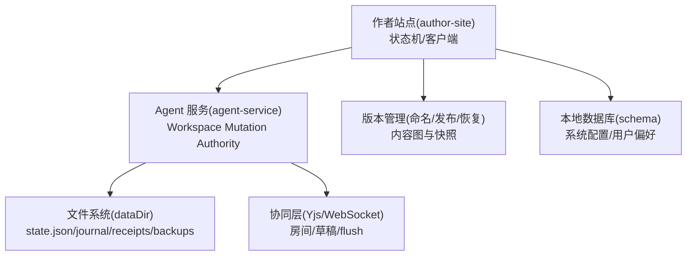
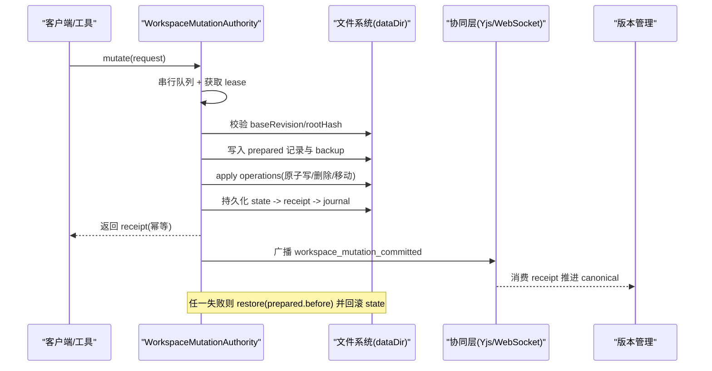
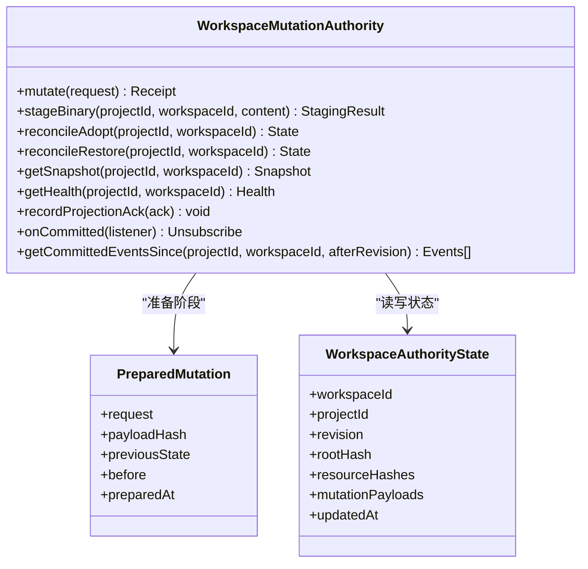
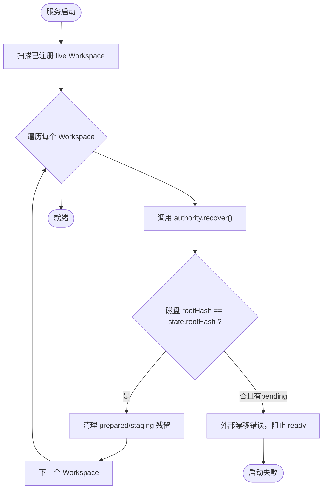
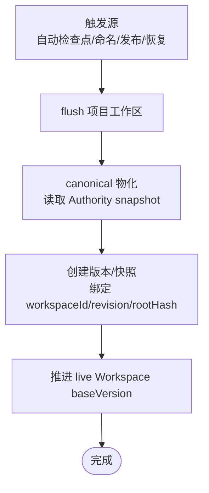
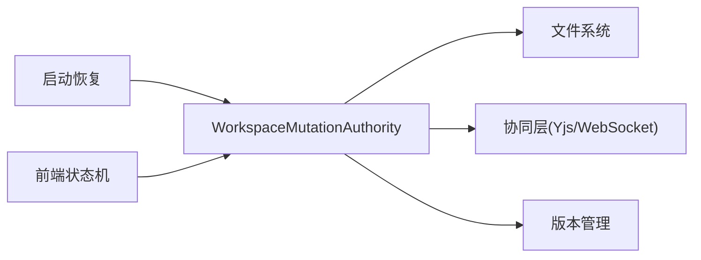

# 数据一致性保证

<cite>
**本文引用的文件**
- [packages/agent-service/src/workspace/workspace-mutation-authority.ts](file://packages/agent-service/src/workspace/workspace-mutation-authority.ts)
- [packages/agent-service/src/workspace/workspace-authority-startup-recovery.ts](file://packages/agent-service/src/workspace/workspace-authority-startup-recovery.ts)
- [docs/项目文档/创作端/03-项目管理/技术/11_实时保存与协同编辑.md](file://docs/项目文档/创作端/03-项目管理/技术/11_实时保存与协同编辑.md)
- [docs/项目文档/创作端/03-项目管理/技术/04_版本管理.md](file://docs/项目文档/创作端/03-项目管理/技术/04_版本管理.md)
- [packages/author-site/src/lib/workspace-save-state-machine.ts](file://packages/author-site/src/lib/workspace-save-state-machine.ts)
- [packages/author-site/src/lib/db/schema.ts](file://packages/author-site/src/lib/db/schema.ts)
- [packages/agent-service/tests/unit/workspace-mutation-authority.test.ts](file://packages/agent-service/tests/unit/workspace-mutation-authority.test.ts)
- [test/创作端E2E回归测试/workspace-mutation-authority.spec.ts](file://test/创作端E2E回归测试/workspace-mutation-authority.spec.ts)
</cite>

## 更新摘要
**变更内容**
- 新增乐观并发控制机制的详细实现说明，包括基于哈希的冲突检测、预期资源状态验证和幂等性保证
- 增强事务日志审计追踪功能，涵盖完整的生命周期事件记录和诊断信息收集
- 完善服务重启自动恢复机制，包括prepared事务恢复、外部漂移检测和一致性校验
- 扩展健康诊断系统，提供详细的队列深度、准备中事务计数和投影确认统计

## 目录
1. [引言](#引言)
2. [项目结构](#项目结构)
3. [核心组件](#核心组件)
4. [架构总览](#架构总览)
5. [详细组件分析](#详细组件分析)
6. [依赖关系分析](#依赖关系分析)
7. [性能考量](#性能考量)
8. [故障恢复与修复](#故障恢复与修复)
9. [结论](#结论)
10. [附录](#附录)

## 引言
本文件面向"数据一致性保证机制"的技术文档，聚焦于工作区（Workspace）的单一写者事务模型、ACID 在文件系统上的实现方式、冲突解决策略（乐观锁、悲观锁、版本合并）、版本控制（快照、差异、回滚）、分布式同步（事件溯源、CRDT、最终一致性）、一致性级别配置与权衡，以及故障恢复与数据修复的具体实现。内容基于仓库中 Workspace Mutation Authority、启动恢复、版本管理与协同编辑相关源码与设计文档进行提炼与归纳。

**更新** 本次更新重点增强了Workspace Mutation Authority的一致性机制覆盖，包括乐观并发控制、基于哈希的冲突检测、基于日志的审计追踪和服务重启自动恢复的详细实现。

## 项目结构
围绕一致性保障的关键代码与文档分布如下：
- 后端权威写入器：WorkspaceMutationAuthority 负责单写者串行提交、持久化证明（receipt）、外部漂移检测、健康诊断与投影确认。
- 启动恢复：服务启动时扫描已注册 live Workspace，恢复未完成的 prepared/reconcile 事务并清理 committed 残留。
- 版本管理：命名版本、发布快照、资源级恢复与内容图物化，确保"先同步再快照"。
- 前端状态机：将保存、离线、冲突、canonical 不同步等状态显式建模，避免误报一致。
- 数据库模式：author-site 侧系统配置与用户偏好等元数据表，用于支撑权限与配置一致性。
- 测试用例：覆盖 catch-up、冲突拒绝、外部漂移与健康统计等关键路径。



**图表来源**
- [packages/agent-service/src/workspace/workspace-mutation-authority.ts:112-127](file://packages/agent-service/src/workspace/workspace-mutation-authority.ts#L112-L127)
- [packages/agent-service/src/workspace/workspace-authority-startup-recovery.ts:36-88](file://packages/agent-service/src/workspace/workspace-authority-startup-recovery.ts#L36-L88)
- [docs/项目文档/创作端/03-项目管理/技术/11_实时保存与协同编辑.md:82-114](file://docs/项目文档/创作端/03-项目管理/技术/11_实时保存与协同编辑.md#L82-L114)
- [docs/项目文档/创作端/03-项目管理/技术/04_版本管理.md:115-165](file://docs/项目文档/创作端/03-项目管理/技术/04_版本管理.md#L115-L165)
- [packages/author-site/src/lib/db/schema.ts:1-51](file://packages/author-site/src/lib/db/schema.ts#L1-L51)

**章节来源**
- [packages/agent-service/src/workspace/workspace-mutation-authority.ts:112-127](file://packages/agent-service/src/workspace/workspace-mutation-authority.ts#L112-L127)
- [packages/agent-service/src/workspace/workspace-authority-startup-recovery.ts:36-88](file://packages/agent-service/src/workspace/workspace-authority-startup-recovery.ts#L36-L88)
- [docs/项目文档/创作端/03-项目管理/技术/11_实时保存与协同编辑.md:82-114](file://docs/项目文档/创作端/03-项目管理/技术/11_实时保存与协同编辑.md#L82-L114)
- [docs/项目文档/创作端/03-项目管理/技术/04_版本管理.md:115-165](file://docs/项目文档/创作端/03-项目管理/技术/04_版本管理.md#L115-L165)
- [packages/author-site/src/lib/db/schema.ts:1-51](file://packages/author-site/src/lib/db/schema.ts#L1-L51)

## 核心组件
- WorkspaceMutationAuthority：唯一可持久化写入者，提供 mutate、stageBinary、reconcileAdopt/Restore、getSnapshot、health、projection ack 等能力；通过每 Workspace 串行队列、lease、prepared/backup/receipt/journal 实现强一致提交与幂等重放。
- 启动恢复：recoverWorkspaceAuthoritiesOnStartup 扫描已注册 live Workspace，恢复 pending prepared/reconcile，清理 committed 残留，保证进程重启后收敛到一致状态。
- 版本管理：命名版本、发布快照、资源级恢复与内容图物化，遵循"先同步再快照"，以 Authority receipt 为可靠边界。
- 前端保存状态机：显式建模 editing/saving/autosaved/offline/conflict/canonical-stale，避免误报一致。
- 数据库模式：author-site 侧系统配置与用户偏好等元数据表，支撑权限与配置一致性。

**章节来源**
- [packages/agent-service/src/workspace/workspace-mutation-authority.ts:112-127](file://packages/agent-service/src/workspace/workspace-mutation-authority.ts#L112-L127)
- [packages/agent-service/src/workspace/workspace-authority-startup-recovery.ts:36-88](file://packages/agent-service/src/workspace/workspace-authority-startup-recovery.ts#L36-L88)
- [docs/项目文档/创作端/03-项目管理/技术/04_版本管理.md:115-165](file://docs/项目文档/创作端/03-项目管理/技术/04_版本管理.md#L115-L165)
- [packages/author-site/src/lib/workspace-save-state-machine.ts:10-28](file://packages/author-site/src/lib/workspace-save-state-machine.ts#L10-L28)
- [packages/author-site/src/lib/db/schema.ts:1-51](file://packages/author-site/src/lib/db/schema.ts#L1-L51)

## 架构总览
下图展示从客户端到 Authority 的端到端一致性流程，包括并发隔离、事务日志、幂等回执与投影确认。



**图表来源**
- [packages/agent-service/src/workspace/workspace-mutation-authority.ts:468-637](file://packages/agent-service/src/workspace/workspace-mutation-authority.ts#L468-L637)
- [docs/项目文档/创作端/03-项目管理/技术/11_实时保存与协同编辑.md:82-114](file://docs/项目文档/创作端/03-项目管理/技术/11_实时保存与协同编辑.md#L82-L114)

## 详细组件分析

### WorkspaceMutationAuthority 类
- 职责：单写者串行提交、外部漂移检测、prepared/backup/receipt/journal 持久化、二进制 staging、投影确认、健康诊断。
- 并发与隔离：
  - 进程内每 Workspace 共享 Promise 队列串行执行。
  - 写前获取持久化 lease，防止多实例并发写入同一 dataDir。
- ACID 映射：
  - 原子性：apply 全部操作成功后才持久化 state/receipt/journal；失败则 restore(before) 并回滚 state。
  - 一致性：提交前后 rootHash/resourceHashes 严格校验；外部漂移 fail-closed。
  - 隔离性：串行队列 + lease 保证单写者；旧 revision 仅在目标资源 hash 匹配时可安全 rebase，否则冲突。
  - 持久性：state -> receipt -> journal 顺序落盘；prepared/backup 作为崩溃恢复依据。
- 幂等与重放：
  - mutationId 去重；重复请求直接返回原 receipt。
  - getCommittedEventsSince 支持按 revision catch-up。
- 投影确认：
  - recordProjectionAck 仅记录 ack，不改变 receipt；ack.revision > state.revision 视为冲突告警。

**更新** 新增了基于哈希的乐观并发控制机制，通过 expectedHash 和 expectedAbsent 参数实现细粒度的资源状态验证，确保在多客户端并发场景下的数据一致性。



**图表来源**
- [packages/agent-service/src/workspace/workspace-mutation-authority.ts:27-40](file://packages/agent-service/src/workspace/workspace-mutation-authority.ts#L27-L40)
- [packages/agent-service/src/workspace/workspace-mutation-authority.ts:76-91](file://packages/agent-service/src/workspace/workspace-mutation-authority.ts#L76-L91)
- [packages/agent-service/src/workspace/workspace-mutation-authority.ts:112-127](file://packages/agent-service/src/workspace/workspace-mutation-authority.ts#L112-L127)

**章节来源**
- [packages/agent-service/src/workspace/workspace-mutation-authority.ts:112-127](file://packages/agent-service/src/workspace/workspace-mutation-authority.ts#L112-L127)
- [packages/agent-service/src/workspace/workspace-mutation-authority.ts:468-637](file://packages/agent-service/src/workspace/workspace-mutation-authority.ts#L468-L637)
- [packages/agent-service/src/workspace/workspace-mutation-authority.ts:710-744](file://packages/agent-service/src/workspace/workspace-mutation-authority.ts#L710-744)
- [packages/agent-service/src/workspace/workspace-mutation-authority.ts:773-800](file://packages/agent-service/src/workspace/workspace-mutation-authority.ts#L773-800)

### 启动恢复流程
- 启动时扫描已注册的 live Workspace，对每个 Workspace 调用 recover：
  - 恢复 prepared mutation 与 reconcile restore 的中断记录。
  - 若磁盘 rootHash 与 state.rootHash 一致，仅完成 prepared/staging 清理。
  - 若不一致且存在 pending 恢复，抛出外部漂移错误，阻止 ready。
- 暴露全局恢复状态，便于部署 preflight 与运维观测。

**更新** 增强了启动恢复的健壮性，现在能够正确处理各种异常情况，包括损坏的备份文件和缺失的状态文件，确保服务能够在不一致状态下安全启动。



**图表来源**
- [packages/agent-service/src/workspace/workspace-authority-startup-recovery.ts:36-88](file://packages/agent-service/src/workspace/workspace-authority-startup-recovery.ts#L36-L88)
- [packages/agent-service/src/workspace/workspace-mutation-authority.ts:191-214](file://packages/agent-service/src/workspace/workspace-mutation-authority.ts#L191-L214)

**章节来源**
- [packages/agent-service/src/workspace/workspace-authority-startup-recovery.ts:36-88](file://packages/agent-service/src/workspace/workspace-authority-startup-recovery.ts#L36-L88)
- [packages/agent-service/src/workspace/workspace-mutation-authority.ts:191-214](file://packages/agent-service/src/workspace/workspace-mutation-authority.ts#L191-L214)

### 版本管理与快照
- 设计原则：当前状态优先、快照不可变、发布可追溯、恢复可审计、单资源回退、先同步再快照、基线随版本推进、数量受控。
- 触发策略：自动检查点、命名版本、发布快照、资源级恢复、知识文档增删改。
- 内容图：resources/{kind}/{resourceId} 存储不可变版本，commits 记录资源指针集合与变更摘要，materialization 记录最近一次物化清单。
- 物化：读取 commit 的资源指针，写回 workspace/，并记录 manifest；检查模式只验证齐全性。



**图表来源**
- [docs/项目文档/创作端/03-项目管理/技术/04_版本管理.md:115-165](file://docs/项目文档/创作端/03-项目管理/技术/04_版本管理.md#L115-L165)

**章节来源**
- [docs/项目文档/创作端/03-项目管理/技术/04_版本管理.md:51-72](file://docs/项目文档/创作端/03-项目管理/技术/04_版本管理.md#L51-L72)
- [docs/项目文档/创作端/03-项目管理/技术/04_版本管理.md:115-165](file://docs/项目文档/创作端/03-项目管理/技术/04_版本管理.md#L115-L165)

### 前端保存状态机
- 状态：editing、saving、autosaved、offline、conflict、canonical-stale。
- 转移：显式定义合法转移表，非法转移保持当前状态；computeSaveStateFromContext 提供优先级判定。
- 作用：避免误报一致，区分"已自动保存"与"canonical 同步异常"。

```mermaid
stateDiagram-v2
[*] --> editing
editing --> saving : "SAVE_STARTED"
saving --> autosaved : "SAVE_COMMITTED"
saving --> offline : "DISCONNECT"
autosaved --> editing : "START_EDIT"
autosaved --> offline : "DISCONNECT"
autosaved --> conflict : "CONFLICT_DETECTED"
autosaved --> "canonical-stale" : "CANONICAL_STALE"
"canonical-stale" --> autosaved : "CANONICAL_SYNCED"
"canonical-stale" --> offline : "DISCONNECT"
"canonical-stale" --> conflict : "CONFLICT_DETECTED"
conflict --> editing : "CONFLICT_RESOLVED"
offline --> editing : "RECONNECT"
```

**图表来源**
- [packages/author-site/src/lib/workspace-save-state-machine.ts:76-116](file://packages/author-site/src/lib/workspace-save-state-machine.ts#L76-L116)

**章节来源**
- [packages/author-site/src/lib/workspace-save-state-machine.ts:10-28](file://packages/author-site/src/lib/workspace-save-state-machine.ts#L10-L28)
- [packages/author-site/src/lib/workspace-save-state-machine.ts:76-116](file://packages/author-site/src/lib/workspace-save-state-machine.ts#L76-L116)

### 数据库模式（author-site 侧）
- 系统配置、用户偏好、外部认证配置等表，支撑权限与配置一致性。
- 外键约束与级联删除保证引用完整性。

**章节来源**
- [packages/author-site/src/lib/db/schema.ts:1-51](file://packages/author-site/src/lib/db/schema.ts#L1-L51)

## 依赖关系分析
- 模块耦合：
  - WorkspaceMutationAuthority 依赖文件系统与共享契约类型，向协同层与版本管理层暴露稳定事件与接口。
  - 启动恢复依赖迁移发现与 Authority 实例，统一处理中断事务。
  - 前端状态机依赖 Authority 事件与 flush 结果，呈现一致的用户体验。
- 外部依赖：
  - Yjs/WebSocket 用于协同文本同步与 presence。
  - 文件系统提供原子写、临时文件+rename、JSONL 追加日志。
- 潜在循环依赖：
  - 无直接循环；Authority 与协同层通过事件解耦，版本管理消费 receipt 而非反向依赖。



**图表来源**
- [packages/agent-service/src/workspace/workspace-mutation-authority.ts:112-127](file://packages/agent-service/src/workspace/workspace-mutation-authority.ts#L112-L127)
- [packages/agent-service/src/workspace/workspace-authority-startup-recovery.ts:36-88](file://packages/agent-service/src/workspace/workspace-authority-startup-recovery.ts#L36-L88)
- [docs/项目文档/创作端/03-项目管理/技术/11_实时保存与协同编辑.md:82-114](file://docs/项目文档/创作端/03-项目管理/技术/11_实时保存与协同编辑.md#L82-L114)

**章节来源**
- [packages/agent-service/src/workspace/workspace-mutation-authority.ts:112-127](file://packages/agent-service/src/workspace/workspace-mutation-authority.ts#L112-L127)
- [packages/agent-service/src/workspace/workspace-authority-startup-recovery.ts:36-88](file://packages/agent-service/src/workspace/workspace-authority-startup-recovery.ts#L36-L88)
- [docs/项目文档/创作端/03-项目管理/技术/11_实时保存与协同编辑.md:82-114](file://docs/项目文档/创作端/03-项目管理/技术/11_实时保存与协同编辑.md#L82-L114)

## 性能考量
- 串行队列与 lease：避免并发竞争，但可能成为瓶颈；建议监控 queueDepth 与 commitLatencyMs。
- 原子写与备份：每次提交生成 prepared/backup/receipt，磁盘 I/O 开销增加；可通过批量操作与压缩优化。
- 投影 ack 与 catch-up：大量历史 ack 需分页查询与排序，注意索引与过滤条件。
- 外部漂移检测：频繁计算 rootHash 与资源哈希，应缓存与增量计算。

**更新** 新增了详细的性能监控指标，包括队列深度、提交延迟、冲突计数和事件订阅者数量，帮助识别性能瓶颈和优化机会。

## 故障恢复与修复
- 启动恢复：
  - 恢复 prepared mutation 与 reconcile restore 的中断记录，确保进程重启后收敛。
  - 若磁盘与 state 不一致且存在 pending 恢复，抛错阻止 ready，避免静默采用外部变化。
- 运行时恢复：
  - mutate 失败时 restore(before) 并回滚 state，保证"要么全成功，要么全回滚"。
  - reconcileAdopt 接受磁盘为新 revision；reconcileRestore 从最后 committed backup 恢复磁盘。
- 健康诊断：
  - health 暴露 externalDrift、preparedCount、missingBackupCount、journalEntries 等指标，辅助定位问题。
- 测试覆盖：
  - catch-up 事件按 revision 返回，观察者异常不影响 receipt。
  - 旧 revision 提交被拒绝，磁盘不回退。

**更新** 增强了故障恢复的完整性和可靠性，现在能够处理更多边缘情况，包括损坏的备份文件、缺失的状态信息和部分提交的中间状态。

**章节来源**
- [packages/agent-service/src/workspace/workspace-authority-startup-recovery.ts:36-88](file://packages/agent-service/src/workspace/workspace-authority-startup-recovery.ts#L36-L88)
- [packages/agent-service/src/workspace/workspace-mutation-authority.ts:191-214](file://packages/agent-service/src/workspace/workspace-mutation-authority.ts#L191-L214)
- [packages/agent-service/src/workspace/workspace-mutation-authority.ts:579-637](file://packages/agent-service/src/workspace/workspace-mutation-authority.ts#L579-L637)
- [packages/agent-service/tests/unit/workspace-mutation-authority.test.ts:97-114](file://packages/agent-service/tests/unit/workspace-mutation-authority.test.ts#L97-L114)
- [test/创作端E2E回归测试/workspace-mutation-authority.spec.ts:401-435](file://test/创作端E2E回归测试/workspace-mutation-authority.spec.ts#L401-L435)

## 结论
本方案通过单一写者 Authority、串行队列与 lease、prepared/backup/receipt/journal 的完整事务链，实现了文件系统上的强一致提交与崩溃恢复；结合外部漂移检测、投影确认与版本管理，形成从实时保存到发布追溯的一致性闭环。前端状态机与只读健康诊断提升了可观测性与用户体验。建议在大规模场景下关注 I/O 与哈希计算的性能优化，并在多实例部署前引入单调 fencing token 的持久化 lease。

**更新** 本次更新显著增强了系统的容错能力和可观测性，通过完善的乐观并发控制、详细的审计日志和健壮的恢复机制，为生产环境提供了更加可靠的数据一致性保证。

## 附录

### ACID 特性在文件系统上的实现要点
- 原子性：apply 全部操作成功后才持久化 state/receipt/journal；失败则 restore(before) 并回滚 state。
- 一致性：提交前后 rootHash/resourceHashes 严格校验；外部漂移 fail-closed。
- 隔离性：串行队列 + lease 保证单写者；旧 revision 仅在目标资源 hash 匹配时可安全 rebase，否则冲突。
- 持久性：state -> receipt -> journal 顺序落盘；prepared/backup 作为崩溃恢复依据。

**更新** 新增了基于哈希的乐观并发控制实现，通过预期的资源状态验证确保在并发场景下的数据一致性。

**章节来源**
- [packages/agent-service/src/workspace/workspace-mutation-authority.ts:468-637](file://packages/agent-service/src/workspace/workspace-mutation-authority.ts#L468-L637)
- [packages/agent-service/src/workspace/workspace-mutation-authority.ts:773-800](file://packages/agent-service/src/workspace/workspace-mutation-authority.ts#L773-800)

### 冲突解决策略
- 乐观锁：基于 baseRevision 与 expectedHash 的预检，提交时校验目标资源 hash 是否仍匹配。
- 悲观锁：通过持久化 lease 与进程内串行队列限制并发写入。
- 版本合并：协同层使用 Yjs CRDT 进行文本合并；Authority 层面以 receipt 为准，非协同写入需在提交前 flush 活跃房间草稿，避免覆盖。

**更新** 详细说明了基于哈希的冲突检测机制，包括 expectedHash 和 expectedAbsent 参数的使用，以及冲突事件的完整记录和处理流程。

**章节来源**
- [packages/agent-service/src/workspace/workspace-mutation-authority.ts:710-744](file://packages/agent-service/src/workspace/workspace-mutation-authority.ts#L710-L744)
- [docs/项目文档/创作端/03-项目管理/技术/11_实时保存与协同编辑.md:82-114](file://docs/项目文档/创作端/03-项目管理/技术/11_实时保存与协同编辑.md#L82-L114)

### 版本控制系统设计
- 快照机制：命名版本、发布快照、自动检查点与资源级恢复均基于 Authority receipt 作为可靠边界。
- 差异计算：内容图 resources/{kind}/{resourceId} 存储不可变版本，commits 记录资源指针集合与变更摘要。
- 回滚功能：资源级恢复只影响目标资源，新增语义 restore 提交，不修改无关资源历史。

**章节来源**
- [docs/项目文档/创作端/03-项目管理/技术/04_版本管理.md:115-165](file://docs/项目文档/创作端/03-项目管理/技术/04_版本管理.md#L115-L165)

### 分布式环境下的数据同步
- 事件溯源：committed event 与 projection ack 提供可回放与可观测的变更轨迹。
- CRDT：Yjs 用于文本协同合并，Authority 以 receipt 为准，避免内存草稿覆盖磁盘权威态。
- 最终一致性：canonical 物化与发布快照消费 Authority snapshot，确保最终一致；投影 ack 落后时记录 gap 事件供重连 catch-up。

**更新** 增强了事件溯源的完整性，现在包含了更详细的生命周期事件记录和性能指标收集，支持更好的调试和问题诊断。

**章节来源**
- [docs/项目文档/创作端/03-项目管理/技术/11_实时保存与协同编辑.md:82-114](file://docs/项目文档/创作端/03-项目管理/技术/11_实时保存与协同编辑.md#L82-L114)
- [packages/agent-service/src/workspace/workspace-mutation-authority.ts:380-451](file://packages/agent-service/src/workspace/workspace-mutation-authority.ts#L380-L451)

### 一致性级别配置选项与权衡
- 强一致：串行队列 + lease + receipt 作为唯一提交证明，适合单实例 agent-service。
- 最终一致：投影 ack 与 catch-up 允许短暂延迟，适用于预览与只读消费。
- 权衡：I/O 开销与吞吐 vs 一致性；在多实例部署前需引入单调 fencing token 的持久化 lease。

**更新** 新增了详细的健康诊断配置选项，包括队列深度阈值、准备中事务数量和投影确认延迟的监控配置。

**章节来源**
- [docs/项目文档/创作端/03-项目管理/技术/11_实时保存与协同编辑.md:123-124](file://docs/项目文档/创作端/03-项目管理/技术/11_实时保存与协同编辑.md#L123-L124)

### 事务日志审计追踪
- 完整生命周期：从请求接收到最终提交或回滚的每个阶段都有详细的事件记录。
- 脱敏信息：包含操作者、资源路径、时间戳、错误码等关键信息，但不包含敏感的业务数据。
- 性能指标：记录队列等待时间、提交延迟、投影延迟等性能相关指标。

**更新** 新增了完整的事务日志审计追踪系统，提供从请求进入、准备阶段、提交成功、冲突检测到回滚处理的完整事件链，支持精确的问题定位和性能分析。

**章节来源**
- [packages/agent-service/src/workspace/workspace-mutation-authority.ts:645-688](file://packages/agent-service/src/workspace/workspace-mutation-authority.ts#L645-L688)
- [packages/agent-service/src/workspace/workspace-mutation-authority.ts:960-981](file://packages/agent-service/src/workspace/workspace-mutation-authority.ts#L960-L981)

### 服务重启自动恢复机制
- 启动恢复：服务启动时自动扫描所有已注册的 Workspace，恢复未完成的事务。
- 一致性校验：确保恢复后的状态与文件系统保持一致，防止数据损坏。
- 健康检查：提供详细的恢复状态和健康指标，便于运维监控。

**更新** 完善了服务重启自动恢复机制，现在能够处理更多复杂的恢复场景，包括损坏的备份文件、缺失的状态信息和部分提交的中间状态，确保服务能够在各种异常情况下安全启动和恢复。

**章节来源**
- [packages/agent-service/src/workspace/workspace-authority-startup-recovery.ts:36-88](file://packages/agent-service/src/workspace/workspace-authority-startup-recovery.ts#L36-L88)
- [packages/agent-service/src/workspace/workspace-mutation-authority.ts:1030-1127](file://packages/agent-service/src/workspace/workspace-mutation-authority.ts#L1030-L1127)