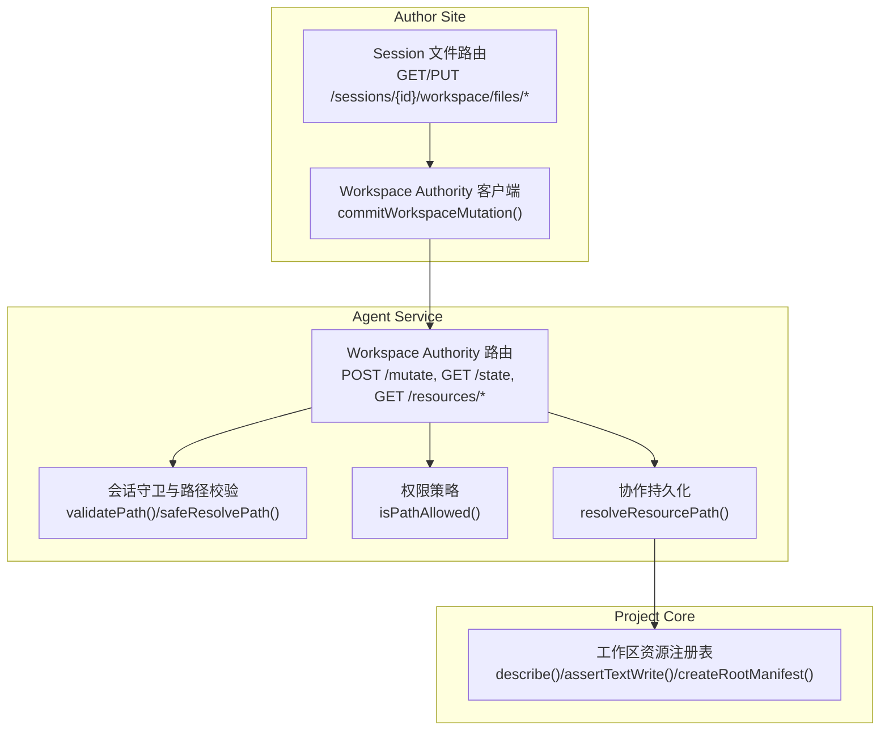
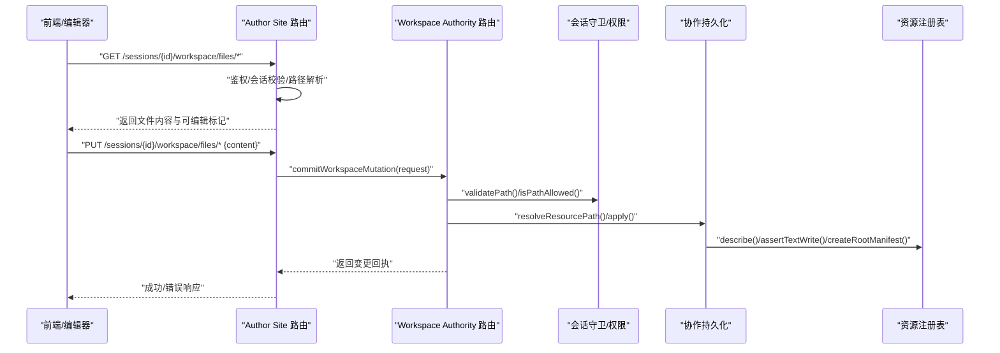
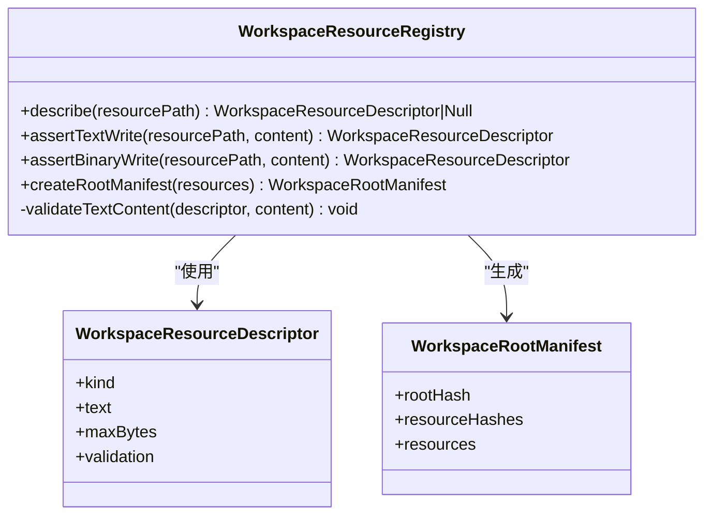
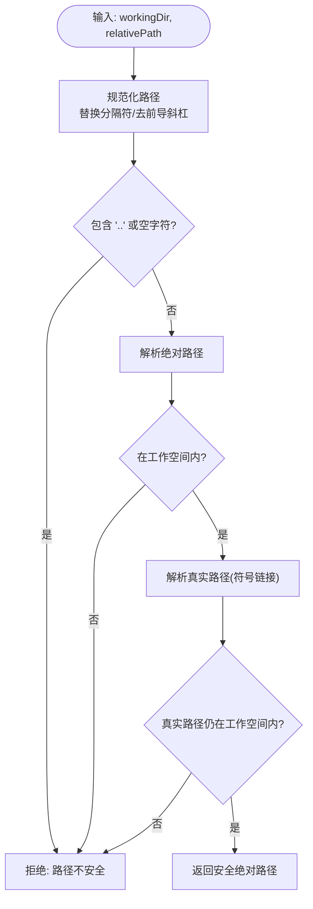
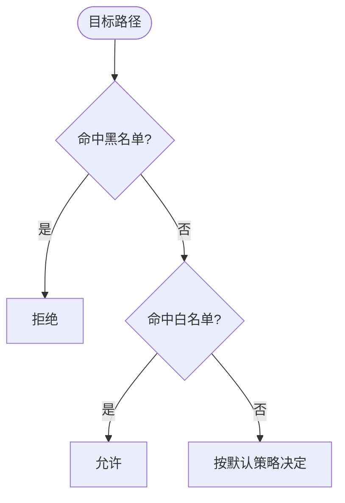
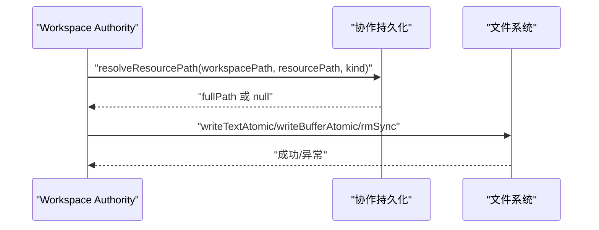
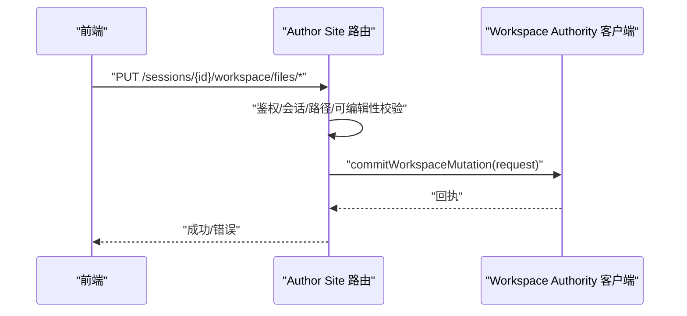
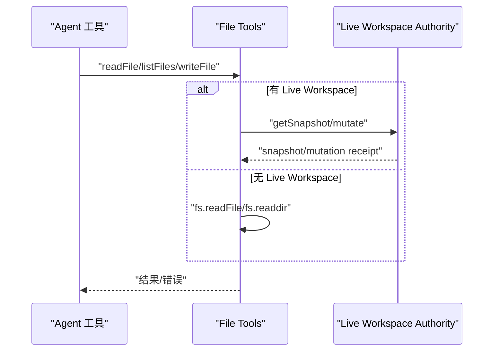
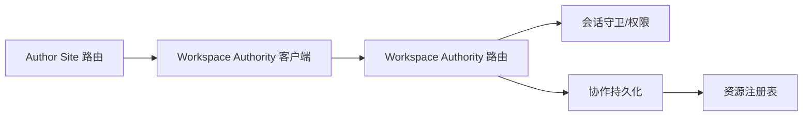

# 文件系统接口定义

<cite>
**本文引用的文件**   
- [packages/project-core/src/workspace-resource-registry.ts](file://packages/project-core/src/workspace-resource-registry.ts)
- [packages/agent-service/src/session/session-guard.ts](file://packages/agent-service/src/session/session-guard.ts)
- [packages/agent-service/src/workspace/utils.ts](file://packages/agent-service/src/workspace/utils.ts)
- [packages/agent-service/src/collab/workspace-file-persistence.ts](file://packages/agent-service/src/collab/workspace-file-persistence.ts)
- [packages/author-site/src/app/api/sessions/[sessionId]/workspace/files/[...filePath]/route.ts](file://packages/author-site/src/app/api/sessions/[sessionId]/workspace/files/[...filePath]/route.ts)
- [packages/author-site/src/lib/workspace-authority-client.ts](file://packages/author-site/src/lib/workspace-authority-client.ts)
- [packages/agent-service/src/routes/workspace-authority.ts](file://packages/agent-service/src/routes/workspace-authority.ts)
- [packages/agent-service/src/backends/pi-tools/permissions.ts](file://packages/agent-service/src/backends/pi-tools/permissions.ts)
- [packages/agent-service/src/backends/pi-tools/file-tools.ts](file://packages/agent-service/src/backends/pi-tools/file-tools.ts)
- [packages/shared/src/types.ts](file://packages/shared/src/types.ts)
</cite>

## 目录
1. [简介](#简介)
2. [项目结构](#项目结构)
3. [核心组件](#核心组件)
4. [架构总览](#架构总览)
5. [详细组件分析](#详细组件分析)
6. [依赖关系分析](#依赖关系分析)
7. [性能与容量特性](#性能与容量特性)
8. [故障排查指南](#故障排查指南)
9. [结论](#结论)
10. [附录：API 参考与示例](#附录api-参考与示例)

## 简介
本技术文档围绕工作区（Workspace）的文件系统接口进行系统化说明，覆盖统一的读写删列 API、路径管理与安全校验、元数据与资源类型识别、大小限制与内容验证、以及工作区资源注册表与权限控制。文档同时给出端到端调用序列图与流程图，帮助读者快速理解从前端到后端再到持久化的完整链路。

## 项目结构
本仓库采用多包（monorepo）组织，文件系统相关能力分布在以下包中：
- project-core：工作区资源注册表与强约束的写入策略（路径模式匹配、文本/二进制校验、根清单生成）。
- agent-service：会话级路径校验、权限白名单/黑名单、工作区变更提交、快照与暂存、协作持久化。
- author-site：面向编辑器的 HTTP 路由（读取/更新工作区文件），通过 Workspace Authority 客户端统一写入口。
- shared：跨包共享的错误码与响应契约。

图表来源
- [packages/author-site/src/app/api/sessions/[sessionId]/workspace/files/[...filePath]/route.ts](file://packages/author-site/src/app/api/sessions/[sessionId]/workspace/files/[...filePath]/route.ts#L51-L177)
- [packages/author-site/src/lib/workspace-authority-client.ts:186-217](file://packages/author-site/src/lib/workspace-authority-client.ts#L186-L217)
- [packages/agent-service/src/routes/workspace-authority.ts:67-90](file://packages/agent-service/src/routes/workspace-authority.ts#L67-L90)
- [packages/agent-service/src/session/session-guard.ts:76-133](file://packages/agent-service/src/session/session-guard.ts#L76-L133)
- [packages/agent-service/src/backends/pi-tools/permissions.ts:10-38](file://packages/agent-service/src/backends/pi-tools/permissions.ts#L10-L38)
- [packages/agent-service/src/collab/workspace-file-persistence.ts:281-298](file://packages/agent-service/src/collab/workspace-file-persistence.ts#L281-L298)
- [packages/project-core/src/workspace-resource-registry.ts:52-112](file://packages/project-core/src/workspace-resource-registry.ts#L52-L112)

章节来源
- [packages/author-site/src/app/api/sessions/[sessionId]/workspace/files/[...filePath]/route.ts:51-177](file://packages/author-site/src/app/api/sessions/[sessionId]/workspace/files/[...filePath]/route.ts#L51-L177)
- [packages/author-site/src/lib/workspace-authority-client.ts:186-217](file://packages/author-site/src/lib/workspace-authority-client.ts#L186-L217)
- [packages/agent-service/src/routes/workspace-authority.ts:67-90](file://packages/agent-service/src/routes/workspace-authority.ts#L67-L90)
- [packages/agent-service/src/session/session-guard.ts:76-133](file://packages/agent-service/src/session/session-guard.ts#L76-L133)
- [packages/agent-service/src/backends/pi-tools/permissions.ts:10-38](file://packages/agent-service/src/backends/pi-tools/permissions.ts#L10-L38)
- [packages/agent-service/src/collab/workspace-file-persistence.ts:281-298](file://packages/agent-service/src/collab/workspace-file-persistence.ts#L281-L298)
- [packages/project-core/src/workspace-resource-registry.ts:52-112](file://packages/project-core/src/workspace-resource-registry.ts#L52-L112)

## 核心组件
- 工作区资源注册表（WorkspaceResourceRegistry）
  - 职责：基于路径模式识别资源类型（页面代码、原型 HTML/CSS/Meta、Sketch 场景、项目配置、知识文档、资产等），执行文本/二进制写入断言与内容校验，并生成工作区根清单（含资源哈希与根哈希）。
  - 关键能力：路径规范化与安全过滤、最大字节限制、JSON/Sketch 场景结构校验、根清单一致性计算。
- 会话级路径守卫（session-guard）
  - 职责：对相对路径进行解析与越界检测，拒绝路径遍历与符号链接逃逸；提供批量校验与“安全解析”封装。
- 权限策略（pi-tools/permissions）
  - 职责：基于 allow/deny 规则集判定路径是否允许访问，支持通配符与黑名单优先策略。
- 协作持久化（collab workspace-file-persistence）
  - 职责：在协作模式下将逻辑资源路径映射为物理路径，并进行二次安全校验与白名单检查。
- Author Site 文件路由
  - 职责：暴露统一的读/写接口，鉴权后委托 Workspace Authority 客户端完成变更提交。
- Workspace Authority 路由
  - 职责：接收变更请求，协调会话守卫、权限策略与持久化层，返回变更回执。

章节来源
- [packages/project-core/src/workspace-resource-registry.ts:52-140](file://packages/project-core/src/workspace-resource-registry.ts#L52-L140)
- [packages/agent-service/src/session/session-guard.ts:76-133](file://packages/agent-service/src/session/session-guard.ts#L76-L133)
- [packages/agent-service/src/backends/pi-tools/permissions.ts:10-38](file://packages/agent-service/src/backends/pi-tools/permissions.ts#L10-L38)
- [packages/agent-service/src/collab/workspace-file-persistence.ts:281-298](file://packages/agent-service/src/collab/workspace-file-persistence.ts#L281-L298)
- [packages/author-site/src/app/api/sessions/[sessionId]/workspace/files/[...filePath]/route.ts:51-177](file://packages/author-site/src/app/api/sessions/[sessionId]/workspace/files/[...filePath]/route.ts#L51-L177)
- [packages/agent-service/src/routes/workspace-authority.ts:67-90](file://packages/agent-service/src/routes/workspace-authority.ts#L67-L90)

## 架构总览
下图展示了“编辑器 → Author Site → Workspace Authority → 持久化 → 资源注册表”的端到端流程，涵盖读取与写入两条主路径。

图表来源
- [packages/author-site/src/app/api/sessions/[sessionId]/workspace/files/[...filePath]/route.ts:51-177](file://packages/author-site/src/app/api/sessions/[sessionId]/workspace/files/[...filePath]/route.ts#L51-L177)
- [packages/author-site/src/lib/workspace-authority-client.ts:186-217](file://packages/author-site/src/lib/workspace-authority-client.ts#L186-L217)
- [packages/agent-service/src/routes/workspace-authority.ts:67-90](file://packages/agent-service/src/routes/workspace-authority.ts#L67-L90)
- [packages/agent-service/src/session/session-guard.ts:76-133](file://packages/agent-service/src/session/session-guard.ts#L76-L133)
- [packages/agent-service/src/collab/workspace-file-persistence.ts:281-298](file://packages/agent-service/src/collab/workspace-file-persistence.ts#L281-L298)
- [packages/project-core/src/workspace-resource-registry.ts:52-112](file://packages/project-core/src/workspace-resource-registry.ts#L52-L112)

## 详细组件分析

### 工作区资源注册表（WorkspaceResourceRegistry）
- 设计要点
  - 路径模式匹配：以正则/精确匹配识别资源种类（如 demos/*/index.tsx、demos/*/prototype.*.json、project.config.*.json、workspace-tree.json、knowledge/*、assets/* 等）。
  - 文本/二进制断言：根据描述符强制类型与大小上限，防止误用。
  - 内容校验：对 JSON 对象、workspace-tree 结构、sketch-scene 文档进行结构化校验。
  - 根清单：汇总所有资源的 path/kind/hash/size，并计算根哈希用于一致性校验。
- 复杂度与性能
  - describe 为 O(1) 正则匹配；createRootManifest 为 O(n log n)（排序）+ O(n) 哈希计算。
- 错误处理
  - 非法操作抛出通用异常，由上层转换为标准错误码。

图表来源
- [packages/project-core/src/workspace-resource-registry.ts:52-140](file://packages/project-core/src/workspace-resource-registry.ts#L52-L140)

章节来源
- [packages/project-core/src/workspace-resource-registry.ts:52-140](file://packages/project-core/src/workspace-resource-registry.ts#L52-L140)

### 路径管理与安全校验
- 路径规范化
  - 统一将反斜杠替换为正斜杠，去除前导斜杠，拒绝包含空字符或包含 “..” 的路径。
- 越界与符号链接防护
  - 解析绝对路径后判断是否位于工作空间内；若存在符号链接，进一步解析真实路径再次校验。
- 批量校验与安全解析
  - 提供批量校验工具与“安全解析”封装，失败时抛出聚合错误信息。

图表来源
- [packages/project-core/src/workspace-resource-registry.ts:41-45](file://packages/project-core/src/workspace-resource-registry.ts#L41-L45)
- [packages/agent-service/src/session/session-guard.ts:76-133](file://packages/agent-service/src/session/session-guard.ts#L76-L133)
- [packages/agent-service/src/workspace/utils.ts:46-76](file://packages/agent-service/src/workspace/utils.ts#L46-L76)

章节来源
- [packages/project-core/src/workspace-resource-registry.ts:41-45](file://packages/project-core/src/workspace-resource-registry.ts#L41-L45)
- [packages/agent-service/src/session/session-guard.ts:76-133](file://packages/agent-service/src/session/session-guard.ts#L76-L133)
- [packages/agent-service/src/workspace/utils.ts:46-76](file://packages/agent-service/src/workspace/utils.ts#L46-L76)

### 权限控制与白名单/黑名单
- 默认策略
  - 允许路径：工作区内任意路径（配合列出）、若干关键文件（如 index.tsx、config.schema.json、workspace-tree.json 等）。
  - 禁止模式：环境变量、git 目录、node_modules、packages、隐藏状态文件等。
- 优先级
  - deny 优先于 allow；即使白名单放行，命中黑名单即拒绝。
- 适用场景
  - Agent 工具、文件列表、写入等操作均受此策略约束。

图表来源
- [packages/agent-service/src/backends/pi-tools/permissions.ts:10-38](file://packages/agent-service/src/backends/pi-tools/permissions.ts#L10-L38)

章节来源
- [packages/agent-service/src/backends/pi-tools/permissions.ts:10-38](file://packages/agent-service/src/backends/pi-tools/permissions.ts#L10-L38)

### 协作持久化与资源路径映射
- 资源路径解析
  - 规范化路径、拒绝空字符与 “..”，依据资源种类进行白名单检查，最终拼接为工作空间内的绝对路径。
- 变更应用
  - 针对 put_text/put_binary/delete_path/rename 等操作，原子写入或删除，并记录变更摘要（含前后哈希）。

图表来源
- [packages/agent-service/src/collab/workspace-file-persistence.ts:281-298](file://packages/agent-service/src/collab/workspace-file-persistence.ts#L281-L298)

章节来源
- [packages/agent-service/src/collab/workspace-file-persistence.ts:281-298](file://packages/agent-service/src/collab/workspace-file-persistence.ts#L281-L298)

### Author Site 文件路由（读/写）
- 读取
  - 鉴权与会话校验后，解析工作区路径，限制文件大小，返回内容、可编辑标记与大小。
- 写入
  - 仅允许白名单内可编辑文件；读取旧内容作为 diff 基础，通过 Workspace Authority 客户端提交变更。

图表来源
- [packages/author-site/src/app/api/sessions/[sessionId]/workspace/files/[...filePath]/route.ts:183-L309](file://packages/author-site/src/app/api/sessions/[sessionId]/workspace/files/[...filePath]/route.ts#L183-L309)
- [packages/author-site/src/lib/workspace-authority-client.ts:186-217](file://packages/author-site/src/lib/workspace-authority-client.ts#L186-L217)

章节来源
- [packages/author-site/src/app/api/sessions/[sessionId]/workspace/files/[...filePath]/route.ts:183-L309](file://packages/author-site/src/app/api/sessions/[sessionId]/workspace/files/[...filePath]/route.ts#L183-L309)
- [packages/author-site/src/lib/workspace-authority-client.ts:186-217](file://packages/author-site/src/lib/workspace-authority-client.ts#L186-L217)

### Agent 侧文件工具（读/写/列）
- 读取
  - 优先从工作区快照获取资源，否则回退到本地文件系统。
- 写入
  - 通过 live workspace authority 提交 put_text 操作，附带运行时校验结果与回执。
- 列出
  - 基于权限策略与快照/文件系统合并展示。

图表来源
- [packages/agent-service/src/backends/pi-tools/file-tools.ts:152-230](file://packages/agent-service/src/backends/pi-tools/file-tools.ts#L152-L230)
- [packages/agent-service/src/backends/pi-tools/file-tools.ts:244-284](file://packages/agent-service/src/backends/pi-tools/file-tools.ts#L244-L284)

章节来源
- [packages/agent-service/src/backends/pi-tools/file-tools.ts:152-230](file://packages/agent-service/src/backends/pi-tools/file-tools.ts#L152-L230)
- [packages/agent-service/src/backends/pi-tools/file-tools.ts:244-284](file://packages/agent-service/src/backends/pi-tools/file-tools.ts#L244-L284)

## 依赖关系分析
- 组件耦合
  - Author Site 仅通过 Workspace Authority 客户端与后端交互，避免直接操作工作区目录，降低耦合面。
  - Workspace Authority 组合会话守卫、权限策略与协作持久化，形成清晰的分层。
  - 资源注册表被持久化层复用，确保写入策略一致。
- 外部依赖
  - Node.js fs/path/crypto 等标准库；Next.js/Fastify 路由框架。
- 潜在循环依赖
  - 当前分层清晰，未见循环引用。

图表来源
- [packages/author-site/src/lib/workspace-authority-client.ts:186-217](file://packages/author-site/src/lib/workspace-authority-client.ts#L186-L217)
- [packages/agent-service/src/routes/workspace-authority.ts:67-90](file://packages/agent-service/src/routes/workspace-authority.ts#L67-L90)
- [packages/agent-service/src/session/session-guard.ts:76-133](file://packages/agent-service/src/session/session-guard.ts#L76-L133)
- [packages/agent-service/src/collab/workspace-file-persistence.ts:281-298](file://packages/agent-service/src/collab/workspace-file-persistence.ts#L281-L298)
- [packages/project-core/src/workspace-resource-registry.ts:52-112](file://packages/project-core/src/workspace-resource-registry.ts#L52-L112)

章节来源
- [packages/author-site/src/lib/workspace-authority-client.ts:186-217](file://packages/author-site/src/lib/workspace-authority-client.ts#L186-L217)
- [packages/agent-service/src/routes/workspace-authority.ts:67-90](file://packages/agent-service/src/routes/workspace-authority.ts#L67-L90)
- [packages/agent-service/src/session/session-guard.ts:76-133](file://packages/agent-service/src/session/session-guard.ts#L76-L133)
- [packages/agent-service/src/collab/workspace-file-persistence.ts:281-298](file://packages/agent-service/src/collab/workspace-file-persistence.ts#L281-L298)
- [packages/project-core/src/workspace-resource-registry.ts:52-112](file://packages/project-core/src/workspace-resource-registry.ts#L52-L112)

## 性能与容量特性
- 大小限制
  - 文本资源默认上限约 2MB；二进制资产上限约 20MB；读取接口对大文件做额外限制（例如 1MB）。
- 哈希与一致性
  - 每个资源计算 SHA-256 哈希，根清单再计算根哈希，便于增量同步与一致性校验。
- I/O 策略
  - 原子写入与删除，减少并发竞争导致的中间态；必要时结合 Git staging 机制辅助撤销。

[本节为通用指导，不直接分析具体文件]

## 故障排查指南
- 常见错误码
  - UNAUTHORIZED/FORBIDDEN：鉴权或权限不足。
  - SESSION_NOT_FOUND/SESSION_EXPIRED：会话不存在或过期。
  - FILE_READ_ERROR/FILE_WRITE_ERROR：底层 I/O 失败。
  - INVALID_REQUEST：参数不合法（如 content 非字符串、路径越界）。
  - WORKSPACE_STALE：工作区版本过旧，需刷新。
  - INVALID_FILE_TYPE/FILE_TOO_LARGE：类型不支持或超出大小限制。
- 定位建议
  - 确认会话与工作区绑定关系是否存在且未过期。
  - 检查路径是否命中黑名单或越界。
  - 核对资源类型与内容结构是否符合注册表约束。
  - 查看 Workspace Authority 回执中的变更摘要与哈希差异。

章节来源
- [packages/shared/src/types.ts:48-85](file://packages/shared/src/types.ts#L48-L85)

## 结论
本文件系统接口通过“注册表 + 守卫 + 权限 + 持久化”的分层设计，实现了统一、安全、可扩展的工作区文件操作能力。路径规范化与多重越界防护、严格的资源类型与内容校验、以及原子化变更与根清单机制，共同保障了工作区的一致性与安全性。

[本节为总结，不直接分析具体文件]

## 附录：API 参考与示例

### 统一文件操作 API（HTTP）
- 读取单个文件
  - 方法：GET
  - 路径：/api/sessions/{sessionId}/workspace/files/{...filePath}
  - 行为：鉴权与会话校验后，返回文件内容、可编辑标记与大小；超过阈值拒绝。
- 更新文件内容
  - 方法：PUT
  - 路径：/api/sessions/{sessionId}/workspace/files/{...filePath}
  - 行为：仅允许白名单内可编辑文件；读取旧内容作为 diff 基础；通过 Workspace Authority 提交变更。
- 列出工作区文件
  - 方法：GET
  - 路径：/api/sessions/{sessionId}/workspace/files
  - 行为：按目录/文件分类返回，过滤不可见运行时文件，按名称排序。
- 列出项目虚拟文件夹
  - 方法：GET/POST
  - 路径：/api/projects/{projectId}/folders
  - 行为：读取/创建虚拟文件夹元数据（workspace-tree.json 的 folders 数组）。

章节来源
- [packages/author-site/src/app/api/sessions/[sessionId]/workspace/files/[...filePath]/route.ts:51-L177](file://packages/author-site/src/app/api/sessions/[sessionId]/workspace/files/[...filePath]/route.ts#L51-L177)
- [packages/author-site/src/app/api/sessions/[sessionId]/workspace/files/[...filePath]/route.ts:183-L309](file://packages/author-site/src/app/api/sessions/[sessionId]/workspace/files/[...filePath]/route.ts#L183-L309)
- [packages/author-site/src/app/api/sessions/[sessionId]/workspace/files/route.ts:138-L188](file://packages/author-site/src/app/api/sessions/[sessionId]/workspace/files/route.ts#L138-L188)
- [packages/author-site/src/app/api/projects/[projectId]/folders/route.ts:84-L134](file://packages/author-site/src/app/api/projects/[projectId]/folders/route.ts#L84-L134)

### 工作区变更提交（内部 RPC）
- 提交变更
  - 方法：POST
  - 路径：/api/workspace-authority/projects/{projectId}/workspaces/{workspaceId}/mutate
  - 行为：校验参数与会话，执行权限与路径校验，应用变更并返回回执。
- 获取工作区状态
  - 方法：GET
  - 路径：/api/workspace-authority/projects/{projectId}/workspaces/{workspaceId}/state?sessionId=...
- 获取资源内容
  - 方法：GET
  - 路径：/api/workspace-authority/projects/{projectId}/workspaces/{workspaceId}/resources/{resourcePath}?sessionId=...

章节来源
- [packages/agent-service/src/routes/workspace-authority.ts:67-90](file://packages/agent-service/src/routes/workspace-authority.ts#L67-L90)
- [packages/agent-service/src/routes/workspace-authority.ts:215-243](file://packages/agent-service/src/routes/workspace-authority.ts#L215-L243)

### 使用示例（步骤式）
- 读取工作区文件
  1) 携带有效会话与会话令牌发起 GET 请求。
  2) 服务端校验会话与工作区绑定，解析并校验路径。
  3) 返回文件内容、可编辑标记与大小。
- 更新工作区文件
  1) 携带有效会话与会话令牌发起 PUT 请求，body 包含 content。
  2) 服务端校验可编辑性，读取旧内容，调用 Workspace Authority 提交变更。
  3) 返回变更回执（包含变更摘要与哈希）。
- 列出工作区文件
  1) 发起 GET 请求列出指定目录。
  2) 服务端过滤不可见运行时文件并按规则排序返回。
- 管理虚拟文件夹
  1) GET 获取现有文件夹树。
  2) POST 创建新文件夹（支持父节点与层级深度限制）。

章节来源
- [packages/author-site/src/app/api/sessions/[sessionId]/workspace/files/[...filePath]/route.ts:51-L177](file://packages/author-site/src/app/api/sessions/[sessionId]/workspace/files/[...filePath]/route.ts#L51-L177)
- [packages/author-site/src/app/api/sessions/[sessionId]/workspace/files/[...filePath]/route.ts:183-L309](file://packages/author-site/src/app/api/sessions/[sessionId]/workspace/files/[...filePath]/route.ts#L183-L309)
- [packages/author-site/src/app/api/sessions/[sessionId]/workspace/files/route.ts:138-L188](file://packages/author-site/src/app/api/sessions/[sessionId]/workspace/files/route.ts#L138-L188)
- [packages/author-site/src/app/api/projects/[projectId]/folders/route.ts:84-L134](file://packages/author-site/src/app/api/projects/[projectId]/folders/route.ts#L84-L134)