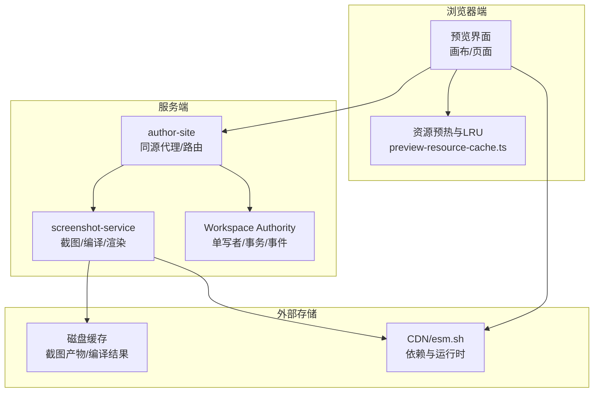
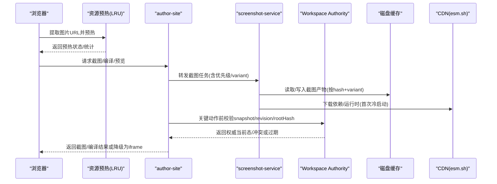
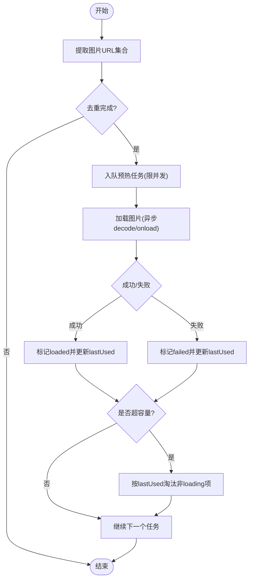
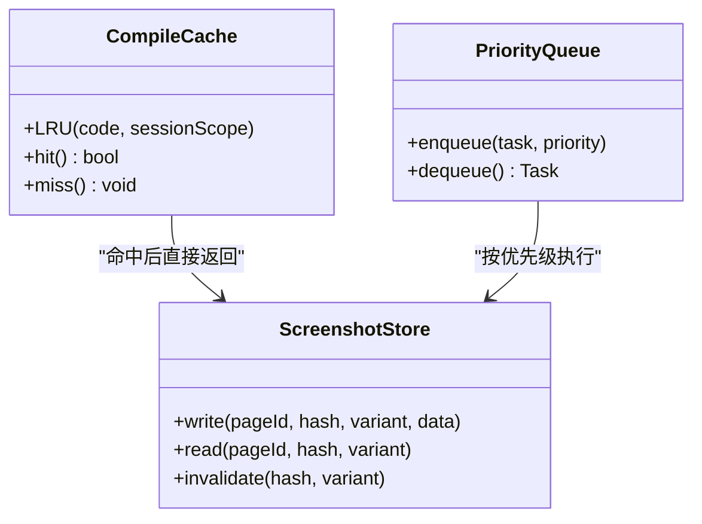
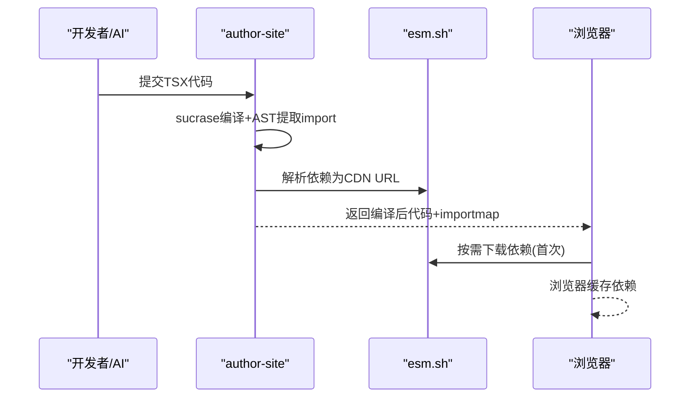
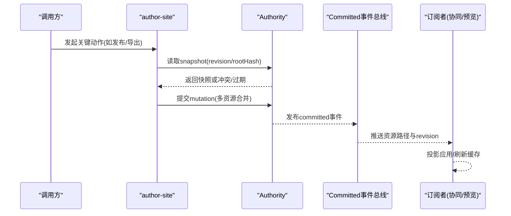
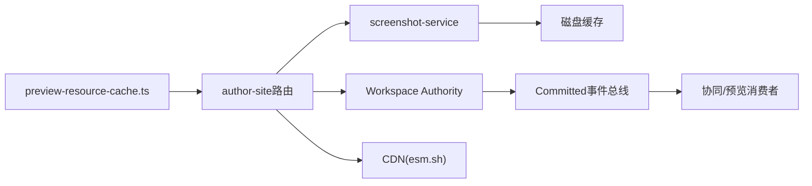

# 缓存策略设计

<cite>
**本文引用的文件列表**
- [packages/demo-ui/src/preview-resource-cache.ts](file://packages/demo-ui/src/preview-resource-cache.ts)
- [docs/项目文档/创作端/04-配置与预览/技术/09_截图服务性能优化方案.md](file://docs/项目文档/创作端/04-配置与预览/技术/09_截图服务性能优化方案.md)
- [docs/复盘文档/预览引擎/iframe沙箱与动态CDN编译策略.md](file://docs/复盘文档/预览引擎/iframe沙箱与动态CDN编译策略.md)
- [docs/项目文档/创作端/03-项目管理/技术/11_实时保存与协同编辑.md](file://docs/项目文档/创作端/03-项目管理/技术/11_实时保存与协同编辑.md)
- [packages/author-site/src/lib/workspace-performance-sampling.ts](file://packages/author-site/src/lib/workspace-performance-sampling.ts)
</cite>

## 目录
1. [引言](#引言)
2. [项目结构](#项目结构)
3. [核心组件](#核心组件)
4. [架构总览](#架构总览)
5. [详细组件分析](#详细组件分析)
6. [依赖关系分析](#依赖关系分析)
7. [性能考量](#性能考量)
8. [故障排查指南](#故障排查指南)
9. [结论](#结论)
10. [附录：配置示例与最佳实践](#附录配置示例与最佳实践)

## 引言
本文件面向“缓存策略设计”，围绕多级缓存（本地内存、磁盘、分布式/CDN）的协同工作，系统梳理本项目中已落地的缓存能力与演进方向。内容覆盖：
- 多级缓存分层与职责边界
- 失效策略（TTL、LRU、事件驱动失效）
- CDN 集成（静态资源分发、预热、回源）
- 一致性保证（写穿透、写回、更新传播）
- 监控与调优（命中率、内存使用、热点识别）
- 配置示例与最佳实践

## 项目结构
仓库中与缓存相关的关键实现与文档分布在以下位置：
- 前端资源预热与 LRU 清理：packages/demo-ui/src/preview-resource-cache.ts
- 截图服务性能优化与缓存身份审计：docs/项目文档/创作端/04-配置与预览/技术/09_截图服务性能优化方案.md
- 预览引擎与动态 CDN 编译策略：docs/复盘文档/预览引擎/iframe沙箱与动态CDN编译策略.md
- 协同写入与 Authority 单写者模型（影响缓存一致性与更新传播）：docs/项目文档/创作端/03-项目管理/技术/11_实时保存与协同编辑.md
- Workspace 性能采样与 SLO 报告（用于命中率与延迟观测）：packages/author-site/src/lib/workspace-performance-sampling.ts

图表来源
- [packages/demo-ui/src/preview-resource-cache.ts:1-300](file://packages/demo-ui/src/preview-resource-cache.ts#L1-L300)
- [docs/项目文档/创作端/04-配置与预览/技术/09_截图服务性能优化方案.md:1-290](file://docs/项目文档/创作端/04-配置与预览/技术/09_截图服务性能优化方案.md#L1-L290)
- [docs/复盘文档/预览引擎/iframe沙箱与动态CDN编译策略.md:1-179](file://docs/复盘文档/预览引擎/iframe沙箱与动态CDN编译策略.md#L1-L179)
- [docs/项目文档/创作端/03-项目管理/技术/11_实时保存与协同编辑.md:1-255](file://docs/项目文档/创作端/03-项目管理/技术/11_实时保存与协同编辑.md#L1-L255)

章节来源
- [packages/demo-ui/src/preview-resource-cache.ts:1-300](file://packages/demo-ui/src/preview-resource-cache.ts#L1-L300)
- [docs/项目文档/创作端/04-配置与预览/技术/09_截图服务性能优化方案.md:1-290](file://docs/项目文档/创作端/04-配置与预览/技术/09_截图服务性能优化方案.md#L1-L290)
- [docs/复盘文档/预览引擎/iframe沙箱与动态CDN编译策略.md:1-179](file://docs/复盘文档/预览引擎/iframe沙箱与动态CDN编译策略.md#L1-L179)
- [docs/项目文档/创作端/03-项目管理/技术/11_实时保存与协同编辑.md:1-255](file://docs/项目文档/创作端/03-项目管理/技术/11_实时保存与协同编辑.md#L1-L255)

## 核心组件
- 前端资源预热与 LRU 清理
  - 基于 Map 的内存缓存，按 lastUsed 排序淘汰，限制最大条目数；并发预取图片，失败/成功均记录状态并统计指标。
- 截图服务缓存与身份审计
  - 编译结果 LRU 缓存、截图产物按 hash 持久化到磁盘；强调“内容版本 hash”与“产物 variant”分离，避免快速截图污染严格产物。
- 动态 CDN 编译与依赖缓存
  - 服务端 sucrase 编译 + importmap 映射 esm.sh；浏览器侧自动缓存依赖，服务端可缓存编译结果。
- Workspace Authority 单写者与事件总线
  - 所有 live Workspace 写入经 Authority 串行提交，receipt 幂等，committed 事件驱动投影与同步，保障缓存一致性。
- 性能采样与 SLO
  - 采集队列等待、commit 延迟、远程更新延迟、重连收敛、canonical 物化延迟等分位指标，输出 SLO 报告。

章节来源
- [packages/demo-ui/src/preview-resource-cache.ts:1-300](file://packages/demo-ui/src/preview-resource-cache.ts#L1-L300)
- [docs/项目文档/创作端/04-配置与预览/技术/09_截图服务性能优化方案.md:1-290](file://docs/项目文档/创作端/04-配置与预览/技术/09_截图服务性能优化方案.md#L1-L290)
- [docs/复盘文档/预览引擎/iframe沙箱与动态CDN编译策略.md:1-179](file://docs/复盘文档/预览引擎/iframe沙箱与动态CDN编译策略.md#L1-L179)
- [docs/项目文档/创作端/03-项目管理/技术/11_实时保存与协同编辑.md:1-255](file://docs/项目文档/创作端/03-项目管理/技术/11_实时保存与协同编辑.md#L1-255)
- [packages/author-site/src/lib/workspace-performance-sampling.ts:1-280](file://packages/author-site/src/lib/workspace-performance-sampling.ts#L1-L280)

## 架构总览
下图展示从浏览器到服务端再到外部存储/CDN 的多级缓存路径，以及 Authority 事件驱动的更新传播。

图表来源
- [packages/demo-ui/src/preview-resource-cache.ts:1-300](file://packages/demo-ui/src/preview-resource-cache.ts#L1-L300)
- [docs/项目文档/创作端/04-配置与预览/技术/09_截图服务性能优化方案.md:1-290](file://docs/项目文档/创作端/04-配置与预览/技术/09_截图服务性能优化方案.md#L1-L290)
- [docs/复盘文档/预览引擎/iframe沙箱与动态CDN编译策略.md:1-179](file://docs/复盘文档/预览引擎/iframe沙箱与动态CDN编译策略.md#L1-L179)
- [docs/项目文档/创作端/03-项目管理/技术/11_实时保存与协同编辑.md:1-255](file://docs/项目文档/创作端/03-项目管理/技术/11_实时保存与协同编辑.md#L1-255)

## 详细组件分析

### 前端资源预热与 LRU 清理
- 功能要点
  - 从代码与配置中提取图片 URL，去重后批量预热。
  - 内存 Map 维护条目状态（loading/loaded/failed）、最后使用时间 lastUsed。
  - 超过上限时按 lastUsed 升序淘汰，跳过仍在 loading 的条目。
  - 并发控制：固定并发度，队列推进，完成后统计 loaded/failed 数量。
- 复杂度与空间
  - 时间：提取 URL O(n)，排序淘汰 O(k log k)（k 为超出上限的条目数）。
  - 空间：O(m)（m 为缓存条目数），受 MAX_RESOURCE_CACHE_SIZE 限制。
- 失效策略
  - 基于访问时间的近似 LRU（按 lastUsed 排序淘汰）。
  - 无显式 TTL；可通过清空接口重置。
- 监控
  - 提供 getPreviewResourceCacheStats 暴露 size/active/queued/loaded/failed。

图表来源
- [packages/demo-ui/src/preview-resource-cache.ts:1-300](file://packages/demo-ui/src/preview-resource-cache.ts#L1-L300)

章节来源
- [packages/demo-ui/src/preview-resource-cache.ts:1-300](file://packages/demo-ui/src/preview-resource-cache.ts#L1-L300)

### 截图服务缓存与身份审计
- 缓存对象与命中条件
  - 编译结果：按 code 与 session scope 复用（LRU）。
  - 截图产物：按 pageId.hash.png 存储，区分 fast/strict variant，immutable URL 不覆盖。
- 身份与一致性
  - 内容 hash 包含代码、配置、尺寸、fullPage、snapshotVersion、renderBox 版本、运行时来源、session/resource 作用域、图片资源变化等，确保“真实渲染变则缓存失效”。
- 调度与优先级
  - active/visible/nearby/background 优先级队列，减少首屏等待。
- 预热与提示
  - 支持 measuredHeight 作为 hint，减少稳定轮询但不替代服务端测量。
- 风险与回退
  - 快速截图不得冒充严格截图；旧图误展示必须为 0；必要时回退缓存扩展。

图表来源
- [docs/项目文档/创作端/04-配置与预览/技术/09_截图服务性能优化方案.md:1-290](file://docs/项目文档/创作端/04-配置与预览/技术/09_截图服务性能优化方案.md#L1-L290)

章节来源
- [docs/项目文档/创作端/04-配置与预览/技术/09_截图服务性能优化方案.md:1-290](file://docs/项目文档/创作端/04-配置与预览/技术/09_截图服务性能优化方案.md#L1-L290)

### 动态 CDN 编译与依赖缓存
- 机制
  - 服务端 sucrase 编译 TSX，提取 import 生成 importmap，替换为 esm.sh 地址。
  - 浏览器通过 ES Module 直接下载打包后的依赖，依赖由浏览器自动缓存。
- 缓存策略
  - 服务端可对编译结果做缓存（代码 hash → 编译结果）。
  - 首次编译锁定依赖版本，后续复用锁定版本。
- 回退与内网
  - 保留 CDN base 给回退路径；内网可用 npm 代理或预置高频依赖。

图表来源
- [docs/复盘文档/预览引擎/iframe沙箱与动态CDN编译策略.md:1-179](file://docs/复盘文档/预览引擎/iframe沙箱与动态CDN编译策略.md#L1-L179)

章节来源
- [docs/复盘文档/预览引擎/iframe沙箱与动态CDN编译策略.md:1-179](file://docs/复盘文档/预览引擎/iframe沙箱与动态CDN编译策略.md#L1-L179)

### 一致性保证：Authority 单写者与事件传播
- 单写者模型
  - 每 Workspace 串行队列，prepared manifest、receipt、journal、backup 持久化，幂等提交。
- 外部漂移检测
  - 旁路修改 fail-closed；显式 reconcile adopt/restore 才接纳新 revision。
- 事件驱动更新
  - committed event 广播，客户端消费 receipt 中的确切资源路径进行投影与刷新。
- 关键动作边界
  - 发布、导出、模板创建、命名版本等需先 flush，再 ensureCanonicalRevision，绑定 workspaceId/revision/rootHash。

图表来源
- [docs/项目文档/创作端/03-项目管理/技术/11_实时保存与协同编辑.md:1-255](file://docs/项目文档/创作端/03-项目管理/技术/11_实时保存与协同编辑.md#L1-255)

章节来源
- [docs/项目文档/创作端/03-项目管理/技术/11_实时保存与协同编辑.md:1-255](file://docs/项目文档/创作端/03-项目管理/技术/11_实时保存与协同编辑.md#L1-255)

## 依赖关系分析
- 模块耦合
  - 前端资源预热与截图服务解耦，但共享“资源指纹”思想（URL 集合参与缓存键）。
  - 截图服务与 Authority 通过“关键动作前 snapshot 校验”形成一致性约束。
  - 动态 CDN 编译与浏览器缓存天然解耦，服务端编译缓存提升吞吐。
- 外部依赖
  - esm.sh 作为 CDN 依赖源；浏览器 HTTP 缓存层承担二级缓存。
- 潜在循环
  - 未见直接循环依赖；Authority 事件总线单向广播，消费者仅消费。

图表来源
- [packages/demo-ui/src/preview-resource-cache.ts:1-300](file://packages/demo-ui/src/preview-resource-cache.ts#L1-L300)
- [docs/项目文档/创作端/04-配置与预览/技术/09_截图服务性能优化方案.md:1-290](file://docs/项目文档/创作端/04-配置与预览/技术/09_截图服务性能优化方案.md#L1-L290)
- [docs/复盘文档/预览引擎/iframe沙箱与动态CDN编译策略.md:1-179](file://docs/复盘文档/预览引擎/iframe沙箱与动态CDN编译策略.md#L1-L179)
- [docs/项目文档/创作端/03-项目管理/技术/11_实时保存与协同编辑.md:1-255](file://docs/项目文档/创作端/03-项目管理/技术/11_实时保存与协同编辑.md#L1-255)

## 性能考量
- 命中率与延迟
  - 截图服务：编译缓存命中率、截图文件缓存命中率、同 hash in-flight 合并次数。
  - 前端资源预热：size/active/queued/loaded/failed 统计。
  - Workspace 性能采样：autosave-debounce、queue-wait、commit-latency、remote-update-latency、draft-preview-latency、projection-latency、reconnect-convergence、canonical-lag 的分位指标与 SLO。
- 内存使用优化
  - 前端 LRU 限制最大条目数，按 lastUsed 淘汰。
  - 环形缓冲区采样，固定容量防止泄漏。
- 热点数据识别
  - 通过 prioritySlices 观察 active/visible/nearby 完成耗时。
  - 结合 metrics.renderStages 定位瓶颈阶段（pageCreateMs、setContentMs、measurementMs、screenshotMs）。

章节来源
- [docs/项目文档/创作端/04-配置与预览/技术/09_截图服务性能优化方案.md:1-290](file://docs/项目文档/创作端/04-配置与预览/技术/09_截图服务性能优化方案.md#L1-L290)
- [packages/demo-ui/src/preview-resource-cache.ts:1-300](file://packages/demo-ui/src/preview-resource-cache.ts#L1-L300)
- [packages/author-site/src/lib/workspace-performance-sampling.ts:1-280](file://packages/author-site/src/lib/workspace-performance-sampling.ts#L1-L280)

## 故障排查指南
- 常见问题
  - 快速截图被当成严格截图长期缓存：检查 content hash 与 variant 是否分离，避免覆盖同一 immutable URL。
  - 旧图误展示：确认 expectedHash/batchId 过滤逻辑生效。
  - 优先级调度导致远处页面长期不生成：关注 background 分片补齐与 retryAfterMs。
  - 前端测量高度不准：以服务端测量为准，前端高度仅作 hint。
  - page 复用造成状态污染：默认关闭 page 池，设置复用次数与生命周期开关。
- 诊断入口
  - Authority health/status：ready、revision/rootHash、externalDrift、queueDepth、activeLease、prepared/staging/receipt/journal/projectionAck 计数。
  - 全局 /health：启动扫描摘要、pending/rolled-back/committed cleanup 计数。
  - 性能采样器：getMetricStats/getSLOReport 输出各指标 p50/p95/p99 与 SLO 检查结果。

章节来源
- [docs/项目文档/创作端/04-配置与预览/技术/09_截图服务性能优化方案.md:1-290](file://docs/项目文档/创作端/04-配置与预览/技术/09_截图服务性能优化方案.md#L1-L290)
- [docs/项目文档/创作端/03-项目管理/技术/11_实时保存与协同编辑.md:1-255](file://docs/项目文档/创作端/03-项目管理/技术/11_实时保存与协同编辑.md#L1-255)
- [packages/author-site/src/lib/workspace-performance-sampling.ts:1-280](file://packages/author-site/src/lib/workspace-performance-sampling.ts#L1-L280)

## 结论
本项目在多级别缓存与一致性方面已形成较完整的体系：
- 前端资源预热与 LRU 清理降低首屏等待；
- 截图服务通过编译缓存与产物分层（fast/strict）提升吞吐与正确性；
- 动态 CDN 编译与浏览器缓存显著缩短依赖加载；
- Authority 单写者与事件总线保障缓存一致性，关键动作通过 canonical 物化边界绑定 revision/rootHash；
- 性能采样与 SLO 报告为持续优化提供量化依据。

## 附录：配置示例与最佳实践

- 前端资源预热
  - 在页面切换或滚动前，对可见页及相邻页的图片 URL 进行预热。
  - 合理设置 MAX_RESOURCE_CACHE_SIZE 与 PREWARM_CONCURRENCY，避免内存占用过高。
  - 定期调用 getPreviewResourceCacheStats 观察命中率与失败率。

- 截图服务缓存
  - 明确 content hash 与 variant 分离，fast/strict 产物不可覆盖同一 immutable URL。
  - 开启优先级调度，优先处理 active/visible 页面。
  - 启用 measuredHeight 提示以减少重复测量，但始终以服务端测量为准。

- 动态 CDN 编译
  - 服务端缓存编译结果（code hash → 编译结果），减少重复计算。
  - 首次编译锁定依赖版本，后续复用；内网环境采用 npm 代理或预置高频依赖。

- 一致性保证
  - 所有 live Workspace 写入走 Authority mutation，以 durable receipt 为唯一成功边界。
  - 关键动作（发布、导出、模板、命名版本）前强制 flush 并 ensureCanonicalRevision，绑定 workspaceId/revision/rootHash。
  - 外部漂移 fail-closed，显式 reconcile adopt/restore 才接纳变更。

- 监控与调优
  - 接入 Authority health/status 与全局 /health，关注 queueDepth、conflictCount、eventSubscriberCount。
  - 使用 WorkspacePerformanceSampler 输出 SLO 报告，跟踪 p95 目标是否达标。
  - 结合截图服务 metrics.renderStages 与 prioritySlices 定位瓶颈与补齐进度。

章节来源
- [packages/demo-ui/src/preview-resource-cache.ts:1-300](file://packages/demo-ui/src/preview-resource-cache.ts#L1-L300)
- [docs/项目文档/创作端/04-配置与预览/技术/09_截图服务性能优化方案.md:1-290](file://docs/项目文档/创作端/04-配置与预览/技术/09_截图服务性能优化方案.md#L1-L290)
- [docs/复盘文档/预览引擎/iframe沙箱与动态CDN编译策略.md:1-179](file://docs/复盘文档/预览引擎/iframe沙箱与动态CDN编译策略.md#L1-L179)
- [docs/项目文档/创作端/03-项目管理/技术/11_实时保存与协同编辑.md:1-255](file://docs/项目文档/创作端/03-项目管理/技术/11_实时保存与协同编辑.md#L1-255)
- [packages/author-site/src/lib/workspace-performance-sampling.ts:1-280](file://packages/author-site/src/lib/workspace-performance-sampling.ts#L1-L280)