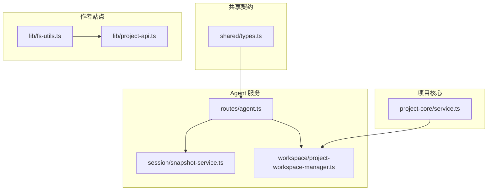
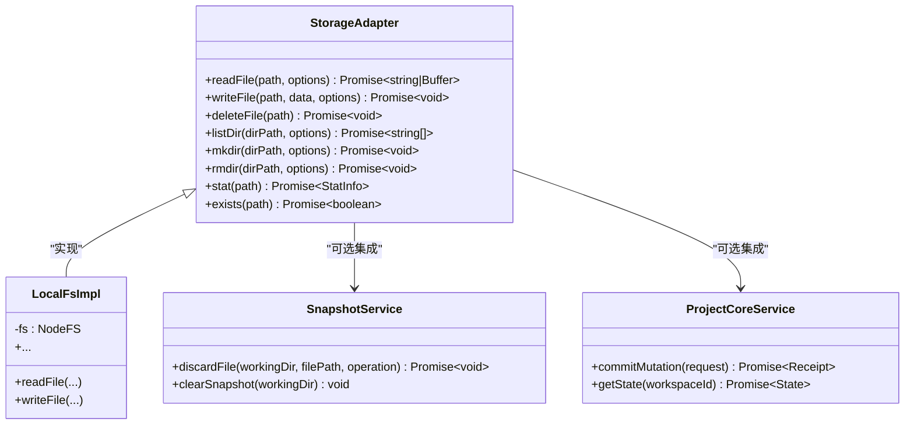
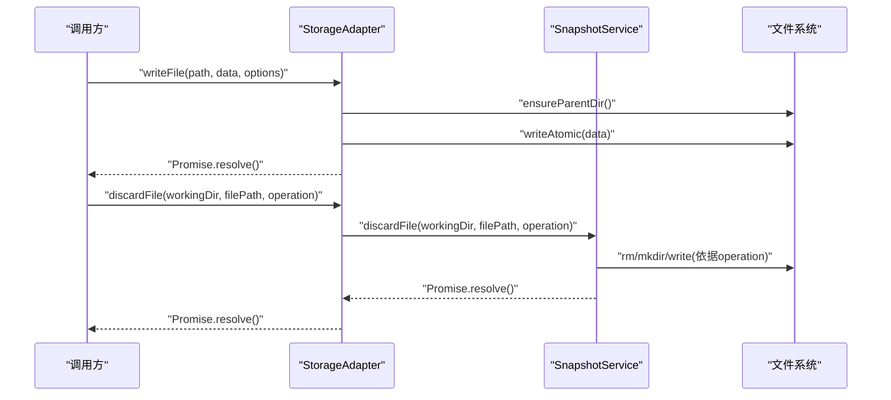
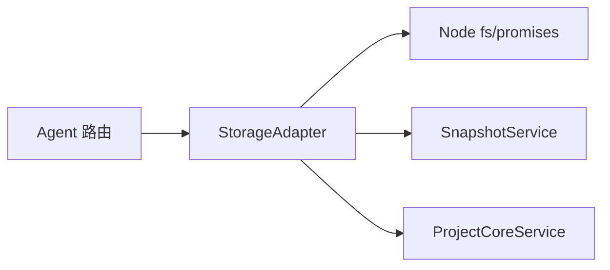

# 存储适配器接口规范

<cite>
**本文引用的文件**   
- [packages/shared/src/types.ts](file://packages/shared/src/types.ts)
- [packages/agent-service/AGENTS.md](file://packages/agent-service/AGENTS.md)
- [packages/agent-service/src/routes/agent.ts](file://packages/agent-service/src/routes/agent.ts)
- [packages/agent-service/src/session/snapshot-service.ts](file://packages/agent-service/src/session/snapshot-service.ts)
- [packages/agent-service/src/workspace/project-workspace-manager.ts](file://packages/agent-service/src/workspace/project-workspace-manager.ts)
- [packages/author-site/src/lib/fs-utils.ts](file://packages/author-site/src/lib/fs-utils.ts)
- [packages/author-site/src/lib/project-api.ts](file://packages/author-site/src/lib/project-api.ts)
- [packages/project-core/src/service.ts](file://packages/project-core/src/service.ts)
</cite>

## 目录
1. [简介](#简介)
2. [项目结构](#项目结构)
3. [核心组件](#核心组件)
4. [架构总览](#架构总览)
5. [详细组件分析](#详细组件分析)
6. [依赖分析](#依赖分析)
7. [性能考虑](#性能考虑)
8. [故障排查指南](#故障排查指南)
9. [结论](#结论)
10. [附录](#附录)

## 简介
本规范定义“存储适配器”的抽象接口，用于统一上层业务对底层文件系统、快照与版本化存储的访问。目标包括：
- 明确 StorageAdapter 接口的完整方法签名、参数类型约束与返回值格式
- 覆盖文件操作（readFile、writeFile、deleteFile）、目录管理（listDir、mkdir、rmdir）与元数据操作（stat、exists）
- 规定异步模式（Promise）、错误处理机制与超时控制策略
- 约定数据类型转换规则（Buffer、字符串、JSON 序列化/反序列化）
- 提供接口版本兼容性与向后兼容策略
- 给出 TypeScript 类型定义示例与最佳实践

## 项目结构
仓库中与存储相关的能力分布在多个包中：
- 共享契约与错误码：packages/shared/src/types.ts
- Agent 服务路由与会话文件丢弃：packages/agent-service/src/routes/agent.ts
- 会话快照服务（读/写/回滚）：packages/agent-service/src/session/snapshot-service.ts
- 工作区项目管理（统计、删除等）：packages/agent-service/src/workspace/project-workspace-manager.ts
- 作者站点工具（会话资源列举/删除）：packages/author-site/src/lib/fs-utils.ts
- 作者站点 API 客户端（文件夹管理）：packages/author-site/src/lib/project-api.ts
- 项目核心持久化（状态、Blob、版本）：packages/project-core/src/service.ts

图表来源
- [packages/shared/src/types.ts](file://packages/shared/src/types.ts)
- [packages/agent-service/src/routes/agent.ts](file://packages/agent-service/src/routes/agent.ts)
- [packages/agent-service/src/session/snapshot-service.ts](file://packages/agent-service/src/session/snapshot-service.ts)
- [packages/agent-service/src/workspace/project-workspace-manager.ts](file://packages/agent-service/src/workspace/project-workspace-manager.ts)
- [packages/author-site/src/lib/fs-utils.ts](file://packages/author-site/src/lib/fs-utils.ts)
- [packages/author-site/src/lib/project-api.ts](file://packages/author-site/src/lib/project-api.ts)
- [packages/project-core/src/service.ts](file://packages/project-core/src/service.ts)

章节来源
- [packages/shared/src/types.ts](file://packages/shared/src/types.ts)
- [packages/agent-service/src/routes/agent.ts](file://packages/agent-service/src/routes/agent.ts)
- [packages/agent-service/src/session/snapshot-service.ts](file://packages/agent-service/src/session/snapshot-service.ts)
- [packages/agent-service/src/workspace/project-workspace-manager.ts](file://packages/agent-service/src/workspace/project-workspace-manager.ts)
- [packages/author-site/src/lib/fs-utils.ts](file://packages/author-site/src/lib/fs-utils.ts)
- [packages/author-site/src/lib/project-api.ts](file://packages/author-site/src/lib/project-api.ts)
- [packages/project-core/src/service.ts](file://packages/project-core/src/service.ts)

## 核心组件
StorageAdapter 是面向上层的统一存储抽象，屏蔽底层实现差异（本地磁盘、快照、对象存储等）。其职责包括：
- 文件读写删：readFile、writeFile、deleteFile
- 目录管理：listDir、mkdir、rmdir
- 元数据：stat、exists
- 可选能力：批量操作、事务/原子写入、流式读取、并发限制、审计日志

为保证一致性，所有方法返回 Promise，并遵循统一的错误模型与超时控制策略。

章节来源
- [packages/shared/src/types.ts](file://packages/shared/src/types.ts)

## 架构总览
下图展示 StorageAdapter 在系统中的位置与交互关系：上层通过适配器进行文件与目录操作；内部可组合本地 fs、快照服务与项目核心持久化。

图表来源
- [packages/agent-service/src/session/snapshot-service.ts](file://packages/agent-service/src/session/snapshot-service.ts)
- [packages/project-core/src/service.ts](file://packages/project-core/src/service.ts)

## 详细组件分析

### 接口定义与方法语义
- readFile(path, options): 读取文本或二进制内容。options 支持 encoding、timeout、maxSize。返回 string 或 Buffer。
- writeFile(path, data, options): 写入文本或二进制。data 支持 string 或 Buffer。options 支持 encoding、overwrite、atomic、timeout。
- deleteFile(path): 删除文件。
- listDir(dirPath, options): 列出目录条目名数组。options 支持 recursive、filter。
- mkdir(dirPath, options): 创建目录。options 支持 recursive、mode。
- rmdir(dirPath, options): 删除空或非空目录。options 支持 recursive、force。
- stat(path): 返回 StatInfo（size、mtime、isFile、isDirectory 等）。
- exists(path): 返回布尔值表示是否存在。

类型与约束要点
- path/dirPath 使用相对路径或规范化绝对路径，禁止包含 .. 穿越父目录
- encoding 默认 utf-8；当 data 为 Buffer 时忽略 encoding
- timeout 以毫秒为单位，未设置则使用全局默认
- 所有方法均返回 Promise，拒绝时抛出标准化错误对象

章节来源
- [packages/shared/src/types.ts](file://packages/shared/src/types.ts)

### 异步模式与错误处理
- 全部方法返回 Promise，调用方应 await 或 .catch 处理异常
- 错误对象包含 code、message、details 字段，便于上层统一处理
- 常见错误码参考共享错误码集合（如 FILE_READ_ERROR、FILE_WRITE_ERROR、INTERNAL_ERROR 等）
- 建议对 I/O 密集操作设置合理超时，避免阻塞事件循环

章节来源
- [packages/shared/src/types.ts](file://packages/shared/src/types.ts)

### 超时控制
- 每个方法支持 options.timeout（毫秒），超过阈值主动拒绝
- 无显式超时时采用全局默认值
- 长耗时操作（递归列表、大文件写入）建议显式设置更大超时

章节来源
- [packages/shared/src/types.ts](file://packages/shared/src/types.ts)

### 数据类型转换规则
- 文本写入：string 按 encoding 编码后落盘
- 二进制写入：Buffer 直接落盘，忽略 encoding
- 文本读取：根据 encoding 返回 string；若请求 Buffer 则返回原始字节
- JSON 对象：由调用方自行序列化/反序列化，适配器不隐式处理 JSON

章节来源
- [packages/shared/src/types.ts](file://packages/shared/src/types.ts)

### 文件操作接口详解
- readFile
  - 输入：path(string), options({encoding?: string; timeout?: number; maxSize?: number})
  - 输出：Promise<string | Buffer>
  - 行为：校验路径安全、检查存在性、按编码读取、大小限制、超时控制
- writeFile
  - 输入：path(string), data(string | Buffer), options({encoding?: string; overwrite?: boolean; atomic?: boolean; timeout?: number})
  - 输出：Promise<void>
  - 行为：确保父目录存在（可配置）、原子写入（可选临时文件+重命名）、覆盖策略、超时控制
- deleteFile
  - 输入：path(string)
  - 输出：Promise<void>
  - 行为：不存在时静默成功或抛错（可配置）

章节来源
- [packages/shared/src/types.ts](file://packages/shared/src/types.ts)

### 目录管理接口详解
- listDir
  - 输入：dirPath(string), options({recursive?: boolean; filter?: (name:string)=>boolean; timeout?: number})
  - 输出：Promise<string[]>
  - 行为：过滤隐藏文件（可配置）、递归遍历、超时控制
- mkdir
  - 输入：dirPath(string), options({recursive?: boolean; mode?: number; timeout?: number})
  - 输出：Promise<void>
  - 行为：递归创建、权限设置、已存在幂等
- rmdir
  - 输入：dirPath(string), options({recursive?: boolean; force?: boolean; timeout?: number})
  - 输出：Promise<void>
  - 行为：非空目录清理策略、强制删除开关

章节来源
- [packages/shared/src/types.ts](file://packages/shared/src/types.ts)

### 元数据操作接口详解
- stat
  - 输入：path(string)
  - 输出：Promise<StatInfo>
  - 字段：size(number)、mtime(Date|number)、isFile(boolean)、isDirectory(boolean)、permissions?
- exists
  - 输入：path(string)
  - 输出：Promise<boolean>

章节来源
- [packages/shared/src/types.ts](file://packages/shared/src/types.ts)

### 与现有实现的映射与集成点
- 会话文件丢弃与快照恢复：通过 snapshot-service 提供的 discardFile/resetFile 完成基于快照的回滚
- 工作区项目统计与删除：project-workspace-manager 负责项目级目录与文件计数、删除流程
- 作者站点资源列举与删除：fs-utils 提供会话资源文件的同步工具函数，适配层可封装为异步接口
- 项目核心持久化：service.ts 中的状态、Blob、版本管理可作为适配器的高级后端

图表来源
- [packages/agent-service/src/session/snapshot-service.ts](file://packages/agent-service/src/session/snapshot-service.ts)

章节来源
- [packages/agent-service/src/session/snapshot-service.ts](file://packages/agent-service/src/session/snapshot-service.ts)
- [packages/agent-service/src/workspace/project-workspace-manager.ts](file://packages/agent-service/src/workspace/project-workspace-manager.ts)
- [packages/author-site/src/lib/fs-utils.ts](file://packages/author-site/src/lib/fs-utils.ts)
- [packages/project-core/src/service.ts](file://packages/project-core/src/service.ts)

### 接口版本兼容性与向后兼容策略
- 新增可选参数：保持旧调用方可用，默认行为不变
- 废弃字段：保留解析逻辑但记录告警，至少一个主版本后再移除
- 错误码演进：新增错误码需文档化，旧错误码保持不变
- 返回值扩展：新增可选字段不得影响既有字段语义
- 兼容性测试：对关键路径增加回归用例，确保旧客户端与新服务端互通

章节来源
- [packages/shared/src/types.ts](file://packages/shared/src/types.ts)

### TypeScript 类型定义示例（示意）
以下为 StorageAdapter 的类型定义示例（仅示意，不包含具体代码内容）：
- 基础类型
  - Path = string
  - Encoding = 'utf-8' | 'base64' | 'binary'
  - TimeoutMs = number
  - StatInfo = { size: number; mtime: number | Date; isFile: boolean; isDirectory: boolean }
- 选项类型
  - ReadOptions = { encoding?: Encoding; timeout?: TimeoutMs; maxSize?: number }
  - WriteOptions = { encoding?: Encoding; overwrite?: boolean; atomic?: boolean; timeout?: TimeoutMs }
  - ListOptions = { recursive?: boolean; filter?: (name: string) => boolean; timeout?: TimeoutMs }
  - MkdirOptions = { recursive?: boolean; mode?: number; timeout?: TimeoutMs }
  - RmdirOptions = { recursive?: boolean; force?: boolean; timeout?: TimeoutMs }
- 接口
  - interface StorageAdapter {
      readFile(path: Path, options?: ReadOptions): Promise<string | Buffer>;
      writeFile(path: Path, data: string | Buffer, options?: WriteOptions): Promise<void>;
      deleteFile(path: Path): Promise<void>;
      listDir(dirPath: Path, options?: ListOptions): Promise<string[]>;
      mkdir(dirPath: Path, options?: MkdirOptions): Promise<void>;
      rmdir(dirPath: Path, options?: RmdirOptions): Promise<void>;
      stat(path: Path): Promise<StatInfo>;
      exists(path: Path): Promise<boolean>;
    }

章节来源
- [packages/shared/src/types.ts](file://packages/shared/src/types.ts)

### 最佳实践
- 路径安全：始终规范化路径，拒绝包含 .. 的路径
- 原子写入：对关键文件启用 atomic 写入，降低损坏风险
- 大小限制：读取大文件时设置 maxSize，防止内存溢出
- 超时保护：为所有 I/O 操作设置合理超时，避免长时间挂起
- 错误分类：区分业务错误与系统错误，便于上层重试与降级
- 幂等设计：mkdir/rmdir 等目录操作保证幂等
- 日志与审计：记录关键操作的 path、size、耗时与结果

[本节为通用指导，无需源码引用]

## 依赖分析
StorageAdapter 的依赖关系如下：
- 直接依赖：Node.js 文件系统（fs/promises）、路径库（path）
- 可选依赖：快照服务（会话级回滚）、项目核心（版本化持久化）
- 间接依赖：HTTP 路由层（如 agent 路由）可能调用适配器进行文件操作

图表来源
- [packages/agent-service/src/routes/agent.ts](file://packages/agent-service/src/routes/agent.ts)
- [packages/agent-service/src/session/snapshot-service.ts](file://packages/agent-service/src/session/snapshot-service.ts)
- [packages/project-core/src/service.ts](file://packages/project-core/src/service.ts)

章节来源
- [packages/agent-service/src/routes/agent.ts](file://packages/agent-service/src/routes/agent.ts)
- [packages/agent-service/src/session/snapshot-service.ts](file://packages/agent-service/src/session/snapshot-service.ts)
- [packages/project-core/src/service.ts](file://packages/project-core/src/service.ts)

## 性能考虑
- 批量操作：合并多次小写入为一次原子提交，减少系统调用
- 并发控制：限制并行 I/O 数量，避免打满磁盘队列
- 缓存策略：对小体积元数据（exists/stat）做短期缓存
- 分块读写：超大文件采用流式读写，降低峰值内存
- 预分配与对齐：对固定大小记录采用预分配，提升写入吞吐

[本节为通用指导，无需源码引用]

## 故障排查指南
- 读取失败
  - 检查路径是否存在、权限是否足够、是否触发大小限制
  - 查看错误码是否为 FILE_READ_ERROR
- 写入失败
  - 确认父目录是否存在、磁盘空间是否充足、是否启用原子写入
  - 查看错误码是否为 FILE_WRITE_ERROR
- 目录操作失败
  - 检查递归标志、权限、是否尝试删除非空目录
- 超时问题
  - 增大 timeout 或优化 I/O 路径，定位慢操作
- 快照回滚异常
  - 核对 workingDir 与 filePath 有效性，确认 Git 或快照状态

章节来源
- [packages/shared/src/types.ts](file://packages/shared/src/types.ts)
- [packages/agent-service/src/routes/agent.ts](file://packages/agent-service/src/routes/agent.ts)
- [packages/agent-service/src/session/snapshot-service.ts](file://packages/agent-service/src/session/snapshot-service.ts)

## 结论
StorageAdapter 为上层提供了稳定、一致且可扩展的存储抽象。通过明确的类型约束、统一的错误模型与超时控制，结合快照与版本化持久化的可选集成，能够支撑复杂场景下的文件与目录操作需求。遵循本规范的实现将具备良好的可维护性与向后兼容性。

[本节为总结性内容，无需源码引用]

## 附录
- 相关 API 与工具参考
  - 会话文件丢弃与回滚：packages/agent-service/src/routes/agent.ts、packages/agent-service/src/session/snapshot-service.ts
  - 项目工作区管理：packages/agent-service/src/workspace/project-workspace-manager.ts
  - 作者站点资源工具：packages/author-site/src/lib/fs-utils.ts、packages/author-site/src/lib/project-api.ts
  - 项目核心持久化：packages/project-core/src/service.ts

章节来源
- [packages/agent-service/src/routes/agent.ts](file://packages/agent-service/src/routes/agent.ts)
- [packages/agent-service/src/session/snapshot-service.ts](file://packages/agent-service/src/session/snapshot-service.ts)
- [packages/agent-service/src/workspace/project-workspace-manager.ts](file://packages/agent-service/src/workspace/project-workspace-manager.ts)
- [packages/author-site/src/lib/fs-utils.ts](file://packages/author-site/src/lib/fs-utils.ts)
- [packages/author-site/src/lib/project-api.ts](file://packages/author-site/src/lib/project-api.ts)
- [packages/project-core/src/service.ts](file://packages/project-core/src/service.ts)