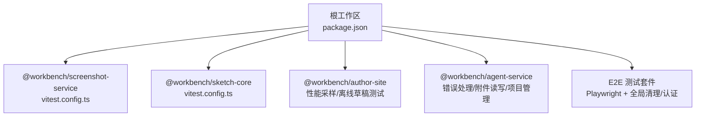
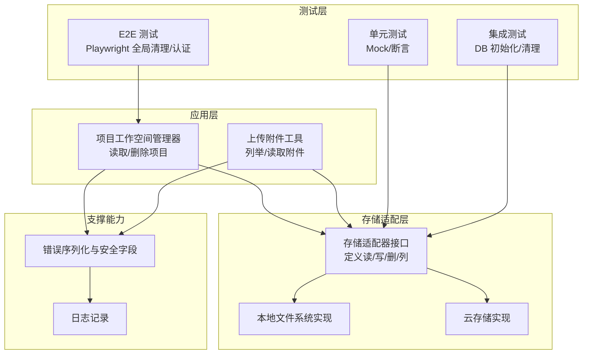
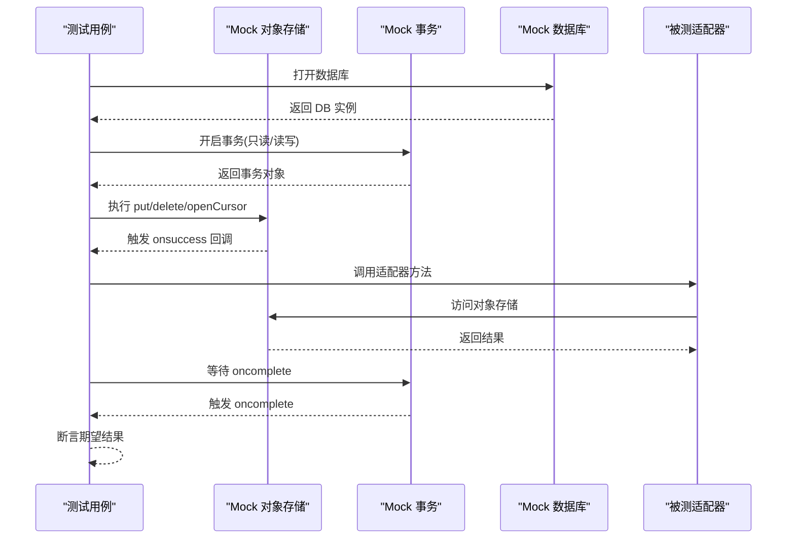
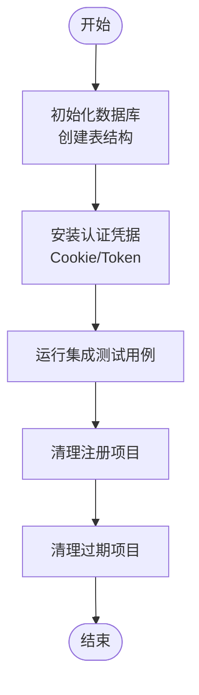
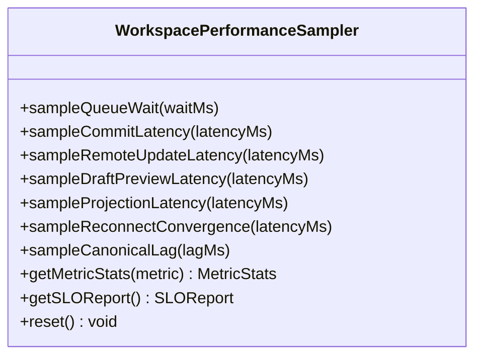
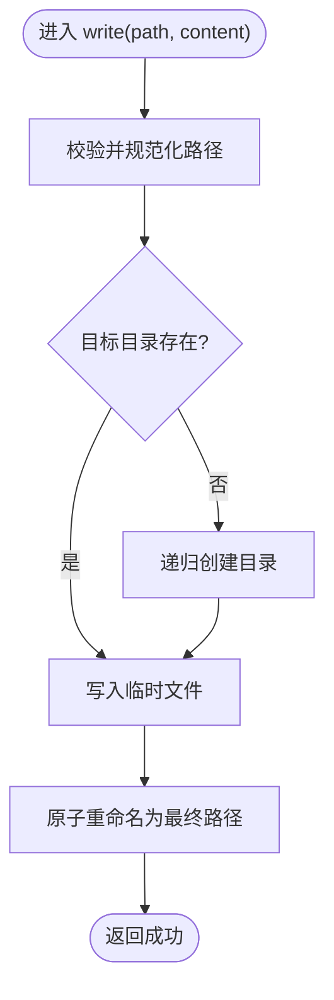
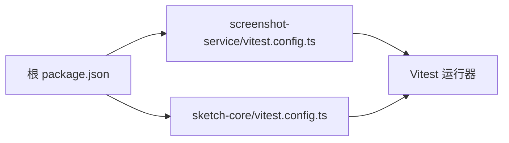

# 开发模板与示例

<cite>
**本文引用的文件**   
- [package.json](file://package.json)
- [vitest.config.ts（截图服务）](file://packages/screenshot-service/vitest.config.ts)
- [vitest.config.ts（sketch-core）](file://packages/sketch-core/vitest.config.ts)
- [workspace-performance-sampling.ts](file://packages/author-site/src/lib/workspace-performance-sampling.ts)
- [workspace-performance-sampling.test.ts](file://packages/author-site/src/lib/__tests__/workspace-performance-sampling.test.ts)
- [workspace-offline-drafts.test.ts](file://packages/author-site/src/lib/__tests__/workspace-offline-drafts.test.ts)
- [tool-hook-manager.test.ts](file://packages/agent-service/tests/unit/tool-hook-manager.test.ts)
- [error-utils.ts](file://packages/agent-service/src/utils/error-utils.ts)
- [uploaded-file-attachments.ts](file://packages/agent-service/src/utils/uploaded-file-attachments.ts)
- [project-workspace-manager.ts](file://packages/agent-service/src/workspace/project-workspace-manager.ts)
- [schema.ts](file://packages/author-site/src/lib/db/schema.ts)
- [init-db.ts](file://packages/author-site/scripts/init-db.ts)
- [global-teardown.ts](file://test/创作端E2E回归测试/global-teardown.ts)
- [e2e-auth.ts](file://test/创作端E2E回归测试/support/e2e-auth.ts)
</cite>

## 目录
1. [简介](#简介)
2. [项目结构](#项目结构)
3. [核心组件](#核心组件)
4. [架构总览](#架构总览)
5. [详细组件分析](#详细组件分析)
6. [依赖分析](#依赖分析)
7. [性能考虑](#性能考虑)
8. [故障排查指南](#故障排查指南)
9. [结论](#结论)
10. [附录](#附录)

## 简介
本文件面向“自定义存储适配器”的开发，提供一套可复用的模板与实践：包括基础适配器抽象、通用错误处理与日志记录、单元测试（Jest/Vitest 配置、模拟对象、断言）、集成测试（环境搭建、数据库准备、数据清理）、性能基准（吞吐、延迟、资源监控），以及完整的开发工具链（ESLint、Prettier、Git Hooks）。同时给出本地文件系统与云存储适配器的完整实现思路与参考路径。

## 项目结构
仓库采用多包工作区组织，测试与工具链分布在多个子包中：
- 根脚本与工作流：包含统一命令入口、E2E 测试编排等
- 子包测试配置：Vitest 在各子包内独立配置，便于隔离运行与覆盖率统计
- 性能采样与 SLO 报告：位于 author-site 的运行时指标采集与报告
- 错误序列化与日志安全：在 agent-service 中提供统一的错误序列化能力
- E2E 测试：基于 Playwright，提供全局清理与认证辅助

图表来源
- [package.json:1-101](file://package.json#L1-L101)
- [vitest.config.ts（截图服务）:1-24](file://packages/screenshot-service/vitest.config.ts#L1-L24)
- [vitest.config.ts（sketch-core）:1-8](file://packages/sketch-core/vitest.config.ts#L1-L8)

章节来源
- [package.json:1-101](file://package.json#L1-L101)

## 核心组件
围绕“存储适配器”主题，以下组件可作为模板与参考：
- 基础适配器抽象与通用错误处理：通过统一的错误序列化与日志安全字段控制，确保异常信息可控且可观测
- 单元测试模板：使用 Vitest/Jest 风格的 describe/it/expect 模式，结合内存或浏览器 API 的 Mock 对象
- 集成测试方案：基于 Playwright 的全局清理与认证注入，配合数据库初始化脚本完成环境准备
- 性能基准：以环形缓冲区收集延迟样本，计算 p50/p95/p99 并生成 SLO 报告

章节来源
- [error-utils.ts:1-106](file://packages/agent-service/src/utils/error-utils.ts#L1-L106)
- [workspace-performance-sampling.ts:201-279](file://packages/author-site/src/lib/workspace-performance-sampling.ts#L201-L279)
- [workspace-performance-sampling.test.ts:40-185](file://packages/author-site/src/lib/__tests__/workspace-performance-sampling.test.ts#L40-L185)
- [workspace-offline-drafts.test.ts:50-143](file://packages/author-site/src/lib/__tests__/workspace-offline-drafts.test.ts#L50-L143)
- [tool-hook-manager.test.ts:1-54](file://packages/agent-service/tests/unit/tool-hook-manager.test.ts#L1-L54)
- [schema.ts:1-51](file://packages/author-site/src/lib/db/schema.ts#L1-L51)
- [init-db.ts:1-10](file://packages/author-site/scripts/init-db.ts#L1-L10)
- [global-teardown.ts:1-50](file://test/创作端E2E回归测试/global-teardown.ts#L1-L50)
- [e2e-auth.ts:1-95](file://test/创作端E2E回归测试/support/e2e-auth.ts#L1-L95)

## 架构总览
下图展示了“存储适配器”在系统中的位置与交互关系：上层业务调用适配器接口，底层由本地文件系统或云存储实现；错误与日志通过统一工具进行序列化与输出；测试层覆盖单元、集成与 E2E。

图表来源
- [project-workspace-manager.ts:234-282](file://packages/agent-service/src/workspace/project-workspace-manager.ts#L234-L282)
- [uploaded-file-attachments.ts:40-107](file://packages/agent-service/src/utils/uploaded-file-attachments.ts#L40-L107)
- [error-utils.ts:1-106](file://packages/agent-service/src/utils/error-utils.ts#L1-L106)

## 详细组件分析

### 基础适配器类与抽象方法
- 建议抽象出统一的存储适配器接口，包含：
  - 写入：write(path, content)
  - 读取：read(path)
  - 删除：remove(path)
  - 列举：list(prefix)
  - 元数据：stat(path)
- 通用错误处理：
  - 使用统一的错误序列化函数，仅保留安全字段，避免敏感信息泄露
  - 对常见 I/O 错误码进行映射，转换为领域错误类型
- 日志记录：
  - 在关键路径打点（开始/结束/失败），附带上下文（如 path、size、latency）

章节来源
- [error-utils.ts:1-106](file://packages/agent-service/src/utils/error-utils.ts#L1-L106)

### 单元测试编写（Jest/Vitest）
- 测试框架选择：
  - 子包使用 Vitest（例如 screenshot-service、sketch-core）
  - Jest 风格用例结构与断言在仓库中广泛存在，可直接迁移到 Vitest
- 模拟对象创建：
  - 针对浏览器 IndexedDB 的 ObjectStore/Transaction/Cursor 行为，构造异步回调式 Mock，保证 onsuccess/oncomplete 时序正确
- 断言库使用：
  - 使用 expect 进行值、数组、对象结构的断言；必要时使用 toBeCloseTo 比较浮点数
- 典型用例参考：
  - 性能采样器：验证各指标采样、统计计算、SLO 报告与 reset 行为
  - 离线草稿：验证 put/delete/cursor 遍历与事务完成时机
  - 工具钩子：验证错误场景不返回变更、写入产生 modified 变更

图表来源
- [workspace-offline-drafts.test.ts:50-143](file://packages/author-site/src/lib/__tests__/workspace-offline-drafts.test.ts#L50-L143)
- [workspace-performance-sampling.test.ts:40-185](file://packages/author-site/src/lib/__tests__/workspace-performance-sampling.test.ts#L40-L185)
- [tool-hook-manager.test.ts:1-54](file://packages/agent-service/tests/unit/tool-hook-manager.test.ts#L1-L54)

章节来源
- [workspace-offline-drafts.test.ts:50-143](file://packages/author-site/src/lib/__tests__/workspace-offline-drafts.test.ts#L50-L143)
- [workspace-performance-sampling.test.ts:40-185](file://packages/author-site/src/lib/__tests__/workspace-performance-sampling.test.ts#L40-L185)
- [tool-hook-manager.test.ts:1-54](file://packages/agent-service/tests/unit/tool-hook-manager.test.ts#L1-L54)

### 集成测试方案（环境搭建、数据库准备、数据清理）
- 环境搭建：
  - 使用 Playwright 启动浏览器上下文，注入认证 Cookie 或 Token
  - 通过 HTTP 客户端与服务端交互，完成端到端流程
- 数据库准备：
  - 在测试前执行数据库初始化脚本，创建必要表结构
- 数据清理：
  - 在全局 teardown 阶段，按注册表清理已创建的项目，并回收残留项目

图表来源
- [schema.ts:1-51](file://packages/author-site/src/lib/db/schema.ts#L1-L51)
- [init-db.ts:1-10](file://packages/author-site/scripts/init-db.ts#L1-L10)
- [global-teardown.ts:1-50](file://test/创作端E2E回归测试/global-teardown.ts#L1-L50)
- [e2e-auth.ts:1-95](file://test/创作端E2E回归测试/support/e2e-auth.ts#L1-L95)

章节来源
- [schema.ts:1-51](file://packages/author-site/src/lib/db/schema.ts#L1-L51)
- [init-db.ts:1-10](file://packages/author-site/scripts/init-db.ts#L1-L10)
- [global-teardown.ts:1-50](file://test/创作端E2E回归测试/global-teardown.ts#L1-L50)
- [e2e-auth.ts:1-95](file://test/创作端E2E回归测试/support/e2e-auth.ts#L1-L95)

### 性能基准测试模板（吞吐、延迟、资源监控）
- 延迟测量：
  - 使用环形缓冲区收集延迟样本，支持重置与统计计算
  - 指标包括队列等待、提交延迟、远程更新延迟、预览延迟、投影确认延迟、重连收敛时间、物化延迟等
- 吞吐测试：
  - 并发写入/读取固定数量请求，统计成功数与平均耗时
- 资源监控：
  - 记录 CPU/内存占用快照，结合 SLO 目标评估是否达标

图表来源
- [workspace-performance-sampling.ts:201-279](file://packages/author-site/src/lib/workspace-performance-sampling.ts#L201-L279)

章节来源
- [workspace-performance-sampling.ts:201-279](file://packages/author-site/src/lib/workspace-performance-sampling.ts#L201-L279)
- [workspace-performance-sampling.test.ts:40-185](file://packages/author-site/src/lib/__tests__/workspace-performance-sampling.test.ts#L40-L185)

### 实际开发案例一：本地文件系统适配器
- 设计要点：
  - 路径安全校验，防止目录穿越
  - 原子写入策略（先写临时文件再重命名）
  - 并发安全：目录不存在时递归创建
- 参考实现路径：
  - 列举与读取上传附件：展示路径解析、目录遍历、manifest 校验
  - 项目工作空间管理：列举项目、获取详情、删除项目

图表来源
- [uploaded-file-attachments.ts:40-107](file://packages/agent-service/src/utils/uploaded-file-attachments.ts#L40-L107)
- [project-workspace-manager.ts:234-282](file://packages/agent-service/src/workspace/project-workspace-manager.ts#L234-L282)

章节来源
- [uploaded-file-attachments.ts:40-107](file://packages/agent-service/src/utils/uploaded-file-attachments.ts#L40-L107)
- [project-workspace-manager.ts:234-282](file://packages/agent-service/src/workspace/project-workspace-manager.ts#L234-L282)

### 实际开发案例二：云存储适配器
- 设计要点：
  - 将本地适配器的 read/write/remove/list/stat 映射为 SDK 调用
  - 重试与退避策略：网络抖动时的自动重试
  - 分片上传与断点续传：大文件优化
  - 事件与回调：上传进度、失败回调
- 参考实现路径：
  - 错误序列化：统一捕获并序列化错误，避免泄露敏感信息
  - 日志记录：在关键步骤记录上下文与耗时

章节来源
- [error-utils.ts:1-106](file://packages/agent-service/src/utils/error-utils.ts#L1-L106)

## 依赖分析
- 测试框架与覆盖率：
  - 子包通过 vitest.config.ts 指定 include/exclude、覆盖率 reporter 与别名
- 根脚本与工作流：
  - 统一命令封装，聚合各包的 typecheck/test/lint 等任务

图表来源
- [package.json:1-101](file://package.json#L1-L101)
- [vitest.config.ts（截图服务）:1-24](file://packages/screenshot-service/vitest.config.ts#L1-L24)
- [vitest.config.ts（sketch-core）:1-8](file://packages/sketch-core/vitest.config.ts#L1-L8)

章节来源
- [package.json:1-101](file://package.json#L1-L101)
- [vitest.config.ts（截图服务）:1-24](file://packages/screenshot-service/vitest.config.ts#L1-L24)
- [vitest.config.ts（sketch-core）:1-8](file://packages/sketch-core/vitest.config.ts#L1-L8)

## 性能考虑
- 延迟采样：
  - 使用环形缓冲区限制内存占用，避免无限增长
  - 计算 p50/p95/p99 用于 SLO 评估
- 吞吐测试：
  - 并发度可调，观察成功率与平均耗时变化
- 资源监控：
  - 记录 GC 停顿、堆大小、CPU 使用率，定位热点路径

[本节为通用指导，无需具体文件引用]

## 故障排查指南
- 错误序列化：
  - 使用统一函数提取 name/message/stack 等安全字段，并对字符串截断，避免日志过大
- 常见问题：
  - 路径越界：检查路径规范化与白名单校验
  - 权限不足：检查目录创建与文件写入权限
  - 网络超时：增加重试与退避策略

章节来源
- [error-utils.ts:1-106](file://packages/agent-service/src/utils/error-utils.ts#L1-L106)

## 结论
通过统一的适配器抽象、错误处理与日志规范，结合完善的单测、集成与 E2E 测试体系，以及性能基准与 SLO 报告，可以高效地扩展多种存储后端（本地文件系统、云存储等）。建议在新增适配器时遵循本文提供的模板与最佳实践，确保质量与可维护性。

[本节为总结，无需具体文件引用]

## 附录
- 开发工具链配置建议：
  - ESLint：统一代码风格与静态检查规则
  - Prettier：格式化代码，保持团队一致
  - Git Hooks：pre-commit 运行 lint/format，CI 运行 test/typecheck
  - 覆盖率阈值：在 CI 中设置最低覆盖率要求
- 参考配置路径：
  - 子包测试配置：vitest.config.ts（截图服务、sketch-core）
  - 根脚本：package.json 中的统一命令

章节来源
- [vitest.config.ts（截图服务）:1-24](file://packages/screenshot-service/vitest.config.ts#L1-L24)
- [vitest.config.ts（sketch-core）:1-8](file://packages/sketch-core/vitest.config.ts#L1-L8)
- [package.json:1-101](file://package.json#L1-L101)