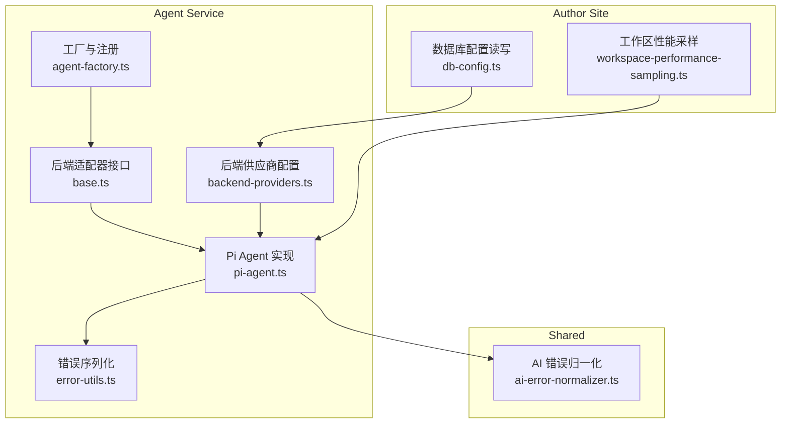
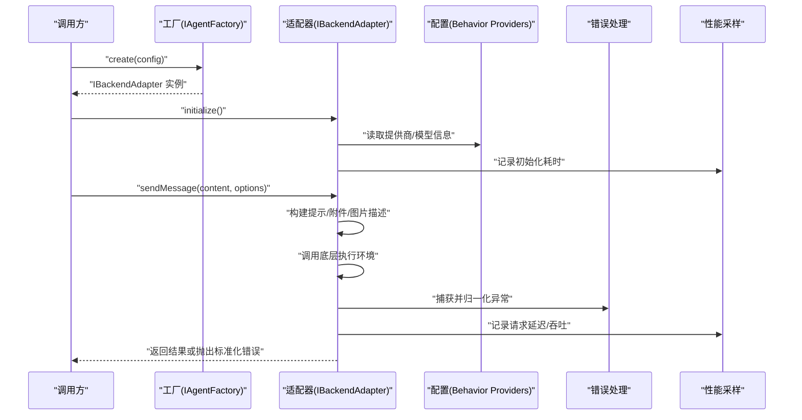
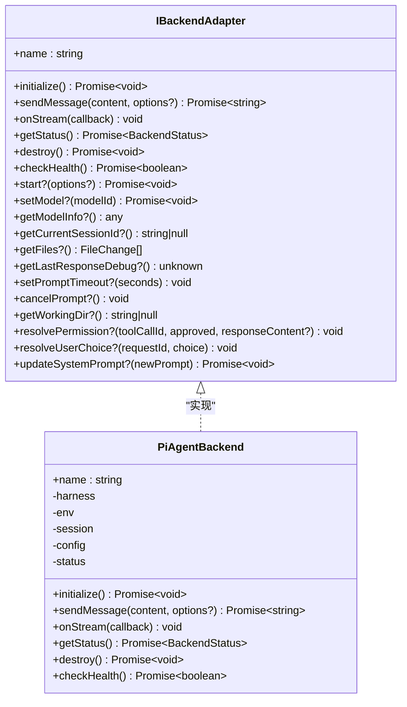
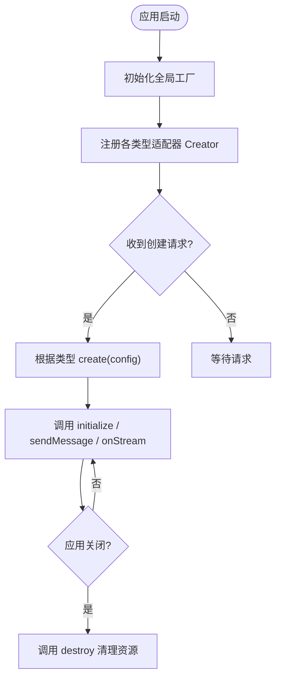
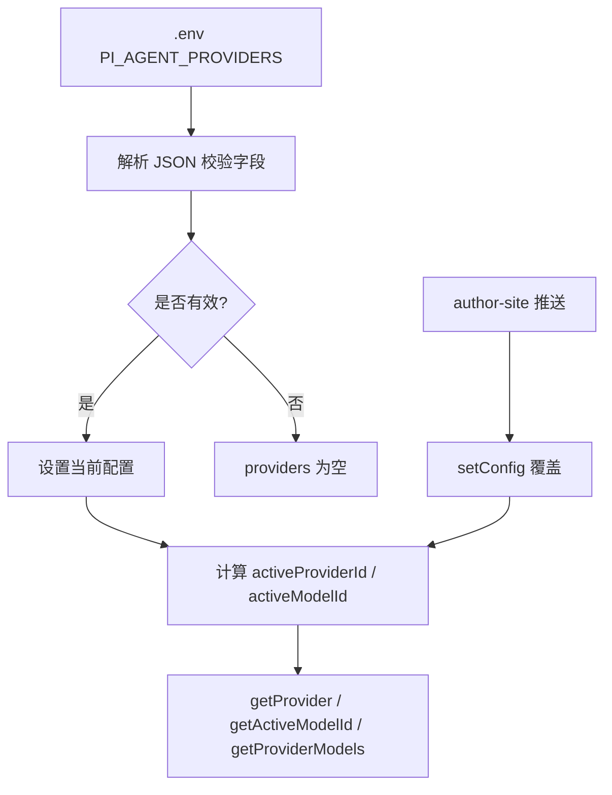
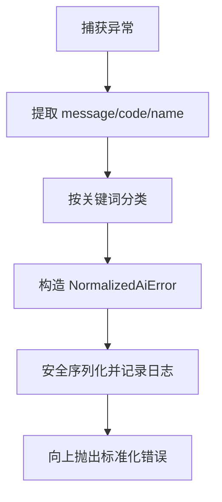
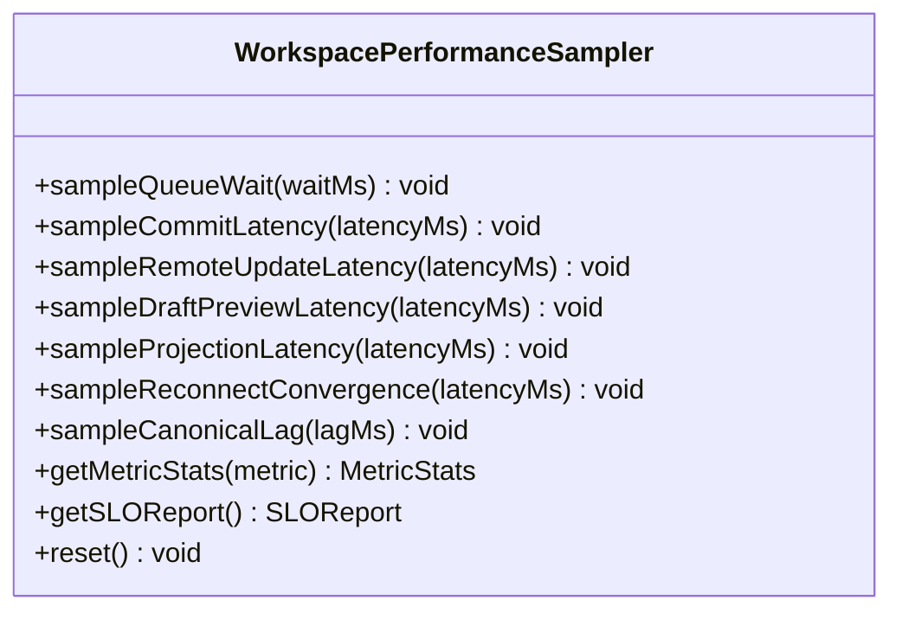
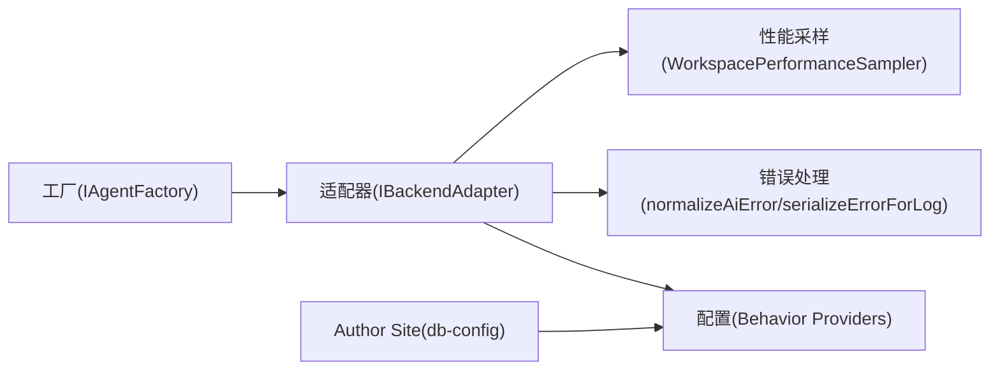

# 自定义存储适配器开发

<cite>
**本文引用的文件**   
- [packages/agent-service/src/backends/base.ts](file://packages/agent-service/src/backends/base.ts)
- [packages/agent-service/src/backends/pi-agent.ts](file://packages/agent-service/src/backends/pi-agent.ts)
- [packages/agent-service/src/core/agent-factory.ts](file://packages/agent-service/src/core/agent-factory.ts)
- [packages/agent-service/src/config/backend-providers.ts](file://packages/agent-service/src/config/backend-providers.ts)
- [packages/shared/src/ai-error-normalizer.ts](file://packages/shared/src/ai-error-normalizer.ts)
- [packages/agent-service/src/utils/error-utils.ts](file://packages/agent-service/src/utils/error-utils.ts)
- [packages/author-site/src/lib/db-config.ts](file://packages/author-site/src/lib/db-config.ts)
- [packages/author-site/src/lib/workspace-performance-sampling.ts](file://packages/author-site/src/lib/workspace-performance-sampling.ts)
- [packages/author-site/src/lib/__tests__/workspace-offline-drafts.test.ts](file://packages/author-site/src/lib/__tests__/workspace-offline-drafts.test.ts)
</cite>

## 目录
1. [引言](#引言)
2. [项目结构](#项目结构)
3. [核心组件](#核心组件)
4. [架构总览](#架构总览)
5. [详细组件分析](#详细组件分析)
6. [依赖关系分析](#依赖关系分析)
7. [性能考虑](#性能考虑)
8. [故障排查指南](#故障排查指南)
9. [结论](#结论)
10. [附录](#附录)

## 引言
本指南面向需要为系统扩展“自定义存储适配器”的开发者。文档围绕以下目标展开：
- 明确存储适配器接口规范（方法、参数类型与返回值）
- 说明适配器的注册机制（动态加载、依赖注入、生命周期管理）
- 给出配置管理方案（配置文件格式、环境变量映射、默认值处理）
- 统一错误处理与异常转换（统一错误码、异常包装、日志记录）
- 提供完整的适配器开发模板（基础类实现、单元测试、集成测试）
- 定义性能监控指标（吞吐量、延迟、资源使用率）
- 给出实际开发示例与调试技巧

## 项目结构
仓库采用多包 monorepo 组织，与存储适配器相关的关键位置如下：
- 后端适配器接口与实现位于 agent-service 包
- 工厂与注册中心位于 agent-service 包的 core 层
- 配置管理与运行时热更新位于 agent-service 包的 config 层
- 错误归一化与日志序列化位于 shared 与 agent-service 工具层
- 配置持久化与同步在 author-site 包中通过数据库读写封装完成
- 性能采样与 SLO 报告在 author-site 包中提供通用能力

图表来源
- [packages/agent-service/src/backends/base.ts:1-30](file://packages/agent-service/src/backends/base.ts#L1-L30)
- [packages/agent-service/src/backends/pi-agent.ts:112-152](file://packages/agent-service/src/backends/pi-agent.ts#L112-L152)
- [packages/agent-service/src/core/agent-factory.ts:1-50](file://packages/agent-service/src/core/agent-factory.ts#L1-L50)
- [packages/agent-service/src/config/backend-providers.ts:1-188](file://packages/agent-service/src/config/backend-providers.ts#L1-L188)
- [packages/shared/src/ai-error-normalizer.ts:1-157](file://packages/shared/src/ai-error-normalizer.ts#L1-L157)
- [packages/agent-service/src/utils/error-utils.ts:1-133](file://packages/agent-service/src/utils/error-utils.ts#L1-L133)
- [packages/author-site/src/lib/db-config.ts:1-129](file://packages/author-site/src/lib/db-config.ts#L1-L129)
- [packages/author-site/src/lib/workspace-performance-sampling.ts:201-279](file://packages/author-site/src/lib/workspace-performance-sampling.ts#L201-L279)

章节来源
- [packages/agent-service/src/backends/base.ts:1-30](file://packages/agent-service/src/backends/base.ts#L1-L30)
- [packages/agent-service/src/backends/pi-agent.ts:112-152](file://packages/agent-service/src/backends/pi-agent.ts#L112-L152)
- [packages/agent-service/src/core/agent-factory.ts:1-50](file://packages/agent-service/src/core/agent-factory.ts#L1-L50)
- [packages/agent-service/src/config/backend-providers.ts:1-188](file://packages/agent-service/src/config/backend-providers.ts#L1-L188)
- [packages/shared/src/ai-error-normalizer.ts:1-157](file://packages/shared/src/ai-error-normalizer.ts#L1-L157)
- [packages/agent-service/src/utils/error-utils.ts:1-133](file://packages/agent-service/src/utils/error-utils.ts#L1-L133)
- [packages/author-site/src/lib/db-config.ts:1-129](file://packages/author-site/src/lib/db-config.ts#L1-L129)
- [packages/author-site/src/lib/workspace-performance-sampling.ts:201-279](file://packages/author-site/src/lib/workspace-performance-sampling.ts#L201-L279)

## 核心组件
- 后端适配器接口 IBackendAdapter：定义了初始化、消息发送、事件流、状态查询、销毁与健康检查等必需方法，以及可选的会话、模型切换、权限交互、工作目录等扩展能力。
- PiAgentBackend：基于 IBackendAdapter 的具体实现，负责与底层执行环境、模型、工具链、权限与用户交互管理器协作。
- 工厂与注册：IAgentFactory 提供按类型创建与注册能力，支持全局单例工厂获取。
- 配置管理：BackendProvidersManager 提供从环境变量与运行时推送的配置加载、合并与查询。
- 错误处理：normalizeAiError 将外部异常归一化为统一结构；serializeErrorForLog 安全序列化错误用于日志。
- 配置持久化：db-config 提供 system_configs 表的 CRUD 与默认值初始化。
- 性能采样：WorkspacePerformanceSampler 提供多维度延迟统计与 SLO 报告。

章节来源
- [packages/agent-service/src/backends/base.ts:1-30](file://packages/agent-service/src/backends/base.ts#L1-L30)
- [packages/agent-service/src/backends/pi-agent.ts:112-152](file://packages/agent-service/src/backends/pi-agent.ts#L112-L152)
- [packages/agent-service/src/core/agent-factory.ts:1-50](file://packages/agent-service/src/core/agent-factory.ts#L1-L50)
- [packages/agent-service/src/config/backend-providers.ts:1-188](file://packages/agent-service/src/config/backend-providers.ts#L1-L188)
- [packages/shared/src/ai-error-normalizer.ts:1-157](file://packages/shared/src/ai-error-normalizer.ts#L1-L157)
- [packages/agent-service/src/utils/error-utils.ts:1-133](file://packages/agent-service/src/utils/error-utils.ts#L1-L133)
- [packages/author-site/src/lib/db-config.ts:1-129](file://packages/author-site/src/lib/db-config.ts#L1-L129)
- [packages/author-site/src/lib/workspace-performance-sampling.ts:201-279](file://packages/author-site/src/lib/workspace-performance-sampling.ts#L201-L279)

## 架构总览
下图展示了“自定义存储适配器”在系统中的角色与交互：
- 上层业务通过工厂创建具体适配器实例
- 适配器遵循 IBackendAdapter 契约，暴露统一 API
- 配置由 BackendProvidersManager 提供，支持启动时与环境变量加载，以及运行时热更新
- 错误在适配器内部进行归一化与安全序列化后上报
- 配置持久化由 author-site 写入 DB，agent-service 通过推送或轮询获得最新配置
- 性能采样贯穿关键路径，输出 SLO 报告

图表来源
- [packages/agent-service/src/core/agent-factory.ts:1-50](file://packages/agent-service/src/core/agent-factory.ts#L1-L50)
- [packages/agent-service/src/backends/base.ts:1-30](file://packages/agent-service/src/backends/base.ts#L1-L30)
- [packages/agent-service/src/config/backend-providers.ts:1-188](file://packages/agent-service/src/config/backend-providers.ts#L1-L188)
- [packages/shared/src/ai-error-normalizer.ts:1-157](file://packages/shared/src/ai-error-normalizer.ts#L1-L157)
- [packages/author-site/src/lib/workspace-performance-sampling.ts:201-279](file://packages/author-site/src/lib/workspace-performance-sampling.ts#L201-L279)

## 详细组件分析

### 适配器接口与实现
- 接口 IBackendAdapter 定义了：
  - 必需方法：initialize、sendMessage、onStream、getStatus、destroy、checkHealth
  - 可选方法：start、setModel、getModelInfo、getCurrentSessionId、getFiles、getLastResponseDebug、setPromptTimeout、cancelPrompt、getWorkingDir、resolvePermission、resolveUserChoice、updateSystemPrompt
- 实现 PiAgentBackend：
  - 维护运行状态、会话、工具钩子、事件映射、模型与权限管理器
  - initialize 中完成依赖加载、环境/会话/工具/Harness 创建与 Hook 注册
  - sendMessage 中组装上下文（上传文件、图片描述）、调用底层引擎、提取文本与摘要、错误处理与日志
  - destroy 中清理订阅、中止运行、释放环境与会话

图表来源
- [packages/agent-service/src/backends/base.ts:1-30](file://packages/agent-service/src/backends/base.ts#L1-L30)
- [packages/agent-service/src/backends/pi-agent.ts:112-152](file://packages/agent-service/src/backends/pi-agent.ts#L112-L152)

章节来源
- [packages/agent-service/src/backends/base.ts:1-30](file://packages/agent-service/src/backends/base.ts#L1-L30)
- [packages/agent-service/src/backends/pi-agent.ts:112-152](file://packages/agent-service/src/backends/pi-agent.ts#L112-L152)

### 适配器注册与生命周期
- 工厂模式：IAgentFactory 提供 register(type, creator)、create(config)、has(type)、getRegisteredTypes()
- 全局单例：getAgentFactory() 保证进程内唯一工厂实例
- 生命周期：
  - 启动阶段：工厂可用，按需注册不同后端类型
  - 运行阶段：根据配置选择类型并 create 实例
  - 关闭阶段：调用 destroy 释放资源

图表来源
- [packages/agent-service/src/core/agent-factory.ts:1-50](file://packages/agent-service/src/core/agent-factory.ts#L1-L50)

章节来源
- [packages/agent-service/src/core/agent-factory.ts:1-50](file://packages/agent-service/src/core/agent-factory.ts#L1-L50)

### 配置管理方案
- 数据源优先级（运行时）：
  1) author-site 推送的最新配置（最高优先级）
  2) .env 中 PI_AGENT_PROVIDERS JSON（启动 fallback）
  3) 硬编码默认（极简场景）
- 环境变量映射：
  - PI_AGENT_PROVIDERS：JSON 数组，包含 provider 列表
  - PI_AGENT_PROVIDER / PI_AGENT_MODEL：激活的 provider 与 model（组合为 providerId/modelId）
- 默认值处理：
  - 未设置时 providers 为空，等待 author-site 推送
  - activeProviderId 与 activeModelId 回退到第一个 enabled provider 与其 defaultModel 或 models[0]
- 配置持久化：
  - author-site 通过 db-config 对 system_configs 表进行读写与默认初始化
  - agent-service 通过 setConfig 接收推送，实现运行时热更新

图表来源
- [packages/agent-service/src/config/backend-providers.ts:1-188](file://packages/agent-service/src/config/backend-providers.ts#L1-L188)
- [packages/author-site/src/lib/db-config.ts:1-129](file://packages/author-site/src/lib/db-config.ts#L1-L129)

章节来源
- [packages/agent-service/src/config/backend-providers.ts:1-188](file://packages/agent-service/src/config/backend-providers.ts#L1-L188)
- [packages/author-site/src/lib/db-config.ts:1-129](file://packages/author-site/src/lib/db-config.ts#L1-L129)

### 错误处理与异常转换
- 统一错误码与分类：
  - normalizeAiError 将未知错误转换为 NormalizedAiError，包含 code、category、userMessage、technicalMessage
  - 分类包括 connection、timeout、auth、quota、busy、cancelled、server、unknown
- 安全日志序列化：
  - serializeErrorForLog 仅拷贝安全字段，截断超长字符串，递归序列化 cause/response 摘要
- 适配器内错误处理建议：
  - 在 sendMessage 等关键路径捕获异常，先归一化再抛出
  - 记录结构化日志，避免泄露敏感信息

图表来源
- [packages/shared/src/ai-error-normalizer.ts:1-157](file://packages/shared/src/ai-error-normalizer.ts#L1-L157)
- [packages/agent-service/src/utils/error-utils.ts:1-133](file://packages/agent-service/src/utils/error-utils.ts#L1-L133)

章节来源
- [packages/shared/src/ai-error-normalizer.ts:1-157](file://packages/shared/src/ai-error-normalizer.ts#L1-L157)
- [packages/agent-service/src/utils/error-utils.ts:1-133](file://packages/agent-service/src/utils/error-utils.ts#L1-L133)

### 性能监控指标
- 维度与指标：
  - 队列等待时间 queue-wait
  - Authority commit 延迟 commit-latency
  - 远程协作更新延迟 remote-update-latency
  - draft 预览延迟 draft-preview-latency
  - projection ack 延迟 projection-latency
  - 重连收敛时间 reconnect-convergence
  - canonical 物化延迟 canonical-lag
- 统计与 SLO：
  - 计算 p50/p95/p99/min/max/average/count
  - 生成 SLO 报告，判断是否达标
- 在适配器中的接入点：
  - initialize/sendMessage/destroy 等关键路径埋点
  - 结合 EventMapper 与工具钩子采集中间态耗时

图表来源
- [packages/author-site/src/lib/workspace-performance-sampling.ts:201-279](file://packages/author-site/src/lib/workspace-performance-sampling.ts#L201-L279)

章节来源
- [packages/author-site/src/lib/workspace-performance-sampling.ts:201-279](file://packages/author-site/src/lib/workspace-performance-sampling.ts#L201-L279)

### 完整适配器开发模板
- 基础类实现要点：
  - 实现 IBackendAdapter 所有必需方法，按需实现可选方法
  - initialize 中完成依赖加载、资源准备、Hook 注册与状态置为 ready
  - sendMessage 中组装上下文、调用底层、提取结果、错误归一化与日志
  - destroy 中取消订阅、中止运行、释放环境与会话
- 单元测试编写：
  - 模拟底层依赖（如对象存储、网络、文件系统），验证边界条件与错误分支
  - 参考现有测试风格，使用异步微任务与事件回调模拟真实行为
- 集成测试：
  - 端到端验证配置加载、推送热更新、健康检查与销毁流程
  - 结合性能采样器输出 SLO 报告，确保关键路径满足目标

章节来源
- [packages/agent-service/src/backends/base.ts:1-30](file://packages/agent-service/src/backends/base.ts#L1-L30)
- [packages/agent-service/src/backends/pi-agent.ts:112-152](file://packages/agent-service/src/backends/pi-agent.ts#L112-L152)
- [packages/author-site/src/lib/__tests__/workspace-offline-drafts.test.ts:50-143](file://packages/author-site/src/lib/__tests__/workspace-offline-drafts.test.ts#L50-L143)

## 依赖关系分析
- 耦合与内聚：
  - IBackendAdapter 作为稳定契约，降低实现间耦合
  - PiAgentBackend 聚合多个管理器（模型、权限、用户交互、工具钩子、事件映射），职责清晰
- 直接依赖：
  - 工厂依赖适配器接口
  - 配置管理器被适配器在初始化与运行时查询
  - 错误归一化工具被适配器在异常路径使用
- 间接依赖：
  - author-site 通过数据库持久化配置，agent-service 通过推送热更新
  - 性能采样器可被上层或适配器侧埋点使用

图表来源
- [packages/agent-service/src/core/agent-factory.ts:1-50](file://packages/agent-service/src/core/agent-factory.ts#L1-L50)
- [packages/agent-service/src/backends/base.ts:1-30](file://packages/agent-service/src/backends/base.ts#L1-L30)
- [packages/agent-service/src/config/backend-providers.ts:1-188](file://packages/agent-service/src/config/backend-providers.ts#L1-L188)
- [packages/shared/src/ai-error-normalizer.ts:1-157](file://packages/shared/src/ai-error-normalizer.ts#L1-L157)
- [packages/agent-service/src/utils/error-utils.ts:1-133](file://packages/agent-service/src/utils/error-utils.ts#L1-L133)
- [packages/author-site/src/lib/db-config.ts:1-129](file://packages/author-site/src/lib/db-config.ts#L1-L129)

章节来源
- [packages/agent-service/src/core/agent-factory.ts:1-50](file://packages/agent-service/src/core/agent-factory.ts#L1-L50)
- [packages/agent-service/src/backends/base.ts:1-30](file://packages/agent-service/src/backends/base.ts#L1-L30)
- [packages/agent-service/src/config/backend-providers.ts:1-188](file://packages/agent-service/src/config/backend-providers.ts#L1-L188)
- [packages/shared/src/ai-error-normalizer.ts:1-157](file://packages/shared/src/ai-error-normalizer.ts#L1-L157)
- [packages/agent-service/src/utils/error-utils.ts:1-133](file://packages/agent-service/src/utils/error-utils.ts#L1-L133)
- [packages/author-site/src/lib/db-config.ts:1-129](file://packages/author-site/src/lib/db-config.ts#L1-L129)

## 性能考虑
- 关键路径埋点：
  - initialize、sendMessage、destroy 等入口与出口处记录耗时
  - 结合事件流与工具钩子，细化中间步骤延迟
- 指标聚合：
  - 使用采样器计算分位数与均值，定期生成 SLO 报告
  - 关注 p95/p99 长尾，识别热点瓶颈
- 资源使用：
  - 控制并发与超时，避免资源泄漏
  - 在 destroy 中确保清理所有订阅与临时资源

## 故障排查指南
- 常见问题定位：
  - 配置未生效：检查 .env 中 PI_AGENT_PROVIDERS 是否为合法 JSON 数组，确认 author-site 推送是否成功
  - 模型不可用：核对 activeProviderId 与 activeModelId 是否存在且 enabled
  - 错误频繁：查看归一化后的 category 与 technicalMessage，定位连接/鉴权/配额/服务器问题
- 日志与诊断：
  - 使用安全序列化输出错误摘要，避免泄露敏感信息
  - 结合性能采样器输出，对比 SLO 目标判断是否退化
- 测试辅助：
  - 使用 Mock 对象存储与事务，模拟 IDB 行为，验证异步回调时序
  - 针对边界条件（空样本、超时、取消）编写用例

章节来源
- [packages/agent-service/src/config/backend-providers.ts:1-188](file://packages/agent-service/src/config/backend-providers.ts#L1-L188)
- [packages/shared/src/ai-error-normalizer.ts:1-157](file://packages/shared/src/ai-error-normalizer.ts#L1-L157)
- [packages/agent-service/src/utils/error-utils.ts:1-133](file://packages/agent-service/src/utils/error-utils.ts#L1-L133)
- [packages/author-site/src/lib/__tests__/workspace-offline-drafts.test.ts:50-143](file://packages/author-site/src/lib/__tests__/workspace-offline-drafts.test.ts#L50-L143)

## 结论
通过统一的适配器接口、工厂注册机制、配置热更新与标准化错误处理，系统能够灵活扩展多种存储与后端实现。配合完善的性能采样与 SLO 报告，可在复杂场景中保障稳定性与可观测性。按照本指南提供的模板与最佳实践，开发者可以快速实现高质量、可维护的自定义存储适配器。

## 附录
- 术语
  - 适配器：实现 IBackendAdapter 的后端模块
  - 工厂：按类型创建适配器实例的管理器
  - 配置：提供商与模型集合，支持环境变量与运行时推送
  - 错误归一化：将外部异常转换为统一结构的工具
  - 性能采样：记录关键路径延迟并生成 SLO 报告的机制