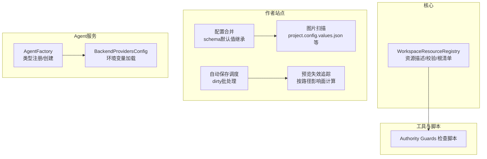
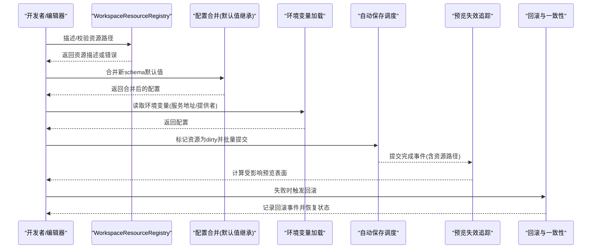
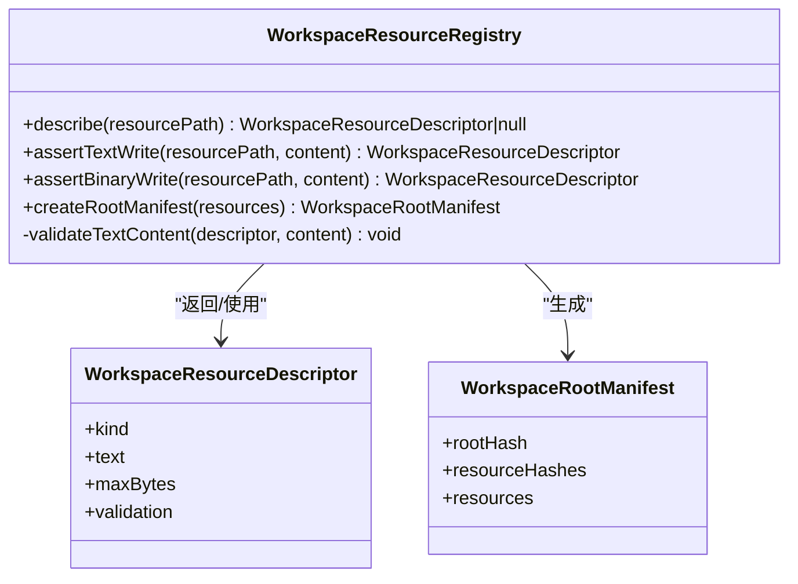
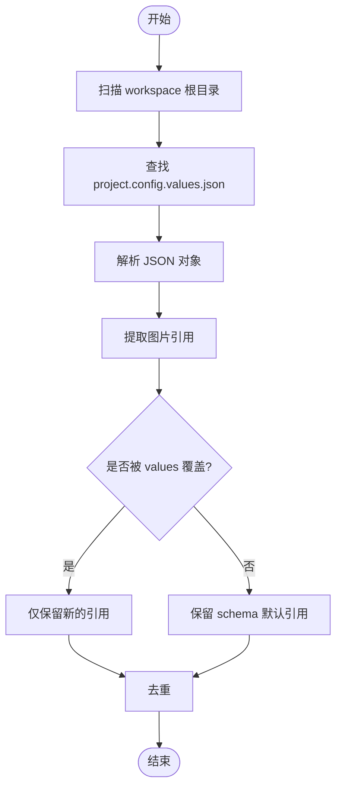
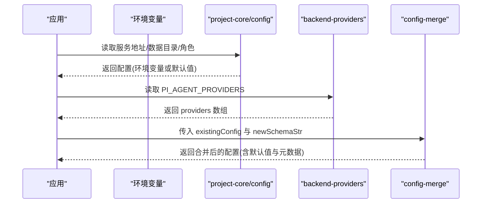
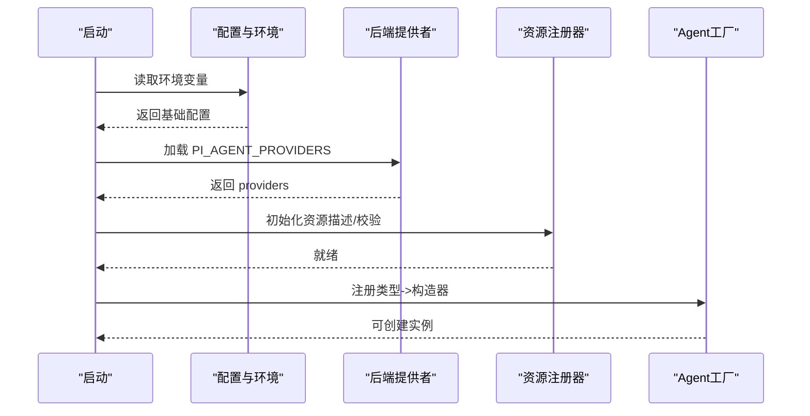
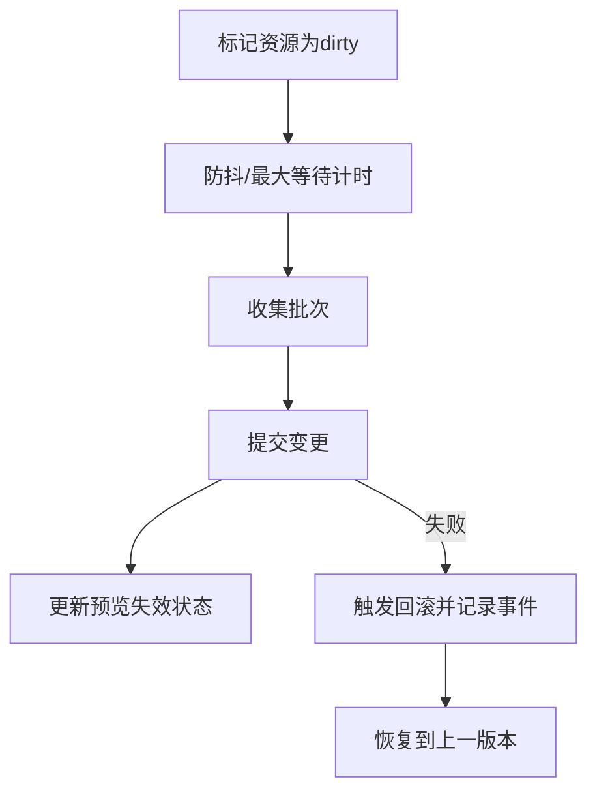
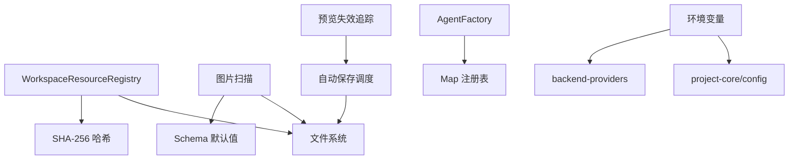

# 适配器注册机制

<cite>
**本文引用的文件**
- [packages/project-core/src/workspace-resource-registry.ts](file://packages/project-core/src/workspace-resource-registry.ts)
- [packages/project-core/src/__tests__/workspace-resource-registry.test.ts](file://packages/project-core/src/__tests__/workspace-resource-registry.test.ts)
- [scripts/check-workspace-authority-guards.mjs](file://scripts/check-workspace-authority-guards.mjs)
- [packages/agent-service/src/core/agent-factory.ts](file://packages/agent-service/src/core/agent-factory.ts)
- [packages/author-site/src/lib/config-merge.ts](file://packages/author-site/src/lib/config-merge.ts)
- [packages/project-core/src/config.ts](file://packages/project-core/src/config.ts)
- [packages/agent-service/src/config/backend-providers.ts](file://packages/agent-service/src/config/backend-providers.ts)
- [packages/author-site/src/lib/publish/image-scanner.ts](file://packages/author-site/src/lib/publish/image-scanner.ts)
- [packages/author-site/src/lib/workspace-autosave-scheduler.ts](file://packages/author-site/src/lib/workspace-autosave-scheduler.ts)
- [packages/author-site/src/lib/preview-projection-tracker.ts](file://packages/author-site/src/lib/preview-projection-tracker.ts)
- [test/创作端E2E回归测试/workspace-mutation-authority.spec.ts](file://test/创作端E2E回归测试/workspace-mutation-authority.spec.ts)
- [packages/agent-service/tests/unit/workspace-mutation-authority.test.ts](file://packages/agent-service/tests/unit/workspace-mutation-authority.test.ts)
</cite>

## 目录
1. [简介](#简介)
2. [项目结构](#项目结构)
3. [核心组件](#核心组件)
4. [架构总览](#架构总览)
5. [详细组件分析](#详细组件分析)
6. [依赖分析](#依赖分析)
7. [性能考虑](#性能考虑)
8. [故障排查指南](#故障排查指南)
9. [结论](#结论)
10. [附录](#附录)

## 简介
本指南围绕“适配器注册机制”展开，聚焦 WorkspaceResourceRegistry 的工作原理与扩展方式，覆盖动态加载流程、依赖注入容器与生命周期管理；说明适配器发现策略（文件系统扫描、模块导入、插件发现）；解释配置驱动注册（配置文件解析、环境变量映射、默认值继承）；描述运行时注册流程（初始化顺序、依赖解析、冲突解决）；并提供热重载支持方案（增量更新、状态保持、回滚机制），以及完整的注册配置示例与调试技巧。

## 项目结构
仓库采用多包 monorepo 组织，与适配器注册相关的关键位置如下：
- 资源注册与校验：packages/project-core/src/workspace-resource-registry.ts
- 注册器测试与断言：packages/project-core/src/__tests__/workspace-resource-registry.test.ts
- 注册能力守卫检查脚本：scripts/check-workspace-authority-guards.mjs
- 通用配置与环境变量：packages/project-core/src/config.ts
- 配置合并与默认值继承：packages/author-site/src/lib/config-merge.ts
- 后端提供者配置加载（环境变量）：packages/agent-service/src/config/backend-providers.ts
- 图片引用扫描（用于发布阶段资源发现）：packages/author-site/src/lib/publish/image-scanner.ts
- 自动保存调度（脏标记与批量提交）：packages/author-site/src/lib/workspace-autosave-scheduler.ts
- 预览失效追踪（基于变更路径的失效策略）：packages/author-site/src/lib/preview-projection-tracker.ts
- 回滚与一致性保障（E2E 与单元测试）：test/创作端E2E回归测试/workspace-mutation-authority.spec.ts、packages/agent-service/tests/unit/workspace-mutation-authority.test.ts

图表来源
- [packages/project-core/src/workspace-resource-registry.ts:52-136](file://packages/project-core/src/workspace-resource-registry.ts#L52-L136)
- [packages/author-site/src/lib/config-merge.ts:39-103](file://packages/author-site/src/lib/config-merge.ts#L39-L103)
- [packages/author-site/src/lib/publish/image-scanner.ts:153-183](file://packages/author-site/src/lib/publish/image-scanner.ts#L153-L183)
- [packages/author-site/src/lib/workspace-autosave-scheduler.ts:71-215](file://packages/author-site/src/lib/workspace-autosave-scheduler.ts#L71-L215)
- [packages/author-site/src/lib/preview-projection-tracker.ts:96-128](file://packages/author-site/src/lib/preview-projection-tracker.ts#L96-L128)
- [packages/agent-service/src/core/agent-factory.ts:13-41](file://packages/agent-service/src/core/agent-factory.ts#L13-L41)
- [packages/agent-service/src/config/backend-providers.ts:34-63](file://packages/agent-service/src/config/backend-providers.ts#L34-L63)
- [scripts/check-workspace-authority-guards.mjs:351-375](file://scripts/check-workspace-authority-guards.mjs#L351-L375)

章节来源
- [packages/project-core/src/workspace-resource-registry.ts:1-141](file://packages/project-core/src/workspace-resource-registry.ts#L1-L141)
- [packages/project-core/src/__tests__/workspace-resource-registry.test.ts:30-69](file://packages/project-core/src/__tests__/workspace-resource-registry.test.ts#L30-L69)
- [scripts/check-workspace-authority-guards.mjs:330-383](file://scripts/check-workspace-authority-guards.mjs#L330-L383)

## 核心组件
- WorkspaceResourceRegistry：集中式资源策略，负责资源路径归一化、类型描述、文本/二进制写入校验、Sketch 场景文档校验、工作区树结构校验、根清单生成与哈希计算。
- AgentFactory：轻量级类型到构造器的注册表，提供注册、创建、查询能力，作为依赖注入容器的最小实现。
- 配置系统：
  - project-core/config：从环境变量解析服务地址、数据目录、审计目录、批大小、角色与白名单等。
  - author-site/config-merge：将现有配置与新 schema 的默认值进行合并，保留用户值并兼容类型变化。
  - agent-service/backend-providers：从环境变量加载后端提供者配置，作为启动 fallback。
- 资源发现与发布：image-scanner 扫描 workspace 根目录的项目级配置值中的图片引用，结合 schema default 覆盖逻辑，避免冗余扫描。
- 运行时调度与失效：autosave-scheduler 对 dirty 资源进行去重与批处理提交；preview-projection-tracker 根据变更路径计算受影响预览表面。

章节来源
- [packages/project-core/src/workspace-resource-registry.ts:52-136](file://packages/project-core/src/workspace-resource-registry.ts#L52-L136)
- [packages/agent-service/src/core/agent-factory.ts:13-41](file://packages/agent-service/src/core/agent-factory.ts#L13-L41)
- [packages/project-core/src/config.ts:32-94](file://packages/project-core/src/config.ts#L32-L94)
- [packages/author-site/src/lib/config-merge.ts:39-103](file://packages/author-site/src/lib/config-merge.ts#L39-L103)
- [packages/agent-service/src/config/backend-providers.ts:34-63](file://packages/agent-service/src/config/backend-providers.ts#L34-L63)
- [packages/author-site/src/lib/publish/image-scanner.ts:153-183](file://packages/author-site/src/lib/publish/image-scanner.ts#L153-L183)
- [packages/author-site/src/lib/workspace-autosave-scheduler.ts:71-215](file://packages/author-site/src/lib/workspace-autosave-scheduler.ts#L71-L215)
- [packages/author-site/src/lib/preview-projection-tracker.ts:96-128](file://packages/author-site/src/lib/preview-projection-tracker.ts#L96-L128)

## 架构总览
下图展示适配器注册机制在系统中的关键交互：资源注册与校验、配置驱动注册、运行时调度与失效、以及回滚与一致性保障。

图表来源
- [packages/project-core/src/workspace-resource-registry.ts:52-136](file://packages/project-core/src/workspace-resource-registry.ts#L52-L136)
- [packages/author-site/src/lib/config-merge.ts:39-103](file://packages/author-site/src/lib/config-merge.ts#L39-L103)
- [packages/agent-service/src/config/backend-providers.ts:34-63](file://packages/agent-service/src/config/backend-providers.ts#L34-L63)
- [packages/author-site/src/lib/workspace-autosave-scheduler.ts:71-215](file://packages/author-site/src/lib/workspace-autosave-scheduler.ts#L71-L215)
- [packages/author-site/src/lib/preview-projection-tracker.ts:96-128](file://packages/author-site/src/lib/preview-projection-tracker.ts#L96-L128)
- [packages/agent-service/tests/unit/workspace-mutation-authority.test.ts:178-193](file://packages/agent-service/tests/unit/workspace-mutation-authority.test.ts#L178-L193)
- [test/创作端E2E回归测试/workspace-mutation-authority.spec.ts:591-621](file://test/创作端E2E回归测试/workspace-mutation-authority.spec.ts#L591-L621)

## 详细组件分析

### WorkspaceResourceRegistry 工作原理
- 资源路径归一化与安全校验：统一斜杠、去除前导斜杠、拒绝包含空字符与越界路径。
- 资源描述匹配：通过正则与精确匹配识别页面代码、原型 HTML/CSS/Meta、Schema、Sketch 场景与 Meta、项目 Schema/Values、工作区树、画布布局、知识文档/清单、静态资源等。
- 写入校验：
  - 文本写入：限制最大字节数，按 kind 执行 JSON 对象校验、工作区树结构校验、Sketch 场景文档校验。
  - 二进制写入：非空且不超过上限。
- 根清单生成：遍历资源集合，规范化路径、校验内容、计算每个资源的 SHA-256 哈希，排序后生成 resourceHashes 与 rootHash。

图表来源
- [packages/project-core/src/workspace-resource-registry.ts:52-136](file://packages/project-core/src/workspace-resource-registry.ts#L52-L136)

章节来源
- [packages/project-core/src/workspace-resource-registry.ts:41-112](file://packages/project-core/src/workspace-resource-registry.ts#L41-L112)
- [packages/project-core/src/__tests__/workspace-resource-registry.test.ts:30-69](file://packages/project-core/src/__tests__/workspace-resource-registry.test.ts#L30-L69)

### 适配器发现机制
- 文件系统扫描：image-scanner 递归扫描 workspace 根目录，定位 project.config.values.json 并提取图片引用；同时结合 schema default 覆盖逻辑，避免扫描被覆盖的旧默认值。
- 模块导入：预览运行时代码通过 Blob URL 或外部 URL 动态 import 模块，并在成功/失败时上报时序与错误信息，便于定位依赖导入问题。
- 插件发现策略：当前仓库未提供通用的插件发现框架，但可通过 AgentFactory 的模式扩展（见下节）。

图表来源
- [packages/author-site/src/lib/publish/image-scanner.ts:153-183](file://packages/author-site/src/lib/publish/image-scanner.ts#L153-L183)

章节来源
- [packages/author-site/src/lib/publish/image-scanner.ts:153-183](file://packages/author-site/src/lib/publish/image-scanner.ts#L153-L183)

### 配置驱动注册
- 配置文件解析：
  - project-core/config：从环境变量解析服务地址、数据目录、审计目录、批大小、角色与允许项目列表等。
  - agent-service/backend-providers：从 PI_AGENT_PROVIDERS 环境变量加载后端提供者数组，若为空则等待作者站推送。
- 环境变量映射：
  - getProjectAdminDataDir、getScreenshotServiceUrl、getAgentServiceUrl 等函数优先读取环境变量，否则回退到默认值或相对路径。
- 默认值继承：
  - config-merge.mergeSchemaDefaults 将现有配置与新 schema 的默认值合并，保留用户值，兼容类型变化，并从 schema 中抽取 __order、__orderH、__positions 等元数据。

图表来源
- [packages/project-core/src/config.ts:32-94](file://packages/project-core/src/config.ts#L32-L94)
- [packages/agent-service/src/config/backend-providers.ts:34-63](file://packages/agent-service/src/config/backend-providers.ts#L34-L63)
- [packages/author-site/src/lib/config-merge.ts:39-103](file://packages/author-site/src/lib/config-merge.ts#L39-L103)

章节来源
- [packages/project-core/src/config.ts:32-94](file://packages/project-core/src/config.ts#L32-L94)
- [packages/agent-service/src/config/backend-providers.ts:34-63](file://packages/agent-service/src/config/backend-providers.ts#L34-L63)
- [packages/author-site/src/lib/config-merge.ts:39-103](file://packages/author-site/src/lib/config-merge.ts#L39-L103)

### 运行时注册流程
- 初始化顺序：
  - 先加载环境变量与服务地址（project-core/config）。
  - 再加载后端提供者（backend-providers）。
  - 随后进行资源注册与校验（WorkspaceResourceRegistry）。
- 依赖解析：
  - 通过 AgentFactory 维护类型到构造器的映射，create 时根据类型获取 creator 并实例化。
- 冲突解决：
  - AgentFactory.register 在重复注册同类型时抛出错误，防止覆盖。
  - WorkspaceResourceRegistry 在写入时严格校验，非法操作抛出 WORKSPACE_INVALID_OPERATION。

图表来源
- [packages/project-core/src/config.ts:32-94](file://packages/project-core/src/config.ts#L32-L94)
- [packages/agent-service/src/config/backend-providers.ts:34-63](file://packages/agent-service/src/config/backend-providers.ts#L34-L63)
- [packages/project-core/src/workspace-resource-registry.ts:52-136](file://packages/project-core/src/workspace-resource-registry.ts#L52-L136)
- [packages/agent-service/src/core/agent-factory.ts:13-41](file://packages/agent-service/src/core/agent-factory.ts#L13-L41)

章节来源
- [packages/agent-service/src/core/agent-factory.ts:13-41](file://packages/agent-service/src/core/agent-factory.ts#L13-L41)
- [packages/project-core/src/workspace-resource-registry.ts:52-136](file://packages/project-core/src/workspace-resource-registry.ts#L52-L136)

### 适配器热重载支持
- 增量更新：
  - autosave-scheduler 对 dirty 资源进行去重与批处理，支持 debounce 与 max-wait 策略，减少频繁提交开销。
- 状态保持：
  - preview-projection-tracker 维护各预览表面的 appliedRevision 与 invalidated 标志，收到 committed 事件后按 invalidationStrategy 计算受影响表面。
- 回滚机制：
  - E2E 与单元测试验证了中途失败时的回滚行为，确保部分写入失败不会污染工作区状态，并记录回滚事件。

图表来源
- [packages/author-site/src/lib/workspace-autosave-scheduler.ts:71-215](file://packages/author-site/src/lib/workspace-autosave-scheduler.ts#L71-L215)
- [packages/author-site/src/lib/preview-projection-tracker.ts:96-128](file://packages/author-site/src/lib/preview-projection-tracker.ts#L96-L128)
- [packages/agent-service/tests/unit/workspace-mutation-authority.test.ts:178-193](file://packages/agent-service/tests/unit/workspace-mutation-authority.test.ts#L178-L193)
- [test/创作端E2E回归测试/workspace-mutation-authority.spec.ts:591-621](file://test/创作端E2E回归测试/workspace-mutation-authority.spec.ts#L591-L621)

章节来源
- [packages/author-site/src/lib/workspace-autosave-scheduler.ts:71-215](file://packages/author-site/src/lib/workspace-autosave-scheduler.ts#L71-L215)
- [packages/author-site/src/lib/preview-projection-tracker.ts:96-128](file://packages/author-site/src/lib/preview-projection-tracker.ts#L96-L128)
- [packages/agent-service/tests/unit/workspace-mutation-authority.test.ts:178-193](file://packages/agent-service/tests/unit/workspace-mutation-authority.test.ts#L178-L193)
- [test/创作端E2E回归测试/workspace-mutation-authority.spec.ts:591-621](file://test/创作端E2E回归测试/workspace-mutation-authority.spec.ts#L591-L621)

## 依赖分析
- 组件耦合与内聚：
  - WorkspaceResourceRegistry 高内聚于资源策略与校验，对外暴露简洁 API。
  - AgentFactory 低耦合，仅维护 Map 类型的注册表。
  - 配置系统解耦环境与服务发现，便于替换与扩展。
- 直接/间接依赖：
  - image-scanner 依赖 project.config.values.json 与 schema default 覆盖逻辑。
  - autosave-scheduler 与 preview-projection-tracker 通过事件与路径进行弱耦合协作。
- 外部依赖与集成点：
  - 环境变量（PI_AGENT_PROVIDERS、DATA_DIR、SERVICE_URL 等）。
  - 文件系统（读写 workspace 资源）。
- 接口契约与实现细节：
  - WorkspaceResourceRegistry 的 describe/assert/createRootManifest 构成核心契约。
  - AgentFactory 的 register/create/has/getRegisteredTypes 构成最小 DI 契约。

图表来源
- [packages/project-core/src/workspace-resource-registry.ts:47-49](file://packages/project-core/src/workspace-resource-registry.ts#L47-L49)
- [packages/author-site/src/lib/publish/image-scanner.ts:153-183](file://packages/author-site/src/lib/publish/image-scanner.ts#L153-L183)
- [packages/author-site/src/lib/workspace-autosave-scheduler.ts:71-215](file://packages/author-site/src/lib/workspace-autosave-scheduler.ts#L71-L215)
- [packages/author-site/src/lib/preview-projection-tracker.ts:96-128](file://packages/author-site/src/lib/preview-projection-tracker.ts#L96-L128)
- [packages/agent-service/src/core/agent-factory.ts:13-41](file://packages/agent-service/src/core/agent-factory.ts#L13-L41)
- [packages/project-core/src/config.ts:32-94](file://packages/project-core/src/config.ts#L32-L94)
- [packages/agent-service/src/config/backend-providers.ts:34-63](file://packages/agent-service/src/config/backend-providers.ts#L34-L63)

章节来源
- [packages/project-core/src/workspace-resource-registry.ts:47-49](file://packages/project-core/src/workspace-resource-registry.ts#L47-L49)
- [packages/author-site/src/lib/publish/image-scanner.ts:153-183](file://packages/author-site/src/lib/publish/image-scanner.ts#L153-L183)
- [packages/author-site/src/lib/workspace-autosave-scheduler.ts:71-215](file://packages/author-site/src/lib/workspace-autosave-scheduler.ts#L71-L215)
- [packages/author-site/src/lib/preview-projection-tracker.ts:96-128](file://packages/author-site/src/lib/preview-projection-tracker.ts#L96-L128)
- [packages/agent-service/src/core/agent-factory.ts:13-41](file://packages/agent-service/src/core/agent-factory.ts#L13-L41)
- [packages/project-core/src/config.ts:32-94](file://packages/project-core/src/config.ts#L32-L94)
- [packages/agent-service/src/config/backend-providers.ts:34-63](file://packages/agent-service/src/config/backend-providers.ts#L34-L63)

## 性能考虑
- 资源校验与哈希计算：
  - 文本与二进制写入前进行大小与格式校验，避免无效 I/O。
  - 根清单生成时对资源条目排序，保证 rootHash 稳定。
- 自动保存批处理：
  - 使用防抖与最大等待时间合并多次修改，降低磁盘压力。
- 预览失效计算：
  - 基于变更路径的失效策略，精准标记受影响表面，避免全量刷新。

[本节为通用指导，不直接分析具体文件]

## 故障排查指南
- 常见错误：
  - WORKSPACE_INVALID_OPERATION：通常由路径不安全、内容格式不符或超出大小限制引起。
  - 未知代理类型：AgentFactory.create 找不到对应 creator。
- 调试技巧：
  - 使用 Authority Guards 检查脚本确认注册能力与契约完整性。
  - 查看自动保存调度日志，确认 dirty 资源批处理与提交时机。
  - 观察预览失效追踪输出，确认受影响表面是否正确。
  - 利用回滚测试用例的思路，模拟中途失败以验证回滚路径。

章节来源
- [scripts/check-workspace-authority-guards.mjs:351-375](file://scripts/check-workspace-authority-guards.mjs#L351-L375)
- [packages/agent-service/src/core/agent-factory.ts:23-32](file://packages/agent-service/src/core/agent-factory.ts#L23-L32)
- [packages/author-site/src/lib/workspace-autosave-scheduler.ts:100-121](file://packages/author-site/src/lib/workspace-autosave-scheduler.ts#L100-L121)
- [packages/author-site/src/lib/preview-projection-tracker.ts:126-128](file://packages/author-site/src/lib/preview-projection-tracker.ts#L126-L128)
- [packages/agent-service/tests/unit/workspace-mutation-authority.test.ts:178-193](file://packages/agent-service/tests/unit/workspace-mutation-authority.test.ts#L178-L193)

## 结论
WorkspaceResourceRegistry 提供了强约束的资源注册与校验能力，配合配置驱动与环境变量映射，形成稳定的运行时基础。AgentFactory 作为最小依赖注入容器，满足类型到构造器的注册需求。通过自动保存调度与预览失效追踪，系统在热重载场景下具备增量更新与状态保持能力；结合回滚机制，保障了写入一致性与可恢复性。建议在此基础上扩展更丰富的适配器发现策略与插件体系，以提升系统的可扩展性与生态活力。

[本节为总结，不直接分析具体文件]

## 附录
- 注册配置示例（概念性）：
  - 在项目中定义 project.config.schema.json 与 project.config.values.json，前者声明字段与默认值，后者提供用户覆盖值。
  - 通过环境变量设置服务地址与数据目录，如 DATA_DIR、AGENT_SERVICE_URL、SCREENSHOT_SERVICE_URL。
  - 在启动时加载 PI_AGENT_PROVIDERS，配置后端提供者数组。
- 调试清单：
  - 确认资源路径归一化与安全校验通过。
  - 检查根清单哈希是否与预期一致。
  - 验证自动保存批处理与预览失效计算是否符合预期。
  - 模拟中途失败，验证回滚路径与事件记录。

[本节为概念性内容，不直接分析具体文件]