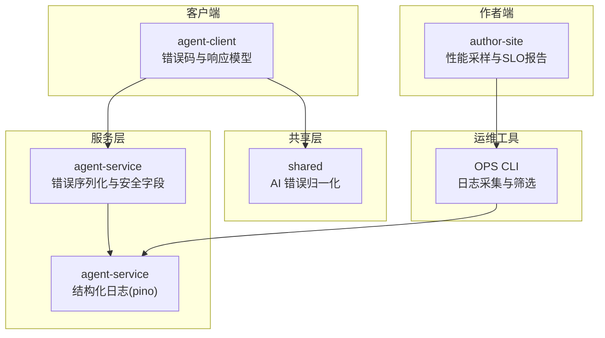
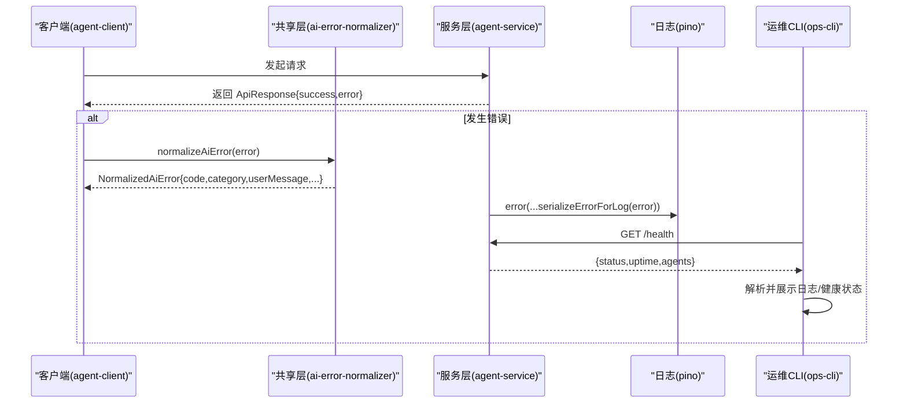
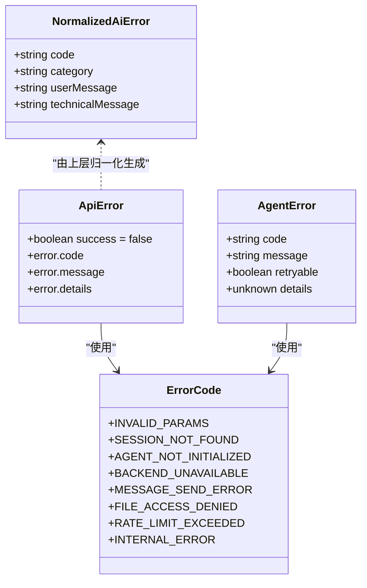
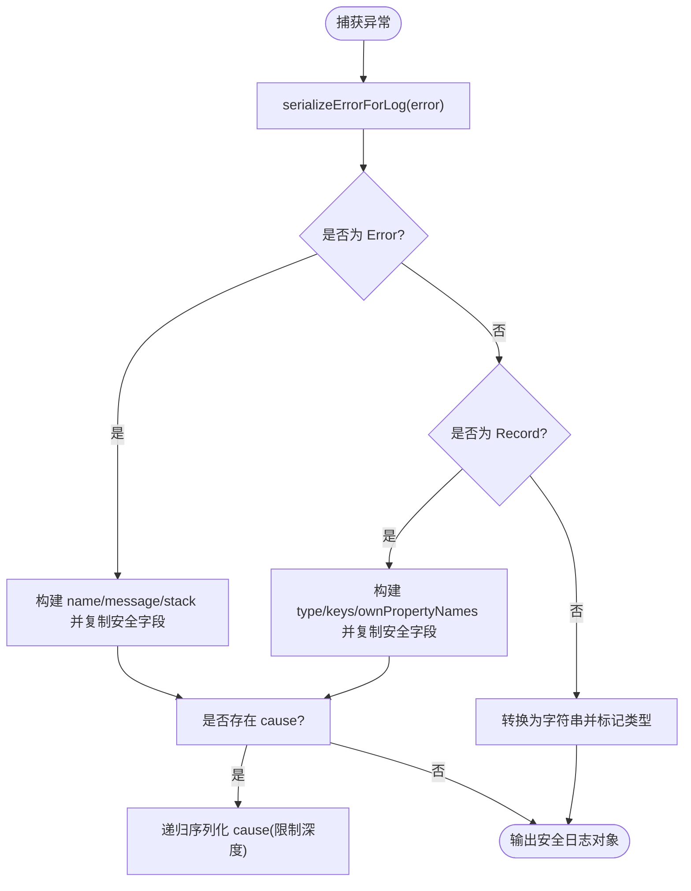
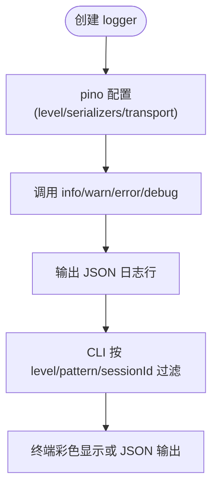
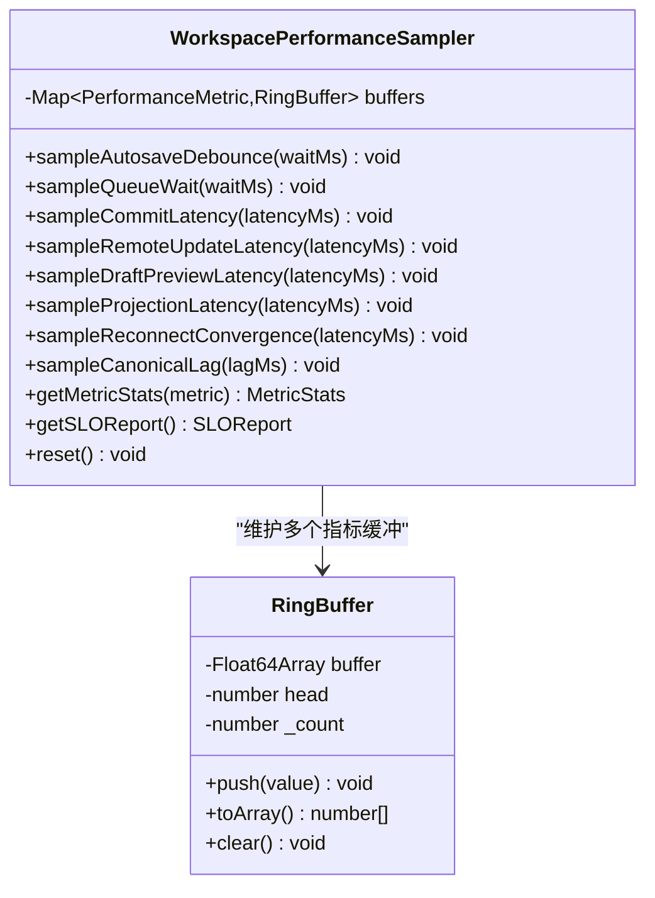
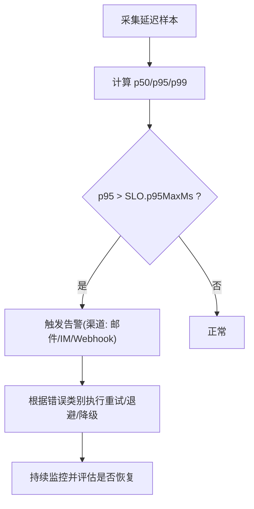
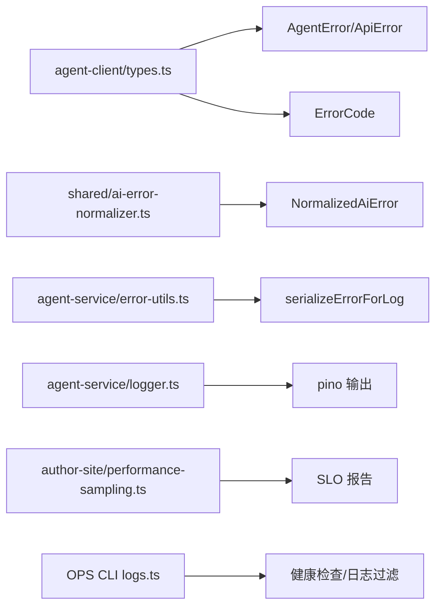

# 错误处理与监控

<cite>
**本文引用的文件**   
- [packages/agent-client/src/types.ts](file://packages/agent-client/src/types.ts)
- [packages/agent-service/src/utils/error-utils.ts](file://packages/agent-service/src/utils/error-utils.ts)
- [packages/shared/src/ai-error-normalizer.ts](file://packages/shared/src/ai-error-normalizer.ts)
- [packages/author-site/src/lib/workspace-performance-sampling.ts](file://packages/author-site/src/lib/workspace-performance-sampling.ts)
- [OPS/CLI/src/commands/logs.ts](file://OPS/CLI/src/commands/logs.ts)
- [packages/agent-service/src/utils/logger.ts](file://packages/agent-service/src/utils/logger.ts)
</cite>

## 目录
1. [引言](#引言)
2. [项目结构](#项目结构)
3. [核心组件](#核心组件)
4. [架构总览](#架构总览)
5. [详细组件分析](#详细组件分析)
6. [依赖关系分析](#依赖关系分析)
7. [性能考虑](#性能考虑)
8. [故障排查指南](#故障排查指南)
9. [结论](#结论)
10. [附录](#附录)

## 引言
本指南围绕“存储适配器”的错误处理与监控，结合仓库中已有的统一错误码、错误序列化、AI 错误归一化、结构化日志与性能采样能力，提供一套可落地的实践方案。内容覆盖：
- 统一错误码体系（ErrorCode 类型定义、错误消息映射、异常分类）
- 错误包装机制（原始异常捕获、上下文附加、错误链追踪）
- 日志记录策略（结构化日志格式、级别控制、敏感信息过滤）
- 性能监控指标（操作耗时统计、资源使用率监控、错误率分析）
- 告警机制设计（阈值配置、通知渠道、故障自愈）
- 完整示例与仪表板配置建议

## 项目结构
与错误处理和监控相关的核心位置如下：
- 客户端错误码与响应模型：packages/agent-client/src/types.ts
- 服务端错误序列化与安全字段裁剪：packages/agent-service/src/utils/error-utils.ts
- AI 错误分类与用户友好消息：packages/shared/src/ai-error-normalizer.ts
- 前端性能采样与 SLO 报告：packages/author-site/src/lib/workspace-performance-sampling.ts
- CLI 日志采集与筛选：OPS/CLI/src/commands/logs.ts
- 结构化日志初始化：packages/agent-service/src/utils/logger.ts

图表来源
- [packages/agent-client/src/types.ts:10-18](file://packages/agent-client/src/types.ts#L10-L18)
- [packages/agent-service/src/utils/error-utils.ts:1-134](file://packages/agent-service/src/utils/error-utils.ts#L1-L134)
- [packages/shared/src/ai-error-normalizer.ts:1-157](file://packages/shared/src/ai-error-normalizer.ts#L1-L157)
- [packages/author-site/src/lib/workspace-performance-sampling.ts:1-280](file://packages/author-site/src/lib/workspace-performance-sampling.ts#L1-L280)
- [OPS/CLI/src/commands/logs.ts:46-293](file://OPS/CLI/src/commands/logs.ts#L46-L293)
- [packages/agent-service/src/utils/logger.ts:1-41](file://packages/agent-service/src/utils/logger.ts#L1-L41)

章节来源
- [packages/agent-client/src/types.ts:10-18](file://packages/agent-client/src/types.ts#L10-L18)
- [packages/agent-service/src/utils/error-utils.ts:1-134](file://packages/agent-service/src/utils/error-utils.ts#L1-L134)
- [packages/shared/src/ai-error-normalizer.ts:1-157](file://packages/shared/src/ai-error-normalizer.ts#L1-L157)
- [packages/author-site/src/lib/workspace-performance-sampling.ts:1-280](file://packages/author-site/src/lib/workspace-performance-sampling.ts#L1-L280)
- [OPS/CLI/src/commands/logs.ts:46-293](file://OPS/CLI/src/commands/logs.ts#L46-L293)
- [packages/agent-service/src/utils/logger.ts:1-41](file://packages/agent-service/src/utils/logger.ts#L1-L41)

## 核心组件
- 统一错误码与响应模型
  - ErrorCode 枚举用于跨端一致的错误标识，便于聚合分析与告警。
  - AgentError 与 ApiError 定义了错误返回的结构，包含 code、message、details 等字段。
- 错误序列化与安全字段
  - 仅复制安全白名单字段，避免泄露敏感信息；对超长字符串进行截断；支持 cause 链的有限深度序列化。
- AI 错误归一化
  - 将底层异常归类为 connection/timeout/auth/quota/busy/cancelled/server/unknown，并生成用户可读消息与技术消息。
- 结构化日志
  - 基于 pino 输出 JSON 日志，支持标准 err 序列化器与 pretty 传输；通过环境变量控制日志级别。
- 性能采样与 SLO
  - 内存环形缓冲区收集延迟样本，计算 p50/p95/p99，并与 SLO 目标对比生成报告。
- CLI 日志采集
  - 支持本地文件与远程健康检查，按级别、模式与会话 ID 过滤，并以彩色终端或 JSON 输出。

章节来源
- [packages/agent-client/src/types.ts:10-18](file://packages/agent-client/src/types.ts#L10-L18)
- [packages/agent-client/src/types.ts:54-59](file://packages/agent-client/src/types.ts#L54-L59)
- [packages/agent-client/src/types.ts:151-160](file://packages/agent-client/src/types.ts#L151-L160)
- [packages/agent-service/src/utils/error-utils.ts:1-134](file://packages/agent-service/src/utils/error-utils.ts#L1-L134)
- [packages/shared/src/ai-error-normalizer.ts:1-157](file://packages/shared/src/ai-error-normalizer.ts#L1-L157)
- [packages/agent-service/src/utils/logger.ts:1-41](file://packages/agent-service/src/utils/logger.ts#L1-L41)
- [packages/author-site/src/lib/workspace-performance-sampling.ts:1-280](file://packages/author-site/src/lib/workspace-performance-sampling.ts#L1-L280)
- [OPS/CLI/src/commands/logs.ts:46-293](file://OPS/CLI/src/commands/logs.ts#L46-L293)

## 架构总览
下图展示了从客户端到服务端的错误与监控数据流，以及 CLI 的诊断能力。

图表来源
- [packages/agent-client/src/types.ts:151-160](file://packages/agent-client/src/types.ts#L151-L160)
- [packages/shared/src/ai-error-normalizer.ts:140-157](file://packages/shared/src/ai-error-normalizer.ts#L140-L157)
- [packages/agent-service/src/utils/error-utils.ts:87-133](file://packages/agent-service/src/utils/error-utils.ts#L87-L133)
- [packages/agent-service/src/utils/logger.ts:14-30](file://packages/agent-service/src/utils/logger.ts#L14-L30)
- [OPS/CLI/src/commands/logs.ts:138-160](file://OPS/CLI/src/commands/logs.ts#L138-L160)

## 详细组件分析

### 统一错误码体系
- 错误码定义
  - ErrorCode 集中定义在客户端类型文件中，涵盖参数校验、会话、后端不可用、发送失败、权限、限流、内部错误等场景。
- 错误对象与 API 响应
  - AgentError 表示业务错误，包含 code、message、retryable、details。
  - ApiError 表示 HTTP 层错误，包含 success=false 与 error.code/message/details。
- 错误消息映射
  - 对于 AI 相关错误，使用 shared 层的 normalizeAiError 将技术消息映射为用户友好提示，并按 category 分类。

图表来源
- [packages/agent-client/src/types.ts:10-18](file://packages/agent-client/src/types.ts#L10-L18)
- [packages/agent-client/src/types.ts:54-59](file://packages/agent-client/src/types.ts#L54-L59)
- [packages/agent-client/src/types.ts:151-160](file://packages/agent-client/src/types.ts#L151-L160)
- [packages/shared/src/ai-error-normalizer.ts:11-16](file://packages/shared/src/ai-error-normalizer.ts#L11-L16)

章节来源
- [packages/agent-client/src/types.ts:10-18](file://packages/agent-client/src/types.ts#L10-L18)
- [packages/agent-client/src/types.ts:54-59](file://packages/agent-client/src/types.ts#L54-L59)
- [packages/agent-client/src/types.ts:151-160](file://packages/agent-client/src/types.ts#L151-L160)
- [packages/shared/src/ai-error-normalizer.ts:1-157](file://packages/shared/src/ai-error-normalizer.ts#L1-L157)

### 错误包装机制
- 原始异常捕获
  - 在服务端统一使用 serializeErrorForLog 将任意异常序列化为安全的日志对象。
- 上下文信息附加
  - 通过 getErrorMessage 提取最贴近用户的消息；对 response、cause 等上下文做安全裁剪后附加。
- 错误链追踪
  - 支持 cause 链的递归序列化，限制最大深度以避免无限嵌套。

图表来源
- [packages/agent-service/src/utils/error-utils.ts:87-133](file://packages/agent-service/src/utils/error-utils.ts#L87-L133)
- [packages/agent-service/src/utils/error-utils.ts:62-85](file://packages/agent-service/src/utils/error-utils.ts#L62-L85)

章节来源
- [packages/agent-service/src/utils/error-utils.ts:1-134](file://packages/agent-service/src/utils/error-utils.ts#L1-L134)

### 日志记录策略
- 结构化日志格式
  - 使用 pino 输出 JSON 日志，err/error 字段采用标准序列化器，便于下游解析。
- 日志级别控制
  - 通过环境变量 LOG_LEVEL 控制最小级别；CLI 支持 trace/debug/info/warn/error/fatal 级别过滤。
- 敏感信息过滤
  - 错误序列化仅复制安全白名单字段，并对字符串长度进行截断，降低泄露风险。

图表来源
- [packages/agent-service/src/utils/logger.ts:14-30](file://packages/agent-service/src/utils/logger.ts#L14-L30)
- [OPS/CLI/src/commands/logs.ts:96-121](file://OPS/CLI/src/commands/logs.ts#L96-L121)
- [OPS/CLI/src/commands/logs.ts:253-293](file://OPS/CLI/src/commands/logs.ts#L253-L293)

章节来源
- [packages/agent-service/src/utils/logger.ts:1-41](file://packages/agent-service/src/utils/logger.ts#L1-L41)
- [OPS/CLI/src/commands/logs.ts:46-293](file://OPS/CLI/src/commands/logs.ts#L46-L293)

### 性能监控指标
- 指标定义
  - autosave-debounce、queue-wait、commit-latency、remote-update-latency、draft-preview-latency、projection-latency、reconnect-convergence、canonical-lag。
- 采样与统计
  - 每个指标独立环形缓冲区，计算 count/p50/p95/p99/min/max。
- SLO 报告
  - 针对每个指标设定 p95MaxMs 上限，生成 allPassed 汇总结果。

图表来源
- [packages/author-site/src/lib/workspace-performance-sampling.ts:176-272](file://packages/author-site/src/lib/workspace-performance-sampling.ts#L176-L272)
- [packages/author-site/src/lib/workspace-performance-sampling.ts:96-134](file://packages/author-site/src/lib/workspace-performance-sampling.ts#L96-L134)

章节来源
- [packages/author-site/src/lib/workspace-performance-sampling.ts:1-280](file://packages/author-site/src/lib/workspace-performance-sampling.ts#L1-L280)

### 告警机制设计
- 阈值配置
  - 基于 SLO_TARGETS 的 p95MaxMs 作为阈值；当 p95 超过阈值时视为不通过。
- 通知渠道
  - 可将 getSLOReport 的结果推送至告警系统（如 Webhook、邮件、IM），并结合 CLI 的健康检查输出辅助定位。
- 故障自愈
  - 针对连接/超时/限流等类别，可在客户端实现重试与退避策略；对 busy/cancelled 等可恢复错误提示用户或自动取消重试。

[此图为概念性流程，无需代码来源]

## 依赖关系分析
- 客户端与服务端通过 ApiResponse 和 ErrorCode 契约交互。
- 共享层 ai-error-normalizer 被客户端或服务端用于将技术错误转化为用户友好提示。
- 服务端错误序列化与日志模块解耦，便于替换日志后端。
- CLI 通过健康检查与日志文件解析，形成诊断闭环。

图表来源
- [packages/agent-client/src/types.ts:10-18](file://packages/agent-client/src/types.ts#L10-L18)
- [packages/agent-client/src/types.ts:54-59](file://packages/agent-client/src/types.ts#L54-L59)
- [packages/agent-client/src/types.ts:151-160](file://packages/agent-client/src/types.ts#L151-L160)
- [packages/shared/src/ai-error-normalizer.ts:11-16](file://packages/shared/src/ai-error-normalizer.ts#L11-L16)
- [packages/agent-service/src/utils/error-utils.ts:87-133](file://packages/agent-service/src/utils/error-utils.ts#L87-L133)
- [packages/agent-service/src/utils/logger.ts:14-30](file://packages/agent-service/src/utils/logger.ts#L14-L30)
- [packages/author-site/src/lib/workspace-performance-sampling.ts:245-264](file://packages/author-site/src/lib/workspace-performance-sampling.ts#L245-L264)
- [OPS/CLI/src/commands/logs.ts:138-160](file://OPS/CLI/src/commands/logs.ts#L138-L160)

章节来源
- [packages/agent-client/src/types.ts:10-18](file://packages/agent-client/src/types.ts#L10-L18)
- [packages/agent-client/src/types.ts:54-59](file://packages/agent-client/src/types.ts#L54-L59)
- [packages/agent-client/src/types.ts:151-160](file://packages/agent-client/src/types.ts#L151-L160)
- [packages/shared/src/ai-error-normalizer.ts:1-157](file://packages/shared/src/ai-error-normalizer.ts#L1-L157)
- [packages/agent-service/src/utils/error-utils.ts:1-134](file://packages/agent-service/src/utils/error-utils.ts#L1-L134)
- [packages/agent-service/src/utils/logger.ts:1-41](file://packages/agent-service/src/utils/logger.ts#L1-L41)
- [packages/author-site/src/lib/workspace-performance-sampling.ts:1-280](file://packages/author-site/src/lib/workspace-performance-sampling.ts#L1-L280)
- [OPS/CLI/src/commands/logs.ts:46-293](file://OPS/CLI/src/commands/logs.ts#L46-L293)

## 性能考虑
- 错误序列化开销
  - 安全字段复制与字符串截断会带来一定 CPU 与内存开销，建议在高频路径上按需启用或异步批处理。
- 日志吞吐
  - pino 默认高效，但 transport 与 pretty 会影响生产环境性能；生产建议使用非 pretty 输出并接入日志采集系统。
- 性能采样
  - 环形缓冲区固定容量，避免内存泄漏；统计计算在采样点外进行，减少热点路径影响。

[本节为通用指导，无需代码来源]

## 故障排查指南
- 快速定位
  - 使用 CLI 按级别与模式过滤日志，或通过 sessionId 关联问题链路。
  - 调用健康检查接口获取服务状态与运行时长。
- 错误归因
  - 借助 AI 错误分类判断是网络、鉴权、配额还是服务端异常，从而采取对应措施。
- 性能回溯
  - 查看 SLO 报告中未通过的指标，定位具体瓶颈（如 commit-latency、remote-update-latency）。

章节来源
- [OPS/CLI/src/commands/logs.ts:96-121](file://OPS/CLI/src/commands/logs.ts#L96-L121)
- [OPS/CLI/src/commands/logs.ts:138-160](file://OPS/CLI/src/commands/logs.ts#L138-L160)
- [packages/shared/src/ai-error-normalizer.ts:46-114](file://packages/shared/src/ai-error-normalizer.ts#L46-L114)
- [packages/author-site/src/lib/workspace-performance-sampling.ts:245-264](file://packages/author-site/src/lib/workspace-performance-sampling.ts#L245-L264)

## 结论
通过将统一错误码、安全错误序列化、AI 错误归一化、结构化日志与性能采样有机结合，可以在存储适配器及上下游链路中实现一致的错误处理与可观测性。配合告警与自愈策略，能够显著提升系统的稳定性与可维护性。

[本节为总结，无需代码来源]

## 附录

### 完整错误处理示例（步骤说明）
- 客户端侧
  - 收到 ApiResponse.error 后，调用 normalizeAiError 得到 NormalizedAiError，依据 category 决定重试或提示用户。
- 服务端侧
  - 在关键路径捕获异常，使用 serializeErrorForLog 输出结构化日志；必要时附加 request id、sessionId 等上下文。
- 运维侧
  - 使用 CLI 拉取最近日志与健康状态，结合错误码与分类进行根因分析。

章节来源
- [packages/agent-client/src/types.ts:151-160](file://packages/agent-client/src/types.ts#L151-L160)
- [packages/shared/src/ai-error-normalizer.ts:140-157](file://packages/shared/src/ai-error-normalizer.ts#L140-L157)
- [packages/agent-service/src/utils/error-utils.ts:87-133](file://packages/agent-service/src/utils/error-utils.ts#L87-L133)
- [OPS/CLI/src/commands/logs.ts:138-160](file://OPS/CLI/src/commands/logs.ts#L138-L160)

### 监控仪表板配置建议
- 指标面板
  - 错误率：按 ErrorCode 维度统计成功/失败比例。
  - 延迟分布：autosave-debounce、commit-latency、remote-update-latency 等的 p50/p95/p99 趋势。
  - 资源使用：CPU/内存/磁盘 I/O（由基础设施采集）。
- 告警规则
  - 错误率超过阈值（如 5 分钟内 > 1%）。
  - p95 延迟超过 SLO 目标（如 commit-latency > 500ms）。
  - 健康检查失败或服务不可达。
- 可视化
  - 使用时间序列图展示错误率与延迟；使用热力图展示错误码分布；使用仪表盘展示 SLO 通过率。

[本节为概念性配置建议，无需代码来源]