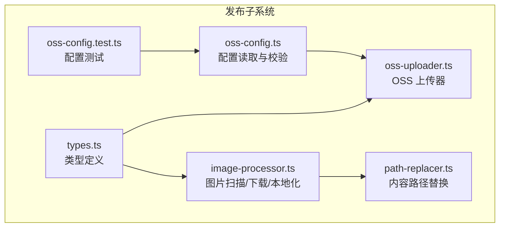
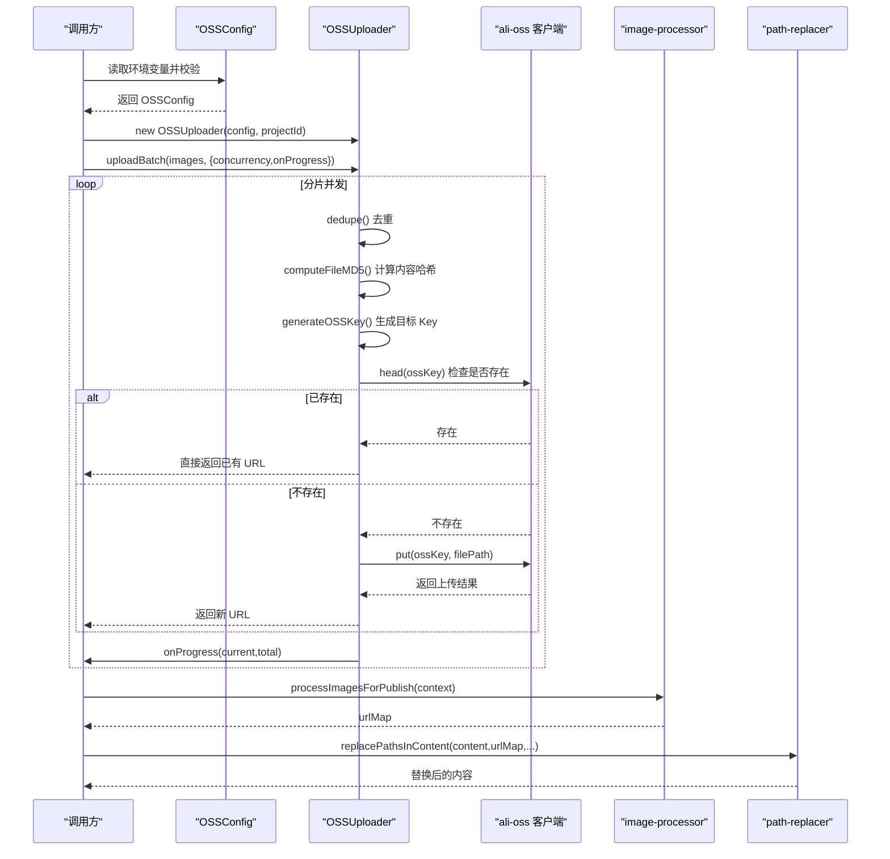
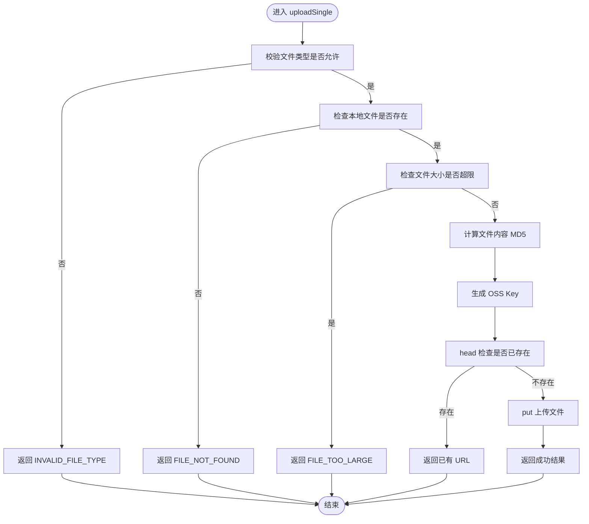
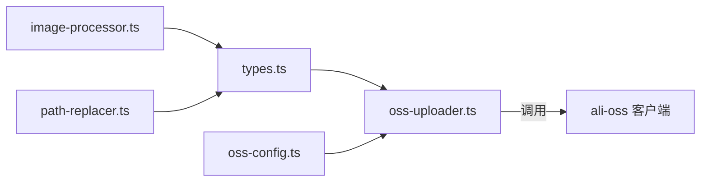

# 阿里云 OSS 适配器

<cite>
**本文引用的文件**   
- [packages/author-site/src/lib/publish/oss-uploader.ts](file://packages/author-site/src/lib/publish/oss-uploader.ts)
- [packages/author-site/src/lib/publish/oss-config.ts](file://packages/author-site/src/lib/publish/oss-config.ts)
- [packages/author-site/src/lib/publish/types.ts](file://packages/author-site/src/lib/publish/types.ts)
- [packages/author-site/src/lib/publish/image-processor.ts](file://packages/author-site/src/lib/publish/image-processor.ts)
- [packages/author-site/src/lib/publish/path-replacer.ts](file://packages/author-site/src/lib/publish/path-replacer.ts)
- [packages/author-site/src/lib/publish/__tests__/oss-config.test.ts](file://packages/author-site/src/lib/publish/__tests__/oss-config.test.ts)
</cite>

## 目录
1. [简介](#简介)
2. [项目结构](#项目结构)
3. [核心组件](#核心组件)
4. [架构总览](#架构总览)
5. [详细组件分析](#详细组件分析)
6. [依赖关系分析](#依赖关系分析)
7. [性能与调优](#性能与调优)
8. [配置管理](#配置管理)
9. [使用示例](#使用示例)
10. [故障排除指南](#故障排除指南)
11. [结论](#结论)

## 简介
本指南面向需要在项目中集成阿里云对象存储（OSS）的开发者，围绕 OSSUploader 类及其周边模块，系统阐述客户端初始化、连接管理、认证机制、批量上传、并发控制、进度回调、错误处理、文件去重与 MD5 校验、路径生成策略、配置管理与安全最佳实践，以及性能调优参数。文档同时提供可视化架构图与流程图，帮助读者快速理解并落地使用。

## 项目结构
与 OSS 适配相关的关键代码位于 author-site 包的 publish 子系统中，主要包含：
- 配置读取与校验：oss-config.ts
- 类型定义：types.ts
- 上传器实现：oss-uploader.ts
- 图片处理与本地化流程：image-processor.ts
- 内容路径替换：path-replacer.ts
- 配置单元测试：__tests__/oss-config.test.ts



图表来源
- [packages/author-site/src/lib/publish/oss-config.ts:1-34](file://packages/author-site/src/lib/publish/oss-config.ts#L1-L34)
- [packages/author-site/src/lib/publish/types.ts:1-23](file://packages/author-site/src/lib/publish/types.ts#L1-L23)
- [packages/author-site/src/lib/publish/oss-uploader.ts:1-168](file://packages/author-site/src/lib/publish/oss-uploader.ts#L1-L168)
- [packages/author-site/src/lib/publish/image-processor.ts:1-277](file://packages/author-site/src/lib/publish/image-processor.ts#L1-L277)
- [packages/author-site/src/lib/publish/path-replacer.ts:1-77](file://packages/author-site/src/lib/publish/path-replacer.ts#L1-L77)
- [packages/author-site/src/lib/publish/__tests__/oss-config.test.ts:1-67](file://packages/author-site/src/lib/publish/__tests__/oss-config.test.ts#L1-L67)

章节来源
- [packages/author-site/src/lib/publish/oss-config.ts:1-34](file://packages/author-site/src/lib/publish/oss-config.ts#L1-L34)
- [packages/author-site/src/lib/publish/types.ts:1-23](file://packages/author-site/src/lib/publish/types.ts#L1-L23)
- [packages/author-site/src/lib/publish/oss-uploader.ts:1-168](file://packages/author-site/src/lib/publish/oss-uploader.ts#L1-L168)
- [packages/author-site/src/lib/publish/image-processor.ts:1-277](file://packages/author-site/src/lib/publish/image-processor.ts#L1-L277)
- [packages/author-site/src/lib/publish/path-replacer.ts:1-77](file://packages/author-site/src/lib/publish/path-replacer.ts#L1-L77)
- [packages/author-site/src/lib/publish/__tests__/oss-config.test.ts:1-67](file://packages/author-site/src/lib/publish/__tests__/oss-config.test.ts#L1-L67)

## 核心组件
- OSSUploader：封装阿里云 OSS SDK 客户端，负责单文件上传、批量上传、去重、MD5 校验、存在性检查、路径生成与结果聚合。
- OSSConfig：从环境变量加载并校验 OSS 连接所需参数，提供 isOSSConfigured 便捷判断。
- types：定义 ImageReference、UploadResult、PublishContext 等关键数据结构。
- image-processor：在发布流程中扫描图片引用、下载外部图片、计算哈希、落盘到本地产物目录，并生成映射表供后续路径替换。
- path-replacer：对 HTML/CSS/JS/TSX 等文本内容进行正则匹配，将原图 URL 替换为最终可访问地址。

章节来源
- [packages/author-site/src/lib/publish/oss-uploader.ts:14-168](file://packages/author-site/src/lib/publish/oss-uploader.ts#L14-L168)
- [packages/author-site/src/lib/publish/oss-config.ts:1-34](file://packages/author-site/src/lib/publish/oss-config.ts#L1-L34)
- [packages/author-site/src/lib/publish/types.ts:1-23](file://packages/author-site/src/lib/publish/types.ts#L1-L23)
- [packages/author-site/src/lib/publish/image-processor.ts:226-277](file://packages/author-site/src/lib/publish/image-processor.ts#L226-L277)
- [packages/author-site/src/lib/publish/path-replacer.ts:5-77](file://packages/author-site/src/lib/publish/path-replacer.ts#L5-L77)

## 架构总览
下图展示了“配置—上传—路径替换”的整体协作关系，以及 OSSUploader 与 OSS SDK 的交互。



图表来源
- [packages/author-site/src/lib/publish/oss-config.ts:10-34](file://packages/author-site/src/lib/publish/oss-config.ts#L10-L34)
- [packages/author-site/src/lib/publish/oss-uploader.ts:19-168](file://packages/author-site/src/lib/publish/oss-uploader.ts#L19-L168)
- [packages/author-site/src/lib/publish/image-processor.ts:226-277](file://packages/author-site/src/lib/publish/image-processor.ts#L226-L277)
- [packages/author-site/src/lib/publish/path-replacer.ts:5-77](file://packages/author-site/src/lib/publish/path-replacer.ts#L5-L77)

## 详细组件分析

### OSSUploader 类
- 客户端初始化与连接管理
  - 通过构造函数接收 OSSConfig 与 projectId，内部实例化 ali-oss 客户端，设置 region、accessKeyId、accessKeySecret、bucket、endpoint。
  - 默认 pathPrefix 为 'projects'，可通过环境变量覆盖。
- 认证机制
  - 基于 AccessKey ID/Secret 进行鉴权；endpoint 可选，便于自定义域名或内网访问。
- 批量上传与并发控制
  - uploadBatch 支持 concurrency 参数（默认 5），按批次切分任务并使用 Promise.all 并发执行，每批完成后触发 onProgress 回调。
- 进度回调
  - onProgress(current, total) 在每批完成后上报，便于 UI 展示整体进度。
- 错误重试
  - 当前实现未内置重试逻辑；失败时返回 UploadResult.success=false 及 error 信息，由上层决定重试策略。
- 文件去重与 MD5 校验
  - 去重：基于 absolutePath 去重，避免重复处理同一文件。
  - 内容哈希：computeFileMD5 使用 crypto.createHash('md5') 计算文件内容 MD5。
  - 存在性检查：先 head 目标 key，若存在则直接复用 URL，避免重复上传。
- 路径生成策略
  - generateOSSKey 采用前缀/项目隔离/内容哈希+扩展名的命名规范：{pathPrefix}/{projectId}/images/{contentMD5}{ext}。
- 错误处理
  - 针对非法类型、文件不存在、大小超限、网络异常等情况，统一返回结构化结果，便于上层统计与告警。

```mermaid
classDiagram
class OSSUploader {
-client : OSS
-projectId : string
-pathPrefix : string
+constructor(config, projectId)
+uploadBatch(images, options) UploadResult[]
-uploadSingle(image) UploadResult
-computeFileMD5(filePath) string
-generateOSSKey(contentMD5, filePath) string
-checkIfExists(ossKey) {url}|null
-dedupe(images) ImageReference[]
}
class OSSConfig {
+region : string
+accessKeyId : string
+accessKeySecret : string
+bucket : string
+endpoint? : string
+pathPrefix? : string
}
class ImageReference {
+originalPath : string
+absolutePath : string
+sourceFile : string
+type : string
}
class UploadResult {
+localPath : string
+ossUrl : string
+ossKey : string
+size : number
+success : boolean
+error? : string
}
OSSUploader --> OSSConfig : "构造时使用"
OSSUploader --> ImageReference : "输入"
OSSUploader --> UploadResult : "输出"
```

图表来源
- [packages/author-site/src/lib/publish/oss-uploader.ts:14-168](file://packages/author-site/src/lib/publish/oss-uploader.ts#L14-L168)
- [packages/author-site/src/lib/publish/oss-config.ts:1-8](file://packages/author-site/src/lib/publish/oss-config.ts#L1-L8)
- [packages/author-site/src/lib/publish/types.ts:1-23](file://packages/author-site/src/lib/publish/types.ts#L1-L23)

章节来源
- [packages/author-site/src/lib/publish/oss-uploader.ts:19-168](file://packages/author-site/src/lib/publish/oss-uploader.ts#L19-L168)

#### 单文件上传流程（含去重与存在性检查）


图表来源
- [packages/author-site/src/lib/publish/oss-uploader.ts:61-131](file://packages/author-site/src/lib/publish/oss-uploader.ts#L61-L131)
- [packages/author-site/src/lib/publish/oss-uploader.ts:133-152](file://packages/author-site/src/lib/publish/oss-uploader.ts#L133-L152)

章节来源
- [packages/author-site/src/lib/publish/oss-uploader.ts:61-131](file://packages/author-site/src/lib/publish/oss-uploader.ts#L61-L131)

### 配置管理（OSSConfig）
- 环境变量
  - 必填：OSS_REGION、OSS_ACCESS_KEY_ID、OSS_ACCESS_KEY_SECRET、OSS_BUCKET
  - 可选：OSS_ENDPOINT、OSS_PATH_PREFIX
- 校验与错误
  - 缺失必填项时抛出错误码 'OSS_NOT_CONFIGURED'，isOSSConfigured 可用于前置判断。
- 安全建议
  - 不要将密钥硬编码进源码；通过环境变量注入；最小权限原则分配 RAM 用户；必要时启用 endpoint 指向内网或自定义域名。

章节来源
- [packages/author-site/src/lib/publish/oss-config.ts:10-34](file://packages/author-site/src/lib/publish/oss-config.ts#L10-L34)
- [packages/author-site/src/lib/publish/__tests__/oss-config.test.ts:15-67](file://packages/author-site/src/lib/publish/__tests__/oss-config.test.ts#L15-L67)

### 图片处理与路径替换（发布流程）
- image-processor
  - 扫描工作区中的图片引用，过滤可发布类型。
  - 对外部图片进行公网可达性校验与大小限制，下载后以 SHA256 前缀命名落盘至发布目录 assets/images。
  - 返回 urlMap 用于后续路径替换。
- path-replacer
  - 对 HTML img src、CSS url、JS/TS import 三种场景进行正则替换，确保产物中引用的是最终可访问地址。

章节来源
- [packages/author-site/src/lib/publish/image-processor.ts:226-277](file://packages/author-site/src/lib/publish/image-processor.ts#L226-L277)
- [packages/author-site/src/lib/publish/path-replacer.ts:5-77](file://packages/author-site/src/lib/publish/path-replacer.ts#L5-L77)

## 依赖关系分析
- 模块耦合
  - oss-uploader 依赖 oss-config 与 types；image-processor 依赖 types 与文件系统；path-replacer 依赖 types。
- 外部依赖
  - 使用 ali-oss 作为底层 SDK；使用 Node.js 标准库 fs、path、crypto。
- 潜在循环依赖
  - 当前模块间为单向依赖，未发现循环依赖。



图表来源
- [packages/author-site/src/lib/publish/types.ts:1-23](file://packages/author-site/src/lib/publish/types.ts#L1-L23)
- [packages/author-site/src/lib/publish/oss-config.ts:1-34](file://packages/author-site/src/lib/publish/oss-config.ts#L1-L34)
- [packages/author-site/src/lib/publish/oss-uploader.ts:1-168](file://packages/author-site/src/lib/publish/oss-uploader.ts#L1-L168)
- [packages/author-site/src/lib/publish/image-processor.ts:1-277](file://packages/author-site/src/lib/publish/image-processor.ts#L1-L277)
- [packages/author-site/src/lib/publish/path-replacer.ts:1-77](file://packages/author-site/src/lib/publish/path-replacer.ts#L1-L77)

章节来源
- [packages/author-site/src/lib/publish/oss-uploader.ts:1-168](file://packages/author-site/src/lib/publish/oss-uploader.ts#L1-L168)
- [packages/author-site/src/lib/publish/image-processor.ts:1-277](file://packages/author-site/src/lib/publish/image-processor.ts#L1-L277)
- [packages/author-site/src/lib/publish/path-replacer.ts:1-77](file://packages/author-site/src/lib/publish/path-replacer.ts#L1-L77)

## 性能与调优
- 并发控制
  - uploadBatch 的 concurrency 参数控制每批并发度，默认 5。可根据网络带宽与 OSS 限流策略调整。
- 超时与重试
  - 当前未内置重试；建议在调用层根据错误码（如网络错误、服务端限流）实现指数退避重试。
- 连接池与底层 SDK
  - 通过 ali-oss 客户端管理连接；如需更细粒度控制，可在创建客户端时传入更多选项（例如代理、超时等）。
- I/O 与内存
  - computeFileMD5 会一次性读取文件到内存，适合中小文件；超大文件建议改用流式计算以降低内存峰值。
- 缓存命中
  - 通过 head 检查与内容哈希去重，显著减少重复上传与网络开销。

[本节为通用性能建议，不直接分析具体文件]

## 配置管理
- 环境变量清单
  - OSS_REGION：区域标识
  - OSS_ACCESS_KEY_ID：AccessKey ID
  - OSS_ACCESS_KEY_SECRET：AccessKey Secret
  - OSS_BUCKET：存储空间名称
  - OSS_ENDPOINT：可选，自定义端点（如内网或自定义域名）
  - OSS_PATH_PREFIX：可选，全局前缀，默认 projects
- 配置验证
  - getOSSConfig 会在缺少必填项时抛出 'OSS_NOT_CONFIGURED'；isOSSConfigured 可用于启动阶段快速自检。
- 安全最佳实践
  - 使用最小权限 RAM 用户；仅授予必要 Bucket 操作；避免在日志中打印密钥；优先使用内网 endpoint 降低延迟与成本。

章节来源
- [packages/author-site/src/lib/publish/oss-config.ts:10-34](file://packages/author-site/src/lib/publish/oss-config.ts#L10-L34)
- [packages/author-site/src/lib/publish/__tests__/oss-config.test.ts:15-67](file://packages/author-site/src/lib/publish/__tests__/oss-config.test.ts#L15-L67)

## 使用示例
以下示例为概念性说明，实际使用时请结合仓库中的类型与接口进行集成。

- 初始化与基础上传
  - 从环境变量加载配置，校验通过后创建 OSSUploader 实例。
  - 准备一组 ImageReference，调用 uploadBatch 并监听 onProgress。
  - 遍历结果，收集成功与失败项，记录日志或告警。
- 发布流程集成
  - 使用 image-processor 扫描并本地化图片，得到 urlMap。
  - 使用 path-replacer 对构建产物进行路径替换，生成最终可部署包。
- 错误处理与重试
  - 对 UploadResult.success=false 的情况，依据 error 字段分类处理（如网络错误重试、类型错误跳过）。
  - 在调用层实现重试策略（指数退避、最大重试次数、熔断保护）。

[本节为使用指导，不直接分析具体文件]

## 故障排除指南
- 常见错误码与含义
  - INVALID_FILE_TYPE：文件扩展名不在允许列表。
  - FILE_NOT_FOUND：本地文件不存在。
  - FILE_TOO_LARGE：超过大小限制（默认 10MB）。
  - UPLOAD_FAILED：上传过程中发生异常（网络、权限、服务端错误等）。
  - OSS_NOT_CONFIGURED：缺少必填的环境变量。
- 排查步骤
  - 确认环境变量完整且正确，使用 isOSSConfigured 做前置检查。
  - 检查 endpoint 与 region 是否匹配，必要时切换内网 endpoint。
  - 核对 Bucket 权限与跨域策略，确保可读写。
  - 查看失败结果的 error 字段，定位是客户端还是服务端问题。
  - 对于大文件或高并发场景，适当降低 concurrency 或增加重试间隔。

章节来源
- [packages/author-site/src/lib/publish/oss-uploader.ts:61-131](file://packages/author-site/src/lib/publish/oss-uploader.ts#L61-L131)
- [packages/author-site/src/lib/publish/oss-config.ts:20-25](file://packages/author-site/src/lib/publish/oss-config.ts#L20-L25)

## 结论
OSSUploader 提供了简洁可靠的 OSS 上传能力，结合配置校验、内容去重与存在性检查，能够在发布流程中高效完成图片资源的上云与路径替换。通过合理的并发与重试策略、严格的配置与安全实践，可以在保证稳定性的同时获得良好的吞吐表现。建议在生产环境结合监控与告警，持续优化并发度与超时参数，以获得更佳的端到端体验。