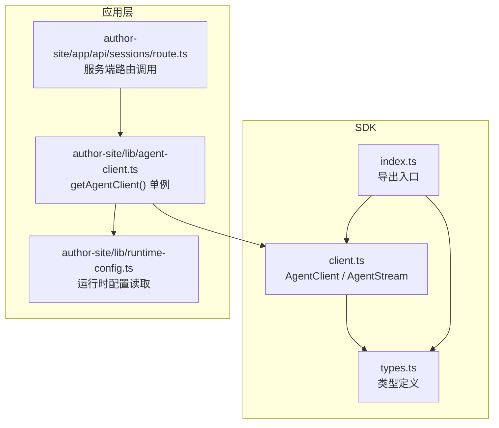
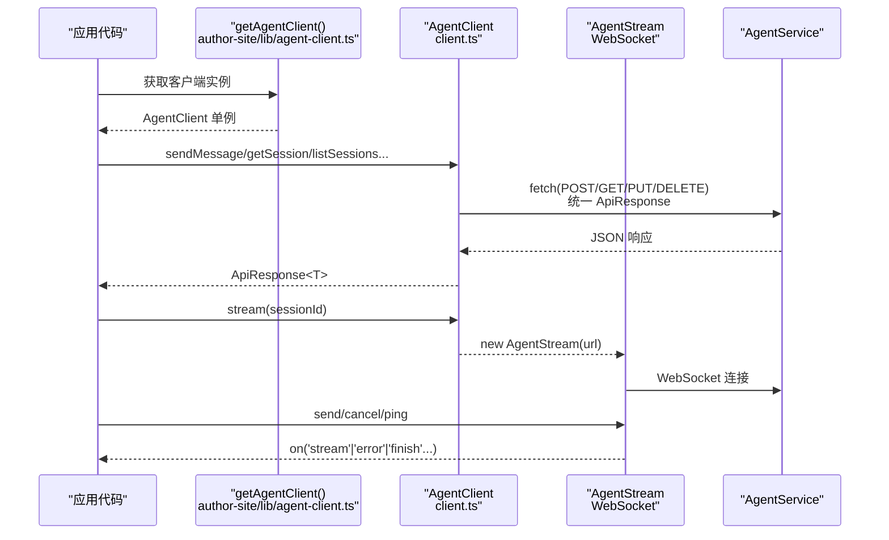
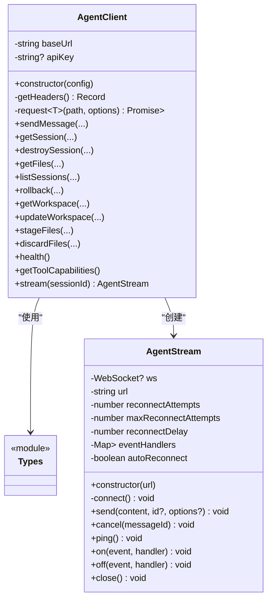
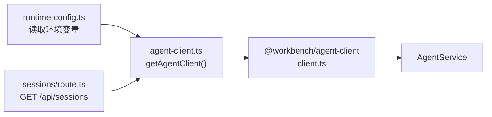

# HTTP 客户端集成

<cite>
**本文引用的文件列表**
- [packages/agent-client/src/client.ts](file://packages/agent-client/src/client.ts)
- [packages/agent-client/src/types.ts](file://packages/agent-client/src/types.ts)
- [packages/agent-client/src/index.ts](file://packages/agent-client/src/index.ts)
- [packages/author-site/src/lib/agent-client.ts](file://packages/author-site/src/lib/agent-client.ts)
- [packages/author-site/src/lib/runtime-config.ts](file://packages/author-site/src/lib/runtime-config.ts)
- [packages/author-site/src/app/api/sessions/route.ts](file://packages/author-site/src/app/api/sessions/route.ts)
</cite>

## 目录
1. [简介](#简介)
2. [项目结构](#项目结构)
3. [核心组件](#核心组件)
4. [架构总览](#架构总览)
5. [详细组件分析](#详细组件分析)
6. [依赖关系分析](#依赖关系分析)
7. [性能与可靠性](#性能与可靠性)
8. [故障排查指南](#故障排查指南)
9. [结论](#结论)
10. [附录：API 参考与使用示例](#附录api-参考与使用示例)

## 简介
本指南面向需要在项目中集成 Agent Service HTTP 客户端的开发者，围绕 AgentClient 类展开，覆盖请求构建、响应处理、错误处理机制、配置项（基础 URL、超时、重试策略、拦截器）、认证方式（API Key、JWT、多租户隔离）以及实际调用示例。同时提供请求/响应拦截器的扩展思路与自定义错误处理建议。

## 项目结构
Agent 客户端 SDK 位于 packages/agent-client，核心实现集中在 client.ts 与 types.ts；author-site 中通过封装 getAgentClient 暴露单例化客户端，便于上层业务复用。

图表来源
- [packages/agent-client/src/client.ts:1-204](file://packages/agent-client/src/client.ts#L1-L204)
- [packages/agent-client/src/types.ts:1-168](file://packages/agent-client/src/types.ts#L1-L168)
- [packages/agent-client/src/index.ts:1-4](file://packages/agent-client/src/index.ts#L1-L4)
- [packages/author-site/src/lib/agent-client.ts:1-33](file://packages/author-site/src/lib/agent-client.ts#L1-L33)
- [packages/author-site/src/lib/runtime-config.ts:1-80](file://packages/author-site/src/lib/runtime-config.ts#L1-L80)
- [packages/author-site/src/app/api/sessions/route.ts:174-210](file://packages/author-site/src/app/api/sessions/route.ts#L174-L210)

章节来源
- [packages/agent-client/src/client.ts:1-204](file://packages/agent-client/src/client.ts#L1-L204)
- [packages/agent-client/src/types.ts:1-168](file://packages/agent-client/src/types.ts#L1-L168)
- [packages/agent-client/src/index.ts:1-4](file://packages/agent-client/src/index.ts#L1-L4)
- [packages/author-site/src/lib/agent-client.ts:1-33](file://packages/author-site/src/lib/agent-client.ts#L1-L33)
- [packages/author-site/src/lib/runtime-config.ts:1-80](file://packages/author-site/src/lib/runtime-config.ts#L1-L80)
- [packages/author-site/src/app/api/sessions/route.ts:174-210](file://packages/author-site/src/app/api/sessions/route.ts#L174-L210)

## 核心组件
- AgentClient：HTTP 客户端，负责构造请求、统一添加头部、发送请求并返回统一 ApiResponse 格式。
- AgentStream：基于 WebSocket 的流式通信封装，支持自动重连、事件分发、消息发送与取消。
- 类型系统：集中定义 API 成功/失败响应、错误码、会话信息、工作区、附件等数据结构。

章节来源
- [packages/agent-client/src/client.ts:1-204](file://packages/agent-client/src/client.ts#L1-L204)
- [packages/agent-client/src/types.ts:1-168](file://packages/agent-client/src/types.ts#L1-L168)

## 架构总览
下图展示了从应用层到 AgentService 的完整调用路径，包括 HTTP 与 WebSocket 两种通道。

图表来源
- [packages/author-site/src/lib/agent-client.ts:1-33](file://packages/author-site/src/lib/agent-client.ts#L1-L33)
- [packages/agent-client/src/client.ts:1-204](file://packages/agent-client/src/client.ts#L1-L204)

## 详细组件分析

### AgentClient 类
- 职责
  - 维护 baseUrl 与可选 apiKey
  - 统一设置 Content-Type 与 X-API-Key 头
  - 封装 request<T>(path, options) 作为所有 HTTP 方法的底层实现
  - 提供 sendMessage、getSession、destroySession、getFiles、listSessions、rollback、getWorkspace、updateWorkspace、stageFiles、discardFiles、health、getToolCapabilities、stream 等方法
- 请求构建
  - 合并默认头与方法级传入的头
  - 将 body 序列化为 JSON
  - 拼接 path 到 baseUrl
- 响应处理
  - 直接解析 response.json() 为 ApiResponse<T>
  - 成功/失败由 success 字段区分
- 错误处理
  - 当前未对网络异常或 HTTP 状态码进行额外包装，上层需根据 ApiResponse.success 判断
- 可观测性与扩展点
  - 可在 request 方法前后加入日志、埋点、重试逻辑
  - 可通过 headers 合并注入 JWT、租户标识等

章节来源
- [packages/agent-client/src/client.ts:19-52](file://packages/agent-client/src/client.ts#L19-L52)
- [packages/agent-client/src/client.ts:54-204](file://packages/agent-client/src/client.ts#L54-L204)

#### 类图（AgentClient 与相关类型）

图表来源
- [packages/agent-client/src/client.ts:19-204](file://packages/agent-client/src/client.ts#L19-L204)
- [packages/agent-client/src/types.ts:1-168](file://packages/agent-client/src/types.ts#L1-L168)

### 认证机制
- API Key
  - 通过构造函数 apiKey 注入，在 getHeaders 中统一以 X-API-Key 头附加到每个请求
- JWT 令牌自动注入
  - 当前 SDK 未内置 JWT 注入逻辑。建议在调用方封装 getAgentClient 时动态注入 Authorization: Bearer <token>，或在 request 前合并 headers
- 多租户隔离
  - 可在 getHeaders 或每次请求时追加租户标识头（如 X-Tenant-Id），由服务端鉴权与路由隔离

章节来源
- [packages/agent-client/src/client.ts:24-37](file://packages/agent-client/src/client.ts#L24-L37)
- [packages/author-site/src/lib/agent-client.ts:10-18](file://packages/author-site/src/lib/agent-client.ts#L10-L18)

### 配置选项
- 基础 URL
  - 通过 AgentClientConfig.baseUrl 指定，内部会去除尾部斜杠
  - 应用层通过 runtime-config 读取环境变量，适配浏览器与服务端不同场景
- 超时设置
  - 当前 SDK 未内置超时控制。可在调用方使用 AbortController 或封装 request 增加超时
- 重试策略
  - 当前 SDK 未内置重试。可在 request 层按错误码或网络异常进行指数退避重试
- 拦截器
  - 当前无显式拦截器接口。可在 request 前后插入日志、指标、签名、重试等横切逻辑

章节来源
- [packages/agent-client/src/client.ts:24-27](file://packages/agent-client/src/client.ts#L24-L27)
- [packages/author-site/src/lib/runtime-config.ts:28-48](file://packages/author-site/src/lib/runtime-config.ts#L28-L48)

### 请求与响应模型
- 统一响应体 ApiResponse<T>
  - 成功：{ success: true, data: T }
  - 失败：{ success: false, error: { code, message, details? } }
- 常见错误码
  - INVALID_PARAMS、SESSION_NOT_FOUND、AGENT_NOT_INITIALIZED、BACKEND_UNAVAILABLE、MESSAGE_SEND_ERROR、FILE_ACCESS_DENIED、RATE_LIMIT_EXCEEDED、INTERNAL_ERROR

章节来源
- [packages/agent-client/src/types.ts:146-160](file://packages/agent-client/src/types.ts#L146-L160)
- [packages/agent-client/src/types.ts:10-18](file://packages/agent-client/src/types.ts#L10-L18)

### 流式通信（WebSocket）
- AgentStream 提供自动重连、事件分发、消息发送、取消与心跳
- 适用于长任务、增量输出、工具调用进度等场景

章节来源
- [packages/agent-client/src/client.ts:279-408](file://packages/agent-client/src/client.ts#L279-L408)

## 依赖关系分析
- author-site 通过 getAgentClient 单例化 AgentClient，并从 runtime-config 读取服务地址与 API Key
- 服务端路由通过 getAgentClient 调用 listSessions，展示客户端在服务端的典型用法

图表来源
- [packages/author-site/src/lib/runtime-config.ts:28-48](file://packages/author-site/src/lib/runtime-config.ts#L28-L48)
- [packages/author-site/src/lib/agent-client.ts:10-18](file://packages/author-site/src/lib/agent-client.ts#L10-L18)
- [packages/author-site/src/app/api/sessions/route.ts:192-202](file://packages/author-site/src/app/api/sessions/route.ts#L192-L202)
- [packages/agent-client/src/client.ts:108-122](file://packages/agent-client/src/client.ts#L108-L122)

章节来源
- [packages/author-site/src/lib/agent-client.ts:10-18](file://packages/author-site/src/lib/agent-client.ts#L10-L18)
- [packages/author-site/src/lib/runtime-config.ts:28-48](file://packages/author-site/src/lib/runtime-config.ts#L28-L48)
- [packages/author-site/src/app/api/sessions/route.ts:192-202](file://packages/author-site/src/app/api/sessions/route.ts#L192-L202)
- [packages/agent-client/src/client.ts:108-122](file://packages/agent-client/src/client.ts#L108-L122)

## 性能与可靠性
- 连接复用
  - 单例化 AgentClient 避免重复初始化
- 超时与重试
  - 建议在调用层引入 AbortController 与重试策略（指数退避、抖动）
- 流式传输
  - 使用 AgentStream 降低长任务等待时间，提升用户体验
- 资源清理
  - 及时关闭 AgentStream 连接，避免泄漏

[本节为通用指导，不直接分析具体文件]

## 故障排查指南
- 常见问题定位
  - 检查 baseUrl 是否正确、是否包含多余斜杠
  - 确认 API Key 是否注入到 X-API-Key 头
  - 查看 ApiResponse.error.code 与 message 快速定位错误
  - 流式连接断开时关注 status 事件与自动重连次数
- 建议增强
  - 在 request 层增加网络异常捕获与统一错误转换
  - 记录请求/响应耗时与关键上下文，便于问题复现

章节来源
- [packages/agent-client/src/types.ts:146-160](file://packages/agent-client/src/types.ts#L146-L160)
- [packages/agent-client/src/client.ts:294-338](file://packages/agent-client/src/client.ts#L294-L338)

## 结论
AgentClient 提供了简洁一致的 HTTP 访问能力与统一的响应模型，配合 AgentStream 可满足实时交互需求。通过在上层封装单例、注入认证与拦截逻辑，即可快速集成到各类应用中。

[本节为总结性内容，不直接分析具体文件]

## 附录：API 参考与使用示例

### 配置与初始化
- 基础配置
  - baseUrl：必填，AgentService 地址
  - apiKey：可选，用于 X-API-Key 头
- 应用层单例
  - author-site 通过 getAgentClient 返回单例，结合 runtime-config 读取环境变量

章节来源
- [packages/agent-client/src/client.ts:24-27](file://packages/agent-client/src/client.ts#L24-L27)
- [packages/author-site/src/lib/agent-client.ts:10-18](file://packages/author-site/src/lib/agent-client.ts#L10-L18)
- [packages/author-site/src/lib/runtime-config.ts:28-48](file://packages/author-site/src/lib/runtime-config.ts#L28-L48)

### 发起 HTTP 请求示例（概念性说明）
- GET 查询会话列表
  - 使用 listSessions(params)，参数支持 status、limit、offset
- POST 发送消息
  - 使用 sendMessage(sessionId, content, options)，options 支持 model、images、files、systemPrompt 等
- PUT 更新工作区
  - 使用 updateWorkspace(sessionId, options)
- DELETE 销毁会话
  - 使用 destroySession(sessionId)
- 健康检查
  - 使用 health()

章节来源
- [packages/agent-client/src/client.ts:108-122](file://packages/agent-client/src/client.ts#L108-L122)
- [packages/agent-client/src/client.ts:54-83](file://packages/agent-client/src/client.ts#L54-L83)
- [packages/agent-client/src/client.ts:144-152](file://packages/agent-client/src/client.ts#L144-L152)
- [packages/agent-client/src/client.ts:89-98](file://packages/agent-client/src/client.ts#L89-L98)
- [packages/agent-client/src/client.ts:180-194](file://packages/agent-client/src/client.ts#L180-L194)

### 流式通信示例（概念性说明）
- 建立连接
  - const stream = client.stream(sessionId)
- 监听事件
  - stream.on('stream', handler)、stream.on('error', handler)、stream.on('finish', handler)
- 发送消息与取消
  - stream.send(content, id, options)
  - stream.cancel(messageId)
- 心跳与关闭
  - stream.ping()
  - stream.close()

章节来源
- [packages/agent-client/src/client.ts:200-204](file://packages/agent-client/src/client.ts#L200-L204)
- [packages/agent-client/src/client.ts:340-403](file://packages/agent-client/src/client.ts#L340-L403)

### 认证与拦截器扩展建议
- 认证
  - API Key：通过构造函数注入，自动附加 X-API-Key
  - JWT：在 getAgentClient 封装处动态注入 Authorization: Bearer <token>
  - 多租户：在 getHeaders 或每次请求时追加 X-Tenant-Id
- 拦截器
  - 在 request 前后插入日志、指标、签名、重试、熔断等横切逻辑
  - 统一错误处理：将网络异常转换为 ApiResponse 风格错误

章节来源
- [packages/agent-client/src/client.ts:29-37](file://packages/agent-client/src/client.ts#L29-L37)
- [packages/author-site/src/lib/agent-client.ts:10-18](file://packages/author-site/src/lib/agent-client.ts#L10-L18)