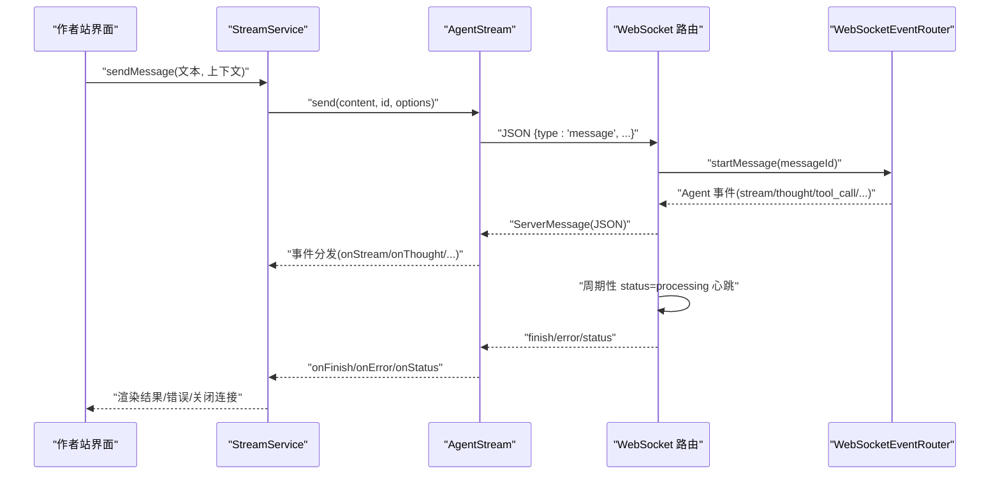
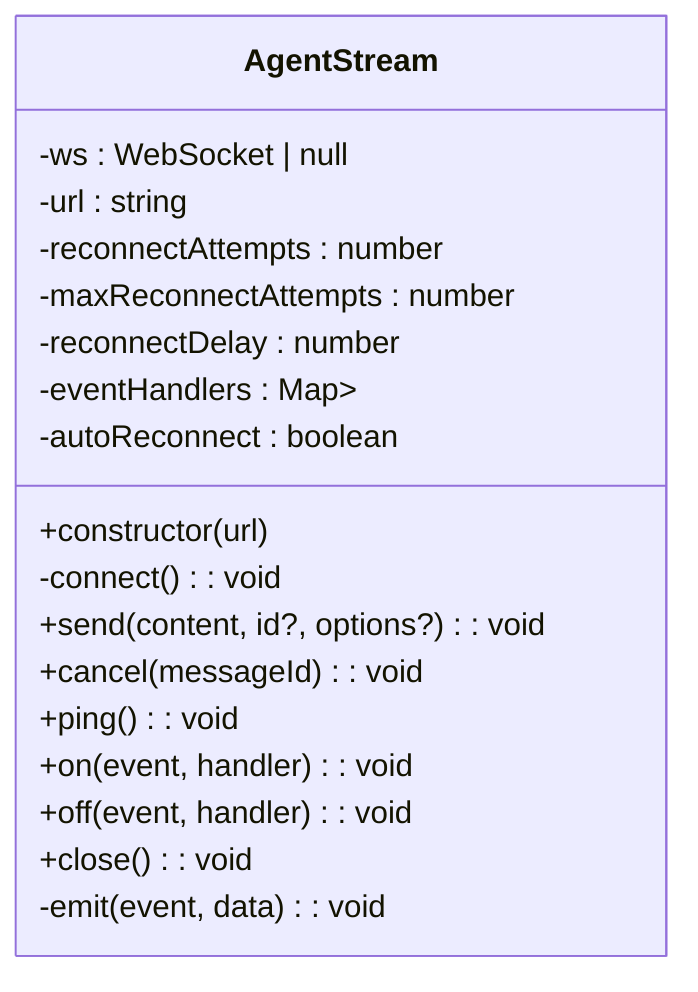
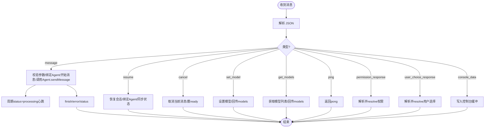
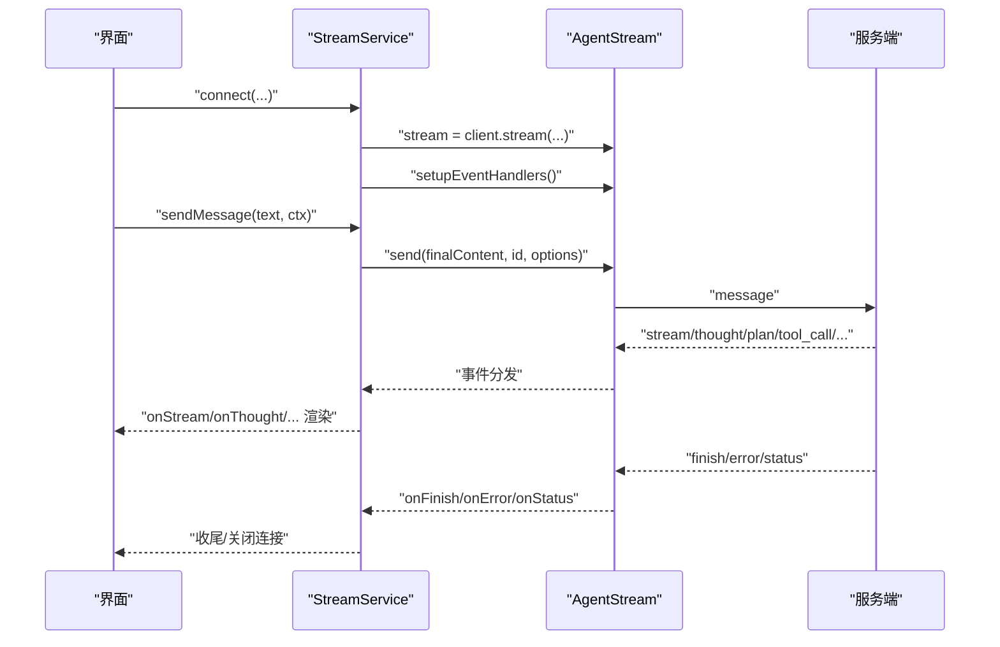
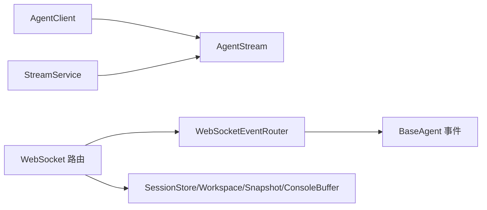

# WebSocket 流式通信

<cite>
**本文引用的文件列表**
- [packages/agent-client/src/client.ts](file://packages/agent-client/src/client.ts)
- [packages/agent-client/src/types.ts](file://packages/agent-client/src/types.ts)
- [packages/agent-service/src/routes/websocket.ts](file://packages/agent-service/src/routes/websocket.ts)
- [packages/agent-service/src/routes/ws-event-router.ts](file://packages/agent-service/src/routes/ws-event-router.ts)
- [packages/author-site/src/components/ai-elements/chat/services/stream-service.ts](file://packages/author-site/src/components/ai-elements/chat/services/stream-service.ts)
</cite>

## 目录
1. [简介](#简介)
2. [项目结构](#项目结构)
3. [核心组件](#核心组件)
4. [架构总览](#架构总览)
5. [详细组件分析](#详细组件分析)
6. [依赖关系分析](#依赖关系分析)
7. [性能与优化建议](#性能与优化建议)
8. [故障排查指南](#故障排查指南)
9. [结论](#结论)
10. [附录：协议与消息格式](#附录协议与消息格式)

## 简介
本技术文档围绕 AgentStream 类及其在作者站（author-site）中的使用，系统性阐述 WebSocket 流式通信的实现原理。内容涵盖连接建立、消息传输、断线重连、心跳机制、状态同步、事件处理模型、错误恢复策略，以及面向 AI 对话的流式响应、进度反馈和调试技巧。读者无需深入源码即可理解整体设计，同时提供精确的文件定位以便进一步查阅实现细节。

## 项目结构
本项目采用多包（monorepo）组织，WebSocket 流式通信涉及三个关键位置：
- 客户端 SDK：AgentClient 与 AgentStream 负责创建 WebSocket 连接、发送消息、监听事件与自动重连
- 服务端路由：Fastify + ws 暴露 /api/agent/:sessionId/stream，解析消息、调度 Agent、转发事件、维护心跳
- 应用层封装：author-site 的 StreamService 对 AgentStream 进行业务级封装，统一事件分发、保活、上下文注入与错误恢复

```mermaid
graph TB
subgraph "客户端"
AC["AgentClient<br/>创建流式连接"]
AS["AgentStream<br/>WebSocket 封装"]
SS["StreamService<br/>业务封装"]
end
subgraph "服务端"
WS["WebSocket 路由<br/>/api/agent/:sessionId/stream"]
ER["WebSocketEventRouter<br/>事件路由与日志"]
end
AC --> AS
SS --> AS
AS < --> WS
WS --> ER
```

图表来源
- [packages/agent-client/src/client.ts:200-204](file://packages/agent-client/src/client.ts#L200-L204)
- [packages/agent-client/src/client.ts:279-408](file://packages/agent-client/src/client.ts#L279-L408)
- [packages/agent-service/src/routes/websocket.ts:134-183](file://packages/agent-service/src/routes/websocket.ts#L134-L183)
- [packages/agent-service/src/routes/ws-event-router.ts:113-127](file://packages/agent-service/src/routes/ws-event-router.ts#L113-L127)
- [packages/author-site/src/components/ai-elements/chat/services/stream-service.ts:185-202](file://packages/author-site/src/components/ai-elements/chat/services/stream-service.ts#L185-L202)

章节来源
- [packages/agent-client/src/client.ts:200-204](file://packages/agent-client/src/client.ts#L200-L204)
- [packages/agent-service/src/routes/websocket.ts:134-183](file://packages/agent-service/src/routes/websocket.ts#L134-L183)
- [packages/author-site/src/components/ai-elements/chat/services/stream-service.ts:185-202](file://packages/author-site/src/components/ai-elements/chat/services/stream-service.ts#L185-L202)

## 核心组件
- AgentStream（客户端）
  - 职责：管理 WebSocket 生命周期、消息收发、事件分发、自动重连、ping/pong 心跳
  - 关键点：onopen/onmessage/onclose/onerror 回调；指数退避重连；事件订阅/取消订阅；send/cancel/ping/close API
- WebSocket 路由（服务端）
  - 职责：注册 /api/agent/:sessionId/stream；解析 ClientMessage；绑定 Agent；转发事件；心跳检测；超时控制；权限与用户选择交互
- WebSocketEventRouter（服务端）
  - 职责：将 Agent 内部事件映射为统一的 ServerMessage；记录运行日志；支持取消与活动标记
- StreamService（作者站）
  - 职责：封装 AgentStream；统一事件分发；注入系统提示与工作区上下文；定时保活；finish/ready 兜底；错误分类与恢复

章节来源
- [packages/agent-client/src/client.ts:279-408](file://packages/agent-client/src/client.ts#L279-L408)
- [packages/agent-service/src/routes/websocket.ts:134-183](file://packages/agent-service/src/routes/websocket.ts#L134-L183)
- [packages/agent-service/src/routes/ws-event-router.ts:113-127](file://packages/agent-service/src/routes/ws-event-router.ts#L113-L127)
- [packages/author-site/src/components/ai-elements/chat/services/stream-service.ts:164-202](file://packages/author-site/src/components/ai-elements/chat/services/stream-service.ts#L164-L202)

## 架构总览
下图展示从客户端发起消息到服务端返回流式事件的完整时序，包括心跳、进度心跳、错误与完成信号。



图表来源
- [packages/agent-service/src/routes/websocket.ts:346-468](file://packages/agent-service/src/routes/websocket.ts#L346-L468)
- [packages/agent-service/src/routes/ws-event-router.ts:197-321](file://packages/agent-service/src/routes/ws-event-router.ts#L197-L321)
- [packages/agent-client/src/client.ts:340-386](file://packages/agent-client/src/client.ts#L340-L386)
- [packages/author-site/src/components/ai-elements/chat/services/stream-service.ts:414-556](file://packages/author-site/src/components/ai-elements/chat/services/stream-service.ts#L414-L556)

## 详细组件分析

### AgentStream 类（客户端）
- 连接建立
  - 构造时立即 connect()，基于 URL 创建 WebSocket
  - onopen 触发 status=connected 事件，供上层等待连接就绪
- 消息传输
  - send(content, id?, options?) 发送 JSON 消息，包含工作目录、项目、演示、模型、附件等
  - cancel(messageId) 发送取消指令
  - ping() 发送心跳，携带时间戳
- 事件分发
  - on(event, handler)/off(event, handler) 订阅/取消订阅
  - 内部 emit(type, data) 将解析后的 StreamEvent 分发给所有监听器
- 断线重连
  - onclose 中根据 autoReconnect 与最大重试次数执行指数退避重连
  - onerror 抛出 CONNECTION_ERROR 事件
- 资源清理
  - close() 停止自动重连并关闭底层 socket



图表来源
- [packages/agent-client/src/client.ts:279-408](file://packages/agent-client/src/client.ts#L279-L408)

章节来源
- [packages/agent-client/src/client.ts:279-408](file://packages/agent-client/src/client.ts#L279-L408)

### WebSocket 路由与服务端事件路由
- 路由注册
  - Fastify 注册 GET /api/agent/:sessionId/stream，启用 websocket 模式
  - 每连接生成 connectionId，维护 ActiveConnection（socket、sessionId、lastPing、eventRouter）
- 消息处理
  - 解析 ClientMessage，区分 message/resume/cancel/set_model/get_models/ping/permission_response/user_choice_response/console_data
  - 首次 message 或 resume 会初始化/启动 Agent，绑定事件路由，必要时更新 systemPrompt
  - 显式超时控制：Promise.race 与 progress heartbeat 保障长任务可中断
- 事件转发
  - WebSocketEventRouter 将 Agent 事件映射为 ServerMessage，写入运行日志，按 messageId 关联
- 心跳与连接健康
  - 全局 setInterval 心跳检查 lastPing，超过阈值则终止连接并清理
  - 服务端周期性发送 status=processing 作为“进度心跳”，避免长时间无消息导致前端误判



图表来源
- [packages/agent-service/src/routes/websocket.ts:182-800](file://packages/agent-service/src/routes/websocket.ts#L182-L800)
- [packages/agent-service/src/routes/ws-event-router.ts:197-321](file://packages/agent-service/src/routes/ws-event-router.ts#L197-L321)

章节来源
- [packages/agent-service/src/routes/websocket.ts:134-183](file://packages/agent-service/src/routes/websocket.ts#L134-L183)
- [packages/agent-service/src/routes/websocket.ts:346-468](file://packages/agent-service/src/routes/websocket.ts#L346-L468)
- [packages/agent-service/src/routes/websocket.ts:715-721](file://packages/agent-service/src/routes/websocket.ts#L715-L721)
- [packages/agent-service/src/routes/ws-event-router.ts:113-127](file://packages/agent-service/src/routes/ws-event-router.ts#L113-L127)

### 作者站 StreamService（业务封装）
- 连接与等待
  - connect(agentSessionId, sessionId) 通过 AgentClient.stream 创建 AgentStream，并 setupEventHandlers
  - waitForConnection 等待 status=connected 或底层 readyState=OPEN
- 消息发送与上下文注入
  - sendMessage 组装 L3/L4 上下文与静态 systemPrompt，调用 stream.send
- 事件分发与状态机
  - onStream/onThought/onPlan/onToolCall/onToolUpdate/onPermission/onUserChoice/onFinish/onError/onStatus
  - finishDelivered 防重入；messageInFlight 控制流程；ready 兜底定时器
- 保活与清理
  - startKeepalive 定时 ping；stopKeepalive 清理定时器；close 释放资源



图表来源
- [packages/author-site/src/components/ai-elements/chat/services/stream-service.ts:185-202](file://packages/author-site/src/components/ai-elements/chat/services/stream-service.ts#L185-L202)
- [packages/author-site/src/components/ai-elements/chat/services/stream-service.ts:235-298](file://packages/author-site/src/components/ai-elements/chat/services/stream-service.ts#L235-L298)
- [packages/author-site/src/components/ai-elements/chat/services/stream-service.ts:414-556](file://packages/author-site/src/components/ai-elements/chat/services/stream-service.ts#L414-L556)

章节来源
- [packages/author-site/src/components/ai-elements/chat/services/stream-service.ts:164-202](file://packages/author-site/src/components/ai-elements/chat/services/stream-service.ts#L164-L202)
- [packages/author-site/src/components/ai-elements/chat/services/stream-service.ts:235-298](file://packages/author-site/src/components/ai-elements/chat/services/stream-service.ts#L235-L298)
- [packages/author-site/src/components/ai-elements/chat/services/stream-service.ts:414-556](file://packages/author-site/src/components/ai-elements/chat/services/stream-service.ts#L414-L556)

## 依赖关系分析
- 客户端依赖
  - AgentClient.stream 构建 wsUrl 并实例化 AgentStream
  - StreamService 依赖 AgentStream 的事件与 API
- 服务端依赖
  - WebSocket 路由依赖 AgentManager、WorkspaceManager、SnapshotService、ConsoleBuffer、RunLogStore
  - WebSocketEventRouter 依赖 BaseAgent 事件与 RunLog 记录



图表来源
- [packages/agent-client/src/client.ts:200-204](file://packages/agent-client/src/client.ts#L200-L204)
- [packages/agent-service/src/routes/websocket.ts:134-183](file://packages/agent-service/src/routes/websocket.ts#L134-L183)
- [packages/agent-service/src/routes/ws-event-router.ts:113-127](file://packages/agent-service/src/routes/ws-event-router.ts#L113-L127)

章节来源
- [packages/agent-client/src/client.ts:200-204](file://packages/agent-client/src/client.ts#L200-L204)
- [packages/agent-service/src/routes/websocket.ts:134-183](file://packages/agent-service/src/routes/websocket.ts#L134-L183)

## 性能与优化建议
- 连接池管理
  - 当前实现以会话维度维持连接，适合一对一对话场景。若需复用连接，可在 AgentStream 外层增加连接池，按 sessionId 复用，减少握手开销
- 内存泄漏防护
  - 确保 off 正确移除事件监听；StreamService 在 close 时清理定时器与状态；服务端 eventRouter.destroy 解绑 Agent 事件
- 心跳与超时
  - 客户端 KEEPALIVE_INTERVAL_MS 与服务端 HEARTBEAT_INTERVAL/HEARTBEAT_TIMEOUT 配合，避免僵尸连接
  - 显式消息超时与进度心跳结合，提升长任务可观测性与可控性
- 批量与节流
  - 对高频事件（如 tool_call_update）在前端做合并或节流，降低渲染压力
- 调试技巧
  - 开启 console_data 通道，将浏览器 console 输出汇聚至服务端便于审计
  - 利用 models 事件动态切换模型，快速验证不同后端行为

[本节为通用指导，不直接分析具体文件]

## 故障排查指南
- 连接失败
  - 检查 baseUrl 是否替换为 ws/wss；确认 /api/agent/:sessionId/stream 可达
  - 关注 status 事件与 error 事件，查看 code 与 message
- 消息未到达
  - 确认服务端已收到 message 且未因 busy 被拒绝；查看 status=processing 心跳是否持续
  - 检查显式超时是否触发 MESSAGE_TIMEOUT
- 权限与用户选择
  - 当出现 permission_request 或 user_choice_request 时，需在客户端及时回复 permission_response/user_choice_response
- 资源清理
  - 页面卸载或会话结束时务必调用 close()，防止残留定时器与监听器

章节来源
- [packages/agent-service/src/routes/websocket.ts:208-220](file://packages/agent-service/src/routes/websocket.ts#L208-L220)
- [packages/agent-service/src/routes/websocket.ts:419-445](file://packages/agent-service/src/routes/websocket.ts#L419-L445)
- [packages/agent-service/src/routes/websocket.ts:723-796](file://packages/agent-service/src/routes/websocket.ts#L723-L796)
- [packages/author-site/src/components/ai-elements/chat/services/stream-service.ts:518-556](file://packages/author-site/src/components/ai-elements/chat/services/stream-service.ts#L518-L556)

## 结论
AgentStream 提供了简洁可靠的 WebSocket 封装，结合服务端的 WebSocketEventRouter 实现了高内聚低耦合的流式事件通道。作者站的 StreamService 在此基础上补齐了业务所需的上下文注入、保活、错误分类与兜底逻辑。通过心跳、进度心跳与显式超时，系统在稳定性与可观测性之间取得平衡。遵循本文的性能与排障建议，可进一步提升实时对话体验与系统健壮性。

[本节为总结，不直接分析具体文件]

## 附录：协议与消息格式

### 客户端 → 服务端（ClientMessage）
- 字段 type 枚举：message、cancel、ping、resume、set_model、get_models、permission_response、user_choice_response、console_data
- 关键字段示例：id、content、model/modelId、workingDir、projectId、demoId、images、files、systemPrompt、entries、options.timeout/options.stream/options.resumeSessionId、permissionId/optionId/responseContent、requestId/choice

章节来源
- [packages/agent-service/src/routes/websocket.ts:39-67](file://packages/agent-service/src/routes/websocket.ts#L39-L67)

### 服务端 → 客户端（ServerMessage）
- 字段 type 枚举：stream、thought、tool_call、tool_call_update、plan、error、finish、status、pong、permission_request、user_choice_request、models
- 关键字段示例：id、sessionId、content、done、status、error、files、metadata、toolCallId、title、kind、toolCallStatus、parameters、result、details、durationMs、timestamp、permissionRequest、userChoiceRequest、models/currentModelId/canSwitch

章节来源
- [packages/agent-service/src/routes/ws-event-router.ts:22-104](file://packages/agent-service/src/routes/ws-event-router.ts#L22-L104)

### 客户端事件（StreamEvent）
- 类型定义覆盖：stream、thought、plan、tool_call、tool_call_update、error、finish、pong、status、permission_request、user_choice_request、models
- 关键字段：id、content、done、error、files、metadata、timestamp、status、toolCallId、title、kind、toolCallStatus、parameters、result、details、durationMs、permissionRequest、userChoiceRequest、models/currentModelId/canSwitch

章节来源
- [packages/agent-client/src/client.ts:206-272](file://packages/agent-client/src/client.ts#L206-L272)

### 心跳与状态同步
- 客户端 ping → 服务端 pong
- 服务端周期性 status=processing 作为进度心跳
- 连接健康：服务端基于 lastPing 判定超时并关闭连接

章节来源
- [packages/agent-service/src/routes/websocket.ts:77-82](file://packages/agent-service/src/routes/websocket.ts#L77-L82)
- [packages/agent-service/src/routes/websocket.ts:122-132](file://packages/agent-service/src/routes/websocket.ts#L122-L132)
- [packages/agent-service/src/routes/websocket.ts:361-370](file://packages/agent-service/src/routes/websocket.ts#L361-L370)
- [packages/agent-service/src/routes/websocket.ts:715-721](file://packages/agent-service/src/routes/websocket.ts#L715-L721)
- [packages/author-site/src/components/ai-elements/chat/services/stream-service.ts:362-376](file://packages/author-site/src/components/ai-elements/chat/services/stream-service.ts#L362-L376)