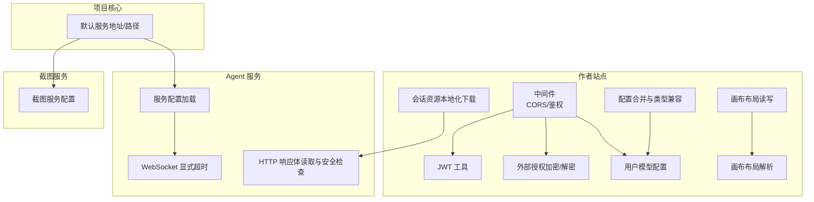
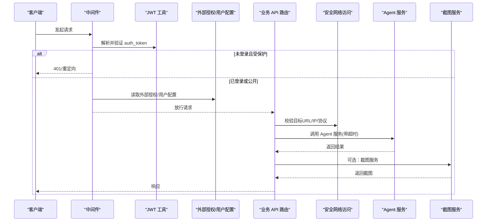
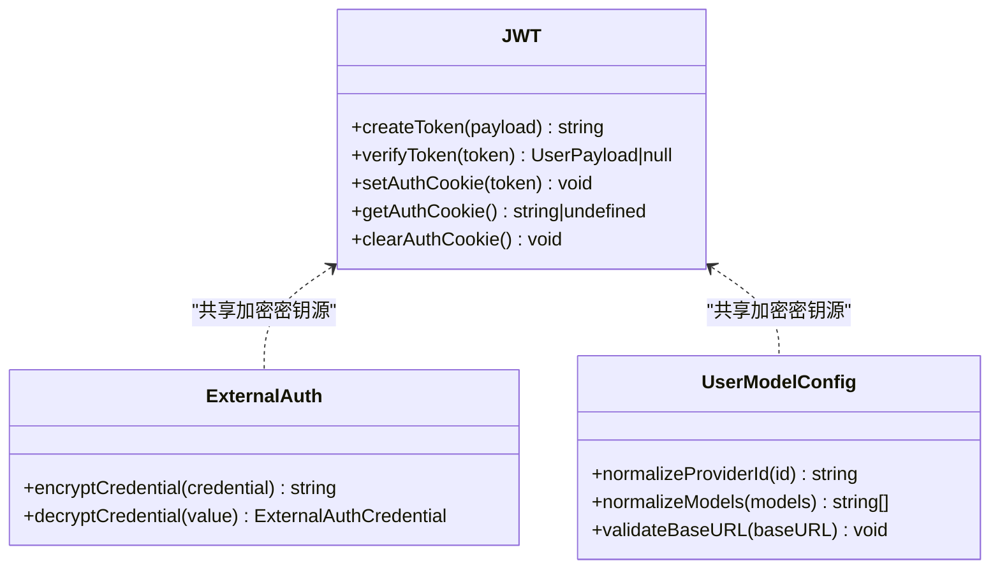
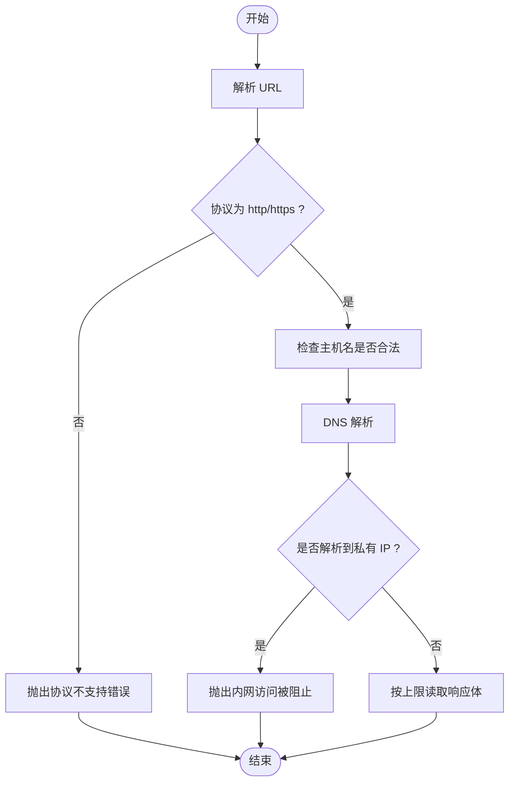
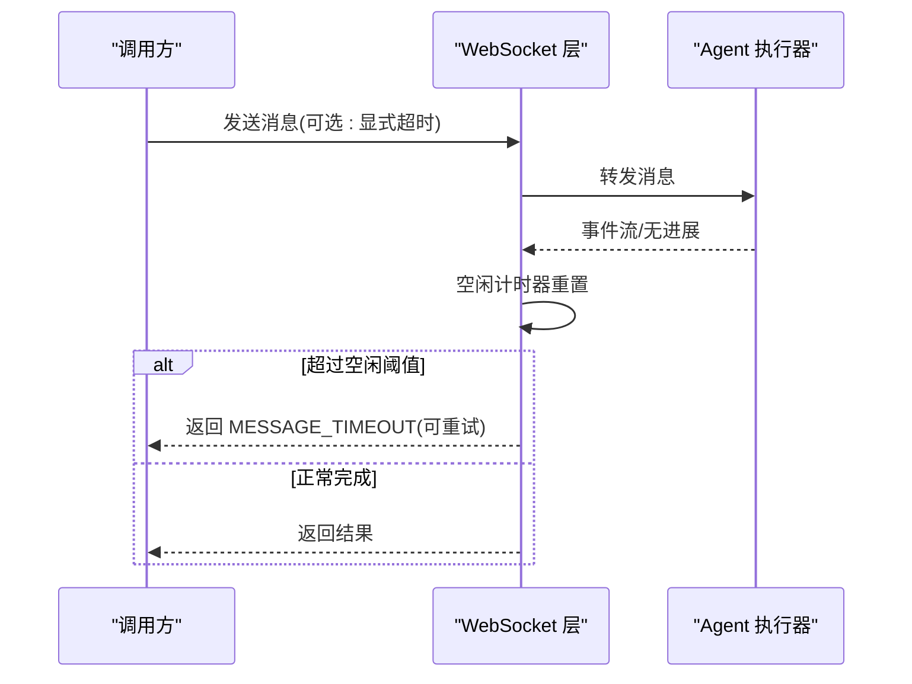
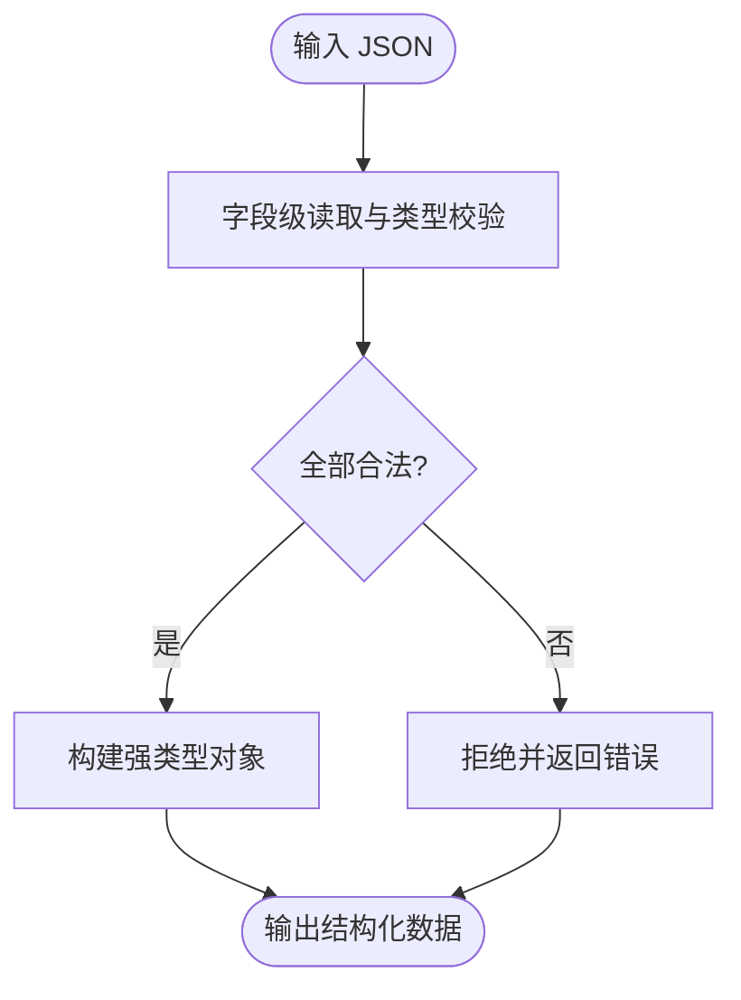
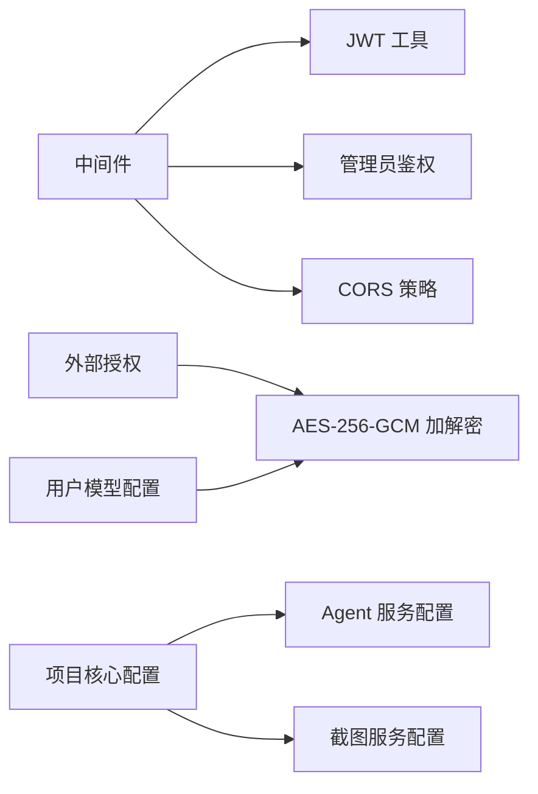

# 外部 API 集成

<cite>
**本文引用的文件**
- [middleware.ts](file://packages/author-site/src/middleware.ts)
- [jwt.ts](file://packages/author-site/src/lib/auth/jwt.ts)
- [external-auth.ts](file://packages/author-site/src/lib/external-auth.ts)
- [user-model-config.ts](file://packages/author-site/src/lib/user-model-config.ts)
- [config.ts（agent-service）](file://packages/agent-service/src/utils/config.ts)
- [config.ts（project-core）](file://packages/project-core/src/config.ts)
- [config.ts（screenshot-service）](file://packages/screenshot-service/src/config.ts)
- [web-read-tool.ts](file://packages/agent-service/src/backends/pi-tools/web-read-tool.ts)
- [route.ts（会话资源本地化下载）](file://packages/author-site/src/app/api/sessions/[sessionId]/assets/localize/route.ts)
- [canvas-layout/route.ts](file://packages/author-site/src/app/api/sessions/[sessionId]/canvas-layout/route.ts)
- [canvas-layout-file.ts](file://packages/author-site/src/lib/canvas-layout-file.ts)
- [config-merge.ts](file://packages/author-site/src/lib/config-merge.ts)
- [websocket-timeout.test.ts](file://packages/agent-service/tests/unit/websocket-timeout.test.ts)
- [backend-agent-inactivity-timeout.test.ts](file://packages/agent-service/tests/unit/backend-agent-inactivity-timeout.test.ts)
- [01_架构设计.md（管理后台）](file://docs/项目文档/创作端/08-管理后台/技术/01_架构设计.md)
</cite>

## 目录
1. [简介](#简介)
2. [项目结构](#项目结构)
3. [核心组件](#核心组件)
4. [架构总览](#架构总览)
5. [详细组件分析](#详细组件分析)
6. [依赖分析](#依赖分析)
7. [性能考虑](#性能考虑)
8. [故障排查指南](#故障排查指南)
9. [结论](#结论)
10. [附录](#附录)

## 简介
本指南面向需要在系统中进行外部 API 集成的开发者，围绕 HTTP 客户端封装、认证授权、重试与熔断、数据格式转换、典型集成场景以及监控与调试等方面提供系统化说明。内容基于仓库中现有实现与测试用例提炼，确保与实际代码保持一致，便于直接落地使用。

## 项目结构
本项目采用多包工作区组织，涉及多个服务与工具库：
- author-site：Next.js 应用，负责用户鉴权、API 路由、中间件、配置合并与类型校验等
- agent-service：Agent 运行时与后端能力，包含配置加载、WebSocket 超时控制、HTTP 读取工具等
- project-core：项目管理核心，提供默认服务地址与路径解析
- screenshot-service：截图服务，提供并发与超时等运行参数

图表来源
- [middleware.ts:1-153](file://packages/author-site/src/middleware.ts#L1-L153)
- [jwt.ts:1-70](file://packages/author-site/src/lib/auth/jwt.ts#L1-L70)
- [external-auth.ts:44-89](file://packages/author-site/src/lib/external-auth.ts#L44-L89)
- [user-model-config.ts:63-122](file://packages/author-site/src/lib/user-model-config.ts#L63-L122)
- [config.ts（agent-service）:1-48](file://packages/agent-service/src/utils/config.ts#L1-L48)
- [config.ts（screenshot-service）:1-52](file://packages/screenshot-service/src/config.ts#L1-L52)
- [config.ts（project-core）:1-94](file://packages/project-core/src/config.ts#L1-L94)
- [web-read-tool.ts:329-375](file://packages/agent-service/src/backends/pi-tools/web-read-tool.ts#L329-L375)
- [route.ts（会话资源本地化下载）:53-106](file://packages/author-site/src/app/api/sessions/[sessionId]/assets/localize/route.ts#L53-L106)
- [canvas-layout/route.ts:47-202](file://packages/author-site/src/app/api/sessions/[sessionId]/canvas-layout/route.ts#L47-L202)
- [canvas-layout-file.ts:1-275](file://packages/author-site/src/lib/canvas-layout-file.ts#L1-L275)
- [config-merge.ts:102-132](file://packages/author-site/src/lib/config-merge.ts#L102-L132)

章节来源
- [middleware.ts:1-153](file://packages/author-site/src/middleware.ts#L1-L153)
- [config.ts（agent-service）:1-48](file://packages/agent-service/src/utils/config.ts#L1-L48)
- [config.ts（project-core）:1-94](file://packages/project-core/src/config.ts#L1-L94)
- [config.ts（screenshot-service）:1-52](file://packages/screenshot-service/src/config.ts#L1-L52)

## 核心组件
- 中间件与 CORS：统一处理跨域预检、受保护页面/API 的鉴权拦截、管理员访问控制与 Cookie 设置
- JWT 工具：令牌签发、验证与 Cookie 生命周期管理
- 外部授权与密钥管理：外部凭据加解密、用户级 API Key 存储与校验
- Agent 服务配置：端口、日志级别、内部 Token、截图服务地址、PI Agent 参数与限流窗口
- 截图服务配置：并发度、超时、队列与任务超时、缓存与快照版本等
- 安全网络访问：对外部 URL 协议、主机名与 IP 白名单/黑名单校验，限制内网访问
- 数据格式转换：严格的 JSON 反序列化与字段类型校验，保障数据结构稳定

章节来源
- [middleware.ts:1-153](file://packages/author-site/src/middleware.ts#L1-L153)
- [jwt.ts:1-70](file://packages/author-site/src/lib/auth/jwt.ts#L1-L70)
- [external-auth.ts:44-89](file://packages/author-site/src/lib/external-auth.ts#L44-L89)
- [user-model-config.ts:63-122](file://packages/author-site/src/lib/user-model-config.ts#L63-L122)
- [config.ts（agent-service）:1-48](file://packages/agent-service/src/utils/config.ts#L1-L48)
- [config.ts（screenshot-service）:1-52](file://packages/screenshot-service/src/config.ts#L1-L52)
- [web-read-tool.ts:329-375](file://packages/agent-service/src/backends/pi-tools/web-read-tool.ts#L329-L375)
- [route.ts（会话资源本地化下载）:53-106](file://packages/author-site/src/app/api/sessions/[sessionId]/assets/localize/route.ts#L53-L106)
- [canvas-layout/route.ts:47-202](file://packages/author-site/src/app/api/sessions/[sessionId]/canvas-layout/route.ts#L47-L202)
- [canvas-layout-file.ts:1-275](file://packages/author-site/src/lib/canvas-layout-file.ts#L1-L275)
- [config-merge.ts:102-132](file://packages/author-site/src/lib/config-merge.ts#L102-L132)

## 架构总览
下图展示从请求进入中间件到下游服务调用的整体链路，包括鉴权、CORS、外部授权注入、安全网络访问与超时控制。

图表来源
- [middleware.ts:1-153](file://packages/author-site/src/middleware.ts#L1-L153)
- [jwt.ts:1-70](file://packages/author-site/src/lib/auth/jwt.ts#L1-L70)
- [external-auth.ts:44-89](file://packages/author-site/src/lib/external-auth.ts#L44-L89)
- [user-model-config.ts:63-122](file://packages/author-site/src/lib/user-model-config.ts#L63-L122)
- [route.ts（会话资源本地化下载）:53-106](file://packages/author-site/src/app/api/sessions/[sessionId]/assets/localize/route.ts#L53-L106)
- [config.ts（agent-service）:1-48](file://packages/agent-service/src/utils/config.ts#L1-L48)
- [config.ts（screenshot-service）:1-52](file://packages/screenshot-service/src/config.ts#L1-L52)

## 详细组件分析

### HTTP 客户端封装与请求拦截器
- 请求拦截点
  - 中间件集中处理 CORS 预检、登录态校验、管理员访问控制，并对受保护 API 返回统一错误结构
  - 通过 Cookie 中的 auth_token 完成用户态鉴权；管理员通过 admin_token 或 URL secret 完成二次鉴权
- 响应处理
  - 对受保护 API 返回标准 JSON 错误结构，便于前端统一处理
  - 对预览模块与公共模块分别设置不同的 CORS 头策略
- 关键要点
  - 仅允许配置的 origin 携带凭证访问 /api、/embed、/viewer、/data 等路径
  - 登录态缺失时，页面路由重定向至登录页，API 路由返回 401

章节来源
- [middleware.ts:1-153](file://packages/author-site/src/middleware.ts#L1-L153)

### 认证与授权机制
- JWT 令牌管理
  - 使用 HS256 算法签发 7 天有效期的 token，并通过 httpOnly Cookie 持久化
  - 支持在开发环境禁用 secure 标志以适配 HTTP 部署
- 管理员访问控制
  - 支持通过 URL secret 首次访问后设置短期 admin_token，后续通过 Cookie 校验
  - 管理后台与 /api/admin/* 均受中间件保护
- 外部授权与多租户隔离
  - 外部授权凭据采用 AES-256-GCM 加密存储，支持版本前缀与 IV/Tag 分离
  - 用户级 API Key 同样加密存储，并提供 baseURL 合法性校验与 providerId 规范化
  - 新建会话时可推送已保存的外部授权配置，避免重复授权

图表来源
- [jwt.ts:1-70](file://packages/author-site/src/lib/auth/jwt.ts#L1-L70)
- [external-auth.ts:44-89](file://packages/author-site/src/lib/external-auth.ts#L44-L89)
- [user-model-config.ts:63-122](file://packages/author-site/src/lib/user-model-config.ts#L63-L122)

章节来源
- [jwt.ts:1-70](file://packages/author-site/src/lib/auth/jwt.ts#L1-L70)
- [01_架构设计.md（管理后台）:297-328](file://docs/项目文档/创作端/08-管理后台/技术/01_架构设计.md#L297-L328)
- [external-auth.ts:44-89](file://packages/author-site/src/lib/external-auth.ts#L44-L89)
- [user-model-config.ts:63-122](file://packages/author-site/src/lib/user-model-config.ts#L63-L122)

### 安全网络访问与外部调用
- 协议与主机名校验
  - 仅允许 http/https 协议，禁止 localhost 及 .localhost 后缀
  - DNS 解析后拒绝私有 IP 与常见内网段，防止 SSRF
- 文本内容识别与大小限制
  - 根据 Content-Type 判断是否为文本类内容
  - 对响应体按最大字节数读取，避免内存溢出

图表来源
- [route.ts（会话资源本地化下载）:53-106](file://packages/author-site/src/app/api/sessions/[sessionId]/assets/localize/route.ts#L53-L106)
- [web-read-tool.ts:329-375](file://packages/agent-service/src/backends/pi-tools/web-read-tool.ts#L329-L375)

章节来源
- [route.ts（会话资源本地化下载）:53-106](file://packages/author-site/src/app/api/sessions/[sessionId]/assets/localize/route.ts#L53-L106)
- [web-read-tool.ts:329-375](file://packages/agent-service/src/backends/pi-tools/web-read-tool.ts#L329-L375)

### 请求重试与熔断机制
- 超时与空闲检测
  - WebSocket 层支持显式消息超时，并对不安全值进行钳制
  - Agent 发送消息在无进展情况下触发 inactivity 超时，返回可重试的错误码
- 限流与速率控制
  - 服务配置中包含 rateLimit 窗口与最大请求数，用于基础流量控制
- 降级策略
  - 当上游不可用或繁忙时，返回明确的可重试错误码，由上层决定重试或走降级逻辑

图表来源
- [websocket-timeout.test.ts:1-53](file://packages/agent-service/tests/unit/websocket-timeout.test.ts#L1-L53)
- [backend-agent-inactivity-timeout.test.ts:41-88](file://packages/agent-service/tests/unit/backend-agent-inactivity-timeout.test.ts#L41-L88)
- [config.ts（agent-service）:1-48](file://packages/agent-service/src/utils/config.ts#L1-L48)

章节来源
- [websocket-timeout.test.ts:1-53](file://packages/agent-service/tests/unit/websocket-timeout.test.ts#L1-L53)
- [backend-agent-inactivity-timeout.test.ts:41-88](file://packages/agent-service/tests/unit/backend-agent-inactivity-timeout.test.ts#L41-L88)
- [config.ts（agent-service）:1-48](file://packages/agent-service/src/utils/config.ts#L1-L48)

### 数据格式转换与类型验证
- 严格解析与校验
  - 针对复杂对象（如画布布局）提供逐字段读取与类型校验函数，缺失或非法字段直接拒绝
  - 配置合并时对既有值与 schema 类型进行兼容性检查，避免脏数据污染
- 典型流程
  - 接收原始 JSON -> 字段级读取与校验 -> 构造强类型对象 -> 落盘或转发

图表来源
- [canvas-layout/route.ts:47-202](file://packages/author-site/src/app/api/sessions/[sessionId]/canvas-layout/route.ts#L47-L202)
- [canvas-layout-file.ts:1-275](file://packages/author-site/src/lib/canvas-layout-file.ts#L1-L275)
- [config-merge.ts:102-132](file://packages/author-site/src/lib/config-merge.ts#L102-L132)

章节来源
- [canvas-layout/route.ts:47-202](file://packages/author-site/src/app/api/sessions/[sessionId]/canvas-layout/route.ts#L47-L202)
- [canvas-layout-file.ts:1-275](file://packages/author-site/src/lib/canvas-layout-file.ts#L1-L275)
- [config-merge.ts:102-132](file://packages/author-site/src/lib/config-merge.ts#L102-L132)

### 实际集成示例
- 第三方服务调用
  - 通过安全网络访问模块校验目标 URL 与 IP，再发起 HTTP 请求，结合 Agent 服务的超时与空闲检测保证稳定性
- Webhook 接收
  - 在 API 路由中接入中间件的鉴权与 CORS 策略，对入参进行严格解析与类型校验，返回统一错误结构
- 异步任务处理
  - 将耗时操作交由 Agent 服务执行，通过 WebSocket 事件流反馈进度，并在空闲超时时返回可重试错误码

章节来源
- [route.ts（会话资源本地化下载）:53-106](file://packages/author-site/src/app/api/sessions/[sessionId]/assets/localize/route.ts#L53-L106)
- [websocket-timeout.test.ts:1-53](file://packages/agent-service/tests/unit/websocket-timeout.test.ts#L1-L53)
- [backend-agent-inactivity-timeout.test.ts:41-88](file://packages/agent-service/tests/unit/backend-agent-inactivity-timeout.test.ts#L41-L88)

## 依赖分析
- 组件耦合
  - 中间件依赖 JWT 与管理员鉴权，同时影响所有 /api、/embed、/viewer、/data 路径
  - 外部授权与用户配置共享加密密钥来源，降低密钥分散风险
  - 项目核心提供默认服务地址，供 agent-service 与截图服务初始化
- 外部依赖
  - Agent 服务暴露 PI Agent 相关配置项（provider、apiKey、model、baseUrl、timeout、subagents 等）
  - 截图服务提供并发与超时等运行参数，便于容量规划

图表来源
- [middleware.ts:1-153](file://packages/author-site/src/middleware.ts#L1-L153)
- [jwt.ts:1-70](file://packages/author-site/src/lib/auth/jwt.ts#L1-L70)
- [external-auth.ts:44-89](file://packages/author-site/src/lib/external-auth.ts#L44-L89)
- [user-model-config.ts:63-122](file://packages/author-site/src/lib/user-model-config.ts#L63-L122)
- [config.ts（project-core）:1-94](file://packages/project-core/src/config.ts#L1-L94)
- [config.ts（agent-service）:1-48](file://packages/agent-service/src/utils/config.ts#L1-L48)
- [config.ts（screenshot-service）:1-52](file://packages/screenshot-service/src/config.ts#L1-L52)

章节来源
- [middleware.ts:1-153](file://packages/author-site/src/middleware.ts#L1-L153)
- [config.ts（project-core）:1-94](file://packages/project-core/src/config.ts#L1-L94)
- [config.ts（agent-service）:1-48](file://packages/agent-service/src/utils/config.ts#L1-L48)
- [config.ts（screenshot-service）:1-52](file://packages/screenshot-service/src/config.ts#L1-L52)

## 性能考虑
- 并发与队列
  - 截图服务支持最大并发页面数与队列/任务超时，可按负载调整
- 超时与空闲检测
  - 显式消息超时与空闲超时配合，避免长连接占用资源
- 限流
  - 通过 rateLimit 窗口与最大请求数限制突发流量
- 缓存与版本
  - 截图服务提供编译缓存条目上限与快照版本，便于缓存失效策略

章节来源
- [config.ts（screenshot-service）:1-52](file://packages/screenshot-service/src/config.ts#L1-L52)
- [websocket-timeout.test.ts:1-53](file://packages/agent-service/tests/unit/websocket-timeout.test.ts#L1-L53)
- [config.ts（agent-service）:1-48](file://packages/agent-service/src/utils/config.ts#L1-L48)

## 故障排查指南
- 鉴权失败
  - 检查 auth_token 是否存在且未过期，确认中间件是否正确放行受保护路由
  - 管理员访问需确认 admin_token 或 URL secret 是否有效
- 跨域问题
  - 确认请求 origin 是否在允许的 CORS 列表中，预检 OPTIONS 是否返回 204
- 外部调用失败
  - 检查目标 URL 协议与主机名是否合法，DNS 是否解析到私有 IP
  - 关注响应体大小限制与 Content-Type 判断
- 超时与重试
  - 观察是否触发空闲超时或显式超时，依据返回的错误码决定是否重试或降级

章节来源
- [middleware.ts:1-153](file://packages/author-site/src/middleware.ts#L1-L153)
- [route.ts（会话资源本地化下载）:53-106](file://packages/author-site/src/app/api/sessions/[sessionId]/assets/localize/route.ts#L53-L106)
- [websocket-timeout.test.ts:1-53](file://packages/agent-service/tests/unit/websocket-timeout.test.ts#L1-L53)
- [backend-agent-inactivity-timeout.test.ts:41-88](file://packages/agent-service/tests/unit/backend-agent-inactivity-timeout.test.ts#L41-L88)

## 结论
本指南基于仓库现有实现，总结了外部 API 集成的关键要素：统一的中间件鉴权与 CORS、安全的网络访问、严格的类型校验、可控的超时与空闲检测、以及可扩展的配置与加密机制。遵循上述模式可实现稳定、可观测、易维护的外部服务对接。

## 附录
- 环境变量与配置键参考
  - Agent 服务：端口、主机、日志级别、内部 Token、截图服务地址、PI Agent 提供商/模型/基址/超时、子代理开关与超时、限流窗口与最大请求数
  - 截图服务：端口、主机、日志级别、作者站点地址、CDN 基址、预览运行时来源、数据目录、Puppeteer 选项、视口、并发、各类超时、缓存条目上限、快照版本、历史文件上限
  - 项目核心：默认 Agent 服务与截图服务地址、审计目录、批大小、角色与允许的项目 ID 列表、查看器基址

章节来源
- [config.ts（agent-service）:1-48](file://packages/agent-service/src/utils/config.ts#L1-L48)
- [config.ts（screenshot-service）:1-52](file://packages/screenshot-service/src/config.ts#L1-L52)
- [config.ts（project-core）:1-94](file://packages/project-core/src/config.ts#L1-L94)