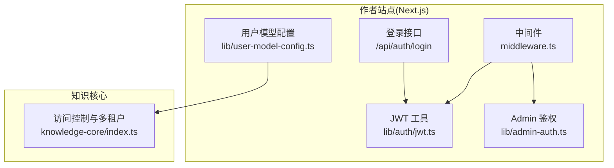
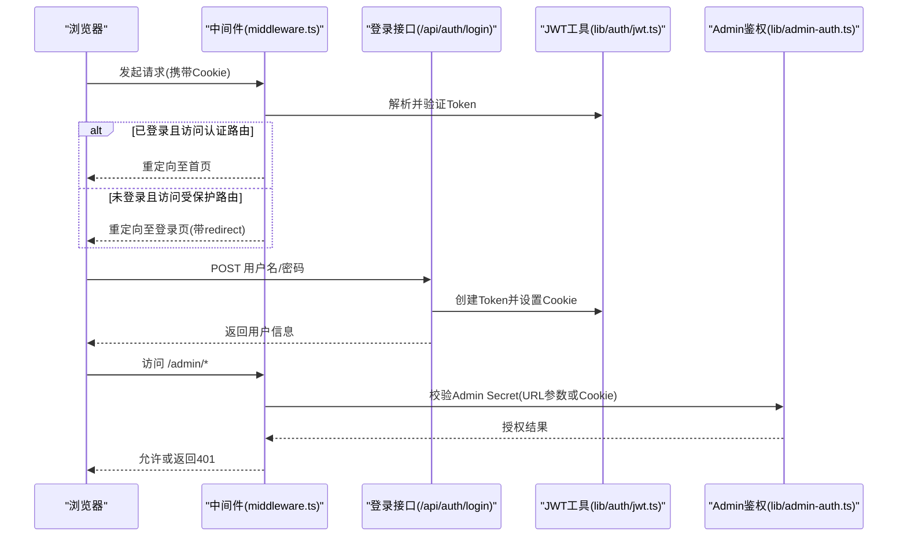
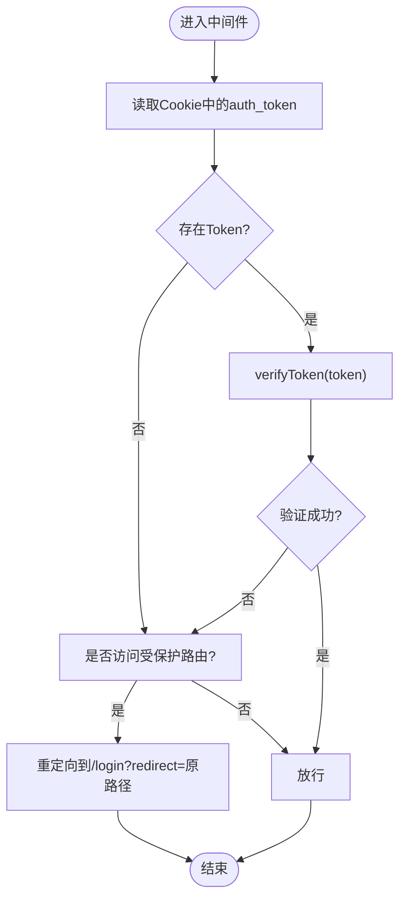
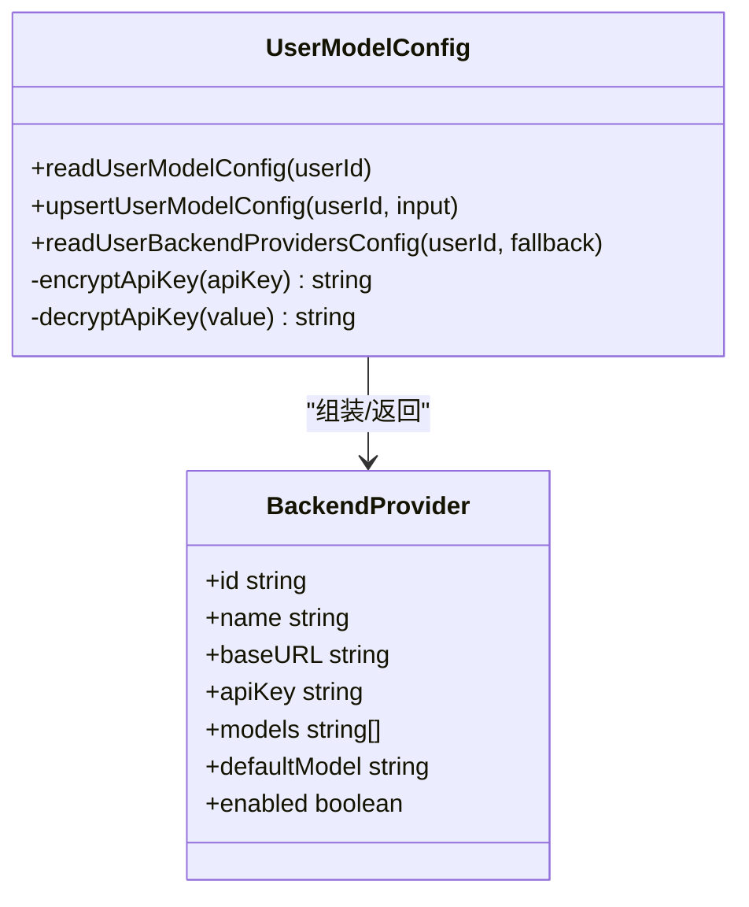
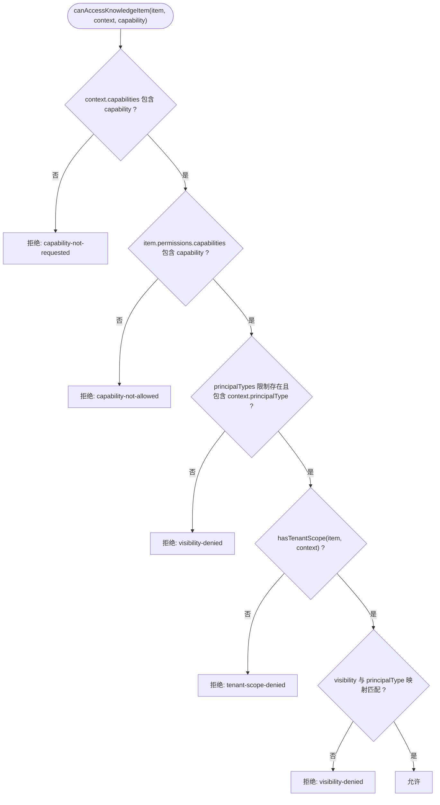
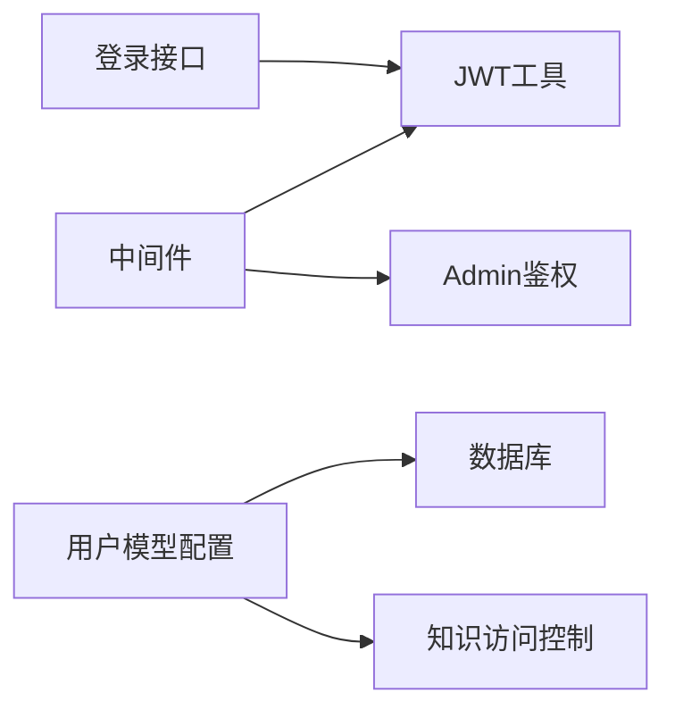

# 认证授权机制

<cite>
**本文引用的文件**   
- [packages/author-site/src/lib/auth/jwt.ts](file://packages/author-site/src/lib/auth/jwt.ts)
- [packages/author-site/src/app/api/auth/login/route.ts](file://packages/author-site/src/app/api/auth/login/route.ts)
- [packages/author-site/src/middleware.ts](file://packages/author-site/src/middleware.ts)
- [packages/author-site/src/lib/admin-auth.ts](file://packages/author-site/src/lib/admin-auth.ts)
- [packages/author-site/src/lib/user-model-config.ts](file://packages/author-site/src/lib/user-model-config.ts)
- [packages/knowledge-core/src/index.ts](file://packages/knowledge-core/src/index.ts)
- [docs/项目文档/使用端/03-部署与嵌入/技术/01_部署与CORS配置.md](file://docs/项目文档/使用端/03-部署与嵌入/技术/01_部署与CORS配置.md)
</cite>

## 目录
1. [简介](#简介)
2. [项目结构](#项目结构)
3. [核心组件](#核心组件)
4. [架构总览](#架构总览)
5. [详细组件分析](#详细组件分析)
6. [依赖关系分析](#依赖关系分析)
7. [性能考虑](#性能考虑)
8. [故障排查指南](#故障排查指南)
9. [结论](#结论)
10. [附录](#附录)

## 简介
本文件面向集成与运维人员，系统化说明本仓库的认证与授权机制，覆盖以下主题：
- JWT 令牌的获取、存储与自动刷新策略
- API Key 的配置与管理（含环境变量与多环境支持）
- 多租户隔离的实现原理（租户标识传递与数据权限控制）
- 实际集成示例（不同场景下的正确配置方式）
- 安全最佳实践（令牌加密存储、敏感信息保护、防重放攻击措施）

## 项目结构
认证与授权相关的关键位置如下：
- 用户登录与 JWT 处理：作者站点（Next.js）中的路由与中间件
- 管理后台鉴权：基于 Admin Secret 的独立鉴权模块
- 模型配置与 API Key 管理：用户级配置持久化与加解密
- 知识访问控制与多租户：能力、可见性与租户范围校验

图表来源
- [packages/author-site/src/middleware.ts:1-153](file://packages/author-site/src/middleware.ts#L1-L153)
- [packages/author-site/src/app/api/auth/login/route.ts:1-48](file://packages/author-site/src/app/api/auth/login/route.ts#L1-L48)
- [packages/author-site/src/lib/auth/jwt.ts:1-70](file://packages/author-site/src/lib/auth/jwt.ts#L1-L70)
- [packages/author-site/src/lib/admin-auth.ts:1-135](file://packages/author-site/src/lib/admin-auth.ts#L1-L135)
- [packages/author-site/src/lib/user-model-config.ts:1-271](file://packages/author-site/src/lib/user-model-config.ts#L1-L271)
- [packages/knowledge-core/src/index.ts:1-200](file://packages/knowledge-core/src/index.ts#L1-L200)

章节来源
- [packages/author-site/src/middleware.ts:1-153](file://packages/author-site/src/middleware.ts#L1-L153)
- [packages/author-site/src/app/api/auth/login/route.ts:1-48](file://packages/author-site/src/app/api/auth/login/route.ts#L1-L48)
- [packages/author-site/src/lib/auth/jwt.ts:1-70](file://packages/author-site/src/lib/auth/jwt.ts#L1-L70)
- [packages/author-site/src/lib/admin-auth.ts:1-135](file://packages/author-site/src/lib/admin-auth.ts#L1-L135)
- [packages/author-site/src/lib/user-model-config.ts:1-271](file://packages/author-site/src/lib/user-model-config.ts#L1-L271)
- [packages/knowledge-core/src/index.ts:1-200](file://packages/knowledge-core/src/index.ts#L1-L200)

## 核心组件
- JWT 工具
  - 负责创建、验证、设置/读取/清除认证 Cookie。
  - 默认算法 HS256，过期时间 7 天；Cookie 标记 httpOnly、sameSite=lax，生产环境默认 secure。
- 登录接口
  - 校验用户名与密码，成功后签发 JWT 并写入 Cookie。
- 中间件
  - 统一拦截请求：提取 Cookie 中的 Token 进行验证；对受保护页面/API 做未登录拦截；对管理后台进行 Admin Secret 校验；为跨域请求添加 CORS 头。
- Admin 鉴权
  - 通过环境变量注入的 Admin Secret，支持 URL 参数或 Cookie 校验；Edge Runtime 兼容的哈希实现。
- 用户模型配置与 API Key 管理
  - 用户级模型配置持久化；API Key 以 AES-256-GCM 加密存储；对外返回“安全视图”（不暴露真实密钥）。
- 知识访问控制与多租户
  - 基于能力、可见性、主体类型与租户范围的多维校验。

章节来源
- [packages/author-site/src/lib/auth/jwt.ts:1-70](file://packages/author-site/src/lib/auth/jwt.ts#L1-L70)
- [packages/author-site/src/app/api/auth/login/route.ts:1-48](file://packages/author-site/src/app/api/auth/login/route.ts#L1-L48)
- [packages/author-site/src/middleware.ts:1-153](file://packages/author-site/src/middleware.ts#L1-L153)
- [packages/author-site/src/lib/admin-auth.ts:1-135](file://packages/author-site/src/lib/admin-auth.ts#L1-L135)
- [packages/author-site/src/lib/user-model-config.ts:1-271](file://packages/author-site/src/lib/user-model-config.ts#L1-L271)
- [packages/knowledge-core/src/index.ts:284-324](file://packages/knowledge-core/src/index.ts#L284-L324)

## 架构总览
下图展示了从浏览器到服务端的关键认证流程与跨域处理路径。

图表来源
- [packages/author-site/src/middleware.ts:45-148](file://packages/author-site/src/middleware.ts#L45-L148)
- [packages/author-site/src/app/api/auth/login/route.ts:6-47](file://packages/author-site/src/app/api/auth/login/route.ts#L6-L47)
- [packages/author-site/src/lib/auth/jwt.ts:16-56](file://packages/author-site/src/lib/auth/jwt.ts#L16-L56)
- [packages/author-site/src/lib/admin-auth.ts:38-99](file://packages/author-site/src/lib/admin-auth.ts#L38-L99)

## 详细组件分析

### JWT 令牌：获取、存储与自动刷新
- 获取流程
  - 客户端提交用户名与密码至登录接口，服务端校验通过后调用 JWT 工具生成令牌，并通过响应头写入 Cookie。
- 存储策略
  - 使用 httpOnly、sameSite=lax 的 Cookie 存储；生产环境默认启用 secure（需 HTTPS），可通过环境变量开关。
- 自动刷新策略
  - 当前实现采用固定有效期（7 天）的无状态令牌，未在代码中实现服务端侧主动刷新逻辑。建议在前端根据本地时间与令牌过期时间差，在即将过期时触发静默刷新（例如调用 /api/auth/me 或专用刷新接口），失败则引导重新登录。
- 关键要点
  - 中间件仅验证签名与有效期，无需查询数据库。
  - 错误提示统一且不泄露具体原因。

图表来源
- [packages/author-site/src/middleware.ts:45-98](file://packages/author-site/src/middleware.ts#L45-L98)
- [packages/author-site/src/lib/auth/jwt.ts:27-34](file://packages/author-site/src/lib/auth/jwt.ts#L27-L34)

章节来源
- [packages/author-site/src/app/api/auth/login/route.ts:6-47](file://packages/author-site/src/app/api/auth/login/route.ts#L6-L47)
- [packages/author-site/src/lib/auth/jwt.ts:1-70](file://packages/author-site/src/lib/auth/jwt.ts#L1-L70)
- [packages/author-site/src/middleware.ts:45-98](file://packages/author-site/src/middleware.ts#L45-L98)

### API Key 配置与管理（环境变量与多环境）
- 配置来源
  - 用户级模型配置可持久化到数据库，API Key 以 AES-256-GCM 加密存储；对外只返回“安全视图”，不包含真实密钥。
  - 服务启动时也可从环境变量加载后端提供者配置作为回退。
- 加密与解密
  - 使用 SHA-256 派生密钥，AES-256-GCM 加解密；版本前缀用于向后兼容。
- 多环境支持
  - 通过环境变量注入不同环境的密钥与提供者列表；测试与生产可通过不同 .env 文件区分。
- 安全建议
  - 禁止将明文 API Key 放入前端构建产物或日志；仅在服务端解密后使用。

图表来源
- [packages/author-site/src/lib/user-model-config.ts:148-201](file://packages/author-site/src/lib/user-model-config.ts#L148-L201)
- [packages/agent-service/src/config/backend-providers.ts:34-63](file://packages/agent-service/src/config/backend-providers.ts#L34-L63)

章节来源
- [packages/author-site/src/lib/user-model-config.ts:1-271](file://packages/author-site/src/lib/user-model-config.ts#L1-L271)
- [packages/agent-service/src/config/backend-providers.ts:34-63](file://packages/agent-service/src/config/backend-providers.ts#L34-L63)

### 多租户隔离：租户标识传递与数据权限控制
- 访问上下文
  - 包含主体类型、主体ID、租户范围（项目/模板/组织）、访问面、目的与能力集合。
- 权限判定
  - 按能力、可见性、主体类型与租户范围逐项校验；任一不满足即拒绝。
- 租户范围
  - 针对“当前项目”和“链接模板”两类资源，依据上下文中的 projectId/templateId 与资源 sourceId 匹配。

图表来源
- [packages/knowledge-core/src/index.ts:284-324](file://packages/knowledge-core/src/index.ts#L284-L324)

章节来源
- [packages/knowledge-core/src/index.ts:284-324](file://packages/knowledge-core/src/index.ts#L284-L324)

### 管理后台鉴权（Admin Secret）
- 校验方式
  - 支持 URL 参数 secret 或 Cookie admin_token；Edge Runtime 下使用 Web Crypto API 计算 SHA-256。
- Cookie 设置
  - 首次通过 URL 参数校验后，中间件会设置短期有效的 httpOnly Cookie。
- 适用场景
  - 运维调试、内部工具等需要强凭据的场景。

章节来源
- [packages/author-site/src/lib/admin-auth.ts:1-135](file://packages/author-site/src/lib/admin-auth.ts#L1-L135)
- [packages/author-site/src/middleware.ts:100-135](file://packages/author-site/src/middleware.ts#L100-L135)

### 跨域与安全头（CORS）
- author-site 创作端
  - 中间件对 /api/、/embed/、/viewer/、/data/ 路由，若 Origin 在白名单内则添加 CORS 头，OPTIONS 预检直接返回 204。
- agent-service
  - 通过环境变量 CORS_ORIGINS 配置允许的来源；生产环境必须包含 viewer-site 实际域名。
- 凭证传递
  - 允许携带 Cookie（Access-Control-Allow-Credentials: true），需确保同源策略与 Secure Cookie 配合。

章节来源
- [packages/author-site/src/middleware.ts:18-43](file://packages/author-site/src/middleware.ts#L18-L43)
- [docs/项目文档/使用端/03-部署与嵌入/技术/01_部署与CORS配置.md:70-101](file://docs/项目文档/使用端/03-部署与嵌入/技术/01_部署与CORS配置.md#L70-L101)

## 依赖关系分析
- 中间件依赖
  - 依赖 JWT 工具进行 Token 验证；依赖 Admin 鉴权模块进行后台访问控制；依赖环境变量进行 CORS 白名单与 Cookie 安全标志控制。
- 登录接口依赖
  - 依赖用户校验与 JWT 工具。
- 用户模型配置依赖
  - 依赖数据库与加密库；对外提供安全视图，避免泄漏密钥。
- 知识访问控制依赖
  - 依赖访问上下文中的租户范围与权限声明。

图表来源
- [packages/author-site/src/middleware.ts:1-153](file://packages/author-site/src/middleware.ts#L1-L153)
- [packages/author-site/src/app/api/auth/login/route.ts:1-48](file://packages/author-site/src/app/api/auth/login/route.ts#L1-L48)
- [packages/author-site/src/lib/user-model-config.ts:1-271](file://packages/author-site/src/lib/user-model-config.ts#L1-L271)
- [packages/knowledge-core/src/index.ts:1-200](file://packages/knowledge-core/src/index.ts#L1-L200)

## 性能考虑
- 无状态 Token 验证
  - 中间件仅做签名与有效期校验，避免数据库查询，降低延迟。
- 配置缓存
  - 模型配置在服务端有缓存机制，减少频繁 I/O。
- CORS 预检优化
  - OPTIONS 请求直接返回 204，避免进入业务路由。

[本节为通用指导，不直接分析具体文件]

## 故障排查指南
- 登录失败
  - 检查用户名与密码是否正确；确认登录接口返回的错误码与消息。
- 未登录被重定向
  - 确认 Cookie 是否存在且有效；检查中间件的受保护路由列表。
- 管理后台 401
  - 确认 Admin Secret 环境变量是否正确；URL 参数或 Cookie 是否一致。
- CORS 报错
  - 检查 origin 是否在 CORS_ORIGINS 白名单内；确认浏览器是否发送了 Credentials。
- API Key 无法解密
  - 确认加密版本与密钥一致性；检查存储格式是否完整。

章节来源
- [packages/author-site/src/app/api/auth/login/route.ts:38-47](file://packages/author-site/src/app/api/auth/login/route.ts#L38-L47)
- [packages/author-site/src/middleware.ts:75-98](file://packages/author-site/src/middleware.ts#L75-L98)
- [packages/author-site/src/lib/admin-auth.ts:111-135](file://packages/author-site/src/lib/admin-auth.ts#L111-L135)
- [docs/项目文档/使用端/03-部署与嵌入/技术/01_部署与CORS配置.md:70-101](file://docs/项目文档/使用端/03-部署与嵌入/技术/01_部署与CORS配置.md#L70-L101)
- [packages/author-site/src/lib/user-model-config.ts:71-88](file://packages/author-site/src/lib/user-model-config.ts#L71-L88)

## 结论
本系统采用“无状态 JWT + 中间件统一鉴权 + 管理后台独立凭据 + 用户级 API Key 加密存储 + 多维权限与租户范围控制”的组合方案，兼顾安全性与可扩展性。建议在现有基础上完善前端令牌自动刷新与更细粒度的审计日志，进一步提升用户体验与可观测性。

[本节为总结，不直接分析具体文件]

## 附录

### 环境变量清单与用途
- JWT_SECRET：JWT 签名密钥（必需）
- USE_SECURE_COOKIE：生产环境是否启用 secure Cookie（可选）
- CORS_ORIGINS：允许的跨域来源（逗号分隔）
- ADMIN_SECRET：管理后台凭据（必需）
- MODEL_CONFIG_ENCRYPTION_KEY：API Key 加密密钥（可选，回退到 JWT_SECRET）
- PI_AGENT_PROVIDERS：后端提供者配置（JSON 数组，供服务启动回退）

章节来源
- [packages/author-site/src/lib/auth/jwt.ts:4-6](file://packages/author-site/src/lib/auth/jwt.ts#L4-L6)
- [packages/author-site/src/middleware.ts:18-24](file://packages/author-site/src/middleware.ts#L18-L24)
- [packages/author-site/src/lib/admin-auth.ts:19-21](file://packages/author-site/src/lib/admin-auth.ts#L19-L21)
- [packages/author-site/src/lib/user-model-config.ts:45-52](file://packages/author-site/src/lib/user-model-config.ts#L45-L52)
- [packages/agent-service/src/config/backend-providers.ts:52-63](file://packages/agent-service/src/config/backend-providers.ts#L52-L63)

### 集成示例（场景化指引）
- 浏览器登录
  - 向 /api/auth/login 提交用户名与密码；成功后 Cookie 中持有 auth_token，后续请求由中间件自动验证。
- 跨域调用
  - 在 CORS_ORIGINS 中添加使用端域名；确保请求携带 Credentials；OPTIONS 预检将被中间件快速返回。
- 管理后台访问
  - 首次通过 URL 参数 secret 访问 /admin/*，中间件设置短期 admin_token Cookie；后续可直接访问。
- 配置 API Key
  - 通过用户模型配置接口保存 baseURL、models 与 apiKey；服务端以 AES-256-GCM 加密存储；对外返回安全视图。

章节来源
- [packages/author-site/src/app/api/auth/login/route.ts:6-47](file://packages/author-site/src/app/api/auth/login/route.ts#L6-L47)
- [packages/author-site/src/middleware.ts:63-73](file://packages/author-site/src/middleware.ts#L63-L73)
- [packages/author-site/src/middleware.ts:118-135](file://packages/author-site/src/middleware.ts#L118-L135)
- [packages/author-site/src/lib/user-model-config.ts:203-253](file://packages/author-site/src/lib/user-model-config.ts#L203-L253)

### 安全最佳实践
- 令牌加密存储
  - 使用 httpOnly、sameSite=lax、secure（生产）的 Cookie；避免在 JS 中读写敏感值。
- 敏感信息保护
  - API Key 使用 AES-256-GCM 加密存储；对外返回安全视图；严禁落盘明文。
- 防重放攻击
  - 对幂等写操作引入一次性随机数（nonce）+ 时间戳校验；服务端维护短期去重窗口。
- 最小权限原则
  - 明确能力与可见性声明；严格校验租户范围；按需授予主体类型。
- 跨域最小开放
  - 精确配置 CORS_ORIGINS；仅对必要路由开启；生产环境强制 HTTPS。

[本节为通用指导，不直接分析具体文件]