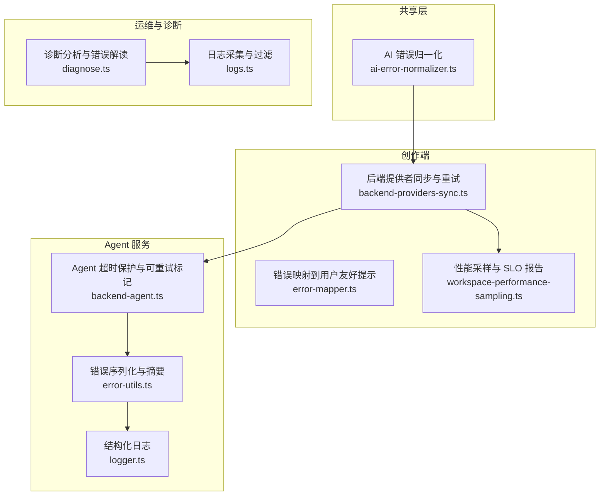
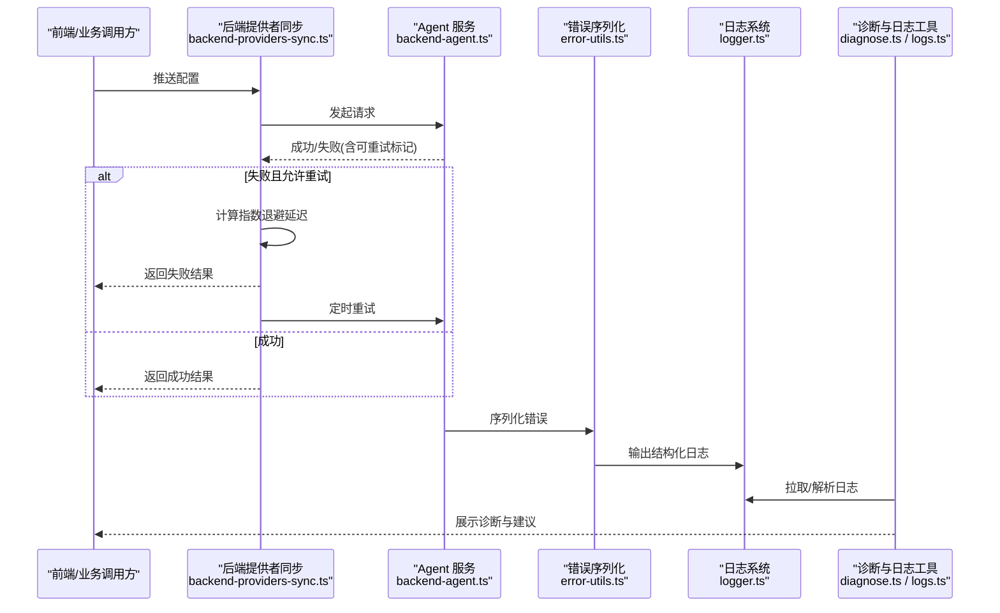
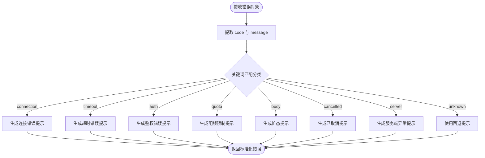
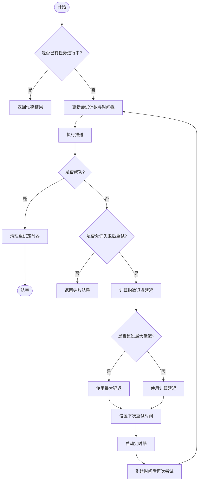
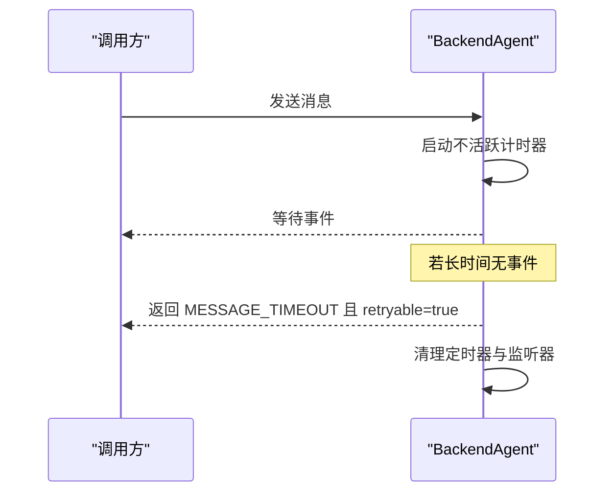
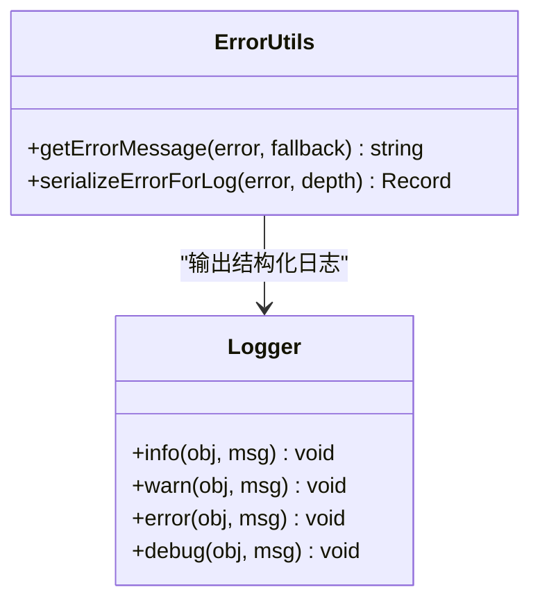
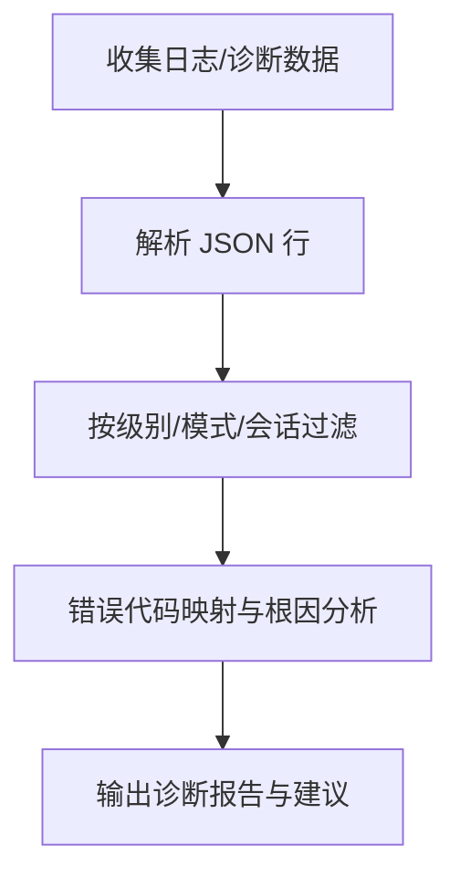
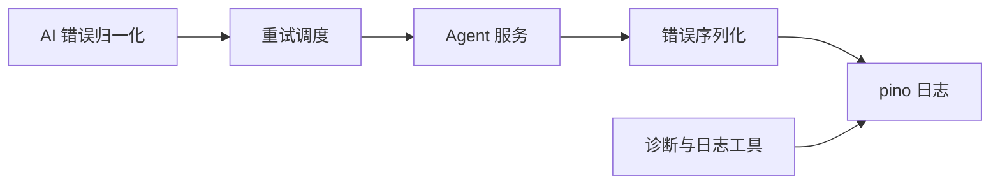

# 错误处理与重试机制

<cite>
**本文引用的文件**   
- [packages/author-site/src/lib/backend-providers-sync.ts](file://packages/author-site/src/lib/backend-providers-sync.ts)
- [packages/shared/src/ai-error-normalizer.ts](file://packages/shared/src/ai-error-normalizer.ts)
- [packages/agent-service/src/utils/error-utils.ts](file://packages/agent-service/src/utils/error-utils.ts)
- [packages/agent-service/src/utils/logger.ts](file://packages/agent-service/src/utils/logger.ts)
- [packages/agent-service/src/core/backend-agent.ts](file://packages/agent-service/src/core/backend-agent.ts)
- [packages/agent-service/tests/unit/backend-agent-inactivity-timeout.test.ts](file://packages/agent-service/tests/unit/backend-agent-inactivity-timeout.test.ts)
- [OPS/CLI/src/commands/diagnose.ts](file://OPS/CLI/src/commands/diagnose.ts)
- [packages/author-site/src/lib/__tests__/ai-error-normalizer.test.ts](file://packages/author-site/src/lib/__tests__/ai-error-normalizer.test.ts)
- [packages/author-site/lib/error-mapper.ts](file://packages/author-site/lib/error-mapper.ts)
- [packages/agent-service/src/workspace/workspace-authority-startup-recovery.ts](file://packages/agent-service/src/workspace/workspace-authority-startup-recovery.ts)
- [packages/agent-service/tests/unit/workspace-authority-startup-recovery.test.ts](file://packages/agent-service/tests/unit/workspace-authority-startup-recovery.test.ts)
- [packages/agent-service/tests/unit/agent-manager-processing-timeout.test.ts](file://packages/agent-service/tests/unit/agent-manager-processing-timeout.test.ts)
- [packages/author-site/src/components/ai-elements/message.tsx](file://packages/author-site/src/components/ai-elements/message.tsx)
- [packages/author-site/src/lib/workspace-performance-sampling.ts](file://packages/author-site/src/lib/workspace-performance-sampling.ts)
- [packages/author-site/src/lib/__tests__/workspace-performance-sampling.test.ts](file://packages/author-site/src/lib/__tests__/workspace-performance-sampling.test.ts)
- [OPS/CLI/src/commands/logs.ts](file://OPS/CLI/src/commands/logs.ts)
</cite>

## 目录
1. [引言](#引言)
2. [项目结构](#项目结构)
3. [核心组件](#核心组件)
4. [架构总览](#架构总览)
5. [详细组件分析](#详细组件分析)
6. [依赖分析](#依赖分析)
7. [性能考虑](#性能考虑)
8. [故障排查指南](#故障排查指南)
9. [结论](#结论)
10. [附录](#附录)

## 引言
本指南围绕“错误处理与重试机制”的落地实践，结合仓库中现有实现，系统化阐述：
- 统一错误分类与用户提示策略（网络、超时、鉴权、配额、忙态、取消、服务端异常等）
- 可配置的重试策略（指数退避、最大次数、条件判断）
- 熔断器模式的集成思路（故障检测、触发与恢复）
- 监控与日志记录最佳实践，帮助快速定位问题
- 面向不同场景的配置示例与调优建议

## 项目结构
本项目在多个包中实现了与错误处理和重试相关的逻辑：
- 共享层提供 AI 错误归一化能力，将底层错误映射为统一类别与用户可读消息
- 创作端包含后端提供者配置的同步与重试调度（指数退避）
- Agent 服务侧提供错误序列化、日志输出、超时保护与诊断事件
- CLI 工具提供日志采集与诊断分析能力

图表来源
- [packages/shared/src/ai-error-normalizer.ts:1-157](file://packages/shared/src/ai-error-normalizer.ts#L1-L157)
- [packages/author-site/src/lib/backend-providers-sync.ts:1-283](file://packages/author-site/src/lib/backend-providers-sync.ts#L1-L283)
- [packages/author-site/lib/error-mapper.ts:1-54](file://packages/author-site/lib/error-mapper.ts#L1-L54)
- [packages/author-site/src/lib/workspace-performance-sampling.ts:201-279](file://packages/author-site/src/lib/workspace-performance-sampling.ts#L201-L279)
- [packages/agent-service/src/utils/error-utils.ts:1-134](file://packages/agent-service/src/utils/error-utils.ts#L1-L134)
- [packages/agent-service/src/utils/logger.ts:1-42](file://packages/agent-service/src/utils/logger.ts#L1-L42)
- [packages/agent-service/src/core/backend-agent.ts:214-229](file://packages/agent-service/src/core/backend-agent.ts#L214-L229)
- [OPS/CLI/src/commands/diagnose.ts:332-371](file://OPS/CLI/src/commands/diagnose.ts#L332-L371)
- [OPS/CLI/src/commands/logs.ts:46-263](file://OPS/CLI/src/commands/logs.ts#L46-L263)

章节来源
- [packages/shared/src/ai-error-normalizer.ts:1-157](file://packages/shared/src/ai-error-normalizer.ts#L1-L157)
- [packages/author-site/src/lib/backend-providers-sync.ts:1-283](file://packages/author-site/src/lib/backend-providers-sync.ts#L1-L283)
- [packages/agent-service/src/utils/error-utils.ts:1-134](file://packages/agent-service/src/utils/error-utils.ts#L1-L134)
- [packages/agent-service/src/utils/logger.ts:1-42](file://packages/agent-service/src/utils/logger.ts#L1-L42)
- [packages/agent-service/src/core/backend-agent.ts:214-229](file://packages/agent-service/src/core/backend-agent.ts#L214-L229)
- [OPS/CLI/src/commands/diagnose.ts:332-371](file://OPS/CLI/src/commands/diagnose.ts#L332-L371)
- [OPS/CLI/src/commands/logs.ts:46-263](file://OPS/CLI/src/commands/logs.ts#L46-L263)

## 核心组件
- AI 错误归一化：将任意错误对象提取 code 与 message，按关键词匹配归类为连接、超时、鉴权、配额、忙态、取消、服务端异常或未知，并生成用户友好提示。
- 后端提供者同步与重试：读取本地配置后推送到 Agent，失败时基于指数退避自动安排重试，直至达到最大尝试次数。
- 错误序列化与日志：对错误进行安全字段裁剪与截断，避免日志膨胀；通过 pino 输出结构化日志。
- Agent 超时保护：在无进展情况下返回可重试的错误码，确保调用方可据此实施重试。
- 诊断与日志工具：CLI 支持按级别、模式与会话过滤日志，并提供常见错误的根因分析与解决建议。

章节来源
- [packages/shared/src/ai-error-normalizer.ts:1-157](file://packages/shared/src/ai-error-normalizer.ts#L1-L157)
- [packages/author-site/src/lib/backend-providers-sync.ts:1-283](file://packages/author-site/src/lib/backend-providers-sync.ts#L1-L283)
- [packages/agent-service/src/utils/error-utils.ts:1-134](file://packages/agent-service/src/utils/error-utils.ts#L1-L134)
- [packages/agent-service/src/utils/logger.ts:1-42](file://packages/agent-service/src/utils/logger.ts#L1-L42)
- [packages/agent-service/src/core/backend-agent.ts:214-229](file://packages/agent-service/src/core/backend-agent.ts#L214-L229)
- [OPS/CLI/src/commands/diagnose.ts:332-371](file://OPS/CLI/src/commands/diagnose.ts#L332-L371)
- [OPS/CLI/src/commands/logs.ts:46-263](file://OPS/CLI/src/commands/logs.ts#L46-L263)

## 架构总览
下图展示了从错误产生到重试与诊断的关键路径：

图表来源
- [packages/author-site/src/lib/backend-providers-sync.ts:182-205](file://packages/author-site/src/lib/backend-providers-sync.ts#L182-L205)
- [packages/agent-service/src/core/backend-agent.ts:214-229](file://packages/agent-service/src/core/backend-agent.ts#L214-L229)
- [packages/agent-service/src/utils/error-utils.ts:87-134](file://packages/agent-service/src/utils/error-utils.ts#L87-L134)
- [packages/agent-service/src/utils/logger.ts:14-30](file://packages/agent-service/src/utils/logger.ts#L14-L30)
- [OPS/CLI/src/commands/diagnose.ts:332-371](file://OPS/CLI/src/commands/diagnose.ts#L332-L371)
- [OPS/CLI/src/commands/logs.ts:75-129](file://OPS/CLI/src/commands/logs.ts#L75-L129)

## 详细组件分析

### 统一错误分类与用户提示（AI 错误归一化）
- 功能要点
  - 从错误对象中提取 code 与 message，兼容 Error 实例、字符串与嵌套 error.message
  - 基于关键词规则将错误分类为 connection、timeout、auth、quota、busy、cancelled、server、unknown
  - 根据分类生成用户友好的中文提示，便于直接展示给终端用户
- 适用场景
  - 上游调用 AI 相关接口时，统一对外暴露错误语义，屏蔽底层差异
  - 作为重试策略的前置输入（例如仅对 timeout/connection/quota/server 等可重试类别执行重试）

图表来源
- [packages/shared/src/ai-error-normalizer.ts:46-114](file://packages/shared/src/ai-error-normalizer.ts#L46-L114)
- [packages/shared/src/ai-error-normalizer.ts:116-138](file://packages/shared/src/ai-error-normalizer.ts#L116-L138)
- [packages/shared/src/ai-error-normalizer.ts:140-156](file://packages/shared/src/ai-error-normalizer.ts#L140-L156)

章节来源
- [packages/shared/src/ai-error-normalizer.ts:1-157](file://packages/shared/src/ai-error-normalizer.ts#L1-L157)
- [packages/author-site/src/lib/__tests__/ai-error-normalizer.test.ts:1-34](file://packages/author-site/src/lib/__tests__/ai-error-normalizer.test.ts#L1-L34)

### 重试机制（指数退避与最大次数）
- 关键参数
  - BASE_RETRY_DELAY_MS：基础退避间隔
  - MAX_RETRY_DELAY_MS：单次最大退避上限
  - MAX_RETRY_ATTEMPTS：最大重试次数
- 行为说明
  - 首次失败即计算下一次重试时间，采用指数退避公式，不超过最大上限
  - 超过最大尝试次数不再继续重试
  - 成功后清除重试定时器与状态
- 典型流程

图表来源
- [packages/author-site/src/lib/backend-providers-sync.ts:182-205](file://packages/author-site/src/lib/backend-providers-sync.ts#L182-L205)
- [packages/author-site/src/lib/backend-providers-sync.ts:207-236](file://packages/author-site/src/lib/backend-providers-sync.ts#L207-L236)

章节来源
- [packages/author-site/src/lib/backend-providers-sync.ts:1-283](file://packages/author-site/src/lib/backend-providers-sync.ts#L1-L283)

### 超时保护与可重试标记
- 无进展超时：当长时间未收到任何活动事件时，视为超时，返回特定错误码并标记为可重试
- 资源清理：finally 块中清理定时器与事件监听器，防止内存泄漏
- 测试覆盖：单元测试验证 busy 状态恢复与错误码

图表来源
- [packages/agent-service/src/core/backend-agent.ts:214-229](file://packages/agent-service/src/core/backend-agent.ts#L214-L229)
- [packages/agent-service/tests/unit/backend-agent-inactivity-timeout.test.ts:69-81](file://packages/agent-service/tests/unit/backend-agent-inactivity-timeout.test.ts#L69-L81)

章节来源
- [packages/agent-service/src/core/backend-agent.ts:214-229](file://packages/agent-service/src/core/backend-agent.ts#L214-L229)
- [packages/agent-service/tests/unit/backend-agent-inactivity-timeout.test.ts:41-88](file://packages/agent-service/tests/unit/backend-agent-inactivity-timeout.test.ts#L41-L88)

### 错误序列化与安全日志
- 安全字段白名单：仅复制 name、message、code、status、statusCode、type、errno、syscall、path、url、method 等安全字段
- 长度截断：对超长字符串进行截断，避免日志过大
- cause 链序列化：递归序列化 cause，限制深度，避免无限循环
- 结构化日志：通过 pino 输出，支持标准错误序列化与 pretty 传输

图表来源
- [packages/agent-service/src/utils/error-utils.ts:1-134](file://packages/agent-service/src/utils/error-utils.ts#L1-L134)
- [packages/agent-service/src/utils/logger.ts:14-30](file://packages/agent-service/src/utils/logger.ts#L14-L30)

章节来源
- [packages/agent-service/src/utils/error-utils.ts:1-134](file://packages/agent-service/src/utils/error-utils.ts#L1-L134)
- [packages/agent-service/src/utils/logger.ts:1-42](file://packages/agent-service/src/utils/logger.ts#L1-L42)

### 诊断与错误解读（CLI）
- 常见错误映射：如 ECONNREFUSED、SESSION_NOT_FOUND 等给出问题、可能原因与解决方案
- 日志采集：支持按级别、模式与会话过滤，输出 JSON 或彩色文本
- 诊断输出：结构化展示错误分析结果，辅助快速定位

图表来源
- [OPS/CLI/src/commands/diagnose.ts:332-371](file://OPS/CLI/src/commands/diagnose.ts#L332-L371)
- [OPS/CLI/src/commands/logs.ts:75-129](file://OPS/CLI/src/commands/logs.ts#L75-L129)

章节来源
- [OPS/CLI/src/commands/diagnose.ts:332-371](file://OPS/CLI/src/commands/diagnose.ts#L332-L371)
- [OPS/CLI/src/commands/logs.ts:46-263](file://OPS/CLI/src/commands/logs.ts#L46-L263)

### 业务错误映射（校验错误）
- 将多种校验错误聚合为用户友好的摘要与详情，支持一键修复引导
- 适用于配置项缺失、JSON 语法错误、接口定义不一致等场景

章节来源
- [packages/author-site/lib/error-mapper.ts:1-54](file://packages/author-site/lib/error-mapper.ts#L1-L54)

### 启动恢复与幂等性（工作区事务）
- 启动阶段扫描未完成的事务，依据 manifest/hash 决定提交或回滚
- 记录诊断事件，保证一致性并可追溯

章节来源
- [packages/agent-service/src/workspace/workspace-authority-startup-recovery.ts:71-88](file://packages/agent-service/src/workspace/workspace-authority-startup-recovery.ts#L71-L88)
- [packages/agent-service/tests/unit/workspace-authority-startup-recovery.test.ts:32-96](file://packages/agent-service/tests/unit/workspace-authority-startup-recovery.test.ts#L32-L96)

### 前端重试入口（消息修复）
- 当自动修复失败且存在隐藏提示时，提供重试入口，便于用户主动触发重试

章节来源
- [packages/author-site/src/components/ai-elements/message.tsx:476-494](file://packages/author-site/src/components/ai-elements/message.tsx#L476-L494)

## 依赖分析
- 模块耦合
  - 错误归一化被上层用于决策重试与提示
  - 重试调度依赖统一的失败结果与可重试标记
  - 错误序列化与日志贯穿整个链路，保障可观测性
- 外部依赖
  - pino 日志库用于结构化输出
  - CLI 工具依赖文件系统与网络 API 以采集日志与诊断信息

图表来源
- [packages/shared/src/ai-error-normalizer.ts:140-156](file://packages/shared/src/ai-error-normalizer.ts#L140-L156)
- [packages/author-site/src/lib/backend-providers-sync.ts:182-205](file://packages/author-site/src/lib/backend-providers-sync.ts#L182-L205)
- [packages/agent-service/src/utils/error-utils.ts:87-134](file://packages/agent-service/src/utils/error-utils.ts#L87-L134)
- [packages/agent-service/src/utils/logger.ts:14-30](file://packages/agent-service/src/utils/logger.ts#L14-L30)
- [OPS/CLI/src/commands/logs.ts:75-129](file://OPS/CLI/src/commands/logs.ts#L75-L129)

章节来源
- [packages/shared/src/ai-error-normalizer.ts:1-157](file://packages/shared/src/ai-error-normalizer.ts#L1-L157)
- [packages/author-site/src/lib/backend-providers-sync.ts:1-283](file://packages/author-site/src/lib/backend-providers-sync.ts#L1-L283)
- [packages/agent-service/src/utils/error-utils.ts:1-134](file://packages/agent-service/src/utils/error-utils.ts#L1-L134)
- [packages/agent-service/src/utils/logger.ts:1-42](file://packages/agent-service/src/utils/logger.ts#L1-L42)
- [OPS/CLI/src/commands/logs.ts:46-263](file://OPS/CLI/src/commands/logs.ts#L46-L263)

## 性能考虑
- 重试退避上限：避免雪崩式重试导致系统过载
- 最大尝试次数：控制总体重试成本，防止无限重试
- 日志大小控制：错误字符串截断与字段白名单，降低存储与传输开销
- 指标采样：通过性能采样器统计关键延迟指标，评估 SLO 达成情况

章节来源
- [packages/author-site/src/lib/backend-providers-sync.ts:182-205](file://packages/author-site/src/lib/backend-providers-sync.ts#L182-L205)
- [packages/agent-service/src/utils/error-utils.ts:15-25](file://packages/agent-service/src/utils/error-utils.ts#L15-L25)
- [packages/author-site/src/lib/workspace-performance-sampling.ts:201-279](file://packages/author-site/src/lib/workspace-performance-sampling.ts#L201-L279)
- [packages/author-site/src/lib/__tests__/workspace-performance-sampling.test.ts:114-174](file://packages/author-site/src/lib/__tests__/workspace-performance-sampling.test.ts#L114-L174)

## 故障排查指南
- 常见问题与定位
  - 连接被拒绝：检查服务是否启动、端口占用与防火墙设置
  - 会话不存在：确认会话 ID 是否正确，必要时重新创建
  - 超时与忙态：查看不活跃计时器与事件流是否正常
- 日志采集与分析
  - 使用 CLI 按级别、模式与会话过滤日志
  - 关注错误序列化后的关键字段（name、message、code、status 等）
- 诊断输出
  - 查看诊断分析的问题、可能原因与解决方案列表

章节来源
- [OPS/CLI/src/commands/diagnose.ts:332-371](file://OPS/CLI/src/commands/diagnose.ts#L332-L371)
- [OPS/CLI/src/commands/logs.ts:75-129](file://OPS/CLI/src/commands/logs.ts#L75-L129)
- [packages/agent-service/src/core/backend-agent.ts:214-229](file://packages/agent-service/src/core/backend-agent.ts#L214-L229)
- [packages/agent-service/tests/unit/agent-manager-processing-timeout.test.ts:1-50](file://packages/agent-service/tests/unit/agent-manager-processing-timeout.test.ts#L1-L50)

## 结论
- 通过统一的错误分类与用户提示，提升可理解性与可操作性
- 基于指数退避与最大次数的重试策略，兼顾稳定性与资源消耗
- 错误序列化与结构化日志为排障提供坚实基础
- 诊断与日志工具形成闭环，加速问题定位与恢复
- 建议在后续迭代中引入熔断器模式，进一步降低级联故障风险

## 附录

### 配置示例与调优建议
- 重试参数
  - 基础退避间隔：BASE_RETRY_DELAY_MS=2000ms
  - 最大退避上限：MAX_RETRY_DELAY_MS=60000ms
  - 最大尝试次数：MAX_RETRY_ATTEMPTS=8
  - 启动延迟：STARTUP_SYNC_DELAY_MS=3000ms
- 错误分类与重试策略
  - 对 connection、timeout、quota、server 等类别启用重试
  - 对 auth、busy、cancelled 等类别不建议自动重试，应提示用户或走人工干预流程
- 日志与监控
  - 开启 pino 结构化日志，合理设置 LOG_LEVEL
  - 使用性能采样器统计关键延迟指标，定期生成 SLO 报告
  - 使用 CLI 工具按会话与模式过滤日志，快速定位问题

章节来源
- [packages/author-site/src/lib/backend-providers-sync.ts:10-14](file://packages/author-site/src/lib/backend-providers-sync.ts#L10-L14)
- [packages/agent-service/src/utils/logger.ts:14-30](file://packages/agent-service/src/utils/logger.ts#L14-L30)
- [packages/author-site/src/lib/workspace-performance-sampling.ts:246-264](file://packages/author-site/src/lib/workspace-performance-sampling.ts#L246-L264)