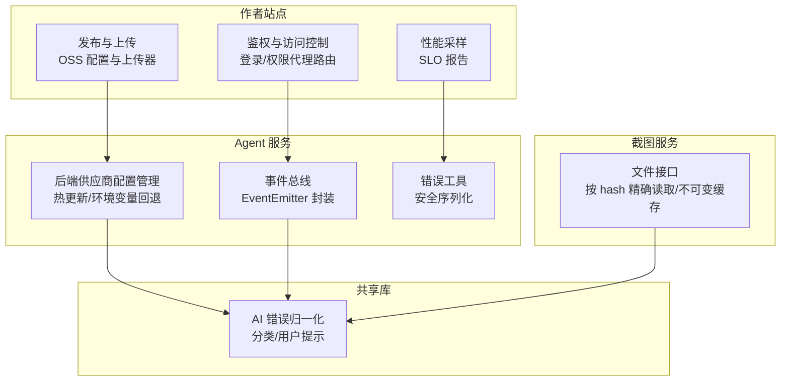
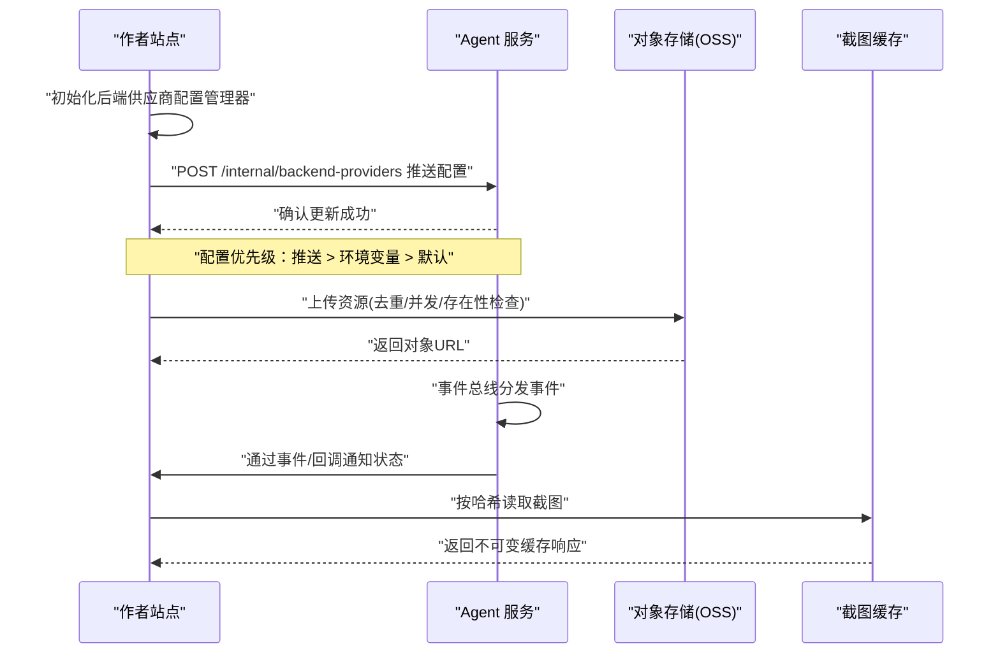
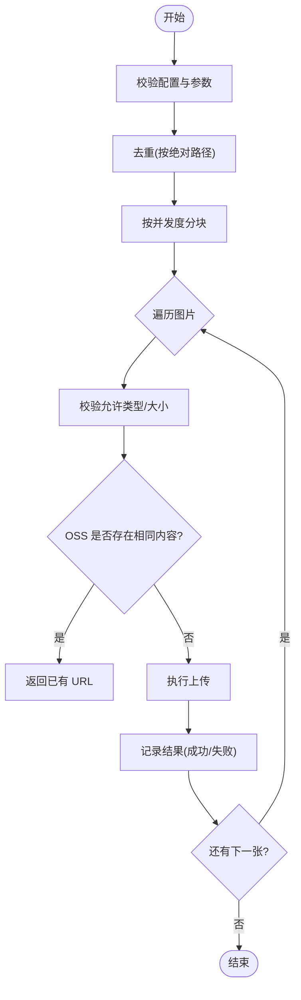
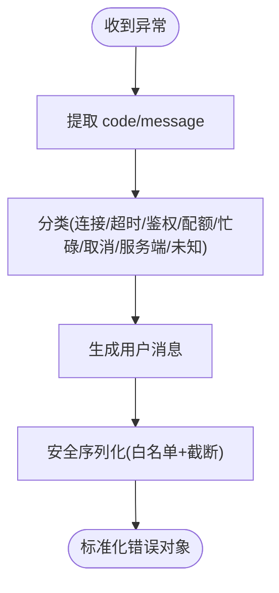
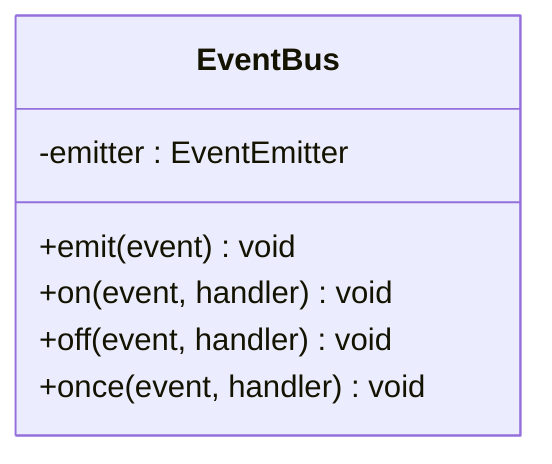
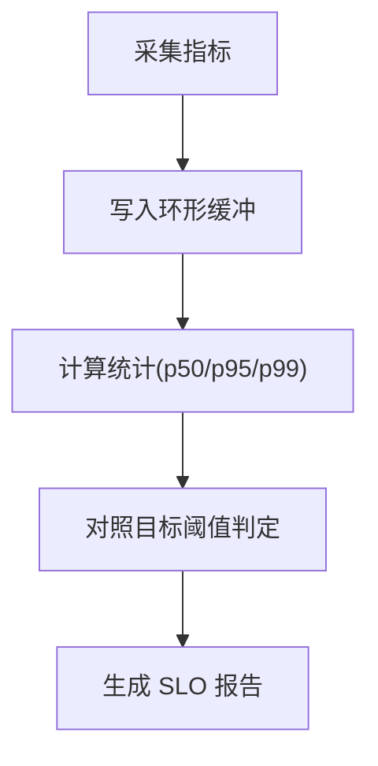
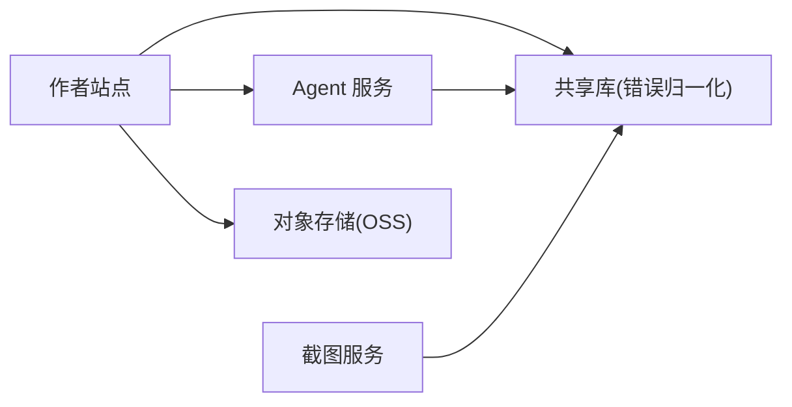

# 第三方系统集成

<cite>
**本文引用的文件**
- [package.json](file://package.json)
- [oss-config.ts](file://packages/author-site/src/lib/publish/oss-config.ts)
- [oss-uploader.ts](file://packages/author-site/src/lib/publish/oss-uploader.ts)
- [backend-providers.ts](file://packages/agent-service/src/config/backend-providers.ts)
- [ai-error-normalizer.ts](file://packages/shared/src/ai-error-normalizer.ts)
- [error-utils.ts](file://packages/agent-service/src/utils/error-utils.ts)
- [event-bus.ts](file://packages/agent-service/src/events/event-bus.ts)
- [workspace-performance-sampling.ts](file://packages/author-site/src/lib/workspace-performance-sampling.ts)
- [route.ts（鉴权中间件）](file://packages/author-site/src/app/api/auth/login/route.test.ts)
- [route.ts（工作区权限代理）](file://packages/author-site/src/app/api/workspace-authority/[projectId]/[workspaceId]/[...segments]/route.ts)
- [oss-config.test.ts](file://packages/author-site/src/lib/publish/__tests__/oss-config.test.ts)
- [screenshot-routes.test.ts](file://packages/screenshot-service/tests/screenshots-routes.test.ts)
- [07_运行进度与事件日志.md](file://docs/项目文档/创作端/05-AI对话/技术/07_运行进度与事件日志.md)
- [AI对话与Agent-模型无限思考导致harness卡死.md](file://docs/plans/进行中/AI对话与Agent-模型无限思考导致harness卡死.md)
</cite>

## 目录
1. [简介](#简介)
2. [项目结构](#项目结构)
3. [核心组件](#核心组件)
4. [架构总览](#架构总览)
5. [详细组件分析](#详细组件分析)
6. [依赖关系分析](#依赖关系分析)
7. [性能考虑](#性能考虑)
8. [故障排查指南](#故障排查指南)
9. [结论](#结论)
10. [附录](#附录)

## 简介
本指南面向第三方系统集成，聚焦以下目标：
- GitHub 集成方案：仓库同步、分支管理、PR 自动化（概念性说明）
- 云服务对接模式：存储适配层、认证授权、数据同步机制
- 自定义存储适配器开发：文件系统抽象、对象存储接口、缓存策略
- 外部 API 集成最佳实践：请求重试、错误处理、性能监控
- 实际集成示例：Webhook 处理、事件驱动架构、批量数据处理
- 安全、配置管理与故障恢复策略

为便于落地，本文结合仓库中已实现的“云存储上传”“后端供应商配置推送”“错误归一化”“事件总线”“性能采样”等能力，给出可复用的集成范式与参考实现路径。

## 项目结构
本项目采用多包 monorepo 组织，关键与集成相关的模块分布如下：
- author-site：提供发布与存储上传能力、鉴权路由与工作区权限代理
- agent-service：提供 AI 后端供应商配置管理、事件总线、错误工具
- shared：提供跨服务共享的错误归一化工具
- screenshot-service：截图服务，演示不可变缓存与按哈希读取
- docs：包含运行进度与事件日志、计划与风险说明



图表来源
- [oss-config.ts:1-35](file://packages/author-site/src/lib/publish/oss-config.ts#L1-L35)
- [oss-uploader.ts:41-168](file://packages/author-site/src/lib/publish/oss-uploader.ts#L41-L168)
- [backend-providers.ts:1-188](file://packages/agent-service/src/config/backend-providers.ts#L1-L188)
- [event-bus.ts:1-38](file://packages/agent-service/src/events/event-bus.ts#L1-L38)
- [ai-error-normalizer.ts:1-157](file://packages/shared/src/ai-error-normalizer.ts#L1-L157)
- [workspace-performance-sampling.ts:201-279](file://packages/author-site/src/lib/workspace-performance-sampling.ts#L201-L279)
- [screenshot-routes.test.ts:617-652](file://packages/screenshot-service/tests/screenshots-routes.test.ts#L617-L652)

章节来源
- [package.json:1-101](file://package.json#L1-L101)

## 核心组件
- 云存储适配层（OSS）
  - 配置校验与环境变量注入
  - 去重、分块并发上传、存在性探测与 URL 生成
  - 典型用法参见：[oss-config.ts:1-35](file://packages/author-site/src/lib/publish/oss-config.ts#L1-L35)、[oss-uploader.ts:41-168](file://packages/author-site/src/lib/publish/oss-uploader.ts#L41-L168)
- 后端供应商配置管理
  - 启动时从环境变量加载，运行时接收 author-site 推送的热更新
  - 典型用法参见：[backend-providers.ts:1-188](file://packages/agent-service/src/config/backend-providers.ts#L1-L188)
- 错误归一化与安全序列化
  - 将不同来源的异常统一为结构化错误，并输出友好用户提示
  - 仅保留安全字段，避免敏感信息泄露
  - 典型用法参见：[ai-error-normalizer.ts:1-157](file://packages/shared/src/ai-error-normalizer.ts#L1-L157)、[error-utils.ts:1-60](file://packages/agent-service/src/utils/error-utils.ts#L1-L60)
- 事件总线
  - 基于 EventEmitter 的轻量事件分发，支持 on/off/once/emit
  - 典型用法参见：[event-bus.ts:1-38](file://packages/agent-service/src/events/event-bus.ts#L1-L38)
- 性能采样与 SLO
  - 采集队列等待、提交延迟、远程更新延迟等指标，生成 SLO 报告
  - 典型用法参见：[workspace-performance-sampling.ts:201-279](file://packages/author-site/src/lib/workspace-performance-sampling.ts#L201-L279)
- 截图服务不可变缓存
  - 按内容哈希精确读取，返回不可变缓存头
  - 典型用法参见：[screenshot-routes.test.ts:617-652](file://packages/screenshot-service/tests/screenshots-routes.test.ts#L617-L652)

章节来源
- [oss-config.ts:1-35](file://packages/author-site/src/lib/publish/oss-config.ts#L1-L35)
- [oss-uploader.ts:41-168](file://packages/author-site/src/lib/publish/oss-uploader.ts#L41-L168)
- [backend-providers.ts:1-188](file://packages/agent-service/src/config/backend-providers.ts#L1-L188)
- [ai-error-normalizer.ts:1-157](file://packages/shared/src/ai-error-normalizer.ts#L1-L157)
- [error-utils.ts:1-60](file://packages/agent-service/src/utils/error-utils.ts#L1-L60)
- [event-bus.ts:1-38](file://packages/agent-service/src/events/event-bus.ts#L1-L38)
- [workspace-performance-sampling.ts:201-279](file://packages/author-site/src/lib/workspace-performance-sampling.ts#L201-L279)
- [screenshot-routes.test.ts:617-652](file://packages/screenshot-service/tests/screenshots-routes.test.ts#L617-L652)

## 架构总览
下图展示作者站点与 Agent 服务之间的配置同步、错误处理与事件流转关系，以及截图服务的缓存策略。



图表来源
- [backend-providers.ts:1-188](file://packages/agent-service/src/config/backend-providers.ts#L1-L188)
- [oss-uploader.ts:41-168](file://packages/author-site/src/lib/publish/oss-uploader.ts#L41-L168)
- [event-bus.ts:1-38](file://packages/agent-service/src/events/event-bus.ts#L1-L38)
- [screenshot-routes.test.ts:617-652](file://packages/screenshot-service/tests/screenshots-routes.test.ts#L617-L652)

## 详细组件分析

### 云存储适配层（OSS）
- 配置校验
  - 必填项：region、accessKeyId、accessKeySecret、bucket；可选：endpoint、pathPrefix
  - 缺失必填项抛出明确错误码，便于上层快速定位
  - 参考：[oss-config.ts:1-35](file://packages/author-site/src/lib/publish/oss-config.ts#L1-L35)、[oss-config.test.ts:41-67](file://packages/author-site/src/lib/publish/__tests__/oss-config.test.ts#L41-L67)
- 上传流程
  - 去重：基于绝对路径去重，减少重复上传
  - 并发：按并发度分块并行上传，提升吞吐
  - 存在性检查：先 head 判断是否已存在，命中则直接复用 URL
  - 命名策略：以内容 MD5 作为 key 前缀，保证幂等与去重
  - 参考：[oss-uploader.ts:41-168](file://packages/author-site/src/lib/publish/oss-uploader.ts#L41-L168)



图表来源
- [oss-uploader.ts:41-168](file://packages/author-site/src/lib/publish/oss-uploader.ts#L41-L168)

章节来源
- [oss-config.ts:1-35](file://packages/author-site/src/lib/publish/oss-config.ts#L1-L35)
- [oss-config.test.ts:41-67](file://packages/author-site/src/lib/publish/__tests__/oss-config.test.ts#L41-L67)
- [oss-uploader.ts:41-168](file://packages/author-site/src/lib/publish/oss-uploader.ts#L41-L168)

### 后端供应商配置管理（Agent 服务）
- 数据源优先级
  - 运行时最高优先级：author-site 推送的最新配置
  - 启动 fallback：环境变量 PI_AGENT_PROVIDERS JSON
  - 硬编码默认（极简场景）
- 热更新
  - setConfig 在运行时替换内存配置，不影响已运行 agent 的当前选择，但新选择会生效
- 激活模型解析
  - activeModelId 优先使用配置中的值，否则回退到 provider 的 defaultModel 或 models[0]

```mermaid
classDiagram
class BackendProvidersManager {
-config : BackendProvidersConfig
-loaded : boolean
+initialize() void
+setConfig(config) void
+getConfig() BackendProvidersConfig
+getProvider(id) BackendProvider
+getActiveProviderId() string
+getActiveModelId() string
+getProviderModels(providerId) {id,label}[]
}
```

图表来源
- [backend-providers.ts:1-188](file://packages/agent-service/src/config/backend-providers.ts#L1-L188)

章节来源
- [backend-providers.ts:1-188](file://packages/agent-service/src/config/backend-providers.ts#L1-L188)

### 错误处理与归一化
- 错误分类
  - 连接/超时/鉴权/配额/忙碌/取消/服务端/未知
  - 根据 code 与 message 进行模糊匹配归类
- 用户消息
  - 针对每类错误提供中文友好提示，便于前端直接展示
- 安全序列化
  - 仅复制白名单字段，截断超长字符串，避免敏感信息泄露



图表来源
- [ai-error-normalizer.ts:1-157](file://packages/shared/src/ai-error-normalizer.ts#L1-L157)
- [error-utils.ts:1-60](file://packages/agent-service/src/utils/error-utils.ts#L1-L60)

章节来源
- [ai-error-normalizer.ts:1-157](file://packages/shared/src/ai-error-normalizer.ts#L1-L157)
- [error-utils.ts:1-60](file://packages/agent-service/src/utils/error-utils.ts#L1-L60)

### 事件驱动架构（事件总线）
- 职责
  - 提供 on/off/once/emit 的基础事件分发能力
  - 全局单例，供各子系统订阅与发布事件
- 适用场景
  - Webhook 处理器注册事件监听
  - 后台任务完成广播
  - 跨进程边界的事件桥接（配合 HTTP/WebSocket）



图表来源
- [event-bus.ts:1-38](file://packages/agent-service/src/events/event-bus.ts#L1-L38)

章节来源
- [event-bus.ts:1-38](file://packages/agent-service/src/events/event-bus.ts#L1-L38)

### 性能监控与 SLO
- 指标采集
  - 队列等待、提交延迟、远程更新延迟、草稿预览延迟、投影延迟、重连收敛时间、canonical 物化延迟
- SLO 报告
  - 计算 p50/p95/p99/min/max，按目标阈值判定是否达标
- 用途
  - 用于集成链路的质量观测与告警



图表来源
- [workspace-performance-sampling.ts:201-279](file://packages/author-site/src/lib/workspace-performance-sampling.ts#L201-L279)

章节来源
- [workspace-performance-sampling.ts:201-279](file://packages/author-site/src/lib/workspace-performance-sampling.ts#L201-L279)

### 截图服务不可变缓存
- 行为
  - 按内容哈希精确读取，返回不可变缓存头，利于 CDN 缓存
- 价值
  - 降低重复渲染成本，提高读取性能

章节来源
- [screenshot-routes.test.ts:617-652](file://packages/screenshot-service/tests/screenshots-routes.test.ts#L617-L652)

### 鉴权与访问控制（路由守卫）
- 登录态验证
  - 从 Cookie 提取 Token，验证签名与有效期，未登录则重定向
- 受保护路由
  - 对特定工作区权限代理路由进行白名单校验与参数解析
- 参考
  - 登录测试用例体现响应结构与 JSON 解析逻辑
  - 工作区权限代理路由体现 endpoint 白名单与 sessionId 解析

章节来源
- [route.ts（鉴权中间件）:1-38](file://packages/author-site/src/app/api/auth/login/route.test.ts#L1-L38)
- [route.ts（工作区权限代理）:28-47](file://packages/author-site/src/app/api/workspace-authority/[projectId]/[workspaceId]/[...segments]/route.ts#L28-L47)

## 依赖关系分析
- 耦合与内聚
  - author-site 与 agent-service 通过内部 API 解耦配置同步
  - shared 提供跨服务一致的错误语义
  - 截图服务独立于业务主流程，专注渲染产物缓存
- 外部依赖
  - 对象存储服务（如阿里云 OSS）
  - 企业身份提供方（如钉钉）
  - 模型供应商（通过后端供应商配置管理）



图表来源
- [backend-providers.ts:1-188](file://packages/agent-service/src/config/backend-providers.ts#L1-L188)
- [ai-error-normalizer.ts:1-157](file://packages/shared/src/ai-error-normalizer.ts#L1-L157)
- [oss-uploader.ts:41-168](file://packages/author-site/src/lib/publish/oss-uploader.ts#L41-L168)

章节来源
- [package.json:1-101](file://package.json#L1-L101)

## 性能考虑
- 上传优化
  - 去重与存在性检查避免重复网络 IO
  - 分块并发提升吞吐，注意限制并发度以避免压垮下游
- 缓存策略
  - 截图服务使用不可变缓存头，CDN 友好
- 监控与 SLO
  - 通过性能采样器持续观测关键路径延迟，及时预警

## 故障排查指南
- 常见错误分类与用户提示
  - 连接/超时/鉴权/配额/忙碌/取消/服务端/未知
  - 使用错误归一化工具统一处理，避免前端重复判断
- 安全日志
  - 仅记录白名单字段，防止敏感信息泄露
- 运行状态与心跳
  - 长时间无进展时，应结合心跳与显式超时策略，避免假死
- 参考
  - 错误归一化与用户提示：[ai-error-normalizer.ts:1-157](file://packages/shared/src/ai-error-normalizer.ts#L1-L157)
  - 安全序列化：[error-utils.ts:1-60](file://packages/agent-service/src/utils/error-utils.ts#L1-L60)
  - 运行进度与事件日志说明：[07_运行进度与事件日志.md:36-45](file://docs/项目文档/创作端/05-AI对话/技术/07_运行进度与事件日志.md#L36-L45)
  - 长任务卡死风险与待办：[AI对话与Agent-模型无限思考导致harness卡死.md:98-115](file://docs/plans/进行中/AI对话与Agent-模型无限思考导致harness卡死.md#L98-L115)

章节来源
- [ai-error-normalizer.ts:1-157](file://packages/shared/src/ai-error-normalizer.ts#L1-L157)
- [error-utils.ts:1-60](file://packages/agent-service/src/utils/error-utils.ts#L1-L60)
- [07_运行进度与事件日志.md:36-45](file://docs/项目文档/创作端/05-AI对话/技术/07_运行进度与事件日志.md#L36-L45)
- [AI对话与Agent-模型无限思考导致harness卡死.md:98-115](file://docs/plans/进行中/AI对话与Agent-模型无限思考导致harness卡死.md#L98-L115)

## 结论
- 通过“配置推送 + 环境变量回退”的模式，实现了跨服务配置热更新与高可用
- 借助“错误归一化 + 安全序列化”，对外暴露一致的错误语义与安全的日志
- “事件总线 + 性能采样”为复杂集成提供了可扩展的异步编排与质量保障
- “对象存储适配层”具备幂等、去重与并发能力，可作为通用存储接入模板

## 附录

### GitHub 集成方案（概念性）
- 仓库同步
  - 拉取远端变更至本地工作区，合并冲突后落盘
  - 建议引入增量同步与差异检测，减少带宽与 I/O
- 分支管理
  - 维护 feature/release/hotfix 分支策略，自动创建与清理临时分支
- PR 自动化
  - 触发 CI 构建与测试，通过后自动合入主干
  - 使用 Webhook 监听 push/merge 事件，驱动流水线

[本节为概念性说明，不直接分析具体代码文件]

### 云服务对接模式（概念性）
- 存储适配层
  - 定义统一的 Put/Get/Head/Delete/List 接口
  - 针对不同厂商（OSS/S3/COS）实现具体适配器
- 认证授权
  - 集中管理密钥与令牌，支持轮换与最小权限原则
- 数据同步机制
  - 基于事件或轮询的增量同步，确保最终一致性

[本节为概念性说明，不直接分析具体代码文件]

### 自定义存储适配器开发（概念性）
- 文件系统抽象
  - 统一路径、元数据、权限模型
- 对象存储接口
  - 实现分块上传、断点续传、并发下载
- 缓存策略
  - 本地 LRU 缓存 + 远端不可变缓存头，兼顾性能与一致性

[本节为概念性说明，不直接分析具体代码文件]

### 外部 API 集成最佳实践（概念性）
- 请求重试
  - 指数退避 + 抖动，区分可重试与不可重试错误
- 错误处理
  - 统一错误归一化，记录安全上下文，避免泄露敏感信息
- 性能监控
  - 埋点耗时、成功率、错误率，设置 SLO 与告警

[本节为概念性说明，不直接分析具体代码文件]

### 实际集成示例（概念性）
- Webhook 处理
  - 验签、幂等、限流、异步处理
- 事件驱动架构
  - 生产者-消费者模型，持久化事件日志
- 批量数据处理
  - 分片批处理、失败重试、补偿任务

[本节为概念性说明，不直接分析具体代码文件]

### 安全、配置管理与故障恢复（概念性）
- 安全
  - 密钥加密存储、最小权限、审计日志
- 配置管理
  - 分层配置（环境/实例/租户），灰度与回滚
- 故障恢复
  - 熔断、降级、隔离、自愈

[本节为概念性说明，不直接分析具体代码文件]