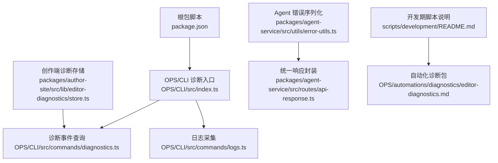
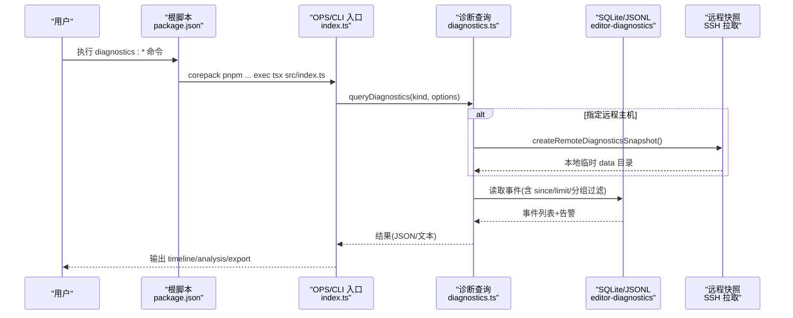
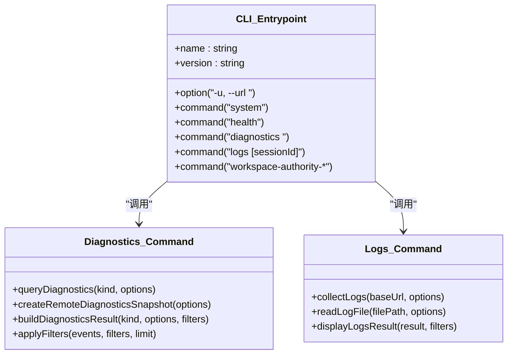
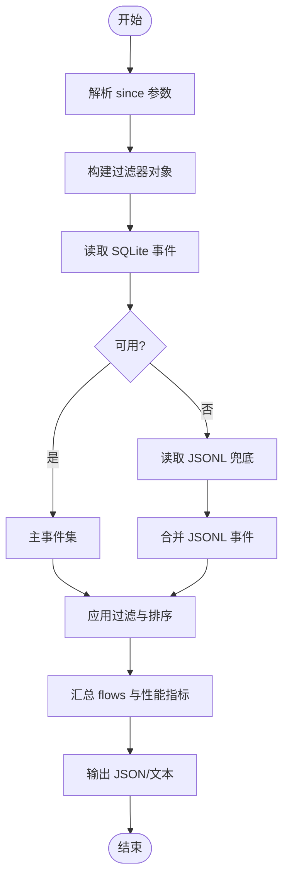
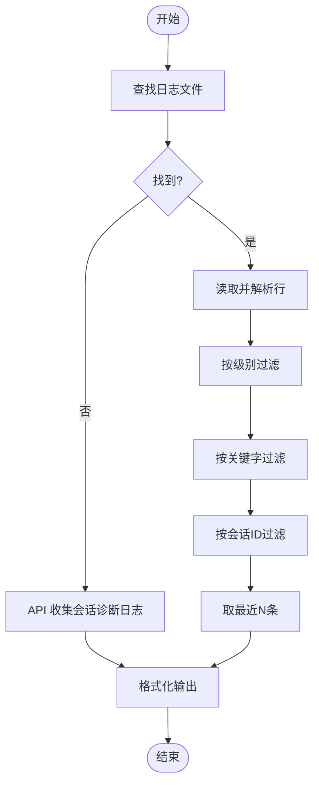
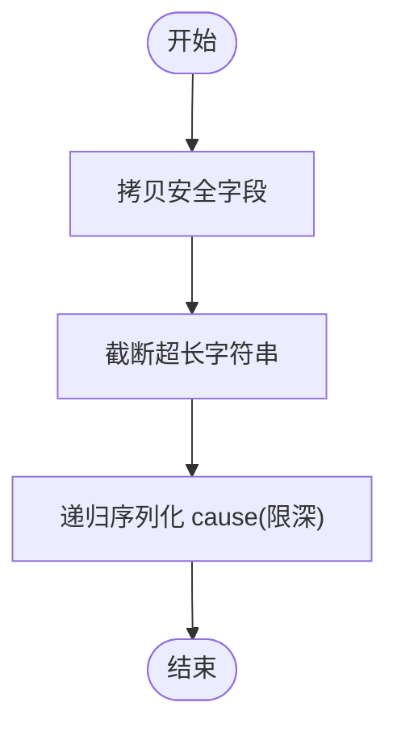
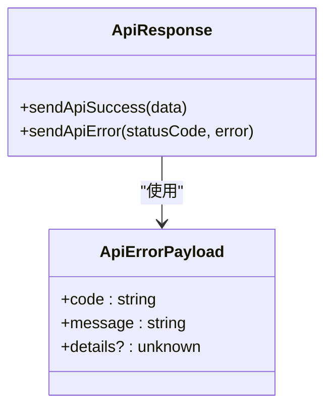
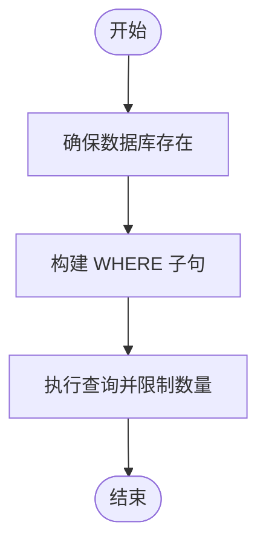
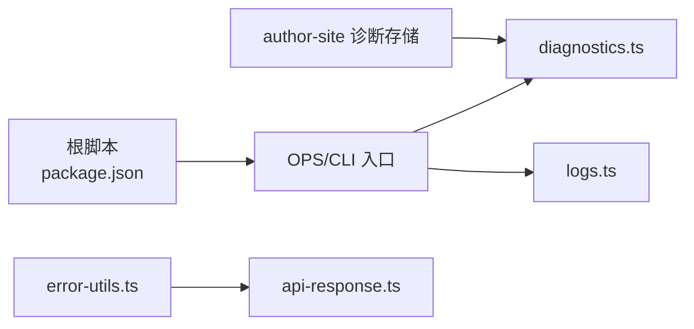

# 系统化调试技能

<cite>
**本文引用的文件**   
- [package.json](file://package.json)
- [AGENTS.md](file://AGENTS.md)
- [OPS/CLI/src/index.ts](file://OPS/CLI/src/index.ts)
- [OPS/CLI/src/commands/diagnostics.ts](file://OPS/CLI/src/commands/diagnostics.ts)
- [OPS/CLI/src/commands/logs.ts](file://OPS/CLI/src/commands/logs.ts)
- [packages/agent-service/src/utils/error-utils.ts](file://packages/agent-service/src/utils/error-utils.ts)
- [packages/agent-service/src/routes/api-response.ts](file://packages/agent-service/src/routes/api-response.ts)
- [packages/author-site/src/lib/editor-diagnostics/store.ts](file://packages/author-site/src/lib/editor-diagnostics/store.ts)
- [scripts/development/README.md](file://scripts/development/README.md)
- [OPS/automations/diagnostics/editor-diagnostics.md](file://OPS/automations/diagnostics/editor-diagnostics.md)
</cite>

## 目录
1. [引言](#引言)
2. [项目结构](#项目结构)
3. [核心组件](#核心组件)
4. [架构总览](#架构总览)
5. [详细组件分析](#详细组件分析)
6. [依赖关系分析](#依赖关系分析)
7. [性能与稳定性考量](#性能与稳定性考量)
8. [故障排查指南](#故障排查指南)
9. [结论](#结论)
10. [附录](#附录)

## 引言
本文件面向“系统化调试”目标，围绕 workbench 仓库中的诊断 CLI、创作端诊断事件、日志采集、错误序列化与开发期脚本，提供一套可复用的排障方法论与操作路径。文档以“先建立时间线、再定位根因、最后验证修复”为主线，结合仓库内既有命令与工具，帮助读者快速从现象到证据再到结论。

## 项目结构
workbench 采用 monorepo 组织，调试相关能力主要分布在：
- 根级脚本与命令入口（pnpm scripts）
- OPS/CLI 诊断命令行工具
- 创作端诊断事件写入与查询（SQLite + JSONL 兜底）
- Agent 服务错误序列化与统一响应封装
- 开发期诊断与回归脚本

图示来源
- [package.json:1-104](file://package.json#L1-L104)
- [OPS/CLI/src/index.ts:1-374](file://OPS/CLI/src/index.ts#L1-L374)
- [OPS/CLI/src/commands/diagnostics.ts:308-766](file://OPS/CLI/src/commands/diagnostics.ts#L308-L766)
- [OPS/CLI/src/commands/logs.ts:46-263](file://OPS/CLI/src/commands/logs.ts#L46-L263)
- [packages/author-site/src/lib/editor-diagnostics/store.ts:394-433](file://packages/author-site/src/lib/editor-diagnostics/store.ts#L394-L433)
- [packages/agent-service/src/utils/error-utils.ts:1-60](file://packages/agent-service/src/utils/error-utils.ts#L1-L60)
- [packages/agent-service/src/routes/api-response.ts:1-25](file://packages/agent-service/src/routes/api-response.ts#L1-L25)
- [scripts/development/README.md:1-264](file://scripts/development/README.md#L1-L264)
- [OPS/automations/diagnostics/editor-diagnostics.md:1-109](file://OPS/automations/diagnostics/editor-diagnostics.md#L1-L109)

章节来源
- [package.json:1-104](file://package.json#L1-L104)
- [AGENTS.md:1-403](file://AGENTS.md#L1-L403)

## 核心组件
- 诊断 CLI 入口与子命令注册：集中定义 system、health、diagnostics、logs、workspace-authority-* 等命令，支持 --json 输出与远程数据快照拉取。
- 诊断事件查询：基于 SQLite 优先、JSONL 兜底的事件库，支持按 project/session/workspace/editorSession/trace/operation/since 过滤，并聚合 workspace revision flows 与性能分位统计。
- 日志采集：本地文件扫描与 API 会话诊断双通道，支持级别过滤、关键字搜索与会话 ID 过滤。
- 错误序列化与安全脱敏：仅拷贝安全字段、限制字符串长度、递归序列化 cause，避免敏感信息泄露。
- 统一响应封装：success/data 与 success=false/error 的标准化返回结构。
- 创作端诊断存储：前端侧将结构化事件持久化至 SQLite，并提供带条件查询的读取接口。
- 开发期脚本：协同状态抖动检测、画布性能基线测量、知识库验证套件、AI 工作区刷新验证等。

章节来源
- [OPS/CLI/src/index.ts:1-374](file://OPS/CLI/src/index.ts#L1-L374)
- [OPS/CLI/src/commands/diagnostics.ts:308-766](file://OPS/CLI/src/commands/diagnostics.ts#L308-L766)
- [OPS/CLI/src/commands/logs.ts:46-263](file://OPS/CLI/src/commands/logs.ts#L46-L263)
- [packages/agent-service/src/utils/error-utils.ts:1-60](file://packages/agent-service/src/utils/error-utils.ts#L1-L60)
- [packages/agent-service/src/routes/api-response.ts:1-25](file://packages/agent-service/src/routes/api-response.ts#L1-L25)
- [packages/author-site/src/lib/editor-diagnostics/store.ts:394-433](file://packages/author-site/src/lib/editor-diagnostics/store.ts#L394-L433)
- [scripts/development/README.md:1-264](file://scripts/development/README.md#L1-L264)

## 架构总览
下图展示“创作端问题诊断”的典型端到端流程：用户通过根脚本调用 OPS/CLI，CLI 根据 kind 构建过滤器，优先从 SQLite 读取事件，必要时合并 JSONL 兜底；同时可拉取远程 data 目录只读快照进行离线分析。

图示来源
- [package.json:53-61](file://package.json#L53-L61)
- [OPS/CLI/src/index.ts:231-254](file://OPS/CLI/src/index.ts#L231-L254)
- [OPS/CLI/src/commands/diagnostics.ts:768-824](file://OPS/CLI/src/commands/diagnostics.ts#L768-L824)
- [OPS/CLI/src/commands/diagnostics.ts:260-307](file://OPS/CLI/src/commands/diagnostics.ts#L260-L307)

## 详细组件分析

### 诊断 CLI 子系统
- 职责：统一暴露系统检查、健康检查、HTTP/WebSocket 测试、会话管理、日志采集、诊断事件查询、Workspace Authority 状态与修复命令。
- 关键特性：
  - 支持 --json 模式便于程序化解析。
  - diagnostics 子命令支持多种 kind（recent/project/session/trace/operation/autosave/collab/preview/export），并可按 project/session/workspace/editorSession/trace/operation/since 过滤。
  - 支持远程 SSH 拉取只读诊断快照，便于线上环境离线复盘。
  - 文本输出包含 timeline 与 performance 分位摘要，便于快速判断延迟异常。

图示来源
- [OPS/CLI/src/index.ts:1-374](file://OPS/CLI/src/index.ts#L1-L374)
- [OPS/CLI/src/commands/diagnostics.ts:308-766](file://OPS/CLI/src/commands/diagnostics.ts#L308-L766)
- [OPS/CLI/src/commands/logs.ts:46-263](file://OPS/CLI/src/commands/logs.ts#L46-L263)

章节来源
- [OPS/CLI/src/index.ts:1-374](file://OPS/CLI/src/index.ts#L1-L374)
- [OPS/CLI/src/commands/diagnostics.ts:308-766](file://OPS/CLI/src/commands/diagnostics.ts#L308-L766)
- [OPS/CLI/src/commands/logs.ts:46-263](file://OPS/CLI/src/commands/logs.ts#L46-L263)

### 诊断事件查询与过滤
- 数据源优先级：SQLite 优先，不可用时降级为 JSONL 兜底，并在结果中明确标记 warnings。
- 过滤维度：project/sessionId/workspaceId/editorSessionId/traceId/operationId/eventType/group/since，以及 limit。
- 输出增强：除事件外，附带 workspaceFlows（revision 链路）、performance.metrics（p50/p95/p99/max）。

图示来源
- [OPS/CLI/src/commands/diagnostics.ts:308-331](file://OPS/CLI/src/commands/diagnostics.ts#L308-L331)
- [OPS/CLI/src/commands/diagnostics.ts:475-494](file://OPS/CLI/src/commands/diagnostics.ts#L475-L494)
- [OPS/CLI/src/commands/diagnostics.ts:639-666](file://OPS/CLI/src/commands/diagnostics.ts#L639-L666)

章节来源
- [OPS/CLI/src/commands/diagnostics.ts:308-766](file://OPS/CLI/src/commands/diagnostics.ts#L308-L766)

### 日志采集与过滤
- 本地文件扫描：在常见路径下寻找 agent-service.log 或 latest.log，按行解析 JSON，支持 level/pattern/sessionId 过滤。
- API 会话诊断：当本地无日志时，可通过 API 收集会话诊断日志，统一格式化输出。
- 输出：显示来源、总行数、筛选后行数，并按级别着色打印最近 N 条。

图示来源
- [OPS/CLI/src/commands/logs.ts:61-129](file://OPS/CLI/src/commands/logs.ts#L61-L129)
- [OPS/CLI/src/commands/logs.ts:131-223](file://OPS/CLI/src/commands/logs.ts#L131-L223)
- [OPS/CLI/src/commands/logs.ts:225-263](file://OPS/CLI/src/commands/logs.ts#L225-L263)

章节来源
- [OPS/CLI/src/commands/logs.ts:46-263](file://OPS/CLI/src/commands/logs.ts#L46-L263)

### 错误序列化与安全脱敏
- 策略：仅拷贝白名单字段（如 name/message/code/status/type/errno/syscall/path/url/method），对字符串做最大长度截断，递归序列化 cause 但限制深度。
- 目的：避免堆栈或敏感信息泄露，控制日志体积，提升可读性。

图示来源
- [packages/agent-service/src/utils/error-utils.ts:1-60](file://packages/agent-service/src/utils/error-utils.ts#L1-L60)

章节来源
- [packages/agent-service/src/utils/error-utils.ts:1-60](file://packages/agent-service/src/utils/error-utils.ts#L1-L60)

### 统一响应封装
- 成功：{ success: true, data: T }
- 失败：{ success: false, error: { code, message, details? } }
- 作用：前后端一致的错误语义，便于客户端统一处理与上报。

图示来源
- [packages/agent-service/src/routes/api-response.ts:1-25](file://packages/agent-service/src/routes/api-response.ts#L1-L25)

章节来源
- [packages/agent-service/src/routes/api-response.ts:1-25](file://packages/agent-service/src/routes/api-response.ts#L1-L25)

### 创作端诊断存储与查询
- 存储：SQLite 为主，提供按 projectId/sessionId/workspaceId/editorSessionId/traceId/operationId/eventType/since 的条件查询。
- 用途：支撑 CLI 的诊断查询与导出，作为后续复盘与自动化任务的数据基础。

图示来源
- [packages/author-site/src/lib/editor-diagnostics/store.ts:394-433](file://packages/author-site/src/lib/editor-diagnostics/store.ts#L394-L433)

章节来源
- [packages/author-site/src/lib/editor-diagnostics/store.ts:394-433](file://packages/author-site/src/lib/editor-diagnostics/store.ts#L394-L433)

### 开发期诊断与回归脚本
- 协同状态抖动检测：打开编辑页、采样同步状态、调用 flush 探针、生成报告与截图。
- 画布性能基线：DOM/iframe/Shadow DOM 计数、RAF 帧间隔、heap 使用量对比。
- 知识库验证套件：模板健康检查、实例化、静态指标与可选 AI 评估。
- AI 工作区刷新验证：静态检查提示词与代码，运行 agent-service 单测，摘要 writeFile 工具调用结果。

章节来源
- [scripts/development/README.md:1-264](file://scripts/development/README.md#L1-L264)

## 依赖关系分析
- 根脚本通过 corepack pnpm 分发到各包，OPS/CLI 作为统一入口，内部依赖 diagnostics 与 logs 命令模块。
- 诊断事件由 author-site 写入 SQLite，CLI 读取并可选择 JSONL 兜底；远程场景通过 SSH 拉取只读快照。
- Agent 服务的错误序列化与统一响应被上层路由与中间件消费，保证对外错误语义一致。

图示来源
- [package.json:53-61](file://package.json#L53-L61)
- [OPS/CLI/src/index.ts:1-374](file://OPS/CLI/src/index.ts#L1-L374)
- [OPS/CLI/src/commands/diagnostics.ts:308-766](file://OPS/CLI/src/commands/diagnostics.ts#L308-L766)
- [OPS/CLI/src/commands/logs.ts:46-263](file://OPS/CLI/src/commands/logs.ts#L46-L263)
- [packages/author-site/src/lib/editor-diagnostics/store.ts:394-433](file://packages/author-site/src/lib/editor-diagnostics/store.ts#L394-L433)
- [packages/agent-service/src/utils/error-utils.ts:1-60](file://packages/agent-service/src/utils/error-utils.ts#L1-L60)
- [packages/agent-service/src/routes/api-response.ts:1-25](file://packages/agent-service/src/routes/api-response.ts#L1-L25)

章节来源
- [package.json:1-104](file://package.json#L1-L104)
- [OPS/CLI/src/index.ts:1-374](file://OPS/CLI/src/index.ts#L1-L374)

## 性能与稳定性考量
- 事件查询分页与限制：limit 默认 200，上限 1000，避免一次性加载过多事件导致内存压力。
- 性能指标聚合：按名称统计 count/p50/p95/p99/max，便于识别长尾与峰值异常。
- 日志截取：仅保留最近若干行，降低大日志文件的 IO 与解析成本。
- 远程快照：只读压缩传输，减少线上影响面。

[本节为通用指导，不直接分析具体文件]

## 故障排查指南
- 先建时间线：使用 diagnostics:recent / diagnostics:project 建立最近事件流，关注完整性字段（SQLite 是否可用、JSONL 是否 fallback、是否存在事件缺口与警告）。
- 按现象分组：预览问题看 preview 组；自动保存/复原问题同时查看 autosave、collab、ai 组；协同覆盖问题重点看 collab 组。
- 追溯 revision 链路：观察 workspaceFlows 的 mutation/projection/canonical 阶段与最终 status，确认是否收敛。
- 定位延迟异常：查看 performance.metrics 的分位与最大值，count=0 表示本次查询无样本。
- 降级读取：若 CLI 不可用或输出明确提示缺口，再降级读取 data/editor-diagnostics/*.jsonl，并在结论中声明兜底数据。
- 远程复盘：通过 --remote-host 拉取只读快照，避免在生产环境直接操作数据。

章节来源
- [AGENTS.md:62-82](file://AGENTS.md#L62-L82)
- [OPS/automations/diagnostics/editor-diagnostics.md:1-109](file://OPS/automations/diagnostics/editor-diagnostics.md#L1-L109)
- [OPS/CLI/src/commands/diagnostics.ts:768-824](file://OPS/CLI/src/commands/diagnostics.ts#L768-L824)

## 结论
通过将“诊断事件—日志—错误序列化—统一响应—开发期脚本”串联起来，workbench 提供了从现象到证据再到结论的系统化调试闭环。建议在日常排障中遵循“先时间线、再分组、后链路”的步骤，并结合远程快照与 JSONL 兜底保障复盘质量。

[本节为总结性内容，不直接分析具体文件]

## 附录
- 常用命令速查（来自根脚本）：
  - diagnostics:recent / diagnostics:project / diagnostics:preview / diagnostics:autosave / diagnostics:collab / diagnostics:session / diagnostics:trace / diagnostics:export
  - workspace-authority:* 系列命令用于 Workspace 权限与一致性检查
  - test:e2e* 与 development 脚本用于回归与性能基线

章节来源
- [package.json:53-81](file://package.json#L53-L81)
- [scripts/development/README.md:1-264](file://scripts/development/README.md#L1-L264)