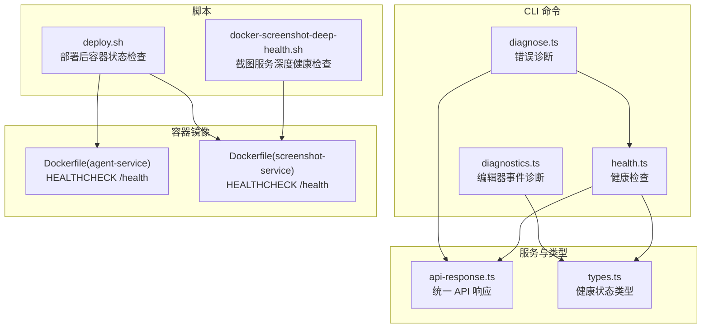
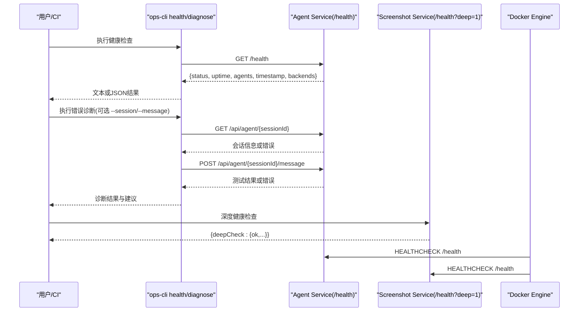
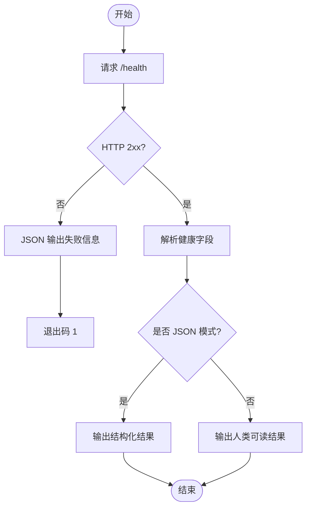
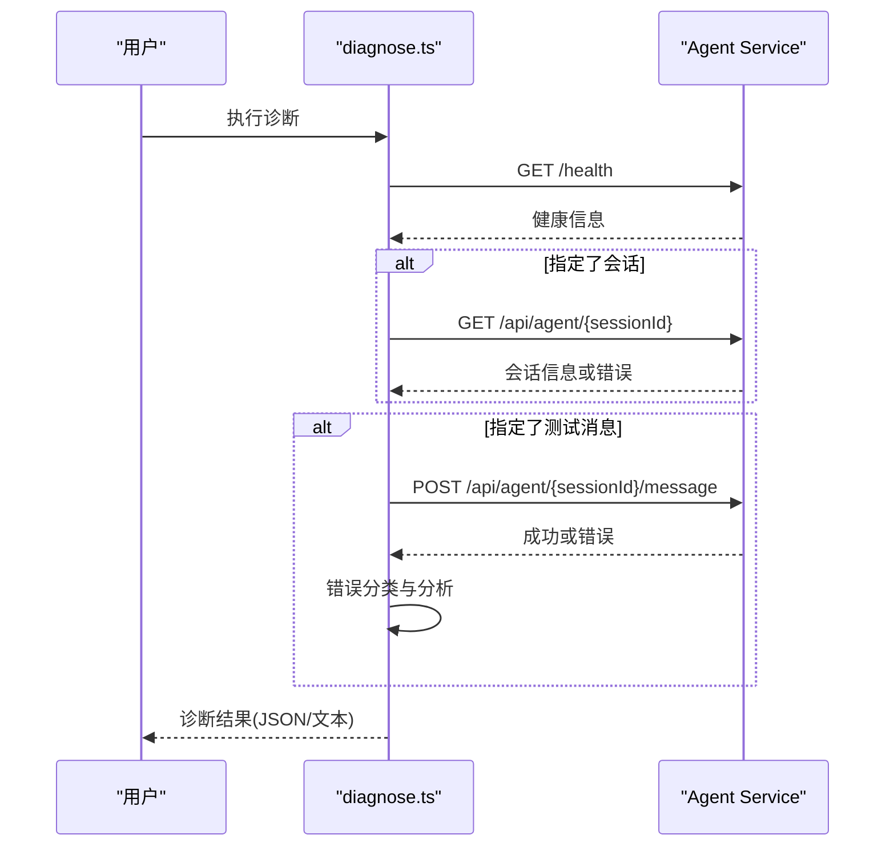
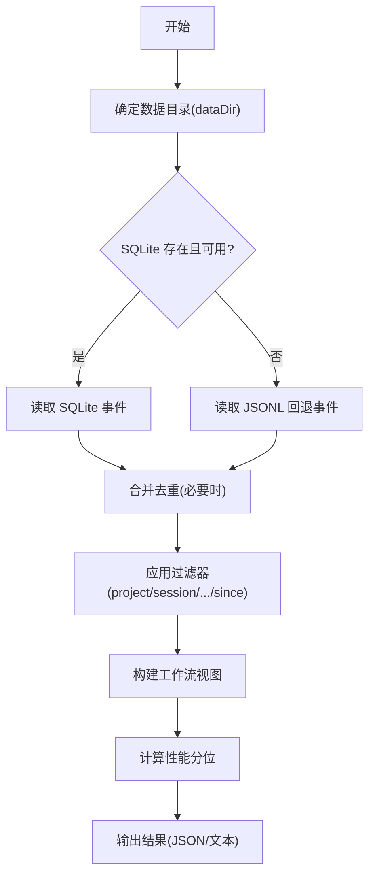
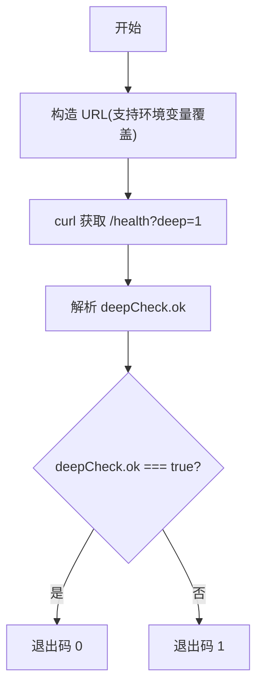
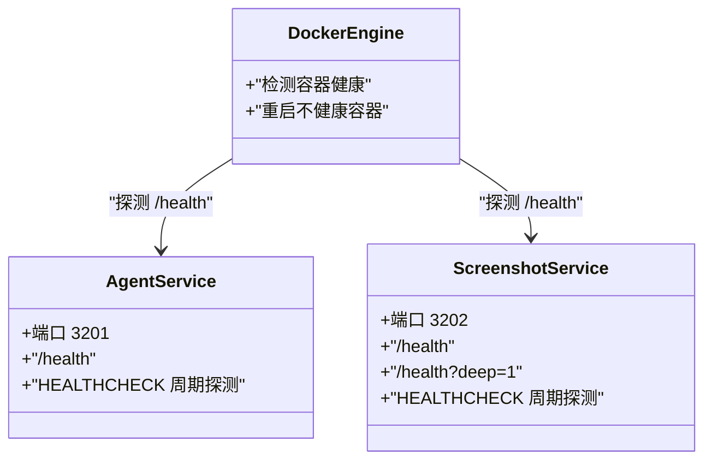
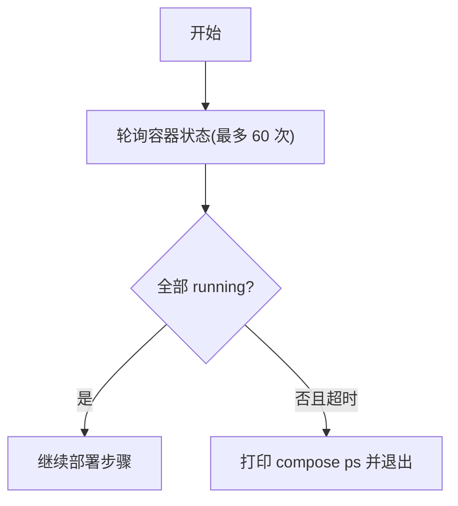
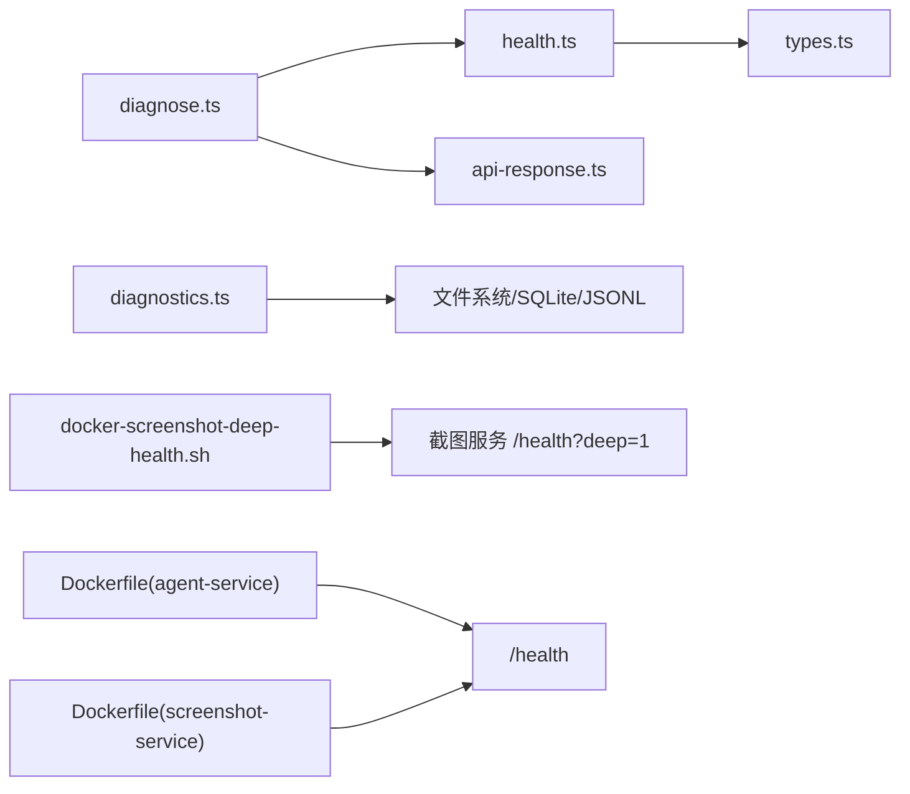

# 健康检查

<cite>
**本文引用的文件**   
- [health.ts](file://OPS/CLI/src/commands/health.ts)
- [diagnose.ts](file://OPS/CLI/src/commands/diagnose.ts)
- [diagnostics.ts](file://OPS/CLI/src/commands/diagnostics.ts)
- [docker-screenshot-deep-health.sh](file://scripts/docker-screenshot-deep-health.sh)
- [Dockerfile (agent-service)](file://docker/agent-service/Dockerfile)
- [Dockerfile (screenshot-service)](file://docker/screenshot-service/Dockerfile)
- [deploy.sh](file://scripts/deploy.sh)
- [types.ts](file://OPS/CLI/src/types.ts)
- [api-response.ts](file://packages/agent-service/src/routes/api-response.ts)
</cite>

## 目录
1. [简介](#简介)
2. [项目结构](#项目结构)
3. [核心组件](#核心组件)
4. [架构总览](#架构总览)
5. [详细组件分析](#详细组件分析)
6. [依赖关系分析](#依赖关系分析)
7. [性能与容量考量](#性能与容量考量)
8. [故障排查指南](#故障排查指南)
9. [结论](#结论)
10. [附录](#附录)

## 简介
本指南面向 Workbench 平台的生产运维与研发人员，系统化说明系统健康检查与自动化诊断能力的使用方法、输出解读与排障流程。内容覆盖：
- 服务状态检查（Agent Service、截图服务等）
- 依赖连通性验证（HTTP 健康端点、会话创建与消息收发）
- 资源使用监控（进程运行态、容器健康检查）
- Docker 容器健康检查配置与深度健康检查流程
- 自动化诊断工具（一键诊断、问题报告生成、修复建议）
- 生产环境监控告警配置与应急响应流程

## 项目结构
围绕健康检查与诊断的关键位置如下：
- CLI 命令层：健康检查、错误诊断、编辑器事件诊断
- 脚本层：截图服务深度健康检查、部署后容器启动校验
- 容器镜像：各服务的 HEALTHCHECK 指令
- 类型与接口：健康状态、API 响应格式等

**图示来源**
- [health.ts:1-90](file://OPS/CLI/src/commands/health.ts#L1-L90)
- [diagnose.ts:1-372](file://OPS/CLI/src/commands/diagnose.ts#L1-L372)
- [diagnostics.ts:1-825](file://OPS/CLI/src/commands/diagnostics.ts#L1-L825)
- [docker-screenshot-deep-health.sh:1-42](file://scripts/docker-screenshot-deep-health.sh#L1-L42)
- [Dockerfile (agent-service):39-42](file://docker/agent-service/Dockerfile#L39-L42)
- [Dockerfile (screenshot-service):50-55](file://docker/screenshot-service/Dockerfile#L50-L55)
- [deploy.sh:643-669](file://scripts/deploy.sh#L643-L669)
- [api-response.ts:1-25](file://packages/agent-service/src/routes/api-response.ts#L1-L25)
- [types.ts](file://OPS/CLI/src/types.ts)

**章节来源**
- [health.ts:1-90](file://OPS/CLI/src/commands/health.ts#L1-L90)
- [diagnose.ts:1-372](file://OPS/CLI/src/commands/diagnose.ts#L1-L372)
- [diagnostics.ts:1-825](file://OPS/CLI/src/commands/diagnostics.ts#L1-L825)
- [docker-screenshot-deep-health.sh:1-42](file://scripts/docker-screenshot-deep-health.sh#L1-L42)
- [Dockerfile (agent-service):39-42](file://docker/agent-service/Dockerfile#L39-L42)
- [Dockerfile (screenshot-service):50-55](file://docker/screenshot-service/Dockerfile#L50-L55)
- [deploy.sh:643-669](file://scripts/deploy.sh#L643-L669)
- [api-response.ts:1-25](file://packages/agent-service/src/routes/api-response.ts#L1-L25)
- [types.ts](file://OPS/CLI/src/types.ts)

## 核心组件
- 健康检查（CLI）
  - 功能：调用 Agent Service 的 /health 端点，解析并输出健康状态、运行时长、活跃 Agent 数量、时间戳与后端引擎列表；支持 JSON 模式输出便于集成。
  - 关键路径：[health.ts:11-90](file://OPS/CLI/src/commands/health.ts#L11-L90)
- 错误诊断（CLI）
  - 功能：在健康检查基础上，可选查询指定会话信息、发送测试消息，并对常见错误进行归因分析与给出修复建议；支持 JSON 模式输出。
  - 关键路径：[diagnose.ts:44-283](file://OPS/CLI/src/commands/diagnose.ts#L44-L283)、[diagnose.ts:285-372](file://OPS/CLI/src/commands/diagnose.ts#L285-L372)
- 编辑器事件诊断（CLI）
  - 功能：从本地或远程数据目录读取 SQLite/JSONL 事件，按项目/会话/工作区/Trace/操作等维度过滤，构建工作流视图与性能分位统计，辅助定位协作、预览、自动保存等问题。
  - 关键路径：[diagnostics.ts:659-707](file://OPS/CLI/src/commands/diagnostics.ts#L659-L707)、[diagnostics.ts:768-825](file://OPS/CLI/src/commands/diagnostics.ts#L768-L825)
- 截图服务深度健康检查（Shell）
  - 功能：调用截图服务 /health?deep=1，解析 deepCheck.ok 字段，用于浏览器内核与渲染链路可用性验证。
  - 关键路径：[docker-screenshot-deep-health.sh:32-41](file://scripts/docker-screenshot-deep-health.sh#L32-L41)
- 容器健康检查（Dockerfile）
  - 功能：为 agent-service 与 screenshot-service 定义 HEALTHCHECK，周期探测 /health 端点，保障编排层可感知服务存活。
  - 关键路径：[Dockerfile (agent-service):39-42](file://docker/agent-service/Dockerfile#L39-L42)、[Dockerfile (screenshot-service):50-55](file://docker/screenshot-service/Dockerfile#L50-L55)
- 部署后容器状态检查（Shell）
  - 功能：部署脚本中轮询容器状态，确保所有目标服务进入 running 后再继续后续步骤。
  - 关键路径：[deploy.sh:643-669](file://scripts/deploy.sh#L643-L669)

**章节来源**
- [health.ts:11-90](file://OPS/CLI/src/commands/health.ts#L11-L90)
- [diagnose.ts:44-283](file://OPS/CLI/src/commands/diagnose.ts#L44-L283)
- [diagnose.ts:285-372](file://OPS/CLI/src/commands/diagnose.ts#L285-L372)
- [diagnostics.ts:659-707](file://OPS/CLI/src/commands/diagnostics.ts#L659-L707)
- [diagnostics.ts:768-825](file://OPS/CLI/src/commands/diagnostics.ts#L768-L825)
- [docker-screenshot-deep-health.sh:32-41](file://scripts/docker-screenshot-deep-health.sh#L32-L41)
- [Dockerfile (agent-service):39-42](file://docker/agent-service/Dockerfile#L39-L42)
- [Dockerfile (screenshot-service):50-55](file://docker/screenshot-service/Dockerfile#L50-L55)
- [deploy.sh:643-669](file://scripts/deploy.sh#L643-L669)

## 架构总览
健康检查与诊断的整体交互如下：

**图示来源**
- [health.ts:11-90](file://OPS/CLI/src/commands/health.ts#L11-L90)
- [diagnose.ts:44-283](file://OPS/CLI/src/commands/diagnose.ts#L44-L283)
- [docker-screenshot-deep-health.sh:32-41](file://scripts/docker-screenshot-deep-health.sh#L32-L41)
- [Dockerfile (agent-service):39-42](file://docker/agent-service/Dockerfile#L39-L42)
- [Dockerfile (screenshot-service):50-55](file://docker/screenshot-service/Dockerfile#L50-L55)

## 详细组件分析

### 健康检查（CLI）
- 行为要点
  - 访问 baseUrl + "/health"，非 2xx 视为不可用；成功则解析 status、uptime、agents、timestamp、backends 等字段。
  - 支持 JSON 模式输出，便于 CI/CD 或监控系统消费。
  - 异常时提供连接失败原因提示与启动建议。
- 输出解读
  - healthy: true/false
  - status/uptime/activeAgents/timestamp/backends: 服务运行时指标
  - httpStatus/error/serviceUrl: 失败时的上下文
- 典型用法
  - 文本模式：直接查看人类可读结果
  - JSON 模式：写入文件或推送至监控系统

**图示来源**
- [health.ts:11-90](file://OPS/CLI/src/commands/health.ts#L11-L90)

**章节来源**
- [health.ts:11-90](file://OPS/CLI/src/commands/health.ts#L11-L90)
- [types.ts](file://OPS/CLI/src/types.ts)

### 错误诊断（CLI）
- 行为要点
  - 先做健康检查，再根据参数选择性地查询会话信息与发送测试消息。
  - 对常见错误进行分类分析，给出可能原因与解决方案。
  - 支持 JSON 模式输出，包含 health/session/testMessage/analysis 四段结果。
- 输出解读
  - health: checked/healthy/status/activeAgents
  - session: checked/exists/status/backend/messageCount/workingDir
  - testMessage: sent/success/duration/error/replyLength
  - analysis: problem/possibleCauses/solutions
- 典型用法
  - 仅健康检查：不传 --session 与 --message
  - 会话级诊断：传入 --session
  - 端到端连通性：传入 --message 触发一次真实消息处理

**图示来源**
- [diagnose.ts:44-283](file://OPS/CLI/src/commands/diagnose.ts#L44-L283)
- [api-response.ts:1-25](file://packages/agent-service/src/routes/api-response.ts#L1-L25)

**章节来源**
- [diagnose.ts:44-283](file://OPS/CLI/src/commands/diagnose.ts#L44-L283)
- [diagnose.ts:285-372](file://OPS/CLI/src/commands/diagnose.ts#L285-L372)
- [api-response.ts:1-25](file://packages/agent-service/src/routes/api-response.ts#L1-L25)

### 编辑器事件诊断（CLI）
- 行为要点
  - 优先从 SQLite 读取事件，若缺失或异常则回退到 JSONL 文件。
  - 支持按 project/session/workspace/editorSession/trace/operation/group/since 过滤，限制返回条数。
  - 构建工作流视图（按 workspaceId:revision 聚合），计算多项延迟的分位统计（如 autosave、commit、projection、canonical lag 等）。
  - 支持远程拉取诊断快照（SSH），适用于生产环境离线分析。
- 输出解读
  - diagnostics: sqliteUsed/jsonlFallbackUsed/dbUnavailable/eventGapDetected/warnings
  - events: 过滤后的事件序列
  - workspaceFlows: 工作流状态与事件链
  - performance: 各项延迟的 count/min/p50/p95/p99/max/average
  - agentRunLogs: 关联的会话日志清单
- 典型用法
  - 最近 24 小时事件：kind=recent
  - 指定 Trace/Operation 追踪：kind=trace 或 kind=operation
  - 导出 JSON 供下游分析：format=json

**图示来源**
- [diagnostics.ts:659-707](file://OPS/CLI/src/commands/diagnostics.ts#L659-L707)
- [diagnostics.ts:768-825](file://OPS/CLI/src/commands/diagnostics.ts#L768-L825)

**章节来源**
- [diagnostics.ts:659-707](file://OPS/CLI/src/commands/diagnostics.ts#L659-L707)
- [diagnostics.ts:768-825](file://OPS/CLI/src/commands/diagnostics.ts#L768-L825)

### 截图服务深度健康检查（Shell）
- 行为要点
  - 默认访问 http://localhost:3202/health?deep=1，可通过环境变量 SCREENSHOT_HEALTH_URL 覆盖。
  - 解析 deepCheck.ok 作为最终判定依据，并以进程退出码反映结果。
- 输出解读
  - 标准输出为完整 JSON 响应；退出码 0 表示通过，非 0 表示失败。
- 典型用法
  - 在 CI 或巡检任务中定期执行，结合容器编排实现自愈。

**图示来源**
- [docker-screenshot-deep-health.sh:32-41](file://scripts/docker-screenshot-deep-health.sh#L32-L41)

**章节来源**
- [docker-screenshot-deep-health.sh:1-42](file://scripts/docker-screenshot-deep-health.sh#L1-L42)

### Docker 容器健康检查配置
- 配置要点
  - agent-service 与 screenshot-service 均定义了 HEALTHCHECK，周期探测各自 /health 端点。
  - 间隔、超时、重试次数可在镜像构建阶段调整。
- 编排建议
  - 配合编排器（如 Docker Compose/Kubernetes）的重启策略，实现快速自愈。
  - 将 /health 暴露给外部监控系统，形成更细粒度的探针。

**图示来源**
- [Dockerfile (agent-service):39-42](file://docker/agent-service/Dockerfile#L39-L42)
- [Dockerfile (screenshot-service):50-55](file://docker/screenshot-service/Dockerfile#L50-L55)

**章节来源**
- [Dockerfile (agent-service):39-42](file://docker/agent-service/Dockerfile#L39-L42)
- [Dockerfile (screenshot-service):50-55](file://docker/screenshot-service/Dockerfile#L50-L55)

### 部署后容器状态检查（Shell）
- 行为要点
  - 部署脚本中循环等待所有目标服务进入 running 状态，超时则打印 compose ps 并退出。
- 典型用法
  - 在发布流水线中作为“就绪”门禁，避免后续步骤在依赖未就绪时执行。

**图示来源**
- [deploy.sh:643-669](file://scripts/deploy.sh#L643-L669)

**章节来源**
- [deploy.sh:643-669](file://scripts/deploy.sh#L643-L669)

## 依赖关系分析
- 组件耦合
  - health.ts 依赖 types.ts 中的健康状态类型与 utils 的输出格式化。
  - diagnose.ts 复用 health.ts 的健康检查逻辑，并扩展会话与消息链路验证。
  - diagnostics.ts 独立于网络服务，主要依赖文件系统与 SQLite/JSONL 事件源。
  - docker-screenshot-deep-health.sh 依赖截图服务 /health?deep=1 的语义约定。
  - Dockerfile 中的 HEALTHCHECK 与服务的 /health 端点强绑定。
- 外部依赖
  - HTTP 客户端（fetch/curl）、SQLite（better-sqlite3）、SSH（ssh/sshpass）等。
- 潜在风险
  - /health 端点变更会导致 CLI 与容器健康检查同时失效，需保持契约稳定。
  - 远程诊断依赖 SSH 可达性与密码注入安全。

**图示来源**
- [health.ts:1-90](file://OPS/CLI/src/commands/health.ts#L1-L90)
- [diagnose.ts:1-372](file://OPS/CLI/src/commands/diagnose.ts#L1-L372)
- [diagnostics.ts:1-825](file://OPS/CLI/src/commands/diagnostics.ts#L1-L825)
- [docker-screenshot-deep-health.sh:1-42](file://scripts/docker-screenshot-deep-health.sh#L1-L42)
- [Dockerfile (agent-service):39-42](file://docker/agent-service/Dockerfile#L39-L42)
- [Dockerfile (screenshot-service):50-55](file://docker/screenshot-service/Dockerfile#L50-L55)
- [api-response.ts:1-25](file://packages/agent-service/src/routes/api-response.ts#L1-L25)
- [types.ts](file://OPS/CLI/src/types.ts)

**章节来源**
- [health.ts:1-90](file://OPS/CLI/src/commands/health.ts#L1-L90)
- [diagnose.ts:1-372](file://OPS/CLI/src/commands/diagnose.ts#L1-L372)
- [diagnostics.ts:1-825](file://OPS/CLI/src/commands/diagnostics.ts#L1-L825)
- [docker-screenshot-deep-health.sh:1-42](file://scripts/docker-screenshot-deep-health.sh#L1-L42)
- [Dockerfile (agent-service):39-42](file://docker/agent-service/Dockerfile#L39-L42)
- [Dockerfile (screenshot-service):50-55](file://docker/screenshot-service/Dockerfile#L50-L55)
- [api-response.ts:1-25](file://packages/agent-service/src/routes/api-response.ts#L1-L25)
- [types.ts](file://OPS/CLI/src/types.ts)

## 性能与容量考量
- 健康检查频率
  - 容器 HEALTHCHECK 默认 30s 间隔，可根据业务负载与恢复时间目标调整。
- 诊断数据规模
  - 编辑器事件诊断默认限制 200 条，可按需提高上限，但需注意磁盘与内存占用。
- 远程诊断开销
  - 远程快照会压缩并传输诊断数据，建议在低峰期执行，避免影响线上 IO。

[本节为通用指导，无需特定文件引用]

## 故障排查指南
- 健康检查失败
  - 现象：CLI 输出不可用或 HTTP 非 2xx
  - 排查：确认服务已启动、端口可达、防火墙放行；参考健康检查的错误提示与启动命令
  - 参考：[health.ts:21-38](file://OPS/CLI/src/commands/health.ts#L21-L38)
- 会话不存在或初始化失败
  - 现象：诊断输出显示会话不存在或 No active session
  - 排查：使用新的 sessionId 重试，检查 agent-service 日志与运行状态
  - 参考：[diagnose.ts:298-313](file://OPS/CLI/src/commands/diagnose.ts#L298-L313)
- 服务器内部错误
  - 现象：INTERNAL_ERROR
  - 排查：查看 agent-service 详细日志，检查资源不足（内存/磁盘），简化测试消息重试
  - 参考：[diagnose.ts:315-330](file://OPS/CLI/src/commands/diagnose.ts#L315-L330)
- 连接被拒绝
  - 现象：ECONNREFUSED
  - 排查：确认服务启动、端口未被占用、防火墙允许
  - 参考：[diagnose.ts:332-338](file://OPS/CLI/src/commands/diagnose.ts#L332-L338)
- 截图服务深度健康检查失败
  - 现象：deepCheck.ok 为 false
  - 排查：检查 Chromium 安装、Puppeteer 配置、浏览器沙箱权限
  - 参考：[docker-screenshot-deep-health.sh:32-41](file://scripts/docker-screenshot-deep-health.sh#L32-L41)
- 部署后容器未就绪
  - 现象：部署脚本等待超时
  - 排查：查看 compose ps 输出，检查服务日志与依赖
  - 参考：[deploy.sh:643-669](file://scripts/deploy.sh#L643-L669)

**章节来源**
- [health.ts:21-38](file://OPS/CLI/src/commands/health.ts#L21-L38)
- [diagnose.ts:298-338](file://OPS/CLI/src/commands/diagnose.ts#L298-L338)
- [docker-screenshot-deep-health.sh:32-41](file://scripts/docker-screenshot-deep-health.sh#L32-L41)
- [deploy.sh:643-669](file://scripts/deploy.sh#L643-L669)

## 结论
Workbench 平台提供了从轻量健康检查到深度诊断的完整工具链：CLI 健康检查与错误诊断适合日常巡检与快速排障；编辑器事件诊断可用于复杂问题的根因定位；Docker HEALTHCHECK 与部署脚本保障了容器化环境的稳定性。建议在生产环境中将这些能力纳入持续集成与监控告警体系，形成闭环的自动化运维流程。

[本节为总结性内容，无需特定文件引用]

## 附录
- 常用命令速查
  - 健康检查（文本/JSON）：参考 [health.ts:11-90](file://OPS/CLI/src/commands/health.ts#L11-L90)
  - 错误诊断（含会话与消息）：参考 [diagnose.ts:44-283](file://OPS/CLI/src/commands/diagnose.ts#L44-L283)
  - 编辑器事件诊断（本地/远程）：参考 [diagnostics.ts:659-707](file://OPS/CLI/src/commands/diagnostics.ts#L659-L707)
  - 截图服务深度健康检查：参考 [docker-screenshot-deep-health.sh:32-41](file://scripts/docker-screenshot-deep-health.sh#L32-L41)
  - 容器健康检查配置：参考 [Dockerfile (agent-service):39-42](file://docker/agent-service/Dockerfile#L39-L42)、[Dockerfile (screenshot-service):50-55](file://docker/screenshot-service/Dockerfile#L50-L55)
  - 部署后容器就绪检查：参考 [deploy.sh:643-669](file://scripts/deploy.sh#L643-L669)

[本节为索引性内容，无需特定文件引用]