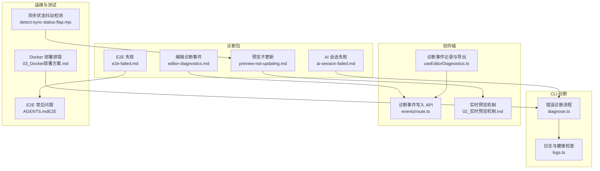
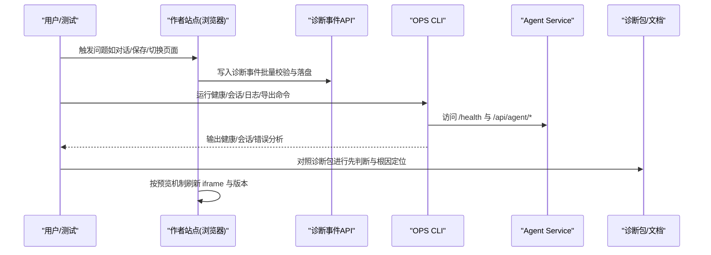
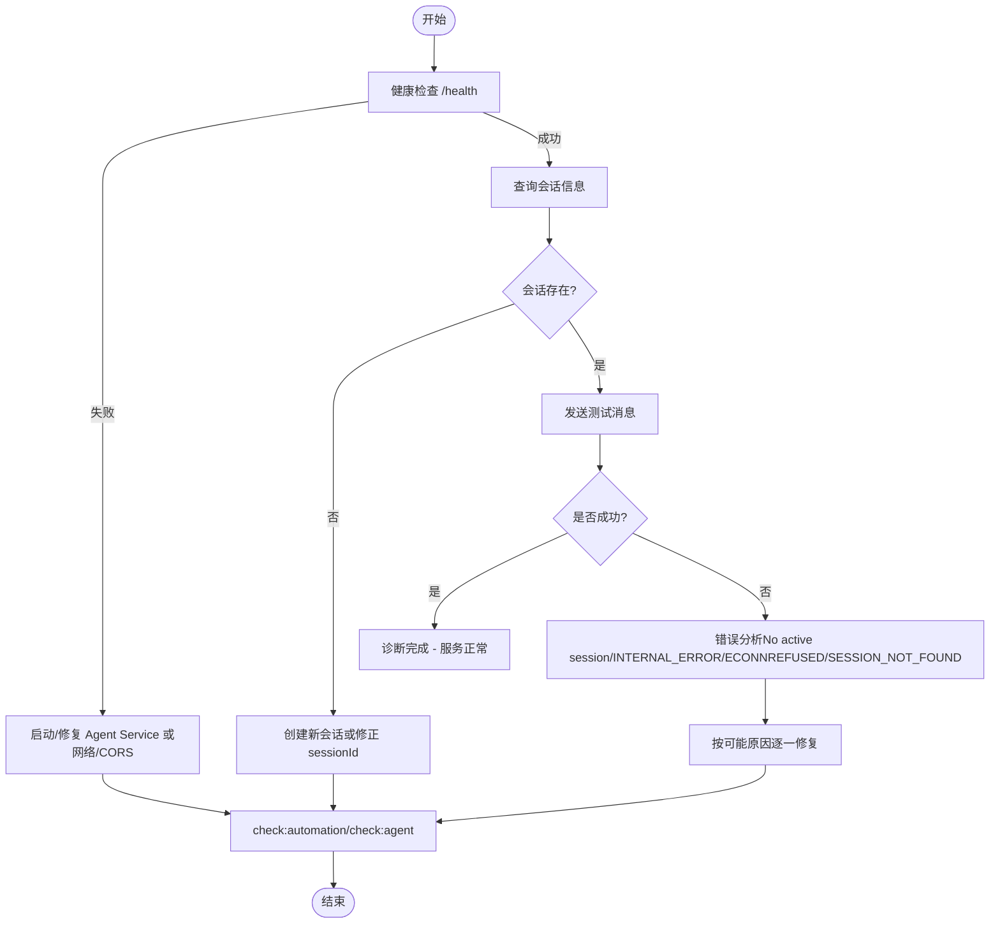
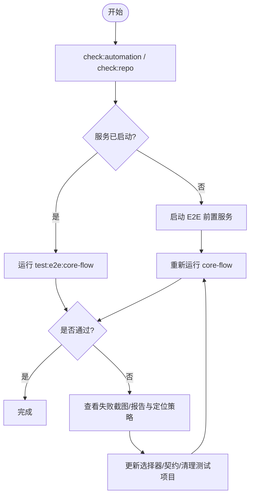
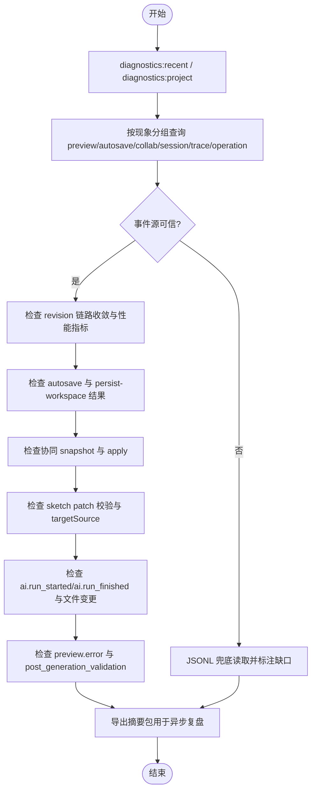
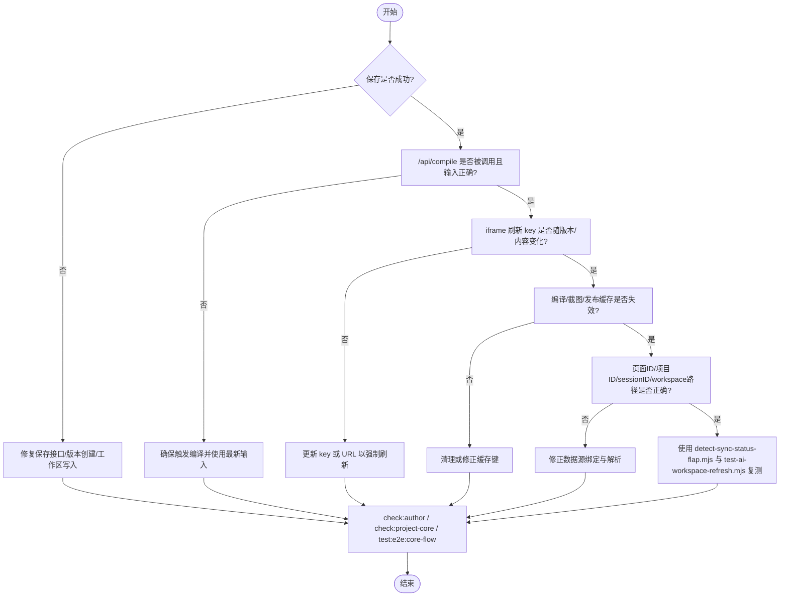
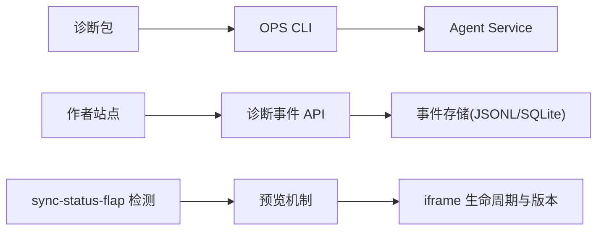

# 常见问题

<cite>
**本文引用的文件**   
- [ai-session-failed.md](file://OPS/automations/diagnostics/ai-session-failed.md)
- [e2e-failed.md](file://OPS/automations/diagnostics/e2e-failed.md)
- [editor-diagnostics.md](file://OPS/automations/diagnostics/editor-diagnostics.md)
- [preview-not-updating.md](file://OPS/automations/diagnostics/preview-not-updating.md)
- [diagnose.ts](file://OPS/CLI/src/commands/diagnose.ts)
- [logs.ts](file://OPS/CLI/src/commands/logs.ts)
- [useEditorDiagnostics.ts](file://packages/author-site/src/components/demo/useEditorDiagnostics.ts)
- [route.ts](file://packages/author-site/src/app/api/editor-diagnostics/events/route.ts)
- [02_实时预览机制.md](file://docs/项目文档/创作端/04-配置与预览/技术/02_实时预览机制.md)
- [03_Docker部署方案.md](file://docs/项目文档/创作端/06-基础设施/技术/03_Docker部署方案.md)
- [06_钉钉环境变量获取指南.md](file://docs/项目文档/创作端/01-用户鉴权/技术/06_钉钉环境变量获取指南.md)
- [detect-sync-status-flap.mjs](file://scripts/development/detect-sync-status-flap.mjs)
- [AGENTS.md（E2E）](file://test/创作端E2E回归测试/AGENTS.md)
</cite>

## 目录
1. [简介](#简介)
2. [项目结构](#项目结构)
3. [核心组件](#核心组件)
4. [架构总览](#架构总览)
5. [详细问题诊断与解决](#详细问题诊断与解决)
6. [依赖关系分析](#依赖关系分析)
7. [性能与稳定性考量](#性能与稳定性考量)
8. [故障排查清单](#故障排查清单)
9. [结论](#结论)
10. [附录：快速修复与预防建议](#附录快速修复与预防建议)

## 简介
本指南面向 Workbench 平台的使用者与开发者，聚焦以下高频问题的症状识别、根因分析与可操作修复步骤：AI 会话失败、E2E 测试失败、编辑器诊断问题、预览不更新。同时覆盖环境配置、网络连接、权限设置等常见场景的快速定位方法与预防措施，帮助在最小影响范围内恢复服务并避免重复发生。

## 项目结构
围绕“问题诊断”的仓库关键位置如下：
- 诊断包索引与专题文档：OPS/automations/diagnostics/*
- CLI 诊断命令与错误分析：OPS/CLI/src/commands/*
- 创作端诊断事件写入与导出：packages/author-site/src/**/editor-diagnostics/**
- 预览机制与多页面边界规范：docs/项目文档/创作端/04-配置与预览/技术/02_实时预览机制.md
- Docker 部署与环境变量排错：docs/项目文档/创作端/06-基础设施/技术/03_Docker部署方案.md
- E2E 测试治理与常见问题：test/创作端E2E回归测试/AGENTS.md
- 同步状态抖动检测脚本：scripts/development/detect-sync-status-flap.mjs

图表来源
- [ai-session-failed.md:1-71](file://OPS/automations/diagnostics/ai-session-failed.md#L1-L71)
- [e2e-failed.md:1-64](file://OPS/automations/diagnostics/e2e-failed.md#L1-L64)
- [editor-diagnostics.md:1-109](file://OPS/automations/diagnostics/editor-diagnostics.md#L1-L109)
- [preview-not-updating.md:1-70](file://OPS/automations/diagnostics/preview-not-updating.md#L1-L70)
- [diagnose.ts:1-372](file://OPS/CLI/src/commands/diagnose.ts#L1-L372)
- [logs.ts:138-160](file://OPS/CLI/src/commands/logs.ts#L138-L160)
- [useEditorDiagnostics.ts:145-182](file://packages/author-site/src/components/demo/useEditorDiagnostics.ts#L145-L182)
- [route.ts:43-72](file://packages/author-site/src/app/api/editor-diagnostics/events/route.ts#L43-L72)
- [02_实时预览机制.md:111-125](file://docs/项目文档/创作端/04-配置与预览/技术/02_实时预览机制.md#L111-L125)
- [03_Docker部署方案.md:396-410](file://docs/项目文档/创作端/06-基础设施/技术/03_Docker部署方案.md#L396-L410)
- [AGENTS.md（E2E）:188-208](file://test/创作端E2E回归测试/AGENTS.md#L188-L208)
- [detect-sync-status-flap.mjs:459-475](file://scripts/development/detect-sync-status-flap.mjs#L459-L475)

章节来源
- [ai-session-failed.md:1-71](file://OPS/automations/diagnostics/ai-session-failed.md#L1-L71)
- [e2e-failed.md:1-64](file://OPS/automations/diagnostics/e2e-failed.md#L1-L64)
- [editor-diagnostics.md:1-109](file://OPS/automations/diagnostics/editor-diagnostics.md#L1-L109)
- [preview-not-updating.md:1-70](file://OPS/automations/diagnostics/preview-not-updating.md#L1-L70)

## 核心组件
- 诊断包体系：为每类问题提供现象关键词、必读资料、先判断、低副作用命令、常见根因、修复后验证与停机条件，确保快速收敛范围。
- CLI 诊断能力：健康检查、会话查询、测试消息发送与结构化错误分析，辅助快速确认 Agent Service 连通性与会话状态。
- 创作端诊断事件：前端采集、批量写入、导出包生成，配合 CLI 查询形成端到端时间线。
- 预览机制：以页面 ID 为边界的请求版本管理、iframe 生命周期控制与尺寸/截图一致性约束，避免跨页串用与旧内容残留。
- 运维与测试支撑：Docker 部署排错、E2E 超时与定位策略调整、同步状态抖动检测脚本。

章节来源
- [diagnose.ts:1-372](file://OPS/CLI/src/commands/diagnose.ts#L1-L372)
- [useEditorDiagnostics.ts:145-182](file://packages/author-site/src/components/demo/useEditorDiagnostics.ts#L145-L182)
- [route.ts:43-72](file://packages/author-site/src/app/api/editor-diagnostics/events/route.ts#L43-L72)
- [02_实时预览机制.md:111-125](file://docs/项目文档/创作端/04-配置与预览/技术/02_实时预览机制.md#L111-L125)

## 架构总览
下图展示从“问题现象”到“诊断工具链”的调用路径与数据流向，涵盖 AI 会话、E2E、编辑器诊断与预览链路的关键节点。

图表来源
- [useEditorDiagnostics.ts:145-182](file://packages/author-site/src/components/demo/useEditorDiagnostics.ts#L145-L182)
- [route.ts:43-72](file://packages/author-site/src/app/api/editor-diagnostics/events/route.ts#L43-L72)
- [diagnose.ts:1-372](file://OPS/CLI/src/commands/diagnose.ts#L1-L372)
- [ai-session-failed.md:1-71](file://OPS/automations/diagnostics/ai-session-failed.md#L1-L71)
- [editor-diagnostics.md:1-109](file://OPS/automations/diagnostics/editor-diagnostics.md#L1-L109)
- [preview-not-updating.md:1-70](file://OPS/automations/diagnostics/preview-not-updating.md#L1-L70)

## 详细问题诊断与解决

### AI 会话失败
- 典型症状
  - AI 空回复、流式中断、WebSocket 断开、Agent 消息失败、工具调用未写文件、工作区变更未同步。
- 先判断要点
  - 服务不可用（健康检查失败、端口不可达）、配置缺失（模型/token/CORS/服务地址异常）、session 问题（不存在/过期/workspace 路径异常）、stream 路由问题（HTTP 成功但 WS event 不完整）、工具调用问题（写文件成功但 author-site 未刷新）、外部模型异常（LLM 超时/限流/空响应）。
- 低副作用命令
  - 使用自动化检查与 agent 自检命令；若 agent-service 已运行，可用 health/system 命令。
- 可用诊断工具
  - OPS CLI 的 health/system/session/logs/files；开发脚本 test-ai-workspace-refresh.mjs。
- 常见根因
  - Agent service 未启动或 CORS 不允许前端访问；session workspace 指向不正确；stream event 丢失或前端聚合逻辑未处理某类事件；Agent 工具写入文件后 author-site 未刷新；真实 LLM 返回空内容或触发外部限流。
- 修复后验证
  - 分别对 agent-service、author AI UI、workspace refresh 执行对应 check/test 命令。
- 停机条件
  - 需要真实 LLM 密钥或生产环境；需更改模型选择、权限或计费相关策略；需删除真实 session/workspace/agent-run logs。

图表来源
- [diagnose.ts:1-372](file://OPS/CLI/src/commands/diagnose.ts#L1-L372)
- [ai-session-failed.md:1-71](file://OPS/automations/diagnostics/ai-session-failed.md#L1-L71)

章节来源
- [ai-session-failed.md:1-71](file://OPS/automations/diagnostics/ai-session-failed.md#L1-L71)
- [diagnose.ts:1-372](file://OPS/CLI/src/commands/diagnose.ts#L1-L372)

### E2E 测试失败
- 典型症状
  - pnpm test:e2e 失败、Playwright timeout、登录失败、找不到按钮/输入框/编辑器、测试项目未清理、test-outputs/ 有失败截图或报告。
- 先判断要点
  - 服务未启动（页面无法访问、连接被拒绝）、登录失败（登录页停留、401、测试账号异常）、定位失效（页面可见但 selector 找不到）、数据污染（测试项目残留、分类不是 __e2e__）、业务回归（同一操作在页面上稳定失败）。
- 低副作用命令
  - 先运行 check:automation 与 check:repo；确认服务已启动后再运行 core-flow 用例。
- 常见根因
  - E2E 前置服务没有启动；UI 文案或结构变化导致定位策略失效；测试项目创建后没有登记或分类；teardown 没有清理过期测试项目；业务接口响应结构变化但测试仍按旧契约断言。
- 修复后验证
  - 针对测试 helper/spec 使用 test:e2e:core-flow；针对 author API/页面逻辑使用 check:author，必要时追加 E2E；针对测试治理文档使用 check:repo。
- 停机条件
  - 需要真实账号、生产服务或密钥；需要删除非 __e2e__ 项目；无法判断是产品回归还是测试定位失效。
- 常见问题速查
  - 测试超时：可在 playwright.config.ts 中增加超时；元素未找到：使用 playwright-cli 探索实际页面结构并更新选择器；截图目录不存在：首次运行自动创建。

图表来源
- [e2e-failed.md:1-64](file://OPS/automations/diagnostics/e2e-failed.md#L1-L64)
- [AGENTS.md（E2E）:188-208](file://test/创作端E2E回归测试/AGENTS.md#L188-L208)

章节来源
- [e2e-failed.md:1-64](file://OPS/automations/diagnostics/e2e-failed.md#L1-L64)
- [AGENTS.md（E2E）:188-208](file://test/创作端E2E回归测试/AGENTS.md#L188-L208)

### 编辑器诊断问题
- 典型症状
  - 重新打开项目后旧内容复原；AI 已修复但页面再次报同一错误；自动保存显示成功但项目当前态不一致；手绘保存无法判断增量 patch 还是全量草稿 fallback；协同快照覆盖磁盘文件；预览异常自动修复反复触发；诊断导出包缺字段、缺事件或无法定位根因。
- 优先命令
  - 先建立最近时间线：diagnostics:recent、diagnostics:project；再按现象分组查询：diagnostics:preview、diagnostics:autosave、diagnostics:collab、diagnostics:session、diagnostics:trace、diagnostics:operation；异步复盘时导出摘要包。
- 先判断要点
  - 事件源可信度（sqliteUsed/jsonlFallbackUsed/dbUnavailable/eventGapDetected/warnings）；revision 链路是否收敛（mutation/projection/canonical 阶段与最终 status）；延迟是否异常（performance.metrics 各项 count/p50/p95/p99/max）；打开项目链路（project.opened/session.created/reused/workspace.bound）；协同是否覆盖（collab.snapshot_received/snapshot.apply）；保存是否落盘（autosave.flush_*/persist-workspace）；手绘保存 patch 校验（page.sketch_patch_validated/page.sketch_patch_rejected 及 targetSource）；AI 是否改写（ai.run_started/工具调用摘要/文件变更/ai.run_finished）；预览错误来源（preview.error/post_generation_validation/iframe runtime/自动修复事件）。
- 降级规则
  - 仅在 CLI 不可用、输出明确提示 fallback 缺口或需核对旧格式字段时直接读取 JSONL；结论必须说明这是兜底数据，不能把缺失事件当成未发生。
- 常见根因
  - 前端只记录了浏览器内存态，重新打开后自动修复计数或临时状态丢失；agent-service 活跃协同房间未收到外部文件变更，旧 Y.Doc 重新成为前端权威值；自动保存 flush 成功但项目当前 workspace 未完成持久化；手绘 patch 保存成功但诊断 payload 缺少 targetSource=server_patch；预览 fast gate 返回结构化错误，但自动修复或诊断导出没有带上稳定 hash/pageId/traceId；SQLite 事件库不可用时 CLI fallback 没有明确标记数据缺口。
- 维护责任
  - 发现诊断系统自身缺口时按层维护：事件字段/脱敏规则/写入链路、CLI 查询/fallback/导出包、排查步骤或常见根因漂移、行为契约变化、具体未解决问题沉淀。
- 修复后验证
  - 针对 CLI/自动任务文档、author-site 诊断写入、agent-service run log、项目 runtime 状态分别执行相应检查。

图表来源
- [editor-diagnostics.md:1-109](file://OPS/automations/diagnostics/editor-diagnostics.md#L1-L109)

章节来源
- [editor-diagnostics.md:1-109](file://OPS/automations/diagnostics/editor-diagnostics.md#L1-L109)

### 预览不更新
- 典型症状
  - 保存后预览仍显示旧内容；iframe 不刷新；画布切换后仍旧页面；编译缓存命中异常；发布或使用端看到旧数据。
- 先判断要点
  - 保存未成功（保存接口失败、版本未创建、工作区未写入）；编译未触发（/api/compile 没有被调用或使用旧输入）；iframe 未刷新（前端状态未更新 key 或 URL）；缓存异常（编译缓存、截图缓存或发布数据未失效）；数据源错位（页面 ID、项目 ID、session ID 或 workspace 路径串用）。
- 低副作用命令
  - 先运行 check:automation 与 check:repo；涉及 author-site 改动后运行 check:author。
- 可用诊断工具
  - detect-sync-status-flap.mjs、test-ai-workspace-refresh.mjs、E2E 核心流程用例。
- 常见根因
  - 保存成功但前端没有重新读取工作区；页面配置或代码写入了 session workspace，但正式项目未同步；预览 iframe 的刷新 key 没有随版本或内容变化；编译缓存键缺少影响输出的输入字段；多页面或多 session 场景下读到了旧页面 ID。
- 修复后验证
  - 针对 author 页面状态、项目读写领域服务、E2E 关键流程分别执行对应检查。
- 停机条件
  - 需要清理真实项目数据；需要改变保存、发布或版本语义；无法确认当前 session/workspace 是否属于测试现场。

图表来源
- [preview-not-updating.md:1-70](file://OPS/automations/diagnostics/preview-not-updating.md#L1-L70)
- [02_实时预览机制.md:111-125](file://docs/项目文档/创作端/04-配置与预览/技术/02_实时预览机制.md#L111-L125)
- [detect-sync-status-flap.mjs:459-475](file://scripts/development/detect-sync-status-flap.mjs#L459-L475)

章节来源
- [preview-not-updating.md:1-70](file://OPS/automations/diagnostics/preview-not-updating.md#L1-L70)
- [02_实时预览机制.md:111-125](file://docs/项目文档/创作端/04-配置与预览/技术/02_实时预览机制.md#L111-L125)

## 依赖关系分析
- 诊断包与 CLI 的关系：诊断包定义问题域与操作步骤，CLI 提供健康检查、会话查询、错误分析与日志收集，二者共同构成“先判断—再验证—后修复”的闭环。
- 创作端与后端的关系：前端通过诊断事件 API 批量写入事件，CLI 通过健康与日志接口拉取运行时状态，形成前后端联动的可观测性。
- 预览机制与状态同步：以页面 ID 为边界的请求版本管理与 iframe 生命周期控制，直接影响“预览不更新”的根因判定与修复方向。

图表来源
- [ai-session-failed.md:1-71](file://OPS/automations/diagnostics/ai-session-failed.md#L1-L71)
- [diagnose.ts:1-372](file://OPS/CLI/src/commands/diagnose.ts#L1-L372)
- [useEditorDiagnostics.ts:145-182](file://packages/author-site/src/components/demo/useEditorDiagnostics.ts#L145-L182)
- [route.ts:43-72](file://packages/author-site/src/app/api/editor-diagnostics/events/route.ts#L43-L72)
- [02_实时预览机制.md:111-125](file://docs/项目文档/创作端/04-配置与预览/技术/02_实时预览机制.md#L111-L125)
- [detect-sync-status-flap.mjs:459-475](file://scripts/development/detect-sync-status-flap.mjs#L459-L475)

章节来源
- [diagnose.ts:1-372](file://OPS/CLI/src/commands/diagnose.ts#L1-L372)
- [route.ts:43-72](file://packages/author-site/src/app/api/editor-diagnostics/events/route.ts#L43-L72)
- [02_实时预览机制.md:111-125](file://docs/项目文档/创作端/04-配置与预览/技术/02_实时预览机制.md#L111-L125)

## 性能与稳定性考量
- 诊断事件写入限制：单次最多写入 200 条，超出将返回无效请求错误；应合理批量化与节流，避免频繁小批次写入造成开销。
- 预览请求版本：仅当存在可发送的预览源时才创建请求版本，避免空代码过渡抢占新版本导致永久加载态。
- 同步状态抖动：检测 connecting/offline 频繁切换，有助于识别网络或服务不稳定导致的预览/保存异常。

章节来源
- [route.ts:43-72](file://packages/author-site/src/app/api/editor-diagnostics/events/route.ts#L43-L72)
- [02_实时预览机制.md:111-125](file://docs/项目文档/创作端/04-配置与预览/技术/02_实时预览机制.md#L111-L125)
- [detect-sync-status-flap.mjs:459-475](file://scripts/development/detect-sync-status-flap.mjs#L459-L475)

## 故障排查清单
- 环境配置问题
  - Docker 部署常见错误：No active session、Pi Agent error、Model not available、SSE stream timeout、CORS 预检 405、Workspace deploy preflight failed 等，参考部署方案中的错误信息与解决方案。
- 网络连接问题
  - Agent Service 不可达或连接被拒绝：检查端口占用、防火墙、代理与 CORS 配置；使用 CLI 健康检查与日志命令定位。
- 权限设置错误
  - 钉钉登录相关失败：检查环境变量、应用类型与权限；确保从钉钉工作台打开应用或补充授权地址；上线前逐项核对清单。

章节来源
- [03_Docker部署方案.md:396-410](file://docs/项目文档/创作端/06-基础设施/技术/03_Docker部署方案.md#L396-L410)
- [06_钉钉环境变量获取指南.md:206-227](file://docs/项目文档/创作端/01-用户鉴权/技术/06_钉钉环境变量获取指南.md#L206-L227)
- [diagnose.ts:1-372](file://OPS/CLI/src/commands/diagnose.ts#L1-L372)
- [logs.ts:138-160](file://OPS/CLI/src/commands/logs.ts#L138-L160)

## 结论
通过“诊断包 + CLI + 创作端事件 + 预览机制 + 运维脚本”的组合，Workbench 平台能够在最小影响范围内快速定位并修复 AI 会话失败、E2E 测试失败、编辑器诊断问题与预览不更新等高频问题。遵循“先判断—再验证—后修复”的流程，结合停机条件与修复后验证，可有效降低误判与二次风险。

## 附录：快速修复与预防建议
- 快速修复
  - AI 会话失败：优先执行健康检查与测试消息，根据错误分析分支修复服务/会话/网络/CORS。
  - E2E 失败：先运行自动化检查与核心流程用例，再根据失败截图与定位策略调整选择器与契约。
  - 编辑器诊断：建立最近时间线与分组查询，关注事件源可信度与 revision 链路收敛，必要时导出摘要包复盘。
  - 预览不更新：确认保存成功、编译触发、iframe key 更新、缓存失效与数据源绑定正确。
- 预防措施
  - 统一事件写入与导出规范，避免缺失关键字段导致无法定位根因。
  - 严格以页面 ID 为边界的预览请求版本管理，避免跨页串用与旧内容残留。
  - 完善 Docker 部署与环境变量校验，减少 No active session、CORS 预检失败等问题。
  - 在 E2E 中引入更稳健的定位策略与超时配置，减少偶发失败。