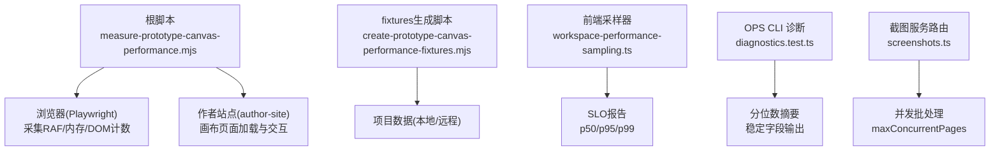
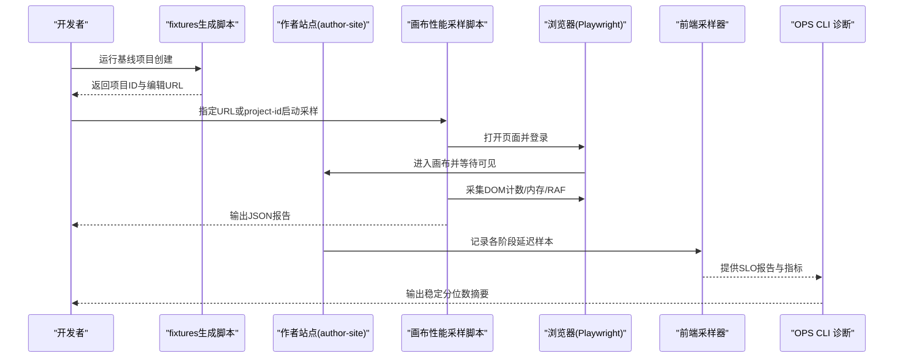
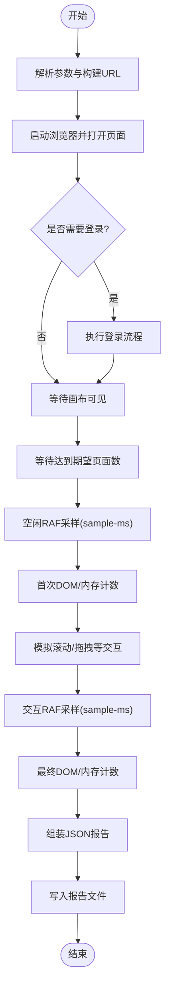
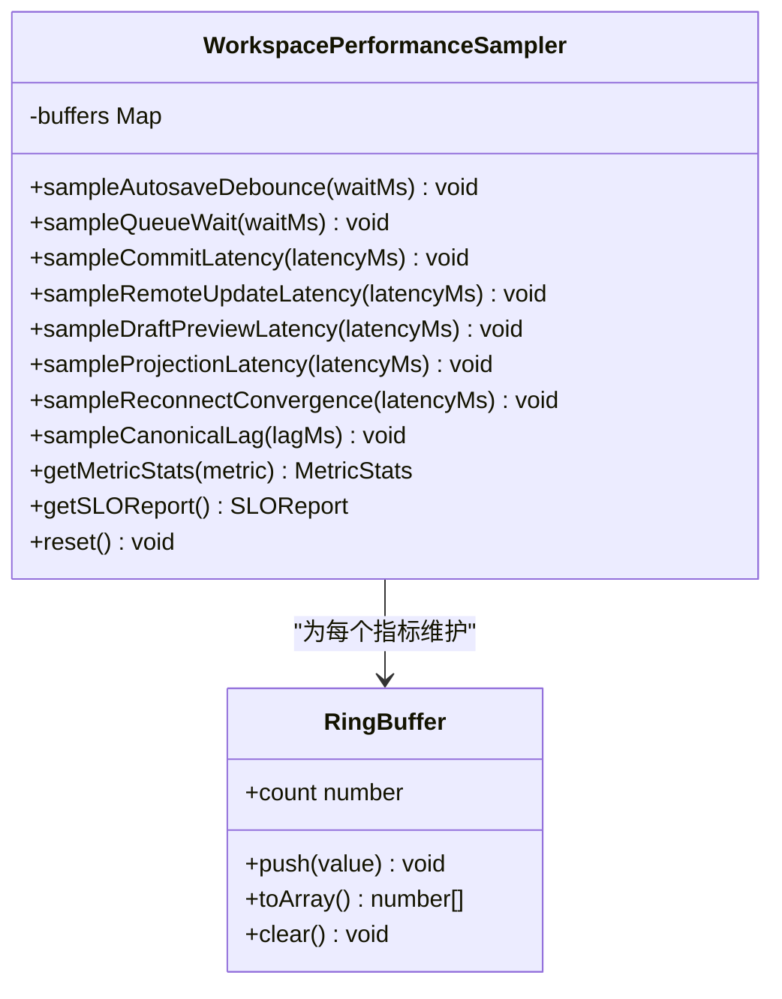
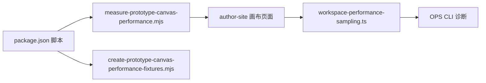

# 性能监控

<cite>
**本文引用的文件**   
- [package.json](file://package.json)
- [measure-prototype-canvas-performance.mjs](file://scripts/development/measure-prototype-canvas-performance.mjs)
- [create-prototype-canvas-performance-fixtures.mjs](file://scripts/development/create-prototype-canvas-performance-fixtures.mjs)
- [workspace-performance-sampling.ts](file://packages/author-site/src/lib/workspace-performance-sampling.ts)
- [02_Codex查询CLI与导出包.md](file://docs/项目文档/创作端/11-诊断与日志/技术/02_Codex查询CLI与导出包.md)
- [diagnostics.test.ts](file://OPS/CLI/src/commands/diagnostics.test.ts)
- [check-workspace-authority-guards.mjs](file://scripts/check-workspace-authority-guards.mjs)
- [screenshot-service/screenshots.ts](file://packages/screenshot-service/src/routes/screenshots.ts)
</cite>

## 目录
1. [简介](#简介)
2. [项目结构](#项目结构)
3. [核心组件](#核心组件)
4. [架构总览](#架构总览)
5. [详细组件分析](#详细组件分析)
6. [依赖关系分析](#依赖关系分析)
7. [性能考量](#性能考量)
8. [故障排查指南](#故障排查指南)
9. [结论](#结论)
10. [附录](#附录)

## 简介
本指南面向 Workbench 平台，聚焦“性能监控与优化”。内容覆盖：
- 浏览器开发者工具、服务器性能分析与数据库查询优化的使用方法
- 原型画布性能基准测试的执行与分析（渲染帧率、内存使用、同步状态检测）
- 性能瓶颈识别方法、内存泄漏检测与并发处理优化建议
- 性能回归测试与持续监控的最佳实践

## 项目结构
Workbench 仓库采用多包 monorepo 组织。与性能相关的关键位置包括：
- 根脚本：用于生成基线项目与执行画布性能采样
- author-site：前端工作区性能采样器与 SLO 报告
- screenshot-service：截图服务并发批处理与限流
- OPS CLI：诊断聚合与分位数汇总
- 文档：诊断输出规范与指标定义

图表来源
- [measure-prototype-canvas-performance.mjs:109-183](file://scripts/development/measure-prototype-canvas-performance.mjs#L109-L183)
- [create-prototype-canvas-performance-fixtures.mjs:192-231](file://scripts/development/create-prototype-canvas-performance-fixtures.mjs#L192-L231)
- [workspace-performance-sampling.ts:176-272](file://packages/author-site/src/lib/workspace-performance-sampling.ts#L176-L272)
- [diagnostics.test.ts:241-277](file://OPS/CLI/src/commands/diagnostics.test.ts#L241-L277)
- [screenshot-service/screenshots.ts:1006-1050](file://packages/screenshot-service/src/routes/screenshots.ts#L1006-L1050)

章节来源
- [package.json:1-101](file://package.json#L1-L101)

## 核心组件
- 原型画布性能基准脚本：基于 Playwright 驱动浏览器，测量 DOMContentLoaded、画布可见时间、RAF 帧间隔、内存与节点数量，并输出 JSON 报告。
- 前端工作区性能采样器：在 author-site 中按指标维护环形缓冲区，计算 p50/p95/p99 并与 SLO 目标对比，生成 SLO 报告。
- 诊断聚合与分位数摘要：OPS CLI 将多源事件合并，输出稳定的分位数字段，便于回归比对。
- 截图服务并发批处理：通过队列与并发上限控制渲染压力，返回优先级统计与重试策略。

章节来源
- [measure-prototype-canvas-performance.mjs:67-107](file://scripts/development/measure-prototype-canvas-performance.mjs#L67-L107)
- [workspace-performance-sampling.ts:152-168](file://packages/author-site/src/lib/workspace-performance-sampling.ts#L152-L168)
- [diagnostics.test.ts:241-277](file://OPS/CLI/src/commands/diagnostics.test.ts#L241-L277)
- [screenshot-service/screenshots.ts:1026-1050](file://packages/screenshot-service/src/routes/screenshots.ts#L1026-L1050)

## 架构总览
下图展示从“基线项目生成”到“画布性能采样”，再到“SLO 报告与诊断聚合”的端到端流程。

图表来源
- [create-prototype-canvas-performance-fixtures.mjs:192-231](file://scripts/development/create-prototype-canvas-performance-fixtures.mjs#L192-L231)
- [measure-prototype-canvas-performance.mjs:109-183](file://scripts/development/measure-prototype-canvas-performance.mjs#L109-L183)
- [workspace-performance-sampling.ts:176-272](file://packages/author-site/src/lib/workspace-performance-sampling.ts#L176-L272)
- [diagnostics.test.ts:241-277](file://OPS/CLI/src/commands/diagnostics.test.ts#L241-L277)

## 详细组件分析

### 原型画布性能基准测试
- 功能要点
  - 自动登录（支持覆盖账号）、等待画布可见、等待期望页面数
  - 空闲与交互两段 RAF 采样，计算平均帧耗时、p95 帧耗时与近似 FPS
  - 收集 DOM 节点计数与内存信息（如可用）
  - 输出带标签的 JSON 报告，便于不同场景对比
- 关键参数
  - --url / --project-id / --base-url / --label / --expected-pages / --sample-ms / --headed / --report-dir
- 执行方式
  - 通过根脚本命令调用，详见根 package.json 中的 test 脚本映射

图表来源
- [measure-prototype-canvas-performance.mjs:67-107](file://scripts/development/measure-prototype-canvas-performance.mjs#L67-L107)
- [measure-prototype-canvas-performance.mjs:109-183](file://scripts/development/measure-prototype-canvas-performance.mjs#L109-L183)

章节来源
- [measure-prototype-canvas-performance.mjs:1-193](file://scripts/development/measure-prototype-canvas-performance.mjs#L1-L193)
- [package.json:75-78](file://package.json#L75-L78)

### 前端工作区性能采样器与 SLO
- 设计原则
  - 纯内存采样，固定容量环形缓冲区，避免内存泄漏
  - 每个指标独立统计 p50/p95/p99，并与 SLO 目标对比
- 指标范围
  - autosave-debounce、queue-wait、commit-latency、remote-update-latency、draft-preview-latency、projection-latency、reconnect-convergence、canonical-lag
- 能力
  - 提供 sample* 方法记录延迟
  - getMetricStats 获取分位数统计
  - getSLOReport 生成是否通过的 SLO 报告

图表来源
- [workspace-performance-sampling.ts:96-134](file://packages/author-site/src/lib/workspace-performance-sampling.ts#L96-L134)
- [workspace-performance-sampling.ts:176-272](file://packages/author-site/src/lib/workspace-performance-sampling.ts#L176-L272)

章节来源
- [workspace-performance-sampling.ts:1-280](file://packages/author-site/src/lib/workspace-performance-sampling.ts#L1-L280)

### 诊断聚合与分位数摘要
- 统一输出八项 WMA 指标的分位数摘要，字段稳定，便于回归比对
- 当某类埋点未产生时，保留空样本，不伪装其他耗时
- 测试用例验证了 p50/p95/p99 的稳定输出

章节来源
- [02_Codex查询CLI与导出包.md:111-115](file://docs/项目文档/创作端/11-诊断与日志/技术/02_Codex查询CLI与导出包.md#L111-L115)
- [diagnostics.test.ts:241-277](file://OPS/CLI/src/commands/diagnostics.test.ts#L241-L277)
- [check-workspace-authority-guards.mjs:1030-1061](file://scripts/check-workspace-authority-guards.mjs#L1030-L1061)

### 截图服务并发批处理
- 后台批处理任务，按配置的最大并发度消费队列
- 返回优先级统计、重试间隔与结果集，便于评估渲染吞吐与背压效果

章节来源
- [screenshot-service/screenshots.ts:1006-1050](file://packages/screenshot-service/src/routes/screenshots.ts#L1006-L1050)

## 依赖关系分析
- 脚本与包
  - 根 package.json 暴露了性能相关的测试与开发脚本，串联 fixtures 生成与采样执行
- 模块耦合
  - 采样脚本与 author-site 无直接代码依赖，但通过浏览器行为与 DOM 标记进行协同
  - 前端采样器与 OPS CLI 诊断共享指标语义，确保一致性

图表来源
- [package.json:75-78](file://package.json#L75-L78)
- [workspace-performance-sampling.ts:176-272](file://packages/author-site/src/lib/workspace-performance-sampling.ts#L176-L272)

章节来源
- [package.json:1-101](file://package.json#L1-L101)

## 性能考量
- 渲染性能
  - 使用 RAF 采样评估帧耗时与近似 FPS；关注 p95 帧耗时以识别卡顿尾延迟
  - 在交互前后分别采样，观察滚动/拖拽对帧时的影响
- 内存使用
  - 采样脚本可读取 JS Heap 大小（若可用），结合 DOM 节点计数判断是否存在异常增长
  - 前端采样器使用固定容量环形缓冲区，避免长期驻留导致内存泄漏
- 同步状态检测
  - 通过等待画布可见与期望页面数，确保采样在稳定状态下进行
  - 诊断聚合输出 canonical lag 等指标，辅助定位物化延迟问题
- 并发处理优化
  - 截图服务通过最大并发限制与队列消费模型控制渲染压力
  - 根据返回的优先级统计与重试间隔调整并发阈值，平衡吞吐与时延

[本节为通用指导，无需特定文件引用]

## 故障排查指南
- 常见问题
  - 登录失败：检查用户名/密码与环境变量覆盖；必要时使用 API 登录兜底
  - 画布不可见：确认 data-canvas-root 元素存在且可见；必要时延长等待超时
  - 页面数不足：核对 expected-pages 与实际项目页面数一致
- 定位步骤
  - 使用浏览器开发者工具的 Performance 面板录制交互过程，定位主线程阻塞
  - 使用 Memory 面板进行堆快照对比，查找未释放引用
  - 查看采样脚本输出的 JSON 报告，比较 idle 与 interaction 的帧耗时差异
  - 通过 OPS CLI 诊断聚合输出，检查 p95/p99 是否越界，定位具体指标
- 回归与监控
  - 将不同 label 的报告保存至同一目录，定期对比趋势
  - 将 SLO 报告纳入 CI，设置阈值告警

章节来源
- [measure-prototype-canvas-performance.mjs:38-65](file://scripts/development/measure-prototype-canvas-performance.mjs#L38-L65)
- [measure-prototype-canvas-performance.mjs:129-147](file://scripts/development/measure-prototype-canvas-performance.mjs#L129-L147)
- [workspace-performance-sampling.ts:245-264](file://packages/author-site/src/lib/workspace-performance-sampling.ts#L245-L264)

## 结论
Workbench 的性能监控体系由“基线项目生成—浏览器基准采样—前端采样与 SLO—诊断聚合”构成闭环。借助稳定的分位数输出与 SLO 报告，团队可在日常开发与发布流程中持续追踪渲染性能、内存占用与协作同步延迟，快速定位瓶颈并实施优化。

[本节为总结性内容，无需特定文件引用]

## 附录
- 常用命令
  - 生成基线项目：pnpm test:prototype-canvas-fixtures
  - 执行画布性能采样：pnpm test:prototype-canvas-performance -- --project-id <id> --label <name>
  - 运行 E2E 与诊断：参见根 package.json 的 test 与 diagnostics 脚本
- 参考路径
  - 脚本说明与参数：scripts/development/README.md（仓库内已有说明）
  - 诊断输出规范：docs/项目文档/创作端/11-诊断与日志/技术/02_Codex查询CLI与导出包.md

章节来源
- [package.json:75-78](file://package.json#L75-L78)
- [02_Codex查询CLI与导出包.md:111-115](file://docs/项目文档/创作端/11-诊断与日志/技术/02_Codex查询CLI与导出包.md#L111-L115)