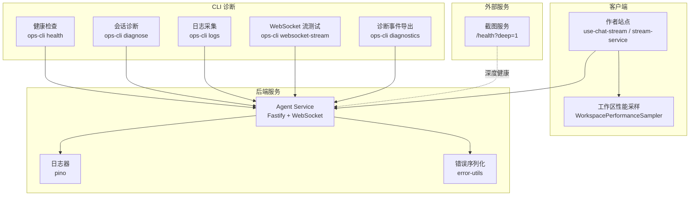
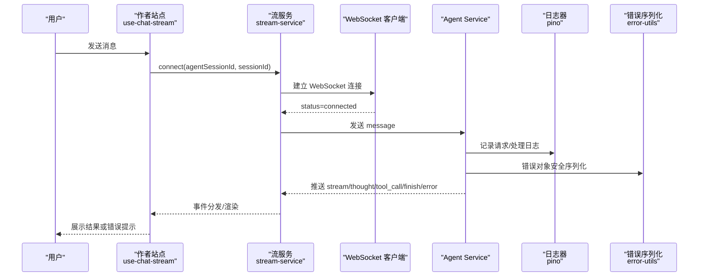
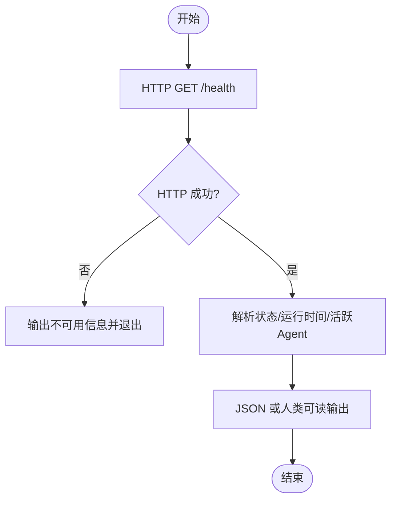
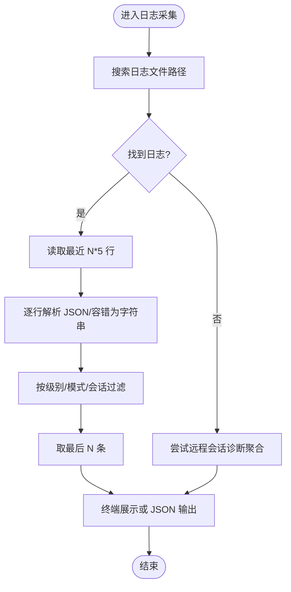
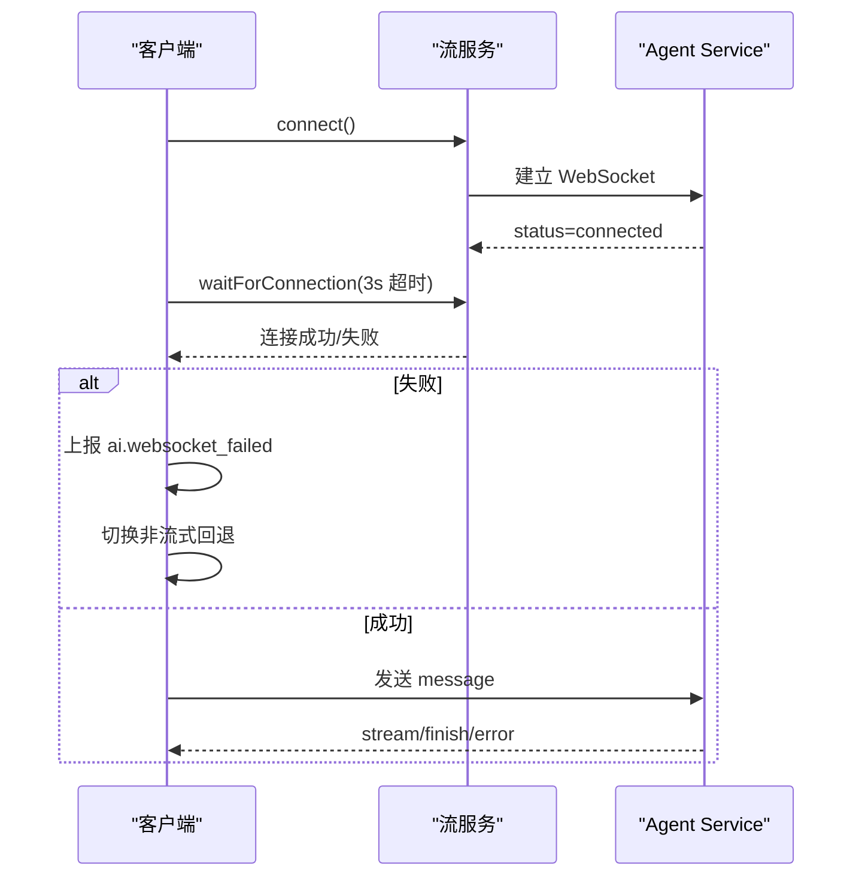
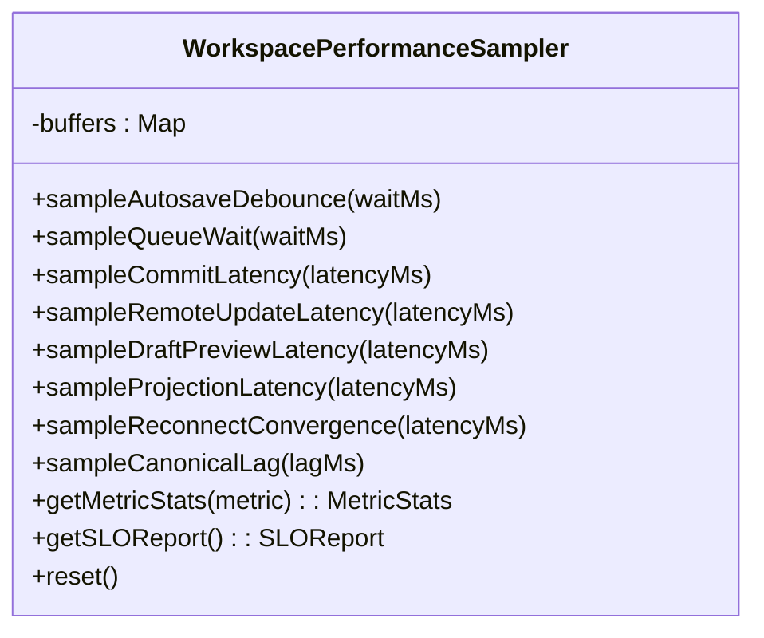
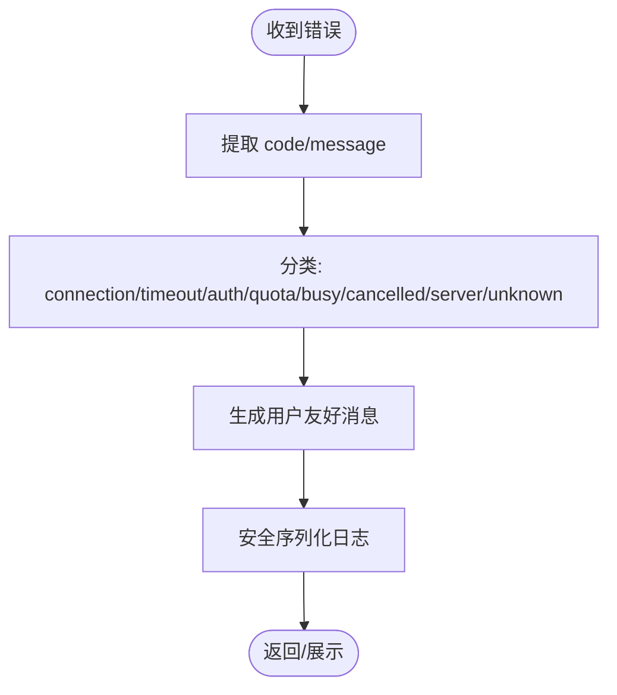
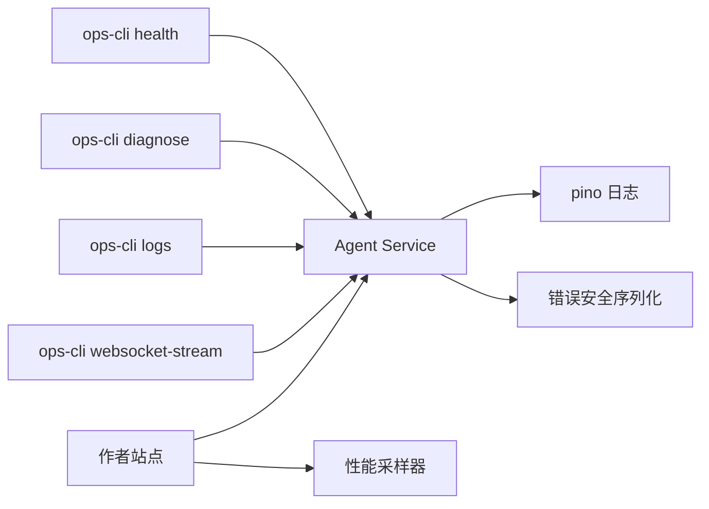

# 故障排除

<cite>
**本文引用的文件**   
- [health.ts](file://OPS/CLI/src/commands/health.ts)
- [diagnose.ts](file://OPS/CLI/src/commands/diagnose.ts)
- [logs.ts](file://OPS/CLI/src/commands/logs.ts)
- [websocket-stream.ts](file://OPS/CLI/src/commands/websocket-stream.ts)
- [logger.ts](file://packages/agent-service/src/utils/logger.ts)
- [error-utils.ts](file://packages/agent-service/src/utils/error-utils.ts)
- [ai-error-normalizer.ts](file://packages/shared/src/ai-error-normalizer.ts)
- [error-mapper.ts](file://packages/author-site/lib/error-mapper.ts)
- [02-接口规范.md](file://docs/项目文档/独立Agent服务层/02-接口规范.md)
- [use-chat-stream.ts](file://packages/author-site/src/components/ai-elements/chat/hooks/use-chat-stream.ts)
- [stream-service.ts](file://packages/author-site/src/components/ai-elements/chat/services/stream-service.ts)
- [workspace-performance-sampling.ts](file://packages/author-site/src/lib/workspace-performance-sampling.ts)
- [diagnostics.ts](file://OPS/CLI/src/commands/diagnostics.ts)
- [docker-screenshot-deep-health.sh](file://scripts/docker-screenshot-deep-health.sh)
</cite>

## 目录
1. [简介](#简介)
2. [项目结构](#项目结构)
3. [核心组件](#核心组件)
4. [架构总览](#架构总览)
5. [详细组件分析](#详细组件分析)
6. [依赖关系分析](#依赖关系分析)
7. [性能考虑](#性能考虑)
8. [故障排查指南](#故障排查指南)
9. [错误码参考手册](#错误码参考手册)
10. [结论](#结论)
11. [附录](#附录)

## 简介
本指南面向 Workbench 平台的使用者、运维与研发人员，提供系统化的问题定位与解决路径。内容覆盖环境与健康检查、日志收集与分析、WebSocket 连接与超时、性能监控与瓶颈定位、内存泄漏排查思路、错误码参考、健康检查脚本与自动化诊断工具使用，以及社区支持与反馈流程建议。

## 项目结构
围绕“可观测性”和“可诊断性”，Workbench 在 CLI、服务端与前端均提供了完善的支撑：
- CLI 诊断与健康检查：健康探测、会话诊断、日志拉取、WebSocket 流式测试、诊断事件导出与汇总
- Agent Service 日志与错误处理：结构化日志、错误字段安全序列化
- 前端可观测性：WebSocket 连接状态、失败回退、性能采样与 SLO 报告
- 截图服务深度健康检查：浏览器内核可用性验证

图表来源
- [health.ts:1-90](file://OPS/CLI/src/commands/health.ts#L1-L90)
- [diagnose.ts:1-371](file://OPS/CLI/src/commands/diagnose.ts#L1-L371)
- [logs.ts:46-293](file://OPS/CLI/src/commands/logs.ts#L46-L293)
- [websocket-stream.ts:219-262](file://OPS/CLI/src/commands/websocket-stream.ts#L219-L262)
- [logger.ts:1-41](file://packages/agent-service/src/utils/logger.ts#L1-L41)
- [error-utils.ts:1-60](file://packages/agent-service/src/utils/error-utils.ts#L1-L60)
- [use-chat-stream.ts:993-1048](file://packages/author-site/src/components/ai-elements/chat/hooks/use-chat-stream.ts#L993-L1048)
- [stream-service.ts:177-228](file://packages/author-site/src/components/ai-elements/chat/services/stream-service.ts#L177-L228)
- [workspace-performance-sampling.ts:152-279](file://packages/author-site/src/lib/workspace-performance-sampling.ts#L152-L279)
- [docker-screenshot-deep-health.sh:1-42](file://scripts/docker-screenshot-deep-health.sh#L1-L42)

章节来源
- [health.ts:1-90](file://OPS/CLI/src/commands/health.ts#L1-L90)
- [diagnose.ts:1-371](file://OPS/CLI/src/commands/diagnose.ts#L1-L371)
- [logs.ts:46-293](file://OPS/CLI/src/commands/logs.ts#L46-L293)
- [websocket-stream.ts:219-262](file://OPS/CLI/src/commands/websocket-stream.ts#L219-L262)
- [logger.ts:1-41](file://packages/agent-service/src/utils/logger.ts#L1-L41)
- [error-utils.ts:1-60](file://packages/agent-service/src/utils/error-utils.ts#L1-L60)
- [use-chat-stream.ts:993-1048](file://packages/author-site/src/components/ai-elements/chat/hooks/use-chat-stream.ts#L993-L1048)
- [stream-service.ts:177-228](file://packages/author-site/src/components/ai-elements/chat/services/stream-service.ts#L177-L228)
- [workspace-performance-sampling.ts:152-279](file://packages/author-site/src/lib/workspace-performance-sampling.ts#L152-L279)
- [docker-screenshot-deep-health.sh:1-42](file://scripts/docker-screenshot-deep-health.sh#L1-L42)

## 核心组件
- 健康检查（CLI）
  - 通过 HTTP GET /health 获取服务状态、运行时间、活跃 Agent 数量等，支持 JSON 输出便于自动化集成。
- 会话诊断（CLI）
  - 自动执行健康检查、会话存在性与状态校验、发送测试消息并给出问题分析与建议。
- 日志采集（CLI）
  - 本地读取 JSONL 日志或远程会话诊断聚合，支持按级别、模式、会话过滤，统一展示。
- WebSocket 流测试（CLI）
  - 建立 WebSocket 连接、发送消息、接收增量响应，捕获连接关闭与错误原因，辅助快速复现。
- 服务端日志与错误
  - 基于 pino 的结构化日志；错误对象仅保留安全字段并截断超长文本，避免敏感信息泄露。
- 前端可观测性
  - WebSocket 连接等待与超时控制、失败回退策略、诊断事件上报；工作区性能采样与 SLO 报告。
- 截图服务深度健康
  - 调用 /health?deep=1 进行浏览器内核可用性与渲染能力检查。

章节来源
- [health.ts:1-90](file://OPS/CLI/src/commands/health.ts#L1-L90)
- [diagnose.ts:1-371](file://OPS/CLI/src/commands/diagnose.ts#L1-L371)
- [logs.ts:46-293](file://OPS/CLI/src/commands/logs.ts#L46-L293)
- [websocket-stream.ts:219-262](file://OPS/CLI/src/commands/websocket-stream.ts#L219-L262)
- [logger.ts:1-41](file://packages/agent-service/src/utils/logger.ts#L1-L41)
- [error-utils.ts:1-60](file://packages/agent-service/src/utils/error-utils.ts#L1-L60)
- [use-chat-stream.ts:993-1048](file://packages/author-site/src/components/ai-elements/chat/hooks/use-chat-stream.ts#L993-L1048)
- [stream-service.ts:177-228](file://packages/author-site/src/components/ai-elements/chat/services/stream-service.ts#L177-L228)
- [workspace-performance-sampling.ts:152-279](file://packages/author-site/src/lib/workspace-performance-sampling.ts#L152-L279)
- [docker-screenshot-deep-health.sh:1-42](file://scripts/docker-screenshot-deep-health.sh#L1-L42)

## 架构总览
下图展示了从用户操作到后端处理、再到诊断与监控的端到端链路，以及关键的可观测点。

图表来源
- [use-chat-stream.ts:993-1048](file://packages/author-site/src/components/ai-elements/chat/hooks/use-chat-stream.ts#L993-L1048)
- [stream-service.ts:177-228](file://packages/author-site/src/components/ai-elements/chat/services/stream-service.ts#L177-L228)
- [logger.ts:1-41](file://packages/agent-service/src/utils/logger.ts#L1-L41)
- [error-utils.ts:1-60](file://packages/agent-service/src/utils/error-utils.ts#L1-L60)

## 详细组件分析

### 健康检查与自动化
- 健康检查命令
  - 访问 /health，解析返回的状态、运行时长、活跃 Agent 数与后端引擎列表，支持 JSON 输出用于 CI/CD 或告警。
- 会话诊断命令
  - 自动执行健康检查、会话存在性检查、发送测试消息，并根据错误类型给出可能原因与解决方案。
- 截图服务深度健康
  - 调用 /health?deep=1，校验 deepCheck.ok 为 true 表示浏览器内核可用。

图表来源
- [health.ts:1-90](file://OPS/CLI/src/commands/health.ts#L1-L90)
- [docker-screenshot-deep-health.sh:1-42](file://scripts/docker-screenshot-deep-health.sh#L1-L42)

章节来源
- [health.ts:1-90](file://OPS/CLI/src/commands/health.ts#L1-L90)
- [diagnose.ts:1-371](file://OPS/CLI/src/commands/diagnose.ts#L1-L371)
- [docker-screenshot-deep-health.sh:1-42](file://scripts/docker-screenshot-deep-health.sh#L1-L42)

### 日志收集与分析
- 日志级别配置
  - 服务端默认级别由环境变量控制，未设置时采用 info。
- 日志格式与关键字段
  - 结构化 JSONL，包含 level、time、msg 等；支持按级别、模式、会话 ID 过滤。
- 本地与远程采集
  - 优先查找常见路径下的 agent-service.log 或 latest.log；也支持通过会话诊断接口聚合。
- 展示与导出
  - 终端彩色高亮显示，支持 JSON 模式输出以便后续处理。

图表来源
- [logs.ts:46-293](file://OPS/CLI/src/commands/logs.ts#L46-L293)
- [logger.ts:1-41](file://packages/agent-service/src/utils/logger.ts#L1-L41)

章节来源
- [logs.ts:46-293](file://OPS/CLI/src/commands/logs.ts#L46-L293)
- [logger.ts:1-41](file://packages/agent-service/src/utils/logger.ts#L1-L41)

### WebSocket 连接与超时
- 连接建立与心跳
  - 客户端等待 connected 状态，设置连接超时；服务端对 ping/pong 心跳维持连接活性。
- 超时与取消
  - 单轮消息长时间无活动将触发超时；显式超时参数仅在调用方明确传入时生效，且会被限制在安全范围。
- 失败回退
  - 当 WebSocket 失败时，前端会发出诊断事件并尝试非流式模式回退，同时清理资源。

图表来源
- [stream-service.ts:177-228](file://packages/author-site/src/components/ai-elements/chat/services/stream-service.ts#L177-L228)
- [use-chat-stream.ts:993-1048](file://packages/author-site/src/components/ai-elements/chat/hooks/use-chat-stream.ts#L993-L1048)
- [02-接口规范.md:133-167](file://docs/项目文档/独立Agent服务层/02-接口规范.md#L133-L167)

章节来源
- [stream-service.ts:177-228](file://packages/author-site/src/components/ai-elements/chat/services/stream-service.ts#L177-L228)
- [use-chat-stream.ts:993-1048](file://packages/author-site/src/components/ai-elements/chat/hooks/use-chat-stream.ts#L993-L1048)
- [02-接口规范.md:133-167](file://docs/项目文档/独立Agent服务层/02-接口规范.md#L133-L167)

### 性能监控与瓶颈定位
- 指标体系
  - autosave debounce wait、queue wait、commit latency、remote update latency、draft preview latency、projection latency、reconnect convergence、canonical lag。
- 采样与统计
  - 环形缓冲区维护最近样本，计算 p50/p95/p99/min/max/average，生成 SLO 报告。
- 诊断导出
  - CLI 诊断导出聚合多源事件，输出稳定的百分位摘要，便于跨环境对比。

图表来源
- [workspace-performance-sampling.ts:152-279](file://packages/author-site/src/lib/workspace-performance-sampling.ts#L152-L279)
- [diagnostics.ts:501-824](file://OPS/CLI/src/commands/diagnostics.ts#L501-L824)

章节来源
- [workspace-performance-sampling.ts:152-279](file://packages/author-site/src/lib/workspace-performance-sampling.ts#L152-L279)
- [diagnostics.ts:501-824](file://OPS/CLI/src/commands/diagnostics.ts#L501-L824)

### 错误处理与安全
- 错误分类与用户提示
  - 根据错误代码与消息归类为连接/超时/鉴权/配额/忙碌/已取消/服务器/未知，并生成用户友好提示。
- 安全序列化
  - 仅拷贝白名单字段，截断超长字符串，限制 cause 深度，避免敏感信息泄露。
- 前端错误映射
  - 将校验错误聚合为用户友好的摘要与修复建议。

图表来源
- [ai-error-normalizer.ts:1-157](file://packages/shared/src/ai-error-normalizer.ts#L1-L157)
- [error-utils.ts:1-60](file://packages/agent-service/src/utils/error-utils.ts#L1-L60)
- [error-mapper.ts:1-54](file://packages/author-site/lib/error-mapper.ts#L1-L54)

章节来源
- [ai-error-normalizer.ts:1-157](file://packages/shared/src/ai-error-normalizer.ts#L1-L157)
- [error-utils.ts:1-60](file://packages/agent-service/src/utils/error-utils.ts#L1-L60)
- [error-mapper.ts:1-54](file://packages/author-site/lib/error-mapper.ts#L1-L54)

## 依赖关系分析
- CLI 与后端
  - health/diagnose/logs/websocket-stream 均依赖 Agent Service 的 HTTP/WebSocket 接口。
- 前端与服务端
  - use-chat-stream 与 stream-service 负责连接管理与事件分发；服务端通过 logger 与 error-utils 保障可观测性与安全性。
- 性能与诊断
  - 前端采样器与 CLI 诊断导出共同构成端到端性能闭环。

图表来源
- [health.ts:1-90](file://OPS/CLI/src/commands/health.ts#L1-L90)
- [diagnose.ts:1-371](file://OPS/CLI/src/commands/diagnose.ts#L1-L371)
- [logs.ts:46-293](file://OPS/CLI/src/commands/logs.ts#L46-L293)
- [websocket-stream.ts:219-262](file://OPS/CLI/src/commands/websocket-stream.ts#L219-L262)
- [use-chat-stream.ts:993-1048](file://packages/author-site/src/components/ai-elements/chat/hooks/use-chat-stream.ts#L993-L1048)
- [workspace-performance-sampling.ts:152-279](file://packages/author-site/src/lib/workspace-performance-sampling.ts#L152-L279)
- [logger.ts:1-41](file://packages/agent-service/src/utils/logger.ts#L1-L41)
- [error-utils.ts:1-60](file://packages/agent-service/src/utils/error-utils.ts#L1-L60)

章节来源
- [health.ts:1-90](file://OPS/CLI/src/commands/health.ts#L1-L90)
- [diagnose.ts:1-371](file://OPS/CLI/src/commands/diagnose.ts#L1-L371)
- [logs.ts:46-293](file://OPS/CLI/src/commands/logs.ts#L46-L293)
- [websocket-stream.ts:219-262](file://OPS/CLI/src/commands/websocket-stream.ts#L219-L262)
- [use-chat-stream.ts:993-1048](file://packages/author-site/src/components/ai-elements/chat/hooks/use-chat-stream.ts#L993-L1048)
- [workspace-performance-sampling.ts:152-279](file://packages/author-site/src/lib/workspace-performance-sampling.ts#L152-L279)
- [logger.ts:1-41](file://packages/agent-service/src/utils/logger.ts#L1-L41)
- [error-utils.ts:1-60](file://packages/agent-service/src/utils/error-utils.ts#L1-L60)

## 性能考虑
- 前端
  - 关注队列等待与 commit 延迟、投影确认延迟、重连收敛时间与 canonical 物化延迟；通过 SLO 报告评估是否达标。
- 后端
  - 结合日志中的耗时字段与诊断导出的百分位摘要，识别热点路径与慢查询。
- 截图服务
  - 使用深度健康检查确保浏览器内核可用，避免因渲染能力不足导致的预览异常。

[本节为通用指导，不直接分析具体文件]

## 故障排查指南

### 环境问题
- 症状
  - 健康检查失败、端口不可达、防火墙拦截、服务未启动。
- 步骤
  - 运行健康检查命令，查看 HTTP 状态与返回详情。
  - 若连接被拒绝，检查进程是否启动、端口占用与防火墙规则。
  - 截图服务深度健康失败时，检查容器环境与浏览器内核。

章节来源
- [health.ts:1-90](file://OPS/CLI/src/commands/health.ts#L1-L90)
- [diagnose.ts:1-371](file://OPS/CLI/src/commands/diagnose.ts#L1-L371)
- [docker-screenshot-deep-health.sh:1-42](file://scripts/docker-screenshot-deep-health.sh#L1-L42)

### 网络连接问题
- 症状
  - WebSocket 连接失败、频繁断开、心跳超时。
- 步骤
  - 使用 WebSocket 流测试命令复现，观察连接关闭码与错误详情。
  - 检查代理、反向代理与负载均衡配置，确认 wss/ws 路由转发正确。
  - 前端侧关注连接等待超时与诊断事件上报。

章节来源
- [websocket-stream.ts:219-262](file://OPS/CLI/src/commands/websocket-stream.ts#L219-L262)
- [stream-service.ts:177-228](file://packages/author-site/src/components/ai-elements/chat/services/stream-service.ts#L177-L228)
- [use-chat-stream.ts:993-1048](file://packages/author-site/src/components/ai-elements/chat/hooks/use-chat-stream.ts#L993-L1048)

### 性能瓶颈
- 症状
  - 提交延迟升高、预览卡顿、协作更新缓慢、重连收敛时间长。
- 步骤
  - 在前端打开性能采样器，查看各指标的 p95/p99。
  - 使用诊断导出命令，获取稳定百分位摘要，对比基线。
  - 在后端日志中检索相关事件，定位慢路径。

章节来源
- [workspace-performance-sampling.ts:152-279](file://packages/author-site/src/lib/workspace-performance-sampling.ts#L152-L279)
- [diagnostics.ts:501-824](file://OPS/CLI/src/commands/diagnostics.ts#L501-L824)

### 内存泄漏
- 症状
  - 进程内存持续增长、GC 频繁、响应变慢。
- 步骤
  - 开启更详细的调试日志，关注异常堆栈与对象创建热点。
  - 在前端使用开发者工具的 Memory 面板录制快照，比较差异，定位未释放引用。
  - 在后端使用 Node.js 堆快照工具，分析大对象与闭包持有。
  - 检查长生命周期集合（如缓存、事件监听器）是否正确清理。

[本节为通用指导，不直接分析具体文件]

### 日志收集与分析方法
- 日志级别配置
  - 通过环境变量调整日志级别，默认 info。
- 关键字段识别
  - level、time、msg、sessionId、traceId、eventType、payload 等。
- 故障定位技巧
  - 使用模式匹配与会话 ID 过滤缩小范围；结合诊断导出与性能摘要交叉验证。

章节来源
- [logger.ts:1-41](file://packages/agent-service/src/utils/logger.ts#L1-L41)
- [logs.ts:46-293](file://OPS/CLI/src/commands/logs.ts#L46-L293)
- [diagnostics.ts:501-824](file://OPS/CLI/src/commands/diagnostics.ts#L501-L824)

### 性能监控工具使用
- 浏览器开发者工具
  - Network 面板查看 WebSocket 帧与往返时延；Performance 面板录制交互过程；Memory 面板分析堆增长。
- 服务器性能分析
  - 结合日志与诊断导出，关注 p95/p99 指标变化；必要时启用 CPU Profiling。
- 数据库查询优化
  - 针对慢查询添加索引、减少不必要 JOIN、分页与批处理；利用诊断导出中的 workspace 事件关联分析。

[本节为通用指导，不直接分析具体文件]

### 系统健康检查脚本与自动化诊断
- 健康检查
  - 使用 ops-cli health 获取服务状态，JSON 输出便于集成。
- 会话诊断
  - 使用 ops-cli diagnose 自动检测并给出分析与建议。
- 截图服务深度健康
  - 使用 docker-screenshot-deep-health.sh 校验浏览器内核可用性。

章节来源
- [health.ts:1-90](file://OPS/CLI/src/commands/health.ts#L1-L90)
- [diagnose.ts:1-371](file://OPS/CLI/src/commands/diagnose.ts#L1-L371)
- [docker-screenshot-deep-health.sh:1-42](file://scripts/docker-screenshot-deep-health.sh#L1-L42)

### 社区支持与问题反馈流程
- 建议渠道
  - 官方仓库 Issues、技术论坛、企业微信群/钉钉群、工单系统。
- 反馈模板
  - 环境信息（版本、部署方式）、复现步骤、期望行为与实际行为、相关日志与诊断导出、截图或录屏。
- 内部协作
  - 标注模块与负责人、优先级与影响面、临时规避措施与长期修复计划。

[本节为通用指导，不直接分析具体文件]

## 错误码参考手册

### HTTP 错误码
- 4xx
  - 401/403：鉴权失败，检查 API Key 与权限配置。
  - 404：资源不存在，检查 URL 与会话 ID。
  - 429：频率限制，稍后重试或降低请求速率。
- 5xx
  - 500/502/503/504：服务端异常或网关超时，查看后端日志与依赖服务状态。

章节来源
- [ai-error-normalizer.ts:1-157](file://packages/shared/src/ai-error-normalizer.ts#L1-L157)

### WebSocket 错误码
- INVALID_PARAMS
  - 参数缺失或不合法，检查 permission_response 所需字段。
- MESSAGE_TIMEOUT
  - 单轮消息长时间无活动，缩短任务或提升资源。
- AGENT_BUSY
  - 上一轮请求仍在运行，等待完成或先取消再发送。

章节来源
- [websocket.ts:715-745](file://packages/agent-service/src/routes/websocket.ts#L715-L745)
- [02-接口规范.md:133-167](file://docs/项目文档/独立Agent服务层/02-接口规范.md#L133-L167)
- [websocket-timeout.test.ts:1-53](file://packages/agent-service/tests/unit/websocket-timeout.test.ts#L1-53)

### 业务错误码
- SESSION_NOT_FOUND
  - 会话不存在或已被清理，使用新的 sessionId 或列出会话。
- AI_ERROR
  - 通用 AI 错误，根据分类（连接/超时/鉴权/配额/忙碌/已取消/服务器/未知）采取对应策略。

章节来源
- [diagnose.ts:1-371](file://OPS/CLI/src/commands/diagnose.ts#L1-L371)
- [ai-error-normalizer.ts:1-157](file://packages/shared/src/ai-error-normalizer.ts#L1-L157)

## 结论
通过 CLI 健康检查与诊断、结构化日志与错误安全序列化、前端性能采样与 SLO 报告，Workbench 形成了完整的可观测与可诊断闭环。建议在生产环境中常态化运行健康检查与诊断导出，结合浏览器与服务器端的性能分析工具，持续优化用户体验与系统稳定性。

## 附录

### 常用命令速查
- 健康检查：ops-cli health
- 会话诊断：ops-cli diagnose
- 日志采集：ops-cli logs
- WebSocket 流测试：ops-cli websocket-stream
- 诊断导出：ops-cli diagnostics
- 截图服务深度健康：scripts/docker-screenshot-deep-health.sh

章节来源
- [health.ts:1-90](file://OPS/CLI/src/commands/health.ts#L1-L90)
- [diagnose.ts:1-371](file://OPS/CLI/src/commands/diagnose.ts#L1-L371)
- [logs.ts:46-293](file://OPS/CLI/src/commands/logs.ts#L46-L293)
- [websocket-stream.ts:219-262](file://OPS/CLI/src/commands/websocket-stream.ts#L219-L262)
- [diagnostics.ts:501-824](file://OPS/CLI/src/commands/diagnostics.ts#L501-L824)
- [docker-screenshot-deep-health.sh:1-42](file://scripts/docker-screenshot-deep-health.sh#L1-L42)