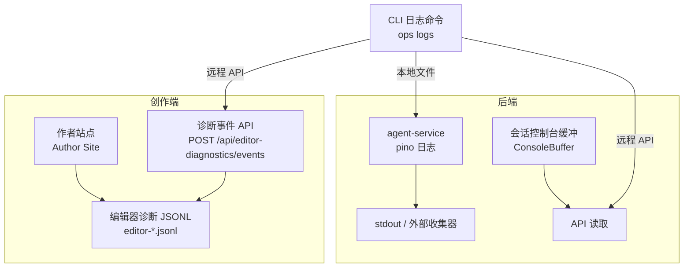
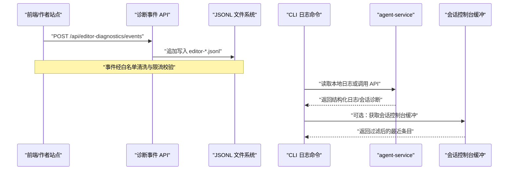
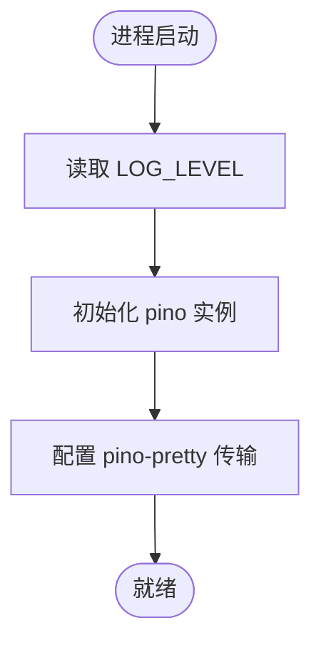
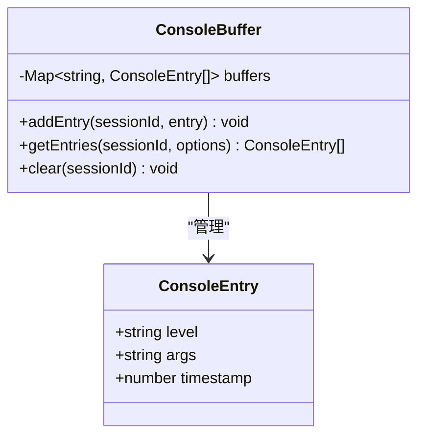
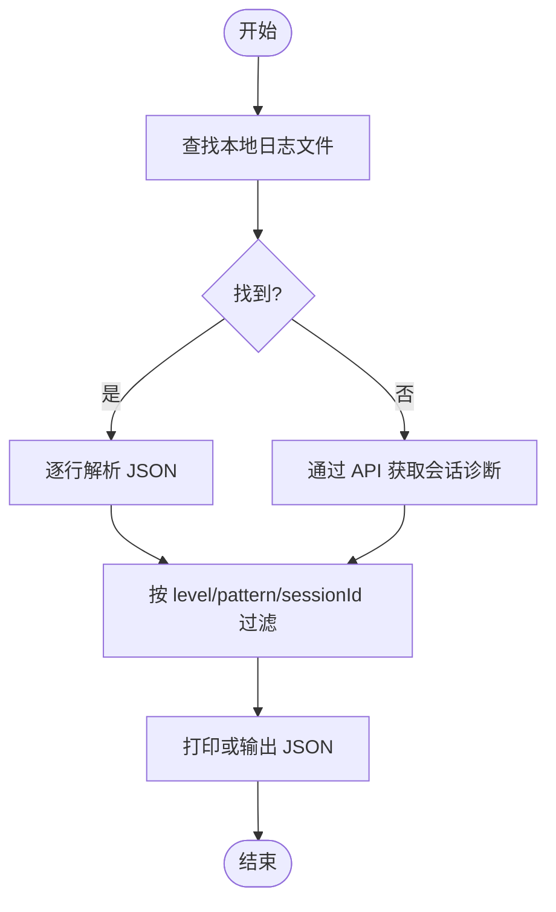
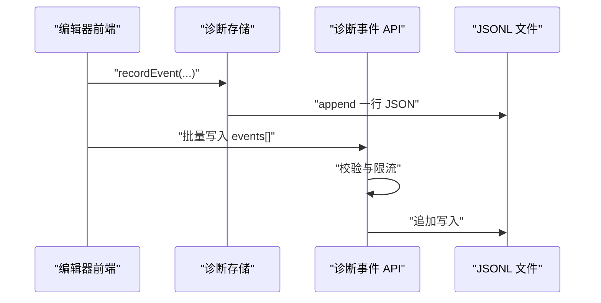
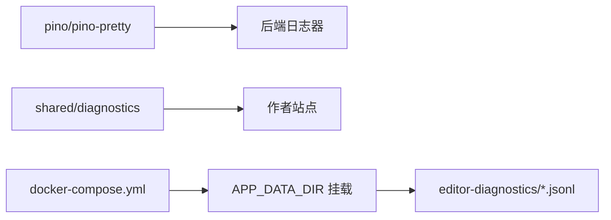

# 日志分析

<cite>
**本文引用的文件**   
- [packages/agent-service/src/utils/logger.ts](file://packages/agent-service/src/utils/logger.ts)
- [packages/agent-service/src/session/console-buffer.ts](file://packages/agent-service/src/session/console-buffer.ts)
- [OPS/CLI/src/commands/logs.ts](file://OPS/CLI/src/commands/logs.ts)
- [OPS/CLI/src/types.ts](file://OPS/CLI/src/types.ts)
- [packages/shared/src/diagnostics.ts](file://packages/shared/src/diagnostics.ts)
- [packages/author-site/src/lib/editor-diagnostics/store.ts](file://packages/author-site/src/lib/editor-diagnostics/store.ts)
- [packages/author-site/src/app/api/editor-diagnostics/events/route.ts](file://packages/author-site/src/app/api/editor-diagnostics/events/route.ts)
- [docker-compose.yml](file://docker-compose.yml)
- [data/editor-diagnostics/editor-027234bf-e511-467f-8a82-de65c0685796.jsonl](file://data/editor-diagnostics/editor-027234bf-e511-467f-8a82-de65c0685796.jsonl)
</cite>

## 目录
1. [简介](#简介)
2. [项目结构](#项目结构)
3. [核心组件](#核心组件)
4. [架构总览](#架构总览)
5. [详细组件分析](#详细组件分析)
6. [依赖关系分析](#依赖关系分析)
7. [性能与容量规划](#性能与容量规划)
8. [故障排查指南](#故障排查指南)
9. [结论](#结论)
10. [附录](#附录)

## 简介
本指南面向 Workbench 平台的运维、开发与测试人员，系统化说明系统日志结构与字段含义、日志级别配置、使用 CLI 工具进行日志采集与分析的方法（含实时查看、过滤与错误追踪），并给出编辑器诊断日志的分析路径与最佳实践。同时提供日志轮转、存储优化与长期保留策略建议，帮助快速定位前端组件问题与性能瓶颈。

## 项目结构
Workbench 的日志体系由三部分构成：
- 后端服务日志：基于 pino 输出结构化 JSON 日志，默认输出到 stdout，可通过环境变量控制级别。
- 会话控制台缓冲：按会话缓存最近若干条控制台消息，支持按级别、时间、数量过滤。
- 编辑器诊断日志：前端与 Author API 写入 JSONL 文件，包含协作、自动保存、预览、AI 等事件，便于回溯与导出。

图表来源
- [packages/agent-service/src/utils/logger.ts:14-30](file://packages/agent-service/src/utils/logger.ts#L14-L30)
- [packages/agent-service/src/session/console-buffer.ts:1-46](file://packages/agent-service/src/session/console-buffer.ts#L1-L46)
- [packages/author-site/src/app/api/editor-diagnostics/events/route.ts:43-72](file://packages/author-site/src/app/api/editor-diagnostics/events/route.ts#L43-L72)
- [OPS/CLI/src/commands/logs.ts:22-59](file://OPS/CLI/src/commands/logs.ts#L22-L59)

章节来源
- [packages/agent-service/src/utils/logger.ts:14-30](file://packages/agent-service/src/utils/logger.ts#L14-L30)
- [packages/agent-service/src/session/console-buffer.ts:1-46](file://packages/agent-service/src/session/console-buffer.ts#L1-L46)
- [packages/author-site/src/app/api/editor-diagnostics/events/route.ts:43-72](file://packages/author-site/src/app/api/editor-diagnostics/events/route.ts#L43-L72)
- [OPS/CLI/src/commands/logs.ts:22-59](file://OPS/CLI/src/commands/logs.ts#L22-L59)

## 核心组件
- 后端日志器
  - 使用 pino 创建 logger，通过环境变量 LOG_LEVEL 控制级别，默认 info；使用 pino-pretty 做终端美化输出。
- 会话控制台缓冲
  - 以 Map 维护每个会话的最近 N 条控制台条目，支持按 level、since、limit 过滤，单会话上限固定。
- CLI 日志采集
  - 优先在本地查找 agent-service 日志文件；若未找到则回退到通过 API 拉取会话诊断信息；支持 level/pattern/sessionId 过滤与 JSON 输出。
- 编辑器诊断
  - 统一事件模型与白名单清洗，持久化为 JSONL；提供读取与批量写入 API，限制单次写入条数与格式校验。

章节来源
- [packages/agent-service/src/utils/logger.ts:14-30](file://packages/agent-service/src/utils/logger.ts#L14-L30)
- [packages/agent-service/src/session/console-buffer.ts:1-46](file://packages/agent-service/src/session/console-buffer.ts#L1-L46)
- [OPS/CLI/src/commands/logs.ts:22-59](file://OPS/CLI/src/commands/logs.ts#L22-L59)
- [packages/shared/src/diagnostics.ts:449-475](file://packages/shared/src/diagnostics.ts#L449-L475)
- [packages/author-site/src/app/api/editor-diagnostics/events/route.ts:43-72](file://packages/author-site/src/app/api/editor-diagnostics/events/route.ts#L43-L72)

## 架构总览
下图展示从前端到后端的诊断事件流与 CLI 采集路径。

图表来源
- [packages/author-site/src/app/api/editor-diagnostics/events/route.ts:43-72](file://packages/author-site/src/app/api/editor-diagnostics/events/route.ts#L43-L72)
- [packages/author-site/src/lib/editor-diagnostics/store.ts:330-373](file://packages/author-site/src/lib/editor-diagnostics/store.ts#L330-L373)
- [OPS/CLI/src/commands/logs.ts:22-59](file://OPS/CLI/src/commands/logs.ts#L22-L59)
- [packages/agent-service/src/session/console-buffer.ts:23-39](file://packages/agent-service/src/session/console-buffer.ts#L23-L39)

## 详细组件分析

### 后端日志器（pino）
- 关键特性
  - 级别控制：LOG_LEVEL 环境变量，默认 info。
  - 序列化：err/error 标准序列化，便于堆栈可读。
  - 传输：pino-pretty 用于终端彩色输出与时间格式化。
- 典型字段
  - level/time/msg 为标准字段；其他业务字段随上下文附加。
- 配置要点
  - 生产环境建议关闭 pretty 传输，改为文件/管道输出以便集中收集。

图表来源
- [packages/agent-service/src/utils/logger.ts:14-30](file://packages/agent-service/src/utils/logger.ts#L14-L30)

章节来源
- [packages/agent-service/src/utils/logger.ts:14-30](file://packages/agent-service/src/utils/logger.ts#L14-L30)

### 会话控制台缓冲（ConsoleBuffer）
- 数据结构
  - 每条记录包含 level、args、timestamp。
  - 内存中按 sessionId 分桶，单会话最多保留固定数量的最近条目。
- 查询能力
  - 支持按 level、since（时间戳）、limit 过滤，返回最近 N 条。
- 复杂度
  - 插入 O(1)，过滤 O(N)（N 为会话条目数）。

图表来源
- [packages/agent-service/src/session/console-buffer.ts:1-46](file://packages/agent-service/src/session/console-buffer.ts#L1-L46)

章节来源
- [packages/agent-service/src/session/console-buffer.ts:1-46](file://packages/agent-service/src/session/console-buffer.ts#L1-L46)

### CLI 日志采集命令
- 行为流程
  - 优先在多个候选路径下查找日志文件；若存在则直接解析本地文件。
  - 若不存在，提示仅输出到 stdout，并通过 API 拉取会话诊断作为替代。
  - 支持 level/pattern/sessionId 过滤，结果可 JSON 输出。
- 级别映射
  - trace=10, debug=20, info=30, warn=40, error=50, fatal=60。
- 过滤逻辑
  - 对 msg 与整行 JSON 进行模式匹配；sessionId 全文匹配。

图表来源
- [OPS/CLI/src/commands/logs.ts:22-59](file://OPS/CLI/src/commands/logs.ts#L22-L59)
- [OPS/CLI/src/commands/logs.ts:75-129](file://OPS/CLI/src/commands/logs.ts#L75-L129)
- [OPS/CLI/src/commands/logs.ts:253-276](file://OPS/CLI/src/commands/logs.ts#L253-L276)

章节来源
- [OPS/CLI/src/commands/logs.ts:22-59](file://OPS/CLI/src/commands/logs.ts#L22-L59)
- [OPS/CLI/src/commands/logs.ts:75-129](file://OPS/CLI/src/commands/logs.ts#L75-L129)
- [OPS/CLI/src/commands/logs.ts:253-276](file://OPS/CLI/src/commands/logs.ts#L253-L276)
- [OPS/CLI/src/types.ts:157-174](file://OPS/CLI/src/types.ts#L157-L174)

### 编辑器诊断日志
- 事件模型
  - 统一 schemaVersion、ts、source、level、eventGroup、eventType、payload 等字段。
  - payload 经过白名单与敏感键过滤，超长文本截断，禁止字段摘要化。
- 存储与读取
  - 按 editorSessionId 生成 editor-*.jsonl 文件；读取时跳过无效行并标记警告。
- 写入 API
  - 校验事件非空、长度上限、格式合法性；失败返回明确错误码。

图表来源
- [packages/shared/src/diagnostics.ts:449-475](file://packages/shared/src/diagnostics.ts#L449-L475)
- [packages/author-site/src/lib/editor-diagnostics/store.ts:330-373](file://packages/author-site/src/lib/editor-diagnostics/store.ts#L330-L373)
- [packages/author-site/src/app/api/editor-diagnostics/events/route.ts:43-72](file://packages/author-site/src/app/api/editor-diagnostics/events/route.ts#L43-L72)

章节来源
- [packages/shared/src/diagnostics.ts:449-475](file://packages/shared/src/diagnostics.ts#L449-L475)
- [packages/author-site/src/lib/editor-diagnostics/store.ts:330-373](file://packages/author-site/src/lib/editor-diagnostics/store.ts#L330-L373)
- [packages/author-site/src/app/api/editor-diagnostics/events/route.ts:43-72](file://packages/author-site/src/app/api/editor-diagnostics/events/route.ts#L43-L72)

## 依赖关系分析
- 运行时依赖
  - pino 与 pino-pretty 用于结构化日志与美化输出。
  - 诊断事件模型 shared 被 author-site 与相关模块复用。
- 部署与环境
  - docker-compose 暴露端口、挂载数据卷、设置环境变量；APP_DATA_DIR 决定数据落盘位置。
- 数据持久化
  - 诊断 JSONL 位于 APP_DATA_DIR 下的 editor-diagnostics 目录。

图表来源
- [docker-compose.yml:1-140](file://docker-compose.yml#L1-L140)
- [packages/agent-service/src/utils/logger.ts:14-30](file://packages/agent-service/src/utils/logger.ts#L14-L30)
- [packages/shared/src/diagnostics.ts:449-475](file://packages/shared/src/diagnostics.ts#L449-L475)

章节来源
- [docker-compose.yml:1-140](file://docker-compose.yml#L1-L140)
- [packages/agent-service/src/utils/logger.ts:14-30](file://packages/agent-service/src/utils/logger.ts#L14-L30)
- [packages/shared/src/diagnostics.ts:449-475](file://packages/shared/src/diagnostics.ts#L449-L475)

## 性能与容量规划
- 日志级别
  - 开发/调试使用 debug/trace；生产默认 info，必要时临时提升级别并缩短采样窗口。
- 缓冲区大小
  - 会话控制台缓冲单会话上限固定，避免无限增长；如需更长时间跨度，应落地到磁盘或远端。
- I/O 与吞吐
  - 诊断事件写入采用 JSONL 追加，适合高并发场景；注意批量写入上限与失败重试。
- 存储与轮转
  - 建议结合外部日志收集器（如 journald、Filebeat、Fluent Bit）实现轮转与归档。
- 资源约束
  - 容器 CPU/内存/PIDs 限制已在 compose 中定义，需根据实际负载调整。

[本节为通用指导，不直接分析具体文件]

## 故障排查指南
- 无法找到本地日志文件
  - CLI 会提示仅输出到 stdout，请改用 API 方式获取会话诊断或通过容器日志查看。
- 诊断事件写入失败
  - 检查请求体是否为数组且非空、长度是否超过上限、事件结构是否符合要求。
- 编辑器诊断异常
  - 关注 invalid_jsonl_line 告警；确认写入端编码与换行符正确。
- 预览编译错误与自动修复
  - 通过 preview.error 与 ai.auto_repair_triggered 事件关联定位问题根因。

章节来源
- [OPS/CLI/src/commands/logs.ts:33-48](file://OPS/CLI/src/commands/logs.ts#L33-L48)
- [packages/author-site/src/app/api/editor-diagnostics/events/route.ts:43-72](file://packages/author-site/src/app/api/editor-diagnostics/events/route.ts#L43-L72)
- [packages/author-site/src/lib/editor-diagnostics/store.ts:330-373](file://packages/author-site/src/lib/editor-diagnostics/store.ts#L330-L373)
- [data/editor-diagnostics/editor-027234bf-e511-467f-8a82-de65c0685796.jsonl:39-42](file://data/editor-diagnostics/editor-027234bf-e511-467f-8a82-de65c0685796.jsonl#L39-L42)

## 结论
Workbench 的日志体系围绕“结构化后端日志 + 会话控制台缓冲 + 编辑器诊断 JSONL”构建，配合 CLI 工具可实现高效采集、过滤与问题定位。在生产环境中，建议启用外部日志收集与轮转策略，并对诊断事件进行合理的限流与保留策略，确保可观测性与成本平衡。

## 附录

### 日志级别与关键字段
- 级别映射
  - trace=10, debug=20, info=30, warn=40, error=50, fatal=60。
- 后端日志关键字段
  - level、time、msg；其他字段随业务上下文附加。
- 编辑器诊断关键字段
  - id、schemaVersion、ts、source、level、eventGroup、eventType、projectId、sessionId、workspaceId、editorSessionId、traceId、pageId、payload。

章节来源
- [OPS/CLI/src/commands/logs.ts:253-276](file://OPS/CLI/src/commands/logs.ts#L253-L276)
- [packages/shared/src/diagnostics.ts:44-62](file://packages/shared/src/diagnostics.ts#L44-L62)

### 使用 CLI 采集与分析日志
- 基本用法
  - 本地优先：自动搜索常见路径并解析 JSON 日志。
  - 远程回退：当本地无日志时，通过 API 获取会话诊断。
- 过滤选项
  - level：按级别筛选（支持字符串或数字映射）。
  - pattern：对消息与整行 JSON 进行子串匹配。
  - sessionId：全文匹配会话 ID。
- 输出模式
  - 终端彩色显示或 JSON 输出，便于后续处理。

章节来源
- [OPS/CLI/src/commands/logs.ts:22-59](file://OPS/CLI/src/commands/logs.ts#L22-L59)
- [OPS/CLI/src/commands/logs.ts:75-129](file://OPS/CLI/src/commands/logs.ts#L75-L129)
- [OPS/CLI/src/types.ts:157-174](file://OPS/CLI/src/types.ts#L157-L174)

### 编辑器诊断日志分析方法
- 定位问题
  - 通过 eventGroup 分类（collab、autosave、preview、ai 等）快速聚焦领域。
  - 利用 traceId 串联跨阶段事件，还原完整链路。
- 性能瓶颈
  - 关注 preview.runtime_event 的阶段耗时与 compile_done/iframe_loaded 等节点。
  - 结合 autosave.flush_* 事件观察同步延迟与抖动。
- 错误追踪
  - 优先查看 preview.error 与 ai.auto_repair_triggered，再顺藤摸瓜至代码变更与提交。

章节来源
- [packages/shared/src/diagnostics.ts:173-398](file://packages/shared/src/diagnostics.ts#L173-L398)
- [data/editor-diagnostics/editor-027234bf-e511-467f-8a82-de65c0685796.jsonl:39-42](file://data/editor-diagnostics/editor-027234bf-e511-467f-8a82-de65c0685796.jsonl#L39-L42)

### 日志轮转、存储优化与长期保留策略
- 轮转
  - 建议使用外部工具按大小/时间切分，压缩归档，避免单文件过大影响解析性能。
- 存储优化
  - 生产环境关闭 pretty 传输，减少冗余字段；对大对象 payload 进行摘要化。
- 长期保留
  - 依据合规与需求设定保留周期；将历史数据迁移至冷存储或索引平台，便于检索与审计。

[本节为通用指导，不直接分析具体文件]