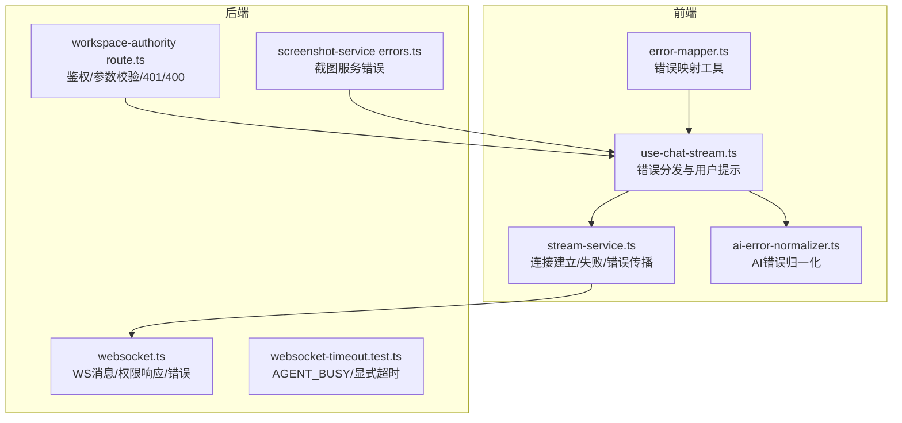
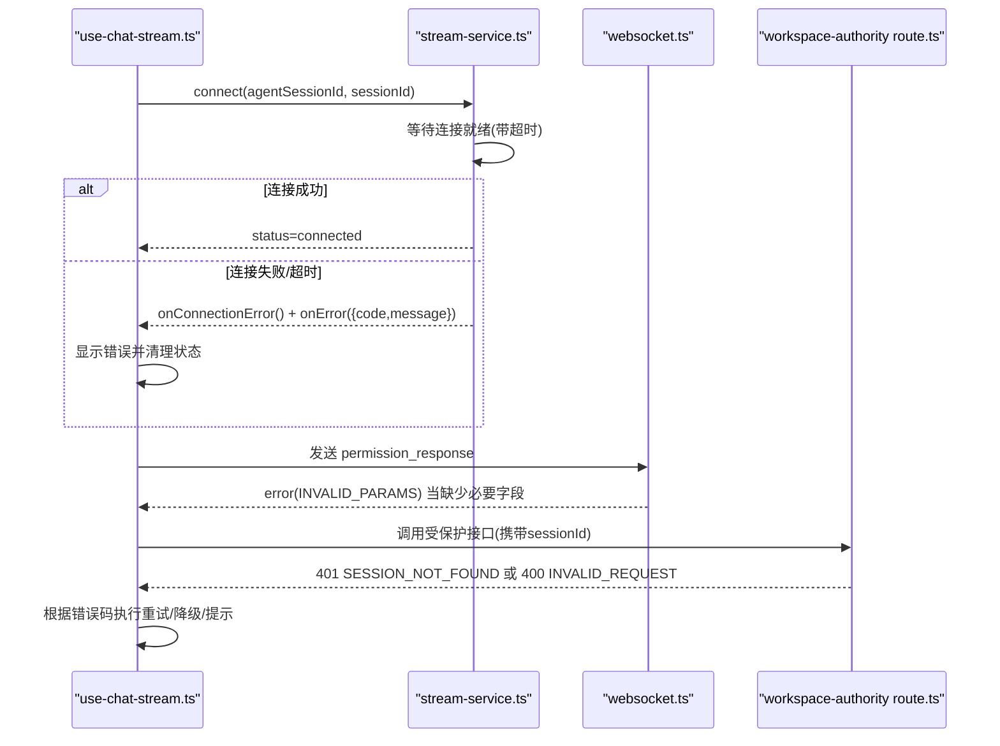
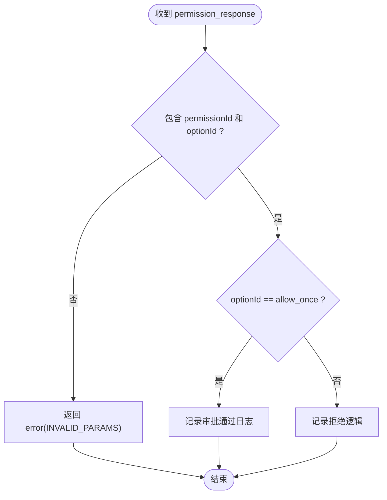
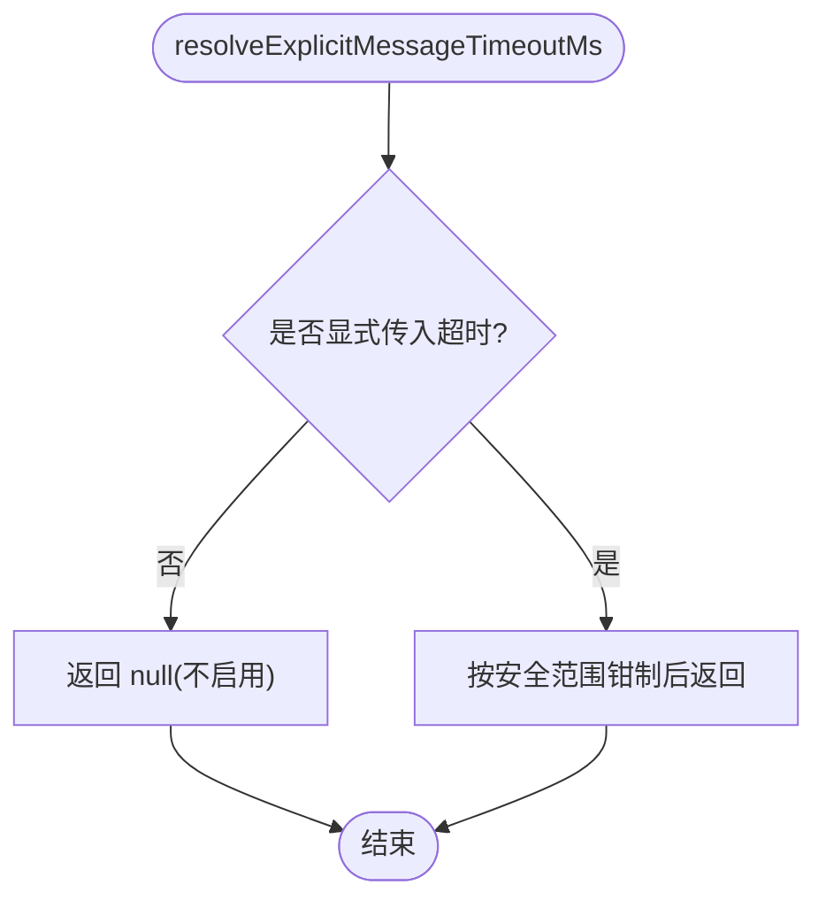
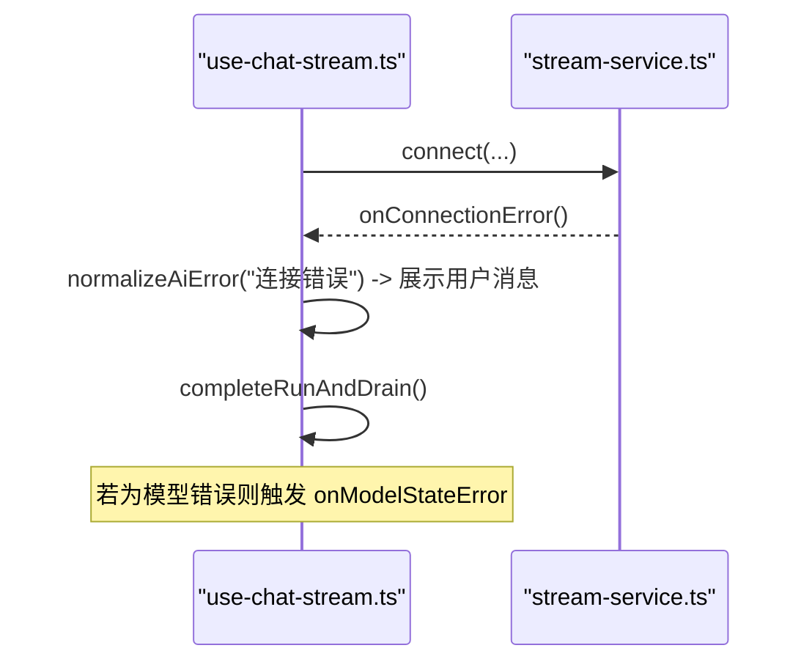
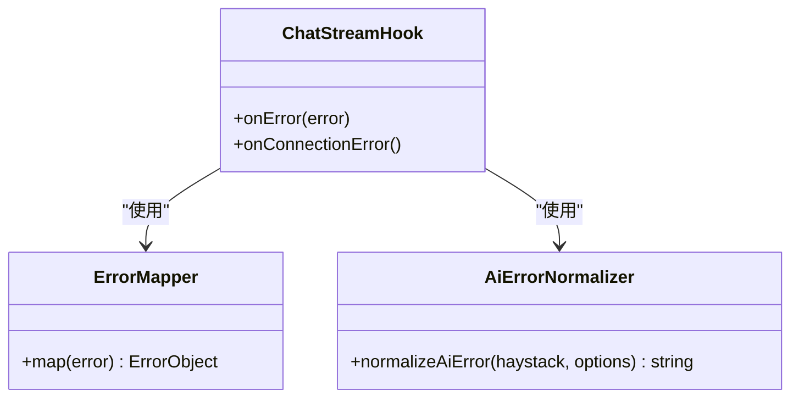
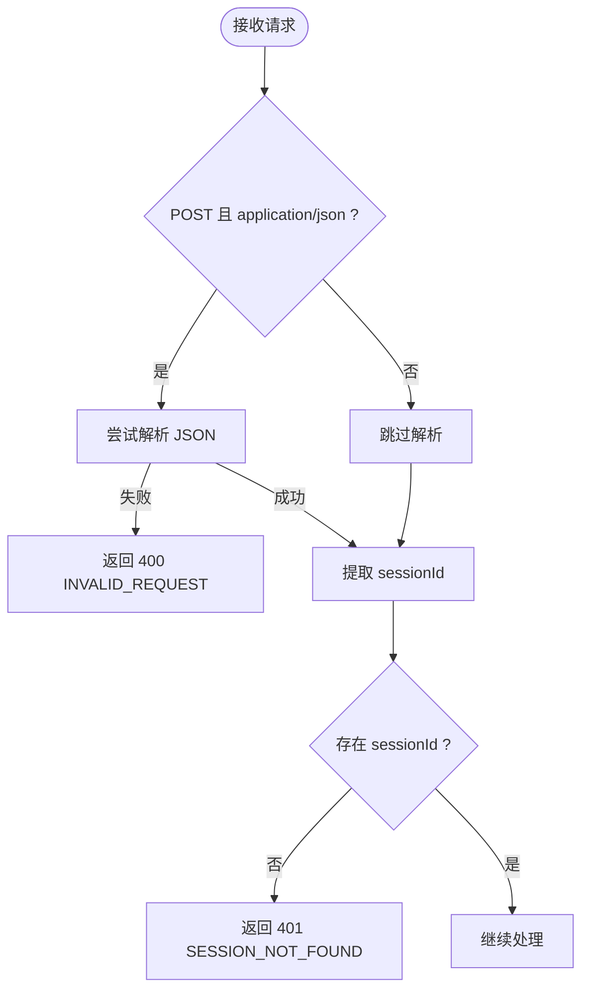
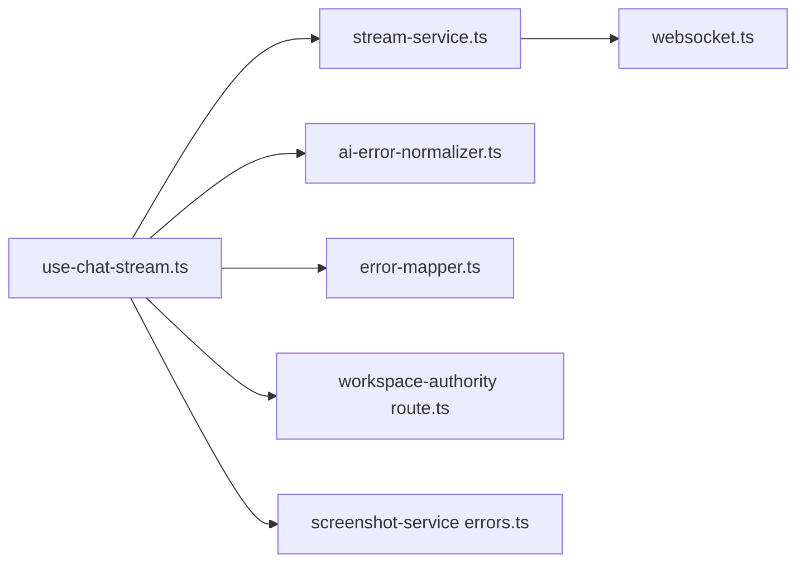

# 错误码参考

<cite>
**本文引用的文件**   
- [packages/agent-service/src/routes/websocket.ts](file://packages/agent-service/src/routes/websocket.ts)
- [packages/agent-service/tests/unit/websocket-timeout.test.ts](file://packages/agent-service/tests/unit/websocket-timeout.test.ts)
- [packages/author-site/src/components/ai-elements/chat/hooks/use-chat-stream.ts](file://packages/author-site/src/components/ai-elements/chat/hooks/use-chat-stream.ts)
- [packages/author-site/src/components/ai-elements/chat/services/stream-service.ts](file://packages/author-site/src/components/ai-elements/chat/services/stream-service.ts)
- [packages/shared/src/ai-error-normalizer.ts](file://packages/shared/src/ai-error-normalizer.ts)
- [packages/author-site/lib/error-mapper.ts](file://packages/author-site/lib/error-mapper.ts)
- [packages/screenshot-service/src/utils/errors.ts](file://packages/screenshot-service/src/utils/errors.ts)
- [packages/author-site/src/app/api/workspace-authority/[projectId]/[workspaceId]/[...segments]/route.ts](file://packages/author-site/src/app/api/workspace-authority/[projectId]/[workspaceId]/[...segments]/route.ts)
</cite>

## 目录
1. [简介](#简介)
2. [项目结构](#项目结构)
3. [核心组件](#核心组件)
4. [架构总览](#架构总览)
5. [详细组件分析](#详细组件分析)
6. [依赖关系分析](#依赖关系分析)
7. [性能与稳定性](#性能与稳定性)
8. [故障排查指南](#故障排查指南)
9. [结论](#结论)
10. [附录：错误码清单与迁移建议](#附录错误码清单与迁移建议)

## 简介
本手册面向 Workbench 平台的前后端开发者与运维人员，系统化梳理 HTTP、WebSocket 与业务错误码，覆盖认证授权、限流、连接异常、参数校验、服务端异常等常见场景。文档同时提供客户端处理最佳实践、调试技巧以及版本兼容与迁移建议，帮助快速定位问题并提升系统稳定性。

## 项目结构
围绕错误码相关的关键位置如下：
- WebSocket 路由与权限交互：packages/agent-service/src/routes/websocket.ts
- Agent 服务超时与忙状态测试用例：packages/agent-service/tests/unit/websocket-timeout.test.ts
- 前端聊天流式连接与错误分发：packages/author-site/src/components/ai-elements/chat/hooks/use-chat-stream.ts
- 前端流式连接封装与事件传播：packages/author-site/src/components/ai-elements/chat/services/stream-service.ts
- AI 错误归一化（将底层错误映射为统一分类）：packages/shared/src/ai-error-normalizer.ts
- 前端错误映射工具：packages/author-site/lib/error-mapper.ts
- 截图服务错误定义：packages/screenshot-service/src/utils/errors.ts
- 工作区权限 API 鉴权与错误返回：packages/author-site/src/app/api/workspace-authority/[projectId]/[workspaceId]/[...segments]/route.ts

**图示来源** 
- [packages/author-site/src/components/ai-elements/chat/hooks/use-chat-stream.ts](file://packages/author-site/src/components/ai-elements/chat/hooks/use-chat-stream.ts)
- [packages/author-site/src/components/ai-elements/chat/services/stream-service.ts](file://packages/author-site/src/components/ai-elements/chat/services/stream-service.ts)
- [packages/agent-service/src/routes/websocket.ts](file://packages/agent-service/src/routes/websocket.ts)
- [packages/agent-service/tests/unit/websocket-timeout.test.ts](file://packages/agent-service/tests/unit/websocket-timeout.test.ts)
- [packages/author-site/src/app/api/workspace-authority/[projectId]/[workspaceId]/[...segments]/route.ts](file://packages/author-site/src/app/api/workspace-authority/[projectId]/[workspaceId]/[...segments]/route.ts)
- [packages/shared/src/ai-error-normalizer.ts](file://packages/shared/src/ai-error-normalizer.ts)
- [packages/author-site/lib/error-mapper.ts](file://packages/author-site/lib/error-mapper.ts)
- [packages/screenshot-service/src/utils/errors.ts](file://packages/screenshot-service/src/utils/errors.ts)

**章节来源**
- [packages/agent-service/src/routes/websocket.ts](file://packages/agent-service/src/routes/websocket.ts)
- [packages/agent-service/tests/unit/websocket-timeout.test.ts](file://packages/agent-service/tests/unit/websocket-timeout.test.ts)
- [packages/author-site/src/components/ai-elements/chat/hooks/use-chat-stream.ts](file://packages/author-site/src/components/ai-elements/chat/hooks/use-chat-stream.ts)
- [packages/author-site/src/components/ai-elements/chat/services/stream-service.ts](file://packages/author-site/src/components/ai-elements/chat/services/stream-service.ts)
- [packages/shared/src/ai-error-normalizer.ts](file://packages/shared/src/ai-error-normalizer.ts)
- [packages/author-site/lib/error-mapper.ts](file://packages/author-site/lib/error-mapper.ts)
- [packages/screenshot-service/src/utils/errors.ts](file://packages/screenshot-service/src/utils/errors.ts)
- [packages/author-site/src/app/api/workspace-authority/[projectId]/[workspaceId]/[...segments]/route.ts](file://packages/author-site/src/app/api/workspace-authority/[projectId]/[workspaceId]/[...segments]/route.ts)

## 核心组件
- WebSocket 路由层：负责 WS 协议消息解析、权限审批回调、错误消息回写。
- 前端流式连接：封装连接生命周期、超时控制、错误事件分发与降级策略。
- 错误归一化与映射：将不同来源的错误信息统一归类，便于前端展示与埋点。
- 鉴权与权限校验：对请求路径与方法进行白名单校验，缺失会话标识时返回未认证错误。
- 截图服务错误：独立服务的错误类型定义，供上层统一捕获。

**章节来源**
- [packages/agent-service/src/routes/websocket.ts](file://packages/agent-service/src/routes/websocket.ts)
- [packages/author-site/src/components/ai-elements/chat/services/stream-service.ts](file://packages/author-site/src/components/ai-elements/chat/services/stream-service.ts)
- [packages/shared/src/ai-error-normalizer.ts](file://packages/shared/src/ai-error-normalizer.ts)
- [packages/author-site/lib/error-mapper.ts](file://packages/author-site/lib/error-mapper.ts)
- [packages/screenshot-service/src/utils/errors.ts](file://packages/screenshot-service/src/utils/errors.ts)
- [packages/author-site/src/app/api/workspace-authority/[projectId]/[workspaceId]/[...segments]/route.ts](file://packages/author-site/src/app/api/workspace-authority/[projectId]/[workspaceId]/[...segments]/route.ts)

## 架构总览
以下序列图展示了“聊天流式连接”的完整错误处理流程，包括连接建立、错误传播、降级与非流式回退。

**图示来源** 
- [packages/author-site/src/components/ai-elements/chat/hooks/use-chat-stream.ts](file://packages/author-site/src/components/ai-elements/chat/hooks/use-chat-stream.ts)
- [packages/author-site/src/components/ai-elements/chat/services/stream-service.ts](file://packages/author-site/src/components/ai-elements/chat/services/stream-service.ts)
- [packages/agent-service/src/routes/websocket.ts](file://packages/agent-service/src/routes/websocket.ts)
- [packages/author-site/src/app/api/workspace-authority/[projectId]/[workspaceId]/[...segments]/route.ts](file://packages/author-site/src/app/api/workspace-authority/[projectId]/[workspaceId]/[...segments]/route.ts)

## 详细组件分析

### WebSocket 错误与权限交互
- 权限响应参数校验：当 permission_response 缺少 permissionId 或 optionId 时，服务端返回错误码 INVALID_PARAMS。
- 心跳与状态：支持 ping/pong 心跳；连接建立前错误会触发 onConnectionError 与 onError。
- 错误传播：无论是否已建立连接，错误事件均会向上传播，确保前端能感知并处理。

**图示来源** 
- [packages/agent-service/src/routes/websocket.ts](file://packages/agent-service/src/routes/websocket.ts)

**章节来源**
- [packages/agent-service/src/routes/websocket.ts](file://packages/agent-service/src/routes/websocket.ts)
- [packages/author-site/src/components/ai-elements/chat/services/stream-service.ts](file://packages/author-site/src/components/ai-elements/chat/services/stream-service.ts)

### 连接超时与忙状态
- 显式消息超时：仅当调用方显式传入超时时才生效，不会由全局环境变量推断默认空闲取消截止时间。
- 忙状态：当上一轮 AI 请求仍在运行时，返回可重试的 AGENT_BUSY 错误，避免重复进入执行器。

**图示来源** 
- [packages/agent-service/tests/unit/websocket-timeout.test.ts](file://packages/agent-service/tests/unit/websocket-timeout.test.ts)

**章节来源**
- [packages/agent-service/tests/unit/websocket-timeout.test.ts](file://packages/agent-service/tests/unit/websocket-timeout.test.ts)

### 前端错误分发与降级
- 连接未建立时的错误：触发 onConnectionError 与 onError，并重置状态、展示错误消息。
- 模型相关错误：如 SESSION_NOT_FOUND、GET_MODELS_ERROR，会触发特定状态处理并终止运行。
- 事务删除通道不可用时：关闭连接并给出明确提示，随后走非流式模式回退。

**图示来源** 
- [packages/author-site/src/components/ai-elements/chat/hooks/use-chat-stream.ts](file://packages/author-site/src/components/ai-elements/chat/hooks/use-chat-stream.ts)
- [packages/author-site/src/components/ai-elements/chat/services/stream-service.ts](file://packages/author-site/src/components/ai-elements/chat/services/stream-service.ts)

**章节来源**
- [packages/author-site/src/components/ai-elements/chat/hooks/use-chat-stream.ts](file://packages/author-site/src/components/ai-elements/chat/hooks/use-chat-stream.ts)
- [packages/author-site/src/components/ai-elements/chat/services/stream-service.ts](file://packages/author-site/src/components/ai-elements/chat/services/stream-service.ts)

### 错误归一化与映射
- AI 错误归一化：根据错误文本中的关键字段（如 401/403、quota/rate limit/429、5xx/server/internal）将错误归类为 auth/quota/server/unknown，便于统一处理。
- 前端错误映射：通过 error-mapper.ts 将具体错误转换为统一的错误对象，配合 use-chat-stream 进行展示与埋点。

**图示来源** 
- [packages/shared/src/ai-error-normalizer.ts](file://packages/shared/src/ai-error-normalizer.ts)
- [packages/author-site/lib/error-mapper.ts](file://packages/author-site/lib/error-mapper.ts)
- [packages/author-site/src/components/ai-elements/chat/hooks/use-chat-stream.ts](file://packages/author-site/src/components/ai-elements/chat/hooks/use-chat-stream.ts)

**章节来源**
- [packages/shared/src/ai-error-normalizer.ts](file://packages/shared/src/ai-error-normalizer.ts)
- [packages/author-site/lib/error-mapper.ts](file://packages/author-site/lib/error-mapper.ts)
- [packages/author-site/src/components/ai-elements/chat/hooks/use-chat-stream.ts](file://packages/author-site/src/components/ai-elements/chat/hooks/use-chat-stream.ts)

### 鉴权与权限校验
- 工作区权限 API：对 endpoint 与方法进行白名单校验；当请求体 JSON 无效或缺少 sessionId 时分别返回 INVALID_REQUEST 与 SESSION_NOT_FOUND。
- 典型状态码：
  - 400：INVALID_REQUEST（参数/JSON 无效）
  - 401：SESSION_NOT_FOUND（未携带有效会话标识）

**图示来源** 
- [packages/author-site/src/app/api/workspace-authority/[projectId]/[workspaceId]/[...segments]/route.ts](file://packages/author-site/src/app/api/workspace-authority/[projectId]/[workspaceId]/[...segments]/route.ts)

**章节来源**
- [packages/author-site/src/app/api/workspace-authority/[projectId]/[workspaceId]/[...segments]/route.ts](file://packages/author-site/src/app/api/workspace-authority/[projectId]/[workspaceId]/[...segments]/route.ts)

## 依赖关系分析
- 前端模块依赖：
  - use-chat-stream.ts 依赖 stream-service.ts 提供的连接能力与事件。
  - use-chat-stream.ts 依赖 ai-error-normalizer.ts 与 error-mapper.ts 进行错误归一化与映射。
- 后端模块依赖：
  - websocket.ts 作为 WS 入口，向上游返回结构化错误。
  - workspace-authority route.ts 提供鉴权与参数校验，返回标准 HTTP 错误。
  - screenshot-service 的错误定义被上层消费以统一处理截图相关错误。

**图示来源** 
- [packages/author-site/src/components/ai-elements/chat/hooks/use-chat-stream.ts](file://packages/author-site/src/components/ai-elements/chat/hooks/use-chat-stream.ts)
- [packages/author-site/src/components/ai-elements/chat/services/stream-service.ts](file://packages/author-site/src/components/ai-elements/chat/services/stream-service.ts)
- [packages/agent-service/src/routes/websocket.ts](file://packages/agent-service/src/routes/websocket.ts)
- [packages/author-site/src/app/api/workspace-authority/[projectId]/[workspaceId]/[...segments]/route.ts](file://packages/author-site/src/app/api/workspace-authority/[projectId]/[workspaceId]/[...segments]/route.ts)
- [packages/shared/src/ai-error-normalizer.ts](file://packages/shared/src/ai-error-normalizer.ts)
- [packages/author-site/lib/error-mapper.ts](file://packages/author-site/lib/error-mapper.ts)
- [packages/screenshot-service/src/utils/errors.ts](file://packages/screenshot-service/src/utils/errors.ts)

**章节来源**
- [packages/author-site/src/components/ai-elements/chat/hooks/use-chat-stream.ts](file://packages/author-site/src/components/ai-elements/chat/hooks/use-chat-stream.ts)
- [packages/author-site/src/components/ai-elements/chat/services/stream-service.ts](file://packages/author-site/src/components/ai-elements/chat/services/stream-service.ts)
- [packages/agent-service/src/routes/websocket.ts](file://packages/agent-service/src/routes/websocket.ts)
- [packages/author-site/src/app/api/workspace-authority/[projectId]/[workspaceId]/[...segments]/route.ts](file://packages/author-site/src/app/api/workspace-authority/[projectId]/[workspaceId]/[...segments]/route.ts)
- [packages/shared/src/ai-error-normalizer.ts](file://packages/shared/src/ai-error-normalizer.ts)
- [packages/author-site/lib/error-mapper.ts](file://packages/author-site/lib/error-mapper.ts)
- [packages/screenshot-service/src/utils/errors.ts](file://packages/screenshot-service/src/utils/errors.ts)

## 性能与稳定性
- 显式超时控制：仅在调用方显式传入时才启用，避免误用全局配置导致意外中断。
- 忙状态保护：AGENT_BUSY 返回可重试标志，防止并发重入导致的资源竞争。
- 连接超时兜底：前端在连接阶段设置固定超时，避免长时间挂起影响用户体验。

**章节来源**
- [packages/agent-service/tests/unit/websocket-timeout.test.ts](file://packages/agent-service/tests/unit/websocket-timeout.test.ts)
- [packages/author-site/src/components/ai-elements/chat/services/stream-service.ts](file://packages/author-site/src/components/ai-elements/chat/services/stream-service.ts)

## 故障排查指南
- 连接失败
  - 现象：onConnectionError 触发，页面提示“WebSocket 连接失败”。
  - 排查：检查 Agent Service 是否运行、网络连通性、证书与代理配置。
  - 参考：[packages/author-site/src/components/ai-elements/chat/services/stream-service.ts](file://packages/author-site/src/components/ai-elements/chat/services/stream-service.ts)
- 权限响应参数缺失
  - 现象：返回 error(INVALID_PARAMS)。
  - 排查：确认 permissionId 与 optionId 是否齐全。
  - 参考：[packages/agent-service/src/routes/websocket.ts](file://packages/agent-service/src/routes/websocket.ts)
- 鉴权失败
  - 现象：401 SESSION_NOT_FOUND 或 400 INVALID_REQUEST。
  - 排查：确认请求头/查询参数中 sessionId 是否存在，JSON 格式是否正确。
  - 参考：[packages/author-site/src/app/api/workspace-authority/[projectId]/[workspaceId]/[...segments]/route.ts](file://packages/author-site/src/app/api/workspace-authority/[projectId]/[workspaceId]/[...segments]/route.ts)
- 模型错误
  - 现象：SESSION_NOT_FOUND、GET_MODELS_ERROR。
  - 处理：触发 onModelStateError，停止当前运行并提示用户刷新或重试。
  - 参考：[packages/author-site/src/components/ai-elements/chat/hooks/use-chat-stream.ts](file://packages/author-site/src/components/ai-elements/chat/hooks/use-chat-stream.ts)
- 限流与配额
  - 现象：429 或包含 quota/rate limit 的错误。
  - 处理：采用指数退避与抖动重试，降低瞬时峰值。
  - 参考：[packages/shared/src/ai-error-normalizer.ts](file://packages/shared/src/ai-error-normalizer.ts)

**章节来源**
- [packages/author-site/src/components/ai-elements/chat/services/stream-service.ts](file://packages/author-site/src/components/ai-elements/chat/services/stream-service.ts)
- [packages/agent-service/src/routes/websocket.ts](file://packages/agent-service/src/routes/websocket.ts)
- [packages/author-site/src/app/api/workspace-authority/[projectId]/[workspaceId]/[...segments]/route.ts](file://packages/author-site/src/app/api/workspace-authority/[projectId]/[workspaceId]/[...segments]/route.ts)
- [packages/author-site/src/components/ai-elements/chat/hooks/use-chat-stream.ts](file://packages/author-site/src/components/ai-elements/chat/hooks/use-chat-stream.ts)
- [packages/shared/src/ai-error-normalizer.ts](file://packages/shared/src/ai-error-normalizer.ts)

## 结论
Workbench 平台的错误体系以“标准化错误码 + 前端统一归一化”为核心，结合 WebSocket 与 HTTP 的双通道保障，实现了从连接、鉴权到业务处理的端到端错误治理。通过显式超时、忙状态保护与降级回退机制，系统在异常情况下仍能保持较好的可用性与用户体验。

## 附录：错误码清单与迁移建议

### HTTP 错误码
- 400 INVALID_REQUEST
  - 含义：请求参数或 JSON 无效。
  - 触发条件：请求体无法解析或不符合预期。
  - 处理建议：校验请求体结构，修正字段类型与必填项。
  - 参考：[packages/author-site/src/app/api/workspace-authority/[projectId]/[workspaceId]/[...segments]/route.ts](file://packages/author-site/src/app/api/workspace-authority/[projectId]/[workspaceId]/[...segments]/route.ts)
- 401 SESSION_NOT_FOUND
  - 含义：未携带有效会话标识。
  - 触发条件：请求中缺少 sessionId。
  - 处理建议：补充 sessionId 或重新登录获取新会话。
  - 参考：[packages/author-site/src/app/api/workspace-authority/[projectId]/[workspaceId]/[...segments]/route.ts](file://packages/author-site/src/app/api/workspace-authority/[projectId]/[workspaceId]/[...segments]/route.ts)

### WebSocket 错误码
- INVALID_PARAMS
  - 含义：权限响应参数缺失或不合法。
  - 触发条件：permission_response 缺少 permissionId 或 optionId。
  - 处理建议：补全必要字段后重试。
  - 参考：[packages/agent-service/src/routes/websocket.ts](file://packages/agent-service/src/routes/websocket.ts)
- AGENT_BUSY
  - 含义：上一轮 AI 请求仍在运行。
  - 触发条件：并发提交任务。
  - 处理建议：等待完成或先取消后再发送；客户端应实现可重试逻辑。
  - 参考：[packages/agent-service/tests/unit/websocket-timeout.test.ts](file://packages/agent-service/tests/unit/websocket-timeout.test.ts)

### 业务错误码
- SESSION_NOT_FOUND
  - 含义：会话不存在或失效。
  - 触发条件：会话创建失败或已被销毁。
  - 处理建议：重建会话并重试操作。
  - 参考：[packages/author-site/src/components/ai-elements/chat/hooks/use-chat-stream.ts](file://packages/author-site/src/components/ai-elements/chat/hooks/use-chat-stream.ts)
- GET_MODELS_ERROR
  - 含义：获取模型配置失败。
  - 触发条件：模型服务不可用或配置异常。
  - 处理建议：触发 onModelStateError，提示用户刷新或稍后重试。
  - 参考：[packages/author-site/src/components/ai-elements/chat/hooks/use-chat-stream.ts](file://packages/author-site/src/components/ai-elements/chat/hooks/use-chat-stream.ts)

### 认证授权相关
- JWT 令牌失效
  - 现象：HTTP 401 或 WS 鉴权失败。
  - 处理建议：刷新令牌后重试；必要时引导用户重新登录。
  - 参考：[packages/author-site/src/app/api/workspace-authority/[projectId]/[workspaceId]/[...segments]/route.ts](file://packages/author-site/src/app/api/workspace-authority/[projectId]/[workspaceId]/[...segments]/route.ts)
- 权限不足
  - 现象：403 或业务层拒绝访问。
  - 处理建议：提示用户申请权限或切换具备权限的账号。
  - 参考：[packages/shared/src/ai-error-normalizer.ts](file://packages/shared/src/ai-error-normalizer.ts)
- 用户鉴权失败
  - 现象：401 SESSION_NOT_FOUND。
  - 处理建议：检查 sessionId 传递与有效性，必要时重新发起鉴权流程。
  - 参考：[packages/author-site/src/app/api/workspace-authority/[projectId]/[workspaceId]/[...segments]/route.ts](file://packages/author-site/src/app/api/workspace-authority/[projectId]/[workspaceId]/[...segments]/route.ts)

### 客户端错误处理最佳实践
- 连接阶段
  - 设置连接超时；失败时触发 onConnectionError 并清理状态。
  - 参考：[packages/author-site/src/components/ai-elements/chat/services/stream-service.ts](file://packages/author-site/src/components/ai-elements/chat/services/stream-service.ts)
- 错误归一化
  - 使用 ai-error-normalizer 将错误分类为 auth/quota/server/unknown，统一处理。
  - 参考：[packages/shared/src/ai-error-normalizer.ts](file://packages/shared/src/ai-error-normalizer.ts)
- 限流与重试
  - 遇到 429 或 rate limit 时，采用指数退避与随机抖动。
  - 参考：[packages/shared/src/ai-error-normalizer.ts](file://packages/shared/src/ai-error-normalizer.ts)
- 降级策略
  - 事务删除通道不可用时，关闭连接并回退为非流式模式。
  - 参考：[packages/author-site/src/components/ai-elements/chat/hooks/use-chat-stream.ts](file://packages/author-site/src/components/ai-elements/chat/hooks/use-chat-stream.ts)

### 版本兼容与迁移指南
- 显式超时行为变更
  - 说明：不再从全局环境变量推断默认空闲取消截止时间，仅当显式传入时才启用。
  - 迁移建议：在需要严格超时的调用处显式传入超时值，并确保在安全范围内。
  - 参考：[packages/agent-service/tests/unit/websocket-timeout.test.ts](file://packages/agent-service/tests/unit/websocket-timeout.test.ts)
- WS 权限响应参数要求
  - 说明：permission_response 必须包含 permissionId 与 optionId。
  - 迁移建议：客户端在构造权限响应时校验必填字段，避免返回 INVALID_PARAMS。
  - 参考：[packages/agent-service/src/routes/websocket.ts](file://packages/agent-service/src/routes/websocket.ts)
- 鉴权错误码统一
  - 说明：工作区权限 API 统一返回 INVALID_REQUEST 与 SESSION_NOT_FOUND。
  - 迁移建议：客户端针对 400/401 做差异化处理，优先修复请求体与会话标识。
  - 参考：[packages/author-site/src/app/api/workspace-authority/[projectId]/[workspaceId]/[...segments]/route.ts](file://packages/author-site/src/app/api/workspace-authority/[projectId]/[workspaceId]/[...segments]/route.ts)