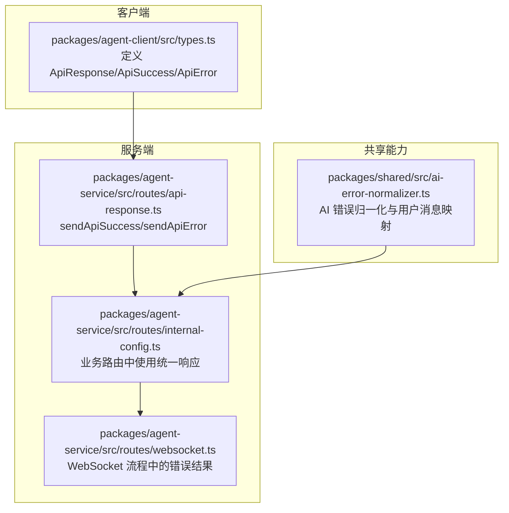
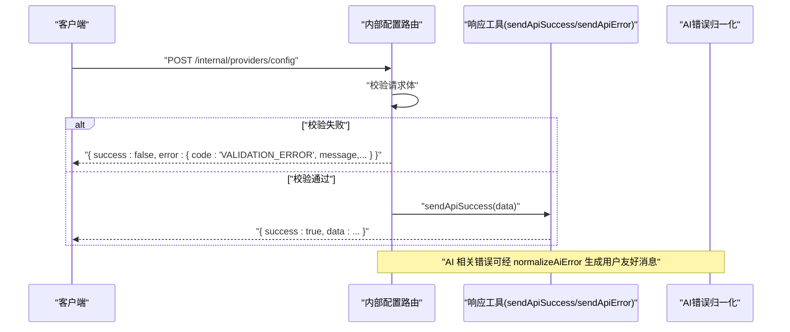
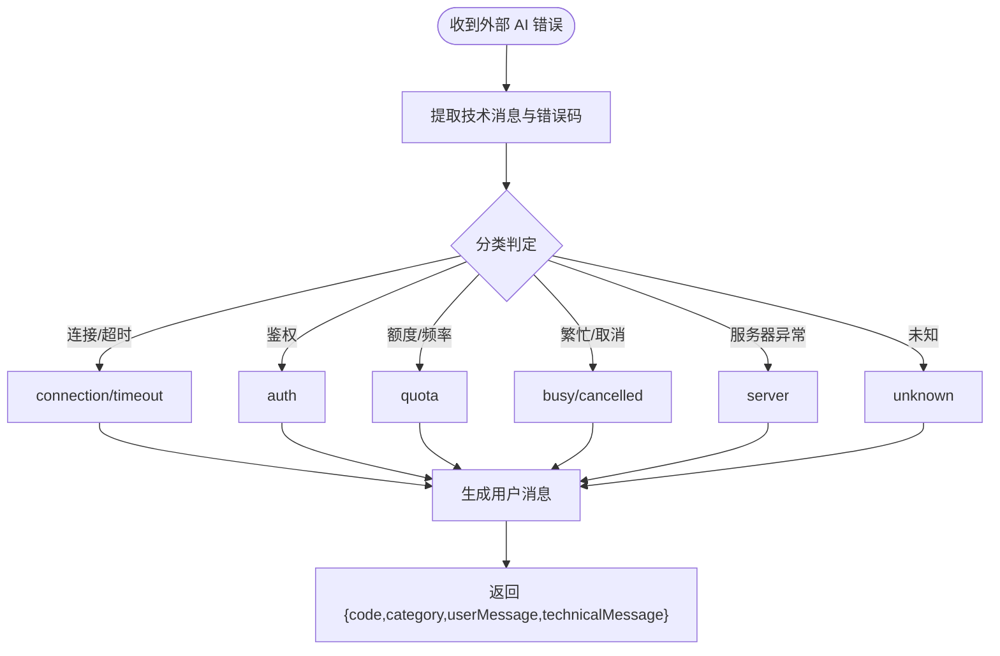
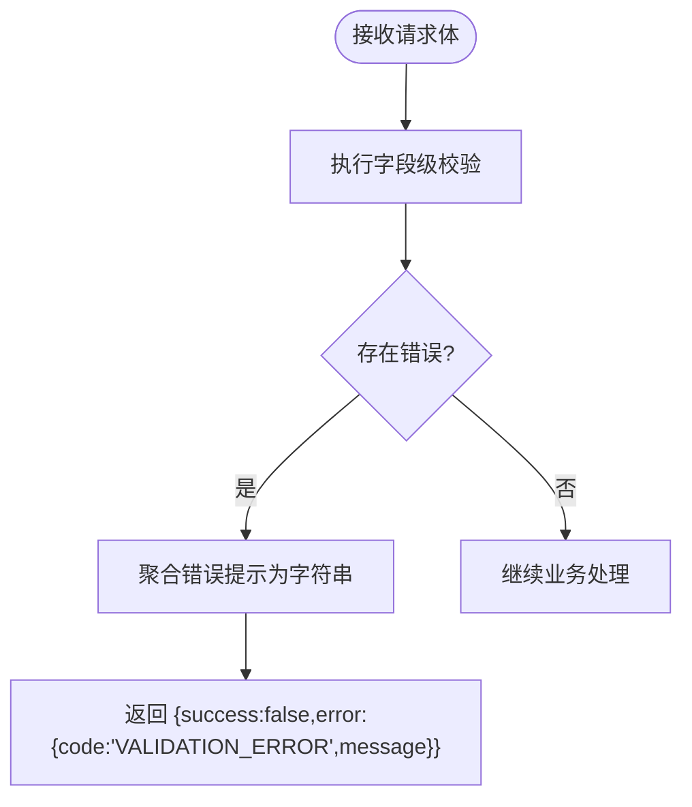
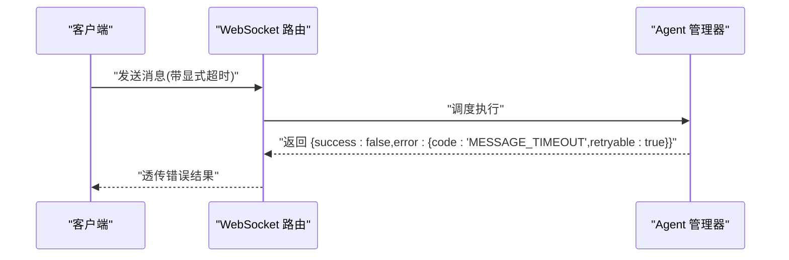
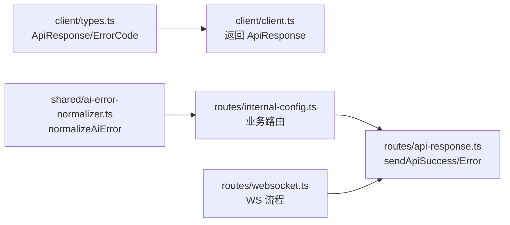

# API 响应模式

<cite>
**本文引用的文件**   
- [packages/agent-client/src/types.ts](file://packages/agent-client/src/types.ts)
- [packages/agent-service/src/routes/api-response.ts](file://packages/agent-service/src/routes/api-response.ts)
- [packages/agent-service/src/routes/internal-config.ts](file://packages/agent-service/src/routes/internal-config.ts)
- [packages/shared/src/ai-error-normalizer.ts](file://packages/shared/src/ai-error-normalizer.ts)
- [packages/author-site/lib/error-mapper.ts](file://packages/author-site/lib/error-mapper.ts)
- [packages/author-site/lib/validator.ts](file://packages/author-site/lib/validator.ts)
- [packages/agent-service/src/routes/websocket.ts](file://packages/agent-service/src/routes/websocket.ts)
- [packages/agent-service/tests/unit/websocket-timeout.test.ts](file://packages/agent-service/tests/unit/websocket-timeout.test.ts)
</cite>

## 目录
1. [简介](#简介)
2. [项目结构](#项目结构)
3. [核心组件](#核心组件)
4. [架构总览](#架构总览)
5. [详细组件分析](#详细组件分析)
6. [依赖关系分析](#依赖关系分析)
7. [性能与可靠性考虑](#性能与可靠性考虑)
8. [故障排查指南](#故障排查指南)
9. [结论](#结论)
10. [附录：调用示例与最佳实践](#附录调用示例与最佳实践)

## 简介
本文面向 Workbench 平台的 API 统一响应模式，系统性说明以下要点：
- 统一的响应格式设计：成功响应与错误响应的结构定义
- 错误码体系：ErrorCode 类型、错误消息映射与处理策略
- 通用响应包装器：成功数据封装与异常信息传递
- 请求验证错误的特殊处理：VALIDATION_ERROR 的错误详情格式
- 客户端错误处理最佳实践、重试机制设计与用户体验优化建议
- 完整的 API 调用示例与错误处理代码片段（以路径引用形式提供）

## 项目结构
Workbench 的 API 响应模式由“客户端契约”和“服务端实现”两部分共同约定：
- 客户端侧通过 TypeScript 类型明确 ApiResponse 联合类型，以及 ApiSuccess 与 ApiError 的结构
- 服务端在路由层使用统一的 sendApiSuccess/sendApiError 工具函数返回标准 JSON
- 业务路由中针对参数校验失败等场景，采用 VALIDATION_ERROR 错误码并附带结构化 message/details



图表来源
- [packages/agent-client/src/types.ts:146-160](file://packages/agent-client/src/types.ts#L146-L160)
- [packages/agent-service/src/routes/api-response.ts:9-25](file://packages/agent-service/src/routes/api-response.ts#L9-L25)
- [packages/agent-service/src/routes/internal-config.ts:350-388](file://packages/agent-service/src/routes/internal-config.ts#L350-L388)
- [packages/agent-service/src/routes/websocket.ts:402-423](file://packages/agent-service/src/routes/websocket.ts#L402-L423)
- [packages/shared/src/ai-error-normalizer.ts:140-156](file://packages/shared/src/ai-error-normalizer.ts#L140-L156)

章节来源
- [packages/agent-client/src/types.ts:146-160](file://packages/agent-client/src/types.ts#L146-L160)
- [packages/agent-service/src/routes/api-response.ts:9-25](file://packages/agent-service/src/routes/api-response.ts#L9-L25)
- [packages/agent-service/src/routes/internal-config.ts:350-388](file://packages/agent-service/src/routes/internal-config.ts#L350-L388)
- [packages/agent-service/src/routes/websocket.ts:402-423](file://packages/agent-service/src/routes/websocket.ts#L402-L423)
- [packages/shared/src/ai-error-normalizer.ts:140-156](file://packages/shared/src/ai-error-normalizer.ts#L140-L156)

## 核心组件
- 统一响应类型（客户端契约）
  - ApiResponse<T> = ApiSuccess<T> | ApiError
  - ApiSuccess<T>：包含 success=true 与 data:T
  - ApiError：包含 success=false 与 error:{ code, message, details? }
- 服务端响应工具
  - sendApiSuccess(reply, data)：返回 { success:true, data }
  - sendApiError(reply, statusCode, errorPayload)：返回 { success:false, error }
- 错误码体系
  - ErrorCode 枚举：如 INVALID_PARAMS、SESSION_NOT_FOUND、AGENT_NOT_INITIALIZED、BACKEND_UNAVAILABLE、MESSAGE_SEND_ERROR、FILE_ACCESS_DENIED、RATE_LIMIT_EXCEEDED、INTERNAL_ERROR
  - 其他常见错误码：VALIDATION_ERROR、INVALID_BODY、MESSAGE_TIMEOUT、AGENT_BUSY 等（在不同模块中使用）
- AI 错误归一化
  - normalizeAiError：将外部 AI 服务错误归一化为 { code, category, userMessage, technicalMessage }，便于上层统一展示与处理

章节来源
- [packages/agent-client/src/types.ts:10-18](file://packages/agent-client/src/types.ts#L10-L18)
- [packages/agent-client/src/types.ts:146-160](file://packages/agent-client/src/types.ts#L146-L160)
- [packages/agent-service/src/routes/api-response.ts:3-25](file://packages/agent-service/src/routes/api-response.ts#L3-L25)
- [packages/shared/src/ai-error-normalizer.ts:140-156](file://packages/shared/src/ai-error-normalizer.ts#L140-L156)

## 架构总览
API 响应从服务端到客户端的流转如下：
- 路由层根据业务逻辑构造成功或错误响应
- 成功响应通过 sendApiSuccess 封装为 { success:true, data }
- 错误响应通过 sendApiError 封装为 { success:false, error:{ code,message,details? } }
- 客户端按 ApiResponse<T> 进行类型判断与分支处理



图表来源
- [packages/agent-service/src/routes/internal-config.ts:350-388](file://packages/agent-service/src/routes/internal-config.ts#L350-L388)
- [packages/agent-service/src/routes/api-response.ts:9-25](file://packages/agent-service/src/routes/api-response.ts#L9-L25)
- [packages/shared/src/ai-error-normalizer.ts:140-156](file://packages/shared/src/ai-error-normalizer.ts#L140-L156)

## 详细组件分析

### 统一响应类型与包装器
- 客户端类型定义
  - ApiResponse<T> 联合类型，区分成功与错误两种形态
  - ApiSuccess<T> 携带 data 字段
  - ApiError 携带 error.code/message/details
- 服务端工具函数
  - sendApiSuccess：返回标准成功结构
  - sendApiError：设置 HTTP 状态码并返回标准错误结构

```mermaid
classDiagram
class ApiSuccess~T~ {
+boolean success = true
+T data
}
class ApiError {
+boolean success = false
+{ code : string; message : string; details? : unknown } error
}
class ApiResponse~T~ {
}
class SendApiSuccess {
+sendApiSuccess(reply, data)
}
class SendApiError {
+sendApiError(reply, statusCode, errorPayload)
}
ApiResponse~T~ <|-- ApiSuccess~T~
ApiResponse~T~ <|-- ApiError
SendApiSuccess --> ApiSuccess~T~ : "构造"
SendApiError --> ApiError : "构造"
```

图表来源
- [packages/agent-client/src/types.ts:146-160](file://packages/agent-client/src/types.ts#L146-L160)
- [packages/agent-service/src/routes/api-response.ts:9-25](file://packages/agent-service/src/routes/api-response.ts#L9-L25)

章节来源
- [packages/agent-client/src/types.ts:146-160](file://packages/agent-client/src/types.ts#L146-L160)
- [packages/agent-service/src/routes/api-response.ts:9-25](file://packages/agent-service/src/routes/api-response.ts#L9-L25)

### 错误码体系与消息映射
- 客户端 ErrorCode 枚举
  - 覆盖参数、会话、后端、鉴权、限流、权限、内部错误等典型场景
- 服务端常用错误码
  - VALIDATION_ERROR：请求体或参数校验失败
  - INVALID_BODY：请求体结构不合法
  - MESSAGE_TIMEOUT：消息处理超时
  - AGENT_BUSY：上一轮请求仍在运行
- AI 错误归一化
  - 将外部 AI 错误分类为 connection/timeout/auth/quota/busy/cancelled/server/unknown
  - 生成用户可读消息，便于前端直接展示



图表来源
- [packages/shared/src/ai-error-normalizer.ts:140-156](file://packages/shared/src/ai-error-normalizer.ts#L140-L156)

章节来源
- [packages/agent-client/src/types.ts:10-18](file://packages/agent-client/src/types.ts#L10-L18)
- [packages/agent-service/src/routes/internal-config.ts:350-388](file://packages/agent-service/src/routes/internal-config.ts#L350-L388)
- [packages/agent-service/src/routes/websocket.ts:402-423](file://packages/agent-service/src/routes/websocket.ts#L402-L423)
- [packages/shared/src/ai-error-normalizer.ts:140-156](file://packages/shared/src/ai-error-normalizer.ts#L140-L156)

### 请求验证错误的特殊处理（VALIDATION_ERROR）
- 服务端在参数校验失败时返回 VALIDATION_ERROR，message 通常拼接多条校验提示
- 作者站侧也广泛使用 VALIDATION_ERROR 表达表单/配置项校验失败
- 作者站还具备将底层 ValidationError 列表映射为用户友好摘要的能力



图表来源
- [packages/agent-service/src/routes/internal-config.ts:350-388](file://packages/agent-service/src/routes/internal-config.ts#L350-L388)
- [packages/author-site/lib/error-mapper.ts:1-35](file://packages/author-site/lib/error-mapper.ts#L1-L35)
- [packages/author-site/lib/validator.ts:1-29](file://packages/author-site/lib/validator.ts#L1-L29)

章节来源
- [packages/agent-service/src/routes/internal-config.ts:350-388](file://packages/agent-service/src/routes/internal-config.ts#L350-L388)
- [packages/author-site/lib/error-mapper.ts:1-35](file://packages/author-site/lib/error-mapper.ts#L1-L35)
- [packages/author-site/lib/validator.ts:1-29](file://packages/author-site/lib/validator.ts#L1-L29)

### WebSocket 流程中的错误结果
- 当消息处理超时时，返回 success=false 且 error.code=MESSAGE_TIMEOUT，同时标记 retryable=true
- 测试用例表明忙态会返回 AGENT_BUSY 错误，同样标记为可重试



图表来源
- [packages/agent-service/src/routes/websocket.ts:402-423](file://packages/agent-service/src/routes/websocket.ts#L402-L423)
- [packages/agent-service/tests/unit/websocket-timeout.test.ts:42-53](file://packages/agent-service/tests/unit/websocket-timeout.test.ts#L42-L53)

章节来源
- [packages/agent-service/src/routes/websocket.ts:402-423](file://packages/agent-service/src/routes/websocket.ts#L402-L423)
- [packages/agent-service/tests/unit/websocket-timeout.test.ts:42-53](file://packages/agent-service/tests/unit/websocket-timeout.test.ts#L42-L53)

## 依赖关系分析
- 客户端类型与客户端 SDK 强耦合：所有对外方法均返回 Promise<ApiResponse<T>>
- 服务端路由依赖响应工具函数，确保输出一致
- 业务路由对错误码有具体语义（如 VALIDATION_ERROR），并在多处复用
- AI 错误归一化作为共享能力，被上层用于生成用户可见消息



图表来源
- [packages/agent-client/src/types.ts:146-160](file://packages/agent-client/src/types.ts#L146-L160)
- [packages/agent-service/src/routes/api-response.ts:9-25](file://packages/agent-service/src/routes/api-response.ts#L9-L25)
- [packages/agent-service/src/routes/internal-config.ts:350-388](file://packages/agent-service/src/routes/internal-config.ts#L350-L388)
- [packages/agent-service/src/routes/websocket.ts:402-423](file://packages/agent-service/src/routes/websocket.ts#L402-L423)
- [packages/shared/src/ai-error-normalizer.ts:140-156](file://packages/shared/src/ai-error-normalizer.ts#L140-L156)

章节来源
- [packages/agent-client/src/types.ts:146-160](file://packages/agent-client/src/types.ts#L146-L160)
- [packages/agent-service/src/routes/api-response.ts:9-25](file://packages/agent-service/src/routes/api-response.ts#L9-L25)
- [packages/agent-service/src/routes/internal-config.ts:350-388](file://packages/agent-service/src/routes/internal-config.ts#L350-L388)
- [packages/agent-service/src/routes/websocket.ts:402-423](file://packages/agent-service/src/routes/websocket.ts#L402-L423)
- [packages/shared/src/ai-error-normalizer.ts:140-156](file://packages/shared/src/ai-error-normalizer.ts#L140-L156)

## 性能与可靠性考虑
- 合理设置显式超时：避免长耗时任务阻塞；对于 MESSAGE_TIMEOUT 应支持客户端重试
- 限流与退避：遇到 RATE_LIMIT_EXCEEDED 或 QUOTA 类错误，采用指数退避与抖动重试
- 幂等性：对可重试操作尽量保证幂等，避免重复提交导致副作用
- 降级与兜底：AI 服务不可用时，返回用户友好的 fallback 消息，并引导重试

[本节为通用指导，无需源码引用]

## 故障排查指南
- 定位错误码
  - 检查 response.error.code 是否为已知枚举值
  - 关注 VALIDATION_ERROR 的 message 内容，快速定位缺失或非法字段
- 查看详细信息
  - 若 error.details 存在，结合日志进一步分析
- 网络与超时
  - 出现 MESSAGE_TIMEOUT 时，确认客户端是否设置了合理的显式超时
- 重试策略
  - 仅对 retryable=true 的错误进行重试，并结合退避算法

章节来源
- [packages/agent-service/src/routes/websocket.ts:402-423](file://packages/agent-service/src/routes/websocket.ts#L402-L423)
- [packages/agent-service/tests/unit/websocket-timeout.test.ts:42-53](file://packages/agent-service/tests/unit/websocket-timeout.test.ts#L42-L53)

## 结论
Workbench 平台通过统一的 ApiResponse 联合类型与服务端响应工具函数，实现了跨模块一致的响应格式。配合明确的 ErrorCode 枚举与 AI 错误归一化能力，既保证了机器可读性，又提升了用户可读性。建议在客户端集中实现错误处理与重试策略，以获得稳定且友好的交互体验。

[本节为总结，无需源码引用]

## 附录：调用示例与最佳实践

### 统一响应结构参考
- 成功响应
  - 结构：{ success:true, data:<任意业务数据> }
  - 参考实现路径：[packages/agent-service/src/routes/api-response.ts:9-14](file://packages/agent-service/src/routes/api-response.ts#L9-L14)
- 错误响应
  - 结构：{ success:false, error:{ code:string, message:string, details?:any } }
  - 参考实现路径：[packages/agent-service/src/routes/api-response.ts:16-25](file://packages/agent-service/src/routes/api-response.ts#L16-L25)

章节来源
- [packages/agent-service/src/routes/api-response.ts:9-25](file://packages/agent-service/src/routes/api-response.ts#L9-L25)

### 请求验证错误（VALIDATION_ERROR）示例
- 服务端在参数校验失败时返回 VALIDATION_ERROR，message 为多条校验提示的拼接
- 参考路径：
  - [packages/agent-service/src/routes/internal-config.ts:350-388](file://packages/agent-service/src/routes/internal-config.ts#L350-L388)
  - [packages/author-site/lib/error-mapper.ts:1-35](file://packages/author-site/lib/error-mapper.ts#L1-L35)
  - [packages/author-site/lib/validator.ts:1-29](file://packages/author-site/lib/validator.ts#L1-L29)

章节来源
- [packages/agent-service/src/routes/internal-config.ts:350-388](file://packages/agent-service/src/routes/internal-config.ts#L350-L388)
- [packages/author-site/lib/error-mapper.ts:1-35](file://packages/author-site/lib/error-mapper.ts#L1-L35)
- [packages/author-site/lib/validator.ts:1-29](file://packages/author-site/lib/validator.ts#L1-L29)

### WebSocket 超时与重试示例
- 超时错误：error.code=MESSAGE_TIMEOUT，且 retryable=true
- 参考路径：
  - [packages/agent-service/src/routes/websocket.ts:402-423](file://packages/agent-service/src/routes/websocket.ts#L402-L423)
  - [packages/agent-service/tests/unit/websocket-timeout.test.ts:42-53](file://packages/agent-service/tests/unit/websocket-timeout.test.ts#L42-L53)

章节来源
- [packages/agent-service/src/routes/websocket.ts:402-423](file://packages/agent-service/src/routes/websocket.ts#L402-L423)
- [packages/agent-service/tests/unit/websocket-timeout.test.ts:42-53](file://packages/agent-service/tests/unit/websocket-timeout.test.ts#L42-L53)

### 客户端错误处理最佳实践
- 统一解析 ApiResponse<T>，先判断 success 再访问 data
- 对 error.code 做分支处理：
  - VALIDATION_ERROR：展示字段级错误提示
  - MESSAGE_TIMEOUT/AGENT_BUSY：允许重试，使用指数退避
  - RATE_LIMIT_EXCEEDED/QUOTA：延长等待时间并重试
  - INTERNAL_ERROR：记录日志并提示稍后重试
- 对用户展示的消息优先使用归一化的 userMessage（AI 错误场景）

章节来源
- [packages/agent-client/src/types.ts:146-160](file://packages/agent-client/src/types.ts#L146-L160)
- [packages/shared/src/ai-error-normalizer.ts:140-156](file://packages/shared/src/ai-error-normalizer.ts#L140-L156)