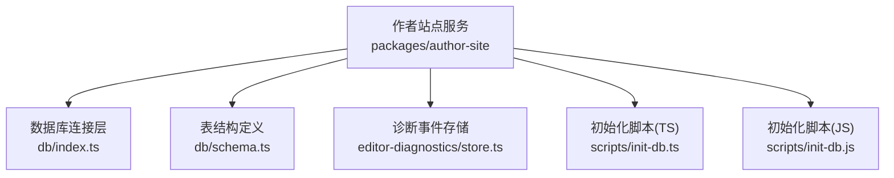
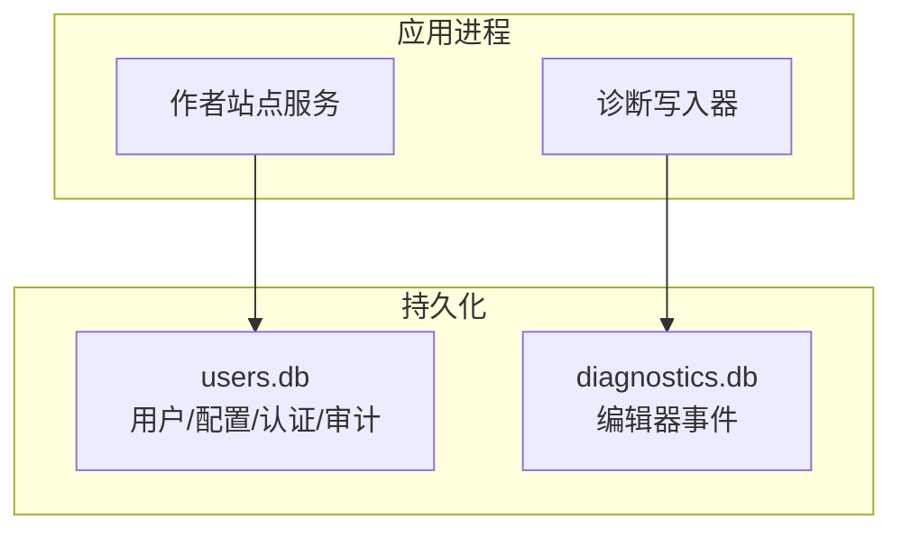
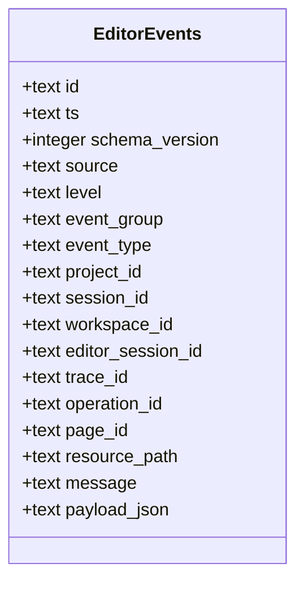
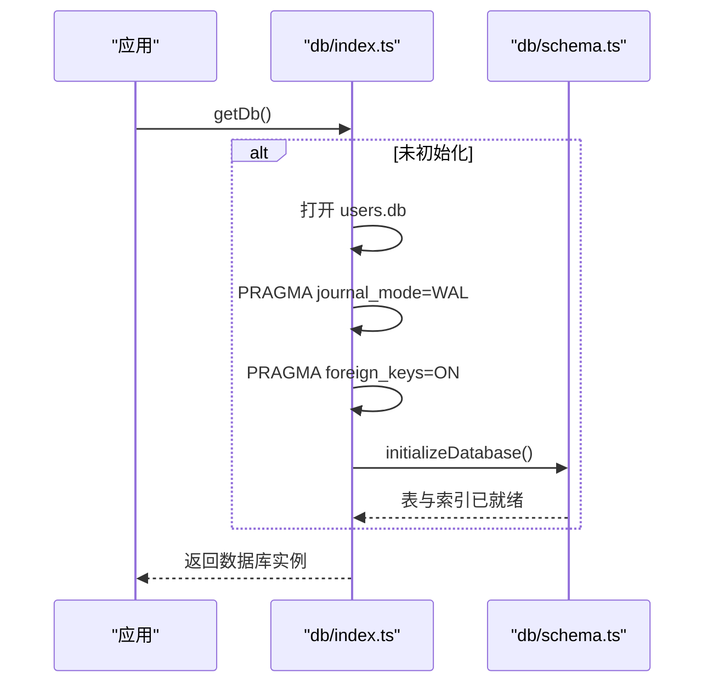
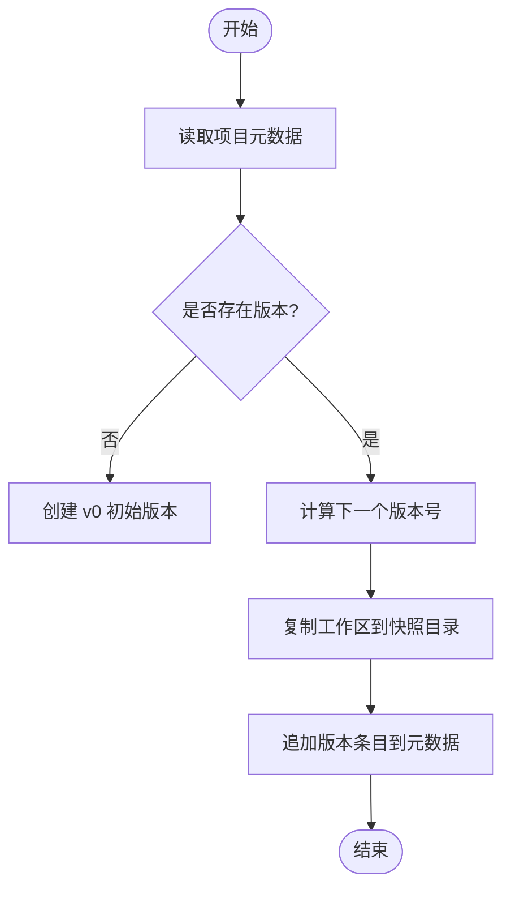
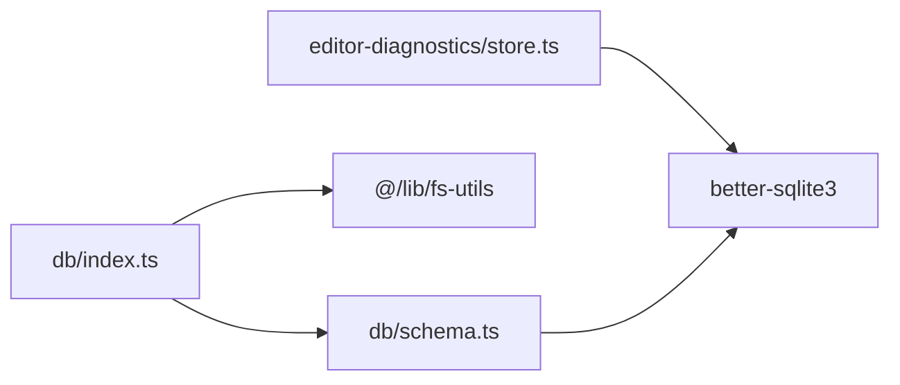

# 数据库设计

<cite>
**本文引用的文件**
- [packages/author-site/src/lib/db/index.ts](file://packages/author-site/src/lib/db/index.ts)
- [packages/author-site/src/lib/db/schema.ts](file://packages/author-site/src/lib/db/schema.ts)
- [packages/author-site/scripts/init-db.ts](file://packages/author-site/scripts/init-db.ts)
- [packages/author-site/scripts/init-db.js](file://packages/author-site/scripts/init-db.js)
- [packages/author-site/src/lib/editor-diagnostics/store.ts](file://packages/author-site/src/lib/editor-diagnostics/store.ts)
- [packages/project-core/src/service.ts](file://packages/project-core/src/service.ts)
- [packages/agent-service/src/workspace/project-workspace-manager.ts](file://packages/agent-service/src/workspace/project-workspace-manager.ts)
- [packages/author-site/src/lib/fs-utils.ts](file://packages/author-site/src/lib/fs-utils.ts)
- [packages/author-site/src/lib/workspace-manager.ts](file://packages/author-site/src/lib/workspace-manager.ts)
- [docs/项目文档/创作端/03-项目管理/技术/06_项目工作空间迁移方案.md](file://docs/项目文档/创作端/03-项目管理/技术/06_项目工作空间迁移方案.md)
</cite>

## 目录
1. [引言](#引言)
2. [项目结构](#项目结构)
3. [核心组件](#核心组件)
4. [架构总览](#架构总览)
5. [详细组件分析](#详细组件分析)
6. [依赖关系分析](#依赖关系分析)
7. [性能考虑](#性能考虑)
8. [故障排查指南](#故障排查指南)
9. [结论](#结论)
10. [附录](#附录)

## 引言
本文件面向 Workbench 平台的 SQLite 数据库设计与实现，聚焦以下目标：
- 梳理现有 SQLite 表结构与字段定义（用户、系统配置、认证与审计等）
- 说明主外键关系与数据完整性约束
- 解释索引策略与查询优化场景
- 描述数据库初始化与迁移现状（基于 schema 的幂等建表）
- 给出连接配置、事务管理与并发访问控制要点
- 提供 SQL 查询示例与调优建议
- 澄清“projects/sessions/workspaces/versions”等概念在当前代码库中的实际存储形态（文件系统为主，非 SQLite 表）

## 项目结构
Workbench 中涉及 SQLite 的部分主要位于 author-site 包内，包括：
- 数据库连接与初始化入口
- 表结构定义与索引创建
- 诊断事件存储（独立 SQLite 文件）
- 初始化脚本（TS/JS 双版本）



图表来源
- [packages/author-site/src/lib/db/index.ts:1-33](file://packages/author-site/src/lib/db/index.ts#L1-L33)
- [packages/author-site/src/lib/db/schema.ts:1-112](file://packages/author-site/src/lib/db/schema.ts#L1-L112)
- [packages/author-site/src/lib/editor-diagnostics/store.ts:65-100](file://packages/author-site/src/lib/editor-diagnostics/store.ts#L65-L100)
- [packages/author-site/scripts/init-db.ts:1-10](file://packages/author-site/scripts/init-db.ts#L1-L10)
- [packages/author-site/scripts/init-db.js:1-49](file://packages/author-site/scripts/init-db.js#L1-L49)

章节来源
- [packages/author-site/src/lib/db/index.ts:1-33](file://packages/author-site/src/lib/db/index.ts#L1-L33)
- [packages/author-site/src/lib/db/schema.ts:1-112](file://packages/author-site/src/lib/db/schema.ts#L1-L112)
- [packages/author-site/src/lib/editor-diagnostics/store.ts:65-100](file://packages/author-site/src/lib/editor-diagnostics/store.ts#L65-L100)
- [packages/author-site/scripts/init-db.ts:1-10](file://packages/author-site/scripts/init-db.ts#L1-L10)
- [packages/author-site/scripts/init-db.js:1-49](file://packages/author-site/scripts/init-db.js#L1-L49)

## 核心组件
- 数据库连接与初始化
  - 单例模式维护 better-sqlite3 实例
  - 启用 WAL 日志模式与外键约束
  - 首次启动时执行 schema 初始化
- 表结构与索引
  - 用户与认证相关表
  - 系统配置表
  - 钉钉身份与外部认证配置表
  - 密码重置日志表
  - 诊断事件表（独立数据库）
- 初始化脚本
  - TS/JS 两套脚本用于本地或 CI 环境快速初始化

章节来源
- [packages/author-site/src/lib/db/index.ts:10-24](file://packages/author-site/src/lib/db/index.ts#L10-L24)
- [packages/author-site/src/lib/db/schema.ts:6-98](file://packages/author-site/src/lib/db/schema.ts#L6-L98)
- [packages/author-site/src/lib/editor-diagnostics/store.ts:65-100](file://packages/author-site/src/lib/editor-diagnostics/store.ts#L65-L100)
- [packages/author-site/scripts/init-db.ts:1-10](file://packages/author-site/scripts/init-db.ts#L1-L10)
- [packages/author-site/scripts/init-db.js:1-49](file://packages/author-site/scripts/init-db.js#L1-L49)

## 架构总览
SQLite 在 Workbench 中承担两类职责：
- 应用元数据与权限相关持久化（users.db）
- 编辑器诊断事件归档（diagnostics.db）



图表来源
- [packages/author-site/src/lib/db/index.ts:10-24](file://packages/author-site/src/lib/db/index.ts#L10-L24)
- [packages/author-site/src/lib/editor-diagnostics/store.ts:65-100](file://packages/author-site/src/lib/editor-diagnostics/store.ts#L65-L100)

## 详细组件分析

### 用户与认证子系统（users.db）
- 表清单与用途
  - users：用户主数据
  - system_configs：全局系统配置
  - user_model_configs：用户模型配置
  - user_authoring_preferences：用户创作偏好
  - user_external_auth_configs：第三方认证配置
  - user_dingtalk_identities：钉钉身份绑定
  - password_reset_logs：密码重置审计日志
- 主键与外键
  - 各表以 TEXT 类型主键标识
  - 多张表通过 user_id 外键关联 users(id)，并设置级联删除
- 索引策略
  - 针对钉钉身份的多条件唯一索引与常用查询列索引
  - 针对密码重置日志的用户与时间索引

```mermaid
erDiagram
USERS {
text id PK
text username UK
text password_hash
integer created_at
}
SYSTEM_CONFIGS {
text id PK
text config_json
integer updated_at
text updated_by
}
USER_MODEL_CONFIGS {
text user_id PK
text config_json
integer updated_at
}
USER_AUTHORING_PREFERENCES {
text user_id PK
text preferences_json
integer updated_at
}
USER_EXTERNAL_AUTH_CONFIGS {
text user_id
text provider
text config_json
integer updated_at
primary_key(user_id, provider)
}
USER_DINGTALK_IDENTITIES {
text id PK
text user_id
text corp_id
text union_id
text dingtalk_user_id
text name
text avatar
text raw_json
integer created_at
integer updated_at
integer last_login_at
}
PASSWORD_RESET_LOGS {
text id PK
text user_id
text reset_by
text reset_method
integer created_at
}
USERS ||--o{ USER_MODEL_CONFIGS : "user_id FK"
USERS ||--o{ USER_AUTHORING_PREFERENCES : "user_id FK"
USERS ||--o{ USER_EXTERNAL_AUTH_CONFIGS : "user_id FK"
USERS ||--o{ USER_DINGTALK_IDENTITIES : "user_id FK"
USERS ||--o{ PASSWORD_RESET_LOGS : "user_id FK"
```

图表来源
- [packages/author-site/src/lib/db/schema.ts:6-98](file://packages/author-site/src/lib/db/schema.ts#L6-L98)

章节来源
- [packages/author-site/src/lib/db/schema.ts:6-98](file://packages/author-site/src/lib/db/schema.ts#L6-L98)

### 诊断事件存储（diagnostics.db）
- 表结构
  - editor_events：记录编辑器操作、会话、追踪、页面、资源路径等事件
- 索引策略
  - 按 project/session/editor_session/trace/operation/workspace/type/group 与时间戳组合索引，支持多维过滤与时间范围查询
- 使用方式
  - 独立数据库文件，WAL 模式，busy_timeout 提升并发稳定性



图表来源
- [packages/author-site/src/lib/editor-diagnostics/store.ts:65-100](file://packages/author-site/src/lib/editor-diagnostics/store.ts#L65-L100)

章节来源
- [packages/author-site/src/lib/editor-diagnostics/store.ts:65-100](file://packages/author-site/src/lib/editor-diagnostics/store.ts#L65-L100)

### 数据库连接与初始化流程
- 连接参数
  - journal_mode=WAL：提高读写并发能力
  - foreign_keys=ON：强制外键约束
- 初始化时机
  - 首次获取连接时执行 initializeDatabase()
  - 提供 closeDb() 释放资源
- 初始化脚本
  - TS/JS 脚本均调用初始化逻辑，便于本地/CI 一键准备



图表来源
- [packages/author-site/src/lib/db/index.ts:10-24](file://packages/author-site/src/lib/db/index.ts#L10-L24)
- [packages/author-site/src/lib/db/schema.ts:3-103](file://packages/author-site/src/lib/db/schema.ts#L3-L103)
- [packages/author-site/scripts/init-db.ts:1-10](file://packages/author-site/scripts/init-db.ts#L1-L10)
- [packages/author-site/scripts/init-db.js:1-49](file://packages/author-site/scripts/init-db.js#L1-L49)

章节来源
- [packages/author-site/src/lib/db/index.ts:10-24](file://packages/author-site/src/lib/db/index.ts#L10-L24)
- [packages/author-site/src/lib/db/schema.ts:3-103](file://packages/author-site/src/lib/db/schema.ts#L3-L103)
- [packages/author-site/scripts/init-db.ts:1-10](file://packages/author-site/scripts/init-db.ts#L1-L10)
- [packages/author-site/scripts/init-db.js:1-49](file://packages/author-site/scripts/init-db.js#L1-L49)

### 关于 projects/sessions/workspaces/versions 的数据存储
- 当前仓库中，这些实体并非存储在 SQLite 表中，而是以 JSON 元数据与文件系统快照形式管理
- 关键事实
  - 项目根目录与 workspace 目录由 fs-utils 与 workspace-manager 管理
  - 版本历史保存在项目元数据的 versions 数组中，保存时生成快照目录
  - 会话信息以 JSON 文件形式存放于 sessions 目录
- 这意味着“projects/sessions/workspaces/versions”的强一致性与跨进程并发控制由文件系统原子写、锁与校验机制保障，而非 SQLite 外键



图表来源
- [packages/project-core/src/service.ts:5673-5712](file://packages/project-core/src/service.ts#L5673-L5712)
- [packages/agent-service/src/workspace/project-workspace-manager.ts:40-49](file://packages/agent-service/src/workspace/project-workspace-manager.ts#L40-L49)
- [packages/author-site/src/lib/fs-utils.ts:1599-1609](file://packages/author-site/src/lib/fs-utils.ts#L1599-L1609)
- [packages/author-site/src/lib/workspace-manager.ts:190-225](file://packages/author-site/src/lib/workspace-manager.ts#L190-L225)

章节来源
- [packages/project-core/src/service.ts:5673-5712](file://packages/project-core/src/service.ts#L5673-L5712)
- [packages/agent-service/src/workspace/project-workspace-manager.ts:40-49](file://packages/agent-service/src/workspace/project-workspace-manager.ts#L40-L49)
- [packages/author-site/src/lib/fs-utils.ts:1599-1609](file://packages/author-site/src/lib/fs-utils.ts#L1599-L1609)
- [packages/author-site/src/lib/workspace-manager.ts:190-225](file://packages/author-site/src/lib/workspace-manager.ts#L190-L225)
- [docs/项目文档/创作端/03-项目管理/技术/06_项目工作空间迁移方案.md:27-74](file://docs/项目文档/创作端/03-项目管理/技术/06_项目工作空间迁移方案.md#L27-L74)

## 依赖关系分析
- 模块耦合
  - db/index.ts 依赖 fs-utils 获取数据目录，依赖 schema.ts 完成初始化
  - schema.ts 仅依赖 db/index.ts 提供的数据库实例
  - editor-diagnostics/store.ts 独立初始化诊断数据库，不与其他表产生外键关联
- 外部依赖
  - better-sqlite3 驱动
  - Node.js 标准库（fs/path）



图表来源
- [packages/author-site/src/lib/db/index.ts:1-6](file://packages/author-site/src/lib/db/index.ts#L1-L6)
- [packages/author-site/src/lib/db/schema.ts:1-5](file://packages/author-site/src/lib/db/schema.ts#L1-L5)
- [packages/author-site/src/lib/editor-diagnostics/store.ts:65-70](file://packages/author-site/src/lib/editor-diagnostics/store.ts#L65-L70)

章节来源
- [packages/author-site/src/lib/db/index.ts:1-6](file://packages/author-site/src/lib/db/index.ts#L1-L6)
- [packages/author-site/src/lib/db/schema.ts:1-5](file://packages/author-site/src/lib/db/schema.ts#L1-L5)
- [packages/author-site/src/lib/editor-diagnostics/store.ts:65-70](file://packages/author-site/src/lib/editor-diagnostics/store.ts#L65-L70)

## 性能考虑
- 并发与一致性
  - 使用 WAL 模式提升读并发与写并发能力
  - 开启外键约束保证引用完整性
  - 诊断库设置 busy_timeout 降低忙等待冲突
- 索引优化
  - 为高频过滤列建立复合索引（如 corp_id+union_id、corp_id+dingtalk_user_id）
  - 诊断事件按多维度与时间戳建立索引，利于按项目/会话/类型/时间范围检索
- 磁盘 I/O
  - 避免频繁小写；批量写入时使用事务包裹
  - 定期 VACUUM/ANALYZE（运维侧）

[本节为通用指导，无需源码引用]

## 故障排查指南
- 常见问题定位
  - 连接失败：检查 data 目录可写性与 users.db 是否被占用
  - 外键约束错误：确认父记录存在或使用 ON DELETE CASCADE 语义
  - 诊断写入阻塞：检查 busy_timeout 与 WAL 状态
- 实用命令
  - 查看表与索引：sqlite3 users.db ".tables" / ".indices"
  - 统计行数：SELECT COUNT(*) FROM <table>
  - 分析慢查询：EXPLAIN QUERY PLAN <SQL>
  - 压缩与重建索引：VACUUM; ANALYZE;

章节来源
- [packages/author-site/src/lib/db/index.ts:14-16](file://packages/author-site/src/lib/db/index.ts#L14-L16)
- [packages/author-site/src/lib/editor-diagnostics/store.ts:68-69](file://packages/author-site/src/lib/editor-diagnostics/store.ts#L68-L69)

## 结论
- Workbench 的 SQLite 主要用于用户、认证、系统与审计类元数据，以及编辑器诊断事件归档
- “projects/sessions/workspaces/versions”等核心业务实体当前采用文件系统+JSON 元数据的方式管理，不在 SQLite 中建模
- 现有设计通过 WAL、外键约束与合理索引满足单机/低并发场景的性能与一致性需求
- 若未来需要跨进程强一致与复杂查询，可在保留现有文件系统快照的同时，引入增量同步至关系型数据库的方案

[本节为总结性内容，无需源码引用]

## 附录

### 表结构速览（users.db）
- users：id(主键)、username(唯一)、password_hash、created_at
- system_configs：id(主键)、config_json、updated_at、updated_by
- user_model_configs：user_id(主键,FK→users.id)、config_json、updated_at
- user_authoring_preferences：user_id(主键,FK→users.id)、preferences_json、updated_at
- user_external_auth_configs：user_id+provider(联合主键,FK→users.id)、config_json、updated_at
- user_dingtalk_identities：id(主键)、user_id(FK→users.id)、corp_id、union_id、dingtalk_user_id、name、avatar、raw_json、created_at、updated_at、last_login_at；含多个唯一/普通索引
- password_reset_logs：id(主键)、user_id(FK→users.id)、reset_by、reset_method、created_at；含 user_id 与 created_at 索引

章节来源
- [packages/author-site/src/lib/db/schema.ts:6-98](file://packages/author-site/src/lib/db/schema.ts#L6-L98)

### 索引策略速览
- 钉钉身份
  - 唯一索引(corp_id, union_id) WHERE union_id IS NOT NULL
  - 唯一索引(corp_id, dingtalk_user_id)
  - 普通索引(user_id)
- 密码重置日志
  - 普通索引(user_id)
  - 普通索引(created_at)
- 诊断事件
  - 复合索引(project_id, ts)、(session_id, ts)、(editor_session_id, ts)、(trace_id, ts)、(operation_id, ts)、(workspace_id, ts)、(event_type, ts)、(event_group, ts)

章节来源
- [packages/author-site/src/lib/db/schema.ts:69-98](file://packages/author-site/src/lib/db/schema.ts#L69-L98)
- [packages/author-site/src/lib/editor-diagnostics/store.ts:90-97](file://packages/author-site/src/lib/editor-diagnostics/store.ts#L90-L97)

### 连接配置与事务管理
- 连接配置
  - journal_mode=WAL
  - foreign_keys=ON
- 事务管理
  - 建议使用 prepare().run()/get()/all() 并在必要时用 transaction() 包裹批量写入
  - 诊断库额外设置 busy_timeout 提升抗冲突能力

章节来源
- [packages/author-site/src/lib/db/index.ts:14-16](file://packages/author-site/src/lib/db/index.ts#L14-L16)
- [packages/author-site/src/lib/editor-diagnostics/store.ts:68-69](file://packages/author-site/src/lib/editor-diagnostics/store.ts#L68-L69)

### 迁移与升级路径
- 现状
  - 通过 initializeDatabase() 的 IF NOT EXISTS 语句实现幂等建表
  - 无显式版本化迁移框架
- 建议
  - 引入 schema_version 表记录当前版本
  - 每次变更附带 up/down 脚本，确保可回滚
  - 在应用启动阶段校验版本并自动执行必要迁移

章节来源
- [packages/author-site/src/lib/db/schema.ts:3-103](file://packages/author-site/src/lib/db/schema.ts#L3-L103)

### SQL 查询示例（示意）
- 列出所有用户数量
  - SELECT COUNT(*) AS count FROM users;
- 按企业+UnionID 查找钉钉身份
  - SELECT * FROM user_dingtalk_identities WHERE corp_id=? AND union_id=?;
- 按用户查询外部认证配置
  - SELECT * FROM user_external_auth_configs WHERE user_id=?;
- 查询最近 7 天密码重置日志
  - SELECT * FROM password_reset_logs WHERE created_at >= ? ORDER BY created_at DESC;
- 诊断事件：按项目与时间范围分页
  - SELECT * FROM editor_events WHERE project_id=? AND ts>=? AND ts<=? ORDER BY ts DESC LIMIT ? OFFSET ?;

章节来源
- [packages/author-site/src/lib/db/schema.ts:6-98](file://packages/author-site/src/lib/db/schema.ts#L6-L98)
- [packages/author-site/src/lib/editor-diagnostics/store.ts:71-97](file://packages/author-site/src/lib/editor-diagnostics/store.ts#L71-L97)