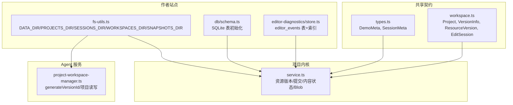
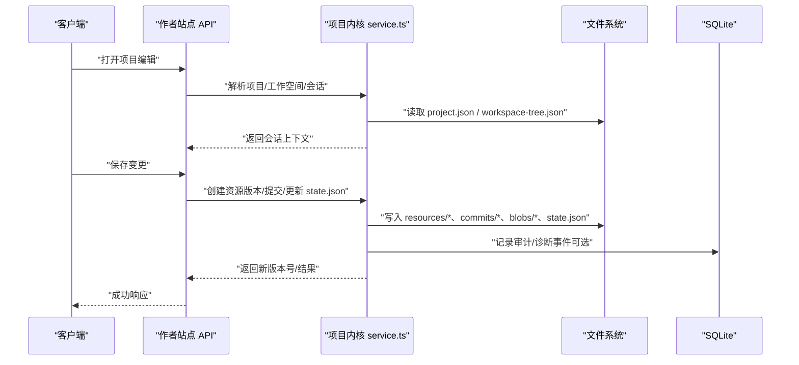
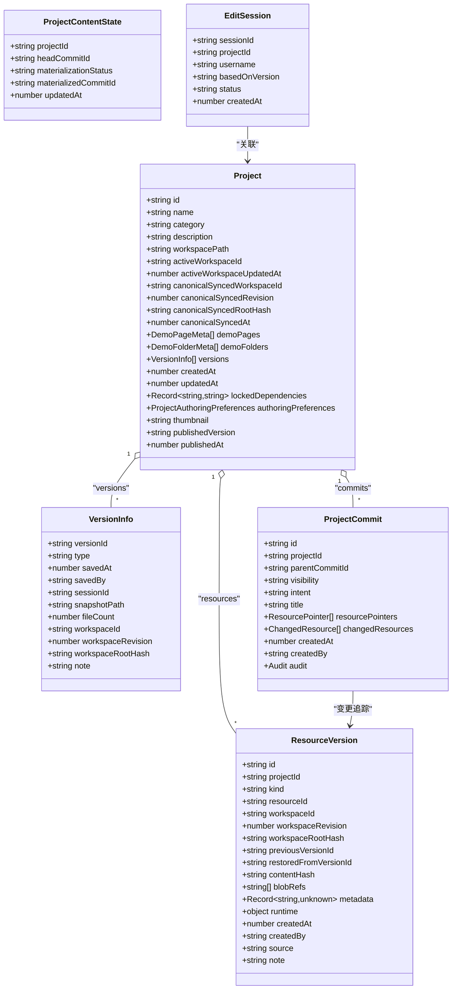
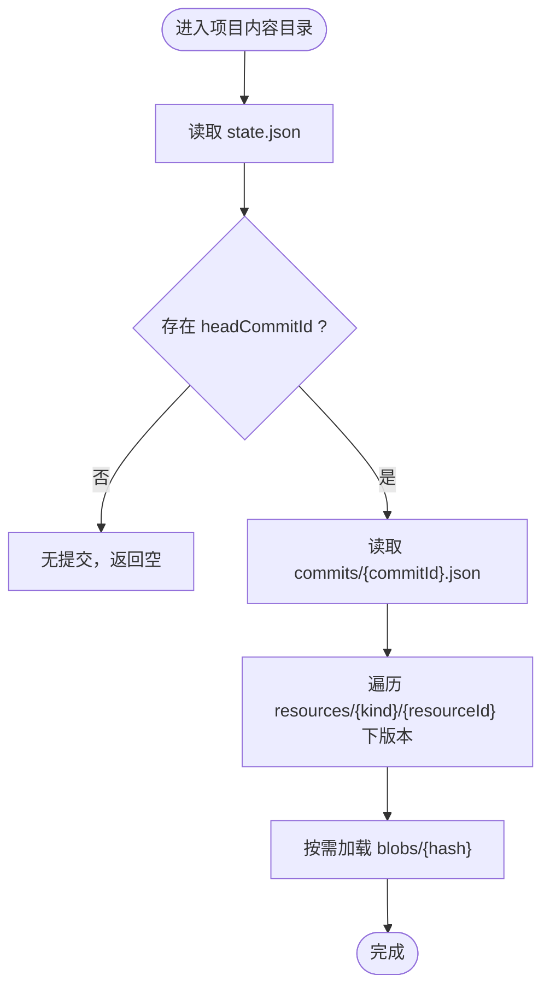
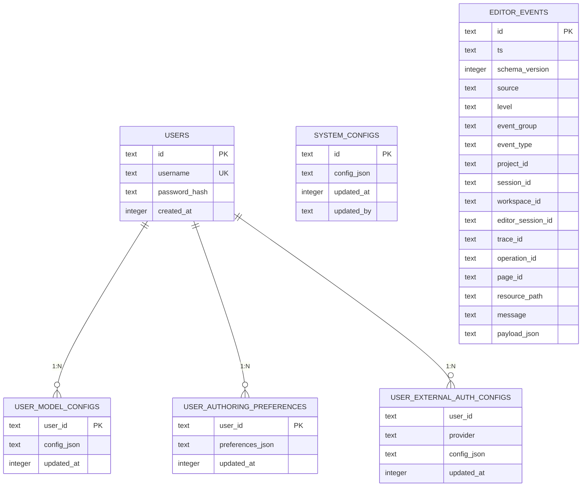
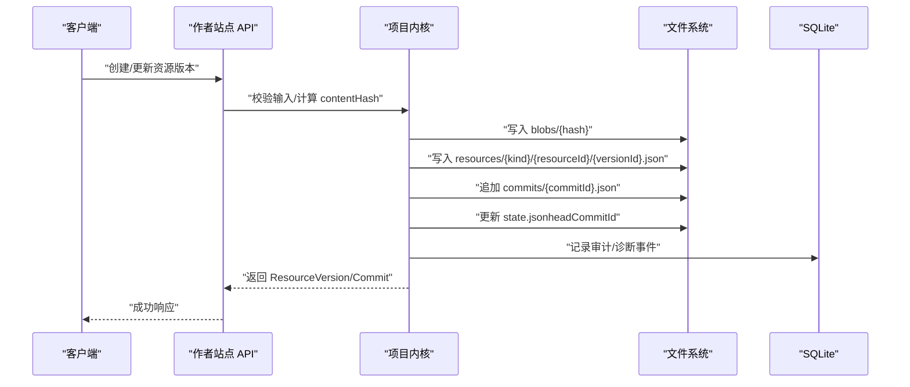
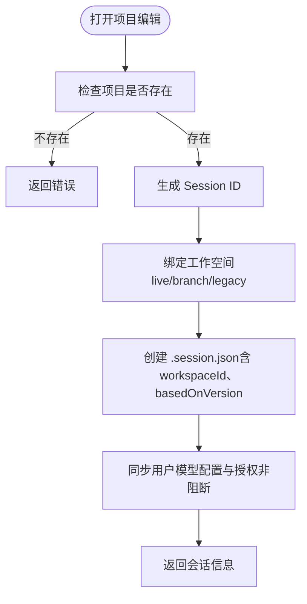
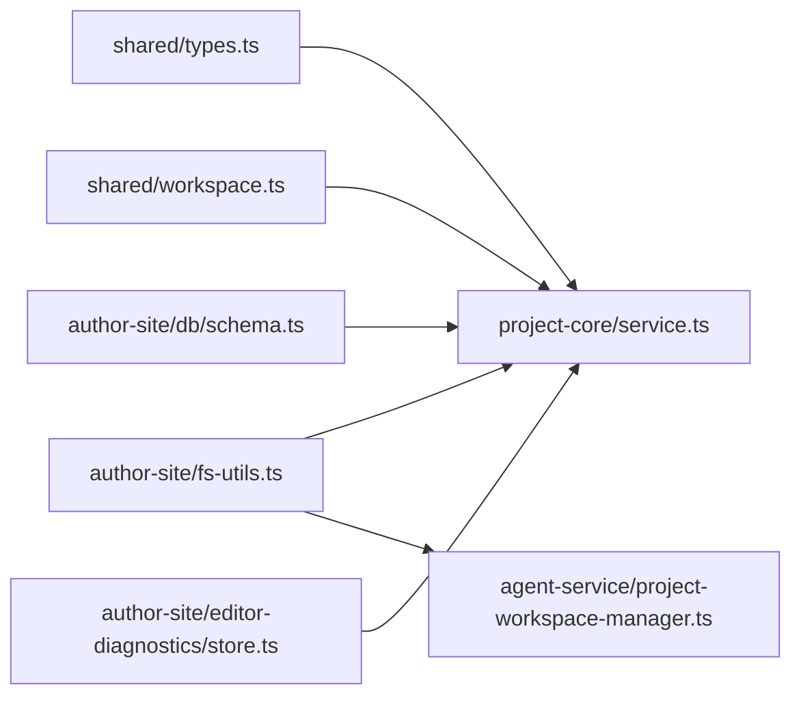

# 数据模型

<cite>
**本文引用的文件**   
- [packages/shared/src/types.ts](file://packages/shared/src/types.ts)
- [packages/shared/src/workspace.ts](file://packages/shared/src/workspace.ts)
- [packages/project-core/src/service.ts](file://packages/project-core/src/service.ts)
- [packages/author-site/src/lib/fs-utils.ts](file://packages/author-site/src/lib/fs-utils.ts)
- [packages/agent-service/src/workspace/project-workspace-manager.ts](file://packages/agent-service/src/workspace/project-workspace-manager.ts)
- [packages/author-site/src/lib/db/schema.ts](file://packages/author-site/src/lib/db/schema.ts)
- [packages/author-site/src/lib/editor-diagnostics/store.ts](file://packages/author-site/src/lib/editor-diagnostics/store.ts)
- [docs/项目文档/创作端/03-项目管理/技术/02_生命周期设计_v2.md](file://docs/项目文档/创作端/03-项目管理/技术/02_生命周期设计_v2.md)
- [docs/项目文档/创作端/03-项目管理/技术/03_项目工作区_v2.md](file://docs/项目文档/创作端/03-项目管理/技术/03_项目工作区_v2.md)
- [docs/项目文档/创作端/03-项目管理/技术/06_项目工作空间迁移方案.md](file://docs/项目文档/创作端/03-项目管理/技术/06_项目工作空间迁移方案.md)
- [docs/项目文档/项目总览.md](file://docs/项目文档/项目总览.md)
</cite>

## 目录
1. [引言](#引言)
2. [项目结构](#项目结构)
3. [核心组件](#核心组件)
4. [架构总览](#架构总览)
5. [详细组件分析](#详细组件分析)
6. [依赖关系分析](#依赖关系分析)
7. [性能考量](#性能考量)
8. [故障排查指南](#故障排查指南)
9. [结论](#结论)
10. [附录](#附录)

## 引言
本文件面向 Workbench 平台的数据模型，系统性梳理核心实体（Project、Workspace、Session、Version 等）的结构与字段含义，说明实体间关系映射、数据库表结构设计（SQLite）、文件系统存储结构（项目目录组织、快照格式、资源管理），并给出数据验证规则、业务约束、生命周期管理、迁移方案、备份恢复策略与性能调优建议。文档同时提供可视化图示与实际访问模式说明，帮助读者快速理解与落地使用。

## 项目结构
Workbench 将“元数据与版本”“会话与工作空间”“持久化存储”分层管理：
- 共享类型契约：定义 Project、Version、ResourceVersion、EditSession 等核心数据结构
- 项目内核服务：实现资源版本、提交、内容状态、Blob 存储等核心逻辑
- 作者站点工具：提供数据目录路径、快照路径、会话过期时间等运行时配置
- Agent 服务：负责版本 ID 生成、项目列表/详情读取、删除等
- SQLite 初始化：用户、系统配置、用户偏好、外部认证等辅助表
- 编辑器诊断事件：基于 SQLite + JSONL 双写与回退的事件存储

图表来源
- [packages/shared/src/types.ts:1-86](file://packages/shared/src/types.ts#L1-L86)
- [packages/shared/src/workspace.ts:1-526](file://packages/shared/src/workspace.ts#L1-L526)
- [packages/project-core/src/service.ts:4785-5002](file://packages/project-core/src/service.ts#L4785-L5002)
- [packages/author-site/src/lib/fs-utils.ts:44-113](file://packages/author-site/src/lib/fs-utils.ts#L44-L113)
- [packages/author-site/src/lib/db/schema.ts:1-51](file://packages/author-site/src/lib/db/schema.ts#L1-L51)
- [packages/author-site/src/lib/editor-diagnostics/store.ts:65-98](file://packages/author-site/src/lib/editor-diagnostics/store.ts#L65-L98)
- [packages/agent-service/src/workspace/project-workspace-manager.ts:1-49](file://packages/agent-service/src/workspace/project-workspace-manager.ts#L1-L49)

章节来源
- [docs/项目文档/项目总览.md:33-82](file://docs/项目文档/项目总览.md#L33-L82)

## 核心组件
本节聚焦核心数据实体的结构与职责边界。

- Project（项目）
  - 标识与基础信息：id、name、category、description、thumbnail
  - 工作空间关联：workspacePath、activeWorkspaceId、activeWorkspaceUpdatedAt、canonicalSynced* 系列字段
  - 页面与文件夹：demoPages、demoFolders
  - 版本历史：versions（最多保留数量由常量控制）
  - 发布与偏好：publishedVersion、publishedAt、authoringPreferences、lockedDependencies
  - 时间戳：createdAt、updatedAt

- VersionInfo（版本条目）
  - 版本标识 versionId、类型 type、保存时间 savedAt、保存者 savedBy
  - 关联会话 sessionId、快照路径 snapshotPath、文件数 fileCount
  - 工作空间溯源：workspaceId、workspaceRevision、workspaceRootHash
  - 可选备注 note

- ResourceVersion（资源版本）
  - 唯一 id、所属 projectId、资源种类 kind、资源标识 resourceId
  - 工作空间溯源：workspaceId、workspaceRevision、workspaceRootHash
  - 版本链：previousVersionId、restoredFromVersionId
  - 内容指纹 contentHash、引用集合 blobRefs、元数据 metadata
  - 运行时信息 runtime（schemaVersion、materializerVersion 等）
  - 创建信息 createdAt、createdBy、source、note

- ProjectCommit（提交）
  - 提交 id、projectId、parentCommitId、可见性 visibility、意图 intent
  - 标题 title、变更资源指针 resourcePointers、changedResources
  - 审计信息 audit（actorType、sessionId、workspaceId、workspaceRevision、workspaceRootHash、bypassedValidation）

- ProjectContentState（内容状态）
  - projectId、headCommitId、materializationStatus、materializedCommitId、updatedAt

- EditSession（编辑会话）
  - sessionId、projectId、username、basedOnVersion、status、createdAt
  - 旧链路兼容字段 tempWorkspace、workspacePath；新链路优先 workspaceId

- Workspace 相关
  - WorkspaceInfo、CreateWorkspaceOptions、FileChangeInfo、SnapshotInfo、CompareResult、WorkspaceMeta
  - DemoPageMeta、DemoFolderMeta、WorkspaceTree、AppGraph 等页面与图结构

章节来源
- [packages/shared/src/workspace.ts:261-283](file://packages/shared/src/workspace.ts#L261-L283)
- [packages/shared/src/workspace.ts:52-64](file://packages/shared/src/workspace.ts#L52-L64)
- [packages/shared/src/workspace.ts:92-116](file://packages/shared/src/workspace.ts#L92-L116)
- [packages/shared/src/workspace.ts:118-151](file://packages/shared/src/workspace.ts#L118-L151)
- [packages/shared/src/workspace.ts:388-397](file://packages/shared/src/workspace.ts#L388-L397)
- [packages/shared/src/types.ts:19-30](file://packages/shared/src/types.ts#L19-L30)

## 架构总览
Workbench 采用“文件系统为主、SQLite 为辅”的混合持久化架构：
- 项目与版本：以 JSON 与目录形式存储在 data/projects、data/snapshots、data/workspaces
- 会话元数据：data/sessions/{userId}/{projectId}/session-{ts}-{rand}/.session.json
- 资源版本与提交：data/projects/{projectId}/content/resources、commits、blobs、state.json
- 辅助数据：SQLite users/system_configs/user_model_configs/user_authoring_preferences/user_external_auth_configs
- 编辑器诊断事件：SQLite editor_events + JSONL 兜底

图表来源
- [packages/project-core/src/service.ts:4785-5002](file://packages/project-core/src/service.ts#L4785-L5002)
- [packages/author-site/src/lib/fs-utils.ts:44-113](file://packages/author-site/src/lib/fs-utils.ts#L44-L113)
- [packages/author-site/src/lib/db/schema.ts:1-51](file://packages/author-site/src/lib/db/schema.ts#L1-L51)

## 详细组件分析

### 实体类图（代码级）

图表来源
- [packages/shared/src/workspace.ts:261-283](file://packages/shared/src/workspace.ts#L261-L283)
- [packages/shared/src/workspace.ts:52-64](file://packages/shared/src/workspace.ts#L52-L64)
- [packages/shared/src/workspace.ts:92-116](file://packages/shared/src/workspace.ts#L92-L116)
- [packages/shared/src/workspace.ts:118-151](file://packages/shared/src/workspace.ts#L118-L151)
- [packages/shared/src/workspace.ts:388-397](file://packages/shared/src/workspace.ts#L388-L397)

章节来源
- [packages/shared/src/workspace.ts:1-526](file://packages/shared/src/workspace.ts#L1-L526)

### 文件系统存储结构
- 根数据目录 DATA_DIR（默认 data）
  - projects：项目元数据与基准工作区
  - sessions：会话元数据（按 userId/projectId/sessionId 组织）
  - workspaces：项目工作区与分支工作区
  - snapshots：版本快照（按 projectId/versionId 组织）
  - templates：模板
- 项目内容目录（每个项目独立）
  - content/state.json：当前头提交与物化状态
  - content/commits/*.json：提交记录
  - content/resources/{kind}/{resourceId}/{versionId}.json：资源版本清单
  - content/blobs/{hash[:2]}/{hash}：二进制对象（去重存储）
- 会话文件
  - sessions/{userId}/{projectId}/session-{timestamp}-{random}/.session.json

图表来源
- [packages/project-core/src/service.ts:4785-4840](file://packages/project-core/src/service.ts#L4785-L4840)
- [packages/project-core/src/service.ts:4890-4903](file://packages/project-core/src/service.ts#L4890-L4903)
- [packages/project-core/src/service.ts:4905-4926](file://packages/project-core/src/service.ts#L4905-L4926)
- [packages/project-core/src/service.ts:4965-4979](file://packages/project-core/src/service.ts#L4965-L4979)
- [packages/author-site/src/lib/fs-utils.ts:44-113](file://packages/author-site/src/lib/fs-utils.ts#L44-L113)

章节来源
- [packages/author-site/src/lib/fs-utils.ts:44-113](file://packages/author-site/src/lib/fs-utils.ts#L44-L113)
- [docs/项目文档/创作端/03-项目管理/技术/03_项目工作区_v2.md:52-93](file://docs/项目文档/创作端/03-项目管理/技术/03_项目工作区_v2.md#L52-L93)

### 数据库表结构设计（SQLite）
- 用户与配置
  - users：用户主键、用户名唯一、密码哈希、创建时间
  - system_configs：系统配置键值对
  - user_model_configs：用户模型配置（外键 users.id）
  - user_authoring_preferences：用户创作偏好（外键 users.id）
  - user_external_auth_configs：用户外部认证（复合主键 user_id+provider，外键 users.id）
- 编辑器诊断事件
  - editor_events：事件主键、时间戳、来源、级别、分组、类型、项目/会话/工作空间/编辑器会话/追踪/操作/页面/资源路径、消息、JSON 负载
  - 索引：按 project_id/ts、session_id/ts、editor_session_id/ts、trace_id/ts、operation_id/ts、workspace_id/ts、event_type/ts、event_group/ts

图表来源
- [packages/author-site/src/lib/db/schema.ts:1-51](file://packages/author-site/src/lib/db/schema.ts#L1-L51)
- [packages/author-site/src/lib/editor-diagnostics/store.ts:65-98](file://packages/author-site/src/lib/editor-diagnostics/store.ts#L65-L98)

章节来源
- [packages/author-site/src/lib/db/schema.ts:1-51](file://packages/author-site/src/lib/db/schema.ts#L1-L51)
- [packages/author-site/src/lib/editor-diagnostics/store.ts:65-98](file://packages/author-site/src/lib/editor-diagnostics/store.ts#L65-L98)

### 版本与资源版本流程（序列图）

图表来源
- [packages/project-core/src/service.ts:4905-4926](file://packages/project-core/src/service.ts#L4905-L4926)
- [packages/project-core/src/service.ts:4965-4979](file://packages/project-core/src/service.ts#L4965-L4979)
- [packages/author-site/src/lib/editor-diagnostics/store.ts:283-327](file://packages/author-site/src/lib/editor-diagnostics/store.ts#L283-L327)

章节来源
- [packages/project-core/src/service.ts:4785-5002](file://packages/project-core/src/service.ts#L4785-L5002)

### 会话与基于版本编辑（流程图）

图表来源
- [docs/项目文档/创作端/03-项目管理/技术/02_生命周期设计_v2.md:47-111](file://docs/项目文档/创作端/03-项目管理/技术/02_生命周期设计_v2.md#L47-L111)

章节来源
- [docs/项目文档/创作端/03-项目管理/技术/02_生命周期设计_v2.md:47-111](file://docs/项目文档/创作端/03-项目管理/技术/02_生命周期设计_v2.md#L47-L111)

## 依赖关系分析
- 类型契约到实现
  - shared/types.ts 与 shared/workspace.ts 为所有模块的类型来源
  - project-core/service.ts 消费这些类型进行资源版本、提交、内容状态、Blob 管理
- 路径与环境
  - author-site/fs-utils.ts 统一暴露 DATA_DIR、PROJECTS_DIR、SESSIONS_DIR、WORKSPACES_DIR、SNAPSHOTS_DIR
  - agent-service/project-workspace-manager.ts 使用相同 BASE_DIR 约定，并实现 generateVersionId
- 数据库
  - author-site/db/schema.ts 初始化用户与配置表
  - author-site/editor-diagnostics/store.ts 初始化 editor_events 表及索引，并提供写入/查询与 JSONL 回退

图表来源
- [packages/shared/src/types.ts:1-86](file://packages/shared/src/types.ts#L1-L86)
- [packages/shared/src/workspace.ts:1-526](file://packages/shared/src/workspace.ts#L1-L526)
- [packages/project-core/src/service.ts:1-200](file://packages/project-core/src/service.ts#L1-L200)
- [packages/author-site/src/lib/fs-utils.ts:44-113](file://packages/author-site/src/lib/fs-utils.ts#L44-L113)
- [packages/agent-service/src/workspace/project-workspace-manager.ts:1-49](file://packages/agent-service/src/workspace/project-workspace-manager.ts#L1-L49)
- [packages/author-site/src/lib/db/schema.ts:1-51](file://packages/author-site/src/lib/db/schema.ts#L1-L51)
- [packages/author-site/src/lib/editor-diagnostics/store.ts:65-98](file://packages/author-site/src/lib/editor-diagnostics/store.ts#L65-L98)

章节来源
- [packages/shared/src/types.ts:1-86](file://packages/shared/src/types.ts#L1-L86)
- [packages/shared/src/workspace.ts:1-526](file://packages/shared/src/workspace.ts#L1-L526)
- [packages/project-core/src/service.ts:1-200](file://packages/project-core/src/service.ts#L1-L200)
- [packages/author-site/src/lib/fs-utils.ts:44-113](file://packages/author-site/src/lib/fs-utils.ts#L44-L113)
- [packages/agent-service/src/workspace/project-workspace-manager.ts:1-49](file://packages/agent-service/src/workspace/project-workspace-manager.ts#L1-L49)
- [packages/author-site/src/lib/db/schema.ts:1-51](file://packages/author-site/src/lib/db/schema.ts#L1-L51)
- [packages/author-site/src/lib/editor-diagnostics/store.ts:65-98](file://packages/author-site/src/lib/editor-diagnostics/store.ts#L65-L98)

## 性能考量
- 版本与资源
  - 资源版本通过 contentHash 与 blobRefs 去重，减少重复存储
  - 提交与内容状态集中维护，避免全量扫描
- 索引优化
  - editor_events 针对常用查询维度建立组合索引（如 project_id+ts、session_id+ts、editor_session_id+ts、trace_id+ts、operation_id+ts、workspace_id+ts、event_type+ts、event_group+ts）
- 并发与锁
  - SQLite 启用 WAL 模式与 busy_timeout，降低写入阻塞
- 清理策略
  - 版本历史最大保留数量 MAX_VERSIONS_KEEP=50，定期清理旧版本
- I/O 路径
  - 统一通过 fs-utils.ts 获取路径，避免硬编码，便于缓存与监控

章节来源
- [packages/project-core/src/service.ts:4965-4979](file://packages/project-core/src/service.ts#L4965-L4979)
- [packages/author-site/src/lib/editor-diagnostics/store.ts:65-98](file://packages/author-site/src/lib/editor-diagnostics/store.ts#L65-L98)
- [packages/shared/src/workspace.ts:516-516](file://packages/shared/src/workspace.ts#L516-L516)
- [packages/author-site/src/lib/fs-utils.ts:44-113](file://packages/author-site/src/lib/fs-utils.ts#L44-L113)

## 故障排查指南
- 常见错误码
  - DEMO_NOT_FOUND、SESSION_NOT_FOUND、INVALID_REQUEST、FILE_READ_ERROR、FILE_WRITE_ERROR、SESSION_EXPIRED、VALIDATION_ERROR、AGENT_SERVICE_ERROR、WORKSPACE_STALE、UNAUTHORIZED、FORBIDDEN、INTERNAL_ERROR、PROJECT_NOT_FOUND、INVALID_FILE_TYPE、FILE_TOO_LARGE、UPLOAD_FAILED
- 诊断事件
  - 当 SQLite 不可用时自动回退至 JSONL，并在 diagnostics 中报告 sqliteUsed/jsonlFallbackUsed/dbUnavailable/eventGapDetected
- 定位步骤
  - 检查 DATA_DIR 权限与磁盘空间
  - 查看 editor_events 表或 JSONL 日志，过滤 project_id/session_id/editor_session_id
  - 核对 state.json 与 commits 一致性，确认 headCommitId 指向有效提交

章节来源
- [packages/shared/src/types.ts:48-86](file://packages/shared/src/types.ts#L48-L86)
- [packages/author-site/src/lib/editor-diagnostics/store.ts:283-327](file://packages/author-site/src/lib/editor-diagnostics/store.ts#L283-L327)
- [packages/author-site/src/lib/editor-diagnostics/store.ts:431-493](file://packages/author-site/src/lib/editor-diagnostics/store.ts#L431-L493)

## 结论
Workbench 的数据模型围绕“项目-工作空间-会话-版本-资源版本-提交-Blob”展开，采用文件系统作为主要持久化载体，SQLite 用于用户与诊断事件等结构化数据。通过严格的版本与资源版本管理、审计与诊断事件、以及完善的清理与回退机制，系统在可追溯性、一致性与可用性方面具备良好保障。

## 附录

### 数据验证规则与业务约束
- 版本保留上限：MAX_VERSIONS_KEEP=50，超出时清理最旧版本
- 资源版本完整性：contentHash 与 blobRefs 必须一致，blob 需存在
- 提交可见性与意图：visibility 与 intent 受控，审计字段必填
- 会话状态：editing/saved/discarded/archived，过期清理
- 工作空间溯源：workspaceId/workspaceRevision/workspaceRootHash 在关键动作中记录

章节来源
- [packages/shared/src/workspace.ts:516-516](file://packages/shared/src/workspace.ts#L516-L516)
- [packages/project-core/src/service.ts:4965-4979](file://packages/project-core/src/service.ts#L4965-L4979)
- [packages/shared/src/workspace.ts:118-151](file://packages/shared/src/workspace.ts#L118-L151)
- [docs/项目文档/创作端/03-项目管理/技术/06_项目工作空间迁移方案.md:27-74](file://docs/项目文档/创作端/03-项目管理/技术/06_项目工作空间迁移方案.md#L27-L74)

### 数据迁移方案
- 目标
  - 版本快照、版本追溯、资源恢复、自动清理、编辑溯源
- 关键变更
  - SessionMeta 扩展：新增 basedOnVersion、workbenchSessionId、workspaceId 等
  - 版本 ID 生成：基于现有 versions 最大值递增
  - 资源版本恢复：按 kind/resourceId/versionId 精确恢复
- 实施要点
  - 升级类型定义与后端逻辑
  - 前端增加版本历史页与恢复入口
  - 测试覆盖保存、版本号连续性、清理、恢复、并发、过期清理、元数据一致性

章节来源
- [docs/项目文档/创作端/03-项目管理/技术/06_项目工作空间迁移方案.md:27-74](file://docs/项目文档/创作端/03-项目管理/技术/06_项目工作空间迁移方案.md#L27-L74)
- [docs/项目文档/创作端/03-项目管理/技术/06_项目工作空间迁移方案.md:386-414](file://docs/项目文档/创作端/03-项目管理/技术/06_项目工作空间迁移方案.md#L386-L414)

### 备份与恢复策略
- 备份
  - 全量：data 目录打包（projects、sessions、workspaces、snapshots、templates、SQLite 文件）
  - 增量：仅备份 snapshots 与新增 commits/blobs
- 恢复
  - 先恢复 SQLite，再恢复文件系统
  - 校验 state.json 与 commits 一致性，必要时重建 headCommitId
- 发布产物
  - 从 snapshots 导出发布包，确保版本可重现

章节来源
- [docs/项目文档/创作端/03-项目管理/技术/06_项目工作空间迁移方案.md:386-414](file://docs/项目文档/创作端/03-项目管理/技术/06_项目工作空间迁移方案.md#L386-L414)

### 实际数据示例与访问模式
- 项目列表与详情
  - 列出项目：按更新时间倒序，包含 currentVersion、lastSavedAt、lastSavedBy、fileCount
  - 项目详情：返回 project、currentVersion、fileCount
- 版本历史
  - 返回 versions 倒序列表，totalVersions 统计总数
- 资源版本恢复
  - 指定 versionId 恢复单个资源，返回 newVersionId 与 files

章节来源
- [packages/agent-service/src/workspace/project-workspace-manager.ts:234-282](file://packages/agent-service/src/workspace/project-workspace-manager.ts#L234-L282)
- [packages/shared/src/workspace.ts:449-462](file://packages/shared/src/workspace.ts#L449-L462)
- [packages/shared/src/workspace.ts:474-482](file://packages/shared/src/workspace.ts#L474-L482)